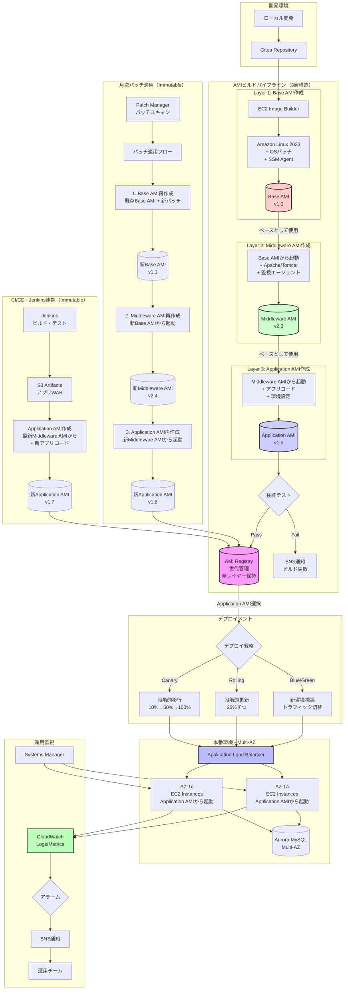
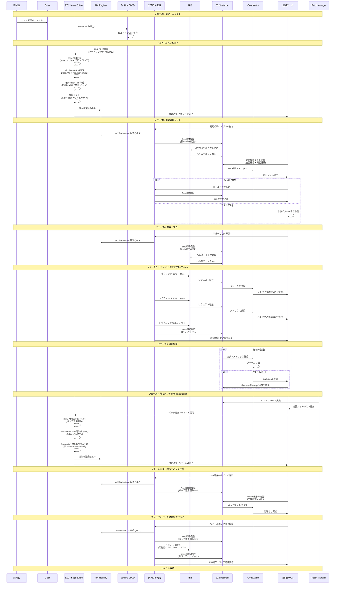
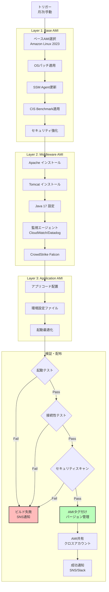
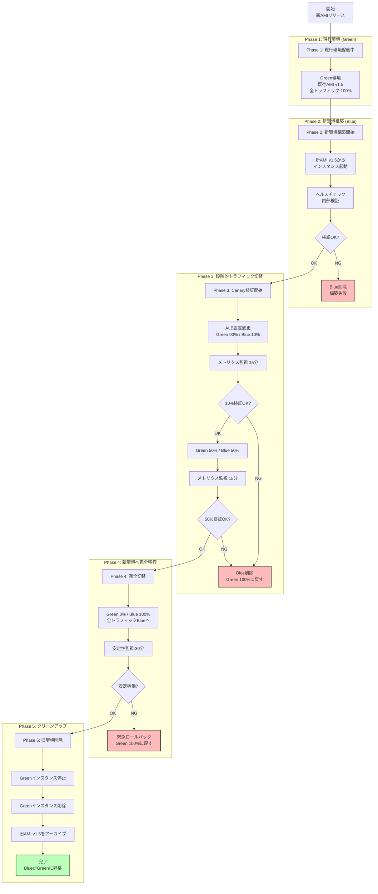
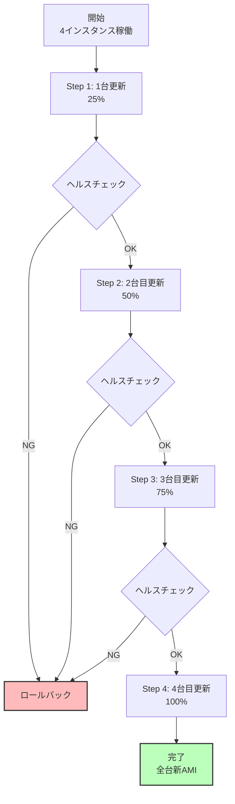
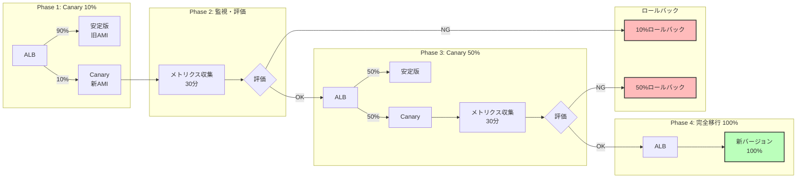
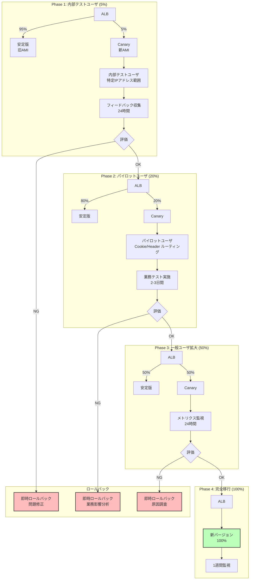
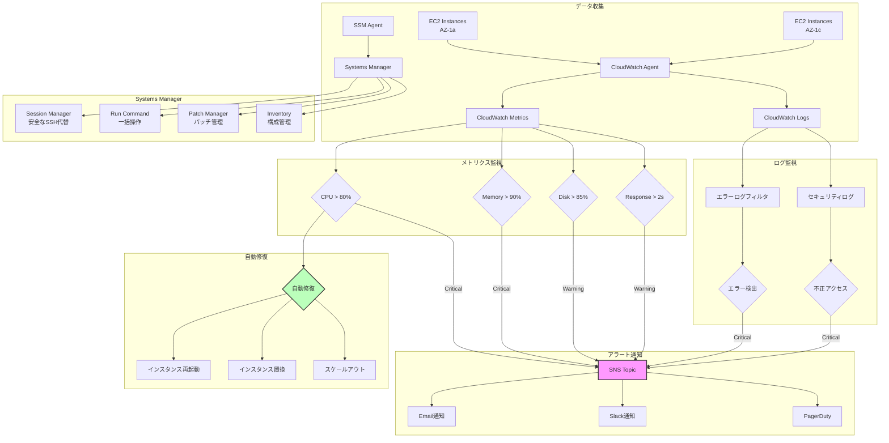

# EC2デプロイメント戦略・システム構成図

## 目次

- [EC2デプロイメント戦略・システム構成図](#ec2デプロイメント戦略システム構成図)
  - [目次](#目次)
  - [0. 設計方針](#0-設計方針)
    - [0.1 Immutableインフラストラクチャ](#01-immutableインフラストラクチャ)
  - [1. システム全体構成図](#1-システム全体構成図)
  - [2. AMIビルドプロセス](#2-amiビルドプロセス)
  - [3. デプロイメント戦略](#3-デプロイメント戦略)
    - [3.1 Blue/Greenデプロイメント](#31-bluegreenデプロイメント)
    - [3.2 Rollingデプロイメント](#32-rollingデプロイメント)
    - [3.3 Canaryデプロイメント](#33-canaryデプロイメント)
    - [3.4 ハイブリッドCanaryデプロイメント（ユーザテスト含む）](#34-ハイブリッドcanaryデプロイメントユーザテスト含む)
  - [4. パッチ適用プロセス（Immutable方式）](#4-パッチ適用プロセスimmutable方式)
  - [5. 運用監視・アラートフロー](#5-運用監視アラートフロー)
  - [6. デプロイメント戦略比較](#6-デプロイメント戦略比較)
  - [7. 技術スタック](#7-技術スタック)
    - [7.1 AWSサービス](#71-awsサービス)
    - [7.2 ミドルウェア・ツール](#72-ミドルウェアツール)
    - [7.3 デプロイメントツール](#73-デプロイメントツール)
  - [改版履歴](#改版履歴)

---

## 0. 設計方針

### 0.1 Immutableインフラストラクチャ

本システムは**Immutable Infrastructure（不変インフラストラクチャ）**の原則に基づいて設計されています。

**基本原則**:
- **EC2インスタンスは起動後に変更しない**: パッチ適用やアプリ更新時は既存インスタンスを変更せず、新しいAMIから新規インスタンスを起動
- **ゴールデンAMI**: すべての設定・ミドルウェア・アプリケーションを含む完全なAMIを作成
- **インスタンス置換**: 更新時は新AMIから新インスタンスを起動し、旧インスタンスを削除
- **再起動なし**: カーネル更新を含むパッチ適用でも、既存インスタンスの再起動は行わない

**メリット**:
- 環境の一貫性: 開発・ステージング・本番で同一のAMIを使用
- 高速ロールバック: 問題発生時は即座に旧AMIのインスタンスに切り戻し
- ドリフト防止: 手動変更による設定ドリフトを排除
- 監査性: すべての変更がAMIバージョンとして記録される

**運用への影響**:
- Systems Manager Patch Managerは「パッチスキャン」のみ使用（自動適用は使用しない）
- パッチ適用は新AMI作成 → Blue/Greenデプロイメントで実施
- 緊急対応時も一時的なSSH接続での手動パッチは行わず、AMI再作成を実施

---

## 1. システム全体構成図

EC2のライフサイクル全体（開発→ビルド→デプロイ→運用→パッチ適用）を示す包括的な構成図。

### 1.1 ライフサイクル全体像（構成図）



**主要コンポーネント（Immutableフロー）**:
- **開発環境**: Gitea（バージョン管理）
- **AMIビルド（3層構造）**: EC2 Image Builder
  - **Layer 1**: Base AMI作成（Amazon Linux 2023 + OSパッチ）
  - **Layer 2**: Middleware AMI作成（**Base AMIから**起動 + Apache/Tomcat）
  - **Layer 3**: Application AMI作成（**Middleware AMIから**起動 + アプリコード）
  - 各レイヤーは前のレイヤーのAMIを**ベースとして使用**して作成
- **AMI Registry**: 全レイヤーのAMIを世代管理（Base, Middleware, Application）
- **デプロイ**: Blue/Green, Rolling, Canary（戦略選択可能、Immutable原則）
  - AMI Registry → Application AMI選択 → デプロイ戦略 → ALB → EC2インスタンス置換
- **本番環境**: Multi-AZ構成、ALB配下のEC2群（Application AMIから起動）
- **運用監視**: CloudWatch、Systems Manager、SNS連携
- **月次パッチ適用**: 
  1. Base AMI再作成（既存Base AMI + 新パッチ）
  2. Middleware AMI再作成（**新Base AMIから**）
  3. Application AMI再作成（**新Middleware AMIから**）
  4. AMI Registry → デプロイ戦略
- **CI/CD**: Jenkins（ビルド・テスト） → S3 → Application AMI作成（**最新Middleware AMIから** + 新アプリ） → AMI Registry → デプロイ戦略

**AMI作成の依存関係**:
```
Base AMI (v1.0) 
    ↓ ベースとして使用
Middleware AMI (v2.3) 
    ↓ ベースとして使用
Application AMI (v1.5)
    ↓ デプロイ
EC2インスタンス
```

**重要な原則**: 
- すべての変更はAMI Registry経由で実施
- Middleware AMIは常に最新（または指定）のBase AMIから作成
- Application AMIは常に最新（または指定）のMiddleware AMIから作成
- 既存インスタンスへの直接デプロイは行わない

### 1.2 ライフサイクル全体像（シーケンス図）

時系列でのEC2ライフサイクルの流れを示すシーケンス図。各フェーズの相互作用を明確化。



**シーケンス図の各フェーズ説明**:

| フェーズ | 概要 | 所要時間 | 主要アクター |
|---------|------|---------|------------|
| **1. 開発・コミット** | コード変更のコミットとCI開始 | 数分 | 開発者、Jenkins |
| **2. AMIビルド** | 3層AMI作成（Base→Middleware→Application） | 30-60分 | EC2 Image Builder |
| **3. 開発環境テスト** | 新AMIを開発環境でテスト・動作確認 | 30-60分 | 運用チーム、デプロイ戦略 |
| **4. 本番デプロイ** | 新AMIから本番環境構築 | 10-15分 | デプロイ戦略、EC2 |
| **5. トラフィック切替** | 段階的切替（10%→50%→100%） | 30-45分 | ALB、CloudWatch |
| **6. 運用監視** | 継続的なメトリクス監視 | 継続的 | CloudWatch、運用チーム |
| **7. 月次パッチ適用** | パッチ適用済みAMI作成 | 30-60分 | Patch Manager、Image Builder |
| **8. 開発環境でパッチ検証** | パッチ適用後の動作確認 | 30-60分 | 運用チーム |
| **9. パッチ適用後デプロイ** | 新AMIで環境置換 | 30-45分 | デプロイ戦略、EC2 |

**シーケンス図のポイント**:
- **Immutable原則**: 全てのフェーズで既存EC2インスタンスを変更せず、新AMIから新インスタンスを起動
- **開発環境での検証**: 新AMI作成後、必ず開発環境でテスト実施（通常デプロイ・パッチ適用共通）
- **段階的切替**: トラフィック切替は必ず段階的（10%→50%→100%）に実施
- **継続的監視**: デプロイ後もCloudWatchで継続的に監視
- **月次サイクル**: パッチ適用も同じライフサイクルを経由（AMIビルド→開発環境テスト→デプロイ）

---

## 2. AMIビルドプロセス

EC2 Image Builderを使用した3層AMI（Base→Middleware→Application）の自動ビルドプロセス。



**AMI命名規則**:
```
命名規則:
{プロジェクトコード：idhub-40}-{ロール:web|hlp}{レイヤー}-{バージョン}-{作成日時}

例:
- idhub-40-web-base-v1.0-20251115
- idhub-40-web-middleware-v2.3-20251115
- idhub-40-web-app-v1.5-20251115
- idhub-40-hlp-base-v1.0-20251115
- idhub-40-hlp-middleware-v2.3-20251115
- idhub-40-hlp-app-v1.5-20251115

バージョニング:
- メジャー.マイナー形式
- メジャー: OSバージョンアップ、大規模変更
- マイナー: ミドルウェア更新、セキュリティパッチ
```

**ビルド頻度**:
- **定期実行**: 月次（第2水曜日 03:00 JST）
- **手動実行**: 緊急パッチ適用時、アプリ更新時

**保持ポリシー**:
- 世代数: 10世代（過去3-4ヶ月分）
- 自動削除: 10世代超過時に最古AMIを削除

---

## 3. デプロイメント戦略

### 3.1 Blue/Greenデプロイメント

ゼロダウンタイムでの環境切替を実現する戦略。本番環境での推奨方式。



**各Phaseの説明**:
- **Phase 1**: 現行環境が全トラフィックを処理（新AMIリリース前）
- **Phase 2**: 新AMIからBlue環境を構築、ヘルスチェック・内部検証
- **Phase 3**: Canary方式で段階的にトラフィックをBlueへ移行（10% → 50%）
- **Phase 4**: 全トラフィックをBlueへ切替（100%）、安定性確認
- **Phase 5**: 旧Green環境を削除、Blueが新Greenに昇格

**実行手順**:
1. **新環境構築**: 新AMIから全インスタンス起動
2. **検証**: ヘルスチェック、smoke test実施
3. **段階的切替**: 10% → 50% → 100%トラフィック移行
4. **監視**: 30分間の安定性確認
5. **旧環境削除**: Greenインスタンスの停止・削除

**ロールバック**: ALBターゲットグループを旧環境に即座に切り戻し（3分以内）

---

### 3.2 Rollingデプロイメント

段階的にインスタンスを更新する戦略。開発・ステージング環境での推奨方式。



**更新設定**:
- バッチサイズ: 25%（1台ずつ）
- 待機時間: 各ステップ後5分
- 総所要時間: 約30分

**メリット**:
- リソース効率が高い（追加インスタンス不要）
- 段階的なリスク分散

**デメリット**:
- 一時的にキャパシティ減少（75%稼働時）
- ロールバックに時間がかかる

---

### 3.3 Canaryデプロイメント

少量のトラフィックで新バージョンを検証する戦略。リスクを最小化。



**段階的移行**:
1. **10% Canary**: 30分監視
2. **50% Canary**: 30分監視
3. **100% 移行**: 完全切替

**評価指標**:
- エラー率: < 0.1%
- レスポンスタイム: < 2秒
- CPU使用率: ベースライン±10%以内
- メモリ使用率: ベースライン±10%以内

---

### 3.4 ハイブリッドCanaryデプロイメント（ユーザテスト含む）

Canary戦略に特定ユーザグループによる実運用テストを組み合わせた、最も慎重なデプロイメント方式。大規模変更や重要機能リリース時に推奨。



**段階的移行とユーザテスト**:

| フェーズ | トラフィック | 対象ユーザ | 期間 | 評価内容 |
|---------|-------------|-----------|------|---------|
| **Phase 1** | 5% | 内部テストユーザ（開発/QAチーム） | 24時間 | 基本機能動作、明らかなバグ検出 |
| **Phase 2** | 20% | パイロットユーザ（協力部署） | 2-3日 | 実業務での動作確認、ワークフロー検証 |
| **Phase 3** | 50% | 一般ユーザ（無作為） | 24時間 | 負荷分散、パフォーマンス評価 |
| **Phase 4** | 100% | 全ユーザ | 1週間監視 | 安定性確認、長期監視 |

**ユーザルーティング設定**:

```yaml
Phase 1 - 内部テストユーザ (5%):
  ルーティング方法: 内部通信（AWS内部ネットワーク）
  実装オプション:
    案1: 内部ALB使用
      - 内部ALBを作成し、Canaryインスタンスのみをターゲット
      - VPC内からのみアクセス許可
      - 特定のIPアドレス範囲に制限（開発ネットワーク: 10.0.0.0/16）
    
    案2: ヘッダー識別子使用
      - リスナールールで特定ヘッダーを検証
      - 例: X-Blue-Verification: true
      - ヘッダーなしのリクエストは安定版にルーティング
    
    案3: SSMポートフォワーディング + 内部ALB
      - Session Managerのポートフォワーディング機能使用
      - ローカル8080 → Canaryインスタンス → 内部ALB
      - 運用チームのみアクセス可能
  
  推奨: 案2（ヘッダー識別子）
    理由: 現環境で実績あり。zerospaceでの問題も解消済み。追加リソース不要、設定が簡単、即座にロールバック可能
  
  ALB設定: リスナールール優先度1（最優先）

Phase 2 - パイロットユーザ (20%):
  ルーティング方法: Cookie/Header
  設定例:
    - Cookie: canary-user=enabled
    - Header: X-Canary-Group: pilot
  実装: ユーザマスタで指定、ログイン時にCookie付与
  ALB設定: リスナールール優先度2

Phase 3 - 一般ユーザ拡大 (50%):
  ルーティング方法: ランダム重み付け
  設定例:
    - ターゲットグループA (安定版): 重み50
    - ターゲットグループB (Canary): 重み50
  ALB設定: デフォルトルール

Phase 4 - 完全移行 (100%):
  すべてのトラフィックを新バージョンに切替
```

**評価基準**:

```yaml
Phase 1評価 (内部テストユーザ):
  必須条件:
    - 主要機能の動作確認: すべてOK
    - エラー率: 0%
    - クリティカルバグ: なし
  オプション:
    - パフォーマンス改善の確認
    - UI/UX改善の妥当性確認

Phase 2評価 (パイロットユーザ):
  必須条件:
    - 業務ワークフロー完遂率: 100%
    - ユーザからの重大問題報告: なし
    - エラー率: < 0.1%
    - レスポンスタイム: < 2秒
  オプション:
    - ユーザ満足度スコア: 4/5以上
    - 業務効率改善の確認

Phase 3評価 (一般ユーザ):
  必須条件:
    - CPU使用率: ベースライン±10%以内
    - メモリ使用率: ベースライン±10%以内
    - エラー率: < 0.1%
    - 新旧バージョン間のパフォーマンス差: ±5%以内
  オプション:
    - スループット維持
    - 同時接続数の安定性

Phase 4評価 (完全移行):
  必須条件:
    - 1週間の安定稼働
    - インシデント: なし
    - ロールバック不要
  最終承認:
    - 旧環境削除の承認
```

**実装例（ALBリスナールール）**:

```yaml
# リスナールール設定
ListenerRules:
  # Priority 1: 内部テストユーザ (5%) - ヘッダー識別子方式
  - Priority: 1
    Conditions:
      - Field: http-header
        HttpHeaderConfig:
          HttpHeaderName: X-Blue-Verification
          Values:
            - "true"
    Actions:
      - Type: forward
        TargetGroupArn: !Ref CanaryTargetGroup
  
  # Priority 1-alt: 内部テストユーザ (5%) - VPC内部ALB方式（オプション）
  # 内部ALB用の別スタック
  - Priority: 1
    Conditions:
      - Field: source-ip
        Values:
          - 10.0.0.0/16        # VPC内部ネットワーク
    Actions:
      - Type: forward
        TargetGroupArn: !Ref CanaryTargetGroup
  
  # Priority 2: パイロットユーザ (20%)
  - Priority: 2
    Conditions:
      - Field: http-header
        HttpHeaderConfig:
          HttpHeaderName: X-Canary-Group
          Values:
            - pilot
    Actions:
      - Type: forward
        TargetGroupArn: !Ref CanaryTargetGroup
  
  # Priority 3: 一般ユーザ (50% Canary)
  - Priority: 3
    Conditions:
      - Field: path-pattern
        Values:
          - /*
    Actions:
      - Type: forward
        ForwardConfig:
          TargetGroups:
            - TargetGroupArn: !Ref StableTargetGroup
              Weight: 50
            - TargetGroupArn: !Ref CanaryTargetGroup
              Weight: 50
          TargetGroupStickinessConfig:
            Enabled: true
            DurationSeconds: 3600  # セッション維持
```

**メリット**:
- **リスク最小化**: 段階的なユーザ露出で問題の早期検出
- **実業務検証**: パイロットユーザによる実運用での動作確認
- **柔軟なロールバック**: 各フェーズで即座に戻せる
- **ユーザ影響制御**: 問題発生時の影響範囲を限定

**デメリット**:
- **時間コスト**: 完全移行まで4-7日必要
- **運用負荷**: ユーザグループ管理、フィードバック収集が必要
- **複雑な設定**: ALBルーティングルールの綿密な設計が必要

**適用シナリオ**:
- メジャーバージョンアップ（UI刷新、アーキテクチャ変更）
- 重要な業務機能の追加・変更
- パフォーマンスチューニングの効果検証
- 新しいミドルウェア/ライブラリへの移行

---

## 4. パッチ適用プロセス（Immutable方式）

Systems Manager Patch ManagerとEC2 Image Builderを使用した月次パッチ適用の自動化フロー。

```mermaid
graph TB
    START[月次パッチサイクル<br/>第1水曜日] --> SCAN[Patch Manager<br/>パッチスキャン]
    SCAN --> ANALYZE[パッチ分析<br/>必要なパッチ特定]
    
    subgraph "Phase 1: AMI作成（第2水曜日）"
        ANALYZE --> BASE_BUILD[EC2 Image Builder<br/>Base AMI作成<br/>パッチ適用済み]
        BASE_BUILD --> BASE_TEST[起動テスト]
        BASE_TEST --> BASE_CHECK{検証OK?}
        BASE_CHECK -->|NG| ROLLBACK_BASE[Base AMI作成失敗<br/>SNS通知]
        BASE_CHECK -->|OK| MID_BUILD[Middleware AMI作成<br/>新Base AMIから]
        MID_BUILD --> APP_BUILD[Application AMI作成<br/>新Middleware AMIから]
        APP_BUILD --> AMI_NEW[(新AMI v1.6<br/>AMI Registry登録)]
    end
    
    subgraph "Phase 2: 開発環境デプロイ（第2水曜日）"
        AMI_NEW --> DEV_DEPLOY[開発環境へデプロイ<br/>新AMIからインスタンス起動]
        DEV_DEPLOY --> DEV_CHECK{動作確認}
        DEV_CHECK -->|OK| DEV_OK[開発環境OK]
        DEV_CHECK -->|NG| ROLLBACK_DEV[ロールバック<br/>旧AMIで再デプロイ]
    end
    
    subgraph "Phase 3: ステージング環境検証（Week 2）"
        DEV_OK --> STG_DEPLOY[ステージング環境へデプロイ<br/>新AMIからインスタンス起動]
        STG_DEPLOY --> STG_TEST[負荷テスト<br/>2-3日間]
        STG_TEST --> STG_CHECK{検証OK?}
        STG_CHECK -->|OK| STG_APPROVE[AMI承認<br/>本番デプロイ可能]
        STG_CHECK -->|NG| ROLLBACK_STG[ロールバック<br/>AMI再作成]
    end
    
    subgraph "Phase 4: 本番環境デプロイ（Week 3）"
        STG_APPROVE --> PRD_PLAN[変更管理承認]
        PRD_PLAN --> PRD_MAINT[メンテナンスウィンドウ<br/>02:00-06:00 JST]
        PRD_MAINT --> PRD_BG[Blue/Greenデプロイ<br/>新AMIからインスタンス起動]
        PRD_BG --> PRD_CANARY[Canary 10%<br/>30分監視]
        PRD_CANARY --> PRD_CHECK{メトリクス評価}
        PRD_CHECK -->|OK| PRD_FULL[完全切替 100%]
        PRD_CHECK -->|NG| ROLLBACK_PRD[即時ロールバック<br/>旧AMIで再デプロイ]
        PRD_FULL --> PRD_MONITOR[24時間監視]
    end
    
    subgraph "Phase 5: 後処理"
        PRD_MONITOR --> REPORT[パッチレポート作成]
        REPORT --> CLEANUP[旧AMI削除<br/>10世代超過分]
        CLEANUP --> COMPLETE[完了]
    end
    
    style COMPLETE fill:#bfb,stroke:#333,stroke-width:2px
    style ROLLBACK_BASE fill:#fbb,stroke:#333,stroke-width:2px
    style ROLLBACK_DEV fill:#fbb,stroke:#333,stroke-width:2px
    style ROLLBACK_STG fill:#fbb,stroke:#333,stroke-width:2px
    style ROLLBACK_PRD fill:#fbb,stroke:#333,stroke-width:2px
```



**各Phaseの説明（Immutable方式）**:
- **Phase 1**: パッチ適用済み新AMI作成（Base → Middleware → Application）
- **Phase 2**: 開発環境で新AMIからインスタンス起動・検証
- **Phase 3**: ステージング環境で負荷テスト（2-3日間）
- **Phase 4**: 本番環境でBlue/Greenデプロイ（新AMIからインスタンス起動 → 旧インスタンス削除）
- **Phase 5**: レポート作成・旧AMIクリーンアップ

**重要**: 既存インスタンスへのパッチ適用・再起動は一切行わない。全て新AMIからのインスタンス置換。

**スケジュール**:
```yaml
Week 1 (第3木曜):
  - 開発環境: パッチ適用・検証
  
Week 2 (火曜以降):
  - ステージング環境: 負荷テスト・2-3日間検証

Week 3 (月火):
  - 本番環境: Blue/Greenデプロイ
  - メンテナンスウィンドウ: 02:00-06:00 JST
```

**自動確認項目**:
- EC2インスタンスステータス: OK
- ELBヘルスチェック: Healthy
- Systems Managerエージェント: Online
- CPU/メモリ使用率: ベースライン±10%以内

**ロールバック手順**:
- **即時**: ALBターゲットグループ切り戻し（3分以内）
- **完全**: 1世代前AMIから再デプロイ（30分以内）

---

## 5. 運用監視・アラートフロー

CloudWatchとSystems Managerを統合した包括的な監視体制。



**監視指標**:
```yaml
CPU使用率:
  - Warning: > 70%
  - Critical: > 80%
  - 期間: 5分間継続

メモリ使用率:
  - Warning: > 85%
  - Critical: > 90%
  - 期間: 5分間継続

ディスク使用率:
  - Warning: > 80%
  - Critical: > 85%
  - 期間: 10分間継続

レスポンスタイム:
  - Warning: > 2秒
  - Critical: > 5秒
  - 期間: 3分間継続

エラー率:
  - Warning: > 0.1%
  - Critical: > 1%
  - 期間: 5分間継続
```

**自動修復アクション**:
- **CPU高負荷**: インスタンス再起動 → 改善なしで置換
- **メモリ高負荷**: インスタンス置換
- **ディスク容量**: ログローテーション → 改善なしでアラート
- **エラー率高**: 自動ロールバック（Blue/Greenの場合）

---

## 6. デプロイメント戦略比較

4つのデプロイ戦略の特性を比較。環境・状況に応じて選択。

| 項目 | Blue/Green | Rolling | Canary | ハイブリッドCanary |
|------|-----------|---------|--------|-------------------|
| **ダウンタイム** | ゼロ | ゼロ | ゼロ | ゼロ |
| **リソースコスト** | 高（2倍必要） | 低（追加不要） | 中（一部追加） | 中～高（一部追加+長期保持） |
| **デプロイ時間** | 短（15分） | 中（30分） | 長（90分） | 最長（4-7日） |
| **ロールバック速度** | 即座（3分） | 遅い（30分） | 即座（3分） | 即座（3分） |
| **リスク** | 低 | 中 | 最低 | 最低 |
| **複雑さ** | 低 | 中 | 高 | 最高 |
| **適用環境** | 本番推奨 | 開発/Stg | 慎重な本番 | 重要な本番変更 |
| **トラフィック影響** | 一括切替 | 段階的減少 | 段階的検証 | 段階的+ユーザ選択 |
| **検証時間** | 短い | 各ステップ5分 | 各段階30分 | 各フェーズ24時間～3日 |
| **障害影響範囲** | 切替後100% | 更新済み部分のみ | Canary部分のみ | 限定ユーザのみ |
| **ユーザテスト** | なし | なし | なし | あり（内部+パイロット） |
| **実業務検証** | なし | なし | メトリクスのみ | 業務ワークフロー検証 |

**推奨用途**:
- **Blue/Green**: 本番環境の通常デプロイ、パッチ適用、定期リリース
- **Rolling**: 開発・ステージング環境、リソース制約時
- **Canary**: 重要な本番変更、新機能リリース、リスク最小化が必須の場合
- **ハイブリッドCanary**: メジャーバージョンアップ、UI刷新、アーキテクチャ変更、重要業務機能の追加

---

## 7. 技術スタック

本システムで使用する主要な技術とサービス。

### 7.1 AWSサービス

| カテゴリ | サービス | 用途 |
|---------|---------|------|
| **コンピューティング** | EC2 | アプリケーション実行基盤 |
| | EC2 Image Builder | AMI自動ビルドパイプライン |
| **ネットワーク** | VPC | ネットワーク分離 |
| | ALB | 負荷分散、ヘルスチェック |
| | Route 53 | DNSルーティング |
| **データベース** | Aurora MySQL | Multi-AZ RDS |
| **ストレージ** | S3 | アーティファクト保存 |
| | EBS | インスタンスストレージ |
| **デプロイ** | CodeDeploy | Blue/Greenデプロイ自動化 |
| | Systems Manager | パッチ管理、セッション管理 |
| **監視** | CloudWatch | ログ・メトリクス収集 |
| | SNS | アラート通知 |
| **セキュリティ** | IAM | アクセス制御 |
| | Secrets Manager | 認証情報管理 |
| | KMS | 暗号化キー管理 |

### 7.2 ミドルウェア・ツール

| カテゴリ | ツール | バージョン | 用途 |
|---------|--------|----------|------|
| **OS** | Amazon Linux | 2023 | ベースOS（移行先）|
| **Webサーバー** | Apache HTTP Server | 2.4 | リバースプロキシ |
| **APサーバー** | Apache Tomcat | 10.x | Java実行環境 |
| **Java** | OpenJDK | 17 | アプリケーション実行 |
| **バージョン管理** | Gitea | Latest | ソースコード管理 |
| **CI/CD** | Jenkins | Latest | ビルド・テスト自動化 |
| **監視エージェント** | CloudWatch Agent | Latest | メトリクス収集 |
| | Datadog Agent | Latest | APM監視 |
| **セキュリティ** | CrowdStrike Falcon | Latest | EDR |

### 7.3 デプロイメントツール

| ツール | 用途 | 実行タイミング |
|-------|------|--------------|
| **EC2 Image Builder** | AMI自動ビルド | 月次定期実行 |
| **Ansible** | プロビジョニング | AMIビルド時 |
| **Jenkins** | CI/CDパイプライン | コミット時 |
| **CodeDeploy** | Blue/Greenデプロイ | リリース時 |
| **Systems Manager** | パッチ適用、運用タスク | 月次・随時 |

---

## 改版履歴

| 版数 | 日付 | 改版内容 | 作成者 |
|------|------|----------|--------|
| 1.0 | 2025-11-17 | 初版作成 | - |
