# マイグレーション検証プロセス

## 目次
- [1. プロジェクト概要](#1-プロジェクト概要)
- [2. 全体フロー図](#2-全体フロー図)
- [3. プロジェクトフェーズとドキュメント体系](#3-プロジェクトフェーズとドキュメント体系)
- [4. 各フェーズの詳細](#4-各フェーズの詳細)
- [5. リフト&シフト特有の注意点](#5-リフトシフト特有の注意点)
- [6. 推奨タイムライン](#6-推奨タイムライン)

---

## 1. プロジェクト概要

### 1.1 移行の目的
オンプレミス既存環境のWEBシステムをAWS環境へリフト&シフトで移行する

### 1.2 移行方針
- **基本方針**: リフト（Lift）を主体とし、一部シフト（Shift）を実施
- **WEBサーバ**: EC2インスタンスへ移行（当初Fargate検討から変更）
- **バッチサーバ**: Lambda関数へ移行（シフト）
- **データベース**: RDS Aurora MySQL へ移行（シフト）
- **移行戦略**: 段階的移行を推奨（開発→ステージング→本番）

---

## 2. 全体フロー図

### 2.0 プロジェクト全体ガントチャート

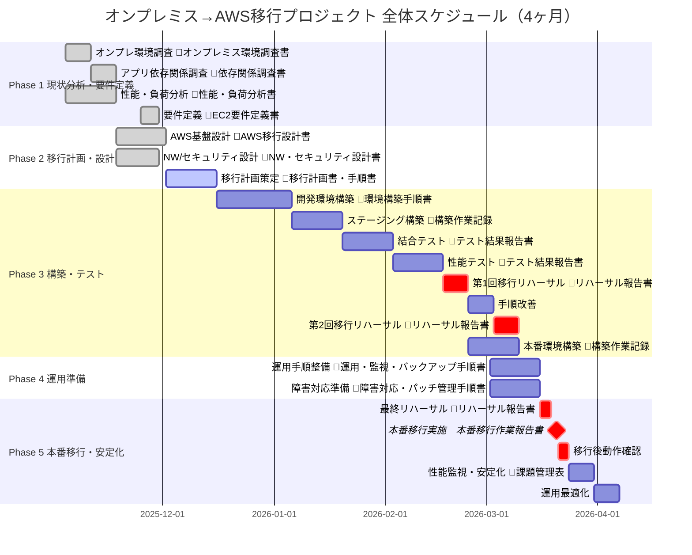

### 2.1 プロジェクト全体の流れ

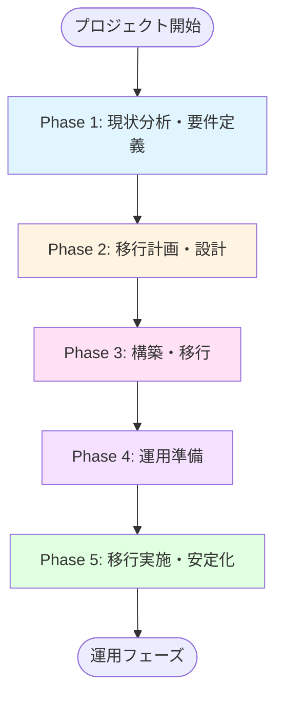

### 2.2 詳細プロセスフロー

```mermaid
graph TB
    subgraph "Phase 1: 現状分析・要件定義 (2-4週間)"
        A1[オンプレ環境調査<br/>📄オンプレミス環境調査書] --> A2[アプリケーション<br/>依存関係調査<br/>📄アプリケーション依存関係調査書]
        A2 --> A3[性能・負荷分析<br/>📄性能・負荷分析書]
        A3 --> A4[要件定義書作成<br/>📄EC2要件定義書]
    end

    subgraph "Phase 2: 移行計画・設計 (4-6週間)"
        B1[EC2設計<br/>インスタンスタイプ選定<br/>📄AWS移行設計書] --> B2[Lambda移行設計<br/>バッチ処理分析<br/>📄AWS移行設計書]
        B2 --> B3[RDS Aurora設計<br/>移行方式検討<br/>📄AWS移行設計書]
        B3 --> B4[ネットワーク設計<br/>VPC/VPN設計<br/>📄ネットワーク設計書]
        B4 --> B5[セキュリティ設計<br/>IAM/WAF/EDR<br/>📄セキュリティ設計書]
        B5 --> B6[移行計画書作成<br/>スケジュール策定<br/>📄移行計画書<br/>📄移行手順書<br/>📄移行マッピング表]
    end

    subgraph "Phase 3: 構築・移行 (6-10週間)"
        C1[開発環境構築<br/>📄環境構築手順書<br/>📄パラメータシート] --> C2[単体テスト<br/>📄テスト仕様書]
        C2 --> C3[ステージング環境構築<br/>📄構築作業記録]
        C3 --> C4[結合テスト<br/>📄テスト結果報告書]
        C4 --> C5[性能テスト<br/>📄テスト結果報告書]
        C5 --> C6[移行リハーサル<br/>📄移行リハーサル報告書]
        C6 --> C7{問題あり?}
        C7 -->|Yes| C8[手順修正<br/>📄移行手順書改訂]
        C8 --> C6
        C7 -->|No| C9[本番環境構築<br/>📄構築作業記録]
    end

    subgraph "Phase 4: 運用準備 (2-3週間)"
        D1[運用手順書作成<br/>📄運用手順書] --> D2[監視設定<br/>📄監視設定書]
        D2 --> D3[バックアップ設定<br/>📄バックアップ・リカバリ手順書]
        D3 --> D4[障害対応手順整備<br/>📄障害対応手順書]
        D4 --> D5[パッチ管理設定<br/>📄パッチ管理手順書<br/>📄セキュリティ運用手順書]
    end

    subgraph "Phase 5: 移行実施・安定化 (移行日+4週間)"
        E1[最終リハーサル<br/>📄移行リハーサル報告書] --> E2[本番移行実施]
        E2 --> E3[動作確認]
        E3 --> E4{問題あり?}
        E4 -->|Yes| E5[ロールバック]
        E5 --> E1
        E4 -->|No| E6[性能監視]
        E6 --> E7[安定化対応]
        E7 --> E8[移行完了<br/>📄本番移行作業報告書<br/>📄課題管理表]
    end

    A4 --> B1
    B6 --> C1
    C9 --> D1
    D5 --> E1

    style A1 fill:#e1f5ff
    style B1 fill:#fff4e1
    style C1 fill:#ffe1f5
    style D1 fill:#f5e1ff
    style E1 fill:#e1ffe1
```

### 2.3 移行戦略フロー（段階的移行）

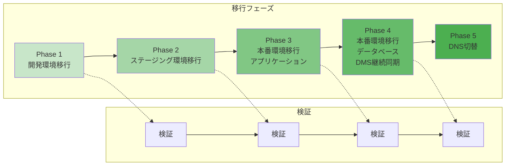

### 2.4 技術コンポーネント移行マップ

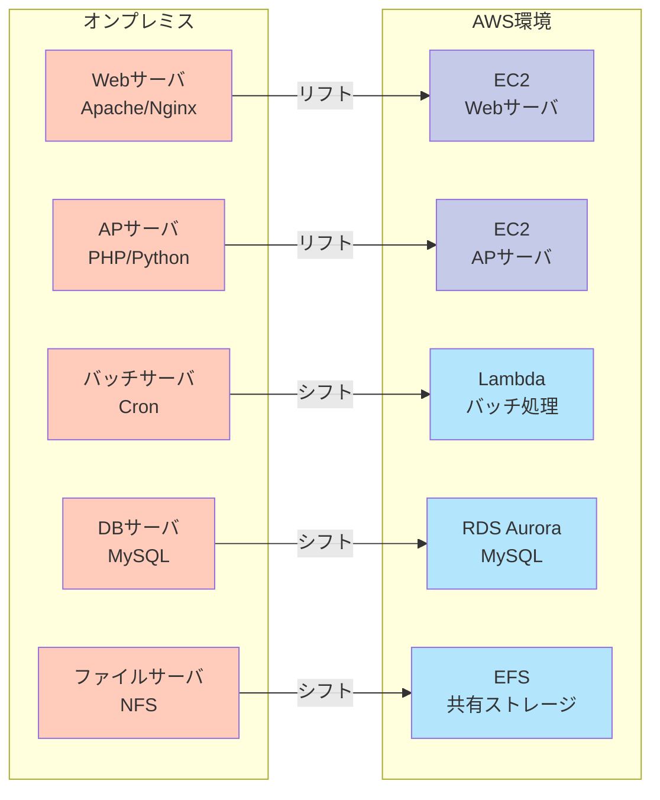

---

## 3. プロジェクトフェーズとドキュメント体系

### Phase 1: 現状分析・要件定義（完了想定）

```
✓ 要件定義書（EC2要件定義.md）
```

### Phase 2: 移行計画・設計

#### 2.1 現状分析ドキュメント群

| ドキュメント名 | 目的 | 主な内容 |
|--------------|------|---------|
| **オンプレミス環境調査書.md** | 現行システムの把握 | - サーバ構成、スペック、OS、ミドルウェア<br/>- ネットワーク構成（IP体系、通信要件、帯域）<br/>- ストレージ使用量、I/O特性<br/>- 現行システムの問題点・改善要望 |
| **アプリケーション依存関係調査書.md** | アプリ移行の影響分析 | - アプリケーションアーキテクチャ<br/>- 外部システム連携<br/>- バッチ処理一覧とスケジュール<br/>- セッション管理方式<br/>- 静的/動的コンテンツの分類 |
| **性能・負荷分析書.md** | 適切なサイジング | - リソース使用率（CPU、メモリ、ディスク、ネットワーク）<br/>- ピーク時・平常時のトラフィック<br/>- レスポンスタイム<br/>- 同時接続数 |

#### 2.2 移行設計ドキュメント群

| ドキュメント名 | 目的 | 主な内容 |
|--------------|------|---------|
| **AWS移行設計書（システム設計書）.md** | AWSアーキテクチャ定義 | **全体アーキテクチャ図**<br/>**EC2インスタンス設計**<br/>├─ インスタンスタイプ選定（現行スペックとの対応表）<br/>├─ AMI設計（OS、ミドルウェア構成）<br/>├─ EBSボリューム設計<br/>└─ Auto Scaling設計<br/>**Lambda移行設計**<br/>├─ バッチ処理のLambda化方針<br/>├─ 処理時間・メモリ要件<br/>└─ EventBridge/Step Functions設計<br/>**RDS Aurora設計**<br/>├─ インスタンスクラス選定<br/>├─ パラメータグループ設計<br/>└─ 移行方式（DMS/スナップショット）<br/>**ネットワーク設計**<br/>├─ VPC/サブネット設計<br/>├─ ルーティング設計<br/>└─ オンプレ接続設計（Direct Connect/VPN） |
| **移行マッピング表.md** | 移行対象の明確化 | - オンプレサーバ → AWS EC2インスタンス対応表<br/>- バッチ処理 → Lambda関数対応表<br/>- 既存DB → RDS Aurora移行計画 |
| **セキュリティ設計書.md** | セキュリティ要件実装 | - IAM設計（ロール、ポリシー）<br/>- セキュリティグループ設計<br/>- WAF/Shield設定<br/>- CrowdStrike移行設計<br/>- アクセス制御（Session Manager）<br/>- 暗号化設計（EBS、RDS、転送時） |
| **ネットワーク設計書.md** | ネットワーク構成定義 | - IP設計（オンプレとの重複回避）<br/>- DNS設計（Route 53移行）<br/>- VPN/Direct Connect設計<br/>- ハイブリッド接続期間の設計 |

#### 2.3 移行計画ドキュメント群

| ドキュメント名 | 目的 | 主な内容 |
|--------------|------|---------|
| **移行計画書.md** | 移行プロジェクト管理 | - 移行戦略（Big Bang / 段階移行）<br/>- 移行スケジュール（WBS）<br/>- ロールバック計画<br/>- リスク管理表<br/>- 移行体制図 |
| **移行手順書.md** | 移行作業の標準化 | **事前準備**<br/>├─ AWSアカウント準備<br/>├─ CloudFormation/Sceptre実行<br/>└─ ベースAMI作成<br/>**アプリケーション移行**<br/>├─ サーバ移行（AWS MGN / 手動構築）<br/>├─ ミドルウェア設定移行<br/>└─ アプリケーションデプロイ<br/>**データ移行**<br/>├─ DB移行（DMS / ダンプ&リストア）<br/>├─ ファイル移行（DataSync / rsync）<br/>└─ データ整合性確認<br/>**切替手順**<br/>├─ DNS切替<br/>├─ 動作確認<br/>└─ ロールバック手順 |
| **テスト計画書.md** | 品質保証 | - 単体テスト計画<br/>- 結合テスト計画<br/>- 性能テスト計画<br/>- 移行リハーサル計画<br/>- 本番切替リハーサル |

### Phase 3: 構築・移行

#### 3.1 構築ドキュメント群

| ドキュメント名 | 目的 | 主な内容 |
|--------------|------|---------|
| **環境構築手順書.md** | 環境構築の再現性確保 | - CloudFormation/Sceptreテンプレート実行手順<br/>- EC2インスタンス構築手順<br/>- ミドルウェアインストール・設定手順<br/>- Lambda関数デプロイ手順<br/>- RDS構築手順 |
| **パラメータシート.xlsx** | 設定値の一元管理 | - 環境別設定値一覧（dev/stg/prd）<br/>- IPアドレス一覧<br/>- セキュリティグループルール一覧<br/>- IAMロール/ポリシー一覧 |
| **構築作業記録.md** | 作業履歴の管理 | - 構築実施日時<br/>- 実施内容<br/>- 問題点と対処 |

#### 3.2 テストドキュメント群

| ドキュメント名 | 目的 | 主な内容 |
|--------------|------|---------|
| **テスト仕様書.md** | テストケース定義 | - テストケース一覧<br/>- 期待結果 |
| **テスト結果報告書.md** | テスト結果の記録 | - テスト実施結果<br/>- 不具合管理表<br/>- 性能測定結果 |
| **移行リハーサル報告書.md** | リハーサルの振り返り | - リハーサル実施結果<br/>- 所要時間実績<br/>- 課題と改善策 |

### Phase 4: 運用準備

#### 4.1 運用ドキュメント群

| ドキュメント名 | 目的 | 主な内容 |
|--------------|------|---------|
| **運用手順書.md** | 日常運用の標準化 | - 日次運用手順<br/>- 週次運用手順<br/>- 月次運用手順（パッチ適用含む）<br/>- 定期作業一覧 |
| **監視設定書.md** | 監視体制の構築 | - CloudWatch監視設定<br/>- Datadog監視設定<br/>- アラート設定と通知先<br/>- ダッシュボード設計 |
| **バックアップ・リカバリ手順書.md** | データ保護と復旧 | - バックアップ設定（AMI、スナップショット、Aurora）<br/>- リストア手順<br/>- DR手順 |
| **障害対応手順書.md** | インシデント対応 | - 障害切り分けフロー<br/>- エスカレーションフロー<br/>- 復旧手順（サービス別） |
| **パッチ管理手順書.md** | セキュリティ維持 | - Systems Manager Patch Manager設定<br/>- パッチ適用フロー<br/>- 緊急パッチ適用手順 |
| **セキュリティ運用手順書.md** | セキュリティ運用 | - CrowdStrike運用<br/>- 脆弱性診断・対応フロー<br/>- インシデント対応手順 |

### Phase 5: 移行実施・安定化

#### 5.1 移行実施ドキュメント

| ドキュメント名 | 目的 | 主な内容 |
|--------------|------|---------|
| **本番移行作業報告書.md** | 移行結果の記録 | - 移行実施日時<br/>- 実施内容と結果<br/>- 問題点と対処<br/>- 性能測定結果 |
| **課題管理表.xlsx** | 残課題の管理 | - 残課題一覧<br/>- 対応優先度<br/>- 対応予定日 |

---

## 4. 各フェーズの詳細

### 🔍 Phase 1: 現状分析・要件定義（2-4週間）

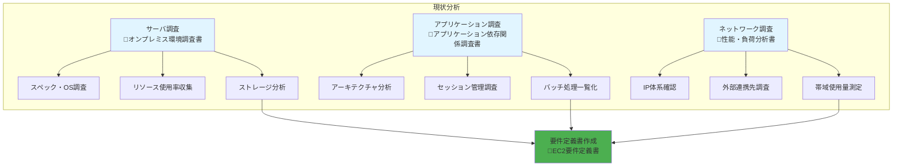

#### 実施内容

##### 1. サーバ調査
- 各サーバのスペック、OS、ミドルウェアバージョン
- リソース使用率（性能監視データ収集）
  - CPU使用率（平均、ピーク）
  - メモリ使用率（平均、ピーク）
  - ディスクI/O（IOPS、スループット）
  - ネットワーク帯域使用量
- ストレージ使用量、I/O特性

##### 2. アプリケーション調査
- アーキテクチャ（Webサーバ、APサーバ構成）
- セッション管理方式（Sticky Session必要性）
- ファイル共有の有無（EFS検討）
- バッチ処理一覧とLambda化可否判定
  - 処理時間（15分以内か？）
  - メモリ使用量（10GB以内か？）
  - ステートレス処理か？

##### 3. ネットワーク調査
- 現行IP体系（AWS VPCとの重複確認）
- 外部連携先（IPアドレス変更の影響）
- 帯域使用量

#### 成果物
- オンプレミス環境調査書.md
- アプリケーション依存関係調査書.md
- 性能・負荷分析書.md
- **要件定義書.md**（EC2要件定義.md）

---

### 🎯 Phase 2: 移行計画・設計（4-6週間）

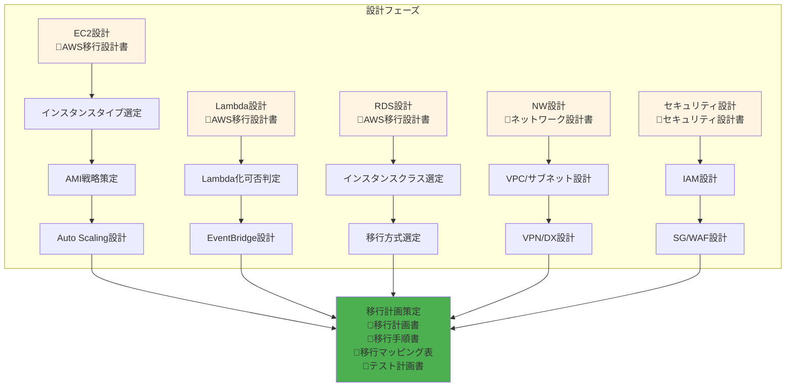

#### A. EC2設計の重要ポイント

##### ✓ インスタンスタイプ選定
```
検討項目:
- 現行サーバスペックとの対応付け
- CPU最適化 vs メモリ最適化 vs バランス型
- RI/Savings Plans前提でのコスト試算

推奨ファミリー:
- 汎用: T3/T4g（バースト性能）、M5/M6i（安定性能）
- コンピューティング最適化: C5/C6i（CPU集約型）
- メモリ最適化: R5/R6i（大容量メモリ必要時）
```

##### ✓ AMI戦略
```
検討項目:
- ゴールデンAMI作成方針（Packer/Image Builder）
- ミドルウェアプリインストール範囲
- パッチ適用済みAMIの更新サイクル（推奨: 月次）

ベストプラクティス:
1. ベースAMI（OS + 基本設定）
2. アプリケーションAMI（ベースAMI + ミドルウェア）
3. デプロイ時にアプリコードを配置
```

##### ✓ Auto Scaling設計
```
検討項目:
- 最小/最大台数（現行ピーク負荷ベース）
- スケーリングポリシー（ターゲット追跡推奨）
  - CPU使用率 70%でスケールアウト
  - メモリ使用率 80%でスケールアウト
- ヘルスチェック設定（ELB + EC2）
- ウォームアップ時間（300秒推奨）

推奨構成:
- 最小: 3台（マルチAZ: 各AZに1台）
- 希望: 3台（通常時）
- 最大: 10台（ピーク時）
```

##### ✓ ストレージ設計
```
検討項目:
- EBSボリュームサイズ（現行+成長率 30%程度）
- IOPS要件（gp3 vs io2選定）
  - gp3: 汎用、コスト効率◎
  - io2: 高IOPS要件、ミッションクリティカル
- 共有ストレージ → EFS移行検討

ボリューム構成例:
- ルートボリューム: /dev/xvda 30GB (gp3)
- データボリューム: /dev/xvdf 100GB (gp3)
- ログボリューム: /dev/xvdg 50GB (gp3)
```

#### B. Lambda移行設計の重要ポイント

##### ✓ Lambda化可否判定基準
```
Lambda化可能:
✓ 実行時間15分以内
✓ メモリ10GB以内で実行可能
✓ ステートレス処理
✓ イベント駆動型

Lambda化困難（代替策必要）:
✗ 実行時間15分超 → ECS/Fargate、Step Functions
✗ メモリ10GB超 → ECS/Fargate
✗ ステートフル処理 → ECS/Fargate + RDS/DynamoDB
✗ 常駐プロセス → ECS/Fargate
```

##### ✓ スケジュール実行
```
EventBridge（CloudWatch Events）設計:
- Cron形式でのスケジュール定義
- 例: cron(0 2 * * ? *)（毎日2:00 UTC）

複雑なワークフロー:
- Step Functions活用
  - 並列処理
  - エラーハンドリング
  - リトライ制御
```

##### ✓ エラーハンドリング
```
設計項目:
- DLQ（Dead Letter Queue）設計
- リトライ設定（0-2回推奨）
- タイムアウト設定（処理時間の1.5倍程度）
- CloudWatch Logs監視
- アラート通知（SNS）
```

#### C. RDS Aurora移行設計

##### ✓ インスタンスクラス選定
```
検討項目:
- 現行DB負荷測定（IOPS、接続数、クエリ数）
- Aurora MySQL互換性確認
  - MySQLバージョン互換性
  - 使用機能の対応状況確認

推奨クラス:
- 小規模: db.r6g.large（2vCPU, 16GB）
- 中規模: db.r6g.xlarge（4vCPU, 32GB）
- 大規模: db.r6g.2xlarge（8vCPU, 64GB）
```

##### ✓ 移行方式選定
```
方式1: AWS DMS（推奨）
メリット:
- 継続同期可能
- ダウンタイム最小化（数分～数十分）
- 異種DB間移行も対応
デメリット:
- 設定が複雑
- コスト発生

方式2: mysqldump/mysqlpump
メリット:
- シンプル
- コスト不要
デメリット:
- ダウンタイム長い（データ量に比例）
- 大容量DBには不向き

方式3: スナップショット
メリット:
- 非常に大容量でも高速
デメリット:
- オンプレ→AWS直接は不可
- RDS→Aurora間のみ
```

##### ✓ パラメータチューニング
```
移行作業:
- オンプレMySQLのmy.cnf設定をAurora用に変換
- Aurora特有のパラメータ設定
  - aurora_parallel_query（大量データスキャン高速化）
  - innodb_adaptive_hash_index（読み取り性能向上）

検証項目:
- スロークエリ確認
- インデックス最適化
- コネクションプーリング設定
```

#### D. ネットワーク設計の重要ポイント

##### ✓ ハイブリッド接続
```
VPN接続（推奨: 初期フェーズ）
メリット:
- 初期構築が早い
- コスト安（従量課金なし）
デメリット:
- 帯域制限（最大1.25Gbps）
- インターネット経由（レイテンシあり）

Direct Connect（推奨: 本格運用時）
メリット:
- 専用線、低レイテンシ
- 帯域大（最大100Gbps）
- 安定性高い
デメリット:
- 開通まで1-2ヶ月
- 初期コスト高
```

##### ✓ IP設計
```
設計ポイント:
- オンプレとの重複回避（必須）
- サブネット分割
  - Public Subnet: ALB配置
  - Private Subnet (App): EC2配置
  - Private Subnet (DB): RDS/Aurora配置
- 成長率を考慮した十分なIPアドレス確保

IP設計例:
VPC CIDR: 10.60.0.0/22（1024 IP）
├─ Public Subnet A:  10.60.0.0/26  (62 IP)
├─ Public Subnet C:  10.60.0.64/26 (62 IP)
├─ Public Subnet D:  10.60.0.128/26 (62 IP)
├─ Private Subnet (App) A: 10.60.1.0/25   (126 IP)
├─ Private Subnet (App) C: 10.60.1.128/25 (126 IP)
├─ Private Subnet (App) D: 10.60.2.0/25   (126 IP)
├─ Private Subnet (DB) A:  10.60.3.0/27   (30 IP)
├─ Private Subnet (DB) C:  10.60.3.32/27  (30 IP)
└─ Private Subnet (DB) D:  10.60.3.64/27  (30 IP)
```

##### ✓ DNS移行
```
移行計画:
1. Route 53ホストゾーン作成
2. TTL短縮（事前に60秒程度に設定）
3. 移行リハーサルでDNS切替テスト
4. 本番切替時にDNSレコード変更
5. TTL経過後、オンプレ側停止

検討項目:
- レコードタイプ（A, CNAME, ALIASの選択）
- ヘルスチェック設定
- フェイルオーバー設定
```

#### 成果物
- AWS移行設計書（システム設計書）.md
- 移行マッピング表.md
- セキュリティ設計書.md
- ネットワーク設計書.md
- 移行計画書.md
- 移行手順書.md
- テスト計画書.md

---

### 🛠️ Phase 3: 構築・テスト（6-10週間）

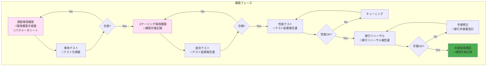

#### 実施内容

##### 1. 開発環境構築 → 単体テスト
```
構築作業:
- CloudFormation/Sceptreテンプレート実行
- VPC、サブネット、セキュリティグループ作成
- EC2インスタンス起動（Launch Template使用）
- ミドルウェアインストール
- Lambda関数デプロイ
- RDS Aurora構築

単体テスト:
- 各コンポーネント単体での動作確認
- API疎通確認
- DB接続確認
- Lambda関数実行確認
```

##### 2. ステージング環境構築 → 結合テスト
```
構築作業:
- 本番相当の環境構築
- アプリケーションデプロイ
- データ投入（本番データのマスク版）

結合テスト:
- エンドツーエンドの動作確認
- 外部システム連携テスト
- バッチ処理の連携テスト
- エラーハンドリング確認
```

##### 3. 性能テスト → チューニング
```
性能テスト:
- 負荷ツール使用（JMeter, Gatling等）
- ピーク時想定の負荷テスト
- 同時接続数テスト
- レスポンスタイム測定
- スループット測定

チューニング:
- スロークエリ最適化
- インデックス追加
- キャッシュ設定最適化
- Auto Scaling閾値調整
```

##### 4. 移行リハーサル → 手順修正
```
リハーサル:
- 本番切替手順の実施
- 所要時間測定
- ロールバック手順確認
- 問題点の洗い出し

手順修正:
- 問題点への対処方法確立
- 手順書の修正
- チェックリストの更新
```

##### 5. 本番環境構築
```
構築作業:
- 本番環境構築
- セキュリティ設定の最終確認
- バックアップ設定確認
- 監視設定確認
- ドキュメント最終化
```

#### 成果物
- 環境構築手順書.md
- パラメータシート.xlsx
- 構築作業記録.md
- テスト仕様書.md
- テスト結果報告書.md
- 移行リハーサル報告書.md

---

### 🔧 Phase 4: 運用準備（2-3週間）

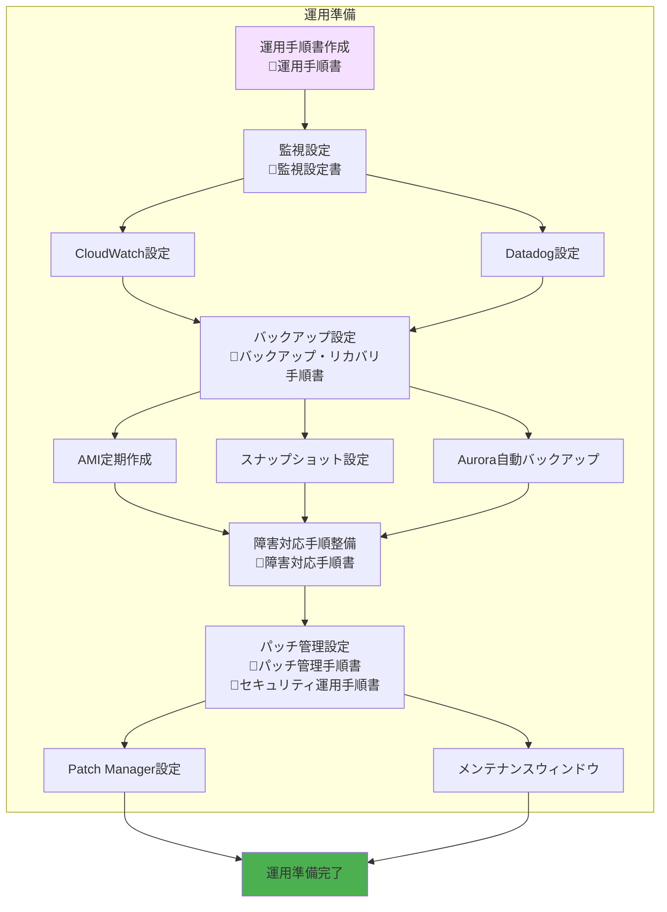

#### 実施内容

##### 1. 運用手順書作成
```
作成項目:
- 日次運用手順（ログ確認、バックアップ確認）
- 週次運用手順（リソース使用状況レビュー）
- 月次運用手順（パッチ適用、レポート作成）
- 定期作業一覧（スケジュール表）
```

##### 2. 監視設定
```
CloudWatch監視:
- メトリクス監視（CPU、メモリ、ディスク、ネットワーク）
- ログ監視（CloudWatch Logs Agent導入）
- カスタムメトリクス設定
- アラーム設定
  - CPU使用率 > 80%（5分継続）
  - メモリ使用率 > 80%（5分継続）
  - ディスク使用率 > 85%
  - ヘルスチェック失敗

Datadog監視:
- APM設定（アプリケーション性能監視）
- ログ収集設定
- ダッシュボード作成
- 異常検知設定
```

##### 3. バックアップ設定
```
AMI作成:
- スケジュール: 毎週日曜日 03:00
- 保持期間: 4週間（4世代）
- タグ付け（自動削除用）

EBSスナップショット:
- スケジュール: 毎日 02:00
- 保持期間: 7日間
- クロスリージョンコピー（DR用）

Aurora自動バックアップ:
- バックアップウィンドウ: 18:00-18:30
- 保持期間: 7日間
- スナップショット手動作成（重要変更前）
```

##### 4. 障害対応手順整備
```
作成項目:
- 障害切り分けフローチャート
- サービス別復旧手順
  - EC2障害時の対応
  - RDS障害時の対応
  - Lambda障害時の対応
  - ネットワーク障害時の対応
- エスカレーションフロー
- 連絡先一覧
```

##### 5. パッチ管理設定
```
Systems Manager Patch Manager:
- パッチベースライン作成
  - セキュリティパッチ: 自動承認（リリース後0日）
  - その他パッチ: 自動承認（リリース後7日）
- メンテナンスウィンドウ設定
  - スケジュール: 毎月第2土曜日 19:00-23:00
  - ターゲット: タグベース（Environment=Production）
  - タスク: AWS-RunPatchBaseline
- 適用後の再起動設定
- コンプライアンスレポート設定
```

#### 成果物
- 運用手順書.md
- 監視設定書.md
- バックアップ・リカバリ手順書.md
- 障害対応手順書.md
- パッチ管理手順書.md
- セキュリティ運用手順書.md

---

### 🚀 Phase 5: 移行実施・安定化（移行日+4週間）

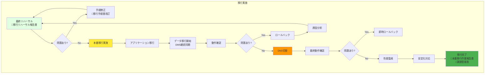

#### 実施内容

##### 1. 最終リハーサル（本番切替1週間前）
```
実施項目:
- 本番切替手順の完全再現
- 所要時間の最終測定
- ロールバック手順の確認
- 関係者への手順説明
- チェックリストの最終確認
```

##### 2. 本番移行実施

###### 移行タイムライン例
```
【移行前日】
17:00 最終確認会議
18:00 変更申請承認確認
19:00 関係者待機開始

【移行当日】
00:00 移行作業開始
00:15 オンプレサービス停止
00:30 最終データバックアップ
01:00 AWS環境へ最終データ同期（DMS）
02:00 データ整合性確認
03:00 AWS環境での動作確認
04:00 DNS切替準備
04:30 DNS切替実施
05:00 新環境での動作確認
05:30 性能確認
06:00 監視体制移行
07:00 移行作業完了
```

##### 3. 動作確認
```
確認項目:
✓ Webアプリケーション動作確認
  - ログイン機能
  - 主要機能動作
  - ファイルアップロード/ダウンロード
✓ データベース接続確認
  - 読み取り動作
  - 書き込み動作
  - トランザクション整合性
✓ Lambda関数動作確認
  - スケジュール実行
  - イベントトリガー
✓ 外部連携確認
  - API連携
  - ファイル連携
✓ バッチ処理確認
  - 実行ログ確認
  - 処理結果確認
```

##### 4. ロールバック判断基準
```
即時ロールバック:
✗ サービス全停止
✗ データ破損検知
✗ 重大なセキュリティ問題
✗ 主要機能の完全停止

監視継続（軽微な問題）:
△ 一部機能の性能劣化
△ ログ出力の異常
△ 非クリティカルな機能不具合

ロールバック手順:
1. DNS切替（旧環境へ戻す）
2. オンプレサービス再開
3. データ整合性確認
4. 原因分析
```

##### 5. 性能監視（移行後4週間）
```
監視項目:
- レスポンスタイム推移
- エラー率推移
- スループット推移
- リソース使用率推移
  - CPU使用率
  - メモリ使用率
  - ディスクI/O
  - ネットワーク帯域

週次レビュー:
- 性能データ分析
- コスト分析
- 最適化提案
```

##### 6. 安定化対応
```
対応項目:
- 性能チューニング
- Auto Scaling閾値調整
- ログ出力最適化
- 監視アラート調整
- コスト最適化
  - 未使用リソースの削除
  - インスタンスタイプ最適化
  - RI/Savings Plans購入検討
```

#### 成果物
- 本番移行作業報告書.md
- 課題管理表.xlsx
- 性能レポート（週次）
- コストレポート（週次）

---

## 5. リフト&シフト特有の注意点

### ✅ やるべきこと

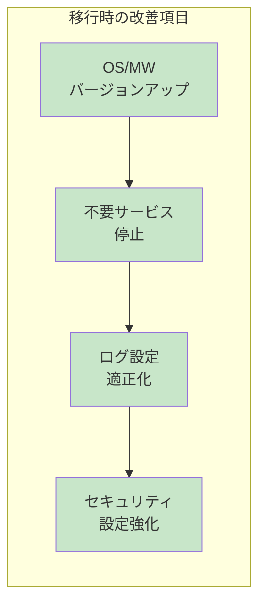

#### 1. OS/ミドルウェアバージョンアップ検討
```
確認項目:
- EOL（End of Life）バージョンの確認
- セキュリティパッチ最新化
- 互換性確認

推奨アプローチ:
1. 最新の安定版へアップグレード
2. 互換性テストを実施
3. 段階的にアップグレード（開発→ステージング→本番）
```

#### 2. 設定の見直し
```
不要なサービス停止:
- 使用していないデーモン停止
- 不要なポート閉鎖
- 未使用ユーザーの削除

ログ設定適正化:
- ログローテーション設定
- CloudWatch Logs Agent導入
- 不要なログ出力削減

セキュリティ設定強化:
- CIS Benchmark準拠
- SSHポート変更（Session Manager推奨）
- sudoログ有効化
- ファイアウォール設定
```

#### 3. AWS移行に伴う変更対応
```
セッション管理:
- ELBスティッキーセッション設定
- または、ElastiCache Redisでセッション共有

ファイル共有:
- NFS → EFS移行
- マウントポイント設定
- パフォーマンスモード選定

ログ集約:
- CloudWatch Logs Agent導入
- ログストリーム設計
- メトリクスフィルター設定

バックアップ:
- EBS Snapshot設定
- AMI定期作成
- Aurora自動バックアップ
- クロスリージョンバックアップ（DR用）
```

### ❌ 避けるべきこと

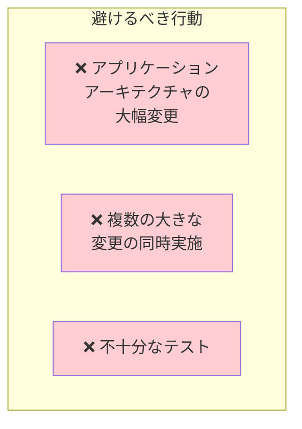

#### 1. アプリケーションアーキテクチャの大幅変更
```
リフト&シフトフェーズでは避ける:
- マイクロサービス化
- コンテナ化（当初計画にない場合）
- 言語・フレームワークの変更
- データベーススキーマの大幅変更

理由:
- リスクが高まる
- 移行期間が長期化
- 問題発生時の切り分けが困難

推奨:
→ 移行後の「最適化フェーズ」で実施
→ 段階的なモダナイゼーション計画策定
```

#### 2. 複数の大きな変更の同時実施
```
避けるべき例:
- OS更新 + アプリ更新 + DB移行を同時実施
- ネットワーク変更 + セキュリティ変更を同時実施

理由:
- 問題発生時の切り分けが困難
- ロールバックが複雑化

推奨:
→ 一つずつ段階的に実施
→ 各変更後に動作確認を実施
```

#### 3. 不十分なテスト
```
必須テスト:
✓ 単体テスト
✓ 結合テスト
✓ 性能テスト（負荷テスト）
✓ 移行リハーサル（2回以上推奨）
✓ 本番切替リハーサル

リスク:
- 本番移行時の予期しない問題発生
- ダウンタイム延長
- ロールバック発生

推奨:
→ 十分な検証期間の確保
→ 本番相当環境でのテスト実施
```

---

## 6. 推奨タイムライン

### 全体スケジュール（6-9ヶ月想定）

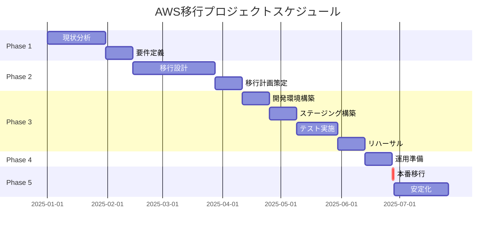

### 月別スケジュール詳細

| 月 | フェーズ | 主な作業内容 | 成果物 |
|----|---------|-------------|--------|
| **Month 1-2** | Phase 1: 現状分析・要件定義 | - オンプレ環境調査<br/>- アプリケーション分析<br/>- 性能・負荷測定<br/>- 要件定義書作成 | - 現状分析ドキュメント<br/>- 要件定義書 |
| **Month 2-3** | Phase 2: 移行設計（前半） | - EC2設計<br/>- Lambda設計<br/>- RDS Aurora設計<br/>- ネットワーク設計 | - AWS移行設計書<br/>- 移行マッピング表 |
| **Month 3-4** | Phase 2: 移行設計（後半）<br/>+ 開発環境構築 | - セキュリティ設計<br/>- 移行計画策定<br/>- 開発環境構築開始 | - セキュリティ設計書<br/>- 移行計画書<br/>- 移行手順書<br/>- テスト計画書 |
| **Month 4-6** | Phase 3: 構築・テスト | - ステージング環境構築<br/>- 単体・結合テスト<br/>- 性能テスト<br/>- 移行リハーサル（2回） | - 環境構築手順書<br/>- テスト結果報告書<br/>- リハーサル報告書 |
| **Month 6-7** | Phase 4: 運用準備<br/>+ 本番環境構築 | - 運用手順書作成<br/>- 監視・バックアップ設定<br/>- パッチ管理設定<br/>- 本番環境構築 | - 運用ドキュメント群<br/>- 本番環境 |
| **Month 7** | Phase 5: 本番移行 | - 最終リハーサル<br/>- 本番移行実施<br/>- 動作確認<br/>- DNS切替 | - 本番移行作業報告書 |
| **Month 8-9** | Phase 5: 安定化・最適化 | - 性能監視<br/>- チューニング<br/>- 課題対応<br/>- コスト最適化 | - 性能レポート<br/>- 最適化提案書 |

### 週別詳細スケジュール例（Month 4-6: 構築・テスト）

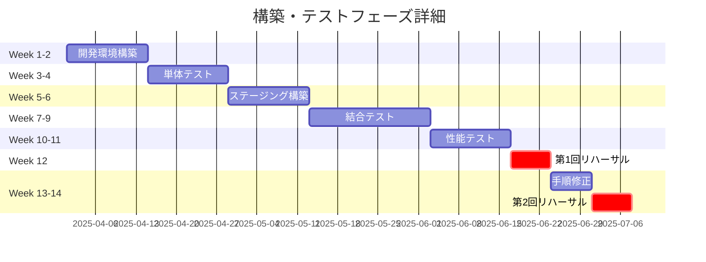

### マイルストーン

| # | マイルストーン | 予定時期 | 承認者 |
|---|---------------|---------|--------|
| M1 | 要件定義完了 | Month 2 | プロジェクトオーナー |
| M2 | 設計完了 | Month 4 | アーキテクト |
| M3 | 開発環境構築完了 | Month 4 | 技術リーダー |
| M4 | ステージング環境構築完了 | Month 5 | 技術リーダー |
| M5 | テスト完了 | Month 6 | QAリーダー |
| M6 | 第1回リハーサル完了 | Month 6 | プロジェクトマネージャー |
| M7 | 運用準備完了 | Month 7 | 運用リーダー |
| M8 | 第2回リハーサル完了 | Month 7 | プロジェクトマネージャー |
| M9 | 本番移行完了 | Month 7 | プロジェクトオーナー |
| M10 | 安定化完了 | Month 9 | プロジェクトオーナー |

---

## 7. 次のアクション

### 優先度：高（即座に着手）


1. **オンプレミス環境調査書のテンプレート作成**
2. **性能データ収集の開始**（最低2週間分のデータ収集推奨）
3. **移行マッピング表の作成**（サーバ・バッチ・DB対応表）

### 優先度：中（Phase 1完了後）

4. **AWS移行設計書の骨子作成**
5. **移行手順書のドラフト作成**
6. **テスト計画書の作成**

### 優先度：低（Phase 2完了後）

7. **運用手順書の作成**
8. **監視設定書の作成**
9. **パッチ管理手順書の作成**

---

## 8. 関連ドキュメント

### 要件定義
- [EC2要件定義.md](./EC2要件定義.md)

### システム設計（作成予定）
- AWS移行設計書（システム設計書）.md
- セキュリティ設計書.md
- ネットワーク設計書.md

### 移行計画（作成予定）
- 移行計画書.md
- 移行手順書.md
- テスト計画書.md

### 運用（作成予定）
- 運用手順書.md
- 監視設定書.md
- バックアップ・リカバリ手順書.md
- 障害対応手順書.md
- パッチ管理手順書.md

---

## 改版履歴

| 版数 | 日付 | 改版内容 | 作成者 |
|------|------|----------|--------|
| 1.0 | 2025-11-17 | 初版作成 | - |
