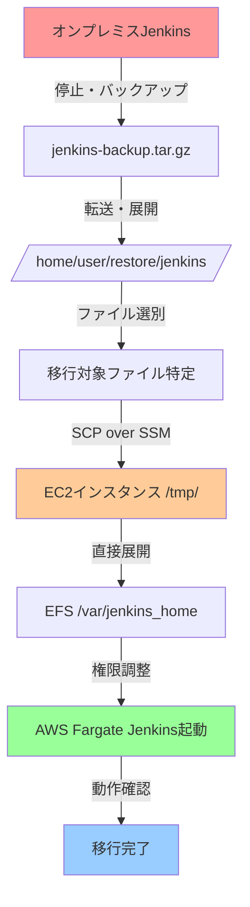

# Jenkins移転手順書
**オンプレミス環境からAWS Fargate環境への移行手順**

---

## 📋 概要

オンプレミスで動作していたJenkinsを AWS Fargate + EFS 環境に移行する手順を説明します。

## 🎯 移行方式の全体像



## 📁 バックアップファイル構造の理解

### 現在のファイル構造
```
/home/t-tomonaga/AWS/restore/jenkins/
├── jenkins_home/                    # ← Jenkinsのホームディレクトリ
│   ├── config.xml                  # Jenkins全体設定
│   ├── jobs/                       # 全ジョブ定義
│   │   ├── job1/
│   │   │   └── config.xml         # 各ジョブの設定
│   │   └── job2/
│   ├── users/                      # ユーザー設定
│   ├── secrets/                    # 認証情報
│   ├── plugins/                    # プラグイン（移行しない）
│   └── workspace/                  # 作業領域（移行しない）
├── jenkins_fix_ui.sh               # 今回作成したスクリプト
├── jenkins_api_fix_v2.groovy      # 今回作成したスクリプト
└── その他スクリプト類
```

### 移行対象ファイル（重要度順）

| 優先度 | ディレクトリ/ファイル | 説明 | 移行必要性 |
|--------|---------------------|------|-----------|
| ⭐⭐⭐ | `jobs/` | 全ジョブ定義 | **必須** |
| ⭐⭐⭐ | `config.xml` | Jenkins基本設定 | **必須** |
| ⭐⭐ | `users/` | ユーザー・権限設定 | **推奨** |
| ⭐⭐ | `secrets/` | 認証情報・APIキー | **推奨** |
| ⭐ | `plugins/` | プラグイン | **除外**（※） |
| ❌ | `workspace/` | 一時作業領域 | **除外** |
| ❌ | `builds/` | ビルド履歴 | **除外** |

※プラグインは AWS 環境で再インストールします

---

## 🚀 移行手順

### ステップ1: 移行対象ファイルの準備

#### 1-1. 移行用ディレクトリ作成
```bash
# 移行専用ディレクトリを作成
mkdir -p /tmp/jenkins_migration_data
cd /home/t-tomonaga/AWS/restore/jenkins/
```

#### 1-2. 必要ファイルのコピー
```bash
# Jenkins設定ファイルをコピー
cp -r jenkins_home/jobs/ /tmp/jenkins_migration_data/
cp jenkins_home/config.xml /tmp/jenkins_migration_data/
cp -r jenkins_home/users/ /tmp/jenkins_migration_data/
cp -r jenkins_home/secrets/ /tmp/jenkins_migration_data/

# 不要ファイルが混入していないか確認
ls -la /tmp/jenkins_migration_data/
```

#### 1-3. 権限とパス調整
```bash
# ファイル権限を統一（重要）
find /tmp/jenkins_migration_data -type f -exec chmod 644 {} \;
find /tmp/jenkins_migration_data -type d -exec chmod 755 {} \;

# Jenkins用ユーザーID（1000）に変更
sudo chown -R 1000:1000 /tmp/jenkins_migration_data/
```

### ステップ2: SCP over SSM での直接転送

#### 2-1. 移行データのアーカイブ作成
```bash
# 圧縮ファイル作成（高速化）
cd /tmp
tar -czf jenkins_migration_clean.tar.gz jenkins_migration_data/

# ファイルサイズ確認
ls -lh jenkins_migration_clean.tar.gz
```

#### 2-2. SCP over SSM で EC2 に直接転送
```bash
# MFA認証情報読み込み
source /home/t-tomonaga/AWS/aws_mfa_credentials

# SCP over SSM で直接転送（S3経由不要！）
scp -o ProxyCommand="aws ssm start-session --target i-0297dec34ad7ea77b --document-name AWS-StartSSHSession --parameters 'portNumber=%p'" \
    /tmp/jenkins_migration_clean.tar.gz \
    ec2-user@i-0297dec34ad7ea77b:/tmp/

# 転送完了確認
aws ssm send-command \
    --instance-ids i-0297dec34ad7ea77b \
    --document-name "AWS-RunShellScript" \
    --parameters 'commands=["ls -lh /tmp/jenkins_migration_clean.tar.gz"]'
```

#### 2-3. 転送のメリット
- ✅ **S3バケット不要**: 中間ストレージを省略
- ✅ **高速転送**: 直接ネットワーク経由で転送
- ✅ **セキュア**: SSM暗号化チャネル使用
- ✅ **コスト削減**: S3転送料金なし

### ステップ3: AWS EFS環境でのデータ展開

#### 3-1. EC2インスタンスでの作業準備
```bash
# 踏み台EC2にSSM接続
aws ssm start-session --target i-0297dec34ad7ea77b

# 必要パッケージインストール
sudo yum update -y
sudo yum install -y amazon-efs-utils
```

#### 3-2. EFSマウント
```bash
# EFSファイルシステムID確認
aws efs describe-file-systems --query 'FileSystems[?Name==`jenkins`].FileSystemId' --output text

# EFSマウント
sudo mkdir -p /mnt/jenkins_efs
sudo mount -t efs fs-04d7d333b0491a320:/ /mnt/jenkins_efs
```

#### 3-3. 移行データの展開
```bash
# 既に転送済みファイルを確認
ls -lh /tmp/jenkins_migration_clean.tar.gz

# EFS上に展開
cd /mnt/jenkins_efs
sudo tar -xzf /tmp/jenkins_migration_clean.tar.gz --strip-components=1

# ディレクトリ構造確認
ls -la /mnt/jenkins_efs/
# 以下のような構造になる:
# ├── jobs/
# ├── config.xml
# ├── users/
# └── secrets/
```

#### 3-4. 権限設定の最終調整
```bash
# Jenkins用権限設定
sudo chown -R 1000:1000 /mnt/jenkins_efs/
sudo chmod -R 755 /mnt/jenkins_efs/

# 重要ファイルの権限確認
ls -la /mnt/jenkins_efs/config.xml
ls -la /mnt/jenkins_efs/jobs/
```

### ステップ4: AWS Fargate Jenkins起動

#### 4-1. Jenkinsコンテナ起動
```bash
# ECSサービス起動
cd /home/t-tomonaga/AWS/AWS_POC/poc/sceptre
uv run sceptre update config/poc/ecs-jenkins.yaml
```

#### 4-2. 起動確認
```bash
# サービス状態確認
aws ecs describe-services --cluster poc-poc-ecs-jenkins-cluster \
  --services poc-poc-ecs-jenkins-jenkins \
  --query 'services[0].{Status:status,Running:runningCount,Desired:desiredCount}'

# ヘルスチェック確認
aws elbv2 describe-target-health \
  --target-group-arn arn:aws:elasticloadbalancing:region:account:targetgroup/poc-poc-ecs-jenkins-tg
```

### ステップ5: Jenkins接続とセットアップ

#### 5-1. ポートフォワーディング開始
```bash
cd /home/t-tomonaga/AWS/AWS_POC/poc/scripts
./connect-jenkins.sh
```

#### 5-2. WebUI アクセス
1. ブラウザで `http://localhost:8081` にアクセス
2. 初期管理者パスワード確認：
   ```bash
   # EC2上で初期パスワード取得
   sudo cat /mnt/jenkins_efs/secrets/initialAdminPassword
   ```

#### 5-3. 基本設定
1. **推奨プラグインインストール** を選択
2. **管理者ユーザー作成** または既存ユーザー情報使用
3. **Jenkins URL設定**: `http://internal-alb-name:8081`

### ステップ6: 移行確認

#### 6-1. ジョブ確認
```bash
# ジョブ数の確認
curl -s http://localhost:8081/api/json | jq '.jobs | length'

# 各ジョブの状態確認
curl -s http://localhost:8081/api/json | jq '.jobs[] | {name: .name, color: .color}'
```

#### 6-2. 動作テスト
1. 簡単なジョブを選択して **今すぐビルド** 実行
2. コンソール出力で正常実行を確認
3. ワークスペースが正常に作成されることを確認

---

## ⚠️ トラブルシューティング

### よくある問題と解決方法

#### 問題1: Jenkinsが起動しない
```bash
# ECSタスクログ確認
aws logs tail /ecs/poc-poc-ecs-jenkins/jenkins --follow

# よくある原因:
# - EFS権限問題 → sudo chown -R 1000:1000 /mnt/jenkins_efs/
# - config.xml破損 → バックアップファイル再確認
```

#### 問題2: ジョブが表示されない
```bash
# jobs/ディレクトリ確認
ls -la /mnt/jenkins_efs/jobs/

# 各ジョブのconfig.xml確認
find /mnt/jenkins_efs/jobs/ -name "config.xml" -exec ls -la {} \;
```

#### 問題3: プラグインエラー
1. Jenkins WebUI → **Jenkinsの管理** → **プラグインの管理**
2. **利用可能** タブで必要プラグインを検索・インストール
3. Jenkins再起動: **Jenkinsの管理** → **再起動**

---

## 📋 チェックリスト

### 移行前チェック
- [ ] オンプレミスJenkins停止済み
- [ ] バックアップファイル展開済み
- [ ] 移行対象ファイル特定済み
- [ ] AWS MFA認証有効

### 移行中チェック
- [ ] 移行データ権限調整済み
- [ ] S3アップロード完了
- [ ] EFSマウント成功
- [ ] データ展開完了

### 移行後チェック
- [ ] Jenkins WebUI アクセス可能
- [ ] 全ジョブ表示確認
- [ ] テストビルド実行成功
- [ ] ユーザー認証動作確認

### 作業完了後クリーンアップ
- [ ] EC2上の一時ファイル削除
- [ ] EFSアンマウント実行
- [ ] 移行用ディレクトリ削除
- [ ] SSMセッション終了

---

## 🧹 作業完了後のクリーンアップ手順

### ステップ1: EC2での作業完了確認
```bash
# Jenkins動作確認完了後、EC2でクリーンアップ実行
aws ssm start-session --target i-0297dec34ad7ea77b

# 移行作業が完全に完了していることを確認
sudo systemctl status ecs-agent  # ECS agent動作確認
docker ps  # Jenkins コンテナ動作確認
```

### ステップ2: 一時ファイルの削除
```bash
# 転送した移行データファイルを削除
sudo rm -f /tmp/jenkins_migration_clean.tar.gz

# 作業用ディレクトリがあれば削除
sudo rm -rf /tmp/jenkins_temp_*

# ディスク使用量確認
df -h /tmp
```

### ステップ3: EFSアンマウント
```bash
# 現在のマウント状況確認
mount | grep efs
df -h /mnt/jenkins_efs

# EFSをアンマウント
sudo umount /mnt/jenkins_efs

# アンマウント確認
mount | grep efs  # 何も表示されなければ成功
ls /mnt/jenkins_efs  # 空ディレクトリになることを確認
```

### ステップ4: マウントポイント削除
```bash
# マウントポイントディレクトリ削除
sudo rmdir /mnt/jenkins_efs

# /mnt ディレクトリ確認
ls -la /mnt/  # jenkins_efs が存在しないことを確認
```

### ステップ5: SSMセッション終了
```bash
# SSMセッションを適切に終了
exit

# ローカル環境で終了確認
ps aux | grep "aws ssm start-session" | grep -v grep
# SSMプロセスが残っていないことを確認
```

### ステップ6: ローカル環境のクリーンアップ
```bash
# ローカルの一時移行データ削除
rm -rf /tmp/jenkins_migration_data/
rm -f /tmp/jenkins_migration_clean.tar.gz

# 作業確認
ls -la /tmp/jenkins*  # 移行関連ファイルが存在しないことを確認
```

### 🔍 クリーンアップ確認チェックリスト
- [ ] EC2上の一時ファイル削除完了 (`/tmp/jenkins_migration_clean.tar.gz`)
- [ ] EFS正常アンマウント完了 (`umount /mnt/jenkins_efs`)
- [ ] マウントポイント削除完了 (`/mnt/jenkins_efs` ディレクトリなし)  
- [ ] SSMセッション正常終了
- [ ] ローカル一時ファイル削除完了
- [ ] Jenkins WebUI 正常アクセス可能（最終確認）

---

## 🎯 本番移行時の推奨事項

### 事前準備
1. **移行リハーサル実施**: 本手順でテスト環境移行
2. **ダウンタイム調整**: 営業時間外での実施推奨
3. **ロールバック準備**: オンプレミス環境保持

### 移行当日
1. **チーム体制**: 最低2名での作業実施
2. **進捗記録**: 各ステップの実行時刻記録
3. **動作確認**: 重要ジョブの実行テスト必須

### 移行後対応
1. **監視設定**: CloudWatch Logs、ECS メトリクス設定
2. **バックアップ設定**: EFS自動バックアップ有効化
3. **ドキュメント更新**: 新環境での運用手順書作成

---

*作成日: 2025年10月30日*  
*作成者: GitHub Copilot*  
*対象環境: オンプレミス → AWS Fargate + EFS*
