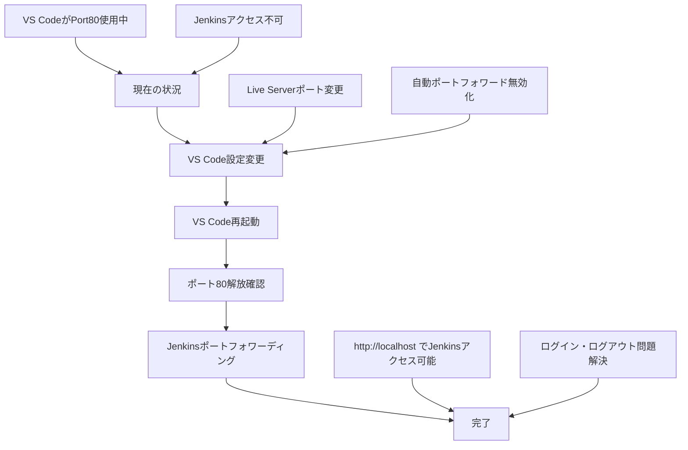
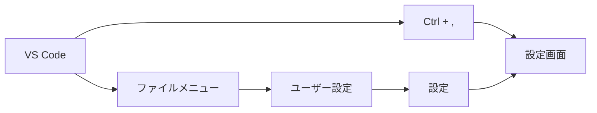
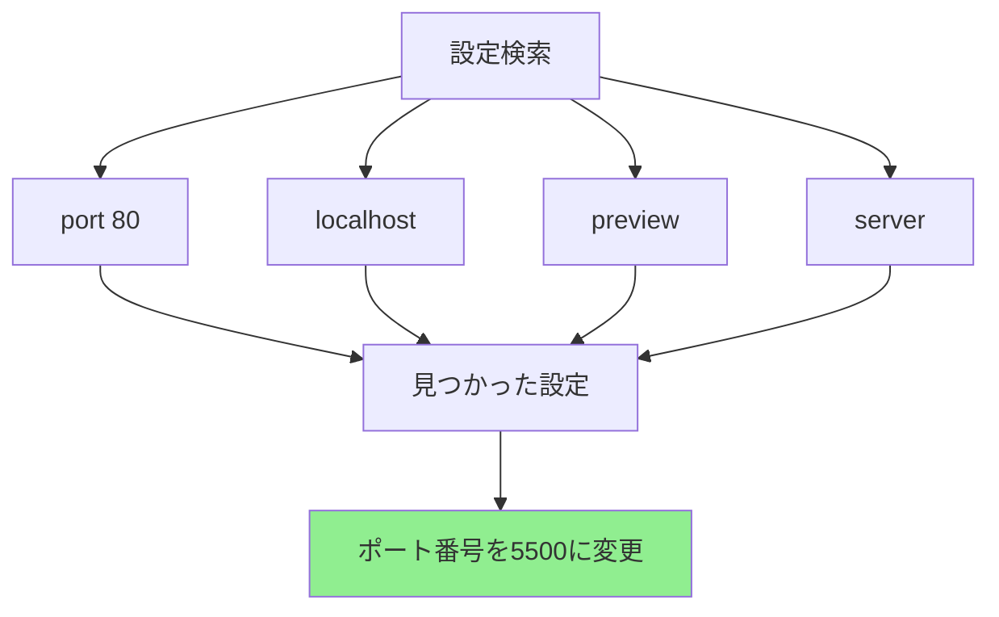
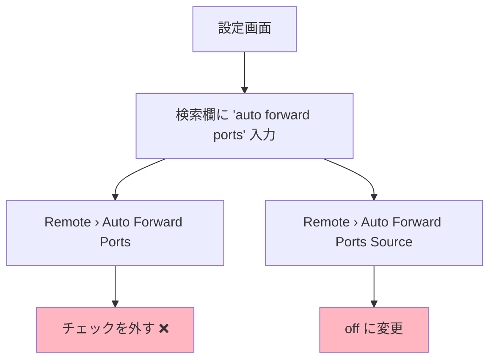
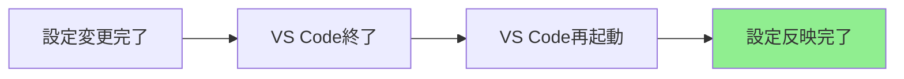
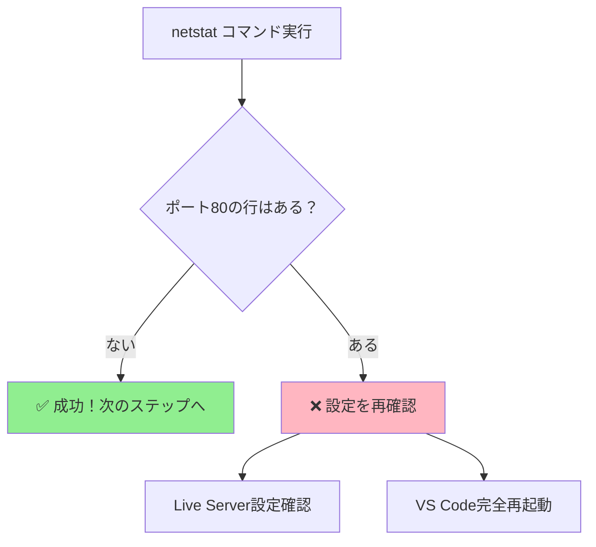
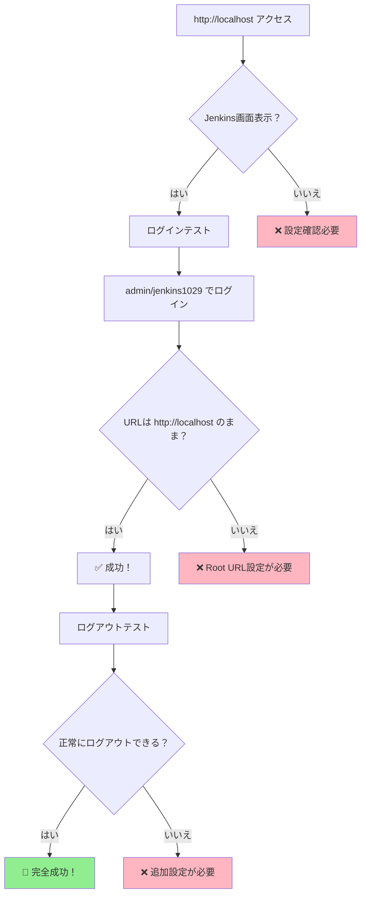

# VS Code設定変更手順書
## Jenkinsのポート問題を解決するための設定変更

### 🎯 目的
VS Codeがポート80を使用しているため、Jenkinsのポートフォワーディングができない問題を解決します。

---

## 📋 手順の全体像



---

## 🔧 手順1: VS Code設定画面を開く

1. **VS Codeを開く**
2. **設定を開く方法（どちらでもOK）:**
   - キーボード: `Ctrl + ,` を押す
   - メニュー: `ファイル` → `ユーザー設定` → `設定`



---

## 🔧 手順2: ポートを使用している機能を特定・変更

### 2-1. まず何がポート80を使用しているか確認

設定画面で以下を順番に検索してください：

1. **`port 80`** と入力
2. **`localhost`** と入力  
3. **`preview`** と入力
4. **`server`** と入力

### 2-2. 見つかった設定項目の確認

以下のような設定が見つかる可能性があります：

- **Live Preview**: `livePreview.serverPortRange`
- **Port forwarding**: `remote.SSH.localServerDownload`
- **Preview Server**: `preview.serverPort`
- **Local Web Server**: `localWebServer.port`



### 2-3. Live Server拡張機能の確認

もしLive Server設定が見つからない場合：

1. **拡張機能タブ**を開く（`Ctrl + Shift + X`）
2. **Live Server**を検索
3. インストールされている場合は設定を確認
4. インストールされていない場合は、他の拡張機能がポート80を使用している可能性

### 📝 なぜこの変更が必要？
- 何らかの機能がポート80を使用している
- ポート80をJenkins用に空ける必要がある
- 5500や8080など他のポートに変更すればOK

---

## 🔧 手順3: 自動ポートフォワーディングを無効化

1. **設定画面の検索欄**に `auto forward ports` と入力
2. 以下の設定を見つけて**チェックを外す**:
   - `Remote › Auto Forward Ports`
   - `Remote › Auto Forward Ports Source` を `off` に変更



### 📝 なぜこの変更が必要？
- VS Codeが勝手にポートを使用するのを防ぐ
- 手動でポート管理をできるようにする

---

## 🔧 手順4: 設定をJSONで直接編集（上級者向け・オプション）

**簡単な方法で設定できた場合はスキップしてOK**

1. `Ctrl + Shift + P`
2. `Preferences: Open Settings (JSON)` を選択
3. 以下を追加:

```json
{
  "liveServer.settings.port": 5500,
  "remote.autoForwardPorts": false,
  "remote.autoForwardPortsSource": "off"
}
```

---

## 🔄 手順5: VS Codeを再起動

1. **VS Codeを完全に終了**
   - `Alt + F4` または `ファイル` → `終了`
2. **VS Codeを再起動**



### ⚠️ 注意
- 必ず**完全に終了**してから再起動してください
- タブを閉じるだけでは設定が反映されません

---

## 🧪 手順6: 設定変更の確認

### ポート80が解放されたかチェック

Git Bashで以下のコマンドを実行:

```bash
netstat -ano | findstr :80
```

**成功例（ポート80が解放された場合）:**
```
TCP         127.0.0.1:808          0.0.0.0:0              LISTENING       19688
TCP         127.0.0.1:8080         0.0.0.0:0              LISTENING       19688
TCP         127.0.0.1:8081         0.0.0.0:0              LISTENING       19688
# ↑ ポート80の行がない = 成功！
```

**失敗例（まだポート80が使用中）:**
```
TCP         127.0.0.1:80           0.0.0.0:0              LISTENING       19688
# ↑ まだポート80が使用されている = 設定確認が必要
```



---

## 🚀 手順7: Jenkinsポートフォワーディング実行

ポート80が解放されたら、以下を実行:

```bash
# AWS認証確認
aws sts get-caller-identity

# Jenkinsポートフォワーディング開始
aws ssm start-session \
  --target $(aws ec2 describe-instances --filters "Name=tag:Environment,Values=poc" "Name=instance-state-name,Values=running" --query 'Reservations[0].Instances[0].InstanceId' --output text --region ap-northeast-1) \
  --document-name AWS-StartPortForwardingSessionToRemoteHost \
  --parameters "{\"host\":[\"$(aws elbv2 describe-load-balancers --query 'LoadBalancers[?contains(LoadBalancerName, jenkins)].DNSName | [0]' --output text --region ap-northeast-1)\"],\"portNumber\":[\"80\"],\"localPortNumber\":[\"80\"]}" \
  --region ap-northeast-1
```

---

## 🎉 手順8: 完了確認

### Jenkinsにアクセステスト

1. ブラウザで `http://localhost` にアクセス
2. Jenkins画面が表示されることを確認
3. ログイン: `admin` / `jenkins1029`
4. **ログイン後のURLが `http://localhost` のままか確認**
5. **ログアウトボタンが正常に機能するか確認**



---

## 🔄 設定を元に戻したい場合

何か問題が発生した場合の復旧手順:

1. **VS Code設定画面**を開く
2. **Live Server › Settings: Port** を **80** に戻す
3. **Remote › Auto Forward Ports** に**チェックを入れる**
4. **Remote › Auto Forward Ports Source** を **process** に変更
5. **VS Code再起動**

---

## ❓ よくある質問

### Q: リモートSSH接続に影響しますか？
**A:** 基本的に影響しません。この設定はローカルのポート使用に関する設定のみです。

### Q: Live Server設定が見つかりません
**A:** 以下を試してください:
- `port 80`, `localhost`, `preview`, `server` で設定を検索
- 拡張機能タブでLive Serverがインストールされているか確認
- 他の拡張機能（Live Preview、Preview Server等）の設定を確認

### Q: 設定変更後もポート80が使用されています
**A:** 以下を確認してください:
- VS Codeを完全に終了・再起動したか
- すべてのポート関連設定を変更したか
- 他の拡張機能がポート80を使用していないか
- 他のアプリケーション（IIS、Apache等）が動いていないか

### Q: Jenkinsアクセス後もリダイレクト問題が発生します
**A:** Jenkins側のRoot URL設定が必要な場合があります。別途設定手順をご案内します。

---

## 📞 サポート

設定でわからないことがあれば、遠慮なく質問してください！
