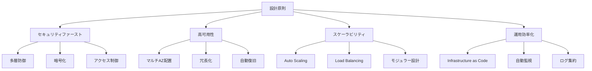
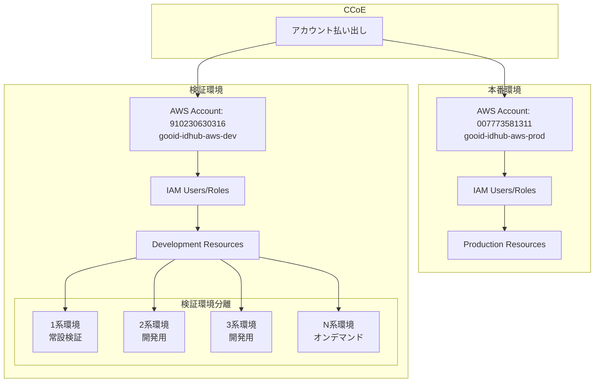
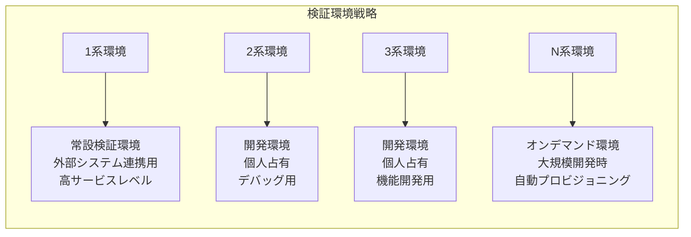

  # システムアーキテクチャ設計書

## 目次

1. [概要](#1-概要)
   - 1.1 [設計目的](#11-設計目的)
   - 1.2 [設計原則](#12-設計原則)
   - 1.3 [適用範囲](#13-適用範囲)
2. [全体アーキテクチャ](#2-全体アーキテクチャ)
   - 2.1 [システム全体構成](#21-システム全体構成)
   - 2.2 [AWSアカウント構成](#22-awsアカウント構成)
   - 2.3 [環境分離設計](#23-環境分離設計)

---

## 1. 概要

### 1.1 設計目的

本設計書は、オンプレミス環境（三鷹DC）で稼働しているidhubシステムをAWSクラウド環境へ移行するためのシステムアーキテクチャを定義する。

**主要目的：**

- 2026年6月の三鷹DC閉鎖に先立つ安全な移行
- セキュリティ要件を満たした多層防御の実現
- 高可用性とスケーラビリティの確保
- 運用負荷の軽減と自動化

### 1.2 設計原則

**設計原則：**

1. **セキュリティファースト**: 多層防御による堅牢なセキュリティの実現
2. **高可用性**: マルチAZ配置による99.9%以上の可用性確保
3. **スケーラビリティ**: 将来のトラフィック増加に対応可能な拡張性
4. **運用効率化**: IaCとマネージドサービスによる運用負荷軽減

### 1.3 適用範囲

- **対象システム**: idhub（OCN IDとdアカウント連携システム）
- **対象環境**: AWS本番環境・検証環境
- **対象ユーザー**: 一般エンドユーザー、内部管理者、外部システム

---

## 2. 全体アーキテクチャ

### 2.1 システム全体構成

```mermaid
graph TB
    subgraph "Internet"
        U[Users]
        ES[External Systems]
    end
    
    subgraph "AWS Cloud"
        subgraph "Edge Services (Global)"
            subgraph "CloudFront Distribution"
                CF[CloudFront CDN]
                WAF[AWS WAF<br/>Web ACL attached]
                SHIELD[AWS Shield Advanced]
            end
        end
        
        subgraph "VPC (10.60.0.0/22) - ap-northeast-1"
            subgraph "AZ-1a (ap-northeast-1a)"
                subgraph "Public-1a"
                    ALB_1a[ALB Target]
                    NGW_1a[NAT Gateway<br/>固定EIP]
                end
                subgraph "Private-1a"
                    EC2_1a[EC2 Instance<br/>Web App Server]
                    WRITER_1a[Aurora Writer<br/>Primary Instance]
                end
                subgraph "FW-1a"
                    NWFW_1a[Network Firewall]
                end
            end
            
            subgraph "AZ-1c (ap-northeast-1c)"
                subgraph "Public-1c"
                    ALB_1c[ALB Target]
                    NGW_1c[NAT Gateway<br/>固定EIP]
                end
                subgraph "Private-1c"
                    EC2_1c[EC2 Instance<br/>Web App Server]
                    READER_1c[Aurora Reader<br/>Read Replica]
                end
                subgraph "FW-1c"
                    NWFW_1c[Network Firewall]
                end
            end
            
            subgraph "AZ-1d (ap-northeast-1d)"
                subgraph "Public-1d"
                    ALB_1d[ALB Target]
                    NGW_1d[NAT Gateway<br/>固定EIP]
                end
                subgraph "Private-1d"
                    EC2_1d[EC2 Instance<br/>Web App Server]
                    READER_1d[Aurora Reader<br/>Read Replica]
                end
                subgraph "FW-1d"
                    NWFW_1d[Network Firewall]
                end
            end
            
            ALB[Application Load Balancer<br/>Multi-AZ Distribution]
        end
        
        subgraph "Managed Services (Region-wide)"
            S3[S3 Buckets<br/>Cross-AZ Replication]
            SECRETS[Secrets Manager<br/>Multi-AZ]
            ACM[Certificate Manager<br/>Global/Regional]
            ENDPOINTS[VPC Endpoints<br/>Multi-AZ]
            AURORA_CLUSTER[Aurora MySQL Cluster<br/>Multi-AZ Storage]
        end
        
        subgraph "Security & Monitoring (Region-wide)"
            CROWDSTRIKE[CrowdStrike EDR<br/>All EC2 Instances]
            FUTUREVULS[Future Vuls<br/>All EC2 Instances]
            DATADOG[Datadog<br/>Multi-AZ Monitoring]
            CLOUDTRAIL[CloudTrail<br/>Region-wide Logging]
        end
    end
    
    U --> CF
    ES --> CF
    WAF -.->|integrated with| CF
    SHIELD -.->|integrated with| CF
    CF --> ALB
    
    ALB --> ALB_1a
    ALB --> ALB_1c  
    ALB --> ALB_1d
    
    ALB_1a --> EC2_1a
    ALB_1c --> EC2_1c
    ALB_1d --> EC2_1d
    
    EC2_1a --> AURORA_CLUSTER
    EC2_1c --> AURORA_CLUSTER
    EC2_1d --> AURORA_CLUSTER
    
    AURORA_CLUSTER -.-> WRITER_1a
    AURORA_CLUSTER -.-> READER_1c
    AURORA_CLUSTER -.-> READER_1d
    
    CROWDSTRIKE -.-> EC2_1a
    CROWDSTRIKE -.-> EC2_1c
    CROWDSTRIKE -.-> EC2_1d
```

**AZ分散配置の詳細：**

| コンポーネント | AZ-1a | AZ-1c | AZ-1d | 備考 |
|---------------|--------|--------|--------|------|
| **EC2 Instance** | ✅ 1台 | ✅ 1台 | ✅ 1台 | **固定3台構成**：各AZに1台ずつ配置（Private Subnet） ※自動復旧・動的スケーリングは将来検討 |
| **Aurora Writer** | ✅ Primary | ❌ | ❌ | 書き込み専用（自動フェイルオーバー対応、Private Subnet） |
| **Aurora Reader** | ❌ | ✅ Replica | ✅ Replica | 読み取り専用（負荷分散、Private Subnet） |
| **ALB Target** | ✅ | ✅ | ✅ | 各AZにターゲット分散（Public Subnet） |
| **NAT Gateway** | ✅ 固定EIP | ✅ 固定EIP | ✅ 固定EIP | 外部通信用（AZ独立、Public Subnet） |
| **Network FW** | ✅ | ✅ | ✅ | 外部通信制御（Firewall Subnet） |

### 2.2 AWSアカウント構成

**アカウント分離ポリシー：**

- 本番環境と検証環境の完全分離
- 環境別IAMユーザー・ロール管理
- Cross-Account Accessは原則禁止

### 2.3 環境分離設計

---

---

## まとめ

本設計書は、idhubシステムのAWS移行における包括的なアーキテクチャの概要を定義しています。

各レイヤーの詳細設計については、[設計ドキュメント一覧](../README.md)を参照してください。
