# ネットワークアーキテクチャ設計書

## 目次

- [概要](#概要)
- [VPC設計](#vpc設計)
- [サブネット設計](#サブネット設計)
- [セキュリティグループ設計](#セキュリティグループ設計)
- [ネットワークファイアウォール設計](#ネットワークファイアウォール設計)
  - [アウトバウンド通信制御の設計方針](#アウトバウンド通信制御の設計方針)
  - [許可ドメインカテゴリ](#許可ドメインカテゴリ)
  - [Stateful Rule Group構成](#stateful-rule-group構成)
  - [DNS解決フロー](#dns解決フロー)
  - [ログ・監視・アラート](#ログ監視アラート)
  - [マルウェア感染時の防御効果](#マルウェア感染時の防御効果)

---

## 概要

本設計書では、idhubシステムのAWS環境におけるネットワークアーキテクチャを定義します。VPC設計、サブネット構成、セキュリティグループ、ネットワークファイアウォールによる多層防御を実現します。

---

## VPC設計


**VPC設計詳細:**

| 項目 | 設定値 | 備考 |
|------|-------|------|
| VPC CIDR | 10.60.0.0/22 | 1024アドレス |
| AZ数 | 3 (1a, 1c, 1d) | マルチAZ冗長化 |
| IPv6対応 | Public/Firewall Subnet | 将来対応（Private Subnetは対応なし） |
| DNS解決 | 有効 | Route53統合 |
| フローログ | S3保存 | セキュリティ監査用 |

---

## サブネット設計


---

## セキュリティグループ設計


**セキュリティグループルール:**

| Security Group | Direction | Protocol | Port | Source/Destination | 用途 |
|---------------|-----------|----------|------|-------------------|------|
| ALB-SG | Inbound | HTTPS | 443 | CloudFrontからのみ | Web通信 |
| ALB-SG | Outbound | HTTP | 80 | EC2-SG | バックエンド通信 |
| EC2-SG | Inbound | HTTP | 80 | ALB-SG | Web通信受信 |
| EC2-SG | Outbound | MySQL | 3306 | Aurora-SG | DB接続 |
| EC2-SG | Outbound | HTTPS | 443 | VPC-SG | VPCエンドポイント接続 |
| Aurora-SG | Inbound | MySQL | 3306 | EC2-SG | DB通信受信 |
| Management-SG | Outbound | MySQL | 3306 | Aurora-SG | DB管理 |

---

## ネットワークファイアウォール設計

```mermaid
graph TB
    subgraph "AWS Network Firewall Architecture"
        subgraph "Firewall Policy"
            FW_POLICY[Firewall Policy<br/>Stateful + Stateless]
            
            subgraph "Stateful Rule Groups - Priority Order"
                SRG_ALLOWLIST[Priority 100<br/>Domain Allowlist Rules<br/>許可ドメイン明示]
                SRG_THREAT[Priority 200<br/>AWS Managed Threat Intel<br/>既知の悪意あるIP/ドメインブロック]
                SRG_IPS[Priority 300<br/>Suricata IPS Rules<br/>侵入検知・防御]
                SRG_DENYALL[Priority 400<br/>Default Deny<br/>明示的に許可されていない全通信をブロック]
            end
            
            subgraph "Stateless Rule Groups"
                SLR_BASIC[Fragment Packets<br/>基本プロトコル許可]
                SLR_DDOS[Rate Limiting<br/>DDoS対策]
            end
            
            subgraph "Domain Allowlist Configuration"
                ALLOW_AWS[AWSサービスドメイン<br/>*.amazonaws.com<br/>*.cloudfront.net]
                ALLOW_PKG[パッケージリポジトリ<br/>*.rubygems.org<br/>github.com]
                ALLOW_CDN[CDN/外部API<br/>特定のSaaS/サービス]
                ALLOW_MONITORING[監視ツール<br/>*.datadoghq.com<br/>*.crowdstrike.com]
                ALLOW_CUSTOM[個別許可ドメイン<br/>業務要件に応じて追加]
            end
        end
        
        subgraph "通信フロー制御"
            PRIVATE[Private Subnet<br/>EC2 Instances] --> FW_SUBNET[Firewall Subnet<br/>Network Firewall Endpoint]
            FW_SUBNET --> NAT[NAT Gateway]
            NAT --> IGW[Internet Gateway]
            IGW --> INTERNET[Internet<br/>許可されたドメインのみ]
            
            subgraph "DNS Resolution"
                DNS_QUERY[DNS Lookup<br/>Route 53 Resolver]
                DNS_RESPONSE[IP Address Resolution<br/>健全な対向先確認]
            end
        end
        
        subgraph "Logging & Monitoring"
            FW_LOGS[Network Firewall Logs<br/>S3 + CloudWatch Logs]
            LOG_ALERT[Blocked Traffic Alerts<br/>Datadog/SNS通知]
            LOG_FLOW[VPC Flow Logs<br/>全ネットワーク通信記録]
        end
    end
    
    FW_POLICY --> SRG_ALLOWLIST
    FW_POLICY --> SRG_THREAT
    FW_POLICY --> SRG_IPS
    FW_POLICY --> SRG_DENYALL
    FW_POLICY --> SLR_BASIC
    FW_POLICY --> SLR_DDOS
    
    SRG_ALLOWLIST --> ALLOW_AWS
    SRG_ALLOWLIST --> ALLOW_PKG
    SRG_ALLOWLIST --> ALLOW_CDN
    SRG_ALLOWLIST --> ALLOW_MONITORING
    SRG_ALLOWLIST --> ALLOW_CUSTOM
    
    PRIVATE --> DNS_QUERY
    DNS_QUERY --> DNS_RESPONSE
    DNS_RESPONSE --> FW_SUBNET
    
    FW_SUBNET --> FW_LOGS
    FW_LOGS --> LOG_ALERT
    FW_SUBNET --> LOG_FLOW
```



### アウトバウンド通信制御の設計方針

**要件:**

- アウトバウンド通信は、ドメイン、もしくはワイルドカード付きのドメインで、対向先を限定
- DNSルックアップによる健全な対向先との接続確認
- システムセキュリティ対策マニュアル準拠（インバウンド・アウトバウンド通信ともに必要最小限のみ許可）

**設計アプローチ:**

| 項目 | 設計内容 | 備考 |
|------|---------|------|
| **基本方針** | Default Deny (デフォルト拒否) | 明示的に許可されたドメインのみ通信可能 |
| **許可方式** | ドメインベースのホワイトリスト | ワイルドカード対応 (`*.amazonaws.com`) |
| **DNS解決** | Route 53 Resolver経由 | 健全な対向先IP確認 |
| **ルール優先度** | Stateful Rule Group順序制御 | Allowlist → Threat Intel → IPS → Deny All |
| **ログ記録** | 全ての通信試行を記録 | ブロックされた通信も含む |

### 許可ドメインカテゴリ

- （記載のドメインは一例。今後、追加・削除が必要。）

| カテゴリ | ドメイン例 | 用途 | 優先度 |
|---------|-----------|------|--------|
| **AWSサービス** | `*.amazonaws.com`, `*.cloudfront.net`, `*.ecr.aws` | EC2, S3, CloudFront, ECR等のAPI通信 | 最優先 |
| **監視ツール** | `*.datadoghq.com`, `*.crowdstrike.com`, `vuls.biz` | Datadog, CrowdStrike, Future Vuls通信 | 高 |
| **コンテナレジストリ** | `*.docker.com`, `*.docker.io`, `*.cloudflarestorage.com` | Dockerイメージ取得 | 高 |
| **バージョン管理** | `*.github.com` | ソースコード取得、GitHub連携 | 高 |
| **パッケージ管理** | `*.rubygems.org` | Rubyパッケージ取得 | 中 |
| **OS更新** | `*.rockylinux.org`, `*.iij.ad.jp` | OSパッケージ・セキュリティパッチ適用 | 高 |
| **業務システム** | `.goo.ne.jp` | 自社サービスドメイン | 最優先 |
| **セキュリティ** | `*.trendmicro.com` | Deep Security連携 | 高 |
| **証明書検証** | `ocsp.*.amazontrust.com`, `crl.*.amazontrust.com` | SSL/TLS証明書検証 | 高 |

### Stateful Rule Group構成

**Priority 100: Domain Allowlist Rules**

```yaml
# Production environment domain whitelist example
rules:
  - action: PASS
    protocol: TLS
    destination:
      # AWS Services
      - "*.amazonaws.com"
      - "*.cloudfront.net"
      - "*.ecr.aws"
      # Monitoring Tools
      - "*.datadoghq.com"
      - "*.crowdstrike.com"
      - "vuls.biz"
      # Container Registry
      - "*.docker.com"
      - "*.docker.io"
      - "*.cloudflarestorage.com"
      # Version Control
      - "*.github.com"
      # Package Management
      - "*.rubygems.org"
      # OS Updates
      - "*.rockylinux.org"
      - "*.iij.ad.jp"
      # Business Systems
      - ".goo.ne.jp"
      # Security
      - "*.trendmicro.com"
      # Add as needed based on business requirements
```

**Priority 200: AWS Managed Threat Intelligence**

- AWS Managed Rule Group: `AbusedLegitBotNetCommandAndControlDomainsActionOrder`
- AWS Managed Rule Group: `AbusedLegitMalwareDomainsActionOrder`
- 既知の悪意あるIP/ドメインを自動ブロック

**Priority 300: Suricata IPS Rules**

- 侵入検知・防御（IPS）ルール
- OWASP Top 10対策
- エクスプロイト検知

**Priority 400: Default Deny**

```yaml
# 明示的に許可されていない全ての外部通信をブロック
rules:
  - action: DROP
    protocol: ANY
    destination: ANY
    log: true  # ブロックされた通信を全てログ記録
```

### DNS解決フロー


### ログ・監視・アラート

**ログ出力先:**

- **S3 Bucket**: 長期保存(90日→Glacier)
- **CloudWatch Logs**: リアルタイム監視(30日保持)

**Network Firewall監視項目:**

| メトリクス | 閾値 | アラート |
|-----------|------|---------|
| ブロックされた通信数 | >100/時間 | 警告通知 |
| 新規ドメインへの通信試行 | 即座 | 調査アラート |
| 脅威インテリジェンスマッチ | 即座 | 緊急アラート |
| ファイアウォールルール変更 | 即座 | 監査ログ記録 |

**運用プロセス:**

1. **新規ドメイン追加申請**: 業務要件に基づく申請・承認フロー
2. **定期レビュー**: 月次で許可ドメインリストを見直し
3. **ブロックログ分析**: 週次でブロックされた通信を分析・必要に応じて許可検討
4. **緊急時対応**: セキュリティインシデント発生時の迅速なルール更新

### マルウェア感染時の防御効果

**設計による防御メカニズム:**


**防御効果:**

- 仮にマルウェアに感染しても、外部の悪意あるサイト(C&Cサーバ等)へ接続不可
- DNS解決により、動的に変化するIPアドレスにも対応
- AWS Managed Threat Intelligenceにより、最新の脅威情報を自動反映
