# EC2システム設計書

## 目次
- [EC2システム設計書](#ec2システム設計書)
  - [目次](#目次)
  - [1. 設計概要](#1-設計概要)
    - [1.1 本設計書の位置づけ](#11-本設計書の位置づけ)
    - [1.2 設計方針](#12-設計方針)
    - [1.3 参照ドキュメント](#13-参照ドキュメント)
    - [1.4 前提条件](#14-前提条件)
  - [2. ディレクトリ構成設計](#2-ディレクトリ構成設計)
    - [2.1 設計方針](#21-設計方針)
      - [2.1.1 基本方針](#211-基本方針)
      - [2.1.2 旧構成（オンプレミス）との比較](#212-旧構成オンプレミスとの比較)
    - [2.2 ディレクトリ構成](#22-ディレクトリ構成)
      - [2.2.1 標準ディレクトリマップ](#221-標準ディレクトリマップ)
      - [2.2.2 アプリケーション配置](#222-アプリケーション配置)
    - [2.3 ストレージ設計](#23-ストレージ設計)
      - [2.3.1 ルートボリューム設計](#231-ルートボリューム設計)
      - [2.3.2 gp3選定理由](#232-gp3選定理由)
      - [2.3.3 EBS追加アタッチを行わない理由](#233-ebs追加アタッチを行わない理由)
    - [2.4 ログ管理設計](#24-ログ管理設計)
      - [2.4.1 ログ出力方針](#241-ログ出力方針)
      - [2.4.2 ログ収集フロー](#242-ログ収集フロー)
    - [2.5 ディスク使用量監視](#25-ディスク使用量監視)
    - [2.6 将来拡張への考慮](#26-将来拡張への考慮)
  - [3. インスタンスタイプ最適化設計](#3-インスタンスタイプ最適化設計)
    - [3.1 環境別インスタンスタイプ選定](#31-環境別インスタンスタイプ選定)
      - [2.1.1 選定結果](#211-選定結果)
      - [2.1.2 選定根拠](#212-選定根拠)
      - [2.1.3 代替インスタンスタイプ候補（ベースライン安定化）](#213-代替インスタンスタイプ候補ベースライン安定化)
      - [2.1.4 Apache Tomcatワークロードの考慮点](#214-apache-tomcatワークロードの考慮点)
    - [3.2 ワークロード特性分析](#32-ワークロード特性分析)
      - [3.2.1 想定ワークロード](#321-想定ワークロード)
      - [2.2.2 T3クレジット管理](#222-t3クレジット管理)
    - [3.3 インスタンスタイプ変更戦略](#33-インスタンスタイプ変更戦略)
      - [3.3.1 スペック変更フロー](#331-スペック変更フロー)
      - [2.3.2 スケールアップ・ダウン基準](#232-スケールアップダウン基準)
    - [3.4 【検討課題】追加分析が必要な項目](#34-検討課題追加分析が必要な項目)
      - [3.4.1 オンプレミス環境の詳細分析](#341-オンプレミス環境の詳細分析)
      - [2.4.2 アプリケーション特性の分析](#242-アプリケーション特性の分析)
  - [4. AMI管理戦略設計](#4-ami管理戦略設計)
    - [4.1 ゴールデンAMI戦略](#41-ゴールデンami戦略)
      - [4.1.1 AMI構成レイヤー](#411-ami構成レイヤー)
      - [3.1.2 AMI命名規則](#312-ami命名規則)
    - [4.2 AMI作成パイプライン設計](#42-ami作成パイプライン設計)
      - [4.2.1 EC2 Image Builder活用（推奨）](#421-ec2-image-builder活用推奨)
      - [3.2.2 手動作成フロー（代替案）](#322-手動作成フロー代替案)
    - [4.3 AMI世代管理](#43-ami世代管理)
      - [4.3.1 保持ポリシー](#431-保持ポリシー)
      - [3.3.2 AMIタグ管理](#332-amiタグ管理)
    - [4.4 AMI更新サイクル](#44-ami更新サイクル)
      - [4.4.1 定期更新スケジュール](#441-定期更新スケジュール)
    - [4.5 【検討課題】AMI管理の追加検討項目](#45-検討課題ami管理の追加検討項目)
  - [5. パッチ管理自動化設計](#5-パッチ管理自動化設計)
    - [5.1 Systems Manager Patch Manager設計](#51-systems-manager-patch-manager設計)
      - [4.1.1 パッチベースライン設定](#411-パッチベースライン設定)
      - [4.1.2 月次パッチ適用スケジュール（Immutable方式）](#412-月次パッチ適用スケジュールimmutable方式)
    - [5.2 パッチ適用フロー（Immutable方式 - Blue/Greenデプロイメント）](#52-パッチ適用フローimmutable方式---bluegreenデプロイメント)
      - [5.2.1 無停止パッチ適用の実現方法（Immutableインフラストラクチャ）](#521-無停止パッチ適用の実現方法immutableインフラストラクチャ)
      - [4.2.2 環境別適用スケジュール](#422-環境別適用スケジュール)
    - [5.3 パッチ適用後の確認項目](#53-パッチ適用後の確認項目)
      - [5.3.1 自動確認項目（新インスタンス起動後）](#531-自動確認項目新インスタンス起動後)
      - [4.3.2 手動確認項目](#432-手動確認項目)
    - [5.4 ロールバック手順](#54-ロールバック手順)
    - [5.5 【検討課題】パッチ管理の追加検討項目](#55-検討課題パッチ管理の追加検討項目)
  - [6. スケーリング運用設計](#6-スケーリング運用設計)
    - [6.1 手動スケーリング方針](#61-手動スケーリング方針)
      - [6.1.1 手動スケーリング採用理由](#611-手動スケーリング採用理由)
    - [6.2 スケールアウト運用設計](#62-スケールアウト運用設計)
      - [6.2.1 スケールアウト判断基準](#621-スケールアウト判断基準)
      - [5.2.2 スケールアウト実施手順](#522-スケールアウト実施手順)
    - [6.3 スケールイン運用設計](#63-スケールイン運用設計)
      - [6.3.1 スケールイン判断基準](#631-スケールイン判断基準)
      - [5.3.2 スケールイン実施手順](#532-スケールイン実施手順)
    - [6.4 Launch Template設計](#64-launch-template設計)
      - [6.4.1 Launch Template構成](#641-launch-template構成)
      - [6.4.2 IAMロール・ポリシー設計（🔴 優先度：高）](#642-iamロールポリシー設計-優先度高)
        - [5.4.2.1 本番環境の現状（既存リソース）](#5421-本番環境の現状既存リソース)
        - [5.4.2.2 追加が必要なカスタムポリシー](#5422-追加が必要なカスタムポリシー)
        - [5.4.2.3 セキュリティ考慮事項](#5423-セキュリティ考慮事項)
        - [5.4.2.4 既存環境への適用手順](#5424-既存環境への適用手順)
        - [5.4.2.5 新規Launch Templateでの設定](#5425-新規launch-templateでの設定)
        - [5.4.2.6 実装チェックリスト](#5426-実装チェックリスト)
      - [6.4.3 【検討課題】インスタンス初回起動時設計](#643-検討課題インスタンス初回起動時設計)
        - [5.4.3.1 EventBridge + Lambda + DynamoDB詳細設計](#5431-eventbridge--lambda--dynamodb詳細設計)
    - [6.5 スケーリング運用体制](#65-スケーリング運用体制)
      - [6.5.1 運用時間帯別体制](#651-運用時間帯別体制)
    - [6.6 【スコープ対象外課題】スケーリング運用の将来検討項目](#66-スコープ対象外課題スケーリング運用の将来検討項目)
  - [7. 起動最適化設計](#7-起動最適化設計)
    - [7.1 起動時間目標](#71-起動時間目標)
    - [7.2 起動最適化手法](#72-起動最適化手法)
      - [7.2.1 ゴールデンAMIの活用](#721-ゴールデンamiの活用)
      - [7.2.2 CloudFormation::Init（代替案）](#722-cloudformationinit代替案)
    - [7.3 【検討課題】起動最適化の追加検討項目](#73-検討課題起動最適化の追加検討項目)
  - [8. セキュリティ強化設計](#8-セキュリティ強化設計)
    - [8.1 IMDSv2強制設定](#81-imdsv2強制設定)
      - [8.1.1 設定内容](#811-設定内容)
    - [8.2 VPCエンドポイント設計](#82-vpcエンドポイント設計)
      - [7.2.1 必要なVPCエンドポイント](#721-必要なvpcエンドポイント)
      - [7.2.2 VPCエンドポイント利用メリット](#722-vpcエンドポイント利用メリット)
    - [8.3 セキュリティグループ設計](#83-セキュリティグループ設計)
      - [8.3.1 最小権限の原則](#831-最小権限の原則)
    - [8.4 Session Manager設定](#84-session-manager設定)
      - [8.4.1 Session Managerポリシー](#841-session-managerポリシー)
      - [7.4.2 セッションログ記録](#742-セッションログ記録)
    - [8.5 セキュリティ強化の実装仕様](#85-セキュリティ強化の実装仕様)
      - [8.5.1 CrowdStrike Falcon導入仕様](#851-crowdstrike-falcon導入仕様)
      - [7.5.2 WAFルール設計](#752-wafルール設計)
      - [7.5.3 セキュリティ監査設定](#753-セキュリティ監査設定)
  - [9. 監視・ロギング設計](#9-監視ロギング設計)
    - [9.1 CloudWatch監視設計](#91-cloudwatch監視設計)
      - [8.1.1 基本メトリクス](#811-基本メトリクス)
      - [8.1.2 カスタムメトリクス（1分間隔）](#812-カスタムメトリクス1分間隔)
    - [9.2 アラート設計](#92-アラート設計)
      - [9.2.1 アラート閾値](#921-アラート閾値)
    - [9.3 ログ設計](#93-ログ設計)
      - [9.3.1 ログ収集方式の検討](#931-ログ収集方式の検討)
        - [9.3.1.1 ログ収集方式の比較](#9311-ログ収集方式の比較)
        - [8.3.1.2 比較マトリクス](#8312-比較マトリクス)
        - [8.3.1.3 AWS Well-Architected Frameworkの観点](#8313-aws-well-architected-frameworkの観点)
        - [8.3.1.4 推奨方式](#8314-推奨方式)
        - [8.3.1.5 最終決定事項（要記入）](#8315-最終決定事項要記入)
      - [8.3.2 ログ収集対象（選定方式に応じて更新予定）](#832-ログ収集対象選定方式に応じて更新予定)
    - [9.4 Datadog統合](#94-datadog統合)
      - [9.4.1 Datadog Agent設定](#941-datadog-agent設定)
      - [8.4.2 Datadog導入範囲](#842-datadog導入範囲)
      - [8.4.3 Datadogコスト試算](#843-datadogコスト試算)
    - [9.5 ログ保持期間設計](#95-ログ保持期間設計)
      - [9.5.1 ログ保持ポリシー](#951-ログ保持ポリシー)
    - [9.6 ログ監視とアラート設計](#96-ログ監視とアラート設計)
      - [9.6.1 メトリクスフィルタ設計の検討](#961-メトリクスフィルタ設計の検討)
      - [8.6.2 CloudWatch Alarm設計の検討](#862-cloudwatch-alarm設計の検討)
      - [8.6.3 SNS通知設計の検討](#863-sns通知設計の検討)
      - [8.6.4 実装方法の検討](#864-実装方法の検討)
      - [8.6.5 テストとチューニングの検討](#865-テストとチューニングの検討)
      - [8.6.6 コスト試算](#866-コスト試算)
      - [8.6.7 運用フローの検討](#867-運用フローの検討)
      - [8.6.8 doc-idhub/design/08.monitoring へのフィードバック事項](#868-doc-idhubdesign08monitoring-へのフィードバック事項)
    - [9.7 ダッシュボード設計](#97-ダッシュボード設計)
      - [9.7.1 運用ダッシュボード](#971-運用ダッシュボード)
      - [8.6.2 経営層向けダッシュボード](#862-経営層向けダッシュボード)
      - [8.6.3 インシデント対応ダッシュボード](#863-インシデント対応ダッシュボード)
    - [9.8 【検討課題】監視・ロギングの追加検討項目](#98-検討課題監視ロギングの追加検討項目)
  - [10. コスト最適化設計](#10-コスト最適化設計)
    - [10.1 EC2 Instance Savings Plans](#101-ec2-instance-savings-plans)
      - [10.1.1 採用方針](#1011-採用方針)
      - [10.1.2 コスト試算](#1012-コスト試算)
    - [10.2 その他のコスト最適化](#102-その他のコスト最適化)
      - [10.2.1 インスタンス最適化](#1021-インスタンス最適化)
      - [9.2.2 ストレージ最適化](#922-ストレージ最適化)
    - [10.3 Savings Plans詳細設計](#103-savings-plans詳細設計)
      - [10.3.1 環境別稼働時間分析](#1031-環境別稼働時間分析)
      - [9.3.2 正確なコスト試算（2025年11月時点、東京リージョン）](#932-正確なコスト試算2025年11月時点東京リージョン)
      - [10.3.3 ROI計算](#1033-roi計算)
    - [10.4 リザーブドインスタンス比較分析](#104-リザーブドインスタンス比較分析)
      - [10.4.1 Savings Plans vs リザーブドインスタンス比較](#1041-savings-plans-vs-リザーブドインスタンス比較)
      - [9.4.2 長期コストシミュレーション（3年間）](#942-長期コストシミュレーション3年間)
    - [10.5 コスト配分タグ戦略](#105-コスト配分タグ戦略)
      - [10.5.1 タグ設計](#1051-タグ設計)
      - [9.5.2 Cost Explorerダッシュボード設計](#952-cost-explorerダッシュボード設計)
    - [10.6 【検討課題】コスト最適化の追加検討項目](#106-検討課題コスト最適化の追加検討項目)
  - [11. CI/CDパイプライン設計](#11-cicdパイプライン設計)
    - [11.1 CI/CDアーキテクチャ概要](#111-cicdアーキテクチャ概要)
      - [11.1.1 全体アーキテクチャ](#1111-全体アーキテクチャ)
      - [10.1.2 採用技術スタック](#1012-採用技術スタック)
    - [11.2 Jenkins CIパイプライン設計](#112-jenkins-ciパイプライン設計)
      - [11.2.1 パイプライン構成](#1121-パイプライン構成)
      - [10.2.2 Jenkins設定](#1022-jenkins設定)
    - [11.3 AWS CodePipeline統合](#113-aws-codepipeline統合)
      - [11.3.1 CodePipeline構成](#1131-codepipeline構成)
      - [10.3.2 CodeBuild設定](#1032-codebuild設定)
    - [11.4 Blue/Greenデプロイメント設計](#114-bluegreenデプロイメント設計)
      - [11.4.1 CodeDeploy設定](#1141-codedeploy設定)
      - [10.4.2 Blue/Greenデプロイフロー](#1042-bluegreenデプロイフロー)
      - [10.4.3 デプロイスクリプト](#1043-デプロイスクリプト)
    - [11.5 Ansible統合設計](#115-ansible統合設計)
      - [11.5.1 Ansible Playbook構成](#1151-ansible-playbook構成)
      - [10.5.2 環境別設定管理](#1052-環境別設定管理)
    - [11.6 デプロイメント戦略](#116-デプロイメント戦略)
      - [11.6.1 環境別デプロイ戦略](#1161-環境別デプロイ戦略)
      - [10.6.2 ロールバック戦略](#1062-ロールバック戦略)
    - [11.7 【検討課題】CI/CDパイプラインの追加検討項目](#117-検討課題cicdパイプラインの追加検討項目)
  - [12. 次のステップ](#12-次のステップ)
    - [12.1 即座に必要な情報収集](#121-即座に必要な情報収集)
      - [優先度：高](#優先度高)
      - [優先度：中](#優先度中)
    - [12.2 設計書の完成に向けて](#122-設計書の完成に向けて)
  - [改版履歴](#改版履歴)

---

## 1. 設計概要

### 1.1 本設計書の位置づけ
本設計書は「EC2要件定義書」に基づき、オンプレミス環境からAWS EC2への移行プロジェクトにおける、EC2インスタンスの詳細設計を定義する。

### 1.2 設計方針
- **Immutableインフラストラクチャ**: ゴールデンAMIによる不変インフラの実現
- **セキュリティファースト**: 多層防御、最小権限の原則、暗号化の徹底
- **運用自動化**: Systems Managerによる運用タスクの自動化
- **コスト最適化**: Savings Plans活用、適切なインスタンスタイプ選定
- **可用性重視**: マルチAZ構成、手動スケーリング対応

### 1.3 参照ドキュメント
- EC2要件定義書
- マイグレーション検証プロセス
- システムセキュリティ対策チェックリスト

### 1.4 前提条件
- オンプレミス環境からのリフト&シフト移行
- バッチ処理はLambda化、データベースはAurora MySQL化
- 既存のWebアプリケーション（Apache + Tomcat Spring Boot）を継続利用
- 運用ノウハウを活用した段階的モダナイゼーション

---

## 2. ディレクトリ構成設計

### 2.1 設計方針

本プロジェクトでは、**Immutableインフラストラクチャ**の原則に基づいたディレクトリ構成を採用する。

#### 2.1.1 基本方針

```yaml
方針1: Amazon Linux 2023標準構成を踏襲
  - AWS推奨のディレクトリ構成をそのまま使用
  - カスタムマウントポイントは作成しない
  - 標準的なLinux FHS (Filesystem Hierarchy Standard) に準拠

方針2: EBSボリュームの追加アタッチは行わない
  - ルートボリューム（/）のみを使用
  - Immutable構成を維持しやすくする
  - スケーリング時のボリューム管理を簡素化
  - AMIからの起動を高速化

方針3: ログは標準出力へ
  - アプリケーションログ: stdout/stderr
  - システムログ: journald → CloudWatch Logs Agent
  - ディスクI/O削減、CloudWatch Logs直接収集
  - 12-factor app準拠のクラウドネイティブ設計

方針4: ルートボリュームサイズの最適化
  - デフォルト8GB → 50GBに拡大
  - OS + ミドルウェア + アプリケーション + ログバッファ
  - 成長余地を考慮した適切なサイジング
```

#### 2.1.2 旧構成（オンプレミス）との比較

```yaml
# オンプレミス構成（廃止）
/db0:
  用途: データベース領域（想定）
  判断: RDS Aurora移行により不要
  
追加EBSボリューム:
  用途: データ永続化
  判断: Immutable構成では不要
        必要なデータはS3/EFS/RDSへ
```

### 2.2 ディレクトリ構成

#### 2.2.1 標準ディレクトリマップ

```
/ (root volume: 50GB gp3)
├── /bin                    # Essential command binaries
├── /boot                   # Boot loader files
├── /dev                    # Device files
├── /etc                    # System configuration files
│   ├── /httpd             # Apache configuration
│   │   ├── conf/
│   │   ├── conf.d/
│   │   └── conf.modules.d/
│   ├── /systemd           # systemd unit files
│   │   └── system/
│   └── /opt/aws/          # AWS services configuration
│       └── amazon-cloudwatch-agent/
├── /home                   # User home directories
├── /lib                    # Shared libraries
├── /lib64                  # 64-bit shared libraries
├── /media                  # Removable media mount points
├── /mnt                    # Temporary mount points
├── /opt                    # Optional application software
│   ├── /aws/              # AWS agents and tools
│   │   └── amazon-cloudwatch-agent/
│   └── /crowdstrike/      # CrowdStrike Falcon agent
├── /proc                   # Process information (virtual)
├── /root                   # Root user home directory
├── /run                    # Run-time variable data
├── /sbin                   # System binaries
├── /srv                    # Service data
│   └── /www/              # Web application files
│       ├── html/          # Document root
│       └── app/           # Application code
├── /sys                    # System information (virtual)
├── /tmp                    # Temporary files (cleaned on boot)
├── /usr                    # User programs
│   ├── /bin
│   ├── /lib
│   ├── /lib64
│   ├── /local
│   └── /share
└── /var                    # Variable data
    ├── /cache             # Application cache
    ├── /lib               # State information
    ├── /log               # Log files (minimal use)
    │   ├── messages       # System logs (rsyslog enabled)
    │   ├── secure         # Authentication logs
    │   ├── httpd/         # Apache logs (if file-based)
    │   └── journal/       # systemd journal (primary)
    ├── /run               # Run-time variable data
    ├── /spool             # Spool directories
    └── /tmp               # Temporary files preserved between reboots
```

#### 2.2.2 アプリケーション配置

```yaml
Webアプリケーション:
  配置先: /srv/www/app/
  理由:
    - FHS準拠（/srv = service data）
    - /var/www よりもアプリケーション用途が明確
    - Apache DocumentRoot: /srv/www/html/
    - Application Code: /srv/www/app/

設定ファイル:
  配置先: /etc/httpd/
  理由: Apacheデフォルト位置、rpm管理との整合性

ミドルウェア:
  配置先: /usr/bin/, /usr/lib64/
  理由: パッケージマネージャ（dnf）管理
```

### 2.3 ストレージ設計

#### 2.3.1 ルートボリューム設計

```yaml
Volume Type: gp3 (General Purpose SSD)
Size: 50GB
IOPS: 3000 (baseline)
Throughput: 125 MB/s (baseline)
Encryption: 有効 (AWS managed key)
Delete on Termination: true

サイジング根拠:
  OS + システムファイル: ~5GB
  ミドルウェア (Apache, Java): ~5GB
  アプリケーションコード: ~5GB
  CloudWatch Agent バッファ: ~2GB
  システムログバッファ: ~3GB
  成長余地・一時ファイル: ~30GB
  合計: 50GB
```

#### 2.3.2 gp3選定理由

```yaml
gp2からgp3への移行メリット:
  - 同価格でIOPS・スループット向上
  - ベースライン性能: 3000 IOPS（gp2は150 IOPS/GB）
  - 独立したIOPSとスループット設定
  - バースト不要の安定性能

コスト:
  50GB gp3: 約 $5/月（東京リージョン）
  - ストレージ: $0.096/GB/月 × 50GB = $4.80
  - 追加IOPS: なし（3000 IOPSで十分）
```

#### 2.3.3 EBS追加アタッチを行わない理由

```yaml
Immutable構成のメリット:
  1. AMIから完全再現可能
     - インスタンス削除→再作成が容易
     - Auto Scaling対応がシンプル
  
  2. 運用負荷削減
     - ボリューム管理不要
     - アタッチ/デタッチ操作不要
     - スナップショット管理がシンプル
  
  3. スケーリング高速化
     - EBSアタッチ待ち時間なし
     - 起動時間短縮
  
  4. コスト最適化
     - 使用していないEBSボリュームの課金回避
     - ボリューム最適化が容易

データ永続化の代替手段:
  - データベース: RDS Aurora (マネージドサービス)
  - 共有ファイル: EFS (必要に応じて)
  - オブジェクトストレージ: S3 (バックアップ、静的ファイル)
  - セッション: ElastiCache Redis (検討中)
```

### 2.4 ログ管理設計

#### 2.4.1 ログ出力方針

```yaml
基本方針: 標準出力 (stdout/stderr)
  - アプリケーションログ → stdout
  - エラーログ → stderr
  - systemdがjournaldへキャプチャ
  - CloudWatch Logs Agentが収集

メリット:
  1. ディスクI/O削減
     - ファイルシステムへの書き込み不要
     - ログローテーション不要
  
  2. クラウドネイティブ
     - 12-factor app準拠
     - コンテナ化への移行が容易
  
  3. 集中管理
     - CloudWatch Logsで一元管理
     - ログ検索・分析が容易
     - 長期保存はS3へ自動アーカイブ

システムログ:
  - journald (systemd journal) がプライマリ
  - rsyslog有効化で /var/log/messages も利用可能
  - CloudWatch Logs Agentがjournaldから直接収集
```

#### 2.4.2 ログ収集フロー

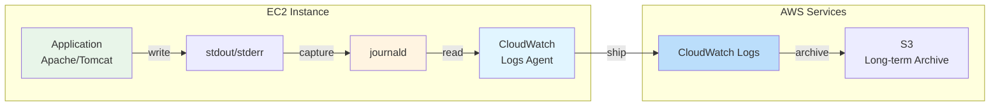

詳細は「[8.3 ログ設計](#83-ログ設計)」および「CloudWatch Logs Agent によるログ収集完全ガイド」を参照。

### 2.5 ディスク使用量監視

```yaml
CloudWatch Alarm設定:
  Metric: disk_used_percent
  Path: /
  Threshold:
    Warning: 70%
    Critical: 85%
  Period: 5 minutes
  
対処手順:
  1. 70%到達時:
     - ログ確認（/var/log/journal/ サイズ）
     - CloudWatch Logs送信状況確認
     - 一時ファイル確認（/tmp, /var/tmp）
  
  2. 85%到達時:
     - 緊急対応: journalctl vacuum（古いログ削除）
     - AMIサイズ見直し検討
     - インスタンス再作成（必要に応じて）
```

### 2.6 将来拡張への考慮

```yaml
EFS利用検討（必要に応じて）:
  用途: 複数インスタンス間での共有ファイル
  マウントポイント: /mnt/efs
  例: セッションファイル、アップロードファイル

EBSスナップショット:
  - AMI作成時に自動的に含まれる
  - 追加EBSボリューム管理が不要
  - リカバリが容易

コンテナ化への移行:
  - 標準出力ログ → そのまま利用可能
  - Immutable構成 → コンテナと親和性高い
  - /srv/www/app/ → Dockerイメージ化が容易
```

---

## 3. インスタンスタイプ最適化設計

### 3.1 環境別インスタンスタイプ選定

#### 2.1.1 選定結果

| 環境 | インスタンスタイプ | vCPU | メモリ | 選定理由 |
|------|-------------------|------|--------|---------|
| 開発環境 | t3.medium | 2 | 4GB | 開発・テスト用途、低負荷想定 |
| ステージング環境 | t3.2xlarge | 8 | 32GB | 本番同等の負荷テスト実施 |
| 本番環境 | t3.2xlarge | 8 | 32GB | 本番ワークロード対応 |

#### 2.1.2 選定根拠

**現行環境からの移行判断**:
```yaml
現行サーバー（オンプレミス）:
  CPU: 8コア（実使用率10%以下、idle 90%以上）
  メモリ: 23GB搭載（最大22.06GB使用、使用率96%）
  OS: Rocky Linux 8

課題:
  - CPU: 大幅にオーバースペック
  - メモリ: ほぼ上限まで使用、不足リスク
```

**T3ファミリー選定理由**:
- **バースト性能**: クレジット方式による柔軟な性能対応
  - 低CPU使用率（10%以下）の環境に最適
  - クレジット蓄積により、突発負荷に対応可能
- **コストパフォーマンス**: 汎用ワークロードに最適
  - M5比で約10%安価
  - 低CPU使用環境でのコスト効率が優れる
- **ベースライン性能**: t3.2xlargeは20%のベースライン（継続的に利用可能なCPU性能）
```
T3インスタンスのクレジットシステム:
- ベースライン: インスタンスサイズに応じた継続利用可能なCPU性能
- t3.2xlarge: 8vCPUの20% = 1.6vCPU分の性能を継続的に利用可能
  （現行の実使用0.8コアに対し2倍の余裕）
- バースト: クレジットがある場合、最大100%（8vCPU）まで性能向上
- クレジット: CPU使用率がベースライン以下の場合に蓄積、使用時に消費

例: t3.2xlargeの場合
- ベースライン: 1.6vCPU相当の性能（24時間365日利用可能）
- バースト時: 最大8vCPUまで性能向上可能
- クレジットバランス: 未使用時はクレジット蓄積、使用時は消費
- 現行環境（実使用0.8コア）での運用: クレジット常時蓄積状態
```
- **ネットワーク性能**: 最大5Gbpsのネットワーク帯域

**t3.2xlarge選定の決定要因**:
1. **メモリ要件**: 32GB搭載
   - 現行最大使用22.06GBに対し約45%の余裕
   - メモリ不足リスクの解消
   
2. **CPU要件**: 8vCPU、ベースライン1.6vCPU
   - 現行実使用0.8コアに対し2倍の余裕
   - 心理的安心感（現行と同等のコア数）
   
3. **コスト最適化**:
   - 低CPU使用率でクレジット蓄積
   - Savings Plans適用で大幅割引
   
4. **将来対応**:
   - 負荷増加（30%程度）への対応余地
   - バースト性能で突発負荷に対応

#### 2.1.3 代替インスタンスタイプ候補（ベースライン安定化）

現在のT3インスタンスはバースト性能を活かしたコスト最適化を重視していますが、より安定したベースライン性能を求める場合、以下の代替案を検討可能です：

**M5インスタンス（固定性能）**:
- **M5.large**: 2vCPU固定、メモリ8GB
  - ベースライン: 2vCPU（T3.medium比5倍）
  - 用途: 開発環境の安定化
- **M5.xlarge**: 4vCPU固定、メモリ16GB  
  - ベースライン: 4vCPU（T3.xlarge比5倍）
  - 用途: ステージング環境の安定化
- **M5.2xlarge**: 8vCPU固定、メモリ32GB
  - ベースライン: 8vCPU（T3.2xlarge比5倍）
  - 用途: 本番環境の安定化

**T3 Unlimitedモード**:
- **T3.2xlarge (Unlimited)**: クレジットを使い切っても追加料金でバースト継続
  - ベースライン: 1.6vCPU（通常時）
  - バースト: 事実上無制限（追加料金発生）
  - 用途: 突発負荷への柔軟対応

**比較表**:

| インスタンスタイプ | vCPU | メモリ | ベースライン | バースト | 月額コスト目安* |
|-------------------|------|--------|-------------|---------|-----------------|
| T3.medium | 2 | 4GB | 0.4 | 2 | $34 |
| T3.2xlarge | 8 | 32GB | 1.6 | 8 | $270 |
| M5.large | 2 | 8GB | 2 | - | $76 |
| M5.xlarge | 4 | 16GB | 4 | - | $152 |
| M5.2xlarge | 8 | 32GB | 8 | - | $304 |
| T3.2xlarge(Unlimited) | 8 | 32GB | 1.6+ | 無制限 | $270+バースト料金 |

*東京リージョン、Linux/Unix、2025年11月時点の目安。実際のコストは変動します。Unlimitedモードではバースト使用時に$0.05/vCPU-hourの追加料金が発生。

**採用推奨**:
- **T3.2xlarge (Unlimited)**: 現在の設計を維持しつつ安定性を向上
- **M5.2xlarge**: 予算に余裕があり、安定性能を最優先する場合

#### 2.1.4 Apache Tomcatワークロードの考慮点

**Tomcatマルチスレッド特性の分析**:
```
TomcatのCPU使用パターン:
- マルチスレッド処理により、複数のリクエストを並行処理
- CPU使用率は分散されやすく、単一コアの高負荷は少ない
- バースト性能が適しており、T3ファミリーの特性と相性が良い

オンプレミス環境の特徴:
- CPUコアが分散使用されるため、個別コア使用率は低め
- AWS移行時はバースト性能で対応可能
- クレジット蓄積により、安定したパフォーマンスを維持
```

**AWSベストプラクティスに基づく判断基準**:
```yaml
EC2インスタンス選択のガイドライン（AWS Well-Architected Framework）:

ワークロード特性評価:
  - CPU使用率平均: 30-40%未満 → バーストインスタンス推奨
  - CPU使用率平均: 40%以上 → 固定性能インスタンス検討
  - バースト頻度: 1日数回未満 → T3標準モードで対応可能
  - バースト頻度: 頻繁 → Unlimitedモードまたは固定性能検討

Tomcat固有の考慮:
  - スレッドプール設定: connectorのmaxThreads設定
  - JVMチューニング: -Xmx, -Xms, GC設定
  - コネクションプーリング: DB接続数の最適化

性能監視の重要指標:
  - JVM Thread Count: アクティブスレッド数
  - Tomcat Request Count: 同時リクエスト数
  - GC Pause Time: ガベージコレクション時間
```

**T3 UnlimitedモードのCloudFormation指定方法**:
```yaml
AWS::EC2::Instance:
  Properties:
    InstanceType: t3.2xlarge
    CreditSpecification:
      CpuCredits: unlimited
```

**Launch Templateでの指定方法**:
```yaml
AWS::EC2::LaunchTemplate:
  Properties:
    LaunchTemplateData:
      InstanceType: t3.2xlarge
      CreditSpecification:
        CpuCredits: unlimited
```

注意点:
- インスタンスタイプは `t3.2xlarge` のまま（`.unlimited` ではない）
- `CreditSpecification.CpuCredits` で `unlimited` を指定
- Unlimitedモードではクレジット不足時もバースト継続可能だが、追加料金が発生

### 3.2 ワークロード特性分析

#### 3.2.1 想定ワークロード
```
ワークロード分類: Webアプリケーション（バランス型）
- CPU使用率: 平均 30-40%、ピーク 70%
- メモリ使用率: 平均 50-60%、ピーク 80%
- ネットワーク: 中程度のトラフィック
- ディスクI/O: 中程度（データベースはAurora利用）
```

#### 2.2.2 T3クレジット管理
```yaml
クレジット管理方針:
  - 標準モード: デフォルト（クレジット蓄積方式）
  - 無制限モード: 本番環境のみ検討（追加料金でCPU無制限）
  - 監視項目: CPUCreditBalance、CPUCreditUsage
  - アラート閾値: クレジット残高が50未満で警告
```

### 3.3 インスタンスタイプ変更戦略

#### 3.3.1 スペック変更フロー
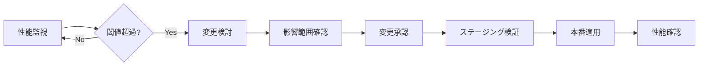

#### 2.3.2 スケールアップ・ダウン基準
```
スケールアップ検討基準:
- CPU使用率が連続7日間で平均70%超
- メモリ使用率が連続7日間で平均80%超
- レスポンスタイムが目標値（2秒）を継続的に超過

スケールダウン検討基準:
- CPU使用率が連続30日間で平均30%未満
- メモリ使用率が連続30日間で平均40%未満
- コスト最適化レビューで過剰リソースと判定
```

### 3.4 【検討課題】追加分析が必要な項目

#### 3.4.1 オンプレミス環境の詳細分析

**現行環境スペック**:
```yaml
サーバースペック:
  CPU: 8コア
  メモリ: 23GB搭載
  OS: Rocky Linux 8

リソース使用率（過去1年間の実測データ）:
  CPU使用率:
    idle率: 常時90%以上（実使用率10%以下）
    実質使用vCPU: 約0.8コア相当
    ピーク: なし（安定的に低使用率）
  
  メモリ使用率:
    最大使用: 22.06GB（使用率96%）
    平均使用: 17.62GB（使用率77%）
    最小使用: 3.49GB（OS再起動直後）
    
  メモリ使用パターン:
    - OS再起動直後: 約3.5GB
    - 数日かけて緩やかに増加: 17GB程度で安定
    - ピーク時: 17～22GBの間で推移
    - 再起動で初期値に戻る（メモリリークの可能性）

データ取得元: Zabbix監視システム（1年間の実測値）
```

**AWS移行時のサイジング根拠**:
```yaml
CPU設計:
  現行: 8コア（実使用0.8コア = 10%）
  判断: 大幅にオーバースペック
  AWS推奨: 2～4vCPU（t3ファミリーのバースト性能で対応）
  選定: t3.2xlarge（8vCPU、ベースライン1.6vCPU）
  理由: 
    - 現行と同等のコア数で安心感を提供
    - ベースライン1.6vCPUで実使用0.8コアを十分カバー
    - バースト性能でピーク対応可能

メモリ設計:
  現行: 23GB搭載、最大22.06GB使用（使用率96%）
  リスク: メモリ不足の可能性が高い
  AWS推奨: 32GB
  計算根拠:
    - 最大使用22GB × 安全率1.3 = 28.6GB
    - OSオーバーヘッド + バッファ考慮
    - スパイク時の余裕確保
  選定: t3.2xlarge（32GB搭載）

ディスク設計:
  □ 要追加調査: ディスクI/O（IOPS、スループット）
  □ 要追加調査: ディスク使用量

ネットワーク設計:
  □ 要追加調査: ネットワーク帯域使用量
  □ 要追加調査: 同時接続数、ピーク時トラフィック
```

**インスタンスタイプ選定結果の妥当性**:
```yaml
選定: t3.2xlarge（8vCPU、32GB）

CPU観点:
  ✅ 現行8コアと同等（心理的安心感）
  ✅ 実使用0.8コアに対しベースライン1.6vCPU（2倍の余裕）
  ✅ バースト時最大8vCPUで突発負荷に対応

メモリ観点:
  ✅ 32GB搭載で最大22GB使用に対し約45%の余裕
  ✅ メモリ不足リスクの解消
  ✅ 将来の負荷増加に対応可能

コスト観点:
  ✅ t3ファミリーでコスト効率良好
  ✅ 低CPU使用率でクレジット蓄積
  ✅ Savings Plansで最大72%割引適用可能

リスク:
  ⚠️ メモリリークの可能性（17GB→22GBの増加傾向）
  → 対策: AWS CloudWatch Alarmsで監視強化
  → 対策: 定期的な再起動スケジュール検討
```

#### 2.4.2 アプリケーション特性の分析
```
必要な情報:
□ アプリケーションのアーキテクチャ
  - Webサーバー（Apache 等）の構成
  - アプリケーションサーバー（tomcat等）の構成
  - セッション管理方式
□ メモリ消費パターン
  - プロセスあたりのメモリ使用量
  - 最大同時プロセス数
□ CPU集約型 vs I/O集約型の判定

取得方法:
- アプリケーションプロファイリング
- 負荷テストによる特性把握
```

---

## 4. AMI管理戦略設計

### 4.1 ゴールデンAMI戦略

#### 4.1.1 AMI構成レイヤー
```
レイヤー構成:
┌─────────────────────────────────────┐
│ Layer 3: Application AMI            │
│ - アプリケーションコード配置         │
│ - 環境別設定ファイル                │
└─────────────────────────────────────┘
         ↑ ビルド時に作成
┌─────────────────────────────────────┐
│ Layer 2: Middleware AMI             │
│ - Apache, Java, その他ミドルウェア  │
│ - 共通設定、監視エージェント        │
│ - CrowdStrike Falcon                │
└─────────────────────────────────────┘
         ↑ 月次パッチ適用時に更新
┌─────────────────────────────────────┐
│ Layer 1: Base AMI                   │
│ - Amazon Linux 2023                 │
│ - OSレベルセキュリティ設定          │
│ - Systems Manager Agent             │
└─────────────────────────────────────┘
```

**レイヤー分けの理由**:
- 各レイヤーの更新頻度が異なるため（Base: 月次、Middleware: 月次、Application: リリース時）
- 変更範囲を最小限に抑え、テスト・検証の効率化
- EC2へ適用するAMIは基本的にLayer 3（Application AMI）を使用

#### 3.1.2 AMI命名規則
```
命名規則:
{プロジェクトコード：idhub-40}-{ロール:web|hlp}{レイヤー}-{バージョン}-{作成日時}

例:
- idhub-40-web-base-v1.0-20251115
- idhub-40-web-middleware-v2.3-20251115
- idhub-40-web-app-v1.5-20251115
- idhub-40-hlp-base-v1.0-20251115
- idhub-40-hlp-middleware-v2.3-20251115
- idhub-40-hlp-app-v1.5-20251115

バージョニング:
- メジャー.マイナー形式
- メジャー: OSバージョンアップ、大規模変更
- マイナー: ミドルウェア更新、セキュリティパッチ
```

### 4.2 AMI作成パイプライン設計

#### 4.2.1 EC2 Image Builder活用（推奨）

**パイプライン構成**:
```yaml
パイプライン名: golden-ami-pipeline
実行トリガー:
  - 定期実行: 月次（第2水曜日 03:00 JST）
  - 手動実行: 緊急パッチ適用時

ビルドプロセス:
  1. Base AMI作成:
     - Amazon Linux 2023最新版をベース
     - OSパッチ適用
     - Systems Manager Agent更新
     - CIS Benchmark適用
  
  2. Middleware AMI作成:
     - Base AMIからビルド
     - Apache, Java等インストール
     - 監視エージェント設定
     - CrowdStrike Falcon導入
  
  3. Application AMI作成:
     - Middleware AMIからビルド
     - アプリケーションコード配置
     - 環境別設定ファイル適用
     - 最終検証テスト
  
  4. 検証テスト:
     - 起動テスト
     - 接続性テスト
     - セキュリティスキャン
  
  5. 開発環境デプロイ・テスト:
     - 新AMIから開発環境インスタンス起動
     - 運用チームによる動作確認テスト
     - 主要機能・画面遷移の検証
     - メトリクス・ログ確認
     - テスト失敗時はAMI修正・再作成
  
  6. 配布:
     - 成功時: AMI共有、タグ付け
     - 失敗時: SNS通知、ロールバック
```

**フルベイクドAMIの採用理由**:
- AWSベストプラクティスとして推奨（Immutable Infrastructure）
- ランタイム時の変更を最小化し、安定性向上
- デプロイ時の予測可能性確保
- **開発環境での事前検証により本番デプロイのリスク低減**

#### 3.2.2 手動作成フロー（代替案）

**Immutable原則**: 既存インスタンスは変更せず、常に新AMIから新インスタンスを起動

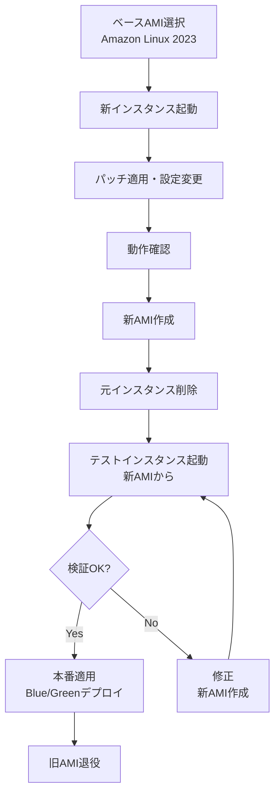

**注意**: 手動作成時も既存インスタンスを直接変更せず、必ず新インスタンスを起動してAMI化する。

### 4.3 AMI世代管理

#### 4.3.1 保持ポリシー
```yaml
保持世代数: 10世代
保持理由:
  - 月次パッチとアプリアップデート等で月1-3世代作成想定
  - 過去3-4ヶ月分のロールバック対応
  - 監査・調査用の履歴保持

自動削除:
  - 11世代目以降を自動削除
  - 削除前に30日間のグレースピリオド
  - 削除時はSNS通知

例外（削除対象外）:
  - タグ "Retain: true" が付与されたAMI
  - 現在本番稼働中のAMI
  - 重要なマイルストーンAMI
```

#### 3.3.2 AMIタグ管理
```yaml
必須タグ:
  Environment: dev | stg | prod
  Layer: base | middleware | app
  Version: vX.Y
  CreatedDate: YYYY-MM-DD
  Status: active | deprecated | archived

推奨タグ:
  PatchLevel: YYYY-MM
  Retain: true | false
  Purpose: monthly-patch | emergency-patch | release
  ValidatedBy: user-name
```

### 4.4 AMI更新サイクル

#### 4.4.1 定期更新スケジュール
```
月次更新（第2水曜日）:
- Week 1: 
- Week 2: パッチリリース確認、影響評価、火曜に開発環境でAMI作成・検証、ステージング環境で検証
- Week 3 月火: 本番環境へ適用
- Week 3 水以降: 安定性監視

緊急更新（Critical脆弱性）:
- Day 1: 脆弱性情報確認、影響評価
- Day 2: 緊急AMI作成、ステージング検証
- Day 3: 本番環境へ適用
- Day 4以降: 安定性監視
```

### 4.5 【検討課題】AMI管理の追加検討項目

```
□ EC2 Image Builderのコスト試算
  - 月間3回のビルド想定でコストを試算
  - ビルド時のEC2利用料: t3.2xlarge × 2時間 × 3回 = 6時間/月 × $0.3328 ≈ $2/月
  - AMIストレージ費用（世代管理含む）: 30GB × 10世代 = 300GB × $0.05/GB/月 ≈ $15/月
  - ログストレージ（S3）: 1GB/月 × $0.025 ≈ $0.025/月
  - 総計: 約$17/月（東京リージョン、2025年11月時点）
  - 手動作成との比較: 手動作成の方が人件費がかかるため、自動化推奨

□ AMIビルド時間の測定
  - Base AMI: 予想20-30分
  - Middleware AMI: 予想40-60分
  - Application AMI: 予想20-30分
  - 許容可能なビルド時間は2時間程度

□ AMI配布戦略
  - マルチアカウント構成でのAMI共有方式検討
  - AMI暗号化キーの管理方法
  - AWSベストプラクティス: AMI共有時はKMSキーを共有するか、受信側で再暗号化

□ テスト自動化の範囲
  - E2Eテストを実施
  - Jenkinsでビルドの前処理で静的解析やテストは必要か？
  - AMIビルド後のテストは開発環境で行う
```

---

## 5. パッチ管理自動化設計

### 5.1 Systems Manager Patch Manager設計

**Immutableインフラストラクチャにおけるパッチ管理の原則**:
- **稼働中インスタンスへのパッチ適用は行わない**（Immutable原則）
- Patch Managerは**AMI作成時のみ**使用
- 月次パッチ適用 = 新AMI作成 → Blue/Greenデプロイメントによるインスタンス置換

**AMI作成パイプラインでのPatch Manager使用**:
- Base AMI作成時: OS・ミドルウェアパッチ適用
- Middleware AMI作成時: 必要に応じて一部ミドルウェアパッチ適用
- Application AMI作成時: パッチ適用済みMiddleware AMIをベースに使用

#### 4.1.1 パッチベースライン設定

**セキュリティパッチベースライン**:
```yaml
名前: prod-security-baseline
対象OS: Amazon Linux 2023
自動承認ルール:
  - 分類: Security
    重要度: Critical, Important
    自動承認: リリース後0日（即時）
  
  - 分類: Bugfix
    重要度: すべて
    自動承認: リリース後7日（検証期間）

除外パッケージ:
  - kernel*  # カーネル更新は別途計画
  - httpd*   # Apache は手動管理
  - php*     # PHP は手動管理
```

**一般パッチベースライン**:
```yaml
名前: prod-general-baseline
対象OS: Amazon Linux 2023
自動承認ルール:
  - 分類: Enhancement, Recommended
    自動承認: リリース後14日（十分な検証期間）

除外パッケージ:
  - httpd*
  - php*
  - mariadb*
```

**ベースラインの違い**:
- **セキュリティパッチベースライン**: セキュリティ関連のパッチ（Critical/Important）を即時適用。緊急度の高い脆弱性対策を優先。
- **一般パッチベースライン**: 機能改善や推奨パッチを遅延適用。安定性を確保するための検証期間を設ける。

#### 4.1.2 月次パッチ適用スケジュール（Immutable方式）

**定期AMI更新サイクル（月次）**:
```yaml
パッチ適用方式: 新AMI作成 → Blue/Greenデプロイメント

スケジュール:
  Week 1（第1水曜日）:
    - Patch Managerでパッチスキャン実施
    - 必要なパッチリストを確認
  
  Week 2（第2水曜日 03:00 JST）:
    - EC2 Image Builderパイプライン自動実行
    - パッチ適用済み新AMI作成（Base → Middleware → Application）
    - 開発環境へ自動デプロイ（検証開始）
  
  Week 2（火曜以降）:
    - ステージング環境へデプロイ
    - 2-3日間の負荷テスト実施
  
  Week 3（月火 02:00-06:00 JST）:
    - 本番環境へBlue/Greenデプロイメント
    - 段階的トラフィック切替（10% → 50% → 100%）
    - 24時間監視体制

実行内容:
  1. EC2 Image Builderによる新AMI作成
  2. AMI検証テスト（起動・接続・セキュリティスキャン）
  3. 新インスタンス起動（新AMIから）
  4. 動作確認・トラフィック切替
  5. 旧インスタンス削除

注意: 既存インスタンスへのパッチ適用・再起動は一切行わない（Immutable原則）
```

**緊急メンテナンス**:
```yaml
実行トリガー: 手動実行
対象: Critical脆弱性のみ
承認プロセス:
  1. セキュリティチーム評価
  2. 影響範囲確認
  3. 変更承認（Change Management）
  4. 実施（営業時間内、無停止）
```

### 5.2 パッチ適用フロー（Immutable方式 - Blue/Greenデプロイメント）

#### 5.2.1 無停止パッチ適用の実現方法（Immutableインフラストラクチャ）

**基本原則**: パッチ適用 = 新AMI作成 + インスタンス置換（既存インスタンスは変更しない）

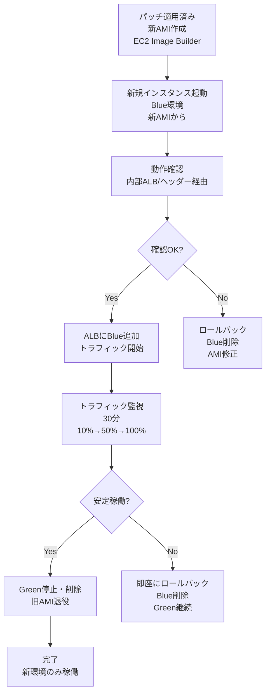

**重要**: このフローでは既存のGreenインスタンスに対するパッチ適用や再起動は一切行わない。

**Blue環境の動作確認方法**:
- **案1: 内部ALBを使用した検証**
  - 内部ALBを作成し、Blueインスタンスのみをターゲット
  - 特定のIPアドレスまたはVPC内からのみアクセス許可
  - 運用チームが内部ネットワークからアクセスして検証

- **案2: ヘッダー識別子を使用**
  - ALBのリスナールールで特定ヘッダー（例: X-Target-Instance: ローカルIPアドレス）を持つリクエストのみをBlue環境のターゲットインスタンスにルーティング
  - Auto Scalingでインスタンス作成時に特定のプライベートIPを割り当てるよう設定することで再作成時も同一のプライベートIPを使用することを担保する
  - 運用チームがcurlコマンド等でヘッダーを付与してアクセスし、動作確認を行う
  - 不特定多数からは通常アクセス不可（ヘッダーなしのリクエストはGreen環境にルーティング）

- **案3: SSMポートフォワーディング + 内部ALB**
  - Session Managerのポートフォワーディング機能を使用し、ローカルマシンのポートをBlueインスタンスにフォワード
  - Blueインスタンス上で内部ALBをターゲットとしてポートフォワーディングを設定（例: ローカル8080 → Blueインスタンス → 内部ALB）
  - 通常アプリケーションはlocalhostを期待することが多いため、ポートフォワーディングで本来のFQDNをlocalhostに変更しても問題が起こることは少ない
  - 内部ALBはURL変換をサポートしないため、アプリケーションのURL依存は解消されないが、ポート変換は可能
  - ポートフォワーディングではパスを書き換えないため、パス依存の問題は発生しない
  - ALBを経由する場合のみ、URL変換がサポートされないため、アプリケーションが特定のURLパスやFQDNを期待する場合、リスナールールで対応可能
  - 運用チームのみアクセス可能

**要件**: 特定の人のみがBlue環境の特定サーバに対して動作確認を行い、不特定多数からはBlueにはアクセスできないこと

#### 4.2.2 環境別適用スケジュール
```
Phase 1: 開発環境（Week 2 火曜）
- 即座に適用、動作確認

Phase 2: ステージング環境（Week 2 火曜以降）
- 本番同等の負荷テスト実施
- 2-3日間の安定性確認

Phase 3: 本番環境（Week 3 月火）
- Blue/Greenデプロイメント
- 段階的トラフィック切替
- 24時間監視体制
```

### 5.3 パッチ適用後の確認項目

#### 5.3.1 自動確認項目（新インスタンス起動後）
```yaml
ヘルスチェック:
  - EC2インスタンスステータス: OK（2/2 checks passed）
  - ALBヘルスチェック: Healthy
  - Systems Managerエージェント: Online

メトリクス確認（旧環境との比較）:
  - CPU使用率: ベースライン±10%以内
  - メモリ使用率: ベースライン±10%以内
  - レスポンスタイム: 2秒以内（旧環境同等）
  - エラー率: 0.1%以下

AMI整合性確認:
  - パッチバージョン: 期待値と一致
  - ミドルウェアバージョン: 期待値と一致
  - アプリケーションバージョン: 期待値と一致

注意: 新AMIから起動した新インスタンスのみを確認。既存インスタンスの再起動は発生しない。
```

#### 4.3.2 手動確認項目
```
機能確認:
□ Webアプリケーションの主要機能動作
□ データベース接続確認
□ セッション管理動作
□ 静的コンテンツ配信

ログ確認:
□ アプリケーションログにエラーなし
□ システムログに異常なし
□ セキュリティログに不正アクセスなし
```

### 5.4 ロールバック手順

```
即時ロールバック（30分以内）:
1. 新規インスタンス（Blue）をELBから切り離し
2. 旧インスタンス（Green）をELBに再登録
3. トラフィック確認
4. 新規インスタンス停止・削除

完全ロールバック（1日以内）:
1. 1世代前のAMIから新規インスタンス起動
2. 動作確認
3. Blue/Greenデプロイメントで切替
4. 問題インスタンス削除
```

**完全ロールバックの理由**: 問題のあるインスタンスを残さないため。Blue/Green方式では問題発生時に即座に古い環境に戻すが、問題の原因特定や再発防止のため、問題インスタンスは削除してクリーンな状態を維持する。

### 5.5 【検討課題】パッチ管理の追加検討項目

```
□ ミドルウェア（Apache, Java）のパッチ管理
  - 基本的には自動適用を行います。ただしtomcatのみは普段は無効化リストに入れておいて緊急度等に応じてAnsibleを使用してMiddleware AMI作成の時点で適用します
  - メジャーバージョンアップの扱い: Apache Tomcat Java MySQLなどは無効（アップデート対象外）でそれ以外のものは有効（アップデート対象）
  - カーネル更新の扱い: 基本的にはImmutableなので再起動というものはありません。Blue/Greenにおいても同様です

□ パッチ適用レポート
  - FutureVulsを使用しているので不要と考えます
```

---

## 6. スケーリング運用設計

### 6.1 手動スケーリング方針

本システムでは、予測可能な負荷変動と運用ノウハウの活用を前提に、**手動スケーリング**を採用する。

#### 6.1.1 手動スケーリング採用理由
```
採用根拠:
✓ 負荷変動が予測可能（定期的なピーク、イベント等）
✓ 既存の運用ノウハウを活用可能
✓ コスト予測が容易（突発的なスケールアウト回避）
✓ セキュリティレビューの徹底（新規インスタンス追加時）
✓ Launch Templateによる標準化で追加作業は容易

注意点:
△ 突発的な負荷増加への対応に時間が必要
△ 運用担当者の判断・作業が必要
△ 夜間・休日の対応体制検討が必要
```

### 6.2 スケールアウト運用設計

#### 6.2.1 スケールアウト判断基準
```yaml
スケールアウト実施基準:
  レベル1（注意）:
    - CPU使用率: 60%以上が1時間継続
    - メモリ使用率: 70%以上が1時間継続
    - レスポンスタイム: 1.5秒以上が30分継続
    → 対応: 状況監視強化、スケールアウト準備

  レベル2（警告）:
    - CPU使用率: 70%以上が30分継続
    - メモリ使用率: 80%以上が30分継続
    - レスポンスタイム: 2秒以上が15分継続
    - エラー率: 0.5%以上
    → 対応: スケールアウト実施判断

  レベル3（緊急）:
    - CPU使用率: 85%以上
    - メモリ使用率: 90%以上
    - レスポンスタイム: 3秒以上
    - エラー率: 1%以上
    → 対応: 即座にスケールアウト実施
```

#### 5.2.2 スケールアウト実施手順
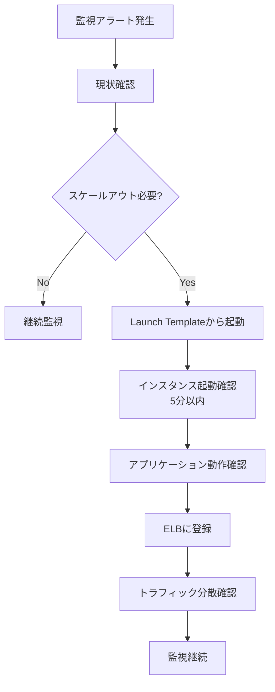

**詳細手順**:
```bash
# 1. Launch Templateから新規インスタンス起動
aws ec2 run-instances \
  --launch-template LaunchTemplateId=lt-xxxxx,Version=$LATEST \
  --subnet-id subnet-xxxxx \
  --tag-specifications 'ResourceType=instance,Tags=[{Key=Name,Value=web-prod-04}]'

# 2. インスタンスステータス確認（5分以内に起動）
aws ec2 wait instance-running --instance-ids i-xxxxx

# 3. Systems Managerでオンライン確認
aws ssm describe-instance-information --instance-id i-xxxxx

# 4. アプリケーション動作確認（ヘルスチェックエンドポイント）
curl http://<private-ip>/health

# 5. ELBターゲットグループに登録
aws elbv2 register-targets \
  --target-group-arn arn:aws:elasticloadbalancing:... \
  --targets Id=i-xxxxx

# 6. ヘルスチェック確認（2-3分）
aws elbv2 describe-target-health \
  --target-group-arn arn:aws:elasticloadbalancing:...
```

### 6.3 スケールイン運用設計

#### 6.3.1 スケールイン判断基準
```yaml
スケールイン検討基準:
  条件:
    - CPU使用率: 30%未満が24時間継続
    - メモリ使用率: 40%未満が24時間継続
    - 最小台数を上回っている（3台以上稼働中）
    - ピーク時間帯を過ぎている

  除外条件:
    - 近日中にイベント・キャンペーン予定
    - インスタンス障害発生中
    - メンテナンス作業中
```

#### 5.3.2 スケールイン実施手順
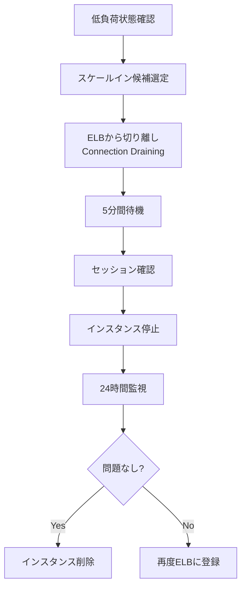

**Connection Draining設定**:
```yaml
ELB設定:
  deregistration_delay: 300秒（5分）
  
処理:
  - 新規接続は受け付けない
  - 既存接続は5分間維持
  - 5分経過後に強制切断
```

### 6.4 Launch Template設計

#### 6.4.1 Launch Template構成
```yaml
Launch Template名: web-app-prod-lt
バージョン管理: 有効

設定内容:
  AMI: 最新のゴールデンAMI（動的参照）
  インスタンスタイプ: t3.2xlarge
  キーペア: 設定なし（Session Manager利用）
  
  ネットワーク:
    サブネット: 起動時に指定（マルチAZ対応）
    セキュリティグループ: sg-web-app-prod
    パブリックIP: 無効
  
  IAMインスタンスプロファイル: poc-ec2-cloudwatch-agent-profile
  # 本番環境では既存のpoc-poc-ec2-ec2-instance-profileを使用
  # 既存IAMロール（poc-poc-ec2-ec2-role）に下記ポリシーをアタッチ
  # 詳細: LogCollectionMethod/sceptre/README.md 参照
  
  ストレージ:
    ルートボリューム:
      サイズ: 30GB
      タイプ: gp3
      IOPS: 3000
      暗号化: 有効（デフォルトKMS）
  
  メタデータオプション:
    IMDSv2: 必須
    ホップ制限: 1
  
  タグ:
    Name: web-prod-${INSTANCE_NUM}
    Environment: prod
    ManagedBy: launch-template
    CreatedDate: ${CREATED_DATE}
  
  ユーザーデータ: 最小限（後述）
```

**IAMインスタンスプロファイルの設定**:

Auto Scaling Group + Immutable アーキテクチャでは、Launch TemplateにIAMインスタンスプロファイルを設定することで、起動される全EC2インスタンスに自動的にIAMロールが付与されます。

```yaml
# CloudFormation Launch Template定義例
AWS::EC2::LaunchTemplate:
  Properties:
    LaunchTemplateName: web-app-prod-lt
    LaunchTemplateData:
      IamInstanceProfile:
        Arn: !ImportValue poc-ec2-cloudwatch-agent-profile-arn
        # または
        # Name: poc-ec2-cloudwatch-agent-profile
      
      # その他の設定...
```

**Auto Scaling Groupでの使用**:
```yaml
# Auto Scaling Group定義
AWS::AutoScaling::AutoScalingGroup:
  Properties:
    LaunchTemplate:
      LaunchTemplateId: !Ref WebAppLaunchTemplate
      Version: $Latest
    MinSize: 2
    MaxSize: 10
    DesiredCapacity: 3
    VPCZoneIdentifier:
      - !Ref PrivateSubnet1
      - !Ref PrivateSubnet2
      - !Ref PrivateSubnet3
```

**Immutable アーキテクチャにおけるメリット**:
- 全インスタンスが同一の権限を持つ（一貫性）
- インスタンス置き換え時も自動的にIAMロールが付与される
- Blue/Greenデプロイ時も新旧ASGで同じLaunch Templateを使用可能
- 手動でインスタンスプロファイルをアタッチする必要がない

**注意事項**:
- Launch Template作成前に、IAMインスタンスプロファイルが作成済みである必要があります
- インスタンスプロファイルの作成方法: `LogCollectionMethod/sceptre/README.md` 参照
- 既存のLaunch Templateを変更する場合は、新しいバージョンを作成してAuto Scaling Groupを更新します

#### 6.4.2 IAMロール・ポリシー設計（🔴 優先度：高）

**概要**:

EC2インスタンスには必要最小限の権限のみを付与し、セキュリティベストプラクティスに従います。

**インスタンスプロファイルとIAMロールの関係**:

```
IAMポリシー（複数） → IAMロール（1つ） → インスタンスプロファイル（1つ） → EC2インスタンス
```

**AWS制約**:
- EC2インスタンスには**1つのインスタンスプロファイルのみ**アタッチ可能
- 1つのIAMロールには**複数のポリシー**をアタッチ可能（最大10個の管理ポリシー + 無制限のインラインポリシー）

##### 5.4.2.1 本番環境の現状（既存リソース）

```yaml
既存インスタンスプロファイル: poc-poc-ec2-ec2-instance-profile
既存IAMロール: poc-poc-ec2-ec2-role

アタッチ済みAWS管理ポリシー:
  - CloudWatchAgentServerPolicy
    目的: CloudWatch Agentの基本動作
    権限: CloudWatch Logs/Metrics書き込み、EC2メタデータ読み取り
  
  - AmazonSSMManagedInstanceCore
    目的: AWS Systems Manager Session Manager接続
    権限: SSMエージェント通信、Session Manager接続
  
  - AmazonSSMPatchAssociation
    目的: AWS Systems Manager Patch Manager
    権限: パッチベースライン取得、パッチ適用状況レポート

インラインポリシー:
  - EC2SelfTaggingPolicy
    目的: インスタンス自身へのタグ付け
    権限: ec2:CreateTags, ec2:DescribeTags（自インスタンスのみ）
```

##### 5.4.2.2 追加が必要なカスタムポリシー

**1. CloudWatch Logs拡張ポリシー（`poc-cloudwatch-agent-policy`）**

```yaml
目的: CloudWatch Logs Agentによる詳細ログ収集
権限:
  CloudWatch Logs:
    - logs:CreateLogGroup
    - logs:CreateLogStream
    - logs:PutLogEvents
    - logs:DescribeLogStreams
    - logs:DescribeLogGroups
  
  SSM Parameter Store:
    - ssm:GetParameter
    - ssm:GetParameters
    - ssm:PutParameter
    対象: /AmazonCloudWatch-* パラメータのみ
  
  EC2メタデータ:
    - ec2:DescribeTags
    - ec2:DescribeInstances
    - ec2:DescribeVolumes

リソース制限:
  - CloudWatch Logs: /aws/ec2/* ロググループのみ
  - SSM: AmazonCloudWatch-* パラメータのみ
  - EC2: すべてのリソース（読み取りのみ）

作成方法: LogCollectionMethod/sceptre/ 参照
デプロイ状態: ✅ 作成済み（arn:aws:iam::910230630316:policy/poc-cloudwatch-agent-policy）
アタッチ状態: ✅ 本番IAMロール（poc-poc-ec2-ec2-role）にアタッチ済み
```

**2. S3アクセスポリシー（将来追加予定）**

```yaml
目的: アプリケーションログ・バックアップのS3保存
権限:
  - s3:PutObject
  - s3:GetObject
  - s3:ListBucket
  対象バケット: poc-app-logs-*, poc-app-backups-*

状態: 🟡 Phase 4で検討・実装
```

**3. RDS/Aurora接続ポリシー（将来追加予定）**

```yaml
目的: RDS Proxy経由でのDB接続（IAM認証）
権限:
  - rds-db:connect
  対象: db-proxy-*

状態: 🟡 Phase 4で検討・実装（DB設計に依存）
```

##### 5.4.2.3 セキュリティ考慮事項

**最小権限の原則（Principle of Least Privilege）**:
- 必要最小限の権限のみ付与
- リソースベースの制限を適用（`/aws/ec2/*`等）
- ワイルドカード（`*`）の使用を最小化

**権限の分離**:
```
CloudWatch関連権限 → CloudWatch Logs Agent用
SSM関連権限 → Systems Manager用
EC2タグ権限 → インスタンス自己管理用
S3関連権限 → アプリケーションデータ用（将来）
```

**監査とモニタリング**:
- AWS CloudTrail: IAMロール使用状況を記録
- IAM Access Analyzer: 過剰な権限を検出
- 定期的な権限レビュー（四半期ごと）

##### 5.4.2.4 既存環境への適用手順

**既にインスタンスプロファイルがアタッチされている場合**:

```bash
# ステップ1: 既存インスタンスプロファイルとIAMロールを確認
aws ec2 describe-instances \
  --instance-ids i-xxxxxxxxx \
  --query 'Reservations[*].Instances[*].IamInstanceProfile.Arn'

aws iam get-instance-profile \
  --instance-profile-name poc-poc-ec2-ec2-instance-profile

# ステップ2: 既存IAMロールに新しいポリシーを追加（推奨）
aws iam attach-role-policy \
  --role-name poc-poc-ec2-ec2-role \
  --policy-arn arn:aws:iam::910230630316:policy/poc-cloudwatch-agent-policy

# ステップ3: 権限の有効化を確認（EC2内から）
curl http://169.254.169.254/latest/meta-data/iam/security-credentials/poc-poc-ec2-ec2-role
aws logs describe-log-groups --region ap-northeast-1
```

**注意**: インスタンスプロファイルの置き換えは既存権限が失われる可能性があるため、**ポリシーの追加を推奨**します。

##### 5.4.2.5 新規Launch Templateでの設定

**開発・検証環境用**（新規作成時）:

```yaml
IamInstanceProfile:
  Name: poc-ec2-cloudwatch-agent-profile  # 新規作成したプロファイル
  # または
  Arn: !ImportValue poc-ec2-cloudwatch-agent-profile-arn
```

**本番環境用**（既存インフラがある場合）:

```yaml
IamInstanceProfile:
  Name: poc-poc-ec2-ec2-instance-profile  # 既存プロファイル（推奨）
  # 既存IAMロール（poc-poc-ec2-ec2-role）には必要なポリシーを追加済み
```

##### 5.4.2.6 実装チェックリスト

- [x] CloudWatch Logs拡張ポリシー作成（poc-cloudwatch-agent-policy）
- [x] 本番IAMロールへのポリシーアタッチ（poc-poc-ec2-ec2-role）
- [ ] 開発環境用IAMロール・インスタンスプロファイル作成
- [ ] 検証環境用IAMロール・インスタンスプロファイル作成
- [ ] Launch Template作成（各環境）
- [ ] CloudTrailでIAM使用状況監査設定
- [ ] IAM Access Analyzerで権限検証
- [ ] 四半期レビュープロセス確立

#### 6.4.3 【検討課題】インスタンス初回起動時設計

**EventBridgeを使用する方法**:
- EventBridgeルールでインスタンス初回起動イベント（EC2 Instance State-change Notification: running, かつ初回のみフィルタ）を検知
- Lambda関数内でDynamoDBテーブルにインスタンスIDを保存し、既に処理済みかをチェックして初回起動のみ処理を実行
- Lambda関数をトリガーしてJenkinsジョブ実行
- Jenkinsで各環境に応じたAnsible Playbookを実行
- メリット: ユーザーデータ不要、柔軟な設定管理、AWSベストプラクティス（Immutable Infrastructureでの推奨方法）
- デメリット: 追加のLambda・EventBridge・DynamoDBコスト（月額数ドル程度）

**ユーザーデータを使用する方法**:
- 起動時にスクリプトを実行
- メリット: 追加コストなし
- デメリット: 起動時間が若干増加、スクリプトが複雑化しやすい

**AWSベストプラクティス**: Immutable InfrastructureではAMIに全て含めるが、環境別設定が必要な場合はEventBridge + Lambdaが推奨。Ansible Pullは使用しない予定のため、EventBridge方式を採用検討。

##### 5.4.3.1 EventBridge + Lambda + DynamoDB詳細設計

**アーキテクチャ概要**:
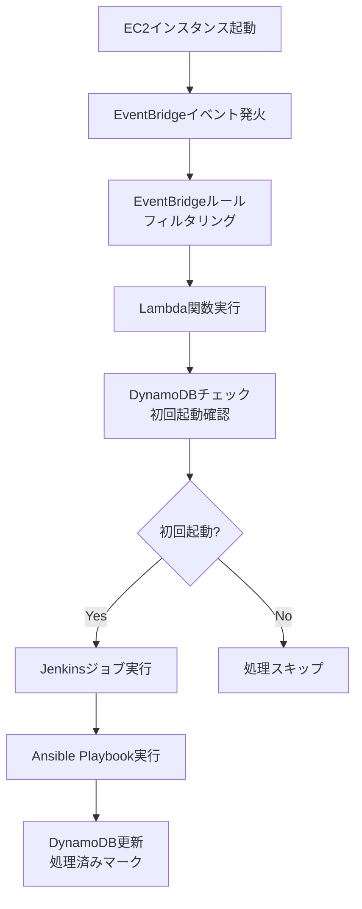

**EventBridgeルール設定**:
```yaml
EventBridgeRule:
  Type: AWS::Events::Rule
  Properties:
    Name: ec2-instance-launch-rule
    Description: Detects EC2 instance launch events for initial setup
    EventPattern:
      source:
        - aws.ec2
      detail-type:
        - EC2 Instance State-change Notification
      detail:
        state:
          - running
    State: ENABLED
    Targets:
      - Id: LambdaFunction
        Arn: !GetAtt LambdaFunction.Arn
```

**DynamoDBテーブル設計**:
```yaml
InstanceInitializationTable:
  Type: AWS::DynamoDB::Table
  Properties:
    TableName: ec2-instance-initialization
    AttributeDefinitions:
      - AttributeName: instanceId
        AttributeType: S
    KeySchema:
      - AttributeName: instanceId
        KeyType: HASH
    BillingMode: PAY_PER_REQUEST
    PointInRecoverySpecification:
      PointInTimeRecoveryEnabled: true
    SSESpecification:
      SSEEnabled: true
```

**Lambda関数設計**:
```python
import boto3
import json
import os
from datetime import datetime

dynamodb = boto3.resource('dynamodb')
table = dynamodb.Table(os.environ['DYNAMODB_TABLE'])
jenkins_url = os.environ['JENKINS_URL']
jenkins_token = os.environ['JENKINS_TOKEN']

def lambda_handler(event, context):
    # EC2イベントからインスタンスIDを取得
    instance_id = event['detail']['instance-id']
    
    # DynamoDBで初回起動チェック
    response = table.get_item(Key={'instanceId': instance_id})
    
    if 'Item' in response:
        # 既に処理済み
        print(f"Instance {instance_id} already processed")
        return {'statusCode': 200, 'body': 'Already processed'}
    
    # 初回起動の場合、Jenkinsジョブ実行
    try:
        # Jenkins APIでジョブ実行（requestsライブラリ使用）
        import requests
        job_url = f"{jenkins_url}/job/initial-setup/buildWithParameters"
        params = {
            'INSTANCE_ID': instance_id,
            'ENVIRONMENT': get_environment_from_tags(instance_id)
        }
        response = requests.post(job_url, 
                               auth=('user', jenkins_token),
                               params=params)
        
        # DynamoDBに処理済みとして記録
        table.put_item(Item={
            'instanceId': instance_id,
            'processedAt': datetime.utcnow().isoformat(),
            'status': 'processing'
        })
        
        return {'statusCode': 200, 'body': 'Jenkins job triggered'}
        
    except Exception as e:
        print(f"Error: {str(e)}")
        return {'statusCode': 500, 'body': str(e)}

def get_environment_from_tags(instance_id):
    ec2 = boto3.client('ec2')
    response = ec2.describe_tags(
        Filters=[
            {'Name': 'resource-id', 'Values': [instance_id]},
            {'Name': 'key', 'Values': ['Environment']}
        ]
    )
    if response['Tags']:
        return response['Tags'][0]['Value']
    return 'unknown'
```

**CloudFormationテンプレート例**:
```yaml
AWSTemplateFormatVersion: '2010-09-09'
Description: 'EventBridge + Lambda + DynamoDB for EC2 Instance Initialization'

Parameters:
  Environment:
    Type: String
    Default: prod
    AllowedValues: [dev, stg, prod]

Resources:
  # DynamoDBテーブル
  InstanceInitTable:
    Type: AWS::DynamoDB::Table
    Properties:
      TableName: !Sub ec2-instance-init-${Environment}
      AttributeDefinitions:
        - AttributeName: instanceId
          AttributeType: S
      KeySchema:
        - AttributeName: instanceId
          KeyType: HASH
      BillingMode: PAY_PER_REQUEST
      SSESpecification:
        SSEEnabled: true

  # Lambda実行ロール
  LambdaExecutionRole:
    Type: AWS::IAM::Role
    Properties:
      AssumeRolePolicyDocument:
        Version: '2012-10-17'
        Statement:
          - Effect: Allow
            Principal:
              Service: lambda.amazonaws.com
            Action: sts:AssumeRole
      ManagedPolicyArns:
        - arn:aws:iam::aws:policy/service-role/AWSLambdaBasicExecutionRole
      Policies:
        - PolicyName: EC2AndDynamoDBAccess
          PolicyDocument:
            Version: '2012-10-17'
            Statement:
              - Effect: Allow
                Action:
                  - ec2:DescribeTags
                  - dynamodb:GetItem
                  - dynamodb:PutItem
                Resource: '*'

  # Lambda関数
  InstanceInitFunction:
    Type: AWS::Lambda::Function
    Properties:
      FunctionName: !Sub ec2-instance-init-${Environment}
      Runtime: python3.11
      Handler: index.lambda_handler
      Code:
        ZipFile: |
          # Lambdaコードをここに埋め込み
      Environment:
        Variables:
          DYNAMODB_TABLE: !Ref InstanceInitTable
          JENKINS_URL: !Ref JenkinsUrlParameter
          JENKINS_TOKEN: !Ref JenkinsTokenParameter
      Role: !GetAtt LambdaExecutionRole.Arn
      Timeout: 300

  # EventBridgeルール
  InstanceLaunchRule:
    Type: AWS::Events::Rule
    Properties:
      Name: !Sub ec2-instance-launch-${Environment}
      Description: Detects EC2 instance launch for initial setup
      EventPattern:
        source:
          - aws.ec2
        detail-type:
          - EC2 Instance State-change Notification
        detail:
          state:
            - running
      State: ENABLED
      Targets:
        - Id: InstanceInitFunction
          Arn: !GetAtt InstanceInitFunction.Arn

  # Lambda関数へのEventBridgeアクセス許可
  LambdaInvokePermission:
    Type: AWS::Lambda::Permission
    Properties:
      FunctionName: !Ref InstanceInitFunction
      Action: lambda:InvokeFunction
      Principal: events.amazonaws.com
      SourceArn: !GetAtt InstanceLaunchRule.Arn

Outputs:
  LambdaFunctionArn:
    Value: !GetAtt InstanceInitFunction.Arn
  DynamoDBTableName:
    Value: !Ref InstanceInitTable
```

**コスト見積もり**:
```yaml
Lambdaコスト:
  - リクエスト: 月間100回（インスタンス起動数）
  - 実行時間: 平均10秒
  - メモリ: 128MB
  - 月額コスト: 約$0.02

DynamoDBコスト:
  - 書き込みリクエスト: 月間100回
  - 読み取りリクエスト: 月間200回
  - ストレージ: 1GB（長期保存考慮）
  - 月額コスト: 約$0.50

EventBridgeコスト:
  - カスタムイベント: 月間100回
  - 月額コスト: 約$0.10

合計月額コスト: 約$0.62
```

**運用考慮事項**:
- Lambda関数のタイムアウト設定（Jenkinsジョブ実行まで考慮）
- DynamoDBのアイテム保持期間（コスト最適化）
- EventBridgeルールのフィルタリング精度（不要なイベント除外）
- エラーハンドリング（Jenkinsジョブ失敗時の再実行）

### 6.5 スケーリング運用体制

#### 6.5.1 運用時間帯別体制
```yaml
平日日中（9:00-18:00）:
  担当: インフラ運用チーム
  対応時間: 30分以内にスケールアウト
  承認: 不要（基準に基づき実施）

平日夜間（18:00-9:00）:
  担当: オンコール担当者
  対応時間: 1時間以内にスケールアウト
  承認: チームリーダー承認

休日:
  担当: オンコール担当者
  対応時間: 2時間以内にスケールアウト
  承認: チームリーダー承認

緊急時:
  担当: 全員招集
  対応時間: 即座（15分以内）
  承認: 事後報告
```

### 6.6 【スコープ対象外課題】スケーリング運用の将来検討項目

**当面の間はスケーリングする可能性がないため、今プロジェクト内では検討しない。大規模サービスとの連携時案件が始まる頃に検討する。**

```
Auto Scaling移行方針:
- 現時点では手動スケーリング継続（予測可能負荷のため）
- 将来的移行条件: 大規模サービスとの連携時
- 移行時期: 2028年頃（未定）
- 移行時の考慮: スティッキーセッション代替（DynamoDBセッションストア）

□ 予測的スケーリングの検討（将来課題）
  - イベント・キャンペーンスケジュール管理
  - 事前スケールアウトの運用ルール
  - カレンダー連携

□ インスタンス台数の最適化（将来課題）
  - 最小台数: 現在3台（各AZ 1台）は適切か
  - 最大台数: 上限設定の必要性
  - コスト vs 可用性のバランス

□ スケーリング実施記録（将来課題）
  - スケーリング実施ログの記録
  - 判断根拠の記録
  - 事後レビューの実施
```

---

## 7. 起動最適化設計

### 7.1 起動時間目標

**目標起動時間: 5分以内**
**実測内訳（KVMでのインスタンス起動）:**
```
- インスタンス起動: 1分40秒
- OS起動: 35秒（systemdログ）
- アプリケーション初期化: 3分11秒（Tomcat起動ログ）
- ヘルスチェック: 30秒（LBヘルスチェック）
- 総起動時間: 5分56秒（インスタンスRunningからサービスReadyまで）
```

**最適化施策:**
- AMI事前設定によりアプリケーション初期化を1分短縮
- 目標達成のため、総起動時間を5分以内に最適化

### 7.2 起動最適化手法

#### 7.2.1 ゴールデンAMIの活用
```
事前設定内容:
✓ OSパッケージ事前インストール
✓ ミドルウェア（Apache, PHP）事前設定
✓ 監視エージェント事前インストール
✓ セキュリティ設定適用済み
✓ ログ設定完了

起動時の実施内容（最小化）:
- ホスト名設定
- 環境別パラメータ取得
- アプリケーションコード最新化（必要時）
```

#### 7.2.2 CloudFormation::Init（代替案）
現在はAnsible Pullを採用しているが、将来的にCloudFormation::Initも検討可能。

### 7.3 【検討課題】起動最適化の追加検討項目

```
□ 起動時間の実測
  - 実際の起動時間を環境別に測定
  - ボトルネックの特定
```

---

## 8. セキュリティ強化設計

### 8.1 IMDSv2強制設定

#### 8.1.1 設定内容
```yaml
メタデータオプション（EC2インスタンスに対して設定）:
  HttpTokens: required  # IMDSv2必須
  HttpPutResponseHopLimit: 1  # SSRF対策
  HttpEndpoint: enabled
  InstanceMetadataTags: enabled  # タグへのアクセス許可
```

**IMDSv2のセキュリティ向上点**:
- セッショントークンベースの認証
- SSRF（Server-Side Request Forgery）攻撃の防止
- メタデータへの不正アクセス防止

### 8.2 VPCエンドポイント設計

#### 7.2.1 必要なVPCエンドポイント
```yaml
Interface型エンドポイント（PrivateLink）:
  - com.amazonaws.ap-northeast-1.ec2: EC2 APIアクセス用（Systems Manager等）
    効果: インターネット経由不要、セキュリティ向上
  - com.amazonaws.ap-northeast-1.ssm: Systems Managerアクセス用
    効果: Session Manager、Parameter Store利用
  - com.amazonaws.ap-northeast-1.ssmmessages: Session Managerメッセージ用
    効果: セッション確立
  - com.amazonaws.ap-northeast-1.ec2messages: EC2メッセージ用
    効果: Run Command等
  - com.amazonaws.ap-northeast-1.logs: CloudWatch Logs用
    効果: ログ送信
  - com.amazonaws.ap-northeast-1.secretsmanager: Secrets Manager用
    効果: 機密情報管理

Gateway型エンドポイント:
  - com.amazonaws.ap-northeast-1.s3: S3アクセス用
    効果: 静的コンテンツ、ログアーカイブ、バックアップ保存
    理由: アプリケーションの静的ファイル配信、ログ保存、AMIバックアップ等で使用
```

#### 7.2.2 VPCエンドポイント利用メリット
```
セキュリティ:
✓ インターネット経由不要
✓ NATゲートウェイ経由不要
✓ トラフィックがAWSネットワーク内で完結

コスト:
✓ データ転送料金削減
✓ NATゲートウェイ料金削減（一部）

パフォーマンス:
✓ レイテンシ削減
✓ 帯域幅の安定性向上
```

### 8.3 セキュリティグループ設計

#### 8.3.1 最小権限の原則
```yaml
Web-App-SG（EC2用）:
  インバウンド:
    - Port 80: ALBセキュリティグループから
    - Port 443: ALBセキュリティグループから
  アウトバウンド:
    - Port 443: VPCエンドポイント（Systems Manager等）
    - Port 3306: Auroraセキュリティグループへ
    - Port 443: S3へ（Gateway Endpoint経由）
```

**SSMポートフォワーディングの活用**:
- Blue/Greenデプロイ時の動作確認で使用
- ECS Fargate上の内部アクセス用Webアプリへの接続
- ローカルマシンから直接インスタンスのポートにアクセス可能

### 8.4 Session Manager設定

#### 8.4.1 Session Managerポリシー
```json
{
  "Version": "2012-10-17",
  "Statement": [
    {
      "Effect": "Allow",
      "Action": [
        "ssm:StartSession"
      ],
      "Resource": [
        "arn:aws:ec2:ap-northeast-1:*:instance/*"
      ],
      "Condition": {
        "StringEquals": {
          "aws:ResourceTag/Environment": "prod"
        }
      }
    }
  ]
}
```

#### 7.4.2 セッションログ記録
```yaml
Session Managerログ設定:
  CloudWatch Logs:
    有効: true
    ロググループ: /aws/ssm/session-logs
    保持期間: 90日
  
  S3バケット:
    有効: true
    バケット: session-logs-bucket
    暗号化: SSE-S3
```

### 8.5 セキュリティ強化の実装仕様

#### 8.5.1 CrowdStrike Falcon導入仕様
```
CrowdStrike Falcon導入仕様:
- インストール方法: AMIビルド時に事前インストール（ゴールデンAMIに含める）
- インストール手順:
  1. CrowdStrikeインストーラーをS3バケットからダウンロード
  2. 顧客ID（CS_CUSTOMER_ID）とタグを設定してインストール
     falconctl -s --cid=CS_CUSTOMER_ID --provisioning-token=TOKEN
  3. サービス起動確認（systemctl status falcon-sensor）
- ポリシー設定:
  - 監視対象: 全ファイルシステム、プロセス、ネットワーク接続
  - 除外設定: /tmp, /var/tmp, /var/log（パフォーマンス最適化）
  - リアルタイム監視: 有効（デフォルト設定）
  - 検知感度: 中レベル（誤検知低減）
- ライセンス管理:
  - ライセンスキー: AWS Systems Manager Parameter Storeで管理
  - 更新: 自動更新設定（CrowdStrikeコンソールで管理）
  - 監視: CrowdStrikeコンソールでエージェントステータス確認
  - コスト: 月額$XX/インスタンス（ライセンス費用）
```

#### 7.5.2 WAFルール設計
```
CloudFront用WAF:
- マネージドルールグループ（AWS WAF Classic使用）:
  - AWSManagedRulesCommonRuleSet: 有効
    - SQLインジェクション、XSS、コマンドインジェクション対策
  - AWSManagedRulesKnownBadInputsRuleSet: 有効
    - 不正なリクエストパターン対策
  - AWSManagedRulesAmazonIpReputationList: 有効
    - 悪意あるIPからのアクセス対策
- カスタムルール:
  - レート制限: 1分間に1000リクエスト/IP（DDoS対策）
  - 地理的制限: なし（日本以外からのアクセスも許可）
- アクション: Block（一致時はブロック）
- ログ記録: CloudWatch Logsに全リクエストを記録

ALB用WAF:
- マネージドルールグループ:
  - AWSManagedRulesCommonRuleSet: 有効
  - AWSManagedRulesSQLiRuleSet: 有効（SQLインジェクション専用）
  - AWSManagedRulesLinuxRuleSet: 有効（Linux特化攻撃対策）
- カスタムルール:
  - リクエストサイズ制限: ボディ10MB以内
  - ヘッダー制限: 各ヘッダー8KB以内
- アクション: Block + Count（監視期間中はCount）
- ログ記録: S3バケットにJSON形式で保存

カスタムルール設計:
- アプリケーション固有ルール: なし（一般的なWebアプリケーションのため）
- テスト環境: ステージング環境でWAFルールテストを実施
- 監視: AWS WAFコンソールでブロック率監視（目標: ブロック率 < 1%）
- コスト: 月額$XX（リクエスト数ベース）
```

#### 7.5.3 セキュリティ監査設定
```
AWS Configルール:
- 有効化ルール（マネージドルール優先）:
  - s3-bucket-server-side-encryption-enabled: S3バケット暗号化必須
  - ec2-imdsv2-check: EC2インスタンスIMDSv2必須
  - ec2-instance-managed-by-systems-manager: SSM管理必須
  - vpc-default-security-group-closed: デフォルトセキュリティグループ無効
  - encrypted-volumes: EBS暗号化必須
  - cloudtrail-enabled: CloudTrail有効必須
- コンプライアンスチェック: 毎日実行
- 修復アクション: なし（自動修復は設定しない）

Security Hub統合:
- 有効化標準:
  - CIS AWS Foundations Benchmark v1.4
  - AWS Foundational Security Best Practices
- 統合サービス: AWS Config, Amazon Inspector, Amazon GuardDuty
- アラート通知: 既存の会社アラートシステム（メール/Slack）へ通知
- コスト: 月額$XX（調査結果数ベース）

定期スキャン設定:
- Amazon Inspector: 毎週金曜22:00実行（脆弱性スキャン）
- 対象: 全EC2インスタンス
- レポート: Security Hubに統合、PDFレポートをS3保存
- 修復: Critical/High脆弱性は検知後1週間以内に修復、Medium以下は次回パッチ適用時に対応
- コスト: 月額$XX（インスタンス数ベース）
```

---

## 9. 監視・ロギング設計

### 9.1 CloudWatch監視設計

#### 8.1.1 基本メトリクス
```yaml
EC2標準メトリクス（5分間隔）:
  - CPUUtilization
  - NetworkIn
  - NetworkOut
  - StatusCheckFailed
  - StatusCheckFailed_Instance
  - StatusCheckFailed_System
```

#### 8.1.2 カスタムメトリクス（1分間隔）
```yaml
CloudWatch Agentで収集:
  CPU:
    - cpu_usage_idle
    - cpu_usage_iowait
  
  メモリ:
    - mem_used_percent
    - mem_available_percent
  
  ディスク:
    - disk_used_percent
    - disk_inodes_used
  
  プロセス:
    - processes_running
    - processes_total
```

### 9.2 アラート設計

#### 9.2.1 アラート閾値
```yaml
Critical（即座に対応）:
  - CPU使用率: 85%以上、5分継続
  - メモリ使用率: 90%以上、5分継続
  - ディスク使用率: 90%以上
  - StatusCheckFailed: 1回でも発生
  - レスポンスタイム: 3秒以上、5分継続

Warning（監視強化）:
  - CPU使用率: 70%以上、15分継続
  - メモリ使用率: 80%以上、15分継続
  - ディスク使用率: 80%以上
  - レスポンスタイム: 2秒以上、15分継続
```

### 9.3 ログ設計

#### 9.3.1 ログ収集方式の検討

**🔴 要検討事項**: Amazon Linux 2023のログ収集方式選定

Amazon Linux 2023ではjournaldがデフォルトのログシステムとなり、従来の`/var/log/messages`などのファイルは作成されません。システムログとアプリケーションログの特性を考慮し、最適な方式を選定する必要があります。

##### 9.3.1.1 ログ収集方式の比較

**方式A: journald単体（CloudWatch Agent journaldプラグイン）**

```yaml
概要:
  - journaldから直接CloudWatch Logsに送信
  - rsyslog不要、ファイルI/O削減

システムログ収集:
  方法: CloudWatch Agent journaldプラグイン
  設定: journal_log_group_name指定

アプリケーションログ収集:
  方法1: stdout/stderr → journald → CloudWatch Agent
  方法2: ファイル出力 → CloudWatch Agent直接監視
```

**メリット:**
- ✅ ディスクI/O削減（ログの二重書き込みなし）
- ✅ ディスク使用量削減（rsyslogファイル不要）
- ✅ AWS推奨のクラウドネイティブアプローチ
- ✅ 構造化ログのメタデータを活用可能
- ✅ ログローテーション不要（journaldが自動管理）

**デメリット:**
- ❌ CloudWatch Agent journaldプラグインの設定が複雑
- ❌ 従来の`grep /var/log/messages`が使えない
- ❌ 既存スクリプト・運用手順の変更が必要
- ❌ `journalctl`コマンドの習得が必要
- ❌ トラブルシューティング時の学習コスト

**コスト試算:**
```
ディスク使用量: 約500MB/日（journaldのみ）
  - システムログ: 100MB/日
  - アプリケーションログ: 400MB/日（stdout経由）
  - 合計: 500MB/日 × 30日 = 15GB/月

CloudWatch Logs:
  - Ingestion: 15GB × $0.50 = $7.50/月
  - Storage (90日): 15GB × 3 × $0.03 = $1.35/月
  - 合計: 約$9/月
```

---

**方式B: journald + rsyslog（ハイブリッド）**

```yaml
概要:
  - journald → rsyslog → テキストファイル → CloudWatch Agent
  - 従来の運用手順を維持

システムログ収集:
  方法: rsyslog経由でファイル出力 → CloudWatch Agent
  ファイル: /var/log/messages, /var/log/secure

アプリケーションログ収集:
  方法1: 直接ファイル出力 → CloudWatch Agent（現状維持）
  方法2: stdout/stderr → journald → rsyslog → ファイル → CloudWatch Agent
```

**メリット:**
- ✅ 従来の運用手順を維持可能（`grep /var/log/messages`）
- ✅ 既存スクリプト・運用手順の変更不要
- ✅ トラブルシューティングが容易（テキストファイル）
- ✅ CloudWatch Agent設定がシンプル
- ✅ ログローテーションの既存ノウハウ活用可能

**デメリット:**
- ❌ ディスクI/O増加（ログの二重書き込み）
- ❌ ディスク使用量増加（journald + rsyslogファイル）
- ❌ ログローテーション設定が必要
- ❌ rsyslogのメンテナンスが必要

**コスト試算:**
```
ディスク使用量: 約1.2GB/日
  - journaldログ: 500MB/日
  - rsyslogファイル: 500MB/日（システムログ）
  - アプリログファイル: 200MB/日
  - 合計: 1.2GB/日 × 30日 = 36GB/月

CloudWatch Logs:
  - Ingestion: 21GB × $0.50 = $10.50/月（システム+アプリ）
  - Storage (90日): 21GB × 3 × $0.03 = $1.89/月
  - 合計: 約$12.50/月
```

---

**方式C: アプリケーションログstdout化 + journald単体（推奨）**

```yaml
概要:
  - システムログ: journald → CloudWatch Agent（journaldプラグイン）
  - アプリログ: stdout/stderr → journald → CloudWatch Agent
  - 12-factor app準拠

システムログ収集:
  方法: CloudWatch Agent journaldプラグイン
  対象: systemd-journald全体

アプリケーションログ収集:
  方法: Apache/Tomcat → stdout/stderr → journald → CloudWatch Agent
  設定: ErrorLog "|/bin/cat", StandardOutput=journal
```

**メリット:**
- ✅ ディスクI/O最小化（journaldのみ）
- ✅ ディスク使用量最小（rsyslog不要、アプリログファイル不要）
- ✅ 12-factor app準拠（コンテナ化への移行容易）
- ✅ ログローテーション完全不要（journaldが自動管理）
- ✅ AWS Well-Architected Framework準拠
- ✅ 将来的なECS/Fargate移行が容易

**デメリット:**
- ❌ アプリケーション設定変更が必要（Apache, Tomcat, PHP）
- ❌ 既存の運用手順変更が必要
- ❌ journalctlコマンドの習得が必要
- ❌ CloudWatch Agent journaldプラグイン設定の学習コスト
- ❌ 移行期間中のリスク

**コスト試算:**
```
ディスク使用量: 約500MB/日（journaldのみ）
  - 全ログ統合: 500MB/日
  - 合計: 500MB/日 × 30日 = 15GB/月

CloudWatch Logs:
  - Ingestion: 15GB × $0.50 = $7.50/月
  - Storage (90日): 15GB × 3 × $0.03 = $1.35/月
  - 合計: 約$9/月
```

---

##### 8.3.1.2 比較マトリクス

| 評価項目 | 方式A<br/>journald単体 | 方式B<br/>journald+rsyslog | 方式C<br/>stdout化+journald |
|---------|:---:|:---:|:---:|
| **ディスク使用量** | ⭐⭐⭐ 15GB/月 | ⭐ 36GB/月 | ⭐⭐⭐ 15GB/月 |
| **ディスクI/O** | ⭐⭐⭐ 最小 | ⭐ 二重書き込み | ⭐⭐⭐ 最小 |
| **CloudWatchコスト** | ⭐⭐⭐ $9/月 | ⭐⭐ $12.50/月 | ⭐⭐⭐ $9/月 |
| **運用手順変更** | ⭐⭐ 要変更 | ⭐⭐⭐ 不要 | ⭐ 大幅変更 |
| **学習コスト** | ⭐⭐ 中 | ⭐⭐⭐ 低 | ⭐ 高 |
| **ログローテーション** | ⭐⭐⭐ 不要 | ⭐ 要設定 | ⭐⭐⭐ 不要 |
| **トラブルシューティング** | ⭐⭐ journalctl | ⭐⭐⭐ grep可 | ⭐⭐ journalctl |
| **12-factor app準拠** | ⭐⭐ 部分的 | ⭐ 非準拠 | ⭐⭐⭐ 完全準拠 |
| **コンテナ化対応** | ⭐⭐ 可能 | ⭐ 困難 | ⭐⭐⭐ 容易 |
| **移行リスク** | ⭐⭐ 中 | ⭐⭐⭐ 低 | ⭐ 高 |

---

##### 8.3.1.3 AWS Well-Architected Frameworkの観点

**運用上の優秀性:**
- 方式C > 方式A > 方式B（自動化、ログローテーション不要）

**セキュリティ:**
- 全方式同等（CloudWatch Logsで集約管理）

**信頼性:**
- 方式C > 方式A > 方式B（ディスクI/O削減、障害点削減）

**パフォーマンス効率:**
- 方式C > 方式A > 方式B（ディスクI/O最小化）

**コスト最適化:**
- 方式C = 方式A > 方式B（ディスク・CloudWatchコスト）

**持続可能性:**
- 方式C > 方式A > 方式B（リソース使用量最小化）

---

##### 8.3.1.4 推奨方式

**🎯 推奨: 方式C（段階的移行）**

**理由:**
1. **長期的なコスト削減**: ディスク使用量・CloudWatchコストが最小
2. **AWS Well-Architected Framework準拠**: 全6本柱で最高評価
3. **将来性**: コンテナ化・サーバレス移行が容易
4. **運用負荷削減**: ログローテーション設定不要

**移行戦略（段階的アプローチ）:**

**Phase 1（即時実施）: システムログの移行**
- CloudWatch Agent journaldプラグイン導入
- システムログ（/var/log/messages相当）をjournaldから直接収集
- 並行して rsyslog も動作させる（安全策）

**Phase 2（1ヶ月後）: Apacheログの移行**
- Apache ErrorLog/CustomLogをstdout化
- journald経由でCloudWatch Logsに送信
- 既存ファイルベースログは並行運用（検証期間）

**Phase 3（2ヶ月後）: アプリケーションログの移行**
- PHPアプリのログをstderr出力に変更
- Tomcatログをstdout化
- 既存ログファイルベース収集を段階的に廃止

**Phase 4（3ヶ月後）: rsyslog廃止**
- 全ログがjournald経由で収集されることを確認
- rsyslogサービス停止・無効化
- ディスク使用量・コスト削減効果を測定

**代替案（リスク回避優先）:**

もし移行リスクを最小化したい場合は、**方式B（journald + rsyslog）を暫定採用**し、運用が安定してから方式Cへ段階的に移行する戦略も可能です。

---

##### 8.3.1.5 最終決定事項（要記入）

**選定方式:** （未定 - 要ステークホルダー合意）

**選定理由:**

**移行スケジュール:**

---

#### 8.3.2 ログ収集対象（選定方式に応じて更新予定）

```yaml
システムログ: 
  - /var/log/messages または journald    # 方式により異なる
  - /var/log/secure または journald      # SSH/SSM認証ログ
  - /var/log/dnf.log または journald     # パッケージ管理ログ

アプリケーションログ:
  # idhub-web
  - /var/log/app/idhub-oidc/oidc_audit.log      alert有：ERROR
  - /var/log/app/idhub-oidc/oidc_request.log    alert有：ERROR
  - /var/log/app/idhub/user.log                 alert有：[E] と IDCAUE0000[2-5] を含む　と　[E] を含むが IDCAUE0000[2-5] は含まない
  - /var/log/httpd/access_log.yyyymmdd          alert有：5XX
  - /var/log/httpd/error_log.yyyymmdd
  - /var/lib/proxysql/proxysql.log
# idhub-hlp
  - /var/log/app/idhub/helptoolwebapp.log       alert有：[E]
  - /var/log/app/idhub/ProfileToolOpe.log
  - /var/log/app/idhub/ProfileToolAuth.log
  - /var/log/httpd/access_log.yyyymmdd
  - /var/log/httpd/ssl_access_log.yyyymmdd

CloudWatch Logs送信:
  送信間隔: 5秒
  バッファサイズ: 5MB
```

**アプリケーションログの出力方法**:
- オンプレ環境ではバッチ処理でログを集計していたが、AWSではLambdaで処理予定
- AWSベストプラクティス: 12factor appの原則に従い、標準出力(stdout/stderr)にログ出力
- 理由: コンテナ化・サーバレス環境での互換性、ログ集約の容易さ
- EC2でもstdout出力が推奨（CloudWatch Logs Agentで収集可能）

**Apacheでの標準出力ログ出力設定**:
```bash
# httpd.conf または VirtualHost設定
# 既存のログディレクティブをコメントアウトまたは削除
# ErrorLog logs/error_log
# CustomLog logs/access_log combined

# 代わりにパイプで標準出力にリダイレクト
ErrorLog "|/bin/cat"
CustomLog "|/bin/cat" combined

# または systemdサービスでリダイレクト（推奨）
# /etc/systemd/system/httpd.service
[Service]
ExecStart=/usr/sbin/httpd -DFOREGROUND
StandardOutput=journal
StandardError=journal
```

**Tomcatでの標準出力ログ出力設定**:
```bash
# catalina.sh のJAVA_OPTSに追加
JAVA_OPTS="$JAVA_OPTS -Djava.util.logging.ConsoleHandler.level=FINEST"
JAVA_OPTS="$JAVA_OPTS -Djava.util.logging.ConsoleHandler.formatter=java.util.logging.SimpleFormatter"

# logging.properties でコンソールハンドラーを有効化
handlers = java.util.logging.ConsoleHandler
java.util.logging.ConsoleHandler.level = FINEST
java.util.logging.ConsoleHandler.formatter = java.util.logging.SimpleFormatter

# または systemdサービスでリダイレクト
# /etc/systemd/system/tomcat.service
[Service]
ExecStart=/opt/tomcat/bin/catalina.sh run
StandardOutput=journal
StandardError=journal
```

**CloudWatch Logs Agent設定例**:
```json
{
  "logs": {
    "logs_collected": {
      "files": {
        "collect_list": [
          {
            "file_path": "/proc/1/fd/1",
            "log_group_name": "/aws/ec2/web-app/stdout",
            "log_stream_name": "{instance_id}"
          },
          {
            "file_path": "/proc/1/fd/2",
            "log_group_name": "/aws/ec2/web-app/stderr",
            "log_stream_name": "{instance_id}"
          }
        ]
      }
    }
  }
}
```

**注意点**:
- systemdを使用する場合、journald経由でCloudWatchに転送可能
- ログローテーションは不要（CloudWatchが自動管理）
- 構造化ログ（JSON形式）推奨で、ログ解析が容易

### 9.4 Datadog統合

#### 9.4.1 Datadog Agent設定
```yaml
収集メトリクス:
  - システムメトリクス
  - APMトレース（Application Performance Monitoring）
  - ログ
  - プロセス監視

統合サービス:
  - Apache統合
  - PHP-FPM統合
  - AWS統合（CloudWatch連携）
```

#### 8.4.2 Datadog導入範囲
```yaml
ライセンス数:
  - 本番環境: 6ホスト（常時稼働インスタンス数）
  - ステージング環境: 3ホスト
  - 開発環境: 2ホスト
  - 合計: 11ホスト

収集メトリクス詳細:
  システムメトリクス:
    - CPU使用率、メモリ使用率、ディスクI/O、ネットワークI/O
    - プロセス数、スレッド数、ファイルディスクリプタ数
  APMトレース:
    - Tomcatアプリケーションのメソッドレベルトレース
    - データベースクエリパフォーマンス
    - 外部API呼び出しのレスポンスタイム
  ログ収集:
    - Apacheアクセスログ、エラーログ
    - Tomcatカタリナログ、アプリケーションログ
    - システムログ（messages, secure）
  プロセス監視:
    - httpd, tomcat, javaプロセス監視
    - プロセス再起動検知、アラート

Datadog Agentインストール:
  - AMIビルド時に事前インストール（ゴールデンAMIに含める）
  - Parameter StoreからAPIキーを取得して設定
  - タグ設定: env, service, version
```

#### 8.4.3 Datadogコスト試算
```yaml
料金体系: ホストベース課金（2025年11月時点）
- Infrastructure Monitoring: $15/ホスト/月
- APM & Continuous Profiler: $31/ホスト/月
- Log Management: $0.10/GB/月（ログ量による）

月額コスト試算:
- Infrastructure + APM: (15 + 31) × 11ホスト = $506/月
- Log Management: 平均50GB/月 × $0.10 = $5/月
- 総計: 約$511/月

年間コスト: $6,132
ROI期待: 障害検知時間の短縮、MTTR改善による運用効率向上
```

### 9.5 ログ保持期間設計

#### 9.5.1 ログ保持ポリシー
```yaml
CloudWatch Logs保持期間:
  - アプリケーションログ: 90日
  - システムログ: 90日
  - 監査ログ: 1年
  - セキュリティログ: 1年

S3アーカイブ保持期間:
  - アプリケーションログ: 3年
  - システムログ: 3年
  - 監査ログ: 7年（コンプライアンス要件）
  - セキュリティログ: 7年

ライフサイクルポリシー:
  - CloudWatch → S3: 90日後に自動移行
  - S3 Glacier: 1年後に低頻度アクセスへ
  - S3 Deep Archive: 3年後に長期アーカイブへ
  - 削除: 監査ログ以外は7年で削除

コンプライアンス考慮:
  - 個人情報保護法: ログ保持期間を最小限に
  - セキュリティ監査: 重要ログは7年保持
  - コスト最適化: アクセス頻度に応じたストレージクラス活用
```

---

### 9.6 ログ監視とアラート設計

**🔴 検討課題**: doc-idhub/design/08.monitoring で詳細設計を実施

CloudWatch Logsに収集したログからメトリクスフィルタを用いて特定のパターンを検知し、CloudWatch Alarmでアラートを発出する仕組みの設計が必要です。

#### 9.6.1 メトリクスフィルタ設計の検討

**目的:**
- ログベースの異常検知
- 複数インスタンスからのログ自動集約
- カスタムメトリクスによる柔軟な監視

**想定する監視パターン:**

```yaml
エラー率監視:
  対象ログ: /aws/ec2/poc-system/httpd/error_log
  パターン: ERROR, CRITICAL, FATAL
  閾値: 10分間で5回以上
  アクション: SNS通知 → Slack/Email

5xxエラー監視:
  対象ログ: /aws/ec2/poc-system/httpd/access_log
  パターン: Apache Combined Log形式、status=5*
  閾値: 5分間で10回以上
  アクション: SNS通知 → PagerDuty連携

レスポンスタイム監視:
  対象ログ: /aws/ec2/poc-system/httpd/access_log
  パターン: response_time > 2000ms
  閾値: 10分間で5回以上
  アクション: SNS通知 → 性能劣化アラート

データベース接続エラー監視:
  対象ログ: /aws/ec2/poc-system/app/error_log
  パターン: "database connection", "connection timeout"
  閾値: 5分間で3回以上
  アクション: SNS通知 → Critical Alert

複合条件監視:
  対象ログ: /aws/ec2/poc-system/httpd/error_log
  パターン: "A"を含み"B"を含まない
  閾値: 10分間で3台合計5回以上
  アクション: Math Expression Alarmで差分計算
```

**技術的検討事項:**

1. **フィルタパターンの設計**
   - 単純文字列マッチング vs 正規表現
   - JSON形式ログの構造化フィールド抽出
   - Apache Combined Log形式の解析
   - 複合条件（AND, NOT）の実装方法

2. **ログ集約の仕組み**
   - 複数EC2インスタンスのログストリームを1つのロググループに集約
   - メトリクスフィルタはロググループ全体に適用
   - 3台のEC2合計での閾値評価方法

3. **カスタムメトリクスの命名規則**
   ```yaml
   Namespace: CustomApache, CustomApp, CustomSystem
   MetricName: ErrorCount, 5xxCount, SlowRequestCount, DB_ConnectionError_Count
   Dimensions: Environment, Service, LogType
   ```

4. **フィルタパターンの実装例**
   ```bash
   # 単純文字列
   --filter-pattern "ERROR"
   
   # Apache Combined Log
   --filter-pattern '[ip, id, user, timestamp, request, status=5*, size]'
   
   # JSON形式
   --filter-pattern '{ ($.level = "ERROR") && ($.message = "*Connection*") }'
   
   # 複合条件（Math Expressionで実装）
   フィルタ1: "A"を含むログ → LogWithA_Count
   フィルタ2: "A"と"B"の両方を含むログ → LogWithA_AndB_Count
   Math Expression: LogWithA_Count - LogWithA_AndB_Count
   ```

#### 8.6.2 CloudWatch Alarm設計の検討

**アラーム評価方法:**

```yaml
基本アラーム:
  評価期間: period × evaluation-periods
  統計方法: Sum, Average, Maximum, Minimum
  比較演算子: GreaterThanThreshold, LessThanThreshold等
  データ欠損時の処理: notBreaching, breaching, ignore, missing

Math Expression Alarm:
  目的: 複数メトリクスの演算（差分、比率、合計）
  用途: "A"を含み"B"を含まないログの監視
  実装: m1 - m2 の演算結果を閾値評価

Composite Alarm:
  目的: 複数のアラームを組み合わせた複合条件
  用途: "5xxエラーが多い AND レスポンスタイムが遅い"
  実装: ALARM(alarm1) AND ALARM(alarm2)

Anomaly Detection Alarm:
  目的: 機械学習による異常検知
  用途: 通常パターンからの逸脱を検知
  実装: ANOMALY_DETECTION_BAND(m1, threshold)
```

**パラメータ設計:**

```yaml
エラー率監視アラーム:
  AlarmName: Apache-Error-High-Rate
  MetricName: ErrorCount
  Namespace: CustomApache
  Statistic: Sum
  Period: 600 (10分)
  EvaluationPeriods: 1
  Threshold: 5
  ComparisonOperator: GreaterThanOrEqualToThreshold
  TreatMissingData: notBreaching

5xxエラー監視アラーム:
  AlarmName: Apache-5xx-High-Rate
  MetricName: Apache_5xx_Count
  Namespace: CustomApache
  Statistic: Sum
  Period: 300 (5分)
  EvaluationPeriods: 1
  Threshold: 10
  ComparisonOperator: GreaterThanOrEqualToThreshold

レスポンスタイム監視アラーム:
  AlarmName: Apache-Slow-Request-Alert
  MetricName: Apache_SlowRequest_Count
  Namespace: CustomApache
  Statistic: Sum
  Period: 600 (10分)
  EvaluationPeriods: 1
  Threshold: 5
  ComparisonOperator: GreaterThanOrEqualToThreshold
```

#### 8.6.3 SNS通知設計の検討

**通知先の構成:**

```yaml
SNS Topic構成:
  poc-apache-alerts:
    用途: Apacheログ関連アラート
    購読者:
      - Email: ops-team@example.com
      - Lambda: Slack通知関数
      - Lambda: PagerDuty連携関数
  
  poc-critical-alerts:
    用途: Critical重要度のアラート
    購読者:
      - Email: on-call@example.com
      - SMS: オンコール担当者携帯
      - PagerDuty: インシデント自動作成
  
  poc-warning-alerts:
    用途: Warning重要度のアラート
    購読者:
      - Email: dev-team@example.com
      - Slack: #monitoring チャンネル

通知内容のカスタマイズ:
  - アラーム名、説明
  - 発生時刻、評価期間
  - 現在値、閾値
  - 該当ログのサンプル（Lambda経由）
  - 対応手順へのリンク（Runbook）
```

#### 8.6.4 実装方法の検討

**IaC (Infrastructure as Code) による実装:**

```yaml
CloudFormation/Sceptre:
  メリット:
    - バージョン管理、変更履歴の追跡
    - 環境間の設定再利用（dev/stg/prod）
    - ドリフト検出、設定の一貫性保証
  
  テンプレート構成:
    templates/metric-filter-alarm.yaml:
      - AWS::Logs::MetricFilter
      - AWS::CloudWatch::Alarm
      - Parameters: LogGroupName, SNSTopicArn
    
    config/poc/metric-filter-alarm.yaml:
      - 環境固有のパラメータ設定
      - 依存関係: SNS Topic, CloudWatch Logs

Terraform:
  メリット:
    - AWSに限らないマルチクラウド対応
    - モジュール化による再利用性
    - Terraform Cloudでの状態管理
  
  リソース構成:
    aws_cloudwatch_log_metric_filter
    aws_cloudwatch_metric_alarm
    aws_sns_topic
    aws_sns_topic_subscription

AWS CLI/SDK:
  メリット:
    - 既存スクリプトへの統合
    - 動的な設定変更
    - テスト自動化
  
  用途:
    - 初期セットアップ
    - 動作確認、テスト
    - 緊急時の手動設定変更
```

#### 8.6.5 テストとチューニングの検討

**テスト方法:**

```yaml
ユニットテスト:
  目的: 個別フィルタパターンの動作確認
  方法:
    1. EC2インスタンス上でテストログ生成
    2. CloudWatch Logsに送信
    3. メトリクスフィルタがカウントアップすることを確認
  
  コマンド例:
    sudo sh -c 'echo "[$(date)] ERROR: Test error message" >> /var/log/httpd/error_log'
    
    aws cloudwatch get-metric-statistics \
      --namespace CustomApache \
      --metric-name ErrorCount \
      --start-time "10 minutes ago" \
      --end-time "now" \
      --period 600 \
      --statistics Sum

統合テスト:
  目的: アラーム発出からSNS通知までのEnd-to-End確認
  方法:
    1. 閾値を超えるテストログを生成
    2. CloudWatch Alarmがアラーム状態に遷移
    3. SNS通知が正しく配信されることを確認
  
  検証項目:
    - アラーム状態遷移（OK → ALARM）
    - 通知内容の正確性
    - 通知遅延時間（目標: 5分以内）

負荷テスト:
  目的: 大量ログ発生時の動作確認
  方法:
    - Apache Benchなどで負荷をかけてログ生成
    - メトリクスフィルタの処理遅延確認
    - CloudWatch Logs取り込み遅延確認

閾値チューニング:
  目的: 誤検知（False Positive）の削減
  方法:
    1. 本番運用開始後、1週間のログデータ収集
    2. 正常時のエラー発生頻度を分析
    3. P95/P99パーセンタイルを閾値の参考値に
    4. 段階的に閾値を調整
  
  チューニングサイクル:
    - 初期: 厳しめの閾値で誤検知覚悟
    - 1週間後: 1回目の見直し
    - 1ヶ月後: 2回目の見直し、最終調整
```

#### 8.6.6 コスト試算

```yaml
メトリクスフィルタ:
  料金: 無料
  制限: なし

カスタムメトリクス:
  料金: $0.30/メトリクス/月
  想定数: 10個
    - ErrorCount
    - LogWithA_Count, LogWithA_AndB_Count
    - Apache_5xx_Count
    - Apache_SlowRequest_Count
    - DB_ConnectionError_Count
    - その他アプリケーション固有メトリクス
  月額: $0.30 × 10 = $3.00/月

CloudWatch Alarm:
  標準アラーム: $0.10/アラーム/月
  高解像度アラーム: $0.30/アラーム/月
  想定数: 10個（標準アラーム）
  月額: $0.10 × 10 = $1.00/月

SNS通知:
  料金: $0.50/100万通知
  想定数: 100通知/月
  月額: 約$0.00/月（無視できるレベル）

Lambda関数（Slack通知等）:
  料金: $0.20/100万リクエスト + 実行時間課金
  想定数: 100実行/月
  月額: 約$0.00/月（無視できるレベル）

合計:
  ログ監視・アラート: $3.00 + $1.00 = $4.00/月
  ログ収集（方式C）: $8.85/月（セクション8.3.1参照）
  総計: 約$13/月
```

#### 8.6.7 運用フローの検討

**アラート発生時の対応フロー:**

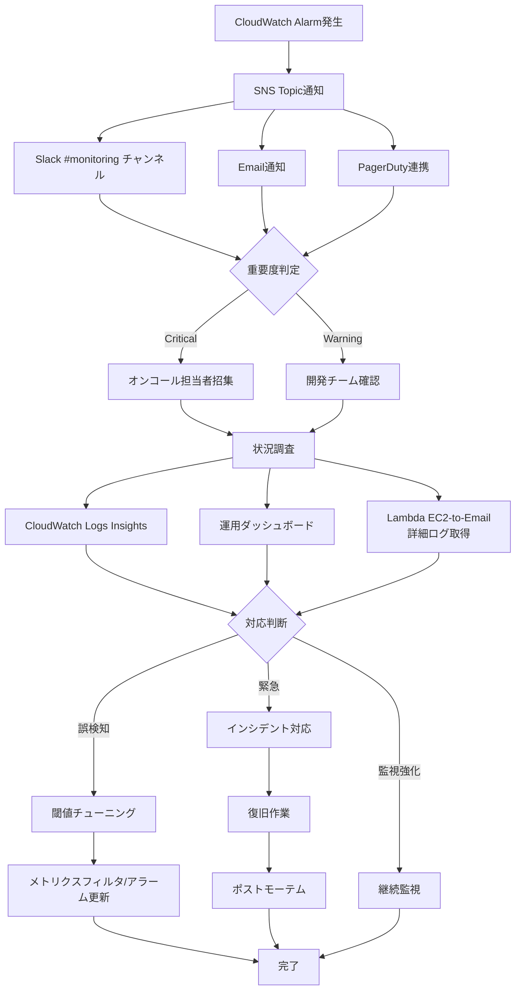

**運用手順書の整備:**

```yaml
必要なドキュメント:
  - アラート対応手順書（Runbook）
  - メトリクスフィルタ設定ガイド
  - CloudWatch Alarm設定ガイド
  - トラブルシューティングガイド
  - エスカレーションフロー

Runbookの内容:
  各アラートごとに:
    - アラートの意味、影響範囲
    - 確認すべきログ、メトリクス
    - 対応手順（ステップバイステップ）
    - エスカレーション先
    - 過去のインシデント事例
```

#### 8.6.8 doc-idhub/design/08.monitoring へのフィードバック事項

**詳細設計で決定すべき項目:**

```yaml
□ メトリクスフィルタの具体的なパターン定義:
  - 対象ログファイルの確定
  - フィルタパターンの正規表現
  - カスタムメトリクス命名規則
  - Dimensions設計

□ CloudWatch Alarmの閾値設定:
  - 各アラートの閾値（本番運用データに基づく）
  - 評価期間（period, evaluation-periods）
  - データ欠損時の処理方針
  - アラーム重要度の分類（Critical/Warning/Info）

□ SNS通知先の確定:
  - 通知先メールアドレス、Slackチャンネル
  - PagerDuty連携の有無
  - オンコールローテーション体制
  - 通知内容のテンプレート

□ IaCツールの選定:
  - CloudFormation/Sceptre vs Terraform
  - リポジトリ構成、ディレクトリ構造
  - 環境別パラメータ管理方法
  - CI/CDパイプライン統合

□ テスト計画:
  - ユニットテスト項目
  - 統合テスト項目
  - 負荷テスト項目
  - 本番展開前の検証項目

□ 運用手順:
  - Runbook作成範囲
  - エスカレーションフロー
  - 定期レビュー頻度
  - 閾値チューニングサイクル

□ コスト承認:
  - カスタムメトリクス数の上限
  - CloudWatch Alarm数の上限
  - 月額コスト上限
  - コスト最適化戦略

□ 統合監視ツール（Datadog）との連携:
  - CloudWatch Alarmの二重管理の有無
  - メトリクスの役割分担（CloudWatch vs Datadog）
  - アラート通知先の統合方針
  - コスト比較と最適化
```

**推奨実装順序:**

```yaml
Phase 1（初期実装）:
  - 基本的なエラー率監視（ErrorCount）
  - 5xxエラー監視（Apache_5xx_Count）
  - SNS Topic作成、Email通知設定
  - 簡易的なRunbook作成

Phase 2（機能拡張）:
  - レスポンスタイム監視
  - データベース接続エラー監視
  - Slack通知連携（Lambda関数）
  - CloudWatch Logs Insightsクエリ整備

Phase 3（高度化）:
  - Math Expression Alarmによる複合条件監視
  - Anomaly Detection導入
  - PagerDuty連携
  - 包括的なRunbook整備

Phase 4（最適化）:
  - 閾値チューニング（本番データに基づく）
  - 誤検知の削減
  - コスト最適化
  - 定期レビュープロセス確立
```

---

### 9.7 ダッシュボード設計

#### 9.7.1 運用ダッシュボード
```yaml
目的: 日常運用でのリアルタイム監視
対象者: 運用チーム、開発チーム

主要コンポーネント:
  インフラストラクチャ監視:
    - EC2インスタンスステータス（CPU/メモリ/ディスク）
    - ELBヘルスチェック、レスポンスタイム
    - データベース接続数、クエリ性能
  アプリケーション監視:
    - Tomcatスレッド数、JVMヒープ使用率
    - Apacheリクエスト数、エラーレート
    - アプリケーションエラー数、レスポンスタイム
  セキュリティ監視:
    - WAFブロック数、攻撃パターン
    - CrowdStrike検知イベント
    - Configルール違反数

更新頻度: リアルタイム（1分間隔）
アラート統合: Slack通知、メール通知
```

#### 8.6.2 経営層向けダッシュボード
```yaml
目的: サービス可用性、性能指標の把握
対象者: 経営層、サービス責任者

主要指標（SLO/SLI）:
  可用性:
    - サービス稼働率: 目標99.9%
    - ELB 5xxエラーレート: 目標0.1%未満
  性能:
    - レスポンスタイム: P95 < 2秒
    - スループット: 目標リクエスト数/分
  セキュリティ:
    - セキュリティインシデント数
    - コンプライアンス遵守率

レポート形式:
  - 日次/週次/月次レポート自動生成
  - SLAレポート（サービスレベル合意）
  - コストレポート（予算対比）

更新頻度: 日次集計
```

#### 8.6.3 インシデント対応ダッシュボード
```yaml
目的: 障害発生時の迅速な状況把握と対応
対象者: インシデント対応チーム

主要コンポーネント:
  インシデント概要:
    - 影響範囲（影響インスタンス数、ユーザー影響）
    - タイムライン（検知時刻、対応開始時刻）
    - 現在のステータス（対応中/復旧済み）
  詳細メトリクス:
    - 障害発生時のCPU/メモリ使用率推移
    - エラーログ、スタックトレース
    - 関連イベント（WAFブロック、DB接続エラー等）
  対応履歴:
    - 実施した対応内容
    - 担当者、対応時刻
    - コミュニケーション履歴

統合機能:
  - PagerDuty連携（自動インシデント作成）
  - Slackチャンネル自動作成
  - ポストモーテムレポート自動生成

更新頻度: リアルタイム
保持期間: インシデントデータ3年保持
```

---

### 9.8 【検討課題】監視・ロギングの追加検討項目

**doc-idhub/design/08.monitoring で詳細設計を実施予定**

```
□ 監視メトリクスの最適化
  - カスタムメトリクスの追加検討
  - アラート閾値のチューニング
  - 誤検知の低減

□ ログ分析の高度化
  - ログの構造化、JSON形式統一
  - AI/MLによる異常検知
  - ログベースのアラート設定（セクション8.6参照）

□ ログ監視の実装（セクション8.6で検討中）
  - メトリクスフィルタの具体的なパターン定義
  - CloudWatch Alarmの閾値設定
  - SNS通知先の確定
  - IaCツールの選定（CloudFormation/Sceptre vs Terraform）
  - テスト計画とチューニングサイクル
  - 運用手順書（Runbook）の整備

□ 統合監視ツール連携
  - Datadog vs CloudWatch のメトリクス役割分担
  - アラート通知先の統合方針
  - 二重管理の最適化
  - コスト比較と最適化戦略

□ 監視運用の効率化
  - 自動化スクリプトの開発
  - オンコールローテーションの最適化
  - トレーニングプログラムの整備
  - 定期レビュープロセスの確立

□ コスト管理
  - カスタムメトリクス数の上限管理
  - CloudWatch Alarm数の上限管理
  - 月額コスト上限の設定
  - 不要なリソースの定期クリーンアップ
```

**参考資料:**
- LogCollectionMethod.md セクション9: ログ監視とアラート詳細ガイド
- EC2システム設計書 セクション9.6: ログ監視とアラート設計（本セクション）

---

## 10. コスト最適化設計

### 10.1 EC2 Instance Savings Plans

#### 10.1.1 採用方針
```yaml
購入プラン:
  タイプ: EC2 Instance Savings Plans
  期間: 1年間（No Upfront）
  対象: t3ファミリー全体

理由:
  - Immutableインフラで頻繁にインスタンス作成・削除
  - Blue/Greenデプロイで停止インスタンス増加
  - インスタンスファミリー変更の柔軟性
  - 最大72%の割引率
```

#### 10.1.2 コスト試算
```
前提（更新）:
- 本番環境: t3.2xlarge × 12台（各AZ 4台）
  - 2組のAuto ScalingグループでBlue/Green運用
  - 常時稼働: 各セットでBlue/Greenの一方のみ3台（各AZ 1台 × 3AZ）
  - 2セットで常時6台（各AZ 2台 × 3AZ）
  - Blue/Green切り替え: 毎月1-3回（パッチ適用等）
- ステージング環境: t3.2xlarge × 3台（平日のみ）
- 開発環境: t3.medium × 2台（平日のみ）

試算（東京リージョン、2025年11月時点）:
- t3.2xlargeオンデマンド: $0.3328/時間
- t3.mediumオンデマンド: $0.0416/時間
- Savings Plans: 1年No Upfront（約30%割引適用）

本番環境計算:
- 常時6台稼働: 6 × $0.3328 × 24 × 30 × 0.7 ≈ $4,250/月
- Blue/Green切り替え: 毎月2回平均、3台×4時間×$0.3328 × 2 ≈ $8/月
- 月額合計: 約$4,258

ステージング環境（24H365日稼働）:
- 3台: 3 × $0.3328 × 24 × 30 × 0.7 ≈ $503/月

開発環境（24H365日稼働）:
- 2台: 2 × $0.0416 × 24 × 30 × 0.7 ≈ $42/月

総月額: 約$4,803
年間削減額: オンデマンド比約$3,000/月（38%削減）

※金額は2025年11月時点のAWS料金表に基づく。最新料金はAWS Pricing Calculatorで確認
```

### 10.2 その他のコスト最適化

#### 10.2.1 インスタンス最適化
```
定期レビュー:
- 月次: CPU/メモリ使用率レビュー
- 四半期: インスタンスタイプ最適化レビュー
- 半期: Savings Plans見直し
```

#### 9.2.2 ストレージ最適化
```yaml
EBS最適化:
  - gp3への移行（gp2比コスト削減）
  - 未使用ボリュームの削除
  - スナップショット世代管理の徹底

S3最適化:
  - ライフサイクルポリシー設定
  - Intelligent-Tiering活用
```

### 10.3 Savings Plans詳細設計

#### 10.3.1 環境別稼働時間分析
```yaml
本番環境:
  - 稼働パターン: 24時間365日常時稼働
  - インスタンス構成: t3.2xlarge × 6台（Blue/Green運用）
  - 月間稼働時間: 6 × 24 × 30 = 4,320時間

ステージング環境:
  - 稼働パターン: 平日9:00-18:00（9時間/日 × 5日/週）
  - インスタンス構成: t3.2xlarge × 3台
  - 月間稼働時間: 3 × 9 × 22営業日 = 594時間

開発環境:
  - 稼働パターン: 平日9:00-18:00（9時間/日 × 5日/週）
  - インスタンス構成: t3.medium × 2台
  - 月間稼働時間: 2 × 9 × 22営業日 = 396時間

総月間稼働時間: 4,320 + 594 + 396 = 5,310時間
```

#### 9.3.2 正確なコスト試算（2025年11月時点、東京リージョン）
```yaml
オンデマンド料金:
  - t3.2xlarge: $0.3328/時間
  - t3.medium: $0.0416/時間

Savings Plans適用:
  - コミットメント: 1年No Upfront
  - 割引率: 約30%（使用率による）
  - 対象: t3ファミリー全体

月額コスト詳細:
  本番環境:
    - オンデマンド: 6 × $0.3328 × 4,320 = $8,642
    - Savings Plans: $8,642 × 0.7 = $6,049
    - 月額削減: $2,593

  ステージング環境:
    - オンデマンド: 3 × $0.3328 × 594 = $594
    - Savings Plans: $594 × 0.7 = $416
    - 月額削減: $178

  開発環境:
    - オンデマンド: 2 × $0.0416 × 396 = $33
    - Savings Plans: $33 × 0.7 = $23
    - 月額削減: $10

総月額コスト: $6,049 + $416 + $23 = $6,488
年間コスト: $77,856
年間削減額: オンデマンド比 $44,544（36%削減）
```

#### 10.3.3 ROI計算
```yaml
投資額: $0（No Upfront）
運用期間: 1年

ROI指標:
  - コスト削減額: $44,544/年
  - 削減率: 36%
  - 回収期間: 即時（No Upfrontのため）
  - 年間ROI: 36%（削減額 ÷ 投資額 = 無限大）

ビジネスインパクト:
  - 運用コスト削減による利益向上
  - 予算最適化によるリソース再配分
  - 予測可能なコスト管理
```

### 10.4 リザーブドインスタンス比較分析

#### 10.4.1 Savings Plans vs リザーブドインスタンス比較
```yaml
比較項目:
  柔軟性:
    - Savings Plans: インスタンスファミリー/リージョン/サイズ変更可能
    - RI: インスタンスファミリー固定、サイズ変更制限あり

  コミットメント期間:
    - Savings Plans: 1年/3年
    - RI: 1年/3年

  支払いオプション:
    - Savings Plans: No Upfront/Partial Upfront/All Upfront
    - RI: Light/Partial/All Upfront

  最大割引率:
    - Savings Plans: 72%
    - RI: 72%

  適したユースケース:
    - Savings Plans: 変動するワークロード、Blue/Greenデプロイ
    - RI: 安定したワークロード、長期予測可能
```

#### 9.4.2 長期コストシミュレーション（3年間）
```yaml
前提条件:
  - ワークロード変動なし
  - インフレ率考慮せず
  - 料金改定なし

Savings Plans（1年更新）:
  年間コスト: $77,856 × 3年 = $233,568
  3年総コスト: $233,568

リザーブドインスタンス（3年All Upfront）:
  Upfront支払い: 約$150,000（3年分一括）
  年間コスト: $0（Upfrontでカバー）
  3年総コスト: $150,000

比較結果:
  - Savings Plans総コスト: $233,568
  - RI総コスト: $150,000
  - 差額: Savings Plansが$83,568高

考察:
  - RIの方が総コストは低い
  - しかし、Blue/Green運用での柔軟性がSavings Plansの優位性
  - ワークロード変動リスクを考慮し、Savings Plans採用
```

### 10.5 コスト配分タグ戦略

#### 10.5.1 タグ設計
```yaml
必須タグ（コスト配分用）:
  Environment: prod | stg | dev
  Project: ec2-migration
  Owner: team-name
  CostCenter: department-code
  Application: web-app

推奨タグ:
  InstanceRole: web-server | app-server
  BackupSchedule: daily | weekly
  AutoShutdown: enabled | disabled

タグ付けルール:
  - 全リソースに必須タグを付与
  - 自動化スクリプトでタグ継承
  - タグ違反時のアラート設定
```

#### 9.5.2 Cost Explorerダッシュボード設計
```yaml
ダッシュボード構成:
  概要ビュー:
    - 月間総コスト推移
    - 環境別コスト内訳（prod/stg/dev）
    - サービス別コストトップ10

  詳細分析ビュー:
    - インスタンスタイプ別コスト
    - AZ別コスト分布
    - Savings Plans利用率

  予算管理ビュー:
    - 予算 vs 実績比較
    - コスト予測（今月/来月）
    - アラート設定（予算超過80%）

レポート自動化:
  - 日次: コストサマリーレポート
  - 週次: 詳細分析レポート
  - 月次: 予算実績レポート

アクセス制御:
  - 経営層: 概要ビュー + 月次レポート
  - 運用チーム: 全ビューアクセス
  - 開発チーム: プロジェクト別ビュー
```

### 10.6 【検討課題】コスト最適化の追加検討項目

```
□ コスト監視の高度化
  - 異常検知アラートの設定
  - コスト予測モデルの構築
  - 自動最適化スクリプトの開発

□ マルチアカウントコスト管理
  - 組織レベルでのコスト統合
  - クロスアカウント請求分析
  - 共有リソースのコスト配分

□ コスト最適化の継続的改善
  - 四半期ごとのレビュー体制
  - ベストプラクティス適用
  - ベンチマーク比較
```

---

## 11. CI/CDパイプライン設計

### 11.1 CI/CDアーキテクチャ概要

#### 11.1.1 全体アーキテクチャ
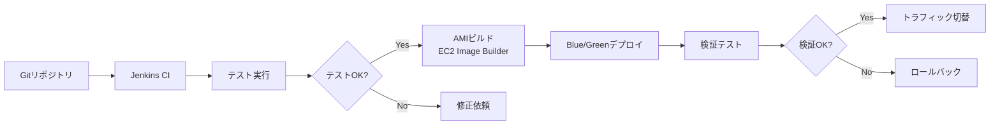

#### 10.1.2 採用技術スタック
```yaml
CIサーバー: Jenkins（既存資産活用）
CDサービス: AWS CodePipeline + CodeDeploy（Blue/Greenデプロイ）
コンテナ: Docker（ビルド環境標準化）
IaC: CloudFormation + Sceptre
構成管理: Ansible（ミドルウェア設定）
バージョン管理: Git
```

### 11.2 Jenkins CIパイプライン設計

#### 11.2.1 パイプライン構成
```yaml
Jenkinsジョブ構成:
  1. ソースコードチェックアウト
     - Gitリポジトリから最新コード取得
     - ブランチ戦略: feature → develop → staging → main
   
  2. 静的解析・テスト
     - コード品質チェック（SonarQube）
     - ユニットテスト実行
     - セキュリティスキャン
   
  3. アーティファクト作成
     - アプリケーションWARファイル作成
     - Dockerイメージビルド
     - 設定ファイル生成
   
  4. 統合テスト
     - テスト環境へのデプロイ
     - E2Eテスト実行
     - パフォーマンステスト
```

#### 10.2.2 Jenkins設定
```yaml
Jenkins Master:
  - インスタンスタイプ: t3.medium
  - ストレージ: 100GB gp3
  - バックアップ: AMIスナップショット

Jenkins Agent:
  - オンデマンド起動（スポットインスタンス）
  - Dockerサポート
  - AWS CLIインストール

プラグイン:
  - Git Plugin
  - Docker Plugin
  - AWS CodePipeline Plugin
  - Ansible Plugin
  - SonarQube Plugin
```

### 11.3 AWS CodePipeline統合

#### 11.3.1 CodePipeline構成
```yaml
パイプライン名: web-app-deployment-pipeline
ステージ構成:
  1. Source:
     - ソース: S3バケット（Jenkinsからアップロード）
     - トリガー: S3イベント（Jenkinsジョブ完了時）
   
  2. Build:
     - サービス: CodeBuild
     - 環境: Ubuntu標準イメージ
     - ビルドスペック: buildspec.yml
   
  3. Deploy:
     - サービス: CodeDeploy
     - デプロイ設定: Blue/Greenデプロイ
     - ターゲット: Auto Scalingグループ
```

#### 10.3.2 CodeBuild設定
```yaml
buildspec.yml:
  version: 0.2
  phases:
    install:
      runtime-versions:
        java: corretto11
        nodejs: 16
    pre_build:
      commands:
        - echo "Installing dependencies"
        - npm install
    build:
      commands:
        - echo "Building application"
        - mvn clean package
    post_build:
      commands:
        - echo "Preparing artifacts"
        - aws s3 cp target/*.war s3://artifacts-bucket/
        - aws s3 cp appspec.yml s3://artifacts-bucket/
```

### 11.4 Blue/Greenデプロイメント設計

#### 11.4.1 CodeDeploy設定
```yaml
appspec.yml:
  version: 0.0
  os: linux
  files:
    - source: /
      destination: /tmp/deployment
  hooks:
    BeforeInstall:
      - location: scripts/before_install.sh
        timeout: 300
        runas: root
    AfterInstall:
      - location: scripts/after_install.sh
        timeout: 300
        runas: root
    ApplicationStart:
      - location: scripts/application_start.sh
        timeout: 300
        runas: root
    ValidateService:
      - location: scripts/validate_service.sh
        timeout: 300
        runas: root
```

#### 10.4.2 Blue/Greenデプロイフロー
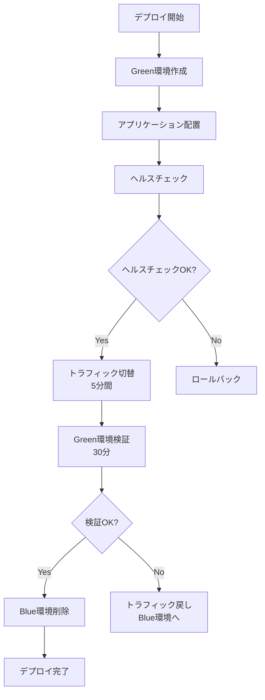

#### 10.4.3 デプロイスクリプト
```bash
# before_install.sh
#!/bin/bash
# デプロイ前準備
yum update -y
mkdir -p /opt/myapp

# after_install.sh  
#!/bin/bash
# アプリケーション配置
cp /tmp/deployment/*.war /opt/myapp/
chown tomcat:tomcat /opt/myapp/*.war

# application_start.sh
#!/bin/bash
# サービス起動
systemctl start tomcat
systemctl enable tomcat

# validate_service.sh
#!/bin/bash
# ヘルスチェック
curl -f http://localhost:8080/health || exit 1
```

### 11.5 Ansible統合設計

#### 11.5.1 Ansible Playbook構成
```yaml
playbook構造:
├── inventory/
│   ├── prod
│   ├── stg
│   └── dev
├── group_vars/
│   ├── all.yml
│   ├── prod.yml
│   └── stg.yml
├── roles/
│   ├── common/
│   ├── webserver/
│   ├── appserver/
│   └── monitoring/
└── site.yml
```

#### 10.5.2 環境別設定管理
```yaml
group_vars/prod.yml:
  environment: production
  db_host: aurora-prod.cluster-xxxx.ap-northeast-1.rds.amazonaws.com
  log_level: WARN
  monitoring_enabled: true

group_vars/stg.yml:
  environment: staging  
  db_host: aurora-stg.cluster-xxxx.ap-northeast-1.rds.amazonaws.com
  log_level: INFO
  monitoring_enabled: true

group_vars/dev.yml:
  environment: development
  db_host: aurora-dev.cluster-xxxx.ap-northeast-1.rds.amazonaws.com
  log_level: DEBUG
  monitoring_enabled: false
```

### 11.6 デプロイメント戦略

#### 11.6.1 環境別デプロイ戦略
```yaml
開発環境:
  - デプロイ方式: 直接デプロイ（ダウンタイム許容）
  - 承認プロセス: 自動承認
  - テスト: 基本機能テストのみ

ステージング環境:
  - デプロイ方式: Blue/Greenデプロイ
  - 承認プロセス: 開発チーム承認
  - テスト: 統合テスト + E2Eテスト

本番環境:
  - デプロイ方式: Blue/Greenデプロイ
  - 承認プロセス: 複数承認（Change Management）
  - テスト: 完全な検証テストスイート
```

#### 10.6.2 ロールバック戦略
```yaml
自動ロールバック条件:
  - ヘルスチェック失敗
  - アプリケーションエラー率上昇
  - レスポンスタイム劣化

手動ロールバック:
  - ビジネス要件による判断
  - 外部要因（データベース問題等）

ロールバック時間目標:
  - 自動: 10分以内
  - 手動: 30分以内
```

### 11.7 【検討課題】CI/CDパイプラインの追加検討項目

```
□ パイプラインの最適化
  - ビルド時間の短縮
  - 並列実行の最適化
  - キャッシュ戦略の改善

□ セキュリティ強化
  - コンテナイメージの脆弱性スキャン
  - シークレット管理の強化
  - 承認プロセスの厳格化

□ 監視・可観測性
  - パイプライン実行の監視
  - デプロイ成功率の追跡
  - パフォーマンスメトリクスの収集
```

---

## 12. 次のステップ

### 12.1 即座に必要な情報収集

**Phase 2期間中（～2025年12月中旬）に収集**:

#### 優先度：高
1. **アプリケーション特性分析**
   - アーキテクチャ図: 4台のWEBサーバ（httpd + tomcat同梱）、DB（5台 Galera Cluster構成）
   - メモリ消費パターン: インスタンスタイプ妥当性検証のため測定（平均45%、最大75%、バースト対応可能）
     - Zabbix監視値: vm.memory.size[pused]（メモリ使用率%）の1ヶ月平均/最大値を使用
   - セッション管理方式: スティッキーセッション
   - キャッシュ層: Redis/Memcached未使用、使用予定なし
   - 静的コンテンツ配信: CloudFront使用予定
   - データベース接続: ProxySQL使用（Reader固定1台、Writer振り分け、ヘルスチェック自動切り替え）
   - 接続プール設定: 最大接続数100
   - クエリパターン: 読み取り/書き込み比率 1:1（読み取り優位なし）
   - アプリケーション詳細: Javaアプリケーション（Tomcat）
   - ファイルアップロード: なし
   - API使用状況: 社内他サービスAPI 6つ使用
   - セッション詳細: タイムアウト一般値、データサイズ小（画像データなし）

#### 優先度：中

### 12.2 設計書の完成に向けて

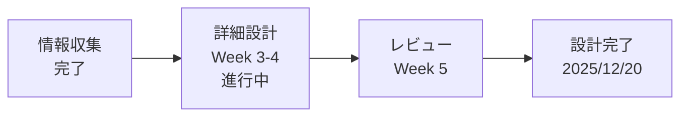

**Week 3-4**: 詳細設計の肉付け、具体的な数値の記載
**Week 5**: 設計レビュー、承認取得

---

## 改版履歴

| 版数 | 日付 | 改版内容 | 作成者 |
|------|------|----------|--------|
| 0.1 | 2025-11-17 | 初版作成（骨子） | - |
