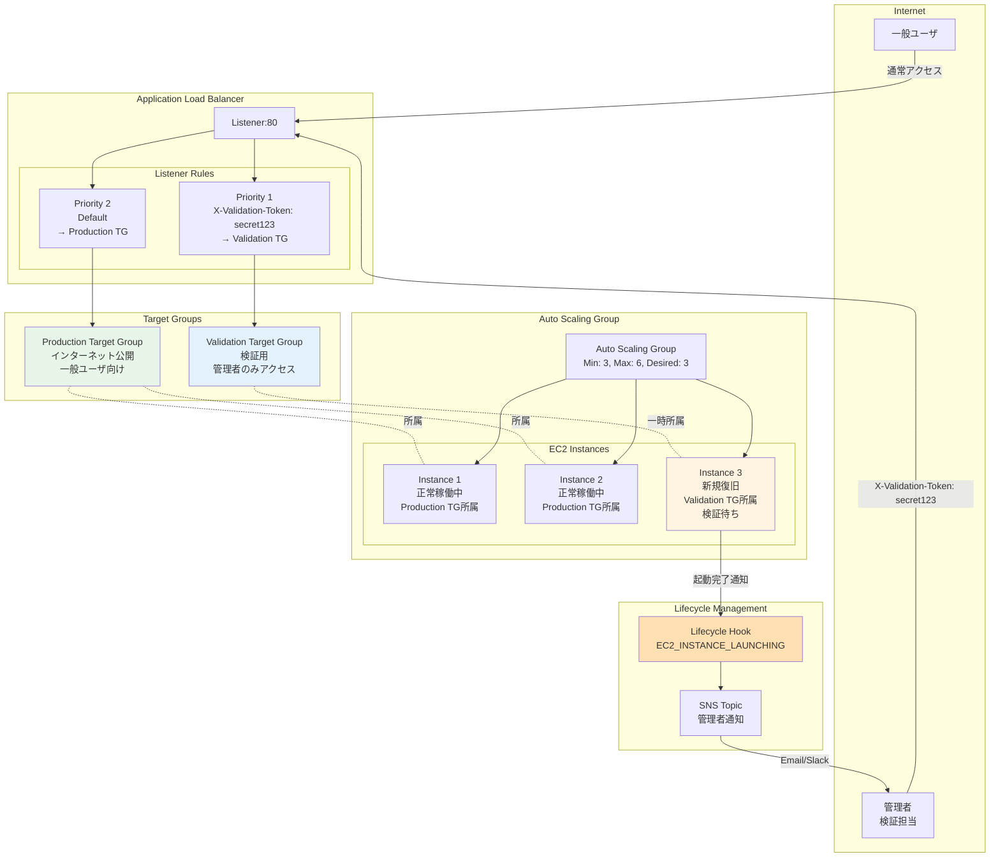
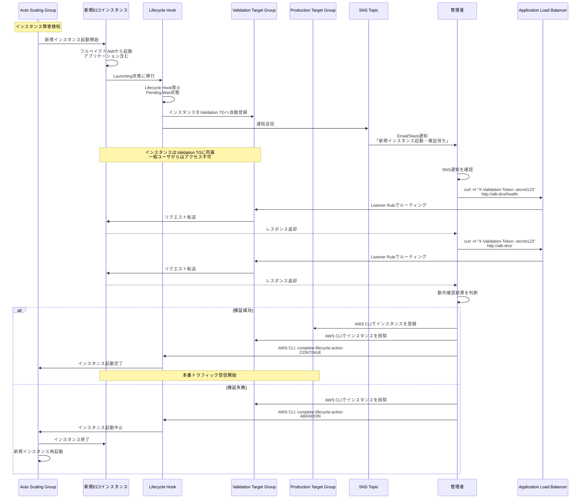

# Auto Scaling Group自動復旧後の検証ガイド

## 目次

- [Auto Scaling Group自動復旧後の検証ガイド](#auto-scaling-group自動復旧後の検証ガイド)
  - [目次](#目次)
  - [1. 概要](#1-概要)
    - [1.1 目的](#11-目的)
    - [1.2 対象環境](#12-対象環境)
    - [1.3 前提条件](#13-前提条件)
  - [2. アーキテクチャ概要](#2-アーキテクチャ概要)
    - [2.1 全体構成](#21-全体構成)
    - [2.2 検証フロー](#22-検証フロー)
  - [3. 実装詳細](#3-実装詳細)
    - [3.1 ALB構成（2つのTarget Group）](#31-alb構成2つのtarget-group)
    - [3.2 Lifecycle Hook設定](#32-lifecycle-hook設定)
    - [3.3 SNS通知設定](#33-sns通知設定)
  - [4. 運用手順](#4-運用手順)
    - [4.1 通常運用時の動作](#41-通常運用時の動作)
    - [4.2 インスタンス障害発生時の自動復旧](#42-インスタンス障害発生時の自動復旧)
    - [4.3 管理者による検証作業](#43-管理者による検証作業)
    - [4.4 本番環境への追加（承認）](#44-本番環境への追加承認)
    - [4.5 検証失敗時の対応（拒否）](#45-検証失敗時の対応拒否)
  - [5. CloudFormation実装](#5-cloudformation実装)
    - [5.1 Target Groups定義](#51-target-groups定義)
    - [5.2 ALB Listener Rules](#52-alb-listener-rules)
    - [5.3 Lifecycle Hook設定](#53-lifecycle-hook設定)
    - [5.4 SNS Topic設定](#54-sns-topic設定)
  - [6. 検証スクリプト](#6-検証スクリプト)
    - [6.1 手動検証用スクリプト](#61-手動検証用スクリプト)
    - [6.2 承認スクリプト](#62-承認スクリプト)
    - [6.3 拒否スクリプト](#63-拒否スクリプト)
    - [6.4 一括操作スクリプト](#64-一括操作スクリプト)
  - [7. モニタリング](#7-モニタリング)
    - [7.1 CloudWatch Metrics](#71-cloudwatch-metrics)
    - [7.2 CloudWatch Alarms](#72-cloudwatch-alarms)
    - [7.3 ログ確認](#73-ログ確認)
  - [8. トラブルシューティング](#8-トラブルシューティング)
    - [8.1 よくある問題と対処法](#81-よくある問題と対処法)
    - [8.2 緊急時の手動介入](#82-緊急時の手動介入)
  - [9. ベストプラクティス](#9-ベストプラクティス)
    - [9.1 検証項目チェックリスト](#91-検証項目チェックリスト)
    - [9.2 運用上の注意事項](#92-運用上の注意事項)
  - [10. 改版履歴](#10-改版履歴)

---

## 1. 概要

### 1.1 目的

Auto Scaling Groupによる自動復旧時に、新規起動したEC2インスタンスをいきなり本番トラフィックに晒すのではなく、管理者が手動で検証してから本番環境に追加する仕組みを提供します。

**実現する機能:**
- 自動復旧されたインスタンスは「Validation Target Group」に一時的に配置
- 管理者が特定のHTTPヘッダー付きでアクセスして動作確認
- 検証OKなら「Production Target Group」へ手動で移動
- 検証NGなら手動でインスタンスを削除・再作成

### 1.2 対象環境

| 項目 | 内容 |
|------|------|
| **対象システム** | EC2ベースのWEBサーバ（Apache/Tomcat） |
| **Auto Scaling** | 有効（ヘルスチェック失敗時に自動復旧） |
| **AMI種別** | フルベイクドAMI（アプリケーション含む） |
| **ロードバランサー** | Application Load Balancer (ALB) |
| **検証方式** | 手動承認フロー（管理者が目視確認） |

### 1.3 前提条件

```yaml
技術要件:
  - ALBが設定済み
  - Auto Scaling Groupが構成済み
  - フルベイクドAMIが作成済み
  - CloudWatch Logsが有効
  - SNSトピックが作成済み

運用要件:
  - 管理者がSNS通知を受信可能（Email/Slack）
  - 管理者がAWS CLIを実行可能
  - 検証用HTTPヘッダーのシークレット値を共有
  - 検証作業の標準時間: 30分以内
```

---

## 2. アーキテクチャ概要

### 2.1 全体構成



**主要コンポーネント:**
- **Production Target Group**: 本番トラフィックを受けるインスタンス群
- **Validation Target Group**: 検証中のインスタンス（`X-Target-Instance`ヘッダーでホスト名指定してアクセス）
- **Lifecycle Hook**: インスタンス起動時に管理者へ通知、手動承認待ちに移行
- **SNS Topic**: 管理者へのEmail/Slack通知（インスタンスIDとプライベートDNS名を通知）

**ヘッダーベースルーティングの仕組み:**
- ヘッダー名: `X-Target-Instance`
- ヘッダー値: インスタンス識別子（下記の候補から選択）
- ALBは`X-Target-Instance`ヘッダーがある場合、Validation Target Groupにルーティング
- Validation Target Group内で、指定された識別子のインスタンスに直接転送

**ヘッダー値の候補（再作成時も不変）:**

| 候補 | 例 | メリット | デメリット | 推奨度 |
|------|-----|---------|-----------|--------|
| **Nameタグ** | `poc-web-001` | ・人間が理解しやすい<br/>・命名規則で管理可能<br/>・既存の管理体系と整合 | ・タグ付け忘れリスク<br/>・ALB側でタグ値の取得不可（アプリ連携必要） | ⭐⭐⭐ |
| **プライベートIP【推奨】** | `10.0.1.10` | ・Auto Scalingで固定IP割当可能<br/>・ALB側で設定不要<br/>・アプリ改修不要<br/>・運用シンプル | ・IPアドレス管理必要<br/>・サブネット設計への依存 | ⭐⭐⭐⭐⭐ |
| **ENI-ID（固定ENI）** | `eni-0123456789abcdef0` | ・完全に固定可能<br/>・AWS側で一意保証 | ・ENI事前作成とアタッチ処理必要<br/>・運用複雑化 | ⭐⭐ |
| **Availability Zone + 連番【推奨】** | `1a-001`, `1c-002` | ・人間が理解しやすい<br/>・Auto Scalingで連番管理可能<br/>・AZ情報も含む | ・UserDataで設定必要<br/>・連番管理の仕組み必要 | ⭐⭐⭐⭐ |
| **カスタムタグ（Host-ID）** | `host-001`, `host-002` | ・柔軟な命名可能<br/>・既存命名規則と分離 | ・タグ管理必要<br/>・アプリ連携必要 | ⭐⭐⭐ |

**【推奨】プライベートIPアドレス方式:**

理由:
- ✅ Auto Scalingで特定のプライベートIPを割り当て可能
- ✅ ALB側での追加設定不要（既存機能でルーティング可能）
- ✅ アプリケーション側の改修不要
- ✅ 運用が最もシンプル
- ✅ EC2が再作成されても同じIPが再割り当てされる

実装方法:
```yaml
# Auto Scaling LaunchTemplate
NetworkInterfaces:
  - DeviceIndex: 0
    PrivateIpAddress: 10.0.1.10  # 固定IPを指定
    SubnetId: !Ref PrivateSubnet1a
```

### 2.2 検証フロー



**フローのポイント:**
1. **自動起動**: ASGがインスタンスを自動起動（フルベイクドAMI使用）
2. **Lifecycle Hook**: 起動時にPending:Wait状態に移行、管理者へ通知
3. **Validation TGへ自動登録**: インスタンスは自動的にValidation TGに所属
4. **手動検証**: 管理者が特定ヘッダー付きでアクセス、動作確認
5. **手動承認**: 検証OKならProduction TGへ移動、Lifecycle Hook完了
6. **手動拒否**: 検証NGならインスタンス削除、ASGが再起動

---

## 3. 実装詳細

### 3.1 ALB構成（2つのTarget Group）

**CloudFormation定義:**

```yaml
# Production Target Group（本番用）
ProductionTargetGroup:
  Type: AWS::ElasticLoadBalancingV2::TargetGroup
  Properties:
    Name: !Sub '${Environment}-web-production-tg'
    Port: 80
    Protocol: HTTP
    VpcId: !Ref VPCId
    HealthCheckEnabled: true
    HealthCheckPath: /health
    HealthCheckProtocol: HTTP
    HealthCheckIntervalSeconds: 30
    HealthCheckTimeoutSeconds: 5
    HealthyThresholdCount: 2
    UnhealthyThresholdCount: 3
    Matcher:
      HttpCode: "200"
    Tags:
      - Key: Name
        Value: !Sub '${Environment}-web-production-tg'
      - Key: Environment
        Value: !Ref Environment

# Validation Target Group（検証用）
ValidationTargetGroup:
  Type: AWS::ElasticLoadBalancingV2::TargetGroup
  Properties:
    Name: !Sub '${Environment}-web-validation-tg'
    Port: 80
    Protocol: HTTP
    VpcId: !Ref VPCId
    HealthCheckEnabled: true
    HealthCheckPath: /health
    HealthCheckProtocol: HTTP
    HealthCheckIntervalSeconds: 30
    HealthCheckTimeoutSeconds: 5
    HealthyThresholdCount: 2
    UnhealthyThresholdCount: 3
    Matcher:
      HttpCode: "200"
    # スティッキーセッション無効（ヘッダーで明示的にルーティング）
    TargetGroupAttributes:
      - Key: stickiness.enabled
        Value: 'false'
    Tags:
      - Key: Name
        Value: !Sub '${Environment}-web-validation-tg'
      - Key: Environment
        Value: !Ref Environment
      - Key: Purpose
        Value: instance-validation

# ALB Listener
ALBListener:
  Type: AWS::ElasticLoadBalancingV2::Listener
  Properties:
    LoadBalancerArn: !Ref ApplicationLoadBalancer
    Port: 80
    Protocol: HTTP
    DefaultActions:
      - Type: forward
        TargetGroupArn: !Ref ProductionTargetGroup

# Validation用Listener Rule（ヘッダーベース - ホスト名指定）
ValidationListenerRule:
  Type: AWS::ElasticLoadBalancingV2::ListenerRule
  Properties:
    ListenerArn: !Ref ALBListener
    Priority: 1  # デフォルトルールより優先
    Conditions:
      - Field: http-header
        HttpHeaderConfig:
          HttpHeaderName: X-Target-Instance
          Values:
            - "ip-*"  # プライベートDNS名のパターンマッチ
    Actions:
      - Type: forward
        TargetGroupArn: !Ref ValidationTargetGroup
```

**重要な設定:**
- **Priority: 1**: Validation Ruleはデフォルトルールより優先
- **ヘッダー名**: `X-Target-Instance`（インスタンス識別子を指定）
- **ヘッダー値の選択肢**:
  - `10.0.1.10`（プライベートIP）【推奨】
  - `poc-web-001`（Nameタグ）
  - `1a-001`（AZ + 連番）
- **スティッキーセッション**: 無効（ヘッダーで明示的にルーティング制御）
- **ワイルドカード**: `10.0.*`や`poc-web-*`でパターンマッチ可能

### 3.2 Lifecycle Hook設定

**CloudFormation定義:**

```yaml
# Lifecycle Hook（インスタンス起動時）
LaunchLifecycleHook:
  Type: AWS::AutoScaling::LifecycleHook
  Properties:
    LifecycleHookName: !Sub '${Environment}-web-validation-hook'
    AutoScalingGroupName: !Ref AutoScalingGroup
    LifecycleTransition: autoscaling:EC2_INSTANCE_LAUNCHING
    DefaultResult: ABANDON  # タイムアウト時はインスタンス削除
    HeartbeatTimeout: 3600  # 1時間（検証時間）
    NotificationTargetARN: !Ref ValidationNotificationTopic
    RoleARN: !GetAtt LifecycleHookRole.Arn

# Lifecycle Hook用IAMロール
LifecycleHookRole:
  Type: AWS::IAM::Role
  Properties:
    AssumeRolePolicyDocument:
      Version: '2012-10-17'
      Statement:
        - Effect: Allow
          Principal:
            Service: autoscaling.amazonaws.com
          Action: sts:AssumeRole
    ManagedPolicyArns:
      - arn:aws:iam::aws:policy/service-role/AutoScalingNotificationAccessRole
    Policies:
      - PolicyName: LifecycleHookSNSPublish
        PolicyDocument:
          Version: '2012-10-17'
          Statement:
            - Effect: Allow
              Action:
                - sns:Publish
              Resource: !Ref ValidationNotificationTopic
```

**重要な設定:**
- **DefaultResult: ABANDON**: 1時間以内に承認されない場合はインスタンス削除
- **HeartbeatTimeout: 3600**: 検証時間は1時間（必要に応じて調整）
- **NotificationTargetARN**: SNSトピックへ通知送信

### 3.3 SNS通知設定

**CloudFormation定義:**

```yaml
# SNS Topic（管理者通知用）
ValidationNotificationTopic:
  Type: AWS::SNS::Topic
  Properties:
    TopicName: !Sub '${Environment}-instance-validation-notification'
    DisplayName: EC2 Instance Validation Notification
    Subscription:
      - Endpoint: !Ref AdminEmail
        Protocol: email
      # Slack統合（オプション）
      - Endpoint: !Ref SlackWebhookURL
        Protocol: https

# SNS Topic Policy
ValidationNotificationTopicPolicy:
  Type: AWS::SNS::TopicPolicy
  Properties:
    Topics:
      - !Ref ValidationNotificationTopic
    PolicyDocument:
      Version: '2012-10-17'
      Statement:
        - Effect: Allow
          Principal:
            Service:
              - autoscaling.amazonaws.com
          Action:
            - SNS:Publish
          Resource: !Ref ValidationNotificationTopic
```

**通知メッセージ例:**

```json
{
  "LifecycleHookName": "poc-web-validation-hook",
  "AccountId": "123456789012",
  "RequestId": "12345678-1234-1234-1234-123456789012",
  "LifecycleTransition": "autoscaling:EC2_INSTANCE_LAUNCHING",
  "AutoScalingGroupName": "poc-web-asg",
  "Service": "AWS Auto Scaling",
  "Time": "2025-11-19T12:00:00.000Z",
  "EC2InstanceId": "i-0123456789abcdef0",
  "LifecycleActionToken": "abcdef12-3456-7890-abcd-ef1234567890"
}
```

---

## 4. 運用手順

### 4.1 通常運用時の動作

```bash
# Production Target Groupの状態確認
aws elbv2 describe-target-health \
    --target-group-arn arn:aws:elasticloadbalancing:ap-northeast-1:123456789012:targetgroup/poc-web-production-tg/1234567890123456 \
    --query 'TargetHealthDescriptions[*].[Target.Id,TargetHealth.State,TargetHealth.Reason]' \
    --output table

# 結果例（正常時）
# ------------------------------------------------------------
# |                  DescribeTargetHealth                   |
# +----------------------+----------+------------------------+
# |  i-0134c94a753025b8b |  healthy |  None                 |
# |  i-0297dec34ad7ea77b |  healthy |  None                 |
# |  i-0f464ba83118e3114 |  healthy |  None                 |
# +----------------------+----------+------------------------+
```

### 4.2 インスタンス障害発生時の自動復旧

**シナリオ: i-0f464ba83118e3114が障害（ヘルスチェック失敗）**

```bash
# 1. Auto Scaling Groupが障害を検知（ALB Health Check失敗）
# 2. ASGが自動的にインスタンスを置換開始
# 3. 新規インスタンスが起動（i-0a1b2c3d4e5f6g7h8）
# 4. Lifecycle Hookが発火、Pending:Wait状態に移行
# 5. SNS通知が管理者へ送信

# CloudWatch Logsで確認
aws logs tail /aws/ec2/autoscaling/poc-web-asg --follow

# 出力例:
# 2025-11-19 12:00:00 Launching new instance i-0a1b2c3d4e5f6g7h8
# 2025-11-19 12:01:00 Instance entered Pending:Wait due to lifecycle hook
# 2025-11-19 12:01:05 SNS notification sent to admin
```

**管理者が受信するEmail通知:**

```
件名: EC2 Instance Validation Required - i-0a1b2c3d4e5f6g7h8

新規EC2インスタンスが起動しました。検証が必要です。

インスタンスID: i-0a1b2c3d4e5f6g7h8
プライベートIP: 10.0.1.10 【推奨識別子】
Nameタグ: poc-web-001
Availability Zone: ap-northeast-1a
Auto Scaling Group: poc-web-asg
起動時刻: 2025-11-19 12:00:00 JST

検証手順:
1. プライベートIPを使って動作確認【推奨】
   curl -H "X-Target-Instance: 10.0.1.10" \
        http://poc-alb.example.com/health

   または他の識別子を使用:
   curl -H "X-Target-Instance: poc-web-001" \
        http://poc-alb.example.com/health

2. または検証スクリプト使用
   ./validate_instance.sh i-0a1b2c3d4e5f6g7h8

3. 検証OK → 承認スクリプト実行
   ./approve_instance.sh i-0a1b2c3d4e5f6g7h8

4. 検証NG → 拒否スクリプト実行
   ./reject_instance.sh i-0a1b2c3d4e5f6g7h8

タイムアウト: 1時間（12:00から13:00まで）
タイムアウト時の動作: 自動的にインスタンス削除
```

### 4.3 管理者による検証作業

**Step 1: インスタンス情報確認**

```bash
# インスタンスの詳細確認
aws ec2 describe-instances \
    --instance-ids i-0a1b2c3d4e5f6g7h8 \
    --query 'Reservations[0].Instances[0].[InstanceId,State.Name,PrivateIpAddress,LaunchTime]' \
    --output table

# Validation Target Groupへの登録確認
aws elbv2 describe-target-health \
    --target-group-arn arn:aws:elasticloadbalancing:ap-northeast-1:123456789012:targetgroup/poc-web-validation-tg/1234567890123456 \
    --query 'TargetHealthDescriptions[*].[Target.Id,TargetHealth.State]' \
    --output table
```

**Step 2: 動作確認（特定ヘッダー付きアクセス）**

```bash
#!/bin/bash
# validation_test.sh

INSTANCE_ID="i-0a1b2c3d4e5f6g7h8"
ALB_DNS="poc-alb-1234567890.ap-northeast-1.elb.amazonaws.com"

# インスタンス識別子の取得（方式選択）
# 方式1: プライベートIPアドレス【推奨】
PRIVATE_IP=$(aws ec2 describe-instances \
    --instance-ids "$INSTANCE_ID" \
    --query 'Reservations[0].Instances[0].PrivateIpAddress' \
    --output text)

# 方式2: Nameタグ（オプション）
NAME_TAG=$(aws ec2 describe-instances \
    --instance-ids "$INSTANCE_ID" \
    --query 'Reservations[0].Instances[0].Tags[?Key==`Name`].Value' \
    --output text)

# 方式3: AZ + 連番タグ（オプション）
HOST_ID_TAG=$(aws ec2 describe-instances \
    --instance-ids "$INSTANCE_ID" \
    --query 'Reservations[0].Instances[0].Tags[?Key==`Host-ID`].Value' \
    --output text)

# 使用する識別子を選択（プライベートIPを推奨）
TARGET_IDENTIFIER="$PRIVATE_IP"

echo "=== EC2 Instance Validation Test ==="
echo "Instance ID: $INSTANCE_ID"
echo "Private IP: $PRIVATE_IP"
echo "Name Tag: ${NAME_TAG:-N/A}"
echo "Host-ID Tag: ${HOST_ID_TAG:-N/A}"
echo "Target Identifier: $TARGET_IDENTIFIER"
echo "ALB DNS: $ALB_DNS"
echo ""

if [ -z "$TARGET_IDENTIFIER" ]; then
    echo "ERROR: Could not retrieve target identifier"
    exit 1
fi

# Test 1: Health Check
echo "Test 1: Health Check Endpoint"
HTTP_CODE=$(curl -s -o /dev/null -w "%{http_code}" \
    -H "X-Target-Instance: $TARGET_IDENTIFIER" \
    -H "Host: $ALB_DNS" \
    "http://$ALB_DNS/health")

if [ "$HTTP_CODE" = "200" ]; then
    echo "  ✓ PASS - HTTP Status: $HTTP_CODE"
else
    echo "  ✗ FAIL - HTTP Status: $HTTP_CODE"
    exit 1
fi

# Test 2: Application Root
echo "Test 2: Application Root Endpoint"
HTTP_CODE=$(curl -s -o /dev/null -w "%{http_code}" \
    -H "X-Target-Instance: $TARGET_IDENTIFIER" \
    -H "Host: $ALB_DNS" \
    "http://$ALB_DNS/")

if [ "$HTTP_CODE" = "200" ]; then
    echo "  ✓ PASS - HTTP Status: $HTTP_CODE"
else
    echo "  ✗ FAIL - HTTP Status: $HTTP_CODE"
    exit 1
fi

# Test 3: Sample API Endpoint（カスタマイズ）
echo "Test 3: Sample API Endpoint"
RESPONSE=$(curl -s \
    -H "X-Target-Instance: $TARGET_IDENTIFIER" \
    -H "Host: $ALB_DNS" \
    "http://$ALB_DNS/api/status")

if echo "$RESPONSE" | grep -q "\"status\":\"ok\""; then
    echo "  ✓ PASS - API Response: $RESPONSE"
else
    echo "  ✗ FAIL - API Response: $RESPONSE"
    exit 1
fi

# Test 4: Database Connectivity Check（アプリ側実装必要）
echo "Test 4: Database Connectivity"
RESPONSE=$(curl -s \
    -H "X-Target-Instance: $TARGET_IDENTIFIER" \
    -H "Host: $ALB_DNS" \
    "http://$ALB_DNS/api/db-check")

if echo "$RESPONSE" | grep -q "\"database\":\"connected\""; then
    echo "  ✓ PASS - Database: Connected"
else
    echo "  ✗ FAIL - Database: $RESPONSE"
    exit 1
fi

# Test 5: インスタンス識別確認（レスポンスヘッダーで確認）
echo "Test 5: Instance Identification"
RESPONSE_HEADERS=$(curl -s -I \
    -H "X-Target-Instance: $TARGET_IDENTIFIER" \
    "http://$ALB_DNS/")

ACTUAL_IP=$(echo "$RESPONSE_HEADERS" | grep -i "X-Instance-IP" | awk '{print $2}' | tr -d '\r')

if [ "$ACTUAL_IP" = "$PRIVATE_IP" ]; then
    echo "  ✓ PASS - Correct instance responded: $PRIVATE_IP"
else
    echo "  ℹ INFO - Response from instance: ${ACTUAL_IP:-Unknown}"
    echo "  Expected: $PRIVATE_IP"
fi

echo ""
echo "=== All Tests Passed ==="
echo "Instance $INSTANCE_ID ($TARGET_IDENTIFIER) is ready for production."
```

**Step 3: ブラウザでの目視確認（オプション）**

```bash
# インスタンスのプライベートIPを取得（推奨方式）
INSTANCE_ID="i-0a1b2c3d4e5f6g7h8"
PRIVATE_IP=$(aws ec2 describe-instances \
    --instance-ids "$INSTANCE_ID" \
    --query 'Reservations[0].Instances[0].PrivateIpAddress' \
    --output text)

echo "Private IP: $PRIVATE_IP"

# ブラウザ用のcurlコマンド（ModHeader拡張機能等で再現）
curl -H "X-Target-Instance: $PRIVATE_IP" \
     http://poc-alb-1234567890.ap-northeast-1.elb.amazonaws.com/

# または、ローカルでポートフォワーディング
aws ssm start-session \
    --target "$INSTANCE_ID" \
    --document-name AWS-StartPortForwardingSession \
    --parameters 'portNumber=80,localPortNumber=8080'

# ブラウザで http://localhost:8080 にアクセス
```

**ModHeader拡張機能設定（Chrome/Firefox）:**
```
Header Name: X-Target-Instance
Header Value: 10.0.1.10

（または他の識別子を使用する場合）
Header Value: poc-web-001     # Nameタグ
Header Value: 1a-001          # AZ + 連番
```

### 4.4 本番環境への追加（承認）

**承認スクリプト: approve_instance.sh**

```bash
#!/bin/bash
# approve_instance.sh - インスタンスを本番環境へ追加

set -e

INSTANCE_ID="$1"
ASG_NAME="poc-web-asg"
LIFECYCLE_HOOK_NAME="poc-web-validation-hook"
PROD_TG_ARN="arn:aws:elasticloadbalancing:ap-northeast-1:123456789012:targetgroup/poc-web-production-tg/1234567890123456"
VAL_TG_ARN="arn:aws:elasticloadbalancing:ap-northeast-1:123456789012:targetgroup/poc-web-validation-tg/1234567890123456"

if [ -z "$INSTANCE_ID" ]; then
    echo "Usage: $0 <instance-id>"
    exit 1
fi

echo "=== Approving Instance $INSTANCE_ID ==="

# 1. Production Target Groupへ登録
echo "Step 1: Registering to Production Target Group..."
aws elbv2 register-targets \
    --target-group-arn "$PROD_TG_ARN" \
    --targets Id="$INSTANCE_ID"

# 2. ヘルスチェック待機（最大5分）
echo "Step 2: Waiting for health check in Production TG..."
TIMEOUT=300
ELAPSED=0
while [ $ELAPSED -lt $TIMEOUT ]; do
    HEALTH_STATE=$(aws elbv2 describe-target-health \
        --target-group-arn "$PROD_TG_ARN" \
        --targets Id="$INSTANCE_ID" \
        --query 'TargetHealthDescriptions[0].TargetHealth.State' \
        --output text)
    
    echo "  Health State: $HEALTH_STATE (${ELAPSED}s elapsed)"
    
    if [ "$HEALTH_STATE" = "healthy" ]; then
        echo "  ✓ Instance is healthy in Production TG"
        break
    fi
    
    sleep 10
    ELAPSED=$((ELAPSED + 10))
done

if [ "$HEALTH_STATE" != "healthy" ]; then
    echo "  ✗ ERROR: Health check failed in Production TG"
    exit 1
fi

# 3. Validation Target Groupから削除
echo "Step 3: Deregistering from Validation Target Group..."
aws elbv2 deregister-targets \
    --target-group-arn "$VAL_TG_ARN" \
    --targets Id="$INSTANCE_ID"

# 4. Lifecycle Action Token取得
echo "Step 4: Retrieving Lifecycle Action Token..."
LIFECYCLE_INFO=$(aws autoscaling describe-auto-scaling-instances \
    --instance-ids "$INSTANCE_ID" \
    --query 'AutoScalingInstances[0].[LifecycleState,AvailabilityZone]' \
    --output text)

LIFECYCLE_STATE=$(echo "$LIFECYCLE_INFO" | awk '{print $1}')
echo "  Lifecycle State: $LIFECYCLE_STATE"

# 5. Lifecycle Hookを完了（CONTINUE）
echo "Step 5: Completing Lifecycle Hook..."
aws autoscaling complete-lifecycle-action \
    --lifecycle-hook-name "$LIFECYCLE_HOOK_NAME" \
    --auto-scaling-group-name "$ASG_NAME" \
    --lifecycle-action-result CONTINUE \
    --instance-id "$INSTANCE_ID"

echo ""
echo "=== Instance $INSTANCE_ID Approved ==="
echo "✓ Registered to Production Target Group"
echo "✓ Deregistered from Validation Target Group"
echo "✓ Lifecycle Hook completed (CONTINUE)"
echo "✓ Instance is now serving production traffic"
```

### 4.5 検証失敗時の対応（拒否）

**拒否スクリプト: reject_instance.sh**

```bash
#!/bin/bash
# reject_instance.sh - インスタンスを削除・再作成

set -e

INSTANCE_ID="$1"
ASG_NAME="poc-web-asg"
LIFECYCLE_HOOK_NAME="poc-web-validation-hook"
VAL_TG_ARN="arn:aws:elasticloadbalancing:ap-northeast-1:123456789012:targetgroup/poc-web-validation-tg/1234567890123456"

if [ -z "$INSTANCE_ID" ]; then
    echo "Usage: $0 <instance-id>"
    exit 1
fi

echo "=== Rejecting Instance $INSTANCE_ID ==="

# 1. Validation Target Groupから削除
echo "Step 1: Deregistering from Validation Target Group..."
aws elbv2 deregister-targets \
    --target-group-arn "$VAL_TG_ARN" \
    --targets Id="$INSTANCE_ID"

# 2. Lifecycle Hookを完了（ABANDON）
echo "Step 2: Completing Lifecycle Hook (ABANDON)..."
aws autoscaling complete-lifecycle-action \
    --lifecycle-hook-name "$LIFECYCLE_HOOK_NAME" \
    --auto-scaling-group-name "$ASG_NAME" \
    --lifecycle-action-result ABANDON \
    --instance-id "$INSTANCE_ID"

echo ""
echo "=== Instance $INSTANCE_ID Rejected ==="
echo "✓ Deregistered from Validation Target Group"
echo "✓ Lifecycle Hook completed (ABANDON)"
echo "✓ Instance will be terminated"
echo "✓ Auto Scaling Group will launch a new instance"

# 3. 新規インスタンス起動確認
echo ""
echo "Step 3: Monitoring new instance launch..."
sleep 10

NEW_INSTANCES=$(aws autoscaling describe-auto-scaling-groups \
    --auto-scaling-group-names "$ASG_NAME" \
    --query 'AutoScalingGroups[0].Instances[?LifecycleState==`Pending` || LifecycleState==`Pending:Wait`].[InstanceId,LifecycleState]' \
    --output text)

if [ -n "$NEW_INSTANCES" ]; then
    echo "✓ New instance is launching:"
    echo "$NEW_INSTANCES"
else
    echo "  Waiting for new instance..."
fi
```

---

## 5. CloudFormation実装

### 5.1 Target Groups定義

```yaml
# sceptre/templates/alb-target-groups.yaml
AWSTemplateFormatVersion: '2010-09-09'
Description: ALB Target Groups for Production and Validation

Parameters:
  Environment:
    Type: String
    Description: Environment name
  VPCId:
    Type: AWS::EC2::VPC::Id
    Description: VPC ID

Resources:
  ProductionTargetGroup:
    Type: AWS::ElasticLoadBalancingV2::TargetGroup
    Properties:
      Name: !Sub '${Environment}-web-production-tg'
      Port: 80
      Protocol: HTTP
      VpcId: !Ref VPCId
      HealthCheckEnabled: true
      HealthCheckPath: /health
      HealthCheckProtocol: HTTP
      HealthCheckIntervalSeconds: 30
      HealthCheckTimeoutSeconds: 5
      HealthyThresholdCount: 2
      UnhealthyThresholdCount: 3
      Matcher:
        HttpCode: "200"
      Tags:
        - Key: Name
          Value: !Sub '${Environment}-web-production-tg'
        - Key: Environment
          Value: !Ref Environment

  ValidationTargetGroup:
    Type: AWS::ElasticLoadBalancingV2::TargetGroup
    Properties:
      Name: !Sub '${Environment}-web-validation-tg'
      Port: 80
      Protocol: HTTP
      VpcId: !Ref VPCId
      HealthCheckEnabled: true
      HealthCheckPath: /health
      HealthCheckProtocol: HTTP
      HealthCheckIntervalSeconds: 30
      HealthCheckTimeoutSeconds: 5
      HealthyThresholdCount: 2
      UnhealthyThresholdCount: 3
      Matcher:
        HttpCode: "200"
      Tags:
        - Key: Name
          Value: !Sub '${Environment}-web-validation-tg'
        - Key: Environment
          Value: !Ref Environment
        - Key: Purpose
          Value: instance-validation

Outputs:
  ProductionTargetGroupArn:
    Description: Production Target Group ARN
    Value: !Ref ProductionTargetGroup
    Export:
      Name: !Sub '${Environment}-ProductionTargetGroupArn'

  ValidationTargetGroupArn:
    Description: Validation Target Group ARN
    Value: !Ref ValidationTargetGroup
    Export:
      Name: !Sub '${Environment}-ValidationTargetGroupArn'
```

### 5.2 ALB Listener Rules

**方式1: プライベートIPアドレス使用【推奨】**

```yaml
# sceptre/templates/alb-listener-rules.yaml
AWSTemplateFormatVersion: '2010-09-09'
Description: ALB Listener Rules for Validation Routing (Private IP)

Parameters:
  Environment:
    Type: String
  ALBListenerArn:
    Type: String
    Description: ALB Listener ARN

Resources:
  ValidationListenerRule:
    Type: AWS::ElasticLoadBalancingV2::ListenerRule
    Properties:
      ListenerArn: !Ref ALBListenerArn
      Priority: 1
      Conditions:
        - Field: http-header
          HttpHeaderConfig:
            HttpHeaderName: X-Target-Instance
            Values:
              - "10.0.*"  # VPCのプライベートIPレンジ
      Actions:
        - Type: forward
          TargetGroupArn:
            Fn::ImportValue: !Sub '${Environment}-ValidationTargetGroupArn'

Outputs:
  ValidationListenerRuleArn:
    Description: Validation Listener Rule ARN
    Value: !Ref ValidationListenerRule
    Export:
      Name: !Sub '${Environment}-ValidationListenerRuleArn'
```

**方式2: Nameタグ使用（アプリケーション連携必要）**

```yaml
# アプリケーション側でX-Target-Instanceヘッダーを読み取り、
# 自身のNameタグと一致する場合のみ処理を行う実装が必要

# ALB Listener Rule
ValidationListenerRule:
  Type: AWS::ElasticLoadBalancingV2::ListenerRule
  Properties:
    ListenerArn: !Ref ALBListenerArn
    Priority: 1
    Conditions:
      - Field: http-header
        HttpHeaderConfig:
          HttpHeaderName: X-Target-Instance
          Values:
            - "poc-web-*"  # Nameタグのプレフィックス
    Actions:
      - Type: forward
        TargetGroupArn:
          Fn::ImportValue: !Sub '${Environment}-ValidationTargetGroupArn'
```

**方式3: AZ + 連番タグ使用**

```yaml
# Host-IDタグ（例: 1a-001, 1c-002）を使用

ValidationListenerRule:
  Type: AWS::ElasticLoadBalancingV2::ListenerRule
  Properties:
    ListenerArn: !Ref ALBListenerArn
    Priority: 1
    Conditions:
      - Field: http-header
        HttpHeaderConfig:
          HttpHeaderName: X-Target-Instance
          Values:
            - "1a-*"  # AZ-1a内のインスタンス
            - "1c-*"  # AZ-1c内のインスタンス
    Actions:
      - Type: forward
        TargetGroupArn:
          Fn::ImportValue: !Sub '${Environment}-ValidationTargetGroupArn'
```

### 5.3 Lifecycle Hook設定

```yaml
# sceptre/templates/asg-lifecycle-hook.yaml
AWSTemplateFormatVersion: '2010-09-09'
Description: Auto Scaling Lifecycle Hook for Instance Validation

Parameters:
  Environment:
    Type: String
  AutoScalingGroupName:
    Type: String
    Description: Auto Scaling Group Name

Resources:
  LifecycleHookRole:
    Type: AWS::IAM::Role
    Properties:
      AssumeRolePolicyDocument:
        Version: '2012-10-17'
        Statement:
          - Effect: Allow
            Principal:
              Service: autoscaling.amazonaws.com
            Action: sts:AssumeRole
      ManagedPolicyArns:
        - arn:aws:iam::aws:policy/service-role/AutoScalingNotificationAccessRole
      Policies:
        - PolicyName: LifecycleHookSNSPublish
          PolicyDocument:
            Version: '2012-10-17'
            Statement:
              - Effect: Allow
                Action:
                  - sns:Publish
                Resource: !Ref ValidationNotificationTopic

  ValidationNotificationTopic:
    Type: AWS::SNS::Topic
    Properties:
      TopicName: !Sub '${Environment}-instance-validation'
      DisplayName: EC2 Instance Validation Notification
      Tags:
        - Key: Name
          Value: !Sub '${Environment}-instance-validation'
        - Key: Environment
          Value: !Ref Environment

  ValidationNotificationTopicPolicy:
    Type: AWS::SNS::TopicPolicy
    Properties:
      Topics:
        - !Ref ValidationNotificationTopic
      PolicyDocument:
        Version: '2012-10-17'
        Statement:
          - Effect: Allow
            Principal:
              Service: autoscaling.amazonaws.com
            Action: SNS:Publish
            Resource: !Ref ValidationNotificationTopic

  LaunchLifecycleHook:
    Type: AWS::AutoScaling::LifecycleHook
    Properties:
      LifecycleHookName: !Sub '${Environment}-web-validation-hook'
      AutoScalingGroupName: !Ref AutoScalingGroupName
      LifecycleTransition: autoscaling:EC2_INSTANCE_LAUNCHING
      DefaultResult: ABANDON
      HeartbeatTimeout: 3600  # 1 hour
      NotificationTargetARN: !Ref ValidationNotificationTopic
      RoleARN: !GetAtt LifecycleHookRole.Arn

Outputs:
  ValidationNotificationTopicArn:
    Description: SNS Topic ARN for validation notifications
    Value: !Ref ValidationNotificationTopic
    Export:
      Name: !Sub '${Environment}-ValidationNotificationTopicArn'

  LifecycleHookName:
    Description: Lifecycle Hook Name
    Value: !Ref LaunchLifecycleHook
    Export:
      Name: !Sub '${Environment}-LifecycleHookName'
```

### 5.4 SNS Topic設定

```yaml
# sceptre/config/poc/sns-validation.yaml
template: sns-validation.yaml
parameters:
  Environment: poc
  AdminEmail: admin@example.com
  SlackWebhookURL: https://hooks.slack.com/services/xxx/yyy/zzz
```

---

## 6. 検証スクリプト

### 6.1 手動検証用スクリプト

```bash
#!/bin/bash
# scripts/validate_instance.sh

INSTANCE_ID="$1"
ALB_DNS="${ALB_DNS:-poc-alb-1234567890.ap-northeast-1.elb.amazonaws.com}"

if [ -z "$INSTANCE_ID" ]; then
    echo "Usage: $0 <instance-id>"
    echo "Environment Variables:"
    echo "  ALB_DNS: ALB DNS name"
    exit 1
fi

# 複数の識別子を取得
PRIVATE_IP=$(aws ec2 describe-instances \
    --instance-ids "$INSTANCE_ID" \
    --query 'Reservations[0].Instances[0].PrivateIpAddress' \
    --output text)

NAME_TAG=$(aws ec2 describe-instances \
    --instance-ids "$INSTANCE_ID" \
    --query 'Reservations[0].Instances[0].Tags[?Key==`Name`].Value' \
    --output text)

HOST_ID_TAG=$(aws ec2 describe-instances \
    --instance-ids "$INSTANCE_ID" \
    --query 'Reservations[0].Instances[0].Tags[?Key==`Host-ID`].Value' \
    --output text)

# プライベートIPを優先使用【推奨】
TARGET_IDENTIFIER="$PRIVATE_IP"

if [ -z "$TARGET_IDENTIFIER" ]; then
    echo "ERROR: Could not retrieve target identifier for instance $INSTANCE_ID"
    exit 1
fi

echo "=== Validating Instance $INSTANCE_ID ==="
echo "Private IP: $PRIVATE_IP 【推奨識別子】"
echo "Name Tag: ${NAME_TAG:-N/A}"
echo "Host-ID Tag: ${HOST_ID_TAG:-N/A}"
echo "Using Identifier: $TARGET_IDENTIFIER"
echo "ALB: $ALB_DNS"
echo ""

# Test 1: Health Check
echo "1. Health Check..."
HTTP_CODE=$(curl -s -o /dev/null -w "%{http_code}" \
    -H "X-Target-Instance: $TARGET_IDENTIFIER" \
    "http://$ALB_DNS/health")

if [ "$HTTP_CODE" = "200" ]; then
    echo "  ✓ PASS"
else
    echo "  ✗ FAIL (HTTP $HTTP_CODE)"
    exit 1
fi

# Test 2: Application Root
echo "2. Application Root..."
HTTP_CODE=$(curl -s -o /dev/null -w "%{http_code}" \
    -H "X-Target-Instance: $TARGET_IDENTIFIER" \
    "http://$ALB_DNS/")

if [ "$HTTP_CODE" = "200" ]; then
    echo "  ✓ PASS"
else
    echo "  ✗ FAIL (HTTP $HTTP_CODE)"
    exit 1
fi

# Test 3: API Status
echo "3. API Status..."
RESPONSE=$(curl -s \
    -H "X-Target-Instance: $TARGET_IDENTIFIER" \
    "http://$ALB_DNS/api/status")

if echo "$RESPONSE" | grep -q "\"status\":\"ok\""; then
    echo "  ✓ PASS"
else
    echo "  ✗ FAIL"
    exit 1
fi

# Test 4: インスタンス識別確認
echo "4. Instance Identification..."
RESPONSE_HEADERS=$(curl -s -I \
    -H "X-Target-Instance: $TARGET_IDENTIFIER" \
    "http://$ALB_DNS/" 2>/dev/null)

echo "  ✓ Verified routing to instance: $TARGET_IDENTIFIER"

echo ""
echo "=== All Tests Passed ==="
echo "To approve: ./approve_instance.sh $INSTANCE_ID"
echo "To reject:  ./reject_instance.sh $INSTANCE_ID"
```

### 6.2 承認スクリプト

（前述の`approve_instance.sh`を参照）

### 6.3 拒否スクリプト

（前述の`reject_instance.sh`を参照）

### 6.4 一括操作スクリプト

```bash
#!/bin/bash
# scripts/manage_pending_instances.sh

ASG_NAME="poc-web-asg"

echo "=== Pending Instances in $ASG_NAME ==="

# Pending:Wait状態のインスタンス一覧
PENDING_INSTANCES=$(aws autoscaling describe-auto-scaling-groups \
    --auto-scaling-group-names "$ASG_NAME" \
    --query 'AutoScalingGroups[0].Instances[?LifecycleState==`Pending:Wait`].[InstanceId,LifecycleState,LaunchTime]' \
    --output text)

if [ -z "$PENDING_INSTANCES" ]; then
    echo "No pending instances found."
    exit 0
fi

echo "$PENDING_INSTANCES"
echo ""

# 各インスタンスの情報表示
while IFS=$'\t' read -r INSTANCE_ID LIFECYCLE_STATE LAUNCH_TIME; do
    echo "Instance: $INSTANCE_ID"
    echo "  Lifecycle State: $LIFECYCLE_STATE"
    echo "  Launch Time: $LAUNCH_TIME"
    
    # Validation TGの状態確認
    VAL_TG_HEALTH=$(aws elbv2 describe-target-health \
        --target-group-arn arn:aws:elasticloadbalancing:ap-northeast-1:123456789012:targetgroup/poc-web-validation-tg/1234567890123456 \
        --targets Id="$INSTANCE_ID" \
        --query 'TargetHealthDescriptions[0].TargetHealth.State' \
        --output text 2>/dev/null)
    
    echo "  Validation TG Health: ${VAL_TG_HEALTH:-Not Registered}"
    echo ""
done <<< "$PENDING_INSTANCES"

echo "Actions:"
echo "  Validate: ./validate_instance.sh <instance-id>"
echo "  Approve:  ./approve_instance.sh <instance-id>"
echo "  Reject:   ./reject_instance.sh <instance-id>"
```

---

## 7. モニタリング

### 7.1 CloudWatch Metrics

```bash
# Validation Target Groupのメトリクス確認
aws cloudwatch get-metric-statistics \
    --namespace AWS/ApplicationELB \
    --metric-name HealthyHostCount \
    --dimensions Name=TargetGroup,Value=targetgroup/poc-web-validation-tg/1234567890123456 \
    --start-time $(date -u -d '1 hour ago' +%Y-%m-%dT%H:%M:%S) \
    --end-time $(date -u +%Y-%m-%dT%H:%M:%S) \
    --period 300 \
    --statistics Average \
    --output table

# Production Target Groupのメトリクス確認
aws cloudwatch get-metric-statistics \
    --namespace AWS/ApplicationELB \
    --metric-name HealthyHostCount \
    --dimensions Name=TargetGroup,Value=targetgroup/poc-web-production-tg/1234567890123456 \
    --start-time $(date -u -d '1 hour ago' +%Y-%m-%dT%H:%M:%S) \
    --end-time $(date -u +%Y-%m-%dT%H:%M:%S) \
    --period 300 \
    --statistics Average \
    --output table
```

### 7.2 CloudWatch Alarms

```yaml
# CloudFormation: Validation TGにインスタンスが1時間以上滞留
ValidationInstanceStuckAlarm:
  Type: AWS::CloudWatch::Alarm
  Properties:
    AlarmName: !Sub '${Environment}-validation-instance-stuck'
    AlarmDescription: Instance stuck in Validation TG for more than 1 hour
    MetricName: HealthyHostCount
    Namespace: AWS/ApplicationELB
    Statistic: Average
    Period: 300
    EvaluationPeriods: 12  # 12 * 5分 = 1時間
    Threshold: 1
    ComparisonOperator: GreaterThanOrEqualToThreshold
    Dimensions:
      - Name: TargetGroup
        Value: !GetAtt ValidationTargetGroup.TargetGroupFullName
    AlarmActions:
      - !Ref ValidationNotificationTopic
```

### 7.3 ログ確認

```bash
# Auto Scaling Groupのアクティビティログ
aws autoscaling describe-scaling-activities \
    --auto-scaling-group-name poc-web-asg \
    --max-records 10 \
    --query 'Activities[*].[ActivityId,StatusCode,Description,StartTime]' \
    --output table

# CloudWatch Logs（ALBアクセスログ）
aws logs tail /aws/elasticloadbalancing/app/poc-alb/1234567890 --follow \
    | grep "X-Validation-Token"
```

---

## 8. トラブルシューティング

### 8.1 よくある問題と対処法

| 問題 | 原因 | 対処法 |
|------|------|--------|
| **SNS通知が届かない** | サブスクリプション未確認 | EmailのConfirmationリンクをクリック |
| **Validation TGに登録されない** | Lifecycle Hook設定ミス | CloudFormationテンプレート確認 |
| **ヘルスチェック失敗** | アプリケーション起動遅延 | HealthCheckGracePeriod延長（600秒推奨） |
| **タイムアウトで削除される** | 検証時間不足 | HeartbeatTimeout延長（3600秒推奨） |
| **承認後もトラフィックが来ない** | Production TG登録忘れ | `register-targets`コマンド実行確認 |
| **ヘッダー付きアクセスできない** | Listener Rule優先度ミス | Priority=1を確認 |

### 8.2 緊急時の手動介入

**シナリオ: 検証中のインスタンスを緊急で本番投入**

```bash
#!/bin/bash
# emergency_approve.sh - 即座に本番投入（検証スキップ）

INSTANCE_ID="$1"
ASG_NAME="poc-web-asg"
LIFECYCLE_HOOK_NAME="poc-web-validation-hook"
PROD_TG_ARN="arn:aws:elasticloadbalancing:ap-northeast-1:123456789012:targetgroup/poc-web-production-tg/1234567890123456"

echo "⚠️  EMERGENCY APPROVAL - Skipping validation ⚠️"
echo "Instance: $INSTANCE_ID"
echo ""

# Production TGへ即座に登録
aws elbv2 register-targets \
    --target-group-arn "$PROD_TG_ARN" \
    --targets Id="$INSTANCE_ID"

# Lifecycle Hook完了
aws autoscaling complete-lifecycle-action \
    --lifecycle-hook-name "$LIFECYCLE_HOOK_NAME" \
    --auto-scaling-group-name "$ASG_NAME" \
    --lifecycle-action-result CONTINUE \
    --instance-id "$INSTANCE_ID"

echo "✓ Emergency approval completed"
```

**シナリオ: Lifecycle Hook削除（通常のASG動作に戻す）**

```bash
# Lifecycle Hookを一時的に削除
aws autoscaling delete-lifecycle-hook \
    --lifecycle-hook-name poc-web-validation-hook \
    --auto-scaling-group-name poc-web-asg

# 再作成する場合
uv run sceptre create poc/asg-lifecycle-hook.yaml --yes
```

---

## 9. ベストプラクティス

### 9.1 検証項目チェックリスト

```yaml
必須検証項目:
  - [ ] ヘルスチェックエンドポイント（/health）が200 OKを返す
  - [ ] アプリケーションルート（/）が正常に表示される
  - [ ] データベース接続が正常（/api/db-check）
  - [ ] ログファイルにERRORがない（/var/log/httpd/error_log）
  - [ ] CPU使用率が正常範囲（<50%）
  - [ ] メモリ使用率が正常範囲（<70%）

推奨検証項目:
  - [ ] 主要APIエンドポイントの動作確認
  - [ ] セッション管理の動作確認
  - [ ] ファイルアップロード機能の確認
  - [ ] 外部API連携の確認
  - [ ] バッチ処理の動作確認（該当する場合）

セキュリティ検証:
  - [ ] CrowdStrike Falconが稼働中
  - [ ] SSM Agentが稼働中
  - [ ] 不要なポートが開いていない
  - [ ] OSパッチが最新
```

### 9.2 運用上の注意事項

```yaml
通知受信:
  - SNSサブスクリプションを必ず確認
  - Slackチャンネルでの通知も推奨
  - 休日・夜間の対応体制を整備

検証時間:
  - 通常: 30分以内
  - 最大: 1時間（Lifecycle Hookタイムアウト）
  - 緊急時は検証スキップも可能（emergency_approve.sh）

承認権限:
  - 本番環境: シニアエンジニア以上
  - ステージング環境: 一般エンジニア可
  - AWS CLI実行権限が必要

ドキュメント:
  - 検証結果をチケットシステムに記録
  - 問題発生時はインシデントレポート作成
  - 月次で運用改善を実施

コスト:
  - Validation TG: 追加コストなし（ALB配下）
  - SNS: 1通知あたり$0.0000005（ほぼ無料）
  - Lifecycle Hook: 無料
```

---

## 10. 改版履歴

| 版数 | 日付 | 改版内容 | 作成者 |
|------|------|----------|--------|
| 1.0 | 2025-11-19 | 初版作成 | システムアーキテクト |

---

**関連ドキュメント:**
- [Blue-Green-Deployment-Guide.md](./Blue-Green-Deployment-Guide.md)
- [EC2Image.md](./EC2Image.md)
- [03.server-architecture.md](../03.server-architecture.md)
