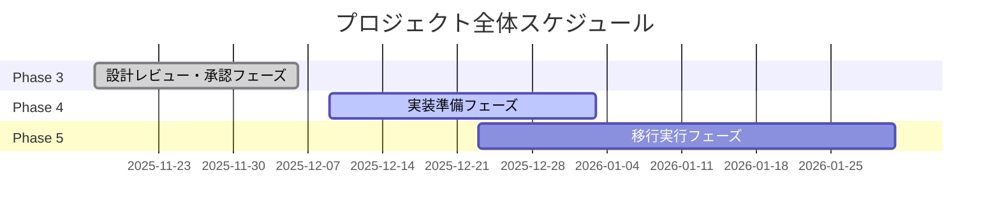
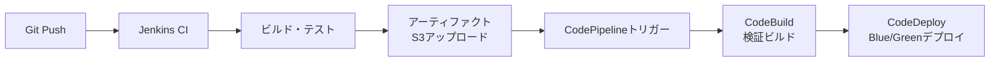

# 実装準備フェーズ計画書

## 1. 概要

本計画書は、EC2システム設計書の詳細設計フェーズ完了後、次のフェーズ（レビュー・承認フェーズおよび実装準備フェーズ）の進め方をまとめたものです。

**作成日**: 2025年11月17日
**対象プロジェクト**: AWS標準構成テンプレート（EC2版）
**目的**: Phase 3・4の作業計画を明確化し、実装準備を効率的に進める

## 2. 全体スケジュール



## 3. Phase 3: 設計レビュー・承認フェーズ

### 3.1 状況
- **担当**: チーム全体（自分では進められない）
- **期間**: 2025年11月下旬～12月上旬（Week 5）
- **作業内容**:
  - 内部レビュー（整合性確認、AWSベストプラクティス準拠）
  - 関係者レビュー（セキュリティ/運用/開発チーム）
  - 承認プロセス（Change Management）
  - 最終調整（レビューコメント反映）

### 3.2 対応方針
スケジュール通り待機し、チームレビュー完了後にPhase 4へ移行。

## 4. Phase 4: 実装準備フェーズ（先行実施）

### 4.1 目的
- 設計書の実現可能性を確認
- 実装中に得た気づきを詳細設計にフィードバック
- 移行実行フェーズのリスク低減

### 4.2 作業範囲
- AMIビルドパイプライン構築
- CI/CDパイプライン構築
- CloudFormationテンプレート作成
- テスト環境構築

## 5. AMIビルドパイプライン構築

### 5.1 EC2 Image Builder概要
```yaml
EC2 Image Builderの特徴:
- GUIベースの設定（マネジメントコンソール）
- 自動化されたAMI作成パイプライン
- コンポーネントベースのアーキテクチャ
- テスト・検証の自動化
- バージョン管理とライフサイクル管理

基本フロー:
1. レシピ作成（ベースAMI + コンポーネント）
2. パイプライン設定（トリガー + テスト）
3. ビルド実行
4. AMI配布
```

### 5.2 PoCアプローチ
```yaml
PoCステップ:
1. マネジメントコンソールで簡単なレシピ作成
   - ベース: Amazon Linux 2023
   - コンポーネント: Systems Manager Agent + CloudWatch Agent

2. 基本パイプライン構築
   - 手動トリガー
   - 最小限のテスト（起動テストのみ）

3. 実際のユースケース適用
   - CrowdStrikeインストール
   - Apache/Tomcat設定
   - Datadog Agent設定
```

### 5.3 期待される知見
- GUI操作の習得
- コンポーネント作成のノウハウ
- ビルド時間の把握
- コスト試算

## 6. CI/CDパイプライン構築

### 6.1 アーキテクチャ概要


### 6.2 Jenkins + AWS統合の折り合い
```yaml
Jenkins担当範囲:
- ソースコード管理・ビルド
- 既存のテスト資産実行
- アーティファクト作成・S3アップロード

AWS CodePipeline/CodeBuild担当範囲:
- インフラレベルのデプロイ自動化
- Blue/Greenデプロイメント管理
- クロスアカウントデプロイ対応

利点:
- Jenkins資産の有効活用
- AWSマネージドサービスの安定性
- 責任分担の明確化
```

### 6.3 具体的な統合方法
```yaml
Jenkinsジョブ設定:
  post {
    success {
      // S3にアーティファクトアップロード
      sh 'aws s3 cp artifacts/ s3://my-artifacts-bucket/ --recursive'
      
      // CodePipeline実行開始
      sh 'aws codepipeline start-pipeline-execution --name my-pipeline'
    }
  }

CodePipeline設定:
  Source:
    - Provider: S3
    - Bucket: my-artifacts-bucket
    - キー: artifacts.zip

  Build:
    - CodeBuildで最終検証

  Deploy:
    - CodeDeployでBlue/Greenデプロイ
```

## 7. 作業順序

### 7.1 Phase 4の作業順序
1. **AMIビルドパイプラインPoC**（1-2週間）
   - EC2 Image Builderの基本操作習得
   - シンプルなAMI作成テスト
   - 既存のゴールデンAMI作成プロセスとの比較

2. **CI/CDパイプライン構築**（2-3週間）
   - Jenkins + CodePipeline統合
   - Blue/Greenデプロイメントテスト
   - 既存資産（Ansible Playbook）の統合

3. **CloudFormationテンプレート作成**（並行実施）
   - 設計書に基づくIaC化
   - テスト環境構築

### 7.2 並行作業の考慮
- AMIビルドとCI/CDは並行して進める
- CloudFormationは設計書が固まり次第開始
- テスト環境は各コンポーネントの検証用に早期構築

## 8. 詳細設計へのフィードバック

### 8.1 フィードバック対象
実装中に得た気づきを設計書に反映：
- AMIビルド時間の現実的な見積もり
- CI/CDパイプラインのボトルネック
- 運用上の課題点
- コスト見積もりの調整

### 8.2 フィードバック方法
- PoC完了ごとに設計書更新
- チームレビュー時に共有
- Phase 3の最終調整に活用

## 9. リスクと対策

### 9.1 技術的リスク
- **EC2 Image Builder未経験**: PoCで習得
- **Jenkins + AWS統合の複雑さ**: 段階的な統合アプローチ

### 9.2 スケジュールリスク
- **Phase 3遅延**: 先行実施でリスク低減
- **技術習得時間**: PoC期間で吸収

### 9.3 対策
- 小規模PoCから開始
- 並行作業で効率化
- 定期的な進捗確認

## 10. 次のステップ

### 10.1 即時アクション
1. EC2 Image BuilderのPoC環境準備
2. Jenkins + CodePipeline統合の調査開始
3. CloudFormationテンプレートの設計書レビュー

### 10.2 1週間以内のマイルストーン
- AMIビルドPoC完了
- CI/CD統合方式の決定
- テスト環境の基本構築

### 10.3 連絡・報告
- 週次進捗報告
- 技術的課題の早期共有
- 設計書フィードバックの定期更新

---

## 改版履歴

| 版数 | 日付 | 改版内容 | 作成者 |
|------|------|----------|--------|
| 1.0 | 2025-11-17 | 初版作成 | - |
