# CloudWatch Logs Agent によるログ収集完全ガイド

## 目次

- [CloudWatch Logs Agent によるログ収集完全ガイド](#cloudwatch-logs-agent-によるログ収集完全ガイド)
  - [目次](#目次)
  - [1. 概要](#1-概要)
    - [1.1 CloudWatch Logs Agentの特徴](#11-cloudwatch-logs-agentの特徴)
    - [1.2 対象ログ](#12-対象ログ)
    - [1.3 DataDogとの比較](#13-datadogとの比較)
  - [2. ログ収集アーキテクチャ](#2-ログ収集アーキテクチャ)
    - [2.1 全体アーキテクチャ](#21-全体アーキテクチャ)
    - [2.2 ログフローの種類](#22-ログフローの種類)
    - [2.3 CloudWatch Agentのログ処理パイプライン](#23-cloudwatch-agentのログ処理パイプライン)
    - [2.4 ログ収集設定の構造](#24-ログ収集設定の構造)
    - [2.5 Amazon Linux 2023 ログ収集方式の選定](#25-amazon-linux-2023-ログ収集方式の選定)
      - [2.5.1 ログ収集方式の概要](#251-ログ収集方式の概要)
    - [2.6 CloudWatch Agent通信要件](#26-cloudwatch-agent通信要件)
  - [3. CloudWatch Logs Agent インストール](#3-cloudwatch-logs-agent-インストール)
    - [3.0 前提条件: Amazon Linux 2023ログ収集方式の選定](#30-前提条件-amazon-linux-2023ログ収集方式の選定)
      - [3.0.1 ログ収集方式の概要](#301-ログ収集方式の概要)
      - [3.0.2 方式B: rsyslog有効化手順（従来型運用の場合）](#302-方式b-rsyslog有効化手順従来型運用の場合)
      - [3.0.3 方式A/C: CloudWatch Agent journaldプラグイン設定（クラウドネイティブ）](#303-方式ac-cloudwatch-agent-journaldプラグイン設定クラウドネイティブ)
    - [3.1 インストールフロー](#31-インストールフロー)
    - [3.2 インストール手順](#32-インストール手順)
      - [3.2.1 Amazon Linux 2023の場合](#321-amazon-linux-2023の場合)
      - [3.2.2 必要なIAMロールとポリシーの作成](#322-必要なiamロールとポリシーの作成)
      - [3.2.3 EC2インスタンスへのインスタンスプロファイルのアタッチ](#323-ec2インスタンスへのインスタンスプロファイルのアタッチ)
      - [3.2.4 IAM権限の動作確認（EC2インスタンス内から）](#324-iam権限の動作確認ec2インスタンス内から)
  - [4. ログ収集設定](#4-ログ収集設定)
    - [4.1 設定ファイル構造](#41-設定ファイル構造)
    - [4.2 サンプル設定ファイル](#42-サンプル設定ファイル)
      - [4.2.0 journaldから直接収集（方式A/C: クラウドネイティブ）](#420-journaldから直接収集方式ac-クラウドネイティブ)
      - [4.2.1 ファイルベースログ収集（方式B: 従来型）](#421-ファイルベースログ収集方式b-従来型)
      - [4.2.2 標準出力ログ収集（journald経由）](#422-標準出力ログ収集journald経由)
      - [4.2.3 ハイブリッド構成（推奨）](#423-ハイブリッド構成推奨)
  - [5. ログ集約フロー](#5-ログ集約フロー)
    - [5.1 ファイルベースログの収集フロー](#51-ファイルベースログの収集フロー)
    - [5.2 バッファリングとバッチ送信](#52-バッファリングとバッチ送信)
    - [5.3 CloudWatch Logs階層構造](#53-cloudwatch-logs階層構造)
  - [6. 標準出力ログの収集方法](#6-標準出力ログの収集方法)
    - [6.1 標準出力ログアーキテクチャ](#61-標準出力ログアーキテクチャ)
    - [6.2 Apache標準出力設定](#62-apache標準出力設定)
      - [6.2.1 Apache設定ファイル修正](#621-apache設定ファイル修正)
      - [6.2.2 systemdサービス設定](#622-systemdサービス設定)
    - [6.3 CloudWatch Agent設定 (標準出力ログ)](#63-cloudwatch-agent設定-標準出力ログ)
      - [6.3.1 journaldからの収集設定（代替方法）](#631-journaldからの収集設定代替方法)
    - [6.4 標準出力ログフロー](#64-標準出力ログフロー)
  - [7. 運用管理](#7-運用管理)
    - [7.1 ログローテーション](#71-ログローテーション)
      - [7.1.1 ファイルベースログの場合](#711-ファイルベースログの場合)
      - [7.1.2 標準出力ログの場合](#712-標準出力ログの場合)
    - [7.2 監視とアラート](#72-監視とアラート)
    - [7.3 CloudWatch Logs Insights クエリ例](#73-cloudwatch-logs-insights-クエリ例)
    - [7.4 Agent状態監視](#74-agent状態監視)
  - [8. トラブルシューティング](#8-トラブルシューティング)
    - [8.1 Agent起動失敗](#81-agent起動失敗)
    - [8.2 ログが送信されない](#82-ログが送信されない)
    - [8.3 よくあるエラーと対処法](#83-よくあるエラーと対処法)
  - [9. ログ監視とアラート](#9-ログ監視とアラート)
    - [9.1 メトリクスフィルタの概要](#91-メトリクスフィルタの概要)
      - [9.1.1 メトリクスフィルタの仕組み](#911-メトリクスフィルタの仕組み)
      - [9.1.2 主要な機能](#912-主要な機能)
      - [9.1.3 ログ集約のポイント](#913-ログ集約のポイント)
    - [9.2 メトリクスフィルタの実装](#92-メトリクスフィルタの実装)
      - [9.2.1 基本的なフィルタパターン](#921-基本的なフィルタパターン)
      - [9.2.2 高度なフィルタパターン](#922-高度なフィルタパターン)
      - [9.2.3 メトリクスフィルタの確認](#923-メトリクスフィルタの確認)
    - [9.3 CloudWatch Alarmの設定](#93-cloudwatch-alarmの設定)
      - [9.3.1 基本的なアラーム設定](#931-基本的なアラーム設定)
      - [9.3.2 パラメータ詳細](#932-パラメータ詳細)
      - [9.3.3 高度なアラーム設定](#933-高度なアラーム設定)
      - [9.3.4 アラームの確認と管理](#934-アラームの確認と管理)
    - [9.4 実装例とパターン](#94-実装例とパターン)
      - [9.4.1 実装例: Aを含みBを含まないログの監視](#941-実装例-aを含みbを含まないログの監視)
      - [9.4.2 その他のパターン](#942-その他のパターン)
      - [9.4.3 CloudFormation/Sceptreでの実装](#943-cloudformationsceptreでの実装)
    - [9.5 コスト試算](#95-コスト試算)
      - [9.5.1 メトリクスフィルタとアラームのコスト](#951-メトリクスフィルタとアラームのコスト)
      - [9.5.2 コスト削減のヒント](#952-コスト削減のヒント)
      - [9.5.3 プロジェクト全体のコスト見積もり](#953-プロジェクト全体のコスト見積もり)
  - [10. まとめ](#10-まとめ)
    - [10.1 ログ収集方式の選定（推奨）](#101-ログ収集方式の選定推奨)
    - [10.2 ログ監視とアラートのまとめ](#102-ログ監視とアラートのまとめ)
    - [10.3 方式別推奨構成まとめ](#103-方式別推奨構成まとめ)
      - [方式B（短期）: journald + rsyslog](#方式b短期-journald--rsyslog)
      - [方式C（長期）: journald単体](#方式c長期-journald単体)
    - [10.4 コスト最適化](#104-コスト最適化)
    - [10.5 運用上の注意事項](#105-運用上の注意事項)
  - [11. 改版履歴](#11-改版履歴)

---

## 1. 概要

CloudWatch Logs Agentは、EC2インスタンス上のログファイルをAmazon CloudWatch Logsに送信するエージェントです。本ガイドでは、従来のファイルベースログと12-factor app準拠の標準出力ログの両方の収集方法を解説します。

### 1.1 CloudWatch Logs Agentの特徴

```yaml
AWS統合機能:
  - CloudWatch Logs (ログ収集・分析)
  - CloudWatch Metrics (メトリクス収集)
  - EC2統合 (インスタンスメタデータ自動付与)
  - IAM Role統合 (認証情報不要)

ログ収集機能:
  - ファイルベースログの tail 収集
  - journald からの直接収集
  - マルチラインログのサポート
  - タイムスタンプ自動検出
  - ログストリーム自動作成
```

### 1.2 対象ログ

本ガイドでは以下のログを収集対象とします:

```yaml
システムログ:
  - /var/log/messages (syslog) ※rsyslog有効化により作成
  - /var/log/secure (SSH/SSM認証ログ) ※rsyslog有効化により作成
  - /var/log/dnf.log (パッケージ管理ログ) ※Amazon Linux 2023

Apacheログ:
  - /var/log/httpd/access_log
  - /var/log/httpd/error_log

標準出力ログ:
  - stdout (Apache)
  - stderr (Tomcat)
```

**重要:** Amazon Linux 2023ではjournaldがデフォルトのログシステムです。従来の`/var/log/messages`, `/var/log/secure`などのファイルを作成するには、rsyslogを有効化する必要があります（セクション2.5参照）。

### 1.3 DataDogとの比較

```yaml
CloudWatch Logsの優位性:
  - AWS ネイティブ: 追加料金なし、IAMベースの認証
  - AWS統合: Lambda, S3, Kinesis等との統合が容易
  - コスト: 小規模環境では低コスト
  - 学習コスト: AWSエンジニアにとって習得が容易
  - セキュリティ: VPC内完結、インターネット通信不要（VPC Endpoint利用時）

DataDogの優位性:
  - 統合監視: ログ・メトリクス・トレースを1プラットフォームで管理
  - 高度な検索: フルテキスト検索、ファセット検索、複雑なクエリ
  - 可視化: カスタムダッシュボード、リアルタイムグラフ、ヒートマップ
  - アラート: 複雑な条件設定、異常検知、複数通知チャネル
  - ログパイプライン: ログの加工・パース・フィルタリング
  - インテグレーション: 400+の統合（Apache, MySQL, Redis等）

選定基準:
  - AWSエコシステム内完結 → CloudWatch Logs
  - 小規模環境・コスト重視 → CloudWatch Logs
  - 複雑な監視要件 → DataDog
  - マルチクラウド環境 → DataDog
  - 高度な分析・可視化 → DataDog
```

---

## 2. ログ収集アーキテクチャ

### 2.1 全体アーキテクチャ

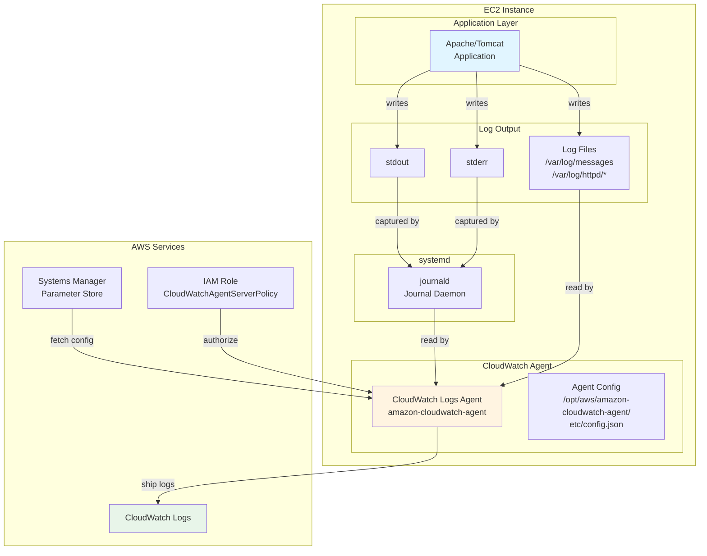

### 2.2 ログフローの種類

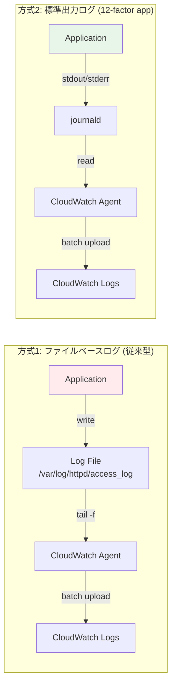

### 2.3 CloudWatch Agentのログ処理パイプライン

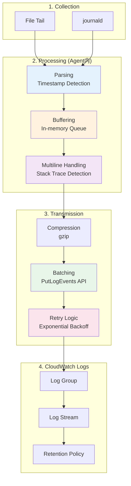

### 2.4 ログ収集設定の構造

```yaml
CloudWatch Agent設定階層:
  /opt/aws/amazon-cloudwatch-agent/
    ├── bin/
    │   └── amazon-cloudwatch-agent-ctl  # 制御スクリプト
    ├── etc/
    │   ├── config.json                  # メイン設定ファイル (ローカル)
    │   └── amazon-cloudwatch-agent.d/   # 追加設定ディレクトリ
    └── logs/
        └── amazon-cloudwatch-agent.log  # エージェントログ

  AWS Systems Manager:
    Parameter Store:
      - /cloudwatch-agent/config         # 設定ファイル (クラウド)

設定の読み込み優先順位:
  1. SSM Parameter Store (推奨) - 集中管理、バージョン管理
  2. ローカルファイル (/opt/aws/.../etc/config.json) - 単体環境

設定ファイル構造:
  config.json:
    ├── agent                            # エージェント全体設定
    │   ├── metrics_collection_interval  # メトリクス収集間隔
    │   ├── region                       # AWSリージョン
    │   └── logfile                      # エージェントログ出力先
    ├── logs                             # ログ収集設定
    │   └── logs_collected
    │       ├── files                    # ファイルベースログ
    │       │   └── collect_list[]
    │       │       ├── file_path        # ログファイルパス
    │       │       ├── log_group_name   # CloudWatch Logsグループ名
    │       │       ├── log_stream_name  # ストリーム名テンプレート
    │       │       └── timestamp_format # タイムスタンプ形式
    │       └── journald                 # journaldログ
    │           ├── log_stream_name
    │           ├── unit_whitelist       # 収集対象ユニット
    │           └── unit_blacklist       # 除外ユニット
    └── metrics                          # メトリクス収集設定
        └── metrics_collected
```

### 2.5 Amazon Linux 2023 ログ収集方式の選定

**🔴 重要:** Amazon Linux 2023ではjournaldがデフォルトのログシステムとなり、従来の`/var/log/messages`, `/var/log/secure`などのファイルは作成されません。プロジェクトの要件に応じて、以下の3つの方式から選択する必要があります。

#### 2.5.1 ログ収集方式の概要

```yaml
方式A: journald単体 (CloudWatch Agent journald統合):
  メリット:
    - ディスクI/O・使用量最小
    - ログローテーション不要
    - 構造化ログ (JSON) のメタデータ保持
    - CloudWatch統合でリッチなログ属性
  デメリット:
    - 従来の grep /var/log/messages 不可
    - journalctl コマンド習得が必要
    - EC2インスタンス内でのログ確認が困難
  推奨用途:
    - 新規構築プロジェクト
    - コンテナ化前提のシステム
    - CloudWatch完全移行環境

方式B: journald + rsyslog (ハイブリッド):
  メリット:
    - 従来の運用手順を維持可能
    - /var/log/* ファイルでログ確認可能
    - 既存スクリプト・ツールが動作
  デメリット:
    - ディスク使用量増加 (ログ二重管理)
    - ログローテーション設定が必要
    - rsyslog設定・保守が必要
  推奨用途:
    - 既存システムの移行
    - 従来型運用の継続が必須
    - ログファイル直接確認が頻繁

方式C: アプリケーションログstdout化 + journald単体 (AWS推奨):
  メリット:
    - 12-factor app準拠
    - コンテナ化対応容易
    - 最もコスト効率が良い
    - ログ管理の一元化
  デメリット:
    - アプリケーション設定変更が必要
    - Apache/Tomcat設定の変更
    - 移行期間中の二重管理
  推奨用途:
    - 新規開発アプリケーション
    - 将来のコンテナ化を見据えた設計
    - モダンなログ管理を目指す環境

CloudWatchにおける推奨:
  - 新規構築: 方式C (stdout化 + journald)
  - 移行中: 方式B (ハイブリッド) → 段階的に方式C
  - 保守的運用: 方式B (ハイブリッド)
```

**詳細な比較は「EC2システム設計書兼詳細設計書.md」のセクション8.3.1を参照**

### 2.6 CloudWatch Agent通信要件

```yaml
ネットワーク要件:
  送信先: CloudWatch Logs API Endpoint
    - ホスト: logs.<region>.amazonaws.com
    - プロトコル: HTTPS
    - ポート: 443
    - 必須通信: Outbound のみ

認証:
  - IAM Role: EC2インスタンスにアタッチ
  - 必須ポリシー: CloudWatchAgentServerPolicy (AWS管理ポリシー)
  - 権限:
      - logs:CreateLogGroup
      - logs:CreateLogStream
      - logs:PutLogEvents
      - logs:DescribeLogStreams

セキュリティグループ設定:
  Outbound Rule:
    - Type: HTTPS
    - Protocol: TCP
    - Port: 443
    - Destination: 0.0.0.0/0 (または CloudWatch Logs Prefix List)
    - Description: CloudWatch Agent to CloudWatch Logs

VPC Endpoint経由の通信 (推奨):
  VPC Endpoint作成:
    - Service Name: com.amazonaws.<region>.logs
    - Type: Interface
    - Subnet: Private Subnet
    - Security Group: VPC Endpoint用SG (Port 443 Inbound)
  
  メリット:
    - インターネットゲートウェイ不要
    - データ転送料金削減
    - セキュリティ向上 (VPC内完結)
    - 帯域制限なし

Proxy経由の通信:
  環境変数設定:
    export HTTPS_PROXY=http://proxy.example.com:3128
    export NO_PROXY=169.254.169.254  # EC2 IMDS
  
  /opt/aws/amazon-cloudwatch-agent/etc/common-config.toml:
    [proxy]
      http_proxy = "http://proxy.example.com:3128"
      https_proxy = "http://proxy.example.com:3128"
      no_proxy = "169.254.169.254"
```

---

## 3. CloudWatch Logs Agent インストール

### 3.0 前提条件: Amazon Linux 2023ログ収集方式の選定

**🔴 重要:** Amazon Linux 2023ではjournaldがデフォルトのログシステムとなり、従来の`/var/log/messages`, `/var/log/secure`などのファイルは作成されません。プロジェクトの要件に応じて、以下の3つの方式から選択する必要があります。

#### 3.0.1 ログ収集方式の概要

**方式A: journald単体（CloudWatch Agent journaldプラグイン）**
- journaldから直接CloudWatch Logsに送信
- ディスクI/O・使用量最小、ログローテーション不要
- CloudWatch Agent journaldプラグイン設定が必要
- 従来の`grep /var/log/messages`が使えない

**方式B: journald + rsyslog（ハイブリッド）**
- journald → rsyslog → テキストファイル → CloudWatch Agent
- 従来の運用手順を維持可能
- ディスク使用量増加（ログ二重管理）
- ログローテーション設定が必要

**方式C: アプリケーションログstdout化 + journald単体（AWS推奨）**
- 全ログをstdout/stderr → journald → CloudWatch Agent
- 12-factor app準拠、コンテナ化対応容易
- アプリケーション設定変更が必要
- 最もコスト効率が良い

**詳細な比較は「EC2システム設計書兼詳細設計書.md」のセクション8.3.1を参照**

---

#### 3.0.2 方式B: rsyslog有効化手順（従来型運用の場合）

方式Bを選択する場合は、以下の手順でrsyslogを有効化します。

```bash
#!/bin/bash
# Amazon Linux 2023でrsyslogを有効化

# 1. rsyslogインストール（通常はプリインストール済み）
sudo dnf install -y rsyslog

# 2. rsyslog設定確認
cat /etc/rsyslog.conf

# 3. journaldからrsyslogへの転送設定
# /etc/rsyslog.conf に以下が含まれていることを確認
# module(load="imjournal" StateFile="imjournal.state")

# 4. rsyslogサービス有効化と起動
sudo systemctl enable rsyslog
sudo systemctl start rsyslog

# 5. サービス状態確認
sudo systemctl status rsyslog

# 6. ログファイルが作成されることを確認
ls -la /var/log/messages
ls -la /var/log/secure

# 7. journald設定の確認（rsyslogへ転送する設定）
cat /etc/systemd/journald.conf
# ForwardToSyslog=yes が設定されていることを確認
# デフォルトでは有効
```

**rsyslog設定ファイル (`/etc/rsyslog.conf`):**

```bash
# モジュールロード
module(load="imjournal" StateFile="imjournal.state")
module(load="imuxsock")
module(load="imklog")

# ログファイル出力ルール
*.info;mail.none;authpriv.none;cron.none                /var/log/messages
authpriv.*                                              /var/log/secure
mail.*                                                  -/var/log/maillog
cron.*                                                  /var/log/cron
*.emerg                                                 :omusrmsg:*
uucp,news.crit                                          /var/log/spooler
local7.*                                                /var/log/boot.log
```

**ログファイル確認:**

```bash
# システムログ確認
sudo tail -f /var/log/messages

# SSH/SSM認証ログ確認
sudo tail -f /var/log/secure

# パッケージ管理ログ確認（Amazon Linux 2023ではdnf）
sudo tail -f /var/log/dnf.log
```

**Note:**
- rsyslog有効化により、従来の`/var/log/messages`, `/var/log/secure`などが作成されます
- journaldは引き続き動作し、rsyslogと並行してログを管理します（ログ二重管理）
- SSHおよびSSM Session Managerの認証ログは`/var/log/secure`に記録されます
- パッケージ管理ログは`/var/log/yum.log`（AL2）から`/var/log/dnf.log`（AL2023）に変更されました

---

#### 3.0.3 方式A/C: CloudWatch Agent journaldプラグイン設定（クラウドネイティブ）

方式AまたはCを選択する場合は、rsyslog不要です。CloudWatch Agent journaldプラグインを使用します。

```json
{
  "logs": {
    "logs_collected": {
      "journald": {
        "log_stream_name": "{instance_id}",
        "unit_whitelist": ["sshd.service", "systemd.service", "dnf.service"],
        "unit_blacklist": []
      }
    }
  }
}
```

**journalctlコマンドでログ確認:**

```bash
# 全ログ表示
sudo journalctl

# SSHログのみ表示
sudo journalctl -u sshd

# 最新100行表示
sudo journalctl -n 100

# リアルタイム表示
sudo journalctl -f

# 時間範囲指定
sudo journalctl --since "2025-11-18 10:00:00" --until "2025-11-18 11:00:00"

# 優先度フィルタ（エラーのみ）
sudo journalctl -p err

# JSON形式で出力
sudo journalctl -o json-pretty
```

**Note:**
- journaldプラグインを使用する場合、rsyslogは不要（ディスク使用量削減）
- `journalctl`コマンドの習得が必要
- CloudWatch Logsにも送信されるため、AWSコンソールでも確認可能

---

### 3.1 インストールフロー

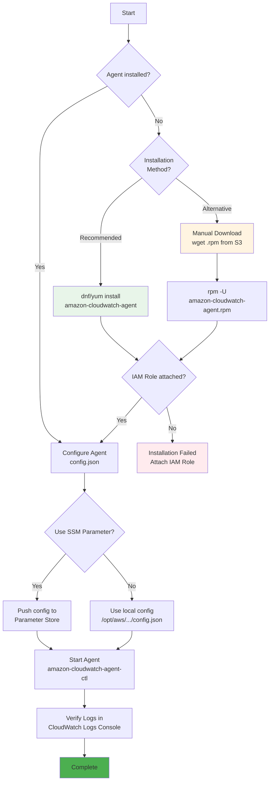

### 3.2 インストール手順

#### 3.2.1 Amazon Linux 2023の場合

**推奨方法: yumパッケージマネージャ経由でインストール**

```bash
#!/bin/bash
# CloudWatch Logs Agent インストールスクリプト (推奨)

# 1. yum経由でインストール (Amazon Linux 2023/Amazon Linux 2)
sudo yum install -y amazon-cloudwatch-agent

# 2. インストール確認
rpm -qa | grep amazon-cloudwatch-agent

# 3. Agentディレクトリ確認
ls -la /opt/aws/amazon-cloudwatch-agent/
```

**代替方法: 手動ダウンロード＆インストール**

```bash
#!/bin/bash
# 手動インストール方法 (インターネット接続が制限されている環境など)

# 1. Agentパッケージのダウンロード
wget https://amazoncloudwatch-agent.s3.amazonaws.com/amazon_linux/amd64/latest/amazon-cloudwatch-agent.rpm

# または、リージョン固有のエンドポイント (東京リージョンの場合)
# wget https://amazoncloudwatch-agent-ap-northeast-1.s3.ap-northeast-1.amazonaws.com/amazon_linux/amd64/latest/amazon-cloudwatch-agent.rpm

# 2. パッケージのインストール
sudo rpm -U ./amazon-cloudwatch-agent.rpm

# 3. インストール確認
rpm -qa | grep amazon-cloudwatch-agent

# 4. Agentディレクトリ確認
ls -la /opt/aws/amazon-cloudwatch-agent/
```

**Note**: 
- Amazon Linux 2023/Amazon Linux 2では、`yum install`が最も簡単な方法です
- IAMロールに`CloudWatchAgentServerPolicy`がアタッチされている必要があります
- ARM64アーキテクチャの場合は、`arm64`パスを使用してください

#### 3.2.2 必要なIAMロールとポリシーの作成

CloudWatch Logs Agentが動作するために必要なIAMリソースは、Sceptre/CloudFormationテンプレートで作成できます。

**デプロイ済みのIAMリソース:**
```yaml
IAMポリシー:
  名前: poc-cloudwatch-agent-policy
  ARN: arn:aws:iam::910230630316:policy/poc-cloudwatch-agent-policy
  
IAMロール:
  名前: poc-ec2-cloudwatch-agent-role
  ARN: arn:aws:iam::910230630316:role/poc-ec2-cloudwatch-agent-role
  
インスタンスプロファイル:
  名前: poc-ec2-cloudwatch-agent-profile
  ARN: arn:aws:iam::910230630316:instance-profile/poc-ec2-cloudwatch-agent-profile
```

**IAMポリシーの内容:**
```json
{
  "Version": "2012-10-17",
  "Statement": [
    {
      "Sid": "CloudWatchLogsAccess",
      "Effect": "Allow",
      "Action": [
        "logs:CreateLogGroup",
        "logs:CreateLogStream",
        "logs:PutLogEvents",
        "logs:DescribeLogStreams",
        "logs:DescribeLogGroups"
      ],
      "Resource": [
        "arn:aws:logs:*:*:log-group:/aws/ec2/*"
      ]
    },
    {
      "Sid": "SSMParameterAccess",
      "Effect": "Allow",
      "Action": [
        "ssm:GetParameter",
        "ssm:GetParameters",
        "ssm:PutParameter"
      ],
      "Resource": [
        "arn:aws:ssm:*:*:parameter/AmazonCloudWatch-*"
      ]
    },
    {
      "Sid": "EC2MetadataAccess",
      "Effect": "Allow",
      "Action": [
        "ec2:DescribeTags",
        "ec2:DescribeInstances",
        "ec2:DescribeVolumes"
      ],
      "Resource": "*"
    }
  ]
}
```

**Note**: IAMリソースの作成方法は `sceptre/README.md` を参照してください。

#### 3.2.3 EC2インスタンスへのインスタンスプロファイルのアタッチ

**インスタンスプロファイルとは:**

インスタンスプロファイルは、EC2インスタンスにIAMロールを関連付けるためのコンテナです。

```
IAMロール → インスタンスプロファイル → EC2インスタンス
```

**なぜ必要なのか:**
- EC2インスタンスは直接IAMロールをアタッチできません
- インスタンスプロファイルが「IAMロール」と「EC2インスタンス」の橋渡しをします
- EC2インスタンス内のアプリケーション（CloudWatch Agent等）は、インスタンスプロファイル経由でIAMロールの権限を使用できます

**動作の流れ:**
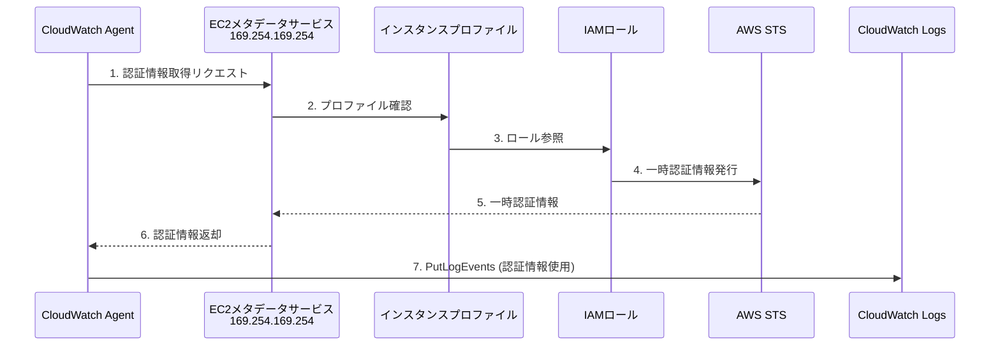

CloudWatch Agentを使用するEC2インスタンスには、作成したインスタンスプロファイルをアタッチする必要があります。

**方法1: 新規EC2インスタンス起動時にアタッチ**

```bash
# AWS CLI経由
aws ec2 run-instances \
  --image-id ami-0d52744d6551d851e \
  --instance-type t3.micro \
  --iam-instance-profile Name=poc-ec2-cloudwatch-agent-profile \
  --subnet-id subnet-xxxxxxxxx \
  --security-group-ids sg-xxxxxxxxx \
  --tag-specifications 'ResourceType=instance,Tags=[{Key=Name,Value=cloudwatch-agent-test}]'
```

**方法2: 既存EC2インスタンスにアタッチ**

```bash
# インスタンスプロファイルを関連付け
aws ec2 associate-iam-instance-profile \
  --instance-id i-1234567890abcdef0 \
  --iam-instance-profile Name=poc-ec2-cloudwatch-agent-profile

# アタッチ確認
aws ec2 describe-iam-instance-profile-associations \
  --filters "Name=instance-id,Values=i-1234567890abcdef0"
```

**方法3: CloudFormationテンプレートで指定**

```yaml
Resources:
  MyEC2Instance:
    Type: AWS::EC2::Instance
    Properties:
      ImageId: ami-0d52744d6551d851e
      InstanceType: t3.micro
      IamInstanceProfile: !ImportValue poc-ec2-cloudwatch-agent-profile-name
      SubnetId: !Ref MySubnet
      SecurityGroupIds:
        - !Ref MySecurityGroup
      Tags:
        - Key: Name
          Value: cloudwatch-agent-test
```

**アタッチ確認方法:**

```bash
# EC2コンソールで確認
# または AWS CLI
aws ec2 describe-instances \
  --instance-ids i-1234567890abcdef0 \
  --query 'Reservations[0].Instances[0].IamInstanceProfile'

# 出力例:
# {
#     "Arn": "arn:aws:iam::910230630316:instance-profile/poc-ec2-cloudwatch-agent-profile",
#     "Id": "AIPXXXXXXXXXXXXXXXXXX"
# }
```

#### 3.2.4 IAM権限の動作確認（EC2インスタンス内から）

CloudWatch Agentのインストール前に、EC2インスタンスがIAMロール経由でAWS APIにアクセスできることを確認します。

**IMDSv2（Instance Metadata Service Version 2）を使用した確認:**

```bash
# ステップ1: セッショントークンを取得（6時間有効）
TOKEN=$(curl -X PUT "http://169.254.169.254/latest/api/token" \
  -H "X-aws-ec2-metadata-token-ttl-seconds: 21600")

# ステップ2: インスタンスプロファイル情報を確認
curl -H "X-aws-ec2-metadata-token: $TOKEN" \
  http://169.254.169.254/latest/meta-data/iam/info

# 出力例:
# {
#   "Code" : "Success",
#   "LastUpdated" : "2025-11-18T02:09:12Z",
#   "InstanceProfileArn" : "arn:aws:iam::910230630316:instance-profile/poc-poc-ec2-ec2-instance-profile",
#   "InstanceProfileId" : "AIPA..."
# }

# ステップ3: 一時認証情報を取得
curl -H "X-aws-ec2-metadata-token: $TOKEN" \
  http://169.254.169.254/latest/meta-data/iam/security-credentials/poc-poc-ec2-ec2-role

# 出力例:
# {
#   "Code" : "Success",
#   "LastUpdated" : "2025-11-18T02:09:12Z",
#   "Type" : "AWS-HMAC",
#   "AccessKeyId" : "ASIA...",
#   "SecretAccessKey" : "...",
#   "Token" : "IQoJb3JpZ2luX2VjE...",
#   "Expiration" : "2025-11-18T08:22:03Z"
# }

# ステップ4: CloudWatch Logs APIにアクセスできるか確認
aws logs describe-log-groups --region ap-northeast-1

# 正常な場合の出力例:
# {
#     "logGroups": [...]
# }

# エラーの場合:
# An error occurred (AccessDeniedException) when calling the DescribeLogGroups operation: ...
```

**IMDSv1とIMDSv2の違い:**

```yaml
IMDSv1 (旧方式):
  方式: 単純なHTTP GET
  コマンド: curl http://169.254.169.254/latest/meta-data/...
  セキュリティ: SSRF攻撃のリスクあり
  
IMDSv2 (推奨):
  方式: セッショントークンベース
  手順:
    1. PUT /latest/api/token でトークン取得
    2. トークンをヘッダーに含めてメタデータ取得
  セキュリティ: SSRF攻撃への耐性が向上
  デフォルト: Amazon Linux 2023では必須
```

**Note**: 
- Amazon Linux 2023ではIMDSv2がデフォルトで有効です
- セッショントークンのTTL（有効期限）は最大6時間（21600秒）
- トークンは環境変数に保存して再利用可能です

---

## 4. ログ収集設定

### 4.1 設定ファイル構造

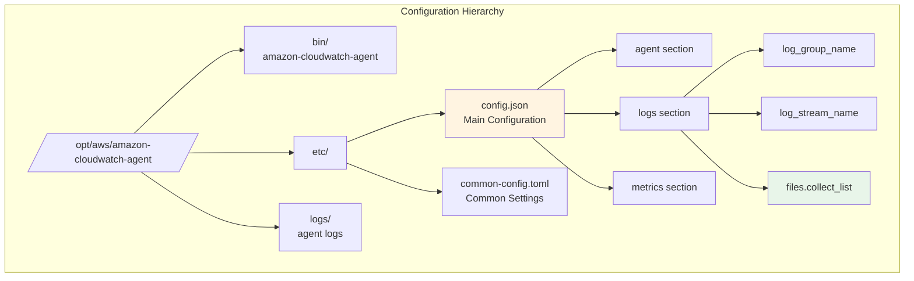

### 4.2 サンプル設定ファイル

#### 4.2.0 journaldから直接収集（方式A/C: クラウドネイティブ）

journaldから直接CloudWatch Logsに送信する設定です。rsyslog不要でディスクI/O最小化。

```json
{
  "agent": {
    "metrics_collection_interval": 60,
    "run_as_user": "cwagent"
  },
  "logs": {
    "logs_collected": {
      "journald": {
        "log_group_name": "/aws/ec2/poc/journald",
        "log_stream_name": "{instance_id}",
        "unit_whitelist": [
          "sshd.service",
          "systemd.service", 
          "httpd.service",
          "tomcat.service"
        ]
      }
    }
  }
}
```

**詳細設定（フィルタリング）:**

```json
{
  "logs": {
    "logs_collected": {
      "journald": {
        "log_group_name": "/aws/ec2/poc/system",
        "log_stream_name": "{instance_id}/journald",
        "unit_whitelist": ["sshd.service", "systemd.service"],
        "priority_whitelist": ["err", "warning", "notice", "info"],
        "max_message_length": 65536
      }
    }
  }
}
```

**設定ファイルパス:** `/opt/aws/amazon-cloudwatch-agent/etc/config.json`

**Note:**
- `unit_whitelist`: 特定のsystemdユニットのみ収集（指定しない場合は全ユニット）
- `unit_blacklist`: 除外するsystemdユニット
- `priority_whitelist`: ログレベルフィルタ（emerg, alert, crit, err, warning, notice, info, debug）
- SSH/SSM認証ログは `sshd.service` で収集
- rsyslog不要、ログローテーション不要

---

#### 4.2.1 ファイルベースログ収集（方式B: 従来型）

ログファイルを直接監視してCloudWatch Logsに送信する設定です。

```json
{
  "agent": {
    "metrics_collection_interval": 60,
    "run_as_user": "cwagent"
  },
  "logs": {
    "logs_collected": {
      "files": {
        "collect_list": [
          {
            "file_path": "/var/log/httpd/access_log",
            "log_group_name": "/aws/ec2/poc/apache",
            "log_stream_name": "{instance_id}/access",
            "timezone": "Local"
          },
          {
            "file_path": "/var/log/httpd/error_log",
            "log_group_name": "/aws/ec2/poc/apache",
            "log_stream_name": "{instance_id}/error",
            "timezone": "Local"
          },
          {
            "file_path": "/var/log/amazon/ssm/amazon-ssm-agent.log",
            "log_group_name": "/aws/ec2/poc/system",
            "log_stream_name": "{instance_id}/ssm-agent",
            "timezone": "Local"
          },
          {
            "file_path": "/var/log/amazon/ssm/errors.log",
            "log_group_name": "/aws/ec2/poc/system",
            "log_stream_name": "{instance_id}/ssm-errors",
            "timezone": "Local"
          }
        ]
      }
    }
  }
}
```

**設定ファイルパス:** `/opt/aws/amazon-cloudwatch-agent/etc/config.json`

**Note:**
- `/var/log/secure`: SSH/SSM Session Manager認証ログ
- `/var/log/dnf.log`: パッケージ管理ログ（Amazon Linux 2023）
- rsyslog有効化により、これらのファイルが作成されます

#### 4.2.2 標準出力ログ収集（journald経由）

アプリケーションの標準出力/標準エラー出力をjournaldから収集する設定です。

**前提条件:**
1. Apacheがstdout/stderrにログを出力する設定
2. systemdがjournaldにログをキャプチャする設定
3. rsyslogがjournaldからファイルに転送する設定

```json
{
  "agent": {
    "metrics_collection_interval": 60,
    "run_as_user": "cwagent"
  },
  "logs": {
    "logs_collected": {
      "files": {
        "collect_list": [
          {
            "file_path": "/var/log/messages",
            "log_group_name": "/aws/ec2/poc/system",
            "log_stream_name": "{instance_id}/messages",
            "timezone": "Local"
          },
          {
            "file_path": "/var/log/httpd-stdout.log",
            "log_group_name": "/aws/ec2/poc/httpd/stdout",
            "log_stream_name": "{instance_id}",
            "timezone": "Local"
          },
          {
            "file_path": "/var/log/tomcat-stdout.log",
            "log_group_name": "/aws/ec2/poc/tomcat/stdout",
            "log_stream_name": "{instance_id}",
            "timezone": "Local"
          }
        ]
      }
    }
  }
}
```

**設定ファイルパス:** `/opt/aws/amazon-cloudwatch-agent/etc/config.json`

**必要な追加設定:**

1. **Apache設定変更** (`/etc/httpd/conf/httpd.conf`):
```apache
# ファイル出力を無効化
# ErrorLog "logs/error_log"
# CustomLog "logs/access_log" combined

# 標準出力へリダイレクト
ErrorLog "|/bin/cat"
CustomLog "|/bin/cat" combined
```

2. **systemd override設定** (`/etc/systemd/system/httpd.service.d/override.conf`):
```ini
[Service]
StandardOutput=journal
StandardError=journal
SyslogIdentifier=httpd
```

3. **rsyslog転送設定** (`/etc/rsyslog.d/httpd-journal.conf`):
```
# httpd journaldログをファイルに転送
if $programname == 'httpd' then /var/log/httpd-stdout.log
& stop
```

4. **設定適用**:
```bash
# systemd設定の再読み込み
sudo systemctl daemon-reload

# rsyslog再起動
sudo systemctl restart rsyslog

# Apache再起動
sudo systemctl restart httpd

# ログファイル作成確認
sudo touch /var/log/httpd-stdout.log
sudo chmod 644 /var/log/httpd-stdout.log
```

#### 4.2.3 ハイブリッド構成（推奨）

ファイルベースログと標準出力ログの両方を収集する設定です。

```json
#### 4.2.3 ハイブリッド構成（推奨）

ファイルベースログと標準出力ログの両方を収集する設定です。

```json
{
  "agent": {
    "metrics_collection_interval": 60,
    "run_as_user": "cwagent"
  },
  "logs": {
    "logs_collected": {
      "files": {
        "collect_list": [
          {
            "file_path": "/var/log/messages",
            "log_group_name": "/aws/ec2/poc/system",
            "log_stream_name": "{instance_id}/messages",
            "timezone": "Local"
          },
          {
            "file_path": "/var/log/secure",
            "log_group_name": "/aws/ec2/poc/system",
            "log_stream_name": "{instance_id}/secure",
            "timezone": "Local"
          },
          {
            "file_path": "/var/log/dnf.log",
            "log_group_name": "/aws/ec2/poc/system",
            "log_stream_name": "{instance_id}/dnf",
            "timezone": "Local"
          },
          {
            "file_path": "/var/log/httpd/access_log",
            "log_group_name": "/aws/ec2/poc/apache/access",
            "log_stream_name": "{instance_id}",
            "timezone": "Local"
          },
          {
            "file_path": "/var/log/httpd/error_log",
            "log_group_name": "/aws/ec2/poc/apache/error",
            "log_stream_name": "{instance_id}",
            "timezone": "Local"
          },
          {
            "file_path": "/var/log/httpd-stdout.log",
            "log_group_name": "/aws/ec2/poc/httpd/stdout",
            "log_stream_name": "{instance_id}",
            "timezone": "Local"
          }
        ]
      }
    }
  }
}
```

**Note:** 
- ファイルベースログは既存システムで動作実績のある方式
- 標準出力ログは12-factor app準拠で将来的な推奨方式
- ハイブリッド構成で段階的な移行が可能
- `/var/log/secure`: SSH/SSM認証ログを含む
- `/var/log/dnf.log`: パッケージ管理ログ（Amazon Linux 2023）
```

**Note:** 
- ファイルベースログは既存システムで動作実績のある方式
- 標準出力ログは12-factor app準拠で将来的な推奨方式
- ハイブリッド構成で段階的な移行が可能

### 4.3 設定ファイルの配置と起動

```bash
#!/bin/bash
# CloudWatch Agent 設定と起動

# 1. 設定ファイルを配置
sudo cp config.json /opt/aws/amazon-cloudwatch-agent/etc/config.json

# 2. 設定の検証
sudo /opt/aws/amazon-cloudwatch-agent/bin/amazon-cloudwatch-agent-ctl \
    -a fetch-config \
    -m ec2 \
    -c file:/opt/aws/amazon-cloudwatch-agent/etc/config.json \
    -s

# 3. Agent状態確認
sudo /opt/aws/amazon-cloudwatch-agent/bin/amazon-cloudwatch-agent-ctl \
    -a status \
    -m ec2

# 4. systemdサービスの自動起動を有効化
sudo systemctl enable amazon-cloudwatch-agent

# 5. systemdサービス確認
sudo systemctl status amazon-cloudwatch-agent
```

---

## 5. ログ集約フロー

### 5.1 ファイルベースログの収集フロー

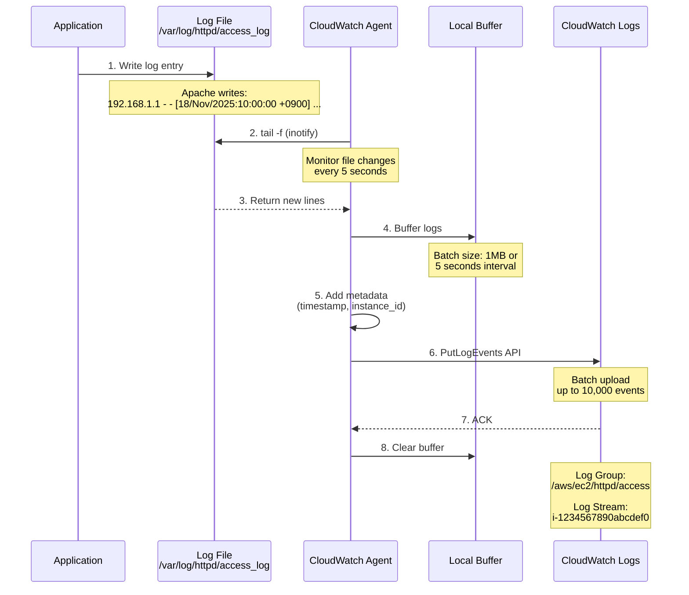

### 5.2 バッファリングとバッチ送信

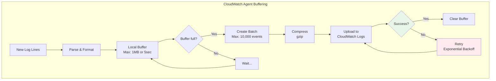

### 5.3 CloudWatch Logs階層構造

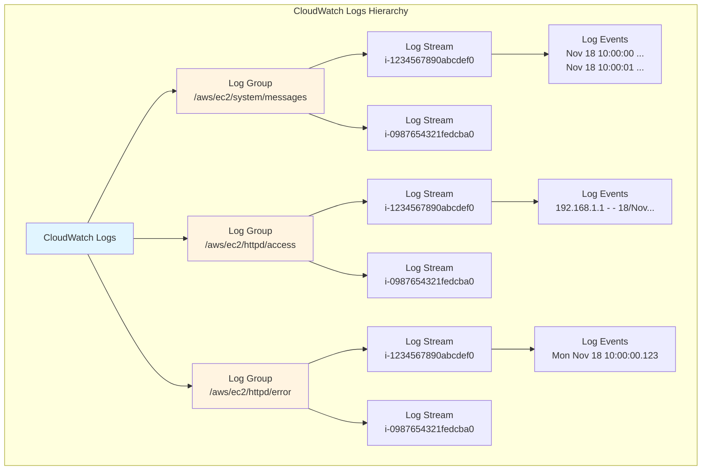

---

## 6. 標準出力ログの収集方法

### 6.1 標準出力ログアーキテクチャ

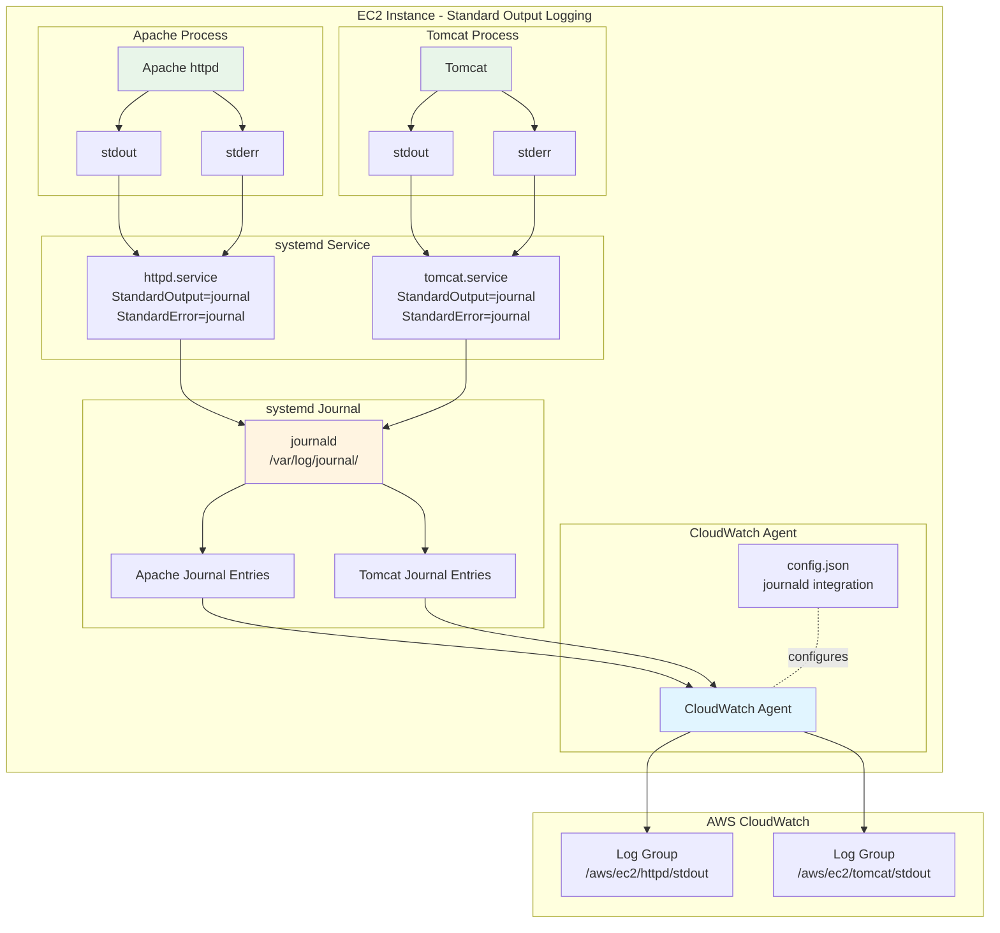

### 6.2 Apache標準出力設定

#### 6.2.1 Apache設定ファイル修正

```apache
# /etc/httpd/conf/httpd.conf

# 従来のファイル出力を無効化
# ErrorLog "logs/error_log"
# CustomLog "logs/access_log" combined

# 標準出力へリダイレクト
ErrorLog "|/bin/cat"
CustomLog "|/bin/cat" combined
```

#### 6.2.2 systemdサービス設定

```ini
# /etc/systemd/system/httpd.service.d/override.conf

[Service]
StandardOutput=journal
StandardError=journal

# journald設定
SyslogIdentifier=httpd
SyslogFacility=daemon
SyslogLevel=info
```

```bash
# systemd設定の適用
sudo systemctl daemon-reload
sudo systemctl restart httpd

# journald出力確認
sudo journalctl -u httpd -f
```

### 6.3 CloudWatch Agent設定 (標準出力ログ)

```json
{
  "agent": {
    "metrics_collection_interval": 60,
    "run_as_user": "cwagent"
  },
  "logs": {
    "logs_collected": {
      "files": {
        "collect_list": [
          {
            "file_path": "/var/log/messages",
            "log_group_name": "/aws/ec2/system/messages",
            "log_stream_name": "{instance_id}",
            "retention_in_days": 30
          }
        ]
      }
    },
    "log_stream_name": "{instance_id}"
  }
}
```

**Note**: CloudWatch Agentの標準的な設定では、journaldからの直接収集は`journald`プラグインを使用します。

#### 6.3.1 journaldからの収集設定（代替方法）

```bash
# journaldログをファイルとして出力し、CloudWatch Agentで収集
sudo journalctl -u httpd -o cat -f > /var/log/httpd-stdout.log &

# または、rsyslogで転送
# /etc/rsyslog.d/httpd-journal.conf
if $programname == 'httpd' then /var/log/httpd-stdout.log
& stop
```

```json
{
  "logs": {
    "logs_collected": {
      "files": {
        "collect_list": [
          {
            "file_path": "/var/log/httpd-stdout.log",
            "log_group_name": "/aws/ec2/httpd/stdout",
            "log_stream_name": "{instance_id}"
          }
        ]
      }
    }
  }
}
```

### 6.4 標準出力ログフロー

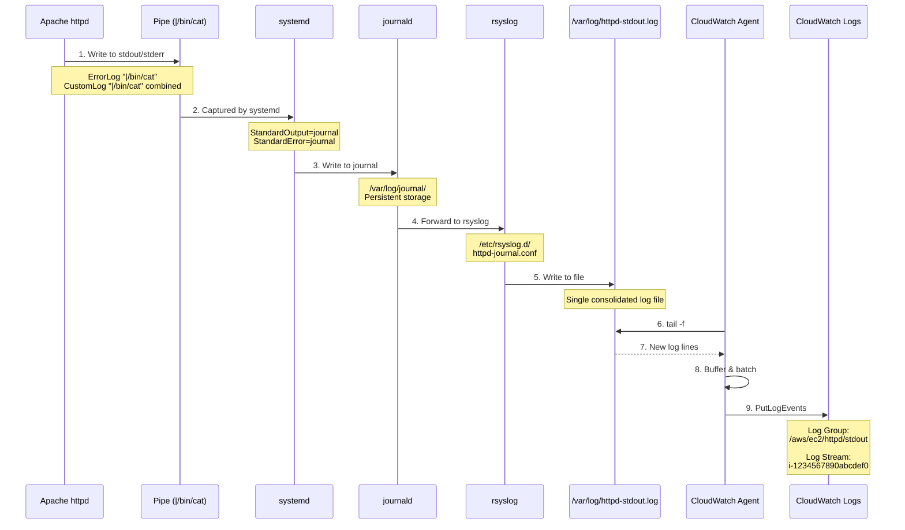

---

## 7. 運用管理

### 7.1 ログローテーション

#### 7.1.1 ファイルベースログの場合

```bash
# /etc/logrotate.d/httpd
/var/log/httpd/*log {
    daily
    rotate 30
    missingok
    notifempty
    sharedscripts
    delaycompress
    postrotate
        /bin/systemctl reload httpd.service > /dev/null 2>/dev/null || true
    endscript
}
```

#### 7.1.2 標準出力ログの場合

```bash
# journaldの自動クリーンアップ設定
# /etc/systemd/journald.conf

[Journal]
SystemMaxUse=1G
SystemMaxFileSize=100M
MaxRetentionSec=7day
```

### 7.2 監視とアラート

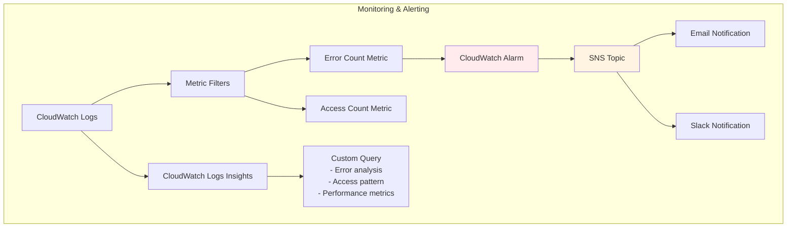

### 7.3 CloudWatch Logs Insights クエリ例

```sql
-- Apache access_logからステータスコード500のエラー抽出
fields @timestamp, @message
| filter @message like /HTTP\/1\.[01]" 5/
| sort @timestamp desc
| limit 100

-- error_logからERRORレベルのログ抽出
fields @timestamp, @message
| filter @message like /\[error\]/
| stats count() by bin(5m)

-- /var/log/messagesからec2-userログイン検知
fields @timestamp, @message
| filter @message like /session opened for user ec2-user/
| sort @timestamp desc
```

### 7.4 Agent状態監視

```bash
#!/bin/bash
# CloudWatch Agent監視スクリプト

# Agent状態確認
if ! systemctl is-active --quiet amazon-cloudwatch-agent; then
    echo "ERROR: CloudWatch Agent is not running"
    # アラート送信
    aws sns publish \
        --topic-arn arn:aws:sns:ap-northeast-1:123456789012:alerts \
        --message "CloudWatch Agent stopped on $(hostname)"
    
    # Agent再起動
    sudo systemctl restart amazon-cloudwatch-agent
fi

# ログ送信遅延確認
LAST_LOG=$(aws logs describe-log-streams \
    --log-group-name /aws/ec2/httpd/access \
    --log-stream-name-prefix $(ec2-metadata --instance-id | cut -d ' ' -f2) \
    --query 'logStreams[0].lastEventTime' \
    --output text)

CURRENT_TIME=$(date +%s)000
DELAY=$(( (CURRENT_TIME - LAST_LOG) / 1000 ))

if [ $DELAY -gt 300 ]; then
    echo "WARNING: Log delay is ${DELAY} seconds"
fi
```

---

## 8. トラブルシューティング

### 8.1 Agent起動失敗

```bash
# Agentログ確認
sudo tail -f /opt/aws/amazon-cloudwatch-agent/logs/amazon-cloudwatch-agent.log

# 設定ファイル検証
sudo /opt/aws/amazon-cloudwatch-agent/bin/amazon-cloudwatch-agent-ctl \
    -a fetch-config \
    -m ec2 \
    -c file:/opt/aws/amazon-cloudwatch-agent/etc/config.json \
    -s

# IAMロール確認
aws sts get-caller-identity

# CloudWatch Logs権限確認
aws logs describe-log-groups --log-group-name-prefix /aws/ec2/
```

### 8.2 ログが送信されない

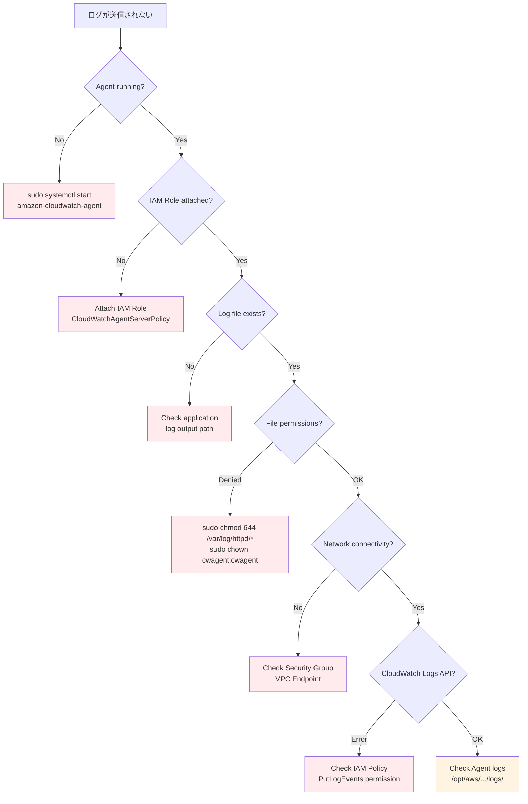

### 8.3 よくあるエラーと対処法

```yaml
エラー1: "NoCredentialProviders"
原因: IAM Roleが割り当てられていない
対処: EC2インスタンスにIAM Roleをアタッチ

エラー2: "AccessDeniedException"
原因: IAM Policyにlogs:PutLogEvents権限がない
対処: CloudWatchAgentServerPolicyをアタッチ

エラー3: "ResourceNotFoundException"
原因: Log Groupが存在しない
対処: Agent初回起動時に自動作成されるまで待機、または手動作成

エラー4: "ThrottlingException"
原因: PutLogEventsのAPI制限に達した
対処: バッチサイズを調整、送信間隔を延長

エラー5: "InvalidSequenceTokenException"
原因: 同じLog Streamに複数のAgentから送信
対処: Log Stream名にinstance_idを含める設定に変更
```

---

## 9. ログ監視とアラート

CloudWatch Logsに収集したログを監視し、特定のパターンを検知してアラートを発出する方法を解説します。

### 9.1 メトリクスフィルタの概要

**メトリクスフィルタ**は、CloudWatch Logsのログストリームから特定のパターンにマッチするログエントリを検出し、カスタムメトリクスとして数値化する機能です。

#### 9.1.1 メトリクスフィルタの仕組み

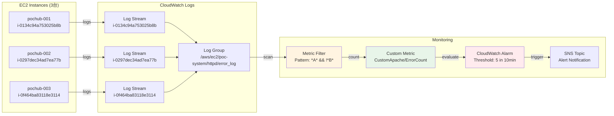

#### 9.1.2 主要な機能

| 機能 | 説明 | ユースケース |
|------|------|--------------|
| **パターンマッチング** | 正規表現やJSON形式でログをフィルタ | エラーログの検出 |
| **集約カウント** | 複数インスタンスのログを合計 | 3台のEC2からのエラー総数 |
| **時間窓での評価** | 指定期間内の発生回数を監視 | 10分間で5回以上 |
| **AND/NOT条件** | 複雑な条件式でフィルタリング | "A"を含み"B"を含まない |

#### 9.1.3 ログ集約のポイント

**重要:** メトリクスフィルタはロググループ全体に適用されるため、複数のEC2インスタンスからのログを自動的に集約します。

```yaml
ログ構造:
  Log Group: /aws/ec2/poc-system/httpd/error_log
    ├─ Log Stream: i-0134c94a753025b8b (pochub-001)
    ├─ Log Stream: i-0297dec34ad7ea77b (pochub-002)
    └─ Log Stream: i-0f464ba83118e3114 (pochub-003)

メトリクスフィルタの動作:
  1. ロググループ全体をスキャン
  2. 3台分のログストリームから該当ログを検出
  3. 合計値をカスタムメトリクスに記録
  
結果:
  - 3台の合計が自動的にカウントされる
  - インスタンス台数の変更に自動対応
```

---

### 9.2 メトリクスフィルタの実装

#### 9.2.1 基本的なフィルタパターン

**パターン1: 特定の文字列を含むログをカウント**

```bash
# AWS CLI コマンド
aws logs put-metric-filter \
  --log-group-name /aws/ec2/poc-system/httpd/error_log \
  --filter-name "ErrorCount" \
  --filter-pattern "ERROR" \
  --metric-transformations \
    metricName=ErrorCount,\
    metricNamespace=CustomApache,\
    metricValue=1,\
    defaultValue=0 \
  --region ap-northeast-1
```

**パターン2: 複数条件（AND条件）**

```bash
# "ERROR"を含み、かつ"database"を含むログ
aws logs put-metric-filter \
  --log-group-name /aws/ec2/poc-system/httpd/error_log \
  --filter-name "DatabaseError" \
  --filter-pattern "[timestamp, level=ERROR*, message=*database*]" \
  --metric-transformations \
    metricName=DatabaseErrorCount,\
    metricNamespace=CustomApache,\
    metricValue=1,\
    defaultValue=0 \
  --region ap-northeast-1
```

**パターン3: NOT条件（除外条件）**

```bash
# "ERROR"を含むが、"Timeout"を含まないログ
# CloudWatch LogsフィルタパターンはダイレクトなNOT条件をサポートしていないため、
# 2つのフィルタを作成して差分を計算する必要があります

# フィルタ1: 全エラー
aws logs put-metric-filter \
  --log-group-name /aws/ec2/poc-system/httpd/error_log \
  --filter-name "AllErrors" \
  --filter-pattern "ERROR" \
  --metric-transformations \
    metricName=AllErrorCount,\
    metricNamespace=CustomApache,\
    metricValue=1,\
    defaultValue=0 \
  --region ap-northeast-1

# フィルタ2: Timeoutエラー
aws logs put-metric-filter \
  --log-group-name /aws/ec2/poc-system/httpd/error_log \
  --filter-name "TimeoutErrors" \
  --filter-pattern "[timestamp, level=ERROR*, message=*Timeout*]" \
  --metric-transformations \
    metricName=TimeoutErrorCount,\
    metricNamespace=CustomApache,\
    metricValue=1,\
    defaultValue=0 \
  --region ap-northeast-1

# Math Expression Alarmで差分を計算（セクション9.3.3参照）
```

#### 9.2.2 高度なフィルタパターン

**Apache Combined Log形式の解析**

```bash
# Apache Combined Log: 127.0.0.1 - - [18/Nov/2025:10:00:00 +0900] "GET / HTTP/1.1" 500 1234
aws logs put-metric-filter \
  --log-group-name /aws/ec2/poc-system/httpd/access_log \
  --filter-name "5xxErrors" \
  --filter-pattern '[ip, id, user, timestamp, request, status=5*, size]' \
  --metric-transformations \
    metricName=5xxErrorCount,\
    metricNamespace=CustomApache,\
    metricValue=1,\
    defaultValue=0 \
  --region ap-northeast-1
```

**JSON形式ログの解析**

```json
// ログ例: {"timestamp":"2025-11-18T10:00:00Z","level":"ERROR","message":"Connection failed","user":"user123"}

// フィルタパターン（JSON解析）
{
  "$.level": "ERROR",
  "$.message": "*Connection*"
}
```

```bash
# AWS CLI コマンド
aws logs put-metric-filter \
  --log-group-name /aws/ec2/poc-system/app/error_log \
  --filter-name "ConnectionErrors" \
  --filter-pattern '{ ($.level = "ERROR") && ($.message = "*Connection*") }' \
  --metric-transformations \
    metricName=ConnectionErrorCount,\
    metricNamespace=CustomApp,\
    metricValue=1,\
    defaultValue=0 \
  --region ap-northeast-1
```

#### 9.2.3 メトリクスフィルタの確認

```bash
# メトリクスフィルタ一覧表示
aws logs describe-metric-filters \
  --log-group-name /aws/ec2/poc-system/httpd/error_log \
  --region ap-northeast-1

# 特定のメトリクスフィルタの詳細
aws logs describe-metric-filters \
  --log-group-name /aws/ec2/poc-system/httpd/error_log \
  --filter-name-prefix "ErrorCount" \
  --region ap-northeast-1

# メトリクスフィルタの削除
aws logs delete-metric-filter \
  --log-group-name /aws/ec2/poc-system/httpd/error_log \
  --filter-name "ErrorCount" \
  --region ap-northeast-1
```

---

### 9.3 CloudWatch Alarmの設定

メトリクスフィルタで生成したカスタムメトリクスに対してアラームを設定します。

#### 9.3.1 基本的なアラーム設定

**要件: 10分間で5回以上エラーが発生したらアラート**

```bash
# SNS Topicの作成（初回のみ）
aws sns create-topic \
  --name poc-apache-alerts \
  --region ap-northeast-1

# メール通知の購読設定
aws sns subscribe \
  --topic-arn arn:aws:sns:ap-northeast-1:ACCOUNT_ID:poc-apache-alerts \
  --protocol email \
  --notification-endpoint your-email@example.com \
  --region ap-northeast-1

# CloudWatch Alarmの作成
aws cloudwatch put-metric-alarm \
  --alarm-name "Apache-Error-High-Rate" \
  --alarm-description "Apacheエラーログが10分間で5回以上発生" \
  --metric-name ErrorCount \
  --namespace CustomApache \
  --statistic Sum \
  --period 600 \
  --evaluation-periods 1 \
  --threshold 5 \
  --comparison-operator GreaterThanOrEqualToThreshold \
  --alarm-actions arn:aws:sns:ap-northeast-1:ACCOUNT_ID:poc-apache-alerts \
  --treat-missing-data notBreaching \
  --region ap-northeast-1
```

#### 9.3.2 パラメータ詳細

| パラメータ | 値 | 説明 |
|------------|-----|------|
| `--metric-name` | `ErrorCount` | 監視対象のメトリクス名 |
| `--namespace` | `CustomApache` | カスタムメトリクスの名前空間 |
| `--statistic` | `Sum` | 集約方法（Sum/Average/Maximum/Minimum） |
| `--period` | `600` | 評価期間（秒）、600秒=10分 |
| `--evaluation-periods` | `1` | 連続して閾値を超える期間数 |
| `--threshold` | `5` | アラート発出の閾値 |
| `--comparison-operator` | `GreaterThanOrEqualToThreshold` | 比較演算子（>=） |
| `--treat-missing-data` | `notBreaching` | データ欠損時の扱い |

**重要な設定:**
```yaml
period × evaluation-periods = 監視時間窓
例: 600秒 × 1回 = 10分間

Statistic: Sum の意味:
  - 10分間に発生したエラーログの合計件数を計算
  - 3台のEC2インスタンスからの合計が自動的に集計される
  
treat-missing-data: notBreaching の意味:
  - データが欠損している場合はアラームを発出しない
  - EC2停止中や一時的なネットワーク障害時の誤報を防ぐ
```

#### 9.3.3 高度なアラーム設定

**複合条件アラーム（Math Expression）**

```bash
# シナリオ: 全エラーからTimeoutエラーを除外した件数を監視

# Math Expressionを使用したアラーム作成（AWS CLIではJSON形式が必要）
cat > alarm-config.json << 'EOF'
{
  "AlarmName": "Apache-Error-ExcludeTimeout",
  "AlarmDescription": "Timeoutを除くエラーが10分間で5回以上発生",
  "ActionsEnabled": true,
  "AlarmActions": [
    "arn:aws:sns:ap-northeast-1:ACCOUNT_ID:poc-apache-alerts"
  ],
  "EvaluationPeriods": 1,
  "ComparisonOperator": "GreaterThanOrEqualToThreshold",
  "Threshold": 5.0,
  "TreatMissingData": "notBreaching",
  "Metrics": [
    {
      "Id": "m1",
      "ReturnData": false,
      "MetricStat": {
        "Metric": {
          "Namespace": "CustomApache",
          "MetricName": "AllErrorCount"
        },
        "Period": 600,
        "Stat": "Sum"
      }
    },
    {
      "Id": "m2",
      "ReturnData": false,
      "MetricStat": {
        "Metric": {
          "Namespace": "CustomApache",
          "MetricName": "TimeoutErrorCount"
        },
        "Period": 600,
        "Stat": "Sum"
      }
    },
    {
      "Id": "e1",
      "Expression": "m1 - m2",
      "Label": "Errors excluding Timeout",
      "ReturnData": true
    }
  ]
}
EOF

aws cloudwatch put-metric-alarm --cli-input-json file://alarm-config.json --region ap-northeast-1
```

**異常検知（Anomaly Detection）**

```bash
# 機械学習による異常検知アラーム
aws cloudwatch put-metric-alarm \
  --alarm-name "Apache-Error-Anomaly" \
  --alarm-description "エラーログの異常検知（ML）" \
  --comparison-operator LessThanLowerOrGreaterThanUpperThreshold \
  --evaluation-periods 2 \
  --threshold-metric-id ad1 \
  --metrics '[
    {
      "Id": "m1",
      "ReturnData": true,
      "MetricStat": {
        "Metric": {
          "Namespace": "CustomApache",
          "MetricName": "ErrorCount"
        },
        "Period": 300,
        "Stat": "Sum"
      }
    },
    {
      "Id": "ad1",
      "Expression": "ANOMALY_DETECTION_BAND(m1, 2)",
      "Label": "ErrorCount (expected)"
    }
  ]' \
  --alarm-actions arn:aws:sns:ap-northeast-1:ACCOUNT_ID:poc-apache-alerts \
  --region ap-northeast-1
```

#### 9.3.4 アラームの確認と管理

```bash
# アラーム一覧表示
aws cloudwatch describe-alarms \
  --alarm-name-prefix "Apache-" \
  --region ap-northeast-1

# アラーム状態の確認
aws cloudwatch describe-alarm-history \
  --alarm-name "Apache-Error-High-Rate" \
  --max-records 10 \
  --region ap-northeast-1

# アラームの無効化
aws cloudwatch disable-alarm-actions \
  --alarm-names "Apache-Error-High-Rate" \
  --region ap-northeast-1

# アラームの有効化
aws cloudwatch enable-alarm-actions \
  --alarm-names "Apache-Error-High-Rate" \
  --region ap-northeast-1

# アラームの削除
aws cloudwatch delete-alarms \
  --alarm-names "Apache-Error-High-Rate" \
  --region ap-northeast-1
```

---

### 9.4 実装例とパターン

#### 9.4.1 実装例: Aを含みBを含まないログの監視

**要件:**
- Webサーバが3台（pochub-001, pochub-002, pochub-003）
- 10分間にAという文字列を含み、Bという文字列を含まないログが3台合計で5回以上あったらアラート

**実装手順:**

**Step 1: メトリクスフィルタ作成**

```bash
# フィルタ1: "A"を含むログ
aws logs put-metric-filter \
  --log-group-name /aws/ec2/poc-system/httpd/error_log \
  --filter-name "ContainsA" \
  --filter-pattern "[...] *A*" \
  --metric-transformations \
    metricName=LogWithA_Count,\
    metricNamespace=CustomApache,\
    metricValue=1,\
    defaultValue=0 \
  --region ap-northeast-1

# フィルタ2: "A"と"B"の両方を含むログ
aws logs put-metric-filter \
  --log-group-name /aws/ec2/poc-system/httpd/error_log \
  --filter-name "ContainsA_AndB" \
  --filter-pattern "[...] *A* *B*" \
  --metric-transformations \
    metricName=LogWithA_AndB_Count,\
    metricNamespace=CustomApache,\
    metricValue=1,\
    defaultValue=0 \
  --region ap-northeast-1
```

**Step 2: Math Expression Alarmの作成**

```bash
cat > alarm-a-not-b.json << 'EOF'
{
  "AlarmName": "Apache-ContainsA-NotB-Alert",
  "AlarmDescription": "Aを含みBを含まないログが10分間で5回以上（3台合計）",
  "ActionsEnabled": true,
  "AlarmActions": [
    "arn:aws:sns:ap-northeast-1:ACCOUNT_ID:poc-apache-alerts"
  ],
  "EvaluationPeriods": 1,
  "ComparisonOperator": "GreaterThanOrEqualToThreshold",
  "Threshold": 5.0,
  "TreatMissingData": "notBreaching",
  "Metrics": [
    {
      "Id": "m1",
      "ReturnData": false,
      "MetricStat": {
        "Metric": {
          "Namespace": "CustomApache",
          "MetricName": "LogWithA_Count"
        },
        "Period": 600,
        "Stat": "Sum"
      }
    },
    {
      "Id": "m2",
      "ReturnData": false,
      "MetricStat": {
        "Metric": {
          "Namespace": "CustomApache",
          "MetricName": "LogWithA_AndB_Count"
        },
        "Period": 600,
        "Stat": "Sum"
      }
    },
    {
      "Id": "e1",
      "Expression": "m1 - m2",
      "Label": "Logs with A but not B",
      "ReturnData": true
    }
  ]
}
EOF

aws cloudwatch put-metric-alarm \
  --cli-input-json file://alarm-a-not-b.json \
  --region ap-northeast-1
```

**Step 3: 動作確認**

```bash
# テストログの生成（EC2インスタンス上で実行）
sudo sh -c 'echo "[$(date)] ERROR: Message with A in it" >> /var/log/httpd/error_log'
sudo sh -c 'echo "[$(date)] ERROR: Message with B in it" >> /var/log/httpd/error_log'
sudo sh -c 'echo "[$(date)] ERROR: Message with A and B in it" >> /var/log/httpd/error_log'

# 5分後にメトリクスを確認
aws cloudwatch get-metric-statistics \
  --namespace CustomApache \
  --metric-name LogWithA_Count \
  --start-time $(date -u -d '10 minutes ago' +%Y-%m-%dT%H:%M:%S) \
  --end-time $(date -u +%Y-%m-%dT%H:%M:%S) \
  --period 600 \
  --statistics Sum \
  --region ap-northeast-1
```

#### 9.4.2 その他のパターン

**パターン1: 5xxエラーの監視**

```bash
# Apache access_logから5xxエラーを抽出
aws logs put-metric-filter \
  --log-group-name /aws/ec2/poc-system/httpd/access_log \
  --filter-name "5xxErrors" \
  --filter-pattern '[ip, id, user, timestamp, request, status=5*, size]' \
  --metric-transformations \
    metricName=Apache_5xx_Count,\
    metricNamespace=CustomApache,\
    metricValue=1,\
    defaultValue=0 \
  --region ap-northeast-1

# アラーム: 5分間で10回以上
aws cloudwatch put-metric-alarm \
  --alarm-name "Apache-5xx-High-Rate" \
  --alarm-description "5xxエラーが5分間で10回以上発生" \
  --metric-name Apache_5xx_Count \
  --namespace CustomApache \
  --statistic Sum \
  --period 300 \
  --evaluation-periods 1 \
  --threshold 10 \
  --comparison-operator GreaterThanOrEqualToThreshold \
  --alarm-actions arn:aws:sns:ap-northeast-1:ACCOUNT_ID:poc-apache-alerts \
  --region ap-northeast-1
```

**パターン2: レスポンスタイム監視**

```bash
# Apache access_logからレスポンスタイムを抽出
# Log format: 127.0.0.1 - - [18/Nov/2025:10:00:00 +0900] "GET / HTTP/1.1" 200 1234 1500
# 最後の1500がレスポンスタイム（ミリ秒）

aws logs put-metric-filter \
  --log-group-name /aws/ec2/poc-system/httpd/access_log \
  --filter-name "SlowRequests" \
  --filter-pattern '[ip, id, user, timestamp, request, status, size, response_time>2000]' \
  --metric-transformations \
    metricName=Apache_SlowRequest_Count,\
    metricNamespace=CustomApache,\
    metricValue=1,\
    defaultValue=0 \
  --region ap-northeast-1

# アラーム: 10分間で5回以上の遅いリクエスト
aws cloudwatch put-metric-alarm \
  --alarm-name "Apache-Slow-Request-Alert" \
  --alarm-description "2秒以上のリクエストが10分間で5回以上発生" \
  --metric-name Apache_SlowRequest_Count \
  --namespace CustomApache \
  --statistic Sum \
  --period 600 \
  --evaluation-periods 1 \
  --threshold 5 \
  --comparison-operator GreaterThanOrEqualToThreshold \
  --alarm-actions arn:aws:sns:ap-northeast-1:ACCOUNT_ID:poc-apache-alerts \
  --region ap-northeast-1
```

**パターン3: データベース接続エラーの監視**

```bash
# アプリケーションログからDB接続エラーを抽出
aws logs put-metric-filter \
  --log-group-name /aws/ec2/poc-system/app/error_log \
  --filter-name "DatabaseConnectionErrors" \
  --filter-pattern '[timestamp, level=ERROR*, message=*"database connection"*]' \
  --metric-transformations \
    metricName=DB_ConnectionError_Count,\
    metricNamespace=CustomApp,\
    metricValue=1,\
    defaultValue=0 \
  --region ap-northeast-1

# アラーム: 5分間で3回以上
aws cloudwatch put-metric-alarm \
  --alarm-name "App-DB-Connection-Error-Alert" \
  --alarm-description "DB接続エラーが5分間で3回以上発生" \
  --metric-name DB_ConnectionError_Count \
  --namespace CustomApp \
  --statistic Sum \
  --period 300 \
  --evaluation-periods 1 \
  --threshold 3 \
  --comparison-operator GreaterThanOrEqualToThreshold \
  --alarm-actions arn:aws:sns:ap-northeast-1:ACCOUNT_ID:poc-apache-alerts \
  --region ap-northeast-1
```

#### 9.4.3 CloudFormation/Sceptreでの実装

**CloudFormation Template:**

```yaml
AWSTemplateFormatVersion: '2010-09-09'
Description: 'CloudWatch Logs Metric Filters and Alarms'

Parameters:
  LogGroupName:
    Type: String
    Default: /aws/ec2/poc-system/httpd/error_log
    Description: CloudWatch Logs Log Group Name
  
  SNSTopicArn:
    Type: String
    Description: SNS Topic ARN for Alarm notifications

Resources:
  # Metric Filter: Aを含むログ
  MetricFilterContainsA:
    Type: AWS::Logs::MetricFilter
    Properties:
      FilterName: ContainsA
      LogGroupName: !Ref LogGroupName
      FilterPattern: '[...] *A*'
      MetricTransformations:
        - MetricName: LogWithA_Count
          MetricNamespace: CustomApache
          MetricValue: 1
          DefaultValue: 0

  # Metric Filter: AとBの両方を含むログ
  MetricFilterContainsAAndB:
    Type: AWS::Logs::MetricFilter
    Properties:
      FilterName: ContainsA_AndB
      LogGroupName: !Ref LogGroupName
      FilterPattern: '[...] *A* *B*'
      MetricTransformations:
        - MetricName: LogWithA_AndB_Count
          MetricNamespace: CustomApache
          MetricValue: 1
          DefaultValue: 0

  # CloudWatch Alarm: Aを含みBを含まないログが5回以上
  AlarmContainsANotB:
    Type: AWS::CloudWatch::Alarm
    DependsOn:
      - MetricFilterContainsA
      - MetricFilterContainsAAndB
    Properties:
      AlarmName: Apache-ContainsA-NotB-Alert
      AlarmDescription: Aを含みBを含まないログが10分間で5回以上（3台合計）
      ActionsEnabled: true
      AlarmActions:
        - !Ref SNSTopicArn
      ComparisonOperator: GreaterThanOrEqualToThreshold
      EvaluationPeriods: 1
      Threshold: 5
      TreatMissingData: notBreaching
      Metrics:
        - Id: m1
          ReturnData: false
          MetricStat:
            Metric:
              Namespace: CustomApache
              MetricName: LogWithA_Count
            Period: 600
            Stat: Sum
        - Id: m2
          ReturnData: false
          MetricStat:
            Metric:
              Namespace: CustomApache
              MetricName: LogWithA_AndB_Count
            Period: 600
            Stat: Sum
        - Id: e1
          Expression: m1 - m2
          Label: Logs with A but not B
          ReturnData: true

Outputs:
  MetricFilterContainsAName:
    Description: Metric Filter Name for logs containing A
    Value: !Ref MetricFilterContainsA
  
  AlarmName:
    Description: CloudWatch Alarm Name
    Value: !Ref AlarmContainsANotB
  
  AlarmArn:
    Description: CloudWatch Alarm ARN
    Value: !GetAtt AlarmContainsANotB.Arn
```

**Sceptre Config:**

```yaml
# sceptre/config/poc/metric-filter-alarm.yaml
template:
  type: file
  path: templates/metric-filter-alarm.yaml

parameters:
  LogGroupName: /aws/ec2/poc-system/httpd/error_log
  SNSTopicArn: !stack_output poc/sns-topic.yaml::TopicArn

dependencies:
  - poc/sns-topic.yaml
  - poc/cloudwatch-logs.yaml

tags:
  Environment: poc
  Service: monitoring
  Component: metric-filter
```

---

### 9.5 コスト試算

#### 9.5.1 メトリクスフィルタとアラームのコスト

| 項目 | 料金 | 想定使用量 | 月額コスト |
|------|------|-----------|-----------|
| **メトリクスフィルタ** | 無料 | 制限なし | $0.00 |
| **カスタムメトリクス** | $0.30/メトリクス | 5個 | $1.50 |
| **CloudWatch Alarm** | $0.10/アラーム（標準） | 5個 | $0.50 |
| **CloudWatch Alarm** | $0.30/アラーム（高解像度） | 0個 | $0.00 |
| **SNS通知** | $0.50/100万通知 | 100通知/月 | $0.00 |
| **合計** | - | - | **$2.00/月** |

#### 9.5.2 コスト削減のヒント

1. **メトリクスの統合**
   - 類似のメトリクスは1つにまとめる
   - ディメンションを活用してメトリクス数を削減

2. **アラームの統合**
   - Composite Alarmで複数の条件を1つのアラームに統合
   - 不要なアラームは削除

3. **高解像度アラームの慎重な使用**
   - 1分未満の評価が必要な場合のみ使用
   - 標準アラーム（1分間隔）で十分な場合が多い

4. **SNS通知の最適化**
   - 同じトピックを複数のアラームで共有
   - 不要な通知は削除

#### 9.5.3 プロジェクト全体のコスト見積もり

```yaml
基本ログ収集（セクション9の推奨方式C）:
  CloudWatch Logs取り込み: $0.50/GB × 15GB = $7.50
  CloudWatch Logsストレージ: $0.03/GB × 15GB = $0.45
  CloudWatch Agent: $0.00（無料）
  小計: $7.95/月

ログ監視・アラート（本セクション）:
  カスタムメトリクス: $0.30 × 5個 = $1.50
  CloudWatch Alarm: $0.10 × 5個 = $0.50
  小計: $2.00/月

合計: $9.95/月（約10ドル/月）
```

---

## 10. まとめ

### 10.1 ログ収集方式の選定（推奨）

**🎯 本プロジェクトでの推奨方式:**

詳細な比較分析は「EC2システム設計書兼詳細設計書.md」セクション8.3.1を参照してください。

**短期的推奨（即時実装）: 方式B（journald + rsyslog）**

```yaml
採用理由:
  - 移行リスク最小化（既存運用手順を維持）
  - トラブルシューティングが容易（grep可能）
  - 学習コスト低（既存スキル活用）
  - 段階的な移行が可能

構成:
  システムログ: journald → rsyslog → /var/log/messages → CloudWatch Agent
  アプリログ: 直接ファイル出力 → CloudWatch Agent

想定コスト:
  - ディスク: 36GB/月
  - CloudWatch Logs: $12.50/月
```

**長期的推奨（3ヶ月後移行）: 方式C（stdout化 + journald単体）**

```yaml
移行理由:
  - AWS Well-Architected Framework完全準拠
  - コスト削減（ディスク・CloudWatchコスト30%削減）
  - 12-factor app準拠（将来的なコンテナ化対応）
  - 運用負荷削減（ログローテーション不要）

構成:
  全ログ: stdout/stderr → journald → CloudWatch Agent
  rsyslog: 廃止

想定コスト:
  - ディスク: 15GB/月（58%削減）
  - CloudWatch Logs: $9/月（28%削減）
```

**移行パス（段階的アプローチ）:**

1. **Phase 1（現在）**: 方式Bで安定稼働
2. **Phase 2（1ヶ月後）**: Apacheログstdout化テスト
3. **Phase 3（2ヶ月後）**: アプリケーションログstdout化
4. **Phase 4（3ヶ月後）**: rsyslog廃止、方式Cへ完全移行

---

### 10.2 ログ監視とアラートのまとめ

**実装したメトリクスフィルタとアラーム:**

```yaml
メトリクスフィルタ:
  目的: CloudWatch Logsから特定パターンを検出しメトリクス化
  対象: ロググループ全体（複数インスタンス自動集約）
  パターン例:
    - 特定文字列のカウント（ERROR, WARNING）
    - 複合条件（AかつBを含む、AかつBを含まない）
    - Apache Combined Log解析（5xx, レスポンスタイム）
    - JSON形式ログ解析

CloudWatch Alarm:
  目的: メトリクスの閾値監視とアラート発出
  評価方法:
    - 基本: 単一メトリクスの閾値評価
    - Math Expression: 複数メトリクスの演算（差分、比率）
    - Anomaly Detection: 機械学習による異常検知
  通知先: SNS Topic → Email/Slack/Lambda

コスト: 約$2/月（カスタムメトリクス5個 + アラーム5個）
```

**監視パターンベストプラクティス:**

1. **エラー率監視**
   - 10分間で5回以上のエラー → アラート
   - 3台のEC2合計で自動集約

2. **複合条件監視**
   - "A"を含み"B"を含まないログを監視
   - Math Expressionで差分計算

3. **レスポンスタイム監視**
   - 2秒以上のリクエストを検出
   - パフォーマンス劣化の早期検知

4. **データベース接続エラー監視**
   - 5分間で3回以上 → アラート
   - システム障害の予兆検知

---

### 10.3 方式別推奨構成まとめ

#### 方式B（短期）: journald + rsyslog

```yaml
本番環境:
  ログ出力方式: 
    - システムログ: journald → rsyslog → ファイル
    - アプリログ: 直接ファイル出力
  収集方法: CloudWatch Agent（ファイル監視）
  保持期間:
    - rsyslogファイル: 30日（ローテーション）
    - CloudWatch Logs: 90日
    - S3アーカイブ: 7年
  監視:
    - Metric Filters: エラー率、アクセス数
    - CloudWatch Alarms: 閾値超過時のSNS通知

開発環境:
  ログ出力方式: 同上
  収集方法: 同上
  保持期間: 30日
```

#### 方式C（長期）: journald単体

```yaml
本番環境:
  ログ出力方式: 
    - 全ログ: stdout/stderr → journald
  収集方法: CloudWatch Agent（journaldプラグイン）
  保持期間:
    - journald: 7日（自動管理）
    - CloudWatch Logs: 90日
    - S3アーカイブ: 7年
  監視:
    - Metric Filters: エラー率、アクセス数
    - CloudWatch Alarms: 閾値超過時のSNS通知
    - Logs Insights: 定期的なログ分析

開発環境:
  ログ出力方式: 同上
  収集方法: 同上
  保持期間: 30日
```

---

### 10.4 コスト最適化

**方式別月額コスト比較:**

| 項目 | 方式B（rsyslog） | 方式C（journald） | 削減率 |
|------|:---:|:---:|:---:|
| **ディスク使用量** | 36GB/月 | 15GB/月 | **-58%** |
| **Log Ingestion** | $10.50 | $7.50 | **-29%** |
| **Log Storage (90日)** | $1.89 | $1.35 | **-29%** |
| **月額合計** | **$12.39** | **$8.85** | **-29%** |
| **年額合計** | **$148.68** | **$106.20** | **-29%** |

**追加コスト削減策:**

```yaml
1. ログ保持期間の最適化:
   - 開発環境: 30日
   - 本番環境: 90日
   - S3アーカイブ: Glacier Deep Archive利用

2. 不要なログの除外:
   - アクセスログの静的ファイルリクエスト除外（.js, .css, .png等）
   - DEBUG/TRACEレベルログは本番で無効化
   - ヘルスチェックログ除外

3. ログ圧縮:
   - CloudWatch Agentで自動圧縮 (gzip)
   - journaldも自動圧縮対応

4. Metric Filtersの活用:
   - 頻繁に検索するパターンはMetric Filter化
   - Logs Insightsクエリ実行コスト削減
```

---

### 10.5 運用上の注意事項

**方式B（rsyslog使用時）:**
- ログローテーション設定が必須（`/etc/logrotate.d/`）
- ディスク使用量監視が必要（CloudWatch Alarm設定推奨）
- rsyslogサービス監視（systemctl status rsyslog）

**方式C（journald単体時）:**
- `journalctl`コマンドの習得が必要
- journald設定の理解（`/etc/systemd/journald.conf`）
- CloudWatch Agent journaldプラグインの設定確認

**メトリクスフィルタとアラーム:**
- メトリクスフィルタのテストとチューニング
- アラーム閾値の定期的な見直し
- SNS通知先の管理（メールアドレス、Slackチャネル）
- False Positive（誤検知）の削減

**共通:**
- CloudWatch Agent状態監視（systemctl status amazon-cloudwatch-agent）
- IAMロール・ポリシーの定期確認
- CloudWatch Logsコスト監視（AWS Cost Explorer）
- メトリクスとアラームの定期レビュー（四半期ごと）

---

## 11. 改版履歴

| 版数 | 日付 | 改版内容 | 作成者 |
|------|------|----------|--------|
| 1.0 | 2025-11-18 | 初版作成 | - |
| 1.1 | 2025-11-18 | Amazon Linux 2023対応: ログ収集方式3種類の比較追加<br/>- 方式A: journald単体<br/>- 方式B: journald + rsyslog<br/>- 方式C: stdout化 + journald<br/>推奨方式とコスト試算を追加 | - |
| 1.2 | 2025-11-18 | ログ監視とアラート機能追加（セクション9）<br/>- メトリクスフィルタの実装方法<br/>- CloudWatch Alarmの設定<br/>- 複合条件監視（Math Expression）<br/>- 実装例とパターン（5xxエラー、レスポンスタイム、DB接続エラー）<br/>- CloudFormation/Sceptre実装例<br/>- コスト試算（$2/月） | - |
