# DataDog Agent によるログ収集完全ガイド

## 目次

- [DataDog Agent によるログ収集完全ガイド](#datadog-agent-によるログ収集完全ガイド)
  - [目次](#目次)
  - [1. 概要](#1-概要)
    - [1.1 DataDog Agentの特徴](#11-datadog-agentの特徴)
    - [1.2 対象ログ](#12-対象ログ)
    - [1.3 CloudWatch Logsとの比較](#13-cloudwatch-logsとの比較)
  - [2. ログ収集アーキテクチャ](#2-ログ収集アーキテクチャ)
    - [2.1 全体アーキテクチャ](#21-全体アーキテクチャ)
    - [2.2 ログフローの種類](#22-ログフローの種類)
    - [2.3 DataDog Agentのログ処理パイプライン](#23-datadog-agentのログ処理パイプライン)
    - [2.4 ログ収集設定の構造](#24-ログ収集設定の構造)
    - [2.5 Amazon Linux 2023 ログ収集方式の選定](#25-amazon-linux-2023-ログ収集方式の選定)
      - [2.5.1 ログ収集方式の概要](#251-ログ収集方式の概要)
    - [2.6 DataDog Agent通信要件](#26-datadog-agent通信要件)
  - [3. DataDog Agent インストール](#3-datadog-agent-インストール)
    - [3.0 前提条件: Amazon Linux 2023ログ収集方式の選定](#30-前提条件-amazon-linux-2023ログ収集方式の選定)
      - [3.0.1 ログ収集方式の概要](#301-ログ収集方式の概要)
      - [3.0.2 方式B: rsyslog有効化手順（従来型運用の場合）](#302-方式b-rsyslog有効化手順従来型運用の場合)
      - [3.0.3 方式A/C: DataDog Agent journald統合設定（クラウドネイティブ）](#303-方式ac-datadog-agent-journald統合設定クラウドネイティブ)
    - [3.1 インストールフロー](#31-インストールフロー)
    - [3.2 インストール手順](#32-インストール手順)
      - [3.2.1 Amazon Linux 2023の場合](#321-amazon-linux-2023の場合)
      - [3.2.2 DataDog APIキーの取得](#322-datadog-apiキーの取得)
      - [3.2.3 基本設定（datadog.yaml）](#323-基本設定datadogyaml)
      - [3.2.4 ログ収集の有効化確認](#324-ログ収集の有効化確認)
  - [4. ログ収集設定](#4-ログ収集設定)
    - [4.1 設定ファイル構造](#41-設定ファイル構造)
    - [4.2 サンプル設定ファイル](#42-サンプル設定ファイル)
      - [4.2.0 journaldから直接収集（方式A/C: クラウドネイティブ）](#420-journaldから直接収集方式ac-クラウドネイティブ)
      - [4.2.1 ファイルベースログ収集（方式B: 従来型）](#421-ファイルベースログ収集方式b-従来型)
      - [4.2.2 Apache統合設定（ログ + メトリクス）](#422-apache統合設定ログ--メトリクス)
      - [4.2.3 標準出力ログ収集（journald経由）](#423-標準出力ログ収集journald経由)
      - [4.2.4 ハイブリッド構成（推奨）](#424-ハイブリッド構成推奨)
    - [4.3 高度なログ処理設定](#43-高度なログ処理設定)
      - [4.3.1 機密情報のマスキング](#431-機密情報のマスキング)
      - [4.3.2 ログの除外（フィルタリング）](#432-ログの除外フィルタリング)
      - [4.3.3 マルチラインログのパース](#433-マルチラインログのパース)
    - [4.4 設定ファイルの検証とデプロイ](#44-設定ファイルの検証とデプロイ)
  - [5. ログ集約フロー](#5-ログ集約フロー)
    - [5.1 ファイルベースログの収集フロー](#51-ファイルベースログの収集フロー)
    - [5.2 journald収集フロー](#52-journald収集フロー)
    - [5.3 バッファリングとバッチ送信](#53-バッファリングとバッチ送信)
    - [5.4 DataDog Log Management階層構造](#54-datadog-log-management階層構造)
  - [6. 標準出力ログの収集方法](#6-標準出力ログの収集方法)
    - [6.1 標準出力ログアーキテクチャ](#61-標準出力ログアーキテクチャ)
    - [6.2 Apache標準出力設定](#62-apache標準出力設定)
      - [6.2.1 Apache設定ファイル修正](#621-apache設定ファイル修正)
      - [6.2.2 systemdサービス設定](#622-systemdサービス設定)
    - [6.3 DataDog Agent設定 (標準出力ログ)](#63-datadog-agent設定-標準出力ログ)
    - [6.4 標準出力ログフロー](#64-標準出力ログフロー)
  - [7. 運用管理](#7-運用管理)
    - [7.1 ログローテーション](#71-ログローテーション)
      - [7.1.1 ファイルベースログの場合](#711-ファイルベースログの場合)
      - [7.1.2 標準出力ログの場合（journald）](#712-標準出力ログの場合journald)
    - [7.2 監視とアラート](#72-監視とアラート)
    - [7.3 DataDog Log Explorer クエリ例](#73-datadog-log-explorer-クエリ例)
    - [7.4 Agent状態監視](#74-agent状態監視)
  - [8. トラブルシューティング](#8-トラブルシューティング)
    - [8.1 Agent起動失敗](#81-agent起動失敗)
    - [8.2 ログが送信されない](#82-ログが送信されない)
    - [8.3 よくあるエラーと対処法](#83-よくあるエラーと対処法)
    - [8.4 デバッグモードの有効化](#84-デバッグモードの有効化)
  - [9. ログ監視とアラート](#9-ログ監視とアラート)
    - [9.1 Log-based Metricsの概要](#91-log-based-metricsの概要)
      - [9.1.1 Log-based Metricsの仕組み](#911-log-based-metricsの仕組み)
      - [9.1.2 主要な機能](#912-主要な機能)
      - [9.1.3 ログ集約のポイント](#913-ログ集約のポイント)
    - [9.2 Log-based Metricsの実装](#92-log-based-metricsの実装)
      - [9.2.1 DataDog UIでの作成](#921-datadog-uiでの作成)
      - [9.2.2 APIでの作成](#922-apiでの作成)
      - [9.2.3 Distribution Metric（応答時間分布）](#923-distribution-metric応答時間分布)
      - [9.2.4 Log-based Metricsの確認](#924-log-based-metricsの確認)
    - [9.3 DataDog Monitorsの設定](#93-datadog-monitorsの設定)
      - [9.3.1 基本的なモニター設定](#931-基本的なモニター設定)
      - [9.3.2 高度なモニター設定](#932-高度なモニター設定)
      - [9.3.3 通知チャネルの設定](#933-通知チャネルの設定)
      - [9.3.4 モニターの確認と管理](#934-モニターの確認と管理)
    - [9.4 実装例とパターン](#94-実装例とパターン)
      - [9.4.1 Apache 5xxエラー監視](#941-apache-5xxエラー監視)
      - [9.4.2 SSH不正ログイン試行監視](#942-ssh不正ログイン試行監視)
      - [9.4.3 パッケージ更新監視](#943-パッケージ更新監視)
    - [9.5 コスト試算](#95-コスト試算)
      - [9.5.1 DataDog Log Management料金](#951-datadog-log-management料金)
      - [9.5.2 CloudWatch Logsとの比較](#952-cloudwatch-logsとの比較)
  - [10. コスト分析](#10-コスト分析)
    - [10.1 総合コスト比較](#101-総合コスト比較)
    - [10.2 選定基準](#102-選定基準)
  - [11. まとめ](#11-まとめ)
    - [11.1 DataDog Agentによるログ収集の特徴](#111-datadog-agentによるログ収集の特徴)
    - [11.2 推奨構成](#112-推奨構成)
    - [11.3 次のステップ](#113-次のステップ)
- [9. systemdサービス確認](#9-systemdサービス確認)

## 1. 概要

DataDog Agentは、EC2インスタンス上のログファイル、メトリクス、トレースをDataDogプラットフォームに送信する統合監視エージェントです。本ガイドでは、従来のファイルベースログと12-factor app準拠の標準出力ログの両方の収集方法を解説します。

### 1.1 DataDog Agentの特徴

```yaml
統合監視機能:
  - Log Management (ログ収集・分析)
  - Infrastructure Monitoring (メトリクス収集)
  - APM (Application Performance Monitoring)
  - Network Performance Monitoring

ログ収集機能:
  - ファイルベースログの tail 収集
  - journald からの直接収集
  - コンテナログの自動収集
  - ログパイプライン処理（パース、フィルタ、加工）
  - Log-based Metrics 生成
```

### 1.2 対象ログ

本ガイドでは以下のログを収集対象とします:

```yaml
システムログ:
  - /var/log/messages (syslog) ※rsyslog有効化により作成
  - /var/log/secure (SSH/SSM認証ログ) ※rsyslog有効化により作成
  - /var/log/dnf.log (パッケージ管理ログ) ※Amazon Linux 2023

Apacheログ:
  - /var/log/httpd/access_log
  - /var/log/httpd/error_log

標準出力ログ:
  - stdout (Apache)
  - stderr (Tomcat)
```

**重要:** Amazon Linux 2023ではjournaldがデフォルトのログシステムです。従来の`/var/log/messages`, `/var/log/secure`などのファイルを作成するには、rsyslogを有効化する必要があります（セクション3.0参照）。

### 1.3 CloudWatch Logsとの比較

```yaml
DataDogの優位性:
  - 統合監視: ログ・メトリクス・トレースを1プラットフォームで管理
  - 高度な検索: フルテキスト検索、ファセット検索、複雑なクエリ
  - 可視化: カスタムダッシュボード、リアルタイムグラフ、ヒートマップ
  - アラート: 複雑な条件設定、異常検知、複数通知チャネル
  - ログパイプライン: ログの加工・パース・フィルタリング
  - インテグレーション: 400+の統合（Apache, MySQL, Redis等）

CloudWatch Logsの優位性:
  - AWS ネイティブ: 追加料金なし、IAMベースの認証
  - AWS統合: Lambda, S3, Kinesis等との統合が容易
  - コスト: 小規模環境では低コスト

選定基準:
  - 複雑な監視要件 → DataDog
  - AWSエコシステム内完結 → CloudWatch Logs
  - マルチクラウド環境 → DataDog
```

---

## 2. ログ収集アーキテクチャ

### 2.1 全体アーキテクチャ

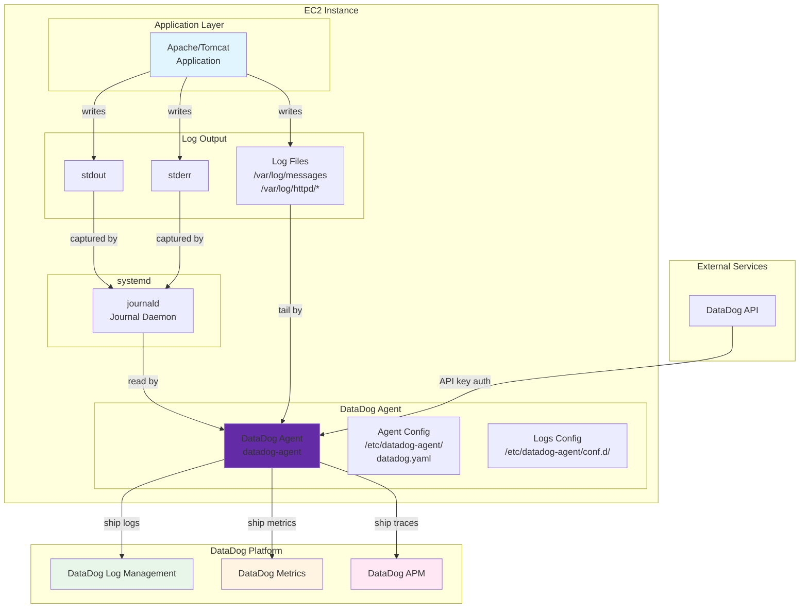

### 2.2 ログフローの種類

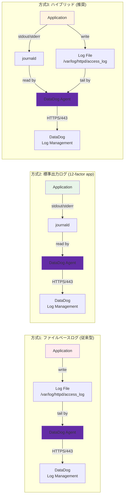

### 2.3 DataDog Agentのログ処理パイプライン

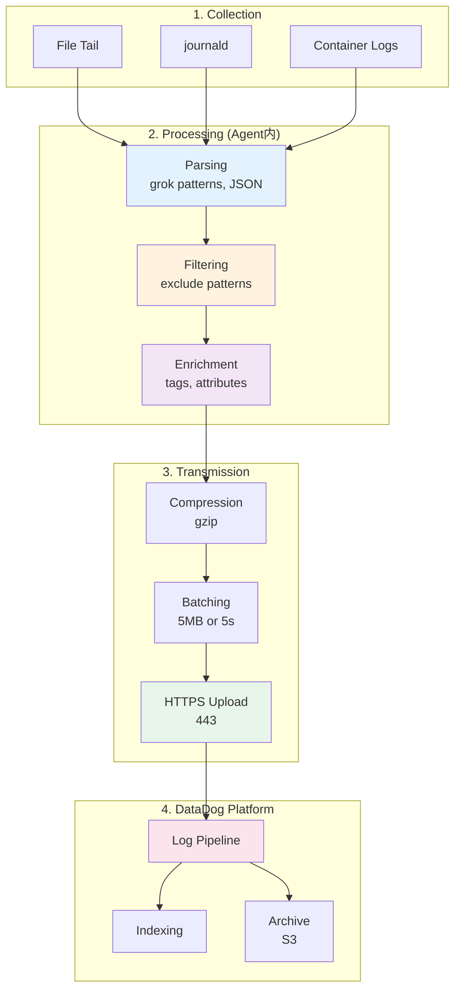

### 2.4 ログ収集設定の構造

```yaml
DataDog Agent設定階層:
  /etc/datadog-agent/
    ├── datadog.yaml           # メイン設定ファイル
    │   ├── api_key            # DataDog APIキー (必須)
    │   ├── site               # DataDogサイト (datadoghq.com等)
    │   ├── logs_enabled       # ログ収集有効化 (true)
    │   └── tags               # グローバルタグ
    │
    └── conf.d/                # インテグレーション設定ディレクトリ
        ├── apache.d/
        │   └── conf.yaml      # Apache統合設定 + ログ収集
        ├── journald.d/
        │   └── conf.yaml      # journaldログ収集設定
        └── custom_logs.d/
            └── conf.yaml      # カスタムログ収集設定

設定の優先順位:
  1. インテグレーション設定 (conf.d/*/conf.yaml) - 各サービス専用
  2. カスタムログ設定 (conf.d/custom_logs.d/conf.yaml) - 汎用
  3. グローバル設定 (datadog.yaml) - エージェント全体
```

### 2.5 Amazon Linux 2023 ログ収集方式の選定

**🔴 重要:** Amazon Linux 2023ではjournaldがデフォルトのログシステムとなり、従来の`/var/log/messages`, `/var/log/secure`などのファイルは作成されません。プロジェクトの要件に応じて、以下の3つの方式から選択する必要があります。

#### 2.5.1 ログ収集方式の概要

```yaml
方式A: journald単体 (DataDog Agent journald統合):
  メリット:
    - ディスクI/O・使用量最小
    - ログローテーション不要
    - 構造化ログ (JSON) のメタデータ保持
    - DataDog統合でリッチなログ属性
  デメリット:
    - 従来の grep /var/log/messages 不可
    - journalctl コマンド習得が必要
    - EC2インスタンス内でのログ確認が困難
  推奨用途:
    - 新規構築プロジェクト
    - コンテナ化前提のシステム
    - DataDog完全移行環境

方式B: journald + rsyslog (ハイブリッド):
  メリット:
    - 従来の運用手順を維持可能
    - /var/log/* ファイルでログ確認可能
    - 既存スクリプト・ツールが動作
  デメリット:
    - ディスク使用量増加 (ログ二重管理)
    - ログローテーション設定が必要
    - rsyslog設定・保守が必要
  推奨用途:
    - 既存システムの移行
    - 従来型運用の継続が必須
    - ログファイル直接確認が頻繁

方式C: アプリケーションログstdout化 + journald単体 (AWS推奨):
  メリット:
    - 12-factor app準拠
    - コンテナ化対応容易
    - 最もコスト効率が良い
    - ログ管理の一元化
  デメリット:
    - アプリケーション設定変更が必要
    - Apache/Tomcat設定の変更
    - 移行期間中の二重管理
  推奨用途:
    - 新規開発アプリケーション
    - 将来のコンテナ化を見据えた設計
    - モダンなログ管理を目指す環境

DataDogにおける推奨:
  - 新規構築: 方式C (stdout化 + journald)
  - 移行中: 方式B (ハイブリッド) → 段階的に方式C
  - 保守的運用: 方式B (ハイブリッド)
```

**詳細な比較は「EC2システム設計書兼詳細設計書.md」のセクション8.3.1を参照**

### 2.6 DataDog Agent通信要件

```yaml
ネットワーク要件:
  送信先: DataDog Intake API
    - ホスト: agent-intake-prd.datadoghq.com (または datadoghq.eu)
    - プロトコル: HTTPS
    - ポート: 443
    - 必須通信: 双方向 (outbound + inbound for agent status)

認証:
  - API Key: DataDogダッシュボードから取得
  - APP Key: (オプション) API操作用

セキュリティグループ設定:
  Outbound Rule:
    - Type: HTTPS
    - Protocol: TCP
    - Port: 443
    - Destination: 0.0.0.0/0 (または DataDog IP範囲)
    - Description: DataDog Agent to DataDog Platform

Proxy経由の通信:
  datadog.yaml設定:
    proxy:
      https: http://proxy.example.com:3128
      no_proxy:
        - 169.254.169.254  # EC2 IMDS
```

---

## 3. DataDog Agent インストール

### 3.0 前提条件: Amazon Linux 2023ログ収集方式の選定

**🔴 重要:** Amazon Linux 2023ではjournaldがデフォルトのログシステムとなり、従来の`/var/log/messages`, `/var/log/secure`などのファイルは作成されません。プロジェクトの要件に応じて、以下の3つの方式から選択する必要があります。

#### 3.0.1 ログ収集方式の概要

**方式A: journald単体（DataDog Agent journald統合）**
- journaldから直接DataDog Log Managementに送信
- ディスクI/O・使用量最小、ログローテーション不要
- DataDog Agent journald統合設定が必要
- 従来の`grep /var/log/messages`が使えない

**方式B: journald + rsyslog（ハイブリッド）**
- journald → rsyslog → テキストファイル → DataDog Agent
- 従来の運用手順を維持可能
- ディスク使用量増加（ログ二重管理）
- ログローテーション設定が必要

**方式C: アプリケーションログstdout化 + journald単体（推奨）**
- 全ログをstdout/stderr → journald → DataDog Agent
- 12-factor app準拠、コンテナ化対応容易
- アプリケーション設定変更が必要
- 最もコスト効率が良い

**詳細な比較は「EC2システム設計書兼詳細設計書.md」のセクション8.3.1を参照**

---

#### 3.0.2 方式B: rsyslog有効化手順（従来型運用の場合）

方式Bを選択する場合は、以下の手順でrsyslogを有効化します。

```bash
#!/bin/bash
# Amazon Linux 2023でrsyslogを有効化

# 1. rsyslogインストール（通常はプリインストール済み）
sudo dnf install -y rsyslog

# 2. rsyslog設定確認
cat /etc/rsyslog.conf

# 3. journaldからrsyslogへの転送設定
# /etc/rsyslog.conf に以下が含まれていることを確認
# module(load="imjournal" StateFile="imjournal.state")

# 4. rsyslogサービス有効化と起動
sudo systemctl enable rsyslog
sudo systemctl start rsyslog

# 5. サービス状態確認
sudo systemctl status rsyslog

# 6. ログファイルが作成されることを確認
ls -la /var/log/messages
ls -la /var/log/secure

# 7. journald設定の確認（rsyslogへ転送する設定）
cat /etc/systemd/journald.conf
# ForwardToSyslog=yes が設定されていることを確認
# デフォルトでは有効
```

**rsyslog設定ファイル (`/etc/rsyslog.conf`):**

```bash
# モジュールロード
module(load="imjournal" StateFile="imjournal.state")
module(load="imuxsock")
module(load="imklog")

# ログファイル出力ルール
*.info;mail.none;authpriv.none;cron.none                /var/log/messages
authpriv.*                                              /var/log/secure
mail.*                                                  -/var/log/maillog
cron.*                                                  /var/log/cron
*.emerg                                                 :omusrmsg:*
uucp,news.crit                                          /var/log/spooler
local7.*                                                /var/log/boot.log
```

**ログファイル確認:**

```bash
# システムログ確認
sudo tail -f /var/log/messages

# SSH/SSM認証ログ確認
sudo tail -f /var/log/secure

# パッケージ管理ログ確認（Amazon Linux 2023ではdnf）
sudo tail -f /var/log/dnf.log
```

**Note:**
- rsyslog有効化により、従来の`/var/log/messages`, `/var/log/secure`などが作成されます
- journaldは引き続き動作し、rsyslogと並行してログを管理します（ログ二重管理）
- SSHおよびSSM Session Managerの認証ログは`/var/log/secure`に記録されます
- パッケージ管理ログは`/var/log/yum.log`（AL2）から`/var/log/dnf.log`（AL2023）に変更されました

---

#### 3.0.3 方式A/C: DataDog Agent journald統合設定（クラウドネイティブ）

方式AまたはCを選択する場合は、rsyslog不要です。DataDog Agent journald統合を使用します。

**DataDog Agent journald統合設定 (`/etc/datadog-agent/conf.d/journald.d/conf.yaml`):**

```yaml
logs:
  - type: journald
    container_mode: false
    include_units:
      - sshd.service
      - systemd.service
      - dnf.service
      - httpd.service
    exclude_units:
      - debug.service
    source: systemd-journal
    service: system
    tags:
      - env:production
      - os:amazon-linux-2023
```

**journalctlコマンドでログ確認:**

```bash
# 全ログ表示
sudo journalctl

# SSHログのみ表示
sudo journalctl -u sshd

# 最新100行表示
sudo journalctl -n 100

# リアルタイム表示
sudo journalctl -f

# 時間範囲指定
sudo journalctl --since "2025-11-18 10:00:00" --until "2025-11-18 11:00:00"

# 優先度フィルタ（エラーのみ）
sudo journalctl -p err

# JSON形式で出力
sudo journalctl -o json-pretty
```

**Note:**
- journald統合を使用する場合、rsyslogは不要（ディスク使用量削減）
- `journalctl`コマンドの習得が必要
- DataDog Log Managementにも送信されるため、DataDogダッシュボードでも確認可能

---

### 3.1 インストールフロー

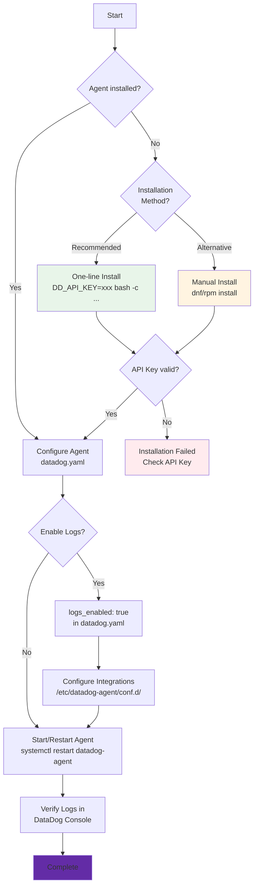

### 3.2 インストール手順

#### 3.2.1 Amazon Linux 2023の場合

**推奨方法: DataDog公式ワンライナースクリプト**

```bash
#!/bin/bash
# DataDog Agent インストールスクリプト (推奨)

# 1. DataDog APIキーを環境変数に設定
export DD_API_KEY="your-datadog-api-key-here"

# 2. DataDog Agentインストール（ワンライナー）
# US1リージョン (datadoghq.com) の場合
DD_API_KEY=$DD_API_KEY DD_SITE="datadoghq.com" bash -c "$(curl -L https://s3.amazonaws.com/dd-agent/scripts/install_script_agent7.sh)"

# EU1リージョン (datadoghq.eu) の場合
# DD_API_KEY=$DD_API_KEY DD_SITE="datadoghq.eu" bash -c "$(curl -L https://s3.amazonaws.com/dd-agent/scripts/install_script_agent7.sh)"

# AP1リージョン (ap1.datadoghq.com) の場合
# DD_API_KEY=$DD_API_KEY DD_SITE="ap1.datadoghq.com" bash -c "$(curl -L https://s3.amazonaws.com/dd-agent/scripts/install_script_agent7.sh)"

# 3. インストール確認
sudo systemctl status datadog-agent

# 4. Agentディレクトリ確認
ls -la /etc/datadog-agent/
ls -la /opt/datadog-agent/
```

**代替方法: yum/dnfパッケージマネージャ経由でインストール**

```bash
#!/bin/bash
# 手動インストール方法

# 1. DataDogリポジトリの追加
cat <<EOF | sudo tee /etc/yum.repos.d/datadog.repo
[datadog]
name = Datadog, Inc.
baseurl = https://yum.datadoghq.com/stable/7/x86_64/
enabled=1
gpgcheck=1
repo_gpgcheck=1
gpgkey=https://keys.datadoghq.com/DATADOG_RPM_KEY_CURRENT.public
       https://keys.datadoghq.com/DATADOG_RPM_KEY_B01082D3.public
       https://keys.datadoghq.com/DATADOG_RPM_KEY_FD4BF915.public
EOF

# 2. Agentパッケージのインストール
sudo dnf install -y datadog-agent

# 3. インストール確認
rpm -qa | grep datadog-agent

# 4. Agentディレクトリ確認
ls -la /etc/datadog-agent/
```

**Note**: 
- Amazon Linux 2023では、公式ワンライナースクリプトが最も簡単な方法です
- APIキーはDataDogダッシュボードの`Organization Settings > API Keys`から取得してください
- ARM64アーキテクチャの場合も同じスクリプトが自動判別して対応します

#### 3.2.2 DataDog APIキーの取得

DataDog Agentの認証には、APIキーが必要です。

**APIキーの取得手順:**

1. DataDogダッシュボードにログイン
2. 左下の歯車アイコン → `Organization Settings`
3. `API Keys` タブをクリック
4. `New Key` または既存のキーをコピー

**APIキーの保護:**

```yaml
セキュリティベストプラクティス:
  - APIキーは環境変数または AWS Secrets Manager に保存
  - 設定ファイルに直接記載しない
  - IAMロール経由でSecrets Managerからキーを取得
  - キーのローテーションを定期的に実施

環境変数での設定:
  export DD_API_KEY="your-api-key-here"
  
AWS Secrets Manager統合:
  1. Secrets ManagerにAPIキーを保存
  2. EC2インスタンスのIAMロールに secretsmanager:GetSecretValue 権限を付与
  3. 起動時スクリプトでキーを取得して設定
```

**AWS Secrets Manager統合例:**

```bash
#!/bin/bash
# AWS Secrets ManagerからDataDog APIキーを取得

# 1. Secrets Managerからキーを取得
DD_API_KEY=$(aws secretsmanager get-secret-value \
  --secret-id datadog/api-key \
  --region ap-northeast-1 \
  --query SecretString \
  --output text | jq -r .api_key)

# 2. 環境変数に設定
export DD_API_KEY

# 3. DataDog Agent設定ファイルに書き込み
sudo sed -i "s/api_key:.*/api_key: $DD_API_KEY/" /etc/datadog-agent/datadog.yaml

# 4. Agentを再起動
sudo systemctl restart datadog-agent
```

#### 3.2.3 基本設定（datadog.yaml）

DataDog Agentのメイン設定ファイルは `/etc/datadog-agent/datadog.yaml` です。

**基本設定例:**

```yaml
# /etc/datadog-agent/datadog.yaml

## Basic Configuration
api_key: YOUR_API_KEY_HERE
site: datadoghq.com  # US1リージョン (または datadoghq.eu, ap1.datadoghq.com)

## Hostname Configuration
hostname: web-server-01  # 省略時はEC2インスタンスIDが使用される
hostname_fqdn: false  # trueにするとFQDNを使用

## Tags (Global)
tags:
  - env:production
  - service:web
  - region:ap-northeast-1
  - os:amazon-linux-2023

## Logs Configuration
logs_enabled: true  # ログ収集を有効化
logs_config:
  use_compression: true  # ログ圧縮を有効化
  compression_level: 6  # 圧縮レベル (1-9)
  batch_wait: 5  # バッチ待機時間（秒）
  open_files_limit: 100  # 同時に開くファイル数の上限

## APM Configuration (オプション)
apm_config:
  enabled: false  # APMを使用する場合はtrue
  apm_non_local_traffic: false  # コンテナからのトレース受信時はtrue

## Process Monitoring (オプション)
process_config:
  enabled: false  # プロセス監視を有効化する場合はtrue

## Network Monitoring (オプション)
network_config:
  enabled: false  # ネットワーク監視を有効化する場合はtrue

## Proxy Configuration (必要に応じて)
# proxy:
#   https: http://proxy.example.com:3128
#   no_proxy:
#     - 169.254.169.254  # EC2 IMDS
```

**設定ファイルの編集:**

```bash
# 設定ファイルのバックアップ
sudo cp /etc/datadog-agent/datadog.yaml /etc/datadog-agent/datadog.yaml.bak

# 設定ファイルを編集
sudo vi /etc/datadog-agent/datadog.yaml

# 設定ファイルの構文チェック
sudo datadog-agent configcheck

# Agentを再起動
sudo systemctl restart datadog-agent

# Agent状態確認
sudo datadog-agent status
```

#### 3.2.4 ログ収集の有効化確認

```bash
# Agent状態を確認
sudo datadog-agent status

# Logs Agent セクションを確認
sudo datadog-agent status | grep -A 20 "Logs Agent"

# 出力例:
# =========
# Logs Agent
# =========
#   Logs Enabled: true
#   Logs Sent: 1234
#   Logs Dropped: 0
#   Last Error: none

# 実行中のログ収集統合を確認
sudo datadog-agent status | grep -A 50 "Logs Integrations"
```

**Note**: 
- `logs_enabled: true` が設定されていることを確認
- Agent再起動後、5-10分後にDataDogダッシュボードでログが表示されます

---

## 4. ログ収集設定

### 4.1 設定ファイル構造

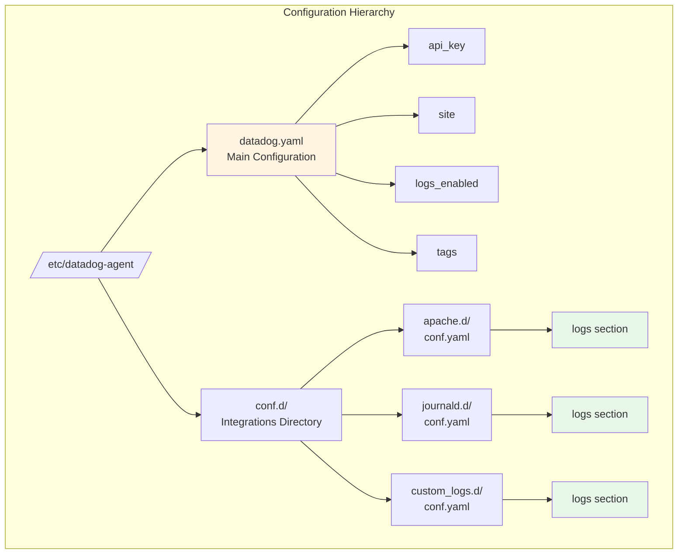

### 4.2 サンプル設定ファイル

#### 4.2.0 journaldから直接収集（方式A/C: クラウドネイティブ）

journaldから直接DataDog Log Managementに送信する設定です。rsyslog不要でディスクI/O最小化。

**設定ファイル:** `/etc/datadog-agent/conf.d/journald.d/conf.yaml`

```yaml
logs:
  - type: journald
    container_mode: false
    
    # 収集対象のsystemdユニット
    include_units:
      - sshd.service
      - systemd.service
      - httpd.service
      - tomcat.service
      - dnf.service
    
    # 除外するsystemdユニット（オプション）
    exclude_units:
      - debug.service
    
    # ログレベルフィルタ（オプション）
    # include_priority: ["err", "warning", "notice", "info"]
    
    # DataDogタグ
    source: systemd-journal
    service: system
    tags:
      - env:production
      - os:amazon-linux-2023
```

**Note:**
- `include_units`: 特定のsystemdユニットのみ収集（指定しない場合は全ユニット）
- `exclude_units`: 除外するsystemdユニット
- `include_priority`: ログレベルフィルタ（emerg, alert, crit, err, warning, notice, info, debug）
- SSH/SSM認証ログは `sshd.service` で収集
- rsyslog不要、ログローテーション不要

**設定の有効化:**

```bash
# 設定ファイルの構文チェック
sudo datadog-agent configcheck

# Agentを再起動
sudo systemctl restart datadog-agent

# ログ収集状態を確認
sudo datadog-agent status | grep -A 30 "journald"
```

---

#### 4.2.1 ファイルベースログ収集（方式B: 従来型）

ログファイルを直接監視してDataDog Log Managementに送信する設定です。

**設定ファイル:** `/etc/datadog-agent/conf.d/custom_logs.d/conf.yaml`

```yaml
logs:
  # システムログ: /var/log/messages
  - type: file
    path: /var/log/messages
    source: syslog
    service: system
    tags:
      - env:production
      - log_type:system

  # セキュリティログ: /var/log/secure (SSH/SSM認証)
  - type: file
    path: /var/log/secure
    source: syslog
    service: security
    tags:
      - env:production
      - log_type:security

  # パッケージ管理ログ: /var/log/dnf.log (Amazon Linux 2023)
  - type: file
    path: /var/log/dnf.log
    source: dnf
    service: package-manager
    tags:
      - env:production
      - log_type:package

  # Apache アクセスログ
  - type: file
    path: /var/log/httpd/access_log
    source: apache
    service: apache
    tags:
      - env:production
      - log_type:access

  # Apache エラーログ
  - type: file
    path: /var/log/httpd/error_log
    source: apache
    service: apache
    tags:
      - env:production
      - log_type:error
```

**Note:**
- `/var/log/secure`: SSH/SSM Session Manager認証ログ
- `/var/log/dnf.log`: パッケージ管理ログ（Amazon Linux 2023）
- rsyslog有効化により、これらのファイルが作成されます
- `source`: DataDogのログパイプライン処理に使用されるソースタイプ
- `service`: サービス名（APMとの連携に使用）

**設定の有効化:**

```bash
# 設定ファイルの構文チェック
sudo datadog-agent configcheck

# Agentを再起動
sudo systemctl restart datadog-agent

# ログ収集状態を確認
sudo datadog-agent status | grep -A 50 "Logs"
```

---

#### 4.2.2 Apache統合設定（ログ + メトリクス）

DataDogのApache統合を使用すると、ログ収集とメトリクス収集を同時に設定できます。

**設定ファイル:** `/etc/datadog-agent/conf.d/apache.d/conf.yaml`

```yaml
## Apache統合設定

init_config:

instances:
  # Apache Status Endpoint (メトリクス収集)
  - apache_status_url: http://localhost/server-status?auto
    
    # Apache メトリクスタグ
    tags:
      - env:production
      - service:apache

logs:
  # Apache アクセスログ
  - type: file
    path: /var/log/httpd/access_log
    source: apache
    service: apache
    tags:
      - env:production
      - log_type:access
    
    # ログパース設定（自動パース有効化）
    log_processing_rules:
      - type: multi_line
        name: apache_access_log_start
        pattern: '^\d{1,3}\.\d{1,3}\.\d{1,3}\.\d{1,3}'

  # Apache エラーログ
  - type: file
    path: /var/log/httpd/error_log
    source: apache
    service: apache
    tags:
      - env:production
      - log_type:error
    
    # ログパース設定
    log_processing_rules:
      - type: multi_line
        name: apache_error_log_start
        pattern: '^\[[\w:]+\]'
```

**Apache Status有効化設定** (`/etc/httpd/conf.d/status.conf`):

```apache
<Location "/server-status">
    SetHandler server-status
    Require local
</Location>
```

**設定の有効化:**

```bash
# Apache Status有効化
sudo systemctl restart httpd

# Apache Status動作確認
curl http://localhost/server-status?auto

# DataDog Agent設定チェック
sudo datadog-agent configcheck

# DataDog Agent再起動
sudo systemctl restart datadog-agent

# Apache統合状態確認
sudo datadog-agent status | grep -A 30 "apache"
```

---

#### 4.2.3 標準出力ログ収集（journald経由）

アプリケーションの標準出力/標準エラー出力をjournaldから収集する設定です。

**前提条件:**
1. Apacheがstdout/stderrにログを出力する設定
2. systemdがjournaldにログをキャプチャする設定

**DataDog Agent設定:** `/etc/datadog-agent/conf.d/journald.d/conf.yaml`

```yaml
logs:
  # Apache stdout/stderr (journald経由)
  - type: journald
    container_mode: false
    include_units:
      - httpd.service
    source: apache
    service: apache-stdout
    tags:
      - env:production
      - log_type:stdout

  # Tomcat stdout/stderr (journald経由)
  - type: journald
    container_mode: false
    include_units:
      - tomcat.service
    source: tomcat
    service: tomcat-stdout
    tags:
      - env:production
      - log_type:stdout
```

**必要な追加設定:**

1. **Apache設定変更** (`/etc/httpd/conf/httpd.conf`):
```apache
# ファイル出力を無効化
# ErrorLog "logs/error_log"
# CustomLog "logs/access_log" combined

# 標準出力へリダイレクト
ErrorLog "|/bin/cat"
CustomLog "|/bin/cat" combined
```

2. **systemd override設定** (`/etc/systemd/system/httpd.service.d/override.conf`):
```ini
[Service]
StandardOutput=journal
StandardError=journal
SyslogIdentifier=httpd
```

3. **設定適用**:
```bash
# systemd設定の再読み込み
sudo systemctl daemon-reload

# Apache再起動
sudo systemctl restart httpd

# journaldログ確認
sudo journalctl -u httpd -f

# DataDog Agent再起動
sudo systemctl restart datadog-agent

# ログ収集状態確認
sudo datadog-agent status | grep -A 30 "journald"
```

---

#### 4.2.4 ハイブリッド構成（推奨）

ファイルベースログと標準出力ログの両方を収集する設定です。

**設定ファイル:** `/etc/datadog-agent/conf.d/custom_logs.d/conf.yaml`

```yaml
logs:
  # システムログ（ファイルベース）
  - type: file
    path: /var/log/messages
    source: syslog
    service: system
    tags:
      - env:production
      - log_type:system

  # セキュリティログ（ファイルベース）
  - type: file
    path: /var/log/secure
    source: syslog
    service: security
    tags:
      - env:production
      - log_type:security

  # パッケージ管理ログ（ファイルベース）
  - type: file
    path: /var/log/dnf.log
    source: dnf
    service: package-manager
    tags:
      - env:production
      - log_type:package

  # Apache アクセスログ（ファイルベース）
  - type: file
    path: /var/log/httpd/access_log
    source: apache
    service: apache
    tags:
      - env:production
      - log_type:access

  # Apache エラーログ（ファイルベース）
  - type: file
    path: /var/log/httpd/error_log
    source: apache
    service: apache
    tags:
      - env:production
      - log_type:error
```

**+ journald設定:** `/etc/datadog-agent/conf.d/journald.d/conf.yaml`

```yaml
logs:
  # Apache stdout (journald経由)
  - type: journald
    container_mode: false
    include_units:
      - httpd.service
    source: apache
    service: apache-stdout
    tags:
      - env:production
      - log_type:stdout

  # Tomcat stdout (journald経由)
  - type: journald
    container_mode: false
    include_units:
      - tomcat.service
    source: tomcat
    service: tomcat-stdout
    tags:
      - env:production
      - log_type:stdout
```

**Note:** 
- ファイルベースログは既存システムで動作実績のある方式
- 標準出力ログは12-factor app準拠で将来的な推奨方式
- ハイブリッド構成で段階的な移行が可能
- `/var/log/secure`: SSH/SSM認証ログを含む
- `/var/log/dnf.log`: パッケージ管理ログ（Amazon Linux 2023）

### 4.3 高度なログ処理設定

DataDogでは、Agent側でログのフィルタリング、マスキング、マルチラインパースが可能です。

#### 4.3.1 機密情報のマスキング

```yaml
logs:
  - type: file
    path: /var/log/httpd/access_log
    source: apache
    service: apache
    
    log_processing_rules:
      # クレジットカード番号をマスキング
      - type: mask_sequences
        name: mask_credit_card
        replace_placeholder: "[MASKED_CREDIT_CARD]"
        pattern: '\b\d{4}[\s-]?\d{4}[\s-]?\d{4}[\s-]?\d{4}\b'
      
      # メールアドレスをマスキング
      - type: mask_sequences
        name: mask_email
        replace_placeholder: "[MASKED_EMAIL]"
        pattern: '\b[A-Za-z0-9._%+-]+@[A-Za-z0-9.-]+\.[A-Z|a-z]{2,}\b'
```

#### 4.3.2 ログの除外（フィルタリング）

```yaml
logs:
  - type: file
    path: /var/log/httpd/access_log
    source: apache
    service: apache
    
    log_processing_rules:
      # ヘルスチェックログを除外
      - type: exclude_at_match
        name: exclude_healthcheck
        pattern: 'GET /healthcheck'
      
      # 静的ファイルリクエストを除外
      - type: exclude_at_match
        name: exclude_static_files
        pattern: '\.(css|js|png|jpg|gif|ico)(\?.*)?$'
```

#### 4.3.3 マルチラインログのパース

```yaml
logs:
  - type: file
    path: /var/log/tomcat/catalina.out
    source: tomcat
    service: tomcat
    
    log_processing_rules:
      # Javaスタックトレースのマルチライン対応
      - type: multi_line
        name: java_stack_trace
        pattern: '^\d{4}-\d{2}-\d{2}'
```

### 4.4 設定ファイルの検証とデプロイ

```bash
#!/bin/bash
# DataDog Agent 設定の検証とデプロイ

# 1. 設定ファイルの構文チェック
sudo datadog-agent configcheck

# 出力例:
# ==> Checking config file syntax and validating the configuration <==
# Configuration is valid!

# 2. 設定ファイルの権限確認
sudo chmod 644 /etc/datadog-agent/conf.d/*/conf.yaml

# 3. Agentを再起動
sudo systemctl restart datadog-agent

# 4. Agent状態の詳細確認
sudo datadog-agent status

# 5. ログ収集統合の確認
sudo datadog-agent status | grep -A 50 "Logs Agent"

# 6. journald統合の確認（journald使用時）
sudo datadog-agent status | grep -A 30 "journald"

# 7. ファイルベースログ収集の確認
sudo datadog-agent status | grep -A 30 "file"

# 8. systemdサービスの自動起動を有効化
sudo systemctl enable datadog-agent

# 9. systemdサービス確認
sudo systemctl status datadog-agent
```

**トラブルシューティング:**

```bash
# Agentログの確認
sudo tail -f /var/log/datadog/agent.log

# ログ収集デバッグモード有効化
sudo datadog-agent config set logs_config.log_level debug
sudo systemctl restart datadog-agent

# 特定のインテグレーションのチェック
sudo datadog-agent check apache
sudo datadog-agent check journald
```

---

## 5. ログ集約フロー

### 5.1 ファイルベースログの収集フロー

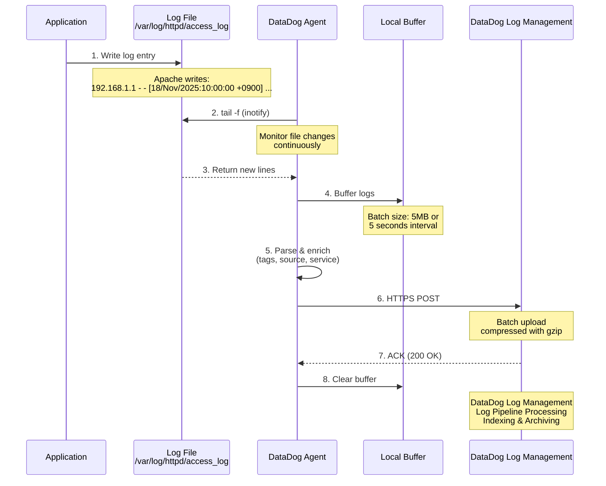

### 5.2 journald収集フロー

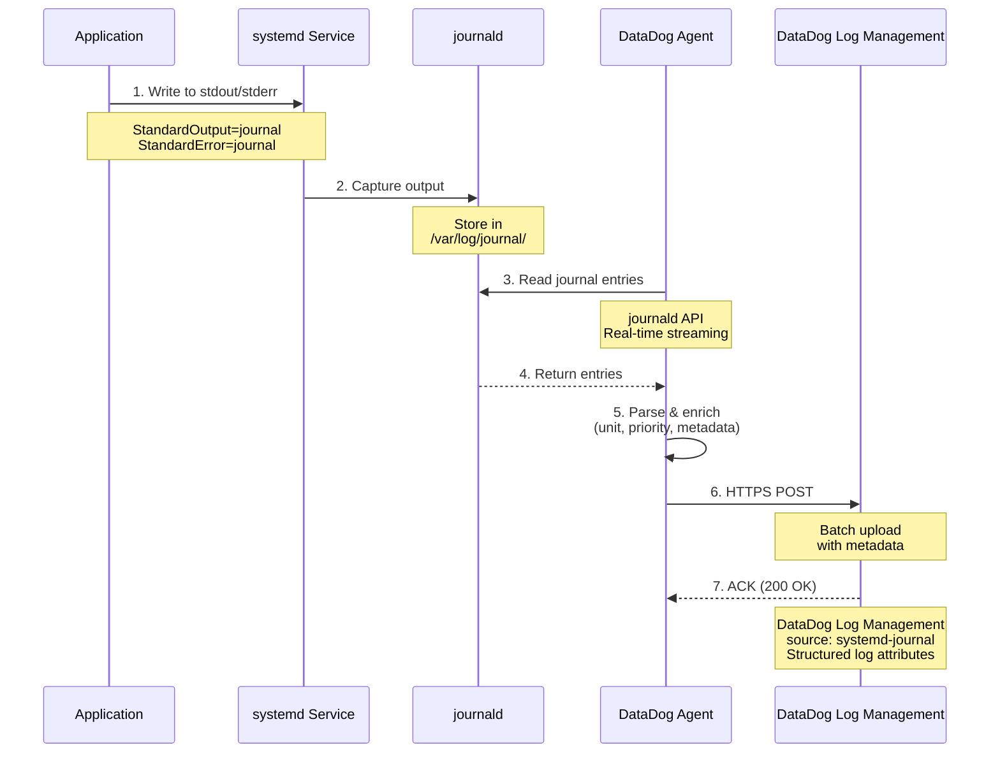

### 5.3 バッファリングとバッチ送信

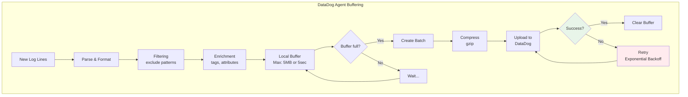

### 5.4 DataDog Log Management階層構造

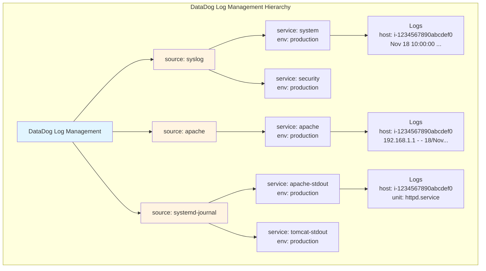

---

## 6. 標準出力ログの収集方法

### 6.1 標準出力ログアーキテクチャ

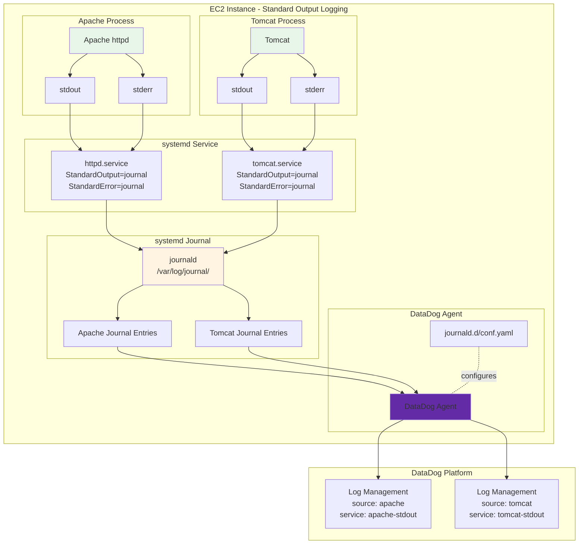

### 6.2 Apache標準出力設定

#### 6.2.1 Apache設定ファイル修正

```apache
# /etc/httpd/conf/httpd.conf

# 従来のファイル出力を無効化
# ErrorLog "logs/error_log"
# CustomLog "logs/access_log" combined

# 標準出力へリダイレクト
ErrorLog "|/bin/cat"
CustomLog "|/bin/cat" combined
```

#### 6.2.2 systemdサービス設定

```ini
# /etc/systemd/system/httpd.service.d/override.conf

[Service]
StandardOutput=journal
StandardError=journal

# journald設定
SyslogIdentifier=httpd
SyslogFacility=daemon
SyslogLevel=info
```

```bash
# systemd設定の適用
sudo systemctl daemon-reload
sudo systemctl restart httpd

# journald出力確認
sudo journalctl -u httpd -f
```

### 6.3 DataDog Agent設定 (標準出力ログ)

**設定ファイル:** `/etc/datadog-agent/conf.d/journald.d/conf.yaml`

```yaml
logs:
  # Apache stdout/stderr (journald経由)
  - type: journald
    container_mode: false
    include_units:
      - httpd.service
    source: apache
    service: apache-stdout
    tags:
      - env:production
      - log_type:stdout

  # Tomcat stdout/stderr (journald経由)
  - type: journald
    container_mode: false
    include_units:
      - tomcat.service
    source: tomcat
    service: tomcat-stdout
    tags:
      - env:production
      - log_type:stdout
```

### 6.4 標準出力ログフロー

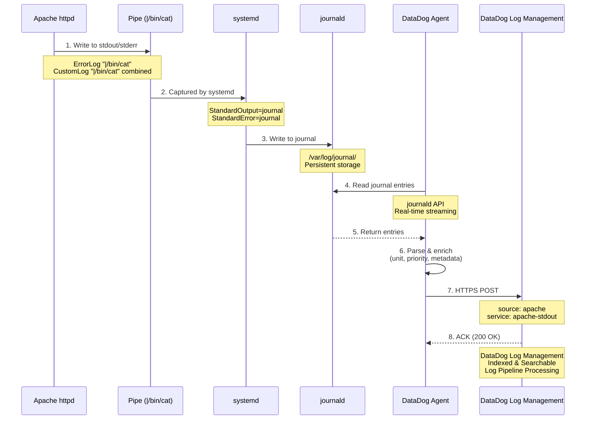

---

## 7. 運用管理

### 7.1 ログローテーション

#### 7.1.1 ファイルベースログの場合

```bash
# /etc/logrotate.d/httpd
/var/log/httpd/*log {
    daily
    rotate 30
    missingok
    notifempty
    sharedscripts
    delaycompress
    postrotate
        /bin/systemctl reload httpd.service > /dev/null 2>/dev/null || true
    endscript
}
```

**Note:** DataDog Agentはログローテーション後も自動的に新しいファイルを追跡します（inotify使用）。

#### 7.1.2 標準出力ログの場合（journald）

```bash
# journaldの自動クリーンアップ設定
# /etc/systemd/journald.conf

[Journal]
SystemMaxUse=1G
SystemMaxFileSize=100M
MaxRetentionSec=7day
```

```bash
# 設定適用
sudo systemctl restart systemd-journald

# journald使用状況確認
sudo journalctl --disk-usage
```

### 7.2 監視とアラート

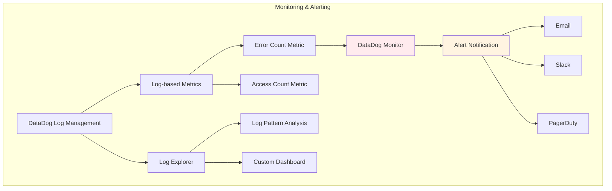

### 7.3 DataDog Log Explorer クエリ例

```
# Apache access_logからステータスコード500のエラー抽出
source:apache service:apache @http.status_code:>=500

# error_logからERRORレベルのログ抽出
source:apache service:apache @level:ERROR

# SSH/SSMログインイベント検知
source:syslog service:security @message:"session opened for user ec2-user"

# 特定ホストのログフィルタ
source:apache host:i-1234567890abcdef0

# 時間範囲指定（過去1時間）
source:apache @timestamp:[now-1h TO now]

# 複合条件
source:apache service:apache @http.status_code:>=500 @http.method:POST
```

### 7.4 Agent状態監視

```bash
#!/bin/bash
# DataDog Agent監視スクリプト

# Agent状態確認
if ! systemctl is-active --quiet datadog-agent; then
    echo "ERROR: DataDog Agent is not running"
    
    # Agent再起動
    sudo systemctl restart datadog-agent
    
    # DataDog Eventへ送信
    curl -X POST "https://api.datadoghq.com/api/v1/events" \
      -H "DD-API-KEY: ${DD_API_KEY}" \
      -H "Content-Type: application/json" \
      -d '{
        "title": "DataDog Agent Stopped",
        "text": "DataDog Agent stopped on '"$(hostname)"'",
        "priority": "normal",
        "tags": ["env:production", "alert:agent"],
        "alert_type": "error"
      }'
fi

# ログ送信遅延確認
AGENT_STATUS=$(sudo datadog-agent status | grep "Logs Sent" | awk '{print $3}')

if [ "$AGENT_STATUS" = "0" ]; then
    echo "WARNING: No logs sent in recent period"
fi
```

---

## 8. トラブルシューティング

### 8.1 Agent起動失敗

```bash
# Agentログ確認
sudo tail -f /var/log/datadog/agent.log

# Agent状態詳細確認
sudo datadog-agent status

# API Key確認
sudo datadog-agent config | grep api_key

# ネットワーク接続確認
curl -v https://agent-intake-prd.datadoghq.com
```

### 8.2 ログが送信されない

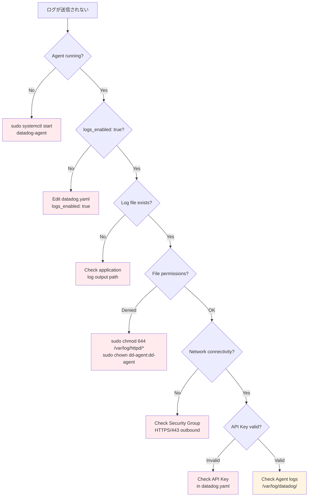

### 8.3 よくあるエラーと対処法

```yaml
エラー1: "API key is invalid"
原因: DataDog APIキーが正しくない
対処: datadog.yamlのapi_keyを確認、再設定

エラー2: "Connection refused"
原因: ネットワーク接続問題またはProxy設定
対処: Security Groupの443番ポート確認、Proxy設定確認

エラー3: "Permission denied"
原因: ログファイルの読み取り権限がない
対処: chmod 644 /var/log/*, dd-agentユーザーに権限付与

エラー4: "No valid logs configuration found"
原因: conf.d/配下に有効なログ設定がない
対処: conf.yamlのlogs:セクション確認、configcheckで検証

エラー5: "Log file not found"
原因: 設定ファイルのパスが間違っている
対処: pathの確認、ワイルドカードの使用検討
```

### 8.4 デバッグモードの有効化

```bash
# デバッグモード有効化
sudo datadog-agent config set log_level debug
sudo datadog-agent config set logs_config.log_level debug

# Agent再起動
sudo systemctl restart datadog-agent

# デバッグログ確認
sudo tail -f /var/log/datadog/agent.log | grep DEBUG

# デバッグモード無効化
sudo datadog-agent config set log_level info
sudo systemctl restart datadog-agent
```

---

## 9. ログ監視とアラート

DataDog Log Managementに収集したログを監視し、特定のパターンを検知してアラートを発出する方法を解説します。

### 9.1 Log-based Metricsの概要

**Log-based Metrics**は、DataDogのログストリームから特定のパターンにマッチするログエントリを検出し、メトリクスとして数値化する機能です。

#### 9.1.1 Log-based Metricsの仕組み

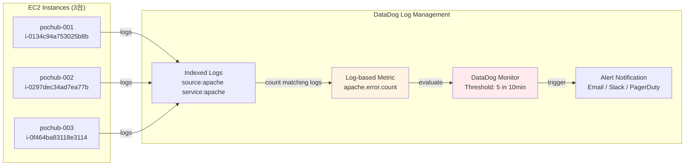

#### 9.1.2 主要な機能

| 機能 | 説明 | ユースケース |
|------|------|--------------|
| **Count Metric** | マッチするログの件数をカウント | エラーログの検出 |
| **Distribution Metric** | ログ内の数値を分布として集計 | レスポンスタイムの分析 |
| **グループ化** | タグでグループ化して集計 | ホスト別、サービス別の集計 |
| **除外フィルタ** | 特定のログを除外 | ノイズ除去 |

#### 9.1.3 ログ集約のポイント

**重要:** Log-based Metricsは全ホストのログを自動的に集約します。

```yaml
ログ構造:
  DataDog Log Management:
    ├─ host: i-0134c94a753025b8b (pochub-001)
    ├─ host: i-0297dec34ad7ea77b (pochub-002)
    └─ host: i-0f464ba83118e3114 (pochub-003)
    
    source: apache
    service: apache
    env: production

Log-based Metricsの動作:
  1. 全ホストのログをスキャン
  2. クエリにマッチするログを検出
  3. 合計値をメトリクスに記録
  
結果:
  - 3台の合計が自動的にカウントされる
  - ホスト台数の変更に自動対応
  - タグでグループ化可能（host, service, env等）
```

---

### 9.2 Log-based Metricsの実装

#### 9.2.1 DataDog UIでの作成

1. **Logs → Generate Metrics**
2. **New Metric** をクリック
3. クエリを入力:
   ```
   source:apache service:apache @level:ERROR
   ```
4. メトリクス設定:
   - **Metric Name**: `apache.error.count`
   - **Type**: Count
   - **Group by**: `host`, `env`, `service`

#### 9.2.2 APIでの作成

```bash
#!/bin/bash
# Log-based Metricの作成

DD_API_KEY="your-api-key-here"
DD_APP_KEY="your-app-key-here"

# Count Metric: エラーログ件数
curl -X POST "https://api.datadoghq.com/api/v2/logs/config/metrics" \
  -H "DD-API-KEY: ${DD_API_KEY}" \
  -H "DD-APPLICATION-KEY: ${DD_APP_KEY}" \
  -H "Content-Type: application/json" \
  -d '{
    "data": {
      "type": "logs_metrics",
      "id": "apache.error.count",
      "attributes": {
        "compute": {
          "aggregation_type": "count"
        },
        "filter": {
          "query": "source:apache service:apache @level:ERROR"
        },
        "group_by": [
          {
            "path": "host",
            "tag_name": "host"
          },
          {
            "path": "env",
            "tag_name": "env"
          }
        ]
      }
    }
  }'
```

#### 9.2.3 Distribution Metric（応答時間分布）

```bash
# Distribution Metric: Apache応答時間
curl -X POST "https://api.datadoghq.com/api/v2/logs/config/metrics" \
  -H "DD-API-KEY: ${DD_API_KEY}" \
  -H "DD-APPLICATION-KEY: ${DD_APP_KEY}" \
  -H "Content-Type: application/json" \
  -d '{
    "data": {
      "type": "logs_metrics",
      "id": "apache.response_time",
      "attributes": {
        "compute": {
          "aggregation_type": "distribution",
          "path": "@duration"
        },
        "filter": {
          "query": "source:apache service:apache"
        },
        "group_by": [
          {
            "path": "host",
            "tag_name": "host"
          },
          {
            "path": "@http.status_code",
            "tag_name": "status_code"
          }
        ]
      }
    }
  }'
```

#### 9.2.4 Log-based Metricsの確認

```bash
# Metric一覧取得
curl -X GET "https://api.datadoghq.com/api/v2/logs/config/metrics" \
  -H "DD-API-KEY: ${DD_API_KEY}" \
  -H "DD-APPLICATION-KEY: ${DD_APP_KEY}"

# 特定Metricの削除
curl -X DELETE "https://api.datadoghq.com/api/v2/logs/config/metrics/apache.error.count" \
  -H "DD-API-KEY: ${DD_API_KEY}" \
  -H "DD-APPLICATION-KEY: ${DD_APP_KEY}"
```

---

### 9.3 DataDog Monitorsの設定

Log-based Metricsに対してモニターを設定します。

#### 9.3.1 基本的なモニター設定

**要件: 10分間で5回以上エラーが発生したらアラート**

**DataDog UI:**
1. **Monitors → New Monitor → Metric**
2. **Define the metric**:
   - Metric: `apache.error.count`
   - `sum` by `host`, `env`
3. **Set alert conditions**:
   - Alert threshold: `>= 5`
   - Warning threshold: `>= 3`
   - Timeframe: `10 minutes`
4. **Notify your team**:
   - Email, Slack, PagerDuty等

**APIでの作成:**

```bash
curl -X POST "https://api.datadoghq.com/api/v1/monitor" \
  -H "DD-API-KEY: ${DD_API_KEY}" \
  -H "DD-APPLICATION-KEY: ${DD_APP_KEY}" \
  -H "Content-Type: application/json" \
  -d '{
    "name": "Apache Error High Rate",
    "type": "metric alert",
    "query": "sum(last_10m):sum:apache.error.count{env:production}.as_count() >= 5",
    "message": "Apache error count exceeded threshold. @slack-alerts @pagerduty",
    "tags": ["env:production", "service:apache"],
    "options": {
      "notify_no_data": false,
      "no_data_timeframe": 20,
      "renotify_interval": 0,
      "thresholds": {
        "critical": 5,
        "warning": 3
      },
      "include_tags": true,
      "require_full_window": true
    }
  }'
```

#### 9.3.2 高度なモニター設定

**異常検知（Anomaly Detection）**

```bash
curl -X POST "https://api.datadoghq.com/api/v1/monitor" \
  -H "DD-API-KEY: ${DD_API_KEY}" \
  -H "DD-APPLICATION-KEY: ${DD_APP_KEY}" \
  -H "Content-Type: application/json" \
  -d '{
    "name": "Apache Error Anomaly Detection",
    "type": "query alert",
    "query": "avg(last_1h):anomalies(sum:apache.error.count{env:production}.as_count(), '\''basic'\'', 2) >= 1",
    "message": "Anomalous error count detected in Apache logs. @slack-alerts",
    "tags": ["env:production", "service:apache", "alert:anomaly"],
    "options": {
      "notify_no_data": false,
      "thresholds": {
        "critical": 1,
        "critical_recovery": 0
      }
    }
  }'
```

**複合条件（Composite Monitor）**

```bash
# Monitor 1: エラーログ監視 (ID: 12345)
# Monitor 2: CPU使用率監視 (ID: 67890)

# Composite Monitor: 両方が同時に発火
curl -X POST "https://api.datadoghq.com/api/v1/monitor" \
  -H "DD-API-KEY: ${DD_API_KEY}" \
  -H "DD-APPLICATION-KEY: ${DD_APP_KEY}" \
  -H "Content-Type: application/json" \
  -d '{
    "name": "Apache Error + High CPU",
    "type": "composite",
    "query": "12345 && 67890",
    "message": "Both Apache errors and high CPU detected. @pagerduty-critical",
    "tags": ["env:production", "alert:composite"]
  }'
```

#### 9.3.3 通知チャネルの設定

**Slack統合:**

```bash
# DataDog UI: Integrations → Slack → Configuration
# Webhook URLを設定後、@slack-channel で通知可能

# モニターメッセージ例:
# {{#is_alert}}
# Alert: Apache error count is {{value}} (threshold: {{threshold}})
# Host: {{host.name}}
# @slack-alerts
# {{/is_alert}}
```

**PagerDuty統合:**

```bash
# DataDog UI: Integrations → PagerDuty → Configuration
# Service API Keyを設定後、@pagerduty で通知可能
```

#### 9.3.4 モニターの確認と管理

```bash
# モニター一覧取得
curl -X GET "https://api.datadoghq.com/api/v1/monitor" \
  -H "DD-API-KEY: ${DD_API_KEY}" \
  -H "DD-APPLICATION-KEY: ${DD_APP_KEY}"

# 特定モニターの詳細
curl -X GET "https://api.datadoghq.com/api/v1/monitor/12345" \
  -H "DD-API-KEY: ${DD_API_KEY}" \
  -H "DD-APPLICATION-KEY: ${DD_APP_KEY}"

# モニターのミュート
curl -X POST "https://api.datadoghq.com/api/v1/monitor/12345/mute" \
  -H "DD-API-KEY: ${DD_API_KEY}" \
  -H "DD-APPLICATION-KEY: ${DD_APP_KEY}"

# モニターのミュート解除
curl -X POST "https://api.datadoghq.com/api/v1/monitor/12345/unmute" \
  -H "DD-API-KEY: ${DD_API_KEY}" \
  -H "DD-APPLICATION-KEY: ${DD_APP_KEY}"

# モニターの削除
curl -X DELETE "https://api.datadoghq.com/api/v1/monitor/12345" \
  -H "DD-API-KEY: ${DD_API_KEY}" \
  -H "DD-APPLICATION-KEY: ${DD_APP_KEY}"
```

---

### 9.4 実装例とパターン

#### 9.4.1 Apache 5xxエラー監視

```bash
# Log-based Metric作成
curl -X POST "https://api.datadoghq.com/api/v2/logs/config/metrics" \
  -H "DD-API-KEY: ${DD_API_KEY}" \
  -H "DD-APPLICATION-KEY: ${DD_APP_KEY}" \
  -H "Content-Type: application/json" \
  -d '{
    "data": {
      "type": "logs_metrics",
      "id": "apache.5xx.count",
      "attributes": {
        "compute": {
          "aggregation_type": "count"
        },
        "filter": {
          "query": "source:apache service:apache @http.status_code:[500 TO 599]"
        },
        "group_by": [
          {
            "path": "host",
            "tag_name": "host"
          },
          {
            "path": "@http.status_code",
            "tag_name": "status_code"
          }
        ]
      }
    }
  }'

# Monitor作成
curl -X POST "https://api.datadoghq.com/api/v1/monitor" \
  -H "DD-API-KEY: ${DD_API_KEY}" \
  -H "DD-APPLICATION-KEY: ${DD_APP_KEY}" \
  -H "Content-Type: application/json" \
  -d '{
    "name": "Apache 5xx Error Rate High",
    "type": "metric alert",
    "query": "sum(last_10m):sum:apache.5xx.count{env:production}.as_count() >= 10",
    "message": "5xx error rate is high: {{value}} errors in 10 minutes. @slack-alerts",
    "tags": ["env:production", "service:apache", "alert:5xx"]
  }'
```

#### 9.4.2 SSH不正ログイン試行監視

```bash
# Log-based Metric作成
curl -X POST "https://api.datadoghq.com/api/v2/logs/config/metrics" \
  -H "DD-API-KEY: ${DD_API_KEY}" \
  -H "DD-APPLICATION-KEY: ${DD_APP_KEY}" \
  -H "Content-Type: application/json" \
  -d '{
    "data": {
      "type": "logs_metrics",
      "id": "ssh.failed_login.count",
      "attributes": {
        "compute": {
          "aggregation_type": "count"
        },
        "filter": {
          "query": "source:syslog service:security @message:\"Failed password\""
        },
        "group_by": [
          {
            "path": "host",
            "tag_name": "host"
          }
        ]
      }
    }
  }'

# Monitor作成
curl -X POST "https://api.datadoghq.com/api/v1/monitor" \
  -H "DD-API-KEY: ${DD_API_KEY}" \
  -H "DD-APPLICATION-KEY: ${DD_APP_KEY}" \
  -H "Content-Type: application/json" \
  -d '{
    "name": "SSH Failed Login Attempts",
    "type": "metric alert",
    "query": "sum(last_5m):sum:ssh.failed_login.count{env:production}.as_count() >= 5",
    "message": "Multiple SSH failed login attempts detected on {{host.name}}. @pagerduty-security",
    "tags": ["env:production", "alert:security", "type:ssh"]
  }'
```

#### 9.4.3 パッケージ更新監視

```bash
# Log-based Metric作成
curl -X POST "https://api.datadoghq.com/api/v2/logs/config/metrics" \
  -H "DD-API-KEY: ${DD_API_KEY}" \
  -H "DD-APPLICATION-KEY: ${DD_APP_KEY}" \
  -H "Content-Type: application/json" \
  -d '{
    "data": {
      "type": "logs_metrics",
      "id": "dnf.package_update.count",
      "attributes": {
        "compute": {
          "aggregation_type": "count"
        },
        "filter": {
          "query": "source:dnf service:package-manager @message:\"Upgraded:\""
        },
        "group_by": [
          {
            "path": "host",
            "tag_name": "host"
          }
        ]
      }
    }
  }'
```

---

### 9.5 コスト試算

#### 9.5.1 DataDog Log Management料金

```yaml
DataDog Log Management料金 (2025年11月時点):
  Ingestion (取り込み):
    - $0.10 per GB ingested
  
  Indexing (インデックス化):
    - 15日間保持: $1.70 per million log events
    - 30日間保持: $2.00 per million log events
    - 90日間保持: $2.55 per million log events
  
  Online Archives (オンラインアーカイブ):
    - $0.025 per GB per month
  
  Rehydration (再ハイドレーション):
    - $0.017 per GB

ログ量試算:
  1台あたり:
    - /var/log/messages: ~50 MB/day
    - /var/log/secure: ~10 MB/day
    - /var/log/httpd/access_log: ~100 MB/day
    - /var/log/httpd/error_log: ~20 MB/day
    合計: ~180 MB/day = ~5.4 GB/month
  
  3台構成:
    - 合計: ~16.2 GB/month

月額コスト試算:
  Ingestion: 16.2 GB × $0.10 = $1.62
  Indexing (15日保持): 
    - 約500万イベント/月 × $1.70/百万 = $8.50
  
  合計: $10.12/月 (3台構成)
```

#### 9.5.2 CloudWatch Logsとの比較

```yaml
CloudWatch Logs料金 (2025年11月時点):
  Data Ingestion: $0.50 per GB
  Data Storage: $0.03 per GB per month
  
  3台構成 (16.2 GB/month):
    Ingestion: 16.2 GB × $0.50 = $8.10
    Storage (30日): 16.2 GB × $0.03 = $0.49
    合計: $8.59/月

コスト比較:
  CloudWatch Logs: $8.59/月
  DataDog: $10.12/月
  差額: +$1.53/月 (+17.8%)

DataDogの追加価値:
  - 統合監視（ログ・メトリクス・APM・トレース）
  - 高度な検索・分析機能
  - カスタムダッシュボード
  - 機械学習による異常検知
  - 400+のインテグレーション
```

---

## 10. コスト分析

### 10.1 総合コスト比較

```yaml
小規模環境 (3台のEC2):
  CloudWatch Logs:
    - Agent: 無料
    - Data Ingestion: $8.10/月
    - Data Storage: $0.49/月
    - 合計: $8.59/月
  
  DataDog:
    - Infrastructure Monitoring: $15/host/月 × 3 = $45/月
    - Log Management: $10.12/月
    - 合計: $55.12/月
  
  コスト差: +$46.53/月 (+541%)

中規模環境 (10台のEC2):
  CloudWatch Logs:
    - 合計: ~$28.63/月
  
  DataDog:
    - Infrastructure Monitoring: $15/host/月 × 10 = $150/月
    - Log Management: $33.73/月
    - 合計: $183.73/月
  
  コスト差: +$155.10/月 (+542%)

大規模環境 (50台のEC2):
  CloudWatch Logs:
    - 合計: ~$143.15/月
  
  DataDog:
    - Infrastructure Monitoring: $15/host/月 × 50 = $750/月
    - Log Management: $168.65/月
    - 合計: $918.65/月
  
  コスト差: +$775.50/月 (+542%)
```

### 10.2 選定基準

```yaml
CloudWatch Logsを選ぶべきケース:
  - 小規模環境（10台以下）
  - コスト重視
  - AWSエコシステム内で完結
  - ログ収集のみで十分
  - 既存のAWSスキルを活用

DataDogを選ぶべきケース:
  - 統合監視が必要（ログ・メトリクス・APM）
  - 高度な分析・可視化が必要
  - マルチクラウド環境
  - 開発チームの生産性重視
  - 機械学習による異常検知が必要
  - 複数サービスのインテグレーション
```

---

## 11. まとめ

### 11.1 DataDog Agentによるログ収集の特徴

```yaml
メリット:
  統合監視:
    - ログ、メトリクス、APM、トレースを1プラットフォームで管理
    - 相関分析が容易
  
  高度な機能:
    - 強力な検索・フィルタリング機能
    - カスタムダッシュボード
    - 機械学習による異常検知
    - Log-based Metrics
    - Log Patternsによる自動分類
  
  開発者体験:
    - 直感的なUI
    - リアルタイム検索
    - 豊富なインテグレーション（400+）
    - API/CLI完備
  
  運用性:
    - Agent側でのログ処理（マスキング、フィルタリング）
    - 柔軟な通知設定（Email、Slack、PagerDuty等）
    - ダウンタイムスケジュール機能

デメリット:
  コスト:
    - CloudWatch Logsの5-6倍のコスト
    - ホスト数に比例して増加
  
  ロックイン:
    - DataDog固有の機能への依存
    - 移行コストが高い
  
  学習コスト:
    - DataDog特有の概念・用語
    - API/CLIの習得が必要
```

### 11.2 推奨構成

```yaml
新規プロジェクト:
  - 方式C: アプリケーションログstdout化 + journald単体
  - 理由: 12-factor app準拠、コンテナ化対応、最もコスト効率が良い

既存システム移行:
  - 方式B: journald + rsyslog（ハイブリッド）
  - 理由: 従来の運用手順を維持しながら、段階的に方式Cへ移行可能

小規模環境（~10台）:
  - CloudWatch Logs推奨
  - 理由: コスト効率、AWSネイティブ

中規模以上（10台~）:
  - DataDog推奨（統合監視が必要な場合）
  - 理由: 統合監視の価値がコスト増を上回る
```

### 11.3 次のステップ

```yaml
1. ログ収集の実装:
   - DataDog Agent インストール
   - 基本設定（datadog.yaml）
   - ログ収集設定（conf.d/）

2. ログ監視の設定:
   - Log-based Metrics作成
   - DataDog Monitors設定
   - 通知チャネル設定（Slack、PagerDuty）

3. ダッシュボード作成:
   - カスタムダッシュボード
   - ログパターン分析
   - APMとの相関分析

4. 運用最適化:
   - ログローテーション設定
   - コスト最適化（フィルタリング、サンプリング）
   - アラート閾値の調整
```

---

**参考資料:**
- [DataDog公式ドキュメント - Log Management](https://docs.datadoghq.com/logs/)
- [DataDog Agent - GitHub](https://github.com/DataDog/datadog-agent)
- [DataDog API Documentation](https://docs.datadoghq.com/api/latest/)
- [EC2システム設計書兼詳細設計書.md](./03.server-architecture.md)

# 9. systemdサービス確認
sudo systemctl status datadog-agent
```

**トラブルシューティング:**

```bash
# Agentログの確認
sudo tail -f /var/log/datadog/agent.log

# ログ収集デバッグモード有効化
sudo datadog-agent config set logs_config.log_level debug
sudo systemctl restart datadog-agent

# 特定のインテグレーションのチェック
sudo datadog-agent check apache
sudo datadog-agent check journald
```

---
