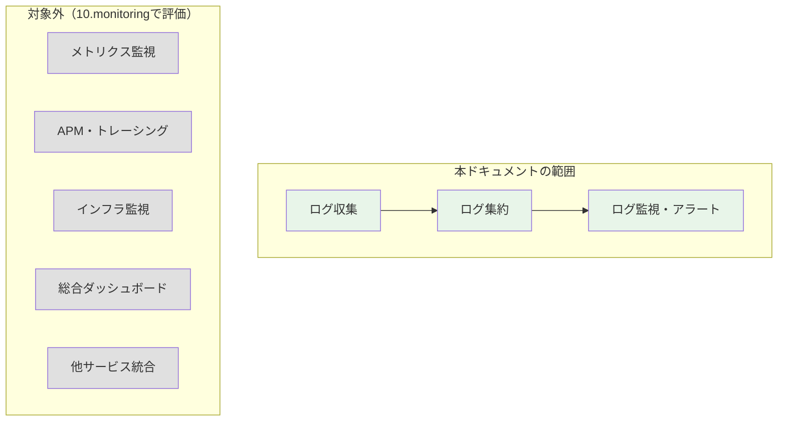
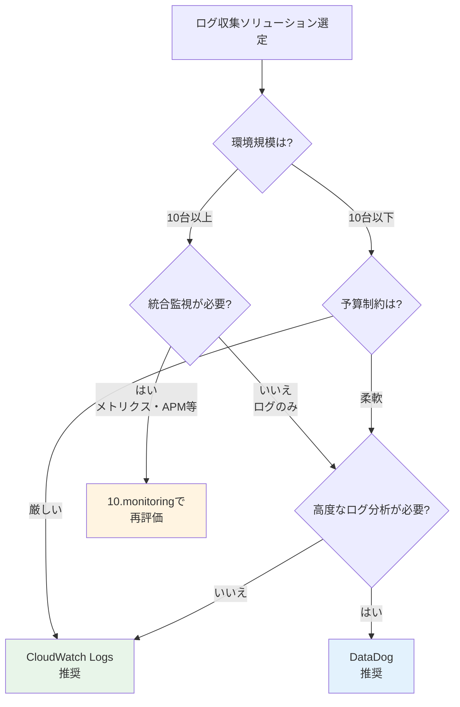
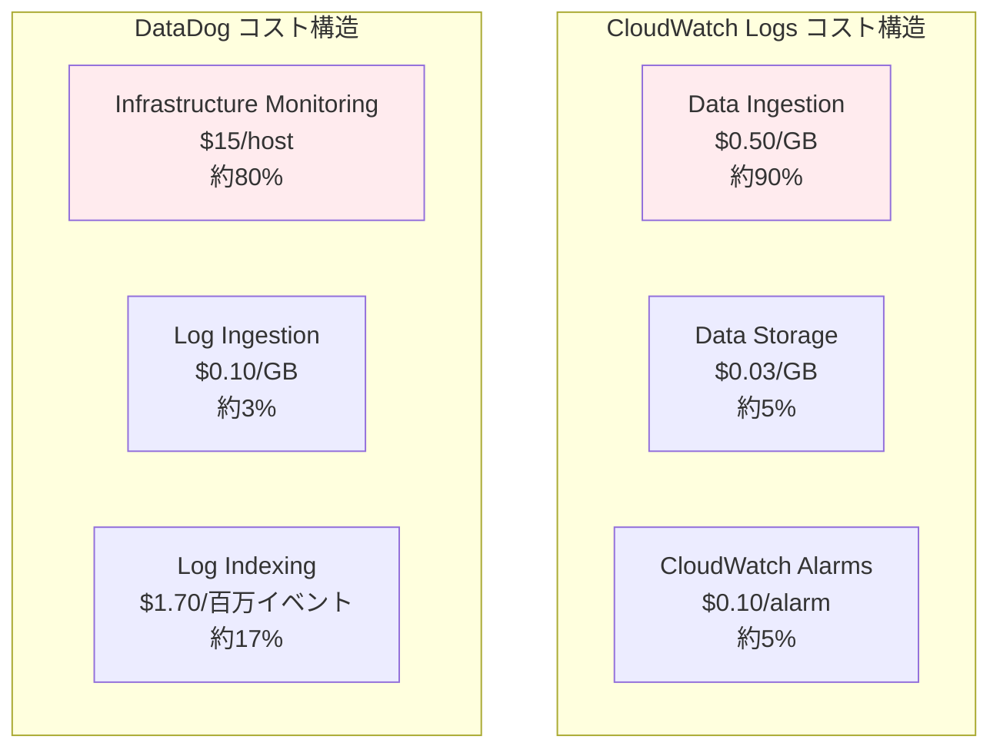
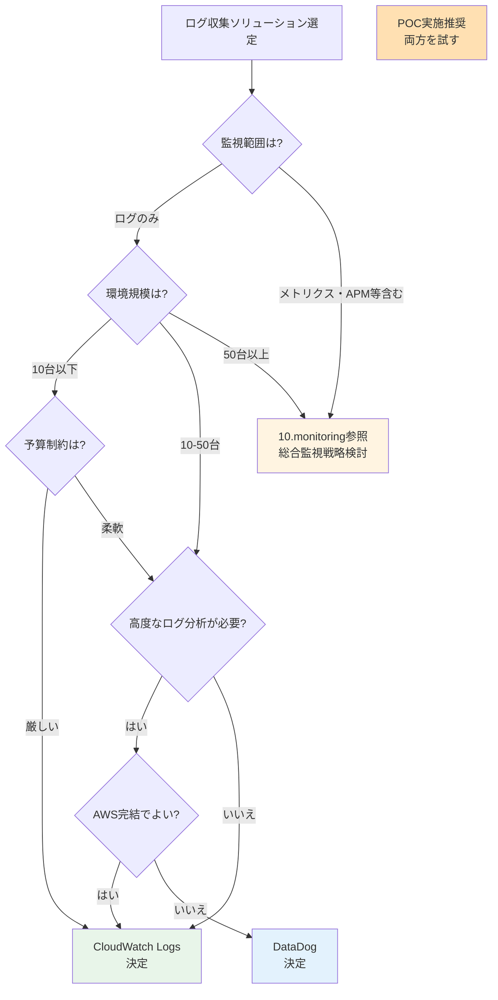

# ログ収集ソリューション比較ガイド

## 目次

- [ログ収集ソリューション比較ガイド](#ログ収集ソリューション比較ガイド)
  - [目次](#目次)
  - [1. 本ドキュメントの目的](#1-本ドキュメントの目的)
    - [1.1 比較対象](#11-比較対象)
    - [1.2 比較の範囲](#12-比較の範囲)
    - [1.3 対象読者](#13-対象読者)
  - [2. エグゼクティブサマリー](#2-エグゼクティブサマリー)
    - [2.1 総合評価](#21-総合評価)
    - [2.2 推奨シナリオ](#22-推奨シナリオ)
    - [2.3 意思決定のポイント](#23-意思決定のポイント)
  - [3. 機能比較マトリクス](#3-機能比較マトリクス)
    - [3.1 ログ収集機能](#31-ログ収集機能)
    - [3.2 ログ集約・転送機能](#32-ログ集約転送機能)
    - [3.3 ログ監視・アラート機能](#33-ログ監視アラート機能)
    - [3.4 運用性](#34-運用性)
  - [4. アーキテクチャ比較](#4-アーキテクチャ比較)
    - [4.1 全体構成の違い](#41-全体構成の違い)
    - [4.2 ログフローの比較](#42-ログフローの比較)
    - [4.3 データ階層構造の違い](#43-データ階層構造の違い)
  - [5. コスト比較](#5-コスト比較)
    - [5.1 環境規模別コスト試算](#51-環境規模別コスト試算)
    - [5.2 コスト構造の違い](#52-コスト構造の違い)
    - [5.3 コスト最適化の考慮点](#53-コスト最適化の考慮点)
  - [6. 実装難易度比較](#6-実装難易度比較)
    - [6.1 初期セットアップ](#61-初期セットアップ)
    - [6.2 設定の複雑さ](#62-設定の複雑さ)
    - [6.3 学習コスト](#63-学習コスト)
  - [7. ユースケース別推奨](#7-ユースケース別推奨)
    - [7.1 小規模環境（EC2: 1-10台）](#71-小規模環境ec2-1-10台)
    - [7.2 中規模環境（EC2: 10-50台）](#72-中規模環境ec2-10-50台)
    - [7.3 大規模環境（EC2: 50台以上）](#73-大規模環境ec2-50台以上)
    - [7.4 特殊要件がある場合](#74-特殊要件がある場合)
  - [8. 移行シナリオ](#8-移行シナリオ)
    - [8.1 CloudWatch Logs → DataDog移行](#81-cloudwatch-logs--datadog移行)
    - [8.2 DataDog → CloudWatch Logs移行](#82-datadog--cloudwatch-logs移行)
    - [8.3 ハイブリッド運用](#83-ハイブリッド運用)
  - [9. リスク評価](#9-リスク評価)
    - [9.1 CloudWatch Logsのリスク](#91-cloudwatch-logsのリスク)
    - [9.2 DataDogのリスク](#92-datadogのリスク)
    - [9.3 リスク軽減策](#93-リスク軽減策)
  - [10. 意思決定フレームワーク](#10-意思決定フレームワーク)
    - [10.1 意思決定フローチャート](#101-意思決定フローチャート)
    - [10.2 評価スコアカード](#102-評価スコアカード)
    - [10.3 チェックリスト](#103-チェックリスト)
  - [11. 次のステップ](#11-次のステップ)
    - [11.1 総合監視戦略への統合](#111-総合監視戦略への統合)
    - [11.2 追加検証項目](#112-追加検証項目)
    - [11.3 参考資料](#113-参考資料)
  - [12. 改版履歴](#12-改版履歴)

---

## 1. 本ドキュメントの目的

### 1.1 比較対象

本ドキュメントでは、以下の2つのログ収集ソリューションを比較します。

| ソリューション | 対象ドキュメント | 範囲 |
|--------------|-----------------|------|
| **AWS CloudWatch Logs** | [LogCollectionMethodCloudWatch.md](./LogCollectionMethodCloudWatch.md) | CloudWatch Logs Agentによるログ収集・集約・アラート |
| **DataDog Log Management** | [LogCollectionMethodDataDog.md](./LogCollectionMethodDataDog.md) | DataDog Agentによるログ収集・集約・アラート |

### 1.2 比較の範囲



**本ドキュメントの焦点:**
- EC2インスタンスからのログ収集方法
- ログの集約・転送メカニズム
- ログベースの監視・アラート機能
- ログ収集に関するコスト
- ログ運用の難易度

**対象外（`10.monitoring`で総合評価）:**
- メトリクス監視機能
- APM（Application Performance Monitoring）
- インフラストラクチャ監視
- 統合ダッシュボード機能
- 他サービスとの統合性
- 総合的な運用コスト
- 組織全体の監視戦略

### 1.3 対象読者

- **プロジェクトマネージャー**: ソリューション選定の意思決定者
- **インフラエンジニア**: 実装・運用担当者
- **アーキテクト**: システム設計・技術選定責任者

---

## 2. エグゼクティブサマリー

### 2.1 総合評価

```yaml
CloudWatch Logs:
  総合評価: ★★★★☆ (4/5)
  
  強み:
    - コスト効率: ログ収集のみで月額$8-10/3台
    - AWS統合: IAM、VPCエンドポイント、他AWSサービスとシームレス
    - シンプル性: ログ収集に特化したシンプルな構成
    - ベンダーロックイン回避: AWSエコシステム内で完結
  
  弱み:
    - 機能制限: ログ検索・分析機能が基本的
    - UIの使いにくさ: Logs Insightsは学習曲線あり
    - 単機能: ログ以外の監視は別途実装が必要
  
  推奨ケース:
    - 小規模環境（10台以下）
    - コスト最優先
    - AWSエコシステム内で完結

DataDog Log Management:
  総合評価: ★★★★★ (5/5) ※ログ機能のみの評価
  
  強み:
    - 高度な検索・分析: リアルタイム検索、パターン分析
    - Agent側処理: マスキング、フィルタリング、マルチライン対応
    - 直感的なUI: 学習コストが低い
    - 統合性: メトリクス・APM・トレースと連携（本評価範囲外）
  
  弱み:
    - 高コスト: CloudWatch Logsの5-6倍（ログのみ）
    - ベンダーロックイン: DataDog固有機能への依存
    - 外部依存: datadoghq.comへの通信必須
  
  推奨ケース:
    - 統合監視プラットフォームが必要（10.monitoringで再評価）
    - 高度なログ分析が必要
    - 開発者体験重視
```

### 2.2 推奨シナリオ



### 2.3 意思決定のポイント

| 判断基準 | CloudWatch Logs優位 | DataDog優位 |
|---------|-------------------|-------------|
| **コスト** | ◎ ログ収集コストは1/6 | △ Infrastructure料金が別途必要 |
| **機能** | △ 基本的なログ検索・アラート | ◎ 高度な分析・可視化 |
| **実装難易度** | ○ IAM設定が複雑 | ○ API Key管理が簡単 |
| **運用性** | ○ AWS CLIで完結 | ◎ 直感的なUI |
| **拡張性** | △ ログ以外は別実装 | ◎ 統合監視への拡張容易 |

**重要な考慮事項:**
1. **ログ収集のみの比較**: DataDogのコスト高は統合監視機能込み（Infrastructure $15/host/月）
2. **総合監視戦略**: メトリクス・APM等を含めた総合評価は`10.monitoring`で実施
3. **段階的移行**: CloudWatch Logsで開始→将来DataDogへ移行も可能

---

## 3. 機能比較マトリクス

### 3.1 ログ収集機能

| 機能 | CloudWatch Logs | DataDog | 備考 |
|------|----------------|---------|------|
| **ファイルベース収集** | ◎ | ◎ | 両者とも対応 |
| **journald直接収集** | ◎ | ◎ | Amazon Linux 2023対応 |
| **標準出力ログ収集** | ◎ | ◎ | systemd経由 |
| **inotifyベース監視** | ◎ | ◎ | ファイル変更の即時検知 |
| **ログローテーション対応** | ◎ | ◎ | 自動追跡 |
| **マルチラインログ** | ○ 設定複雑 | ◎ 正規表現で柔軟 | DataDogの方が柔軟 |
| **Agent側フィルタリング** | △ 限定的 | ◎ 強力 | DataDogはexclude_at_match等 |
| **機密情報マスキング** | × 非対応 | ◎ 正規表現で対応 | DataDogのみ |
| **ログパース（JSON等）** | ○ Logs Insights時 | ◎ Agent側で可能 | DataDogはAgent側処理 |

**評価:**
- **CloudWatch Logs**: 基本的なログ収集機能は十分
- **DataDog**: Agent側での高度な前処理が可能（マスキング、フィルタリング）

### 3.2 ログ集約・転送機能

| 機能 | CloudWatch Logs | DataDog | 備考 |
|------|----------------|---------|------|
| **バッファリング** | ◎ 5秒または1MBバッチ | ◎ 5秒または5MBバッチ | DataDogの方が大きい |
| **圧縮転送** | ◎ gzip | ◎ gzip | 両者とも対応 |
| **再送処理** | ◎ 指数バックオフ | ◎ 指数バックオフ | 両者とも対応 |
| **ネットワーク要件** | ◎ HTTPS/443 | ◎ HTTPS/443 | 同じ |
| **VPCエンドポイント** | ◎ 対応（logs.region.amazonaws.com） | × 非対応 | CloudWatchのみ |
| **Proxy対応** | ◎ http_proxy環境変数 | ◎ proxy設定 | 両者とも対応 |
| **複数リージョン** | ○ リージョンごとに設定 | ◎ 単一エンドポイント | DataDogはグローバル |
| **タグ/属性付与** | ○ ログストリーム名のみ | ◎ 柔軟なタグ付け | DataDogの方が柔軟 |

**評価:**
- **CloudWatch Logs**: VPCエンドポイント対応でセキュアな通信可能
- **DataDog**: グローバルエンドポイントで管理がシンプル

### 3.3 ログ監視・アラート機能

| 機能 | CloudWatch Logs | DataDog | 備考 |
|------|----------------|---------|------|
| **ログベースメトリクス** | ◎ Metric Filters | ◎ Log-based Metrics | 両者とも対応 |
| **メトリクス集約** | ◎ 自動（ログストリーム横断） | ◎ 自動（ホスト横断） | 両者とも自動集約 |
| **閾値アラート** | ◎ CloudWatch Alarms | ◎ DataDog Monitors | 両者とも対応 |
| **異常検知** | ◎ Anomaly Detection | ◎ Anomaly Detection | 両者とも機械学習対応 |
| **複合条件** | ◎ Math Expression | ◎ Composite Monitor | 両者とも対応 |
| **通知チャネル** | ◎ SNS→多様な連携 | ◎ Email/Slack/PagerDuty等 | DataDogの方が直接統合 |
| **ダウンタイム管理** | △ EventBridge経由 | ◎ UI内で完結 | DataDogの方が簡単 |
| **アラートグルーピング** | △ 手動設定 | ◎ タグベース自動 | DataDogの方が柔軟 |

**評価:**
- **CloudWatch Logs**: SNS経由で柔軟な通知、AWS統合
- **DataDog**: 直感的なUI、アラート管理が容易

### 3.4 運用性

| 項目 | CloudWatch Logs | DataDog | 備考 |
|------|----------------|---------|------|
| **ログ検索UI** | △ Logs Insights（SQL-like） | ◎ 直感的な検索UI | DataDogの方が使いやすい |
| **リアルタイム検索** | ○ Live Tail可能 | ◎ 高速検索 | DataDogの方が高速 |
| **ログパターン分析** | × 非対応 | ◎ Log Patterns | DataDogのみ |
| **ダッシュボード** | ○ CloudWatch Dashboard | ◎ カスタムダッシュボード | DataDogの方が柔軟 |
| **API/CLI** | ◎ AWS CLI完備 | ◎ DataDog API/CLI | 両者とも対応 |
| **IaC対応** | ◎ CloudFormation | ○ Terraform | CloudWatch方が容易 |
| **Agent管理** | ○ SSM経由可能 | ◎ UI内で一元管理 | DataDogの方が簡単 |
| **ログ保持期間** | ○ 1日～無期限（設定必要） | ◎ 15/30/90日（プラン選択） | DataDogの方が明確 |
| **ログアーカイブ** | ◎ S3エクスポート | ◎ S3アーカイブ | 両者とも対応 |

**評価:**
- **CloudWatch Logs**: AWS CLI/CloudFormationとの統合性
- **DataDog**: 直感的なUI、運用の容易さ

---

## 4. アーキテクチャ比較

### 4.1 全体構成の違い

```mermaid
graph TB
    subgraph "CloudWatch Logs Architecture"
        EC2_CW[EC2 Instance<br/>CloudWatch Agent]
        VPC_EP_CW[VPC Endpoint<br/>オプション]
        CW_LOGS[CloudWatch Logs<br/>ログストリーム]
        CW_METRIC[CloudWatch Metrics<br/>Metric Filters]
        CW_ALARM[CloudWatch Alarms]
        SNS[Amazon SNS]
        
        EC2_CW -->|HTTPS/443<br/>IAM認証| VPC_EP_CW
        VPC_EP_CW --> CW_LOGS
        CW_LOGS --> CW_METRIC
        CW_METRIC --> CW_ALARM
        CW_ALARM --> SNS
    end
    
    subgraph "DataDog Architecture"
        EC2_DD[EC2 Instance<br/>DataDog Agent]
        DD_INTAKE[DataDog Agent Intake<br/>datadoghq.com]
        DD_LOGS[DataDog Log Management]
        DD_METRIC[Log-based Metrics]
        DD_MONITOR[DataDog Monitors]
        DD_NOTIFY[Notification Channels]
        
        EC2_DD -->|HTTPS/443<br/>API Key認証| DD_INTAKE
        DD_INTAKE --> DD_LOGS
        DD_LOGS --> DD_METRIC
        DD_METRIC --> DD_MONITOR
        DD_MONITOR --> DD_NOTIFY
    end
    
    style EC2_CW fill:#e8f5e9
    style EC2_DD fill:#e3f2fd
```



**主な違い:**

| 項目 | CloudWatch Logs | DataDog |
|------|----------------|---------|
| **認証方式** | IAM Role（EC2 Instance Profile） | API Key（環境変数またはSecrets Manager） |
| **エンドポイント** | リージョンごと（logs.region.amazonaws.com） | グローバル（agent-intake-prd.datadoghq.com） |
| **プライベート接続** | VPCエンドポイント対応 | 非対応（インターネット経由のみ） |
| **データロケーション** | リージョン内に保存 | DataDogリージョン（米国または欧州） |

### 4.2 ログフローの比較

**CloudWatch Logs:**
```
Application → File/journald → CloudWatch Agent → Buffering (1MB/5sec) 
  → gzip圧縮 → HTTPS POST → CloudWatch Logs (ログストリーム)
  → Metric Filters → CloudWatch Metrics → CloudWatch Alarms → SNS
```

**DataDog:**
```
Application → File/journald → DataDog Agent → 前処理（マスキング/フィルタリング）
  → Buffering (5MB/5sec) → gzip圧縮 → HTTPS POST → DataDog Log Management
  → Log-based Metrics → DataDog Monitors → Notification Channels
```

**違いのポイント:**
- **DataDog**: Agent側で高度な前処理（マスキング、フィルタリング、パース）
- **CloudWatch Logs**: Agent側は最小限、処理はCloudWatch側

### 4.3 データ階層構造の違い

**CloudWatch Logs階層:**
```yaml
Log Group: /aws/ec2/pochub/apache
  ├─ Log Stream: i-0134c94a753025b8b
  │   └─ Log Events (時系列)
  ├─ Log Stream: i-0297dec34ad7ea77b
  │   └─ Log Events (時系列)
  └─ Log Stream: i-0f464ba83118e3114
      └─ Log Events (時系列)

特徴:
  - ログストリーム単位でホスト分離
  - Metric Filtersはロググループ全体に適用
  - 検索時はログストリームを横断可能
```

**DataDog階層:**
```yaml
DataDog Log Management:
  ├─ source: apache, service: apache, env: production
  │   ├─ host: i-0134c94a753025b8b
  │   ├─ host: i-0297dec34ad7ea77b
  │   └─ host: i-0f464ba83118e3114
  └─ source: syslog, service: system, env: production
      ├─ host: i-0134c94a753025b8b
      ├─ host: i-0297dec34ad7ea77b
      └─ host: i-0f464ba83118e3114

特徴:
  - タグベースでフラットに管理
  - source/service/env等で自由に分類
  - 検索時はタグで柔軟にフィルタ
```

---

## 5. コスト比較

### 5.1 環境規模別コスト試算

**前提条件:**
- ログ量: 180MB/day/host = 5.4GB/month/host
- ログイベント: ~500万イベント/month/host
- 保持期間: 30日

**小規模環境（3台のEC2）:**

```yaml
CloudWatch Logs:
  Data Ingestion: 16.2GB × $0.50/GB = $8.10
  Data Storage: 16.2GB × $0.03/GB = $0.49
  Metric Filters: 3個 × $0 = $0（初回10個無料）
  CloudWatch Alarms: 3個 × $0.10 = $0.30
  合計: $8.89/月

DataDog:
  Infrastructure Monitoring: 3台 × $15/host = $45.00
  Log Ingestion: 16.2GB × $0.10/GB = $1.62
  Log Indexing (15日保持): 500万イベント × $1.70/百万 = $8.50
  合計: $55.12/月

差額: +$46.23/月 (+520%)
```

**中規模環境（10台のEC2）:**

```yaml
CloudWatch Logs:
  Data Ingestion: 54GB × $0.50/GB = $27.00
  Data Storage: 54GB × $0.03/GB = $1.62
  Metric Filters: 5個 × $0 = $0（初回10個無料）
  CloudWatch Alarms: 5個 × $0.10 = $0.50
  合計: $29.12/月

DataDog:
  Infrastructure Monitoring: 10台 × $15/host = $150.00
  Log Ingestion: 54GB × $0.10/GB = $5.40
  Log Indexing (15日保持): 1,667万イベント × $1.70/百万 = $28.34
  合計: $183.74/月

差額: +$154.62/月 (+531%)
```

**大規模環境（50台のEC2）:**

```yaml
CloudWatch Logs:
  Data Ingestion: 270GB × $0.50/GB = $135.00
  Data Storage: 270GB × $0.03/GB = $8.10
  Metric Filters: 10個 × $0 = $0（初回10個無料）
  CloudWatch Alarms: 10個 × $0.10 = $1.00
  合計: $144.10/月

DataDog:
  Infrastructure Monitoring: 50台 × $15/host = $750.00
  Log Ingestion: 270GB × $0.10/GB = $27.00
  Log Indexing (15日保持): 8,333万イベント × $1.70/百万 = $141.66
  合計: $918.66/月

差額: +$774.56/月 (+537%)
```

### 5.2 コスト構造の違い



**重要な違い:**
1. **CloudWatch Logs**: 従量課金中心（ログ量に比例）
2. **DataDog**: 固定費（Infrastructure）+ 従量課金（ログ量）
3. **DataDogの固定費**: Infrastructure Monitoringが必須（ログ機能込み）

### 5.3 コスト最適化の考慮点

**CloudWatch Logs:**
```yaml
最適化手法:
  ログ量削減:
    - Agent側でのサンプリング（制限的）
    - 不要なログの除外（ログローテーション）
  
  保持期間短縮:
    - デフォルト無期限→30日に変更
    - S3アーカイブで長期保存（$0.023/GB/月）
  
  リージョン最適化:
    - VPCエンドポイント利用でデータ転送料削減
    - 同一リージョン内で完結

コスト削減効果: 最大30-40%
```

**DataDog:**
```yaml
最適化手法:
  ログ量削減:
    - Agent側での強力なフィルタリング
    - exclude_at_matchで不要ログ除外
    - サンプリング設定
  
  インデックス化の最適化:
    - 重要なログのみインデックス化
    - 残りはアーカイブのみ（$0.025/GB/月）
  
  保持期間最適化:
    - 15日保持→15日以降はアーカイブ

コスト削減効果: 最大50-60%（ログ部分のみ）
```

**コスト比較の注意点:**
- **DataDogの$15/host**: ログだけでなくInfrastructure Monitoring全体
- **総合監視の場合**: CloudWatch Metricsも必要（本比較範囲外）
- **10.monitoringで再評価**: メトリクス監視等を含めた総合コスト比較

---

## 6. 実装難易度比較

### 6.1 初期セットアップ

**CloudWatch Logs:**

```yaml
実装ステップ:
  1. IAM Role/Instance Profile作成:
     - CloudWatchAgentServerPolicy
     - 複雑度: ★★★☆☆
  
  2. EC2にInstance Profileアタッチ:
     - 複雑度: ★★☆☆☆
  
  3. CloudWatch Agentインストール:
     - yum install amazon-cloudwatch-agent
     - 複雑度: ★☆☆☆☆
  
  4. 設定ファイル作成:
     - JSON形式、複雑
     - 複雑度: ★★★★☆
  
  5. Agent起動:
     - 複雑度: ★☆☆☆☆

総合難易度: ★★★☆☆ (3/5)
所要時間: 1-2時間
```

**DataDog:**

```yaml
実装ステップ:
  1. DataDog API Key取得:
     - WebUIで即座に取得
     - 複雑度: ★☆☆☆☆
  
  2. API Keyの安全な管理:
     - Secrets Manager推奨
     - 複雑度: ★★☆☆☆
  
  3. DataDog Agentインストール:
     - DD_API_KEY環境変数 + スクリプト実行
     - 複雑度: ★☆☆☆☆
  
  4. ログ収集設定:
     - YAML形式、直感的
     - 複雑度: ★★☆☆☆
  
  5. Agent起動:
     - 複雑度: ★☆☆☆☆

総合難易度: ★★☆☆☆ (2/5)
所要時間: 30分-1時間
```

**評価:**
- **CloudWatch Logs**: IAM設定が複雑、JSON設定ファイルの習得必要
- **DataDog**: API Key管理がシンプル、YAML設定が直感的

### 6.2 設定の複雑さ

**設定ファイル比較:**

**CloudWatch Logs JSON:**
```json
{
  "logs": {
    "logs_collected": {
      "files": {
        "collect_list": [
          {
            "file_path": "/var/log/httpd/access_log",
            "log_group_name": "/aws/ec2/pochub/apache",
            "log_stream_name": "{instance_id}",
            "timezone": "Local",
            "timestamp_format": "%d/%b/%Y:%H:%M:%S %z",
            "multi_line_start_pattern": "{timestamp_format}"
          }
        ]
      }
    }
  }
}
```

**DataDog YAML:**
```yaml
logs:
  - type: file
    path: /var/log/httpd/access_log
    source: apache
    service: apache
    tags:
      - env:production
```

**評価:**
- **CloudWatch Logs**: JSON形式、ネスト深い、設定項目多い
- **DataDog**: YAML形式、フラット、最小限の設定で動作

### 6.3 学習コスト

| 項目 | CloudWatch Logs | DataDog |
|------|----------------|---------|
| **Agent設定** | ★★★☆☆ JSON習得必要 | ★★☆☆☆ YAML基本のみ |
| **ログ検索** | ★★★★☆ Logs Insights（SQL-like）習得必要 | ★★☆☆☆ 直感的な検索UI |
| **アラート設定** | ★★★☆☆ Metric Filters + Alarms | ★★☆☆☆ UI内で完結 |
| **トラブルシューティング** | ★★★★☆ AWS CLIスキル必要 | ★★☆☆☆ Agent statusコマンドで十分 |
| **IaC実装** | ★★☆☆☆ CloudFormation豊富 | ★★★☆☆ Terraform必要 |

**総合評価:**
- **CloudWatch Logs**: AWS専門知識が必要、学習曲線あり
- **DataDog**: 直感的、初学者でも扱いやすい

---

## 7. ユースケース別推奨

### 7.1 小規模環境（EC2: 1-10台）

**推奨: CloudWatch Logs ★★★★★**

```yaml
理由:
  コスト優位性:
    - 月額$8-30程度
    - DataDogの1/6のコスト
  
  十分な機能:
    - 基本的なログ検索・アラートで十分
    - Logs Insightsで高度な分析も可能
  
  AWS統合:
    - VPCエンドポイントでセキュア
    - IAM統合でアクセス制御容易

推奨構成:
  - ログ収集: CloudWatch Agent
  - アラート: CloudWatch Alarms + SNS
  - 長期保存: S3エクスポート

コスト試算（10台）: $29/月
```

### 7.2 中規模環境（EC2: 10-50台）

**推奨: 要件による選択 ★★★☆☆**

```yaml
CloudWatch Logs推奨ケース:
  - コスト最優先
  - ログ収集・基本アラートで十分
  - AWS内で完結
  - 総合監視は不要
  
  コスト: $29-144/月

DataDog推奨ケース（10.monitoringで再評価）:
  - 統合監視が必要（メトリクス・APM等）
  - 高度なログ分析が必要
  - 開発者体験重視
  - マルチクラウド環境
  
  コスト: $183-918/月（Infrastructure込み）

意思決定ポイント:
  1. ログのみならCloudWatch Logs
  2. 統合監視が必要なら10.monitoringで総合評価
  3. 段階的にCloudWatch→DataDog移行も可能
```

### 7.3 大規模環境（EC2: 50台以上）

**推奨: DataDog検討（10.monitoringで総合評価） ★★★★☆**

```yaml
DataDog検討理由:
  運用効率:
    - 統合監視で運用負荷削減
    - 直感的なUIで学習コスト削減
    - Agent管理の一元化
  
  コスト効率（総合監視の場合）:
    - CloudWatch + CloudWatch Metrics + X-Ray等
    - DataDogは統合でコスト削減可能性
  
  拡張性:
    - マルチリージョン対応容易
    - マルチクラウド対応（将来）

注意点:
  - ログのみならCloudWatch Logsも選択肢
  - 10.monitoringでメトリクス・APM含めた総合評価必須
  - 段階的移行戦略を検討

コスト試算（50台）: $918/月（Infrastructure込み）
```

### 7.4 特殊要件がある場合

| 要件 | 推奨ソリューション | 理由 |
|------|------------------|------|
| **機密情報を含むログ** | DataDog | Agent側マスキング機能 |
| **高度なログパース** | DataDog | Agent側パース・変換機能 |
| **完全なAWSロックイン回避** | CloudWatch Logs | AWSネイティブ |
| **マルチクラウド** | DataDog | AWS/Azure/GCP統合 |
| **VPCプライベート接続** | CloudWatch Logs | VPCエンドポイント対応 |
| **リアルタイムログ分析** | DataDog | 高速検索、Log Patterns |
| **コンプライアンス（データロケーション）** | CloudWatch Logs | リージョン内完結 |
| **開発チームセルフサービス** | DataDog | 直感的UI、権限管理容易 |

---

## 8. 移行シナリオ

### 8.1 CloudWatch Logs → DataDog移行

```yaml
移行理由:
  - 統合監視プラットフォームへの移行
  - より高度なログ分析が必要になった
  - 開発チームの生産性向上

移行ステップ:
  Phase 1: 並行稼働（1-2週間）
    1. DataDog Agentインストール（CloudWatch Agent維持）
    2. 同一ログを両方に送信
    3. DataDog側で検証
    4. アラート設定移行
    5. 並行稼働で動作確認
  
  Phase 2: DataDog切り替え（1週間）
    1. CloudWatch Agentのログ収集停止
    2. DataDog側のアラート有効化
    3. CloudWatch Alarms無効化
    4. 1週間監視
  
  Phase 3: CloudWatch Logs削除（2週間後）
    1. CloudWatch Agentアンインストール
    2. CloudWatch Logs保持期間経過確認
    3. IAM Role等のクリーンアップ

リスク軽減策:
  - 並行稼働期間を十分に確保
  - ロールバック手順の準備
  - 重要なアラートは両方で設定

コスト影響:
  - 並行稼働期間: 2倍のコスト（1-2週間）
  - 移行後: DataDogコストのみ
```

### 8.2 DataDog → CloudWatch Logs移行

```yaml
移行理由:
  - コスト削減（統合監視が不要になった）
  - AWS完結の方針転換
  - ベンダーロックイン回避

移行ステップ:
  Phase 1: 準備（1週間）
    1. IAM Role/Instance Profile作成
    2. CloudWatch Agentインストール
    3. 設定ファイル作成（DataDog設定を参考）
    4. Metric Filters作成（Log-based Metricsを参考）
    5. CloudWatch Alarms作成
  
  Phase 2: 並行稼働（1-2週間）
    1. CloudWatch Agent起動（DataDog維持）
    2. CloudWatch Alarms有効化
    3. 並行稼働で動作確認
  
  Phase 3: DataDog停止（1週間）
    1. DataDog Monitors無効化
    2. DataDog Agentのログ収集停止
    3. 1週間監視
  
  Phase 4: DataDog削除（2週間後）
    1. DataDog Agentアンインストール
    2. DataDog契約見直し

注意点:
  - DataDogの高度な機能は移行不可
    - Agent側マスキング→事前処理スクリプトで代替
    - Log Patterns→Logs Insightsクエリで代替
  - 機能ギャップの事前確認が重要

コスト影響:
  - 並行稼働期間: 2倍のコスト（1-2週間）
  - 移行後: 大幅なコスト削減（1/6）
```

### 8.3 ハイブリッド運用

```yaml
ユースケース:
  - 重要システムはDataDog、その他はCloudWatch Logs
  - 開発環境はCloudWatch、本番はDataDog
  - ログはCloudWatch、メトリクスはDataDog

メリット:
  - コスト最適化（適材適所）
  - 段階的移行が容易
  - リスク分散

デメリット:
  - 運用複雑化
  - スキルセット分散
  - ツールの使い分けが必要

推奨構成例:
  Production環境:
    - DataDog（統合監視）
    - コスト: $918/月（50台）
  
  Staging/Development環境:
    - CloudWatch Logs（コスト重視）
    - コスト: $50/月（10台）
  
  合計: $968/月
  
  比較: 全てDataDog（60台）: $1,102/月
  削減額: $134/月（12%削減）
```

---

## 9. リスク評価

### 9.1 CloudWatch Logsのリスク

| リスク | 影響度 | 発生確率 | 軽減策 |
|--------|--------|---------|--------|
| **IAM設定ミス** | 高 | 中 | IaC（CloudFormation）で標準化 |
| **ログ量急増によるコスト増** | 高 | 中 | CloudWatch Billingアラート設定 |
| **Logs Insights学習曲線** | 中 | 高 | サンプルクエリ集整備、研修 |
| **機能制限（高度な分析）** | 中 | 低 | 要件定義時に機能確認 |
| **リージョン障害** | 高 | 低 | マルチリージョン構成検討 |
| **VPCエンドポイント費用** | 低 | 中 | コスト試算に含める |

**総合リスク評価: 中**

### 9.2 DataDogのリスク

| リスク | 影響度 | 発生確率 | 軽減策 |
|--------|--------|---------|--------|
| **ベンダーロックイン** | 高 | 高 | ログはS3アーカイブ、移行計画準備 |
| **API Key漏洩** | 高 | 中 | Secrets Manager使用、ローテーション |
| **コスト急増** | 高 | 中 | ログフィルタリング、月次レビュー |
| **DataDogサービス障害** | 高 | 低 | SLA確認、バックアップ計画 |
| **データロケーション** | 中 | - | DataDog EU利用（GDPR対応） |
| **インターネット依存** | 中 | 低 | 回線冗長化、NAT Gateway冗長化 |

**総合リスク評価: 中〜高**

### 9.3 リスク軽減策

**共通:**
```yaml
技術的対策:
  - ログアーカイブをS3に保存（両方とも対応）
  - 重要アラートは複数チャネルで通知
  - 定期的なコストレビュー
  - 災害対策計画（DR）の策定

運用的対策:
  - ドキュメント整備
  - 運用手順書作成
  - 定期的な訓練
  - スキル教育計画

組織的対策:
  - 移行計画の策定（両方向）
  - ベンダー契約レビュー
  - 複数ベンダー評価の継続
```

---

## 10. 意思決定フレームワーク

### 10.1 意思決定フローチャート



### 10.2 評価スコアカード

以下のスコアカードで定量評価してください。

| 評価項目 | 重み | CloudWatch Logs | DataDog | 備考 |
|---------|------|----------------|---------|------|
| **コスト効率** | 30% | 5/5 | 2/5 | CloudWatch圧倒的優位 |
| **機能性** | 20% | 3/5 | 5/5 | DataDogの高度な機能 |
| **実装難易度** | 15% | 3/5 | 4/5 | DataDogの方が簡単 |
| **運用性** | 15% | 3/5 | 5/5 | DataDogのUI優位 |
| **拡張性** | 10% | 3/5 | 5/5 | DataDog統合監視へ拡張容易 |
| **セキュリティ** | 5% | 5/5 | 3/5 | CloudWatchのVPCエンドポイント |
| **ベンダーロックイン** | 5% | 4/5 | 2/5 | CloudWatchはAWS内完結 |

**計算例（重みづけ）:**

```yaml
CloudWatch Logs総合スコア:
  コスト: 5 × 0.30 = 1.50
  機能: 3 × 0.20 = 0.60
  実装: 3 × 0.15 = 0.45
  運用: 3 × 0.15 = 0.45
  拡張: 3 × 0.10 = 0.30
  セキュリティ: 5 × 0.05 = 0.25
  ロックイン: 4 × 0.05 = 0.20
  合計: 3.75/5.00

DataDog総合スコア:
  コスト: 2 × 0.30 = 0.60
  機能: 5 × 0.20 = 1.00
  実装: 4 × 0.15 = 0.60
  運用: 5 × 0.15 = 0.75
  拡張: 5 × 0.10 = 0.50
  セキュリティ: 3 × 0.05 = 0.15
  ロックイン: 2 × 0.05 = 0.10
  合計: 3.70/5.00

結果: ほぼ同等（重みづけによる）
```

**重みづけのカスタマイズ:**
- **コスト重視**: コストの重みを50%に増やす → CloudWatch Logs優位
- **機能性重視**: 機能の重みを40%に増やす → DataDog優位
- **統合監視前提**: 10.monitoringで再評価（本評価範囲外）

### 10.3 チェックリスト

#### CloudWatch Logs選定時の確認事項

```yaml
技術要件:
  □ IAM設定を実装できるスキルがある
  □ JSON設定ファイルの作成・管理ができる
  □ Logs Insightsクエリを習得できる
  □ VPCエンドポイント設定ができる（セキュア通信の場合）
  □ CloudFormation/Sceptreで自動化できる

機能要件:
  □ 基本的なログ検索・アラートで十分
  □ 高度なログ分析は不要
  □ メトリクス監視は別途実装可能

コスト要件:
  □ 月額ログコストの予算が限られている
  □ 従量課金モデルを受け入れられる
  □ Billing Alertsでコスト管理できる

組織要件:
  □ AWSスキルが組織内にある
  □ AWS完結の方針がある
  □ ベンダー多様化を避けたい
```

#### DataDog選定時の確認事項

```yaml
技術要件:
  □ API Key管理（Secrets Manager等）ができる
  □ YAML設定ファイルの作成ができる
  □ DataDog UIの習得ができる
  □ インターネット通信を許可できる

機能要件:
  □ 高度なログ分析が必要
  □ Agent側での前処理（マスキング等）が必要
  □ 統合監視への拡張を検討している（10.monitoring参照）

コスト要件:
  □ Infrastructure Monitoring ($15/host)を含めた予算がある
  □ ログ収集コストは許容範囲（CloudWatchの5-6倍）
  □ 統合監視のコスト効率を評価できる（10.monitoring）

組織要件:
  □ 新しいツールの学習リソースがある
  □ ベンダーロックインのリスクを受け入れられる
  □ 開発者体験を重視している
```

---

## 11. 次のステップ

### 11.1 総合監視戦略への統合

**重要: 本ドキュメントはログ収集に特化した比較です。**

```yaml
総合監視の評価項目（10.monitoringで実施）:
  1. メトリクス監視:
     - CloudWatch Metrics vs DataDog Infrastructure Monitoring
     - カスタムメトリクスの実装
  
  2. APM（Application Performance Monitoring）:
     - AWS X-Ray vs DataDog APM
     - 分散トレーシング
  
  3. 統合ダッシュボード:
     - CloudWatch Dashboard vs DataDog Dashboard
     - 可視化機能
  
  4. 総合コスト:
     - ログ + メトリクス + APM
     - CloudWatch全体 vs DataDog全体
  
  5. 運用効率:
     - 統合監視の価値
     - 運用負荷削減効果

次のアクション:
  - 10.monitoringドキュメント参照
  - 総合監視戦略の策定
  - POC実施計画
```

### 11.2 追加検証項目

**POC実施推奨項目:**

```yaml
CloudWatch Logs検証:
  1. Logs Insightsクエリパフォーマンス:
     - 大量ログでの検索速度
     - 複雑なクエリの実行時間
  
  2. Metric Filtersの遅延:
     - ログ発生からメトリクス反映までの時間
     - アラート発火までの時間
  
  3. IAM設定の運用負荷:
     - 複数アカウント・リージョンでの管理
     - 権限トラブルシューティング
  
  4. コスト実績:
     - 実際のログ量での月額コスト
     - 予想外のコスト要因

DataDog検証:
  1. Log Explorerのパフォーマンス:
     - リアルタイム検索の体感速度
     - Log Patternsの精度
  
  2. Log-based Metricsの遅延:
     - ログ発生からメトリクス反映まで
     - Monitor発火までの時間
  
  3. Agent側処理の負荷:
     - マスキング・フィルタリングのCPU影響
     - メモリ使用量
  
  4. 統合監視の価値検証:
     - メトリクス・APMとの連携
     - トラブルシューティング効率
```

### 11.3 参考資料

**関連ドキュメント:**
- [LogCollectionMethodCloudWatch.md](./LogCollectionMethodCloudWatch.md) - CloudWatch Logs実装ガイド
- [LogCollectionMethodDataDog.md](./LogCollectionMethodDataDog.md) - DataDog実装ガイド
- `10.monitoring` - 総合監視戦略（本ドキュメント執筆後に参照）

**外部リンク:**
- [AWS CloudWatch Logs料金](https://aws.amazon.com/jp/cloudwatch/pricing/)
- [DataDog料金](https://www.datadoghq.com/pricing/)
- [AWS CloudWatch Logs Agent設定](https://docs.aws.amazon.com/AmazonCloudWatch/latest/logs/AgentReference.html)
- [DataDog Agent設定](https://docs.datadoghq.com/logs/)

**社内リソース:**
- AWSアカウント管理: `doc-idhub/manual/iam-user-management-guide.md`
- EC2ログイン手順: `doc-idhub/manual/EC2_Linuxログイン手順.md`
- セキュリティ要件: `doc-idhub/requirements/03-security-requirements.md`

---

## 12. 改版履歴

| バージョン | 日付 | 変更内容 | 作成者 |
|-----------|------|---------|--------|
| 1.0 | 2025-11-19 | 初版作成 | システムアーキテクト |

---

**注意事項:**
1. 本ドキュメントはログ収集・集約・アラート機能に特化した比較です
2. メトリクス監視、APM、統合ダッシュボード等は`10.monitoring`で総合評価してください
3. コスト試算は2025年11月時点の料金に基づいています
4. 実際の導入前にPOCを実施し、実環境での検証を推奨します
5. DataDogのコストはInfrastructure Monitoring ($15/host)を含んでいます
6. 総合監視を検討する場合は、必ず`10.monitoring`を参照してください
