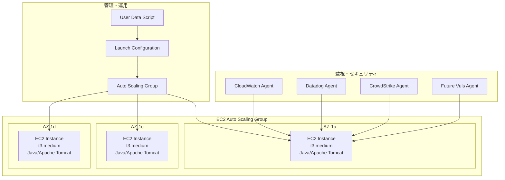
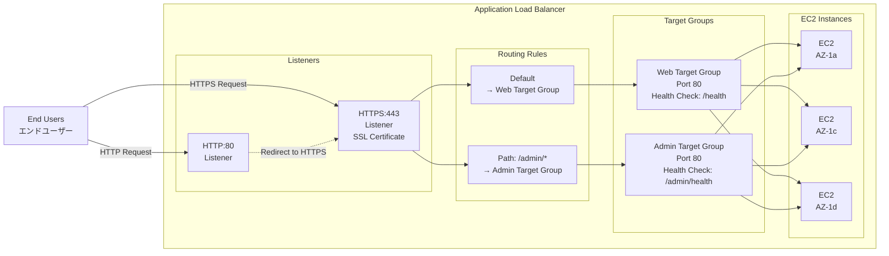
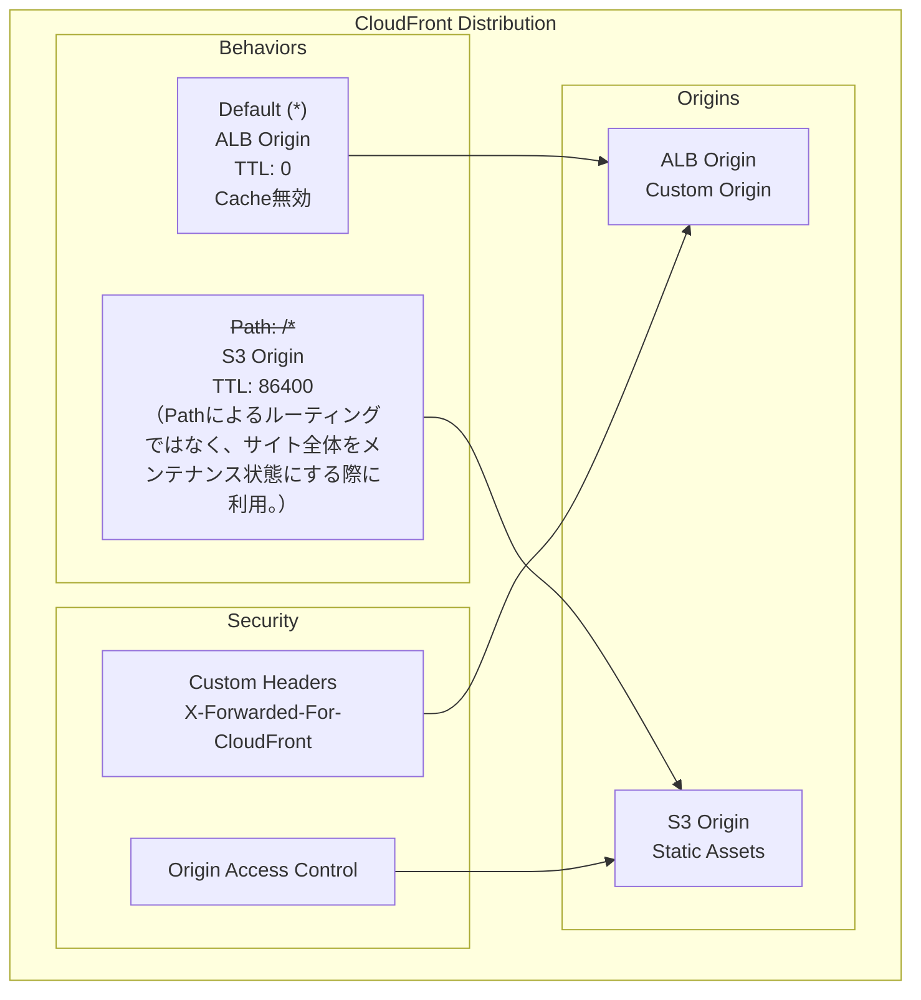
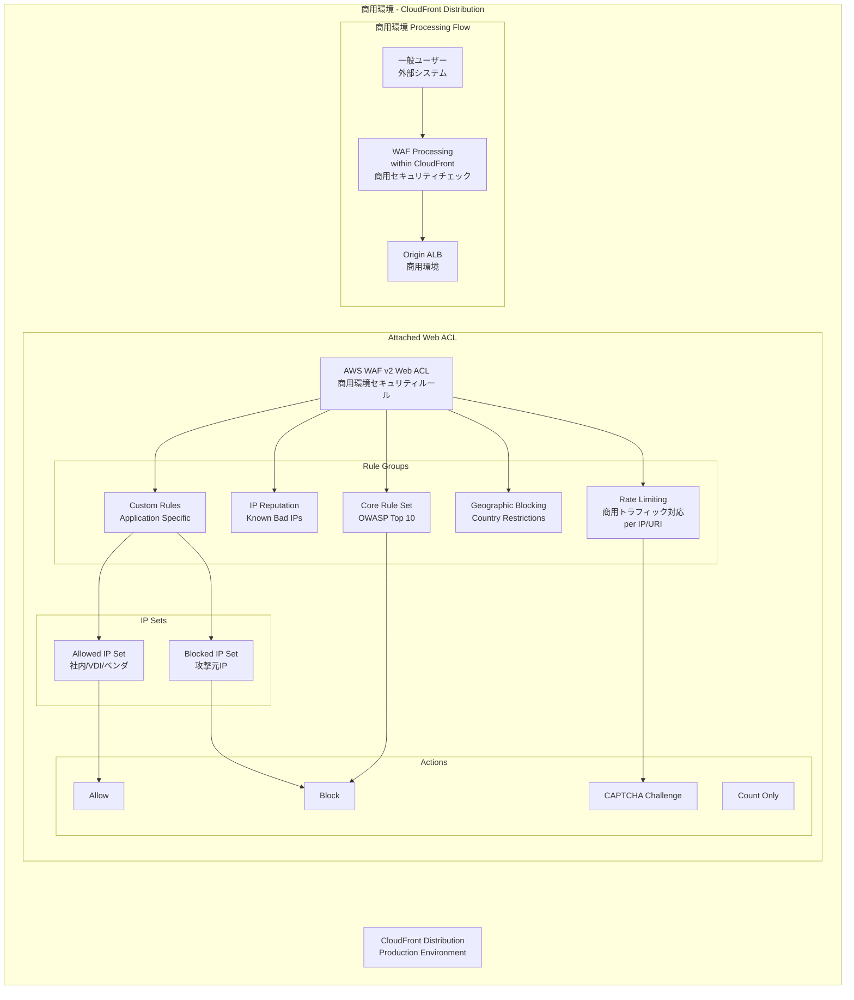

# アプリケーションアーキテクチャ設計書

## 目次

- [概要](#概要)
- [コンピューティングアーキテクチャ](#コンピューティングアーキテクチャ)
- [ロードバランサー設計](#ロードバランサー設計)
- [CDN設計](#cdn設計)
- [WAF設計（商用環境）](#waf設計商用環境)

---

## 概要

本設計書では、idhubシステムのアプリケーション層のアーキテクチャを定義します。EC2インスタンス、ロードバランサー、CDN、WAFの構成を記載します。

---

## コンピューティングアーキテクチャ

**EC2設計詳細:**

| 項目 | 設定値 | 備考 |
|------|-------|------|
| インスタンスタイプ | t3.medium | 2vCPU, 4GB RAM |
| OS | Amazon Linux 2023 | 最新セキュリティパッチ |
| ストレージ | 20GB gp3 | 暗号化有効 |
| **起動台数** | **3台固定** | **各AZに1台ずつ（現時点）** |
| 自動復旧 | 未実装（将来検討） | 障害時の自動起動は今後検討 |
| 手動スケーリング | 対応可能 | 将来の負荷増加に備えた設計 |
| ヘルスチェック | ELB + EC2 | 多重ヘルスチェック |

---

## ロードバランサー設計

---

## CDN設計

**CDN設計の特徴:**

- CDNは、高速コンテンツデリバリーのためにキャッシュさせる、という意味合いは薄く、どちらかといえばIPを分散させてDDoS攻撃を防ぐため、という目的が強い。（参考： [要件定義書 ＞ 2.6 CDN構成要件](../../requirements/02-system-components-requirements.md#26-cdn構成要件)）
  - よって、Cacheを無効にする。（つまり、TTL=0である。）
- S3 による静的コンテンツデリバリーはメンテナンスページの用途だけである。（2025年11月現在）メンテナンスや大規模障害の有事の際、トラフィック全体をそのページに流すように切り替える。（参考： [要件定義書 ＞ 4.4.4 Sorryページ、メンテナンスページ](../../requirements/04-non-functional-requirements.md#444-sorryページメンテナンスページ)）

---

## WAF設計（商用環境）

**商用環境WAF設計の特徴:**

- **高トラフィック対応**: 商用環境の本格的なアクセス負荷に対応したレート制限
- **包括的セキュリティ**: OWASP Top 10対策、地理的制限、IP評価ルール
- **運用考慮**: アクション種別による段階的対応（Block/CAPTCHA/Count）

**検証環境との差異:**

- 検証環境では簡素化されたWAFルール（基本的なOWSP対策のみ）
- 商用環境ではより厳格なレート制限とセキュリティルール
- IP許可リストの範囲が異なる（検証環境は開発者IP含む）

**WAF統合の技術的詳細:**

- WAF Web ACLはCloudFrontディストリビューションにアタッチされる
- リクエストはCloudFront内でWAF処理が実行された後、Originに転送される
- WAFルールによってブロックされた場合、Originには到達しない
