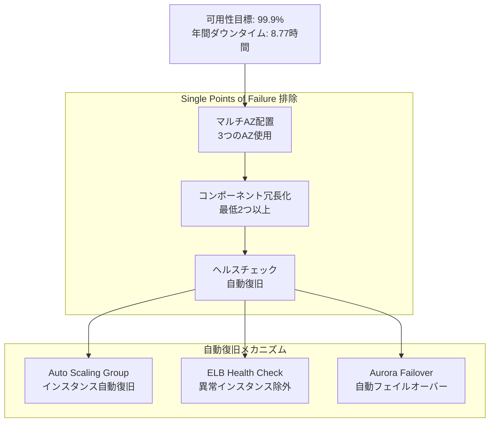
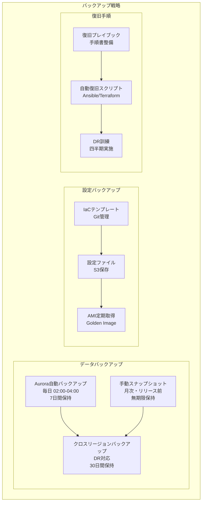

# 高可用性設計書

## 目次

- [概要](#概要)
- [可用性目標](#可用性目標)
- [Single Points of Failure 排除](#single-points-of-failure-排除)
- [自動復旧メカニズム](#自動復旧メカニズム)
- [可用性対策詳細](#可用性対策詳細)
- [災害復旧設計](#災害復旧設計)

---

## 概要

本設計書では、idhubシステムの高可用性アーキテクチャを定義します。99.9%以上の可用性を実現するための設計を記載します。

---

## 可用性目標

---

## Single Points of Failure 排除

**マルチAZ配置:**

- 全てのコンポーネントを3つのAZ (ap-northeast-1a, 1c, 1d) に分散配置
- 1つのAZが完全に停止しても、残り2つのAZでサービス継続可能

**コンポーネント冗長化:**

- EC2インスタンス: 各AZに1台ずつ、計3台
- Aurora: Writer 1台 + Reader 2台（異なるAZ）
- NAT Gateway: 各AZに1台ずつ、計3台
- Network Firewall: 各AZに1台ずつ、計3台

---

## 自動復旧メカニズム

**Auto Scaling Group:**

- EC2インスタンスのヘルスチェック失敗時、自動的に新しいインスタンスを起動
- 目標台数（3台）を常に維持

**ELB Health Check:**

- 定期的にバックエンドEC2インスタンスの健全性を確認
- 異常インスタンスを自動的にトラフィックから除外
- 復旧後、自動的にトラフィックを再開

**Aurora自動フェイルオーバー:**

- Writer Instanceの障害検知時、30-120秒でReader Instanceに自動昇格
- アプリケーション側の接続文字列変更不要（エンドポイント自動更新）

---

## 可用性対策詳細

| コンポーネント | 可用性対策 | RPO | RTO |
|---------------|-----------|-----|-----|
| EC2 | Auto Scaling Group, マルチAZ | N/A | 5分 |
| Aurora | Multi-AZ, 自動フェイルオーバー, 14日バックアップ | 5分 | 1分 |
| ALB | マルチAZ, 自動フェイルオーバー | N/A | 即座 |
| CloudFront | 自動冗長化 | N/A | 即座 |

---

## 災害復旧設計

**バックアップスケジュール:**

| バックアップ対象 | 頻度 | 実行時間 | 保持期間 | 自動化 |
|-----------------|------|---------|---------|-------|
| Aurora DB | 毎日 | 02:00-04:00 | 14日 | AWS Backup |
| EBS Snapshot | 毎日 | 01:00-02:00 | 30日 | AWS Backup |
| AMI | 毎週日曜 | 00:00-01:00 | 8世代 | Lambda |
| 設定ファイル | 毎日 | 03:00-04:00 | 90日 | S3同期 |
| アプリケーションログ | リアルタイム | - | 30日 | CloudWatch |
