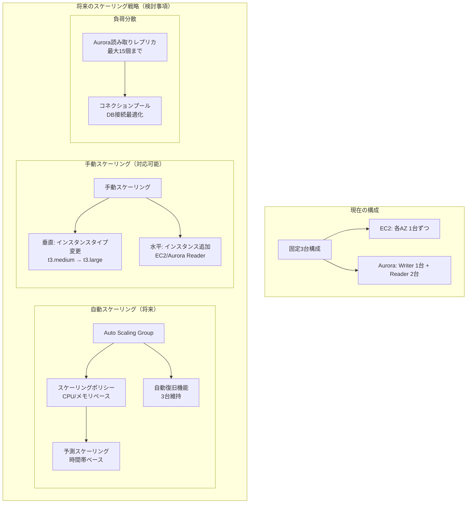

# スケーラビリティ設計書

## 目次

- [概要](#概要)
- [現在の構成](#現在の構成)
- [将来のスケーリング戦略](#将来のスケーリング戦略)
- [自動スケーリング（将来検討）](#自動スケーリング将来検討)
- [手動スケーリング（対応可能）](#手動スケーリング対応可能)
- [負荷分散](#負荷分散)

---

## 概要

本設計書では、idhubシステムのスケーラビリティアーキテクチャを定義します。現在の固定構成と将来の拡張戦略を記載します。

---

## 現在の構成

**固定3台構成:**

- **EC2インスタンス**: 各AZ (1a, 1c, 1d) に1台ずつ、計3台固定
- **Aurora**: Writer 1台 (AZ-1a) + Reader 2台 (AZ-1c, 1d) 固定

**特徴:**

- 自動スケーリングは未実装（将来検討事項）
- 手動でのスケールアウト/スケールアップは対応可能
- 現時点のトラフィックには十分対応可能

---

## 将来のスケーリング戦略

---

## 自動スケーリング（将来検討）

**Auto Scaling Groupによる自動スケーリング:**

- CPU使用率やメモリ使用率に基づく動的スケーリング
- 時間帯ベースの予測スケーリング（朝のピーク時など）
- 最小3台、最大N台（要件に応じて設定）

**自動復旧機能:**

- ヘルスチェック失敗時の自動インスタンス交換
- 目標台数の自動維持

---

## 手動スケーリング（対応可能）

**垂直スケーリング（スケールアップ）:**

- インスタンスタイプの変更
  - 例: t3.medium → t3.large → t3.xlarge
  - 例: r5.large → r5.xlarge（Aurora）
- ダウンタイムを伴うが、性能向上が即座に反映

**水平スケーリング（スケールアウト）:**

- EC2インスタンスの追加
  - 各AZに1台ずつ追加（バランス維持）
- Aurora Readerの追加
  - 最大15個まで追加可能
  - 読み取り負荷の分散

---

## 負荷分散

**Aurora読み取り負荷分散:**

- Reader Instanceを追加することで読み取り性能を向上
- アプリケーションレベルでの接続プール最適化
- Read/Write分離によるWriter Instance負荷軽減

**コネクションプール最適化:**

- DB接続数の適切な管理
- 接続プールサイズの調整
- アイドル接続のタイムアウト設定
