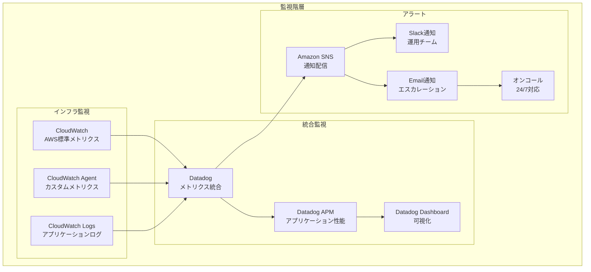

# 監視設計書

## 目次

- [概要](#概要)
- [監視階層](#監視階層)
- [監視項目詳細](#監視項目詳細)
- [アラート設定](#アラート設定)

---

## 概要

本設計書では、idhubシステムの監視アーキテクチャを定義します。インフラ監視、統合監視、アラート通知の構成を記載します。

---

## 監視階層

**監視ツール:**

- **CloudWatch**: AWS標準の監視サービス（EC2、Aurora、ALBなど）
- **CloudWatch Agent**: カスタムメトリクス（メモリ使用率、ディスク使用率など）
- **Datadog**: 統合監視プラットフォーム（全体的な可視化とアラート）

---

## 監視項目詳細

| カテゴリ | 監視項目 | 閾値 | アクション |
|---------|---------|------|----------|
| 可用性 | ヘルスチェック失敗 | 2回連続 | インスタンス交換 |
| パフォーマンス | CPU使用率 | >80% | スケールアウト |
| パフォーマンス | メモリ使用率 | >90% | アラート通知 |
| ネットワーク | レスポンス時間 | >3秒 | 調査アラート |
| セキュリティ | 不正アクセス検知 | 即座 | 緊急アラート |
| データベース | 接続数 | >80% | 警告アラート |

**詳細:**

### 可用性監視

- **ヘルスチェック**: ALBによるバックエンドEC2の健全性確認（30秒間隔）
- **インスタンスステータス**: EC2インスタンスのシステムステータスチェック
- **Aurora可用性**: Writerおよびリーダーインスタンスの稼働状態

### パフォーマンス監視

- **CPU使用率**: EC2インスタンスのCPU使用率（5分平均）
- **メモリ使用率**: CloudWatch Agentによるメモリ監視
- **ディスク使用率**: ルートボリュームおよびデータボリュームの使用率
- **ネットワーク使用率**: ネットワークイン/アウトのトラフィック

### データベース監視

- **接続数**: Aurora接続数（最大接続数の80%で警告）
- **レプリケーション遅延**: Reader Instanceのレプリケーション遅延時間
- **クエリパフォーマンス**: スロークエリログの監視
- **ストレージ使用率**: Auroraストレージの使用量

### セキュリティ監視

- **WAFブロック**: WAFによるブロック数の急増
- **不正アクセス試行**: 認証失敗の連続試行
- **CrowdStrike検知**: EDRによる脅威検知
- **VPC Flow Logs異常**: 異常なネットワーク通信パターン

---

## アラート設定

**アラート階層:**

1. **情報**: ログ記録のみ（アクション不要）
2. **警告**: Slack通知（確認推奨）
3. **エラー**: Slack + Email通知（対応必要）
4. **緊急**: Slack + Email + 電話通知（即座対応）

**通知先:**

- **Slack**: `#idhub-alerts` チャンネル（全アラート）
- **Email**: 運用チームメーリングリスト（警告以上）
- **オンコール**: PagerDuty経由で24/7対応（緊急のみ）

**エスカレーションフロー:**

1. **Level 1**: 運用チームへSlack通知
2. **Level 2 (15分後未対応)**: Email通知
3. **Level 3 (30分後未対応)**: オンコール担当者へ電話通知
4. **Level 4 (1時間後未対応)**: マネージャーへエスカレーション
