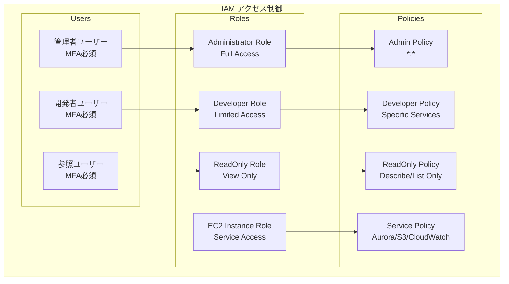
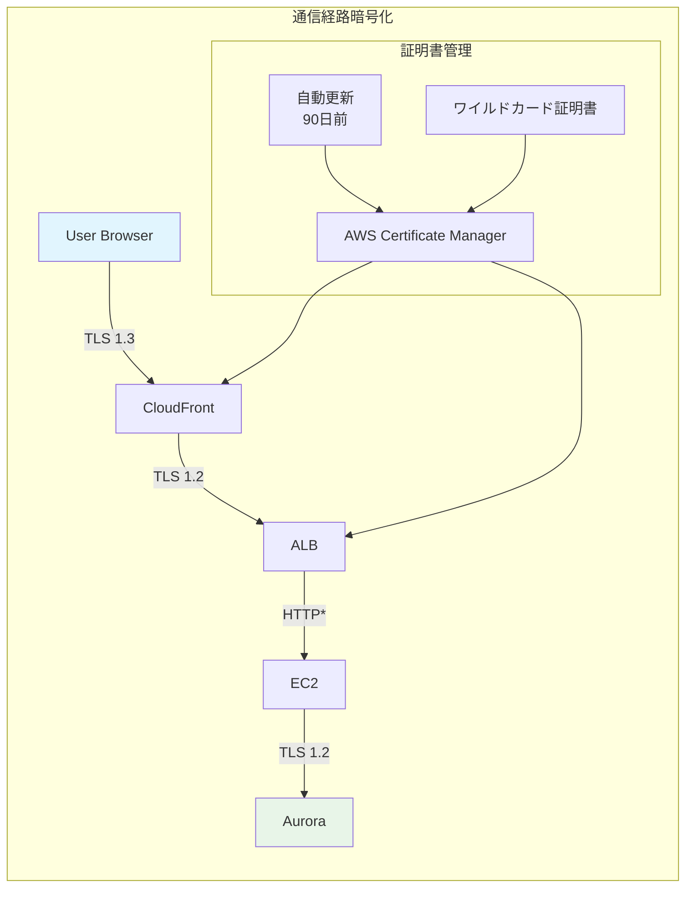
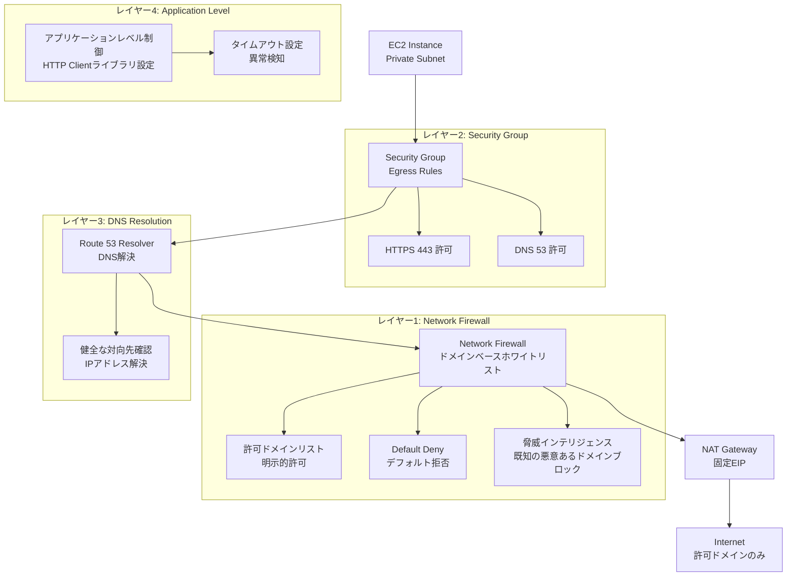
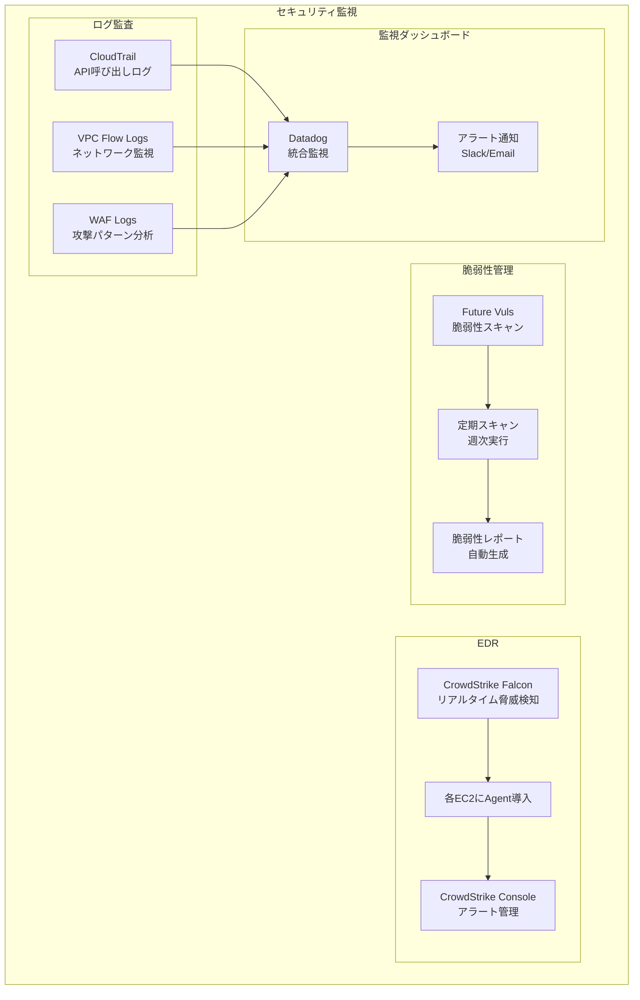
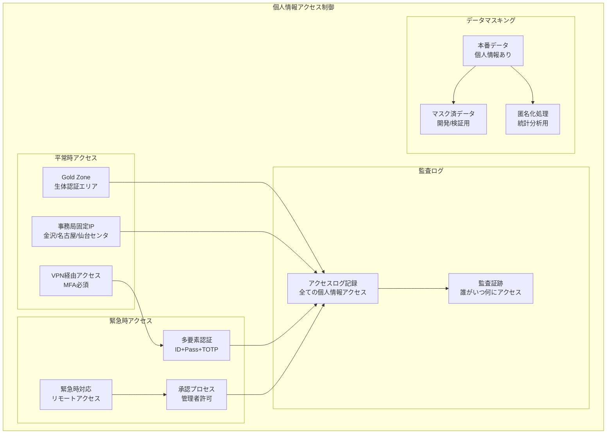

# セキュリティアーキテクチャ設計書

## 目次

- [概要](#概要)
- [アクセス制御設計](#アクセス制御設計)
- [通信暗号化設計](#通信暗号化設計)
- [アウトバウンド通信制御設計](#アウトバウンド通信制御設計)
- [監視・監査設計](#監視監査設計)
- [個人情報保護設計](#個人情報保護設計)

---

## 概要

本設計書では、idhubシステムのセキュリティアーキテクチャを定義します。多層防御、アクセス制御、暗号化、監視・監査の構成を記載します。

---

## アクセス制御設計

---

## 通信暗号化設計

---

## アウトバウンド通信制御設計

**アウトバウンド通信制御の設計概要:**

| 制御レイヤー | 制御方式 | 対象 | 効果 |
|------------|---------|------|------|
| Network Firewall | ドメインホワイトリスト | 全外部通信 | 明示的許可のみ通信可能 |
| Security Group | ポート・プロトコル制御 | EC2 Egress | HTTPS/DNS以外のプロトコルブロック |
| DNS Resolution | 健全性確認 | ドメイン→IP | 正規のIPアドレスへの接続確認 |
| VPC Flow Logs | 通信記録 | 全ネットワーク通信 | 監査証跡・異常検知 |

**セキュリティ効果:**

- **マルウェア対策**: C&Cサーバへの通信を遮断
- **データ流出防止**: 未許可の外部サービスへのデータ送信をブロック
- **コンプライアンス**: システムセキュリティ対策マニュアル準拠
- **監査対応**: 全通信の記録と分析

---

## 監視・監査設計

---

## 個人情報保護設計

