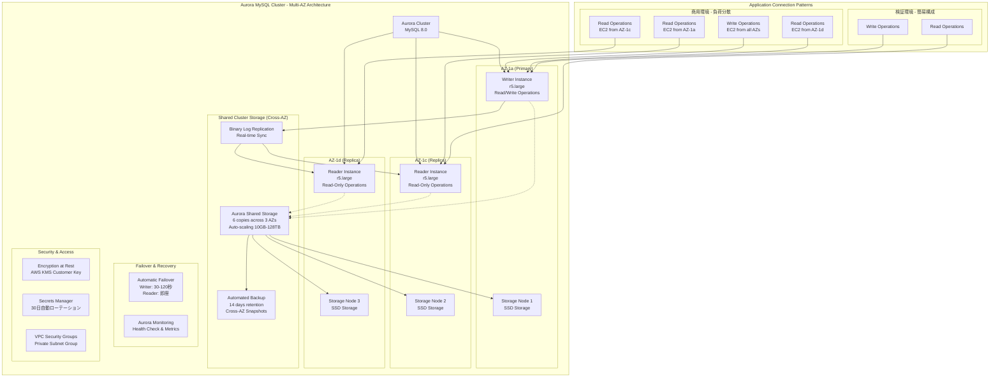
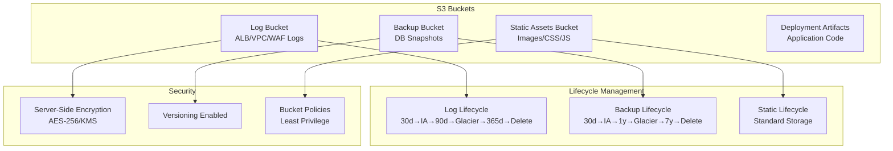
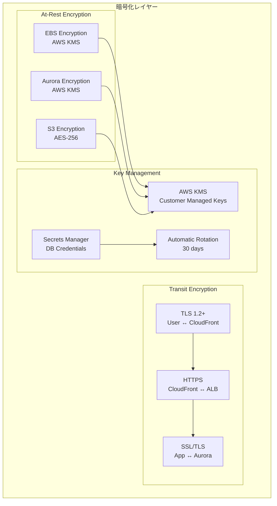

# データアーキテクチャ設計書

## 目次

- [概要](#概要)
- [データベース設計](#データベース設計)
- [ストレージ設計](#ストレージ設計)
- [データ暗号化設計](#データ暗号化設計)

---

## 概要

本設計書では、idhubシステムのデータ層のアーキテクチャを定義します。Aurora MySQL、S3ストレージ、データ暗号化の構成を記載します。

---

## データベース設計

**Aurora Multi-AZ分散の技術詳細:**

| 項目 | AZ-1a | AZ-1c | AZ-1d | 特徴 |
|------|-------|-------|-------|------|
| **Writer Instance** | ✅ Primary | ❌ | ❌ | 全ての書き込み処理（Private Subnet） |
| **Reader Instance** | ❌ | ✅ Replica | ✅ Replica | 読み取り負荷分散（Private Subnet） |
| **Storage Copy** | ✅ 2 copies | ✅ 2 copies | ✅ 2 copies | 自動6重化 |
| **Failover Target** | ✅ Primary | ✅ 候補1 | ✅ 候補2 | 30-120秒で自動切替 |
| **Backup Source** | ✅ Primary | ✅ Replica | ✅ Replica | Cross-AZバックアップ |

**商用環境のEC2-Aurora接続パターン:**

- **各AZのEC2** → 最も近いAuroraインスタンス優先
- **書き込み処理** → 必ずWriter Instance (AZ-1a)
- **読み取り処理** → Reader Instance優先、Writer Instanceはフォールバック
- **接続プール** → アプリケーションレベルで負荷分散

**データベース設計詳細:**

| 項目 | 設定値 | 備考 |
|------|-------|------|
| エンジン | Aurora MySQL 8.0 | 最新LTS版 |
| インスタンスクラス | r5.large | 2vCPU, 16GB RAM |
| **インスタンス構成** | **Writer 1台 + Reader 2台（固定）** | **Writer: AZ-1a、Reader: AZ-1c/1d** ※自動復旧・動的スケーリングは将来検討 |
| ストレージ | 自動スケーリング | 10GB〜128TB |
| バックアップ保持期間 | 14日間 | 自動バックアップ（要件準拠） |
| 暗号化 | AWS KMS | 保存時暗号化 |
| マルチAZ | 3AZ配置 | 高可用性確保 |

---

## ストレージ設計

---

## データ暗号化設計

