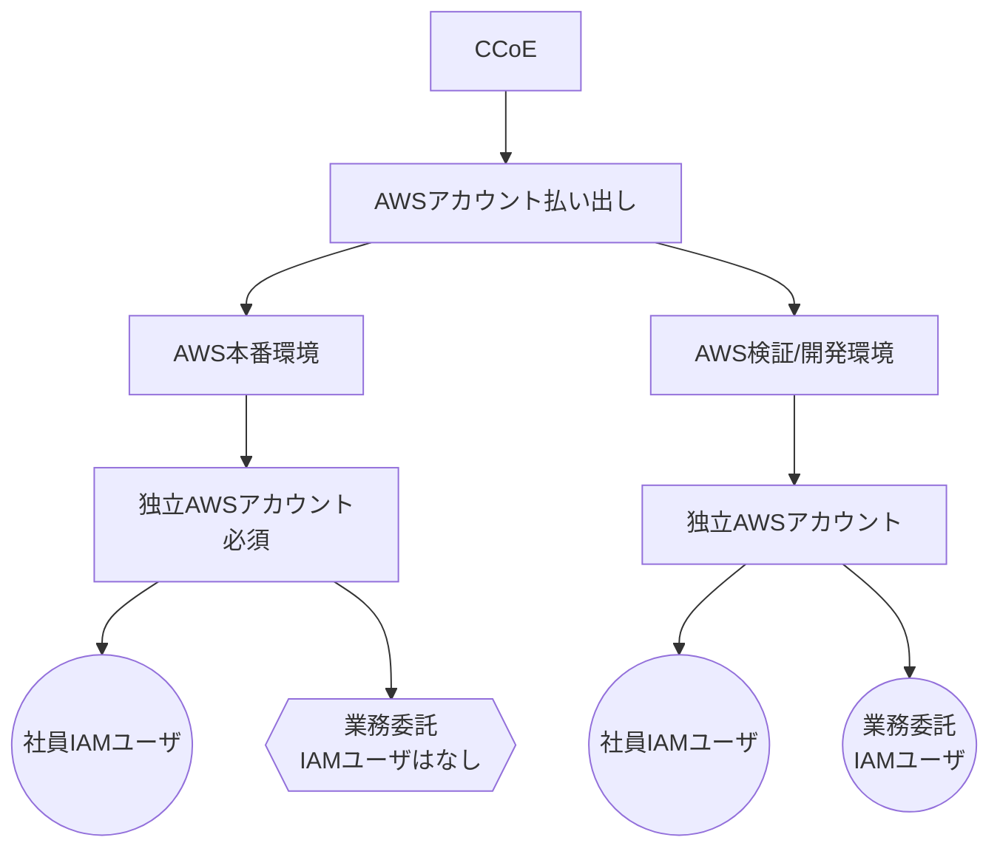
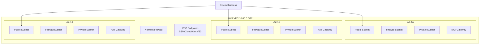
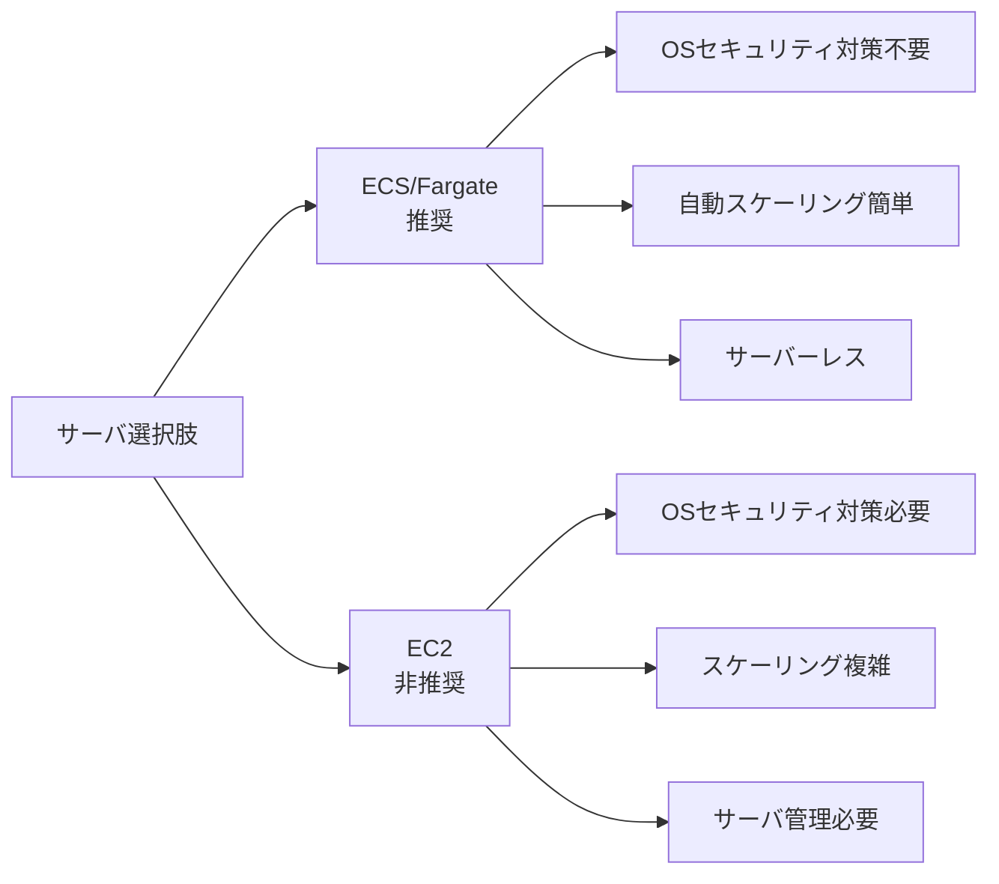
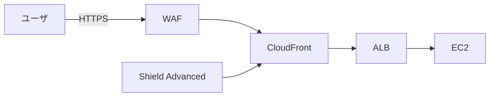
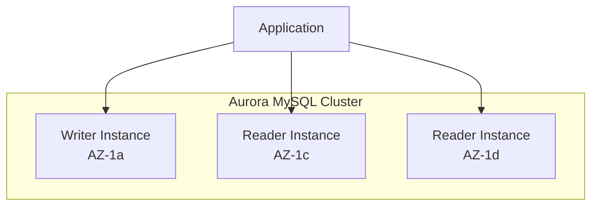

# 2. システム構成要件

## 目次

- [2. システム構成要件](#2-システム構成要件)
  - [目次](#目次)
  - [2.1 AWSアカウント構成要件](#21-awsアカウント構成要件)
  - [2.2 検証環境](#22-検証環境)
    - [2.2.1 検証環境へのWEBアクセス制限](#221-検証環境へのwebアクセス制限)
  - [2.3 管理ツール](#23-管理ツール)
    - [2.3.1 ヘルプツールの要件](#231-ヘルプツールの要件)
  - [2.4 ネットワーク構成要件](#24-ネットワーク構成要件)
    - [2.4.1 外部からAWSへのネットワーク構成](#241-外部からawsへのネットワーク構成)
    - [2.4.2 外部への通信（アウトバウンド）](#242-外部への通信アウトバウンド)
    - [2.4.2 AWS内のネットワーク構成](#242-aws内のネットワーク構成)
  - [2.5 サーバ構成要件（ECS/Fargate vs EC2）](#25-サーバ構成要件ecsfargate-vs-ec2)
    - [2.5.1 EC2構成](#251-ec2構成)
      - [基本構成](#基本構成)
      - [検討が必要な項目](#検討が必要な項目)
  - [2.6 CDN構成要件](#26-cdn構成要件)
  - [2.7 データベース機能要件](#27-データベース機能要件)
    - [2.7.1 基本構成](#271-基本構成)
    - [2.7.2 今後、検討の余地がある項目](#272-今後検討の余地がある項目)
  - [2.8 キャッシュ機能要件](#28-キャッシュ機能要件)

## 2.1 AWSアカウント構成要件



- **AWSアカウント払い出し**: CCoEにて払い出される。 [アカウント管理 – DOCOMO CCoE Portal（パブリッククラウド利用ポータル）](https://ccoe.zendesk.com/hc/ja/sections/4410842595087-Amazon-Web-Services-AWS)
-  `dev` と `prod` で、AWSアカウントを分けている点に注意が必要である。

## 2.2 検証環境

- 商用適用前の動作検証を行うための環境。および外部の関連システム/サービスの検証環境から利用される。
- 後述で出現する、WEBアプリケーション / DB / JOB といった機能が、全て別空間となっている。つまり、扱う・保持するDBのデータも全く別、となっている。
- **複数の独立した開発環境を設ける。** これを現状、 `1系`、 `2系`, ...... と呼んでいる。
  - 常設の検証環境が必要。外部システムから利用されるため。現1系。 **[MUST]**
  - この「1系」は、他のN系に比べ利用者が多く、サービスレベルが高い。
- 検証環境は商用環境と同等の構成とする。**[SHOULD]** サーバの多重化などは不要。
  - 開発環境。属人的に一人の開発者が占有して開発作業をする。（例．「Aさんは2系、Bさんは3系、で開発作業。」）デバッグ等に利用。**[OPTIONAL]**
  - 大き目の開発案件が発生する場合には、開発環境が必要。その場合は別途立ち上げる。 **[MUST]** この「系」を少ない労力で起動できること。（例．「3系までは存在しているが、4系を追加。」）
    - 現時点、初期段階では `1系`、 `2系`、 `3系` の3つを起動させておくことを想定している。

### 2.2.1 検証環境へのWEBアクセス制限

- 検証環境ドメインには、不特定多数の一般ユーザにはアクセス許可せず、内部関係者だけにアクセス限定する。
- 特定のアクセス元(固定IPアドレスを想定。社内LAN,VDI,ベンダ)からのアクセスを許可。**[MUST]**
- 固定IP以外からのアクセスの場合（在宅勤務時を想定）は、ユーザー認証を必須とする。MFAが必須。現在は id+pass+totp **[MUST]**

## 2.3 管理ツール

- 内部関係者しか利用しない（＝一般エンドユーザは利用しない）、日常業務に必要な管理ツールが存在する。
- 代表的なモノは、ユーザー問い合わせ・サポートのためのツール。 `「ヘルプツール」` と呼ばれている。

### 2.3.1 ヘルプツールの要件

- 表示される情報には個人情報が含まれるため、原則 `Gold Zoneおよび事務局` 📍(*1) からのアクセスのみ許可。**[MUST]**
IPアドレスによるアクセス制限。
- GoldZone,事務局以外からもアクセス可能。固定IP化できないリモート環境からはユーザー認証が必要。MFA必須。現在は id+pass+totp **[MUST]**
- （個人情報をマスク化するなど一部機能を制限した状態での提供。アプリ側で制御するので、本要件の対象外。）

📍(*1)

- `Gold Zone`
  - オフィスビル内に設置された、生体認証での入退室、監視カメラが設置された、個人情報・お客様情報を扱う作業を許可された部屋。
  - この部屋からだけ、個人情報・お客様情報に触れることが許されている。
- `事務局`
  - 2025-11現在。他部署（イエナカサービス部 OCN推進室 ISPサービスマネジメント）が委託・協働している、カスタマーサポート業務をしている人々や、その場所を示す。（OCNの「金沢センタ」「名古屋センタ」「仙台センタ」などを示す。）

## 2.4 ネットワーク構成要件



- マルチAZにする。（マルチリージョン＝Disaster Recoveryまでは求めない。）
- より全体的に俯瞰した図は [構成図2025.drawio.svg](../kickoff/images/構成図2025.drawio.svg) を参照。

### 2.4.1 外部からAWSへのネットワーク構成

- 開発者がAWSリソースへのアクセスする際は、管理工数低減のため踏み台サーバは使用せず、CloudShellやSession Managerの使用を推奨する

### 2.4.2 外部への通信（アウトバウンド）

- アウトバウンド通信は、ドメイン、もしくはワイルドカード付きのドメインで、対向先を限定できること。
  - 注：マルウェアに万が一感染したとしても、外部の悪意あるサイトに接続できないようにするため、と考えられる。
- ドメインであるため、DNSルックアップすることで健全な対向先と接続できること。

- 📖関連・参考： [システムセキュリティ対策マニュアル（ドコモ・ドコモ機能分担会社版）.pdf](https://nttdocomo.sharepoint.com/:b:/r/sites/rules/DocLib/%E3%82%B7%E3%82%B9%E3%83%86%E3%83%A0%E3%82%BB%E3%82%AD%E3%83%A5%E3%83%AA%E3%83%86%E3%82%A3%E5%AF%BE%E7%AD%96%E3%83%9E%E3%83%8B%E3%83%A5%E3%82%A2%E3%83%AB%EF%BC%88%E3%83%89%E3%82%B3%E3%83%A2%E3%83%BB%E3%83%89%E3%82%B3%E3%83%A2%E6%A9%9F%E8%83%BD%E5%88%86%E6%8B%85%E4%BC%9A%E7%A4%BE%E7%89%88%EF%BC%89.pdf?csf=1&web=1&e=TAJ0Bs) 🔒 > `8.4. ファイアウォール` より抜粋。

```plaintext
■ 実施の手引き
ファイアウォールは、機密性の高い内部ネットワークを、悪意を持った攻撃にさらされる外部ネットワークから分離する。

(1)ネットワーク境界にはファイアウォールを導入すること。
① インバウンド通信、アウトバウンド通信何れについても、システムの動作に必要不可欠な最小限の通信のみ許容するために、ネットワークの境界にはファイアウォールを設置すること。
......
③ インバウンド通信、アウトバウンド通信ともに必ず必要最小限のみ許可すること。
```

### 2.4.2 AWS内のネットワーク構成

基本的なネットワーク構成を構築する：

| 項目 | 詳細 |
|-----|------|
| AZ構成 | 3つのAZ（1a, 1c, 1d）を作成 |
| NAT Gateway | AZごとに作成、固定EIPを使用 |
| Network Firewall | VPC内から外部への接続制限 |
| VPC Flowlog | S3バケットへの保存 |
| IPv6対応 | PublicSubnetとFirewallSubnet |
| VPCエンドポイント | SSMエンドポイント（SSH踏み台不要） |

## 2.5 サーバ構成要件（ECS/Fargate vs EC2）



- ECSが、セキュリティ対策、スケーリングに優位性があることを承知の上で、EC2を選択する。
  - （その理由と背景、再掲） [EC2の積極利用](./README.md#121-ec2の積極利用) を参照。

### 2.5.1 EC2構成

本システムではEC2ベースのWebアプリケーション構成を採用します。詳細は [§ 6. サーバ構成詳細要件](./06-server-architecture.md) を参照してください。

#### 基本構成

| 項目 | 設定値 |
|------|--------|
| **インスタンスタイプ** | 開発: t3.medium (2vCPU, 4GB)<br>本番: t3.2xlarge (8vCPU, 32GB) |
| **最小構成** | 各AZに1台ずつ（計3台固定） |
| **OS** | Amazon Linux 2023 |
| **配置** | Private Subnet (Multi-AZ) |
| **起動設定** | Launch Template による標準化 |
| **スケーリング** | 将来検討（現在は手動対応） |

#### 検討が必要な項目

以下の項目については、設計フェーズで詳細を決定します：

| 検討項目 | 概要 | 参照先 |
|---------|------|--------|
| OSセキュリティ | パッチ管理、CIS Benchmark準拠 | [§ 6.2](./06-server-architecture.md#62-osセキュリティ要件) |
| 冗長化構成 | マルチAZ配置、AutoScalingGroup、ヘルスチェック、自動復旧 | [§ 4.1](./04-non-functional-requirements.md#41-可用性要件) |
| 監視設定 | OS・アプリケーション監視 CloudWatch Agent, Datadog | [§ 4.4.1](./04-non-functional-requirements.md#441-監視設計) |
| バックアップ | Golden AMI, EBS Snapshot | [§ 5.2](./05-additional-functional-requirements.md#52-バックアップ設計要件) |
| セキュリティ監視 | CrowdStrike EDR, FutureVuls | [§ 3.4](./03-security-requirements.md#34-セキュリティ監視要件) |
| アクセス管理 | Session Manager, Run As | [§ 3.7](./03-security-requirements.md#37-ec2アクセス管理要件) |
| パッチ管理 | Systems Manager Patch Manager | [§ 4.4.5](./04-non-functional-requirements.md#445-パッチ管理要件) |
| デプロイ方式 | Blue/Green, Golden AMI | [§ 6.3](./06-server-architecture.md#63-デプロイライフサイクル管理) |

## 2.6 CDN構成要件

-  bprtech 策定のガイドライン [セキュリティ設計 ＞ 7.DDoS攻撃対策](../../doc-bpr/guideline/system-design/12.security/README.md#sec7) にも記載の通り、CDN（CloudFront）を配置することで **DDoS対策としての効果がある** ため、採用する。
  - CDN を経由することで地理的にサービスIPが分散され、攻撃がしづらくなる。
  - 2025年1月2日には、実際にgooIDが単一IPでの提供サービスであったため、DDoS攻撃された。
- 上記ガイドラインを図示すると、以下の通り。



- **CDNサービス**: CloudFrontを前提とする
- **構成要素**: WAF、CloudFront。
- ~~静的コンテンツ~~: S3バケットから静的コンテンツを配信する、といった要件はない。
- **SSL/TLS**: 自動証明書管理（ACM）

## 2.7 データベース機能要件

### 2.7.1 基本構成



- **データベース**: Amazon Aurora MySQL 8.0
- **高可用性**: マルチAZ配置（3つのAZ）
- **バックアップ**: 7日間の自動バックアップ
- **暗号化**: 保存時暗号化対応（マネージドキー）
- **接続管理**: Secrets Managerによる認証情報管理
- **スケーリング**: スペックアップ、スケールアウト対応

### 2.7.2 今後、検討の余地がある項目

- データベース仕様（容量、性能要件）
- バックアップ対象の選定
- ~~保存世代数~~ [5.2 バックアップ設計要件](./05-additional-functional-requirements.md#52-バックアップ設計要件) を参照。
- バックアップ格納先
- バックアップ取得方式の検討/リストア方式の検討

## 2.8 キャッシュ機能要件

- 本システムでは、（ ElastiCacheなどの）揮発性のあるストレージ＝キャッシュは不要、とする。
- 導入できればベストだが、そこにかかるアプリケーション改修コストは大きいと想定され、導入するモチベーションはない。
