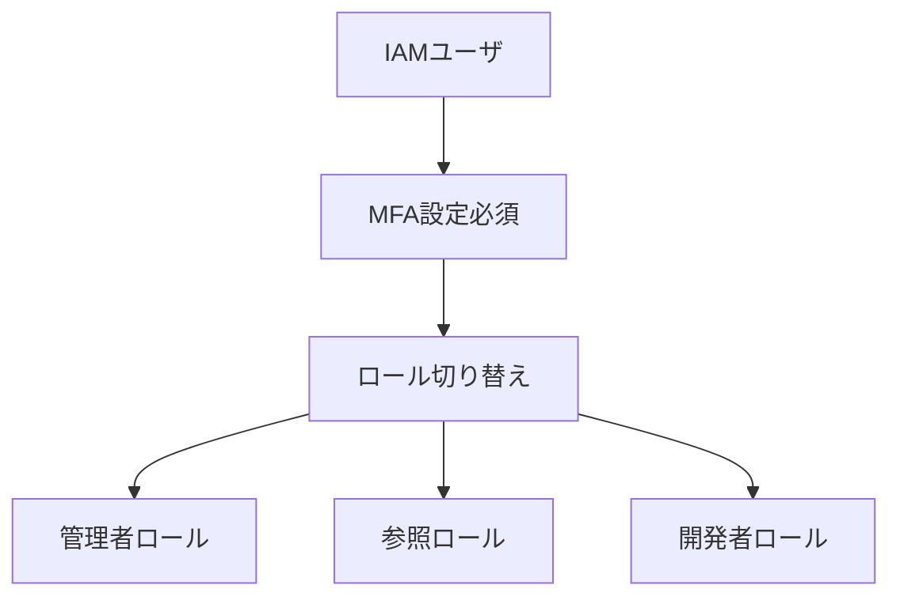
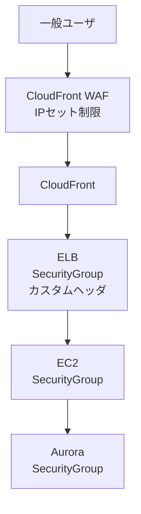
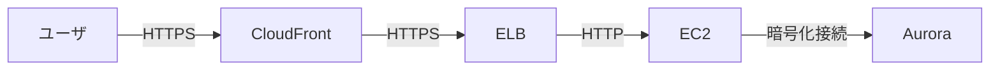
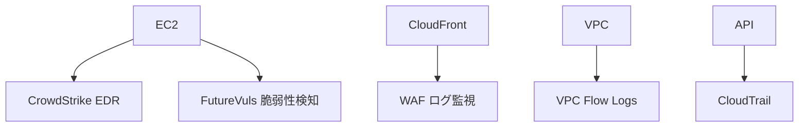
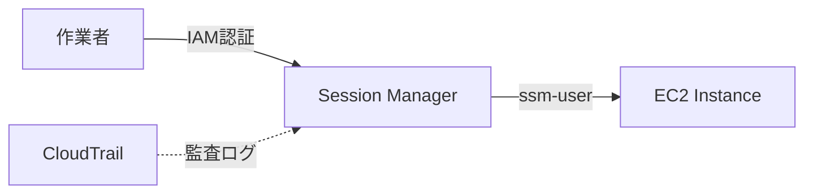
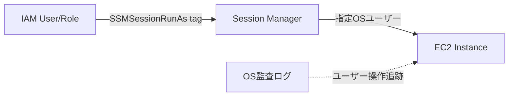

# 3. セキュリティ要件

## 目次

- [3.1 AWSアカウントアクセス制御要件](#31-awsアカウントアクセス制御要件)
  - [3.1.1 今後、検討の余地がある項目](#311-今後検討の余地がある項目)
- [3.2 ユーザー通信制御要件](#32-ユーザー通信制御要件)
  - [3.2.1 今後、検討の余地がある項目](#321-今後検討の余地がある項目)
- [3.3 暗号化要件](#33-暗号化要件)
  - [3.3.1 通信暗号化](#331-通信暗号化)
  - [3.3.2 保存データの暗号化](#332-保存データの暗号化)
  - [3.3.3 今後、検討の余地がある項目](#333-今後検討の余地がある項目)
- [3.4 セキュリティ監視要件](#34-セキュリティ監視要件)
  - [3.4.1 監視ツール構成](#341-監視ツール構成)
  - [3.4.2 今後、検討の余地がある項目](#342-今後検討の余地がある項目)
- [3.5 監査証跡要件](#35-監査証跡要件)
  - [3.5.1 今後、検討の余地がある項目](#351-今後検討の余地がある項目)
- [3.6 個人情報保護要件](#36-個人情報保護要件)
  - [3.6.1 個人情報を含むデータへのアクセス制御](#361-個人情報を含むデータへのアクセス制御)
- [3.7 EC2アクセス管理要件](#37-ec2アクセス管理要件)
  - [3.7.1 基本アクセス方式](#371-基本アクセス方式)
  - [3.7.2 OSユーザーアカウント管理](#372-osユーザーアカウント管理)
  - [3.7.3 ec2-userセキュリティ対策](#373-ec2-userセキュリティ対策)

## 3.1 AWSアカウントアクセス制御要件



- **IAMユーザ管理**: 手動パスワード払い出し、パスワードポリシー設定
    - パスワードポリシーは[CloudFormationテンプレートによる環境構築手順.md_3-1.IAMユーザのパスワードポリシー設定](../../doc-bpr/manual/CloudFormationテンプレートによる環境構築手順.md#3-1.IAMユーザのパスワードポリシー設定)を参照
- **ロールベースアクセス**: 管理者用ロール、参照用ロール等の権限別ロール
- **MFA必須**: 初回ログイン時のMFA設定必須
- **ネットワーク制御**: NetworkFirewall、SecurityGroup、WAFのIPセットによる多層防御

### 3.1.1 今後、検討の余地がある項目

- アクセス制御、ユーザ認証、多要素認証
- ユーザアカウント管理、不正ログイン対策
- 権限設計（最小権限の原則）

## 3.2 ユーザー通信制御要件



| 通信経路 | ネットワーク制限 |
|----------|------------------|
| 一般ユーザ | - |
| CloudFront用WAF | WAFのIPセット（指定されたIPからのみアクセスを許可） |
| CloudFront | - |
| ELB | SecurityGroup(CloudFrontからのみアクセスを許可)<br/>ELBのカスタムヘッダ(CloudFrontからのみアクセスを許可) |
| EC2 | SecurityGroup(ELBからのみアクセスを許可) |
| Aurora | SecurityGroup(EC2からのみアクセスを許可) |

### 3.2.1 今後、検討の余地がある項目

- アクセス制御の詳細設計
- IP制限の運用方法
- SecurityGroup設計

## 3.3 暗号化要件

### 3.3.1 通信暗号化



- **通信暗号化**: HTTPS通信（一般ユーザ → CloudFront、CloudFront → ELB）
- **証明書管理**: ACMによるSSL証明書の発行・自動更新

### 3.3.2 保存データの暗号化

| AWSサービス | 暗号化方式 |
|------------|-----------|
| EC2 | EBSボリュームの暗号化（マネージドキーまたはカスタマーマネージドキー） |
| Aurora | マネージドキーを使用したサーバーサイドの暗号化 |
| S3 | マネージドキーを使用したサーバーサイドの暗号化 |

- 暗号化アルゴリズムは技術の進化と共に弱体化する。（暗号危殆化）それに応じて、強度の弱くなった暗号化アルゴリズムを使用しないようにできること。新しい暗号アルゴリズムを導入できるようにすること。

### 3.3.3 今後、検討の余地がある項目

- 証明書発行、証明書管理方式
- 暗号化、機密データの管理
- カスタマーマネージドキーの検討

## 3.4 セキュリティ監視要件

### 3.4.1 監視ツール構成



- **EDR**: CrowdStrikeによるセキュリティ監視
- **脆弱性対策**: CloudFront前段のWAF設定
- **脆弱性検知**: Future vulsによる脆弱性検知
- **DDoS対策**: AWS Shield Advanced、WAFレートベースルール、Bot Control

### 3.4.2 今後、検討の余地がある項目

- 不正ログイン対策、マルウェア対策
- ふるまい検知、攻撃通信対策
- セキュリティ情報の収集・管理方式検討
- その他DDoS攻撃対策

## 3.5 監査証跡要件

- **アクセスログ**: ALBアクセスログ、VPCフローログ、WAFログの取得
- **API呼び出しログ**: CloudTrailによるAPI呼び出しログの取得
- **ログ保管**: システムセキュリティ対策チェックリストに基づく保管期間

### 3.5.1 今後、検討の余地がある項目

- 監査証跡としてアクセスログを取得する設計
- ログ分析・監視の仕組み

## 3.6 個人情報保護要件

### 3.6.1 個人情報を含むデータへのアクセス制御

- **対象データ**: アプリケーションログ、DBに保存されたデータなどに含まれる、個人が特定可能な情報を含むデータ(秘密度S)
  - idhubにおける秘密度Sに該当するデータは下記のようなものが存在する
    - 電話番号
    - メールアドレス
    - 氏名
    - 住所情報
    - パスワード
    - メールアドレス
    - その他の組み合わせることで個人を特定できる情報
- **対象データへのアクセス制限方針**: 何らかの方法で秘密度Sの情報が記載されているサーバー上の特定ファイルやDBの特定カラムへのアクセスを制限する
  - ファイル（アプリケーションログ等）への閲覧制限
  - データベースの特定カラムへの閲覧制限
- **平常時のアクセス制御**: 特定のIPアドレスまたは特定の端末からのアクセスに制限
- **緊急時のアクセス制御**: 障害発生時などの緊急時には、リモート環境からのアクセスを許可
- **アクセスログの記録**: 個人情報へのアクセスは全て監査ログに記録
- 秘密度Sの詳細については[顧客情報管理マニュアル](https://nttdocomo.sharepoint.com/:b:/r/sites/rules/DocLib/%E9%A1%A7%E5%AE%A2%E6%83%85%E5%A0%B1%E7%AE%A1%E7%90%86%E3%83%9E%E3%83%8B%E3%83%A5%E3%82%A2%E3%83%AB%E3%80%90%E3%83%89%E3%82%B3%E3%83%A2%E3%83%BB%E3%83%89%E3%82%B3%E3%83%A2%E6%A9%9F%E8%83%BD%E5%88%86%E6%8B%85%E4%BC%9A%E7%A4%BE%E7%89%88%E3%80%91.pdf?csf=1&web=1&e=58VGtp)🔒を参照すること

## 3.7 EC2アクセス管理要件

### 3.7.1 基本アクセス方式

**推奨方式**: IAMロールベースのSession Manager



- **アクセス手段**: AWS Systems Manager Session Manager
  - SSH踏み台サーバ不要
  - デフォルトで`ssm-user`アカウントを使用
  - IAMポリシーで操作権限を制御（最小権限の原則）
  - CloudTrailでIAMユーザー/ロール単位のアクセス記録
- **利点**: 
  - シンプルで管理しやすい
  - AWSのベストプラクティスに準拠
  - 監査証跡が自動的に記録される

### 3.7.2 OSユーザーアカウント管理

監査要件やセキュリティポリシーにより、以下のケースではOS層のユーザー識別が必要になる場合があります：

- 監査要件でOS層のユーザー識別が必要な場合
- rbash（制限付きシェル）対応が必要な場合

**実装方法**: Session Managerの「Run As」機能



- IAMエンティティ（ユーザー/ロール）に`SSMSessionRunAs`タグを設定
- OSレベルの監査ログでユーザー操作を追跡可能
- rootユーザーでの接続は不可

**注意事項**:
- 本システムの初期段階では基本方式（IAMベース）を採用
- OS層のユーザー識別が必要になった際に検討・導入 **[FUTURE]**

### 3.7.3 ec2-userセキュリティ対策

Amazon Linux 2023にはデフォルトで`ec2-user`が存在します。以下のいずれかの対策を選択します：

#### 案1: アカウント無効化（推奨）

```bash
sudo usermod -L ec2-user && sudo usermod -s /usr/sbin/nologin ec2-user
```

- 完全にログイン不可、最も安全
- 推奨アプローチ

#### 案2: ログイン時アラート監視

- ec2-userログインを許可するが、ログイン検知時に即座にアラート発火
- CloudWatch Logs Insightsでec2-userログインを監視
- SNS通知でセキュリティチームに即座に通知
- 監査ログで事後追跡可能
- 緊急時アクセス用として残すが、厳格な監視下に置く

**決定事項**: 設計フェーズで運用体制を考慮して選択 **[TBD]**

- **EC2アクセス**: AWS Systems Manager Session Managerによる安全なアクセス（SSH踏み台不要）
