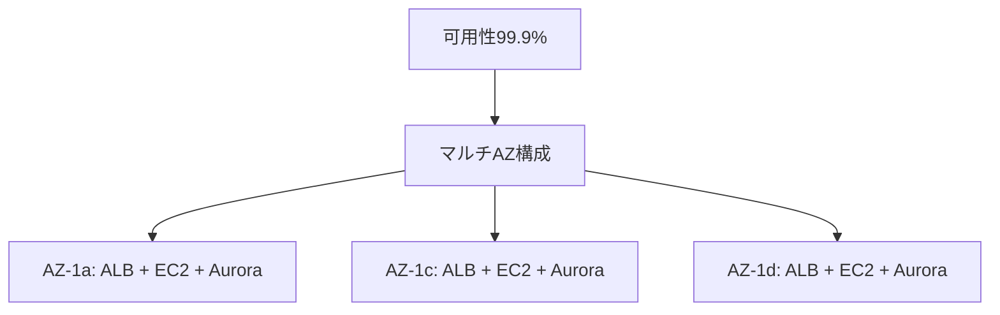
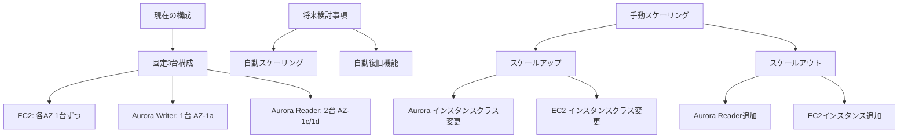
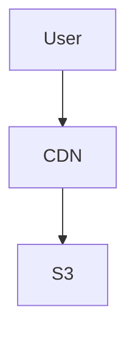
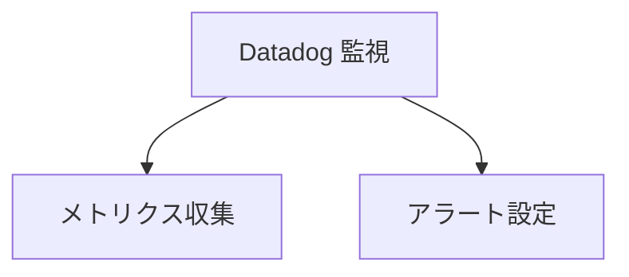
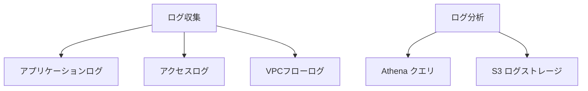
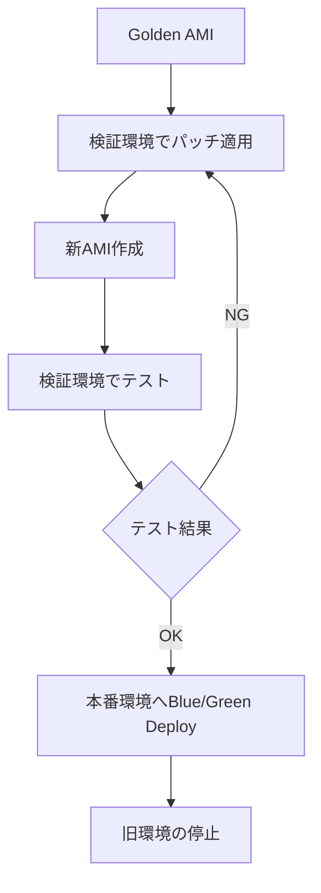

# 4. 非機能要件

## 目次

- [4. 非機能要件](#4-非機能要件)
  - [目次](#目次)
  - [4.1 可用性要件](#41-可用性要件)
    - [4.1.1 目標値・構成](#411-目標値構成)
    - [4.1.2 本システムでの可用性設計](#412-本システムでの可用性設計)
    - [4.1.3 今後、検討の余地がある項目](#413-今後検討の余地がある項目)
  - [4.2 拡張性要件](#42-拡張性要件)
    - [4.2.1 インスタンス構成要件](#421-インスタンス構成要件)
    - [4.2.2 本システム固有の拡張性設定](#422-本システム固有の拡張性設定)
    - [4.2.3 今後、検討の余地がある項目](#423-今後検討の余地がある項目)
  - [4.3 パフォーマンス要件](#43-パフォーマンス要件)
    - [4.3.1 レスポンス要件](#431-レスポンス要件)
    - [4.3.2 スループット要件](#432-スループット要件)
    - [4.3.3 スケーラビリティ要件](#433-スケーラビリティ要件)
    - [4.3.4 CDN活用要件](#434-cdn活用要件)
  - [4.4 運用要件](#44-運用要件)
    - [4.4.1 監視設計](#441-監視設計)
    - [4.4.2 ログ設計](#442-ログ設計)
      - [4.4.2.1 個人情報を含むログ](#4421-個人情報を含むログ)
      - [4.4.2.2 ジョブ（バッチ処理）で利用するログ](#4422-ジョブバッチ処理で利用するログ)
      - [4.4.2.3 ログ分析](#4423-ログ分析)
    - [4.4.3 今後、検討の余地がある項目](#443-今後検討の余地がある項目)
    - [4.4.4 Sorryページ、メンテナンスページ](#444-sorryページメンテナンスページ)
    - [4.4.5 パッチ管理要件](#445-パッチ管理要件)
      - [基本方針](#基本方針)
      - [パッチ適用フロー](#パッチ適用フロー)
      - [適用サイクル](#適用サイクル)
      - [ロールバック要件](#ロールバック要件)
      - [パッチレポート](#パッチレポート)

## 4.1 可用性要件

### 4.1.1 目標値・構成



- **可用性目標**: 99.9%以上
- **マルチAZ構成**: 3つのAZ（1a, 1c, 1d）を使用した冗長化
- **自動フェイルオーバー**: 障害時の自動切り替え
  - WEB
    - L7レイヤでのノード死活監視。
    - ノードごとにヘルスチェック用のURLを指定し、OK（健全）/ NG（不健全）状態を上位で検知できること。
    - 不健全なEC2が検知された場合、それを上位で自動的に切り離されること。
    - （ヘルスチェックによるサービスアウト以外の最適なアプローチがあれば、提案いただきたい。）例えば、
      - リソース（メモリ、CPU、Load AVG .etc）閾値超過によるサービスアウト。
      - TCP接続（L4レイヤ）でのサービスアウト。
      - これらを前述のL7レイヤでの死活チェックと組み合わせることも検討したい。
  - DB
    - Aurora Writerがフェールオーバし、Readerがその役割を担うこと。（ReaderがWriterへの昇格。）
    - WEBアプリケーションは昇格したWriterへ自動で書き込みが切り替わること。
  
### 4.1.2 本システムでの可用性設計

| サービス | CloudFormationテンプレート設定 | 備考 |
|---------|------------------------------|------|
| WAF | - | マネージドサービスであり、AWSによって可用性が担保されている |
| CloudFront | - | グローバルな範囲で設置されたエッジサーバーがあるため、高可用性なサービス |
| ELB | [elb.yaml](../../sceptre/templates/elb.yaml) の「ALBSubnetIds」にて3AZに所属するように記載済み | 本システム固有の設定が可能 |
| ~~ECS~~ | [ecs.yaml](../../sceptre/templates/ecs.yaml)の「ECSSubnetIds」、「AutoScaleMinCapacity」に3を指定することで、3AZに所属するように記載済み | 本システム固有の設定が可能<br/>本システムではECSSをWEBアプリケーションとしては利用しない。 （内部管理ツールで利用の可能性はある。）|
| EC2 | ⚠️ CfnテンプレートがBPRより提供されていない。Multi-AZ、ノードの冗長性を本システム向け個別に定義する必要がある。 |  |
| Aurora | [aurora.yaml](../../sceptre/templates/aurora.yaml) の「DBSubnetIds」、「DBInstance1AZ」、「DBInstance2AZ」、「DBInstance3AZ」にて3AZに所属するように記載済み | 本システム固有の設定が可能 |
| ~~ElastiCache~~ | [elasticache.yaml](../../sceptre/templates/elasticache.yaml)の「ElastiCacheSubnetIds」、「PreferredCacheClusterAZs」にて3AZに所属するように記載済み | 本システム固有の設定が可能<br/>本システムではElasticCacheを利用しない。 |

### 4.1.3 今後、検討の余地がある項目

- マルチAZ構成、冗長化構成、リードレプリカの検討
- 自動再起動設計
- 災害時の復旧方針の検討
- 災害時を考慮したデータ保管の仕組みの検討
- BCP要件の詳細検討

## 4.2 拡張性要件

### 4.2.1 インスタンス構成要件

**現時点での要件：**

- 本システムの特性として、急激にアクセスが増加することは想定しづらい
- **最小構成**: 常時3台（各AZに1台ずつ）を起動
  - EC2インスタンス: 3台固定（AZ-1a, AZ-1c, AZ-1d に各1台）
  - Aurora Writer: 1台（AZ-1a）
  - Aurora Reader: 2台（AZ-1c, AZ-1d）
- **自動スケーリング機能**: 将来検討 **[FUTURE]**
  - 現時点では動的なスケールアウト機能は不要
- **自動復旧機能**: 今後検討 **[TBD]**
  - インスタンスが失われた際に自動起動して3台を維持するかは未定
- **手動スケーリング機能**: **[SHOULD]**
  - 将来的な負荷増加に備え、手動でのスケールアップ・スケールアウトは可能にしておく



### 4.2.2 本システム固有の拡張性設定

| サービス | CloudFormationテンプレート設定 | 備考 |
|---------|------------------------------|------|
| WAF | - | マネージドサービスであり、AWSによって拡張性が担保されている |
| CloudFront | - | グローバルな範囲で設置されたエッジサーバーがあるため、拡張性も考慮されたサービス |
| ELB | - | マネージドサービスであり、AWSによって自動拡張される |
| ~~ECS~~ | AutoScale<br>ecs.yamlの「AutoScaleMaxCapacity」、「AutoScaleMinCapacity」を指定し、拡張可能 | 本システムでは利用しない |
| EC2 | **現在**: 固定3台構成（各AZ 1台ずつ）<br>**将来**: 手動スケーリングに対応可能な設計<br>⚠️ Cfnテンプレートはidhub独自に作成 | 自動スケーリング機能は将来検討 |
| Aurora | **現在**: Writer 1台 + Reader 2台の固定構成<br>**将来**: 手動スケーリング対応<br>- スペックアップ: [aurora.yaml](../../sceptre/templates/aurora.yaml)の「DBInstanceClass」変更<br>- スケールアウト: 「DBInstanceXX」追加 | 自動スケーリング機能は将来検討 |
| ~~ElastiCache~~ | スペックアップ<br>elasticache.yamlの「CacheNodeType」を指定し、拡張可能<br>スケールアウト<br>elasticache.yamlの「NumCacheClusters」を指定し、拡張可能 | |

### 4.2.3 今後、検討の余地がある項目

- **EC2自動復旧機能**
  - インスタンス障害時に自動起動して3台を常時維持する仕組み
  - Auto Scaling Groupによる実装を検討
- **動的スケーリング機能**
  - 負荷に応じた自動スケールアウト・スケールイン
  - CloudWatch メトリクスベースのAuto Scaling実装
- **Aurora自動復旧機能**
  - Reader インスタンス障害時の自動復旧
- **予測スケーリング**
  - 時間帯・曜日パターンに基づくスケーリング

## 4.3 パフォーマンス要件

### 4.3.1 レスポンス要件

- **ページ表示時間**: 2秒以内
  - ページ描画、もしくはトランザクションの際に、対向先システムのパフォーマンス影響をモロに受けるが、その処理時間は含めない。

### 4.3.2 スループット要件

- 実績ベース
  - 2025年初頭の、オンプレミス環境におけるOSバージョンアップ（VMインスタンス入れ替え）以降。
  - 2025-01-25近辺で、 **1サーバあたり、最大、約 4 req/sec** を記録している。
  


- `4 req/sec x 4台 (web全台数) x 10（係数） = 160 req/sec` を要件としたい。
  - `10（係数）` は、近い将来、大量のアクセスを発生させる `OCNメール基盤` が本システムとの連携を開始したと想定している。
  - この係数に根拠はない。あくまで仮の係数を目標値として設定した。

### 4.3.3 スケーラビリティ要件

- **自動スケーリング**: 負荷に応じた動的な拡張・縮退 **[OPTIONAL]**

### 4.3.4 CDN活用要件

- **静的コンテンツ配信**: CloudFrontによる配信最適化
  - 後述の [4.4.4 Sorryページ、メンテナンスページ](#444-sorryページメンテナンスページ) をコンテンツ配信するのみ。
  - CDNと静的コンテンツであることから、十分なパフォーマンスが得られるはず。
  - よって高速、高スループットを要件として掲げる。



- スループット＝`1,000 req/sec`、レスポンス＝`0.5sec以内`

## 4.4 運用要件

### 4.4.1 監視設計



- **監視**
  - 手段は問わないが、以下を選択肢として想定している。
    - Datadog が社内デファクトスタンダードとなっている。
    - Cloud Watch （AWS標準）でも構わない。
- **URL監視**
  - WEB性能監視
    - 単位時間内に、レスポンスの遅いページの比率、もしくは絶対数が超えた場合にアラート発報する。
    - 例： 「10分以内に、5秒以上のレスポンスが、（100回以上 OR 総リクエストの30%以上）の状態に陥ったらアラート発報。」
  - HTTPステータス監視
    - アクセスログ全体で、HTTPステータス 500番台（サーバ側エラー）が、全体の比率、もしくは絶対数を超えた場合にアラート発報する。
    - 例： 「10分以内に、50xエラーが、（100回以上 OR 総リクエストの10%以上）の状態に陥ったらアラート発報。」
  - WEB応答監視
    - 日本国内の複数拠点からのアクセスを行う。
    - 全ての拠点から監視対象URLにアクセスできること、を正常として監視する。
    - Timeout値、リトライ回数、リトライインターバル、応答文字列を定義できること。
- **アプリケーションログ監視**
  - 単位時間内に、ログファイル中のエラーを示す特定の文字列を含む行が、指定の回数（閾値）以上出現した場合にアラートを発生させる。
  - 「特定の文字列」は `[[E]]` や `ERROR` を、今のところ想定している。
  - アプリケーションログのエラー行、一例。エラー行なので、 `[[E]]` が含まれている。
    - `AUTHN,2025/10/30 14:57:20.550,[ajp-nio-127.0.0.1-48009-exec-2],SelectOCN.java:executeProcess:78,ERROR,202.94.86.5, 38CBD9EECF5A2D994C3192E5EEE40BA8, IDCAUE00001, [[E]] OCN IDユーザー情報取得に失敗,error:OCN IDユーザー情報取得に失敗HTTPトランスポート・エラー: java.net.ConnectException: 接続を拒否されました (Connection refused)`
- **プロセス監視**
  - 指定したプロセスが起動していることを監視。（例. `httpd`）
- **リソース監視**
  - CPU使用量、メモリ使用量、HDD使用量、ネットワーク帯域使用量、等が、利用比率の閾値を超えた際にアラート発報させること。
- **イベント監視**
  - Auto Scaling成功時（Infoレベル）、失敗時（Errorレベル）。
  - その他、AWSの内部的な構成変更の成功、失敗の検知。
- **アラート**: 異常検知時の自動通知
  - 通知媒体は以下を網羅すること。
    - メール **[MUST]**
    - Slack、Teams **[SHOULD]**
    - 架電 **[MUST]**

### 4.4.2 ログ設計



- **ログ**
  - 以下のログに大きく分類される。
    - アプリケーションログ
    - アクセスログ
    - VPCフローログ
    - 監査ログ（API操作、個人情報へのアクセス）

#### 4.4.2.1 個人情報を含むログ

- アプリケーションログには個人情報が含まれる可能性がある。idhub,idhub-help
- 個人情報を含むログを隔離、アクセス制限する点については、[セキュリティ要件](./README.md#3-セキュリティ要件) を参照
- 個人情報を個別にマスクしたログを保存または用意することは不要。**[WON'T]**
  - 利用する頻度に比べて整備するコストが高過ぎそうなため。

#### 4.4.2.2 ジョブ（バッチ処理）で利用するログ

- 統計情報のレポート作成に前述のアプリケーションログを利用している。
- 特定のログ出力を抽出しカウントする方式。

- バッチ処理から参照できる状態でログを保持する。**[MUST]**
- 現在利用しているログは、前日分のアプリログ。将来的に月次レポートの要件がでてきても前月分のログの参照程度を想定。
- 対象のログ情報をDBに格納し、バッチ処理ではDBを参照する方式に変更することも検討している。
  - バッチ処理からのログの扱いやすさと、アプリ改修コストのバランスを考慮することになる。

#### 4.4.2.3 ログ分析

- AthenaによるS3ログの分析・可視化
  - 各分散されたインスタンスへログインしてコンソール操作することなく、集約されたログに対してクエリ発行（grep相当）ができること。

### 4.4.3 今後、検討の余地がある項目

- 収集対象のログの選定
- ログ収集の仕組み
  - `fluent-bit` の利用がBPRより推奨されている。
- 保存期間、ログ保存先
- 監視項目・閾値の設定

### 4.4.4 Sorryページ、メンテナンスページ

- Sorryページに手動で切り替えられること。
  - 以下の不足の事態となるシーンを想定している。
    - AWSの機能供給停止。
    - セキュリティ上、システムが乗っ取られ、その調査のために一切のWEBサービス機能の提供を止めたいとき。
  - 「ただいまご利用になれません。」 - `503 Service Temporary Unavailable` といったコンテンツ/ヘッダを返戻する。
  - 如何なるRequest URIでも、このコンテンツを返戻する。（＝ `GET /foo/bar` でも、 `POST /baz` でも、このコンテンツを返戻する。）
    - ただし、そのページ上に張り付いている「素材」に対するリクエストは、この限りではない。言い換えると、拡張子 `*.jpg`, `*.jpeg`, `*.png`, `*.css`, `*.js`, `*.gif`, `.ico`, `*.svg` に対する如何なるリクエストは、素直に通常通り、コンテンツを返戻する。
  - **身内、通常閲覧モード** = 関係者からのリクエストは通常のWEBアプリケーション動作をさせる。
    - 一般ユーザにはSorryやメンテナンスページを表示させるが、関係者・身内に対するリクエスト・アクセスは、通常通りのWEBアプリケーション動作させる。
    - Sorry/メンテナンスページの解除をする前に、正常動作の確認などに用いるものである。
    - 何を以って「身内」、「関係者」と認識させるか？については、特定のソースIPからのアクセス、もしくは特定の認証を通過した人を想定している。ゼロトラストネットワークがトレンドの昨今、後者が望ましい。
  - **AWSが世界全体で機能不全になる、までは想定していない。** よって、Cloud Front＋S3などで静的コンテンツを配信できればベターである。
- メンテナンスページに手動で切り替えられること。
  - 機能的にはSorryページと同等である。
  - その違いは、コンテンツ / ヘッダが、「メンテナンス中です。MM月DD日 HH:MM～HH:MM（予定）」 / `503 Service Temporary Unavailable` となるだけである。
- 📖関連・参考： [システムセキュリティ対策マニュアル（ドコモ・ドコモ機能分担会社版）.pdf](https://nttdocomo.sharepoint.com/:b:/r/sites/rules/DocLib/%E3%82%B7%E3%82%B9%E3%83%86%E3%83%A0%E3%82%BB%E3%82%AD%E3%83%A5%E3%83%AA%E3%83%86%E3%82%A3%E5%AF%BE%E7%AD%96%E3%83%9E%E3%83%8B%E3%83%A5%E3%82%A2%E3%83%AB%EF%BC%88%E3%83%89%E3%82%B3%E3%83%A2%E3%83%BB%E3%83%89%E3%82%B3%E3%83%A2%E6%A9%9F%E8%83%BD%E5%88%86%E6%8B%85%E4%BC%9A%E7%A4%BE%E7%89%88%EF%BC%89.pdf?csf=1&web=1&e=TAJ0Bs) 🔒 > `7.3. WEBサーバのセキュリティ対策` より抜粋。

```plaintext
■ 管理策
......
(8)サーバ停止に備えて、ソーリー用システム/Web コンテンツを準備すること。
```

### 4.4.5 パッチ管理要件

EC2インスタンスのセキュリティパッチ適用に関する要件です。

#### 基本方針



- **適用方式**: Blue/Greenデプロイメントによる無停止更新
- **適用タイミング**: 平日営業時間内に実施（サービス停止なし）
- **パッチベースライン**: 
  - セキュリティパッチ: 自動適用対象
  - その他パッチ: 検証後適用
- **管理ツール**: AWS Systems Manager Patch Manager

#### パッチ適用フロー

| ステップ | 内容 | 実施場所 |
|---------|------|---------|
| 1. パッチ適用 | Golden AMIに対してパッチ適用 | 検証環境 |
| 2. AMI作成 | パッチ適用済みの新AMI作成 | 検証環境 |
| 3. 動作確認 | E2Eテスト、動作確認 | 検証環境 |
| 4. 本番デプロイ | Blue/Greenデプロイで段階的適用 | 本番環境 |
| 5. 監視 | 新環境の監視・確認 | 本番環境 |
| 6. 切り戻し | 問題発生時は旧AMIに切り戻し | 本番環境 |

#### 適用サイクル

- **定期パッチ**: 月次で実施
- **緊急パッチ**: 重大な脆弱性発見時は臨時実施
- **適用時間帯**: 平日 10:00-17:00（サービス無停止）

#### ロールバック要件

- **ロールバック手順**: Launch Templateのバージョンを旧バージョンに戻す
- **保持世代**: 過去10世代のAMI/Launch Templateバージョンを保持
- **切り戻し時間**: 30分以内にロールバック完了

#### パッチレポート

- **適用結果**: Patch Managerダッシュボードで確認
- **月次レポート**: 適用状況を月次でレポート作成
- **未適用パッチ**: 理由を文書化し、期限を設定

詳細な実装方法については [§ 6.3 デプロイ・ライフサイクル管理](./06-server-architecture.md#63-デプロイライフサイクル管理) を参照してください。
