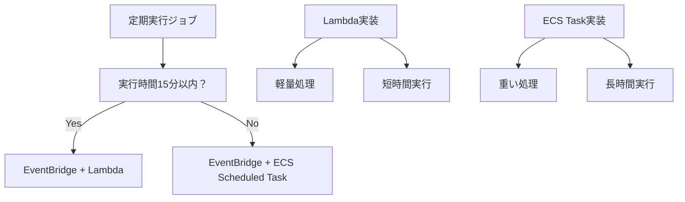

# 5. 追加機能要件

## 目次

- [5. 追加機能要件](#5-追加機能要件)
  - [目次](#目次)
  - [5.1 メール送信要件](#51-メール送信要件)
    - [5.1.1 基本方針](#511-基本方針)
    - [5.1.2 SES利用時の留意事項](#512-ses利用時の留意事項)
    - [5.1.3 ユーザー問合せ対応](#513-ユーザー問合せ対応)
  - [5.2 バックアップ設計要件](#52-バックアップ設計要件)
    - [5.2.1 基本方針](#521-基本方針)
    - [5.2.2 本システム固有のバックアップ構成](#522-本システム固有のバックアップ構成)
    - [5.2.3 バックアップ対象とその世代や格納先](#523-バックアップ対象とその世代や格納先)
  - [5.3 ジョブ設計要件](#53-ジョブ設計要件)
    - [5.3.1 基本方針](#531-基本方針)
    - [5.3.2 AWS機能を使用したジョブ実装例](#532-aws機能を使用したジョブ実装例)
  - [5.4 コンソールログイン要件](#54-コンソールログイン要件)
  - [5.5 デプロイ要件](#55-デプロイ要件)
    - [5.5.1 IaC（Infra as a Code）](#551-iacinfra-as-a-code)
  - [5.6 マイグレーション要件](#56-マイグレーション要件)

## 5.1 メール送信要件

### 5.1.1 基本方針

- 本システム `idhub` では、Amazon Simple Email Service (Amazon SES)を利用する。

### 5.1.2 SES利用時の留意事項

- 苦情/バウンス率の監視(バウンス率、苦情率)
- 送信ログの取得(送信履歴の保存等)
- ドメイン認証(SPF,DKIM,DMARC等)

### 5.1.3 ユーザー問合せ対応

- ユーザーからの問合せに対応するための要件。主に「メールが届かない」という問合せの対応。

- 個別メアド宛ての送信履歴(成功/失敗)を参照できるようにする。**[MUST]**
- 特定のメアドに対して送信制限がかかっている場合に、その理由の確認と制限解除ができるようにする。**[MUST]**
- ユーザー対応しているスタッフが操作できるよう手引書or教育が必要。 **[MUST]**

## 5.2 バックアップ設計要件

### 5.2.1 基本方針

システム障害からの復旧のため、定期的にシステムバックアップや、DBバックアップ・ファイルバックアップを行う必要がある

### 5.2.2 本システム固有のバックアップ構成

| サービス | CloudFormationテンプレート設定 |
|---------|------------------------------|
| ~~ECS~~ | 特になし (ログについては別途収集を行う) |
| EC2 | **Golden AMI方式**を採用 - パッチ適用・アプリデプロイ時に検証済みAMIを作成 - EBSスナップショットはAMI作成時に自動生成 - 世代管理: 過去10世代を保持 詳細は [§ 6.3](./06-server-architecture.md#63-デプロイライフサイクル管理) 参照 |
| Aurora | スナップショットを取得 保存世代：7日間（[aurora.yaml](../../sceptre/templates/aurora.yaml) の「BackupRetentionPeriod」で指定） 取得タイミング：aurora.yamlの「BackupWindow」で指定 |

### 5.2.3 バックアップ対象とその世代や格納先

| 項目 | 世代数 | 格納先 | 取得方式 | リストア方式 |
|------|-------|--------|--------|--------|
| OSログ ( `/var/log/{messages,secure,falcon-sensor}` ) | 3年間 | S3。180日以上経過したものはGlacierへ。 直近90日間は容易にアクセスできるようにする。 🎈(1) | ファイル | 特にリストアしない。Athena等経由し分析・閲覧するのみ。 |
| WEBアクセスログ | 3年間 | 🎈(1) | 24時間ごとに区切られたファイル ( `access_log.YYYYMMDD`, `error_log.YYYYMMDD` ) | 〃|
| アプリケーションログ | 3年間 | 🎈(1) | 24時間ごとに区切られたファイル ( `user.log.YYYY-MM-DD` ) | 〃 |
| Golden AMI | 10世代 | AWS (AMI) | 不定期（パッチ適用・アプリデプロイ時） 月次パッチ＋アプリリリースで2-3世代/月想定 | Launch Templateから起動 |
| EBS Snapshot | AMIと同世代 | AWS (Snapshot) | AMI作成時に自動生成 | AMIからのEC2起動時に自動利用 |
| DB | 最低14日間（14世代） 🎈(2)  | (特に問わず) | フルダンプ。もしくはそれを基点にしたインクリメンタルバックアップ。 | Point In Time Recoveryで直近1時間前～最長14日間前の状態に戻せること。 |

**Golden AMI管理戦略**:
- **作成タイミング**: パッチ適用時、アプリケーションリリース時
- **命名規則**: `idhub-web-YYYYMMDD-HHmm-{patch|app}-v{version}`
- **検証プロセス**: 
  1. 検証環境で新AMI作成
  2. E2Eテスト実行
  3. 合格後に本番環境へデプロイ
- **世代管理**: 古いAMI（11世代目以降）は自動削除
- **ロールバック**: Launch Templateのバージョン切り替えで実現

詳細は [§ 6.3 デプロイ・ライフサイクル管理](./06-server-architecture.md#63-デプロイライフサイクル管理) を参照してください。

#### 5.2.3.1 （参考）ログの保存期間に関する社内規定

- 📘 [情報管理細則（顧客情報編）.pdf](https://nttdocomo.sharepoint.com/:b:/r/sites/rules/DocLib/%E6%83%85%E5%A0%B1%E7%AE%A1%E7%90%86%E7%B4%B0%E5%89%87%EF%BC%88%E9%A1%A7%E5%AE%A2%E6%83%85%E5%A0%B1%E7%B7%A8%EF%BC%89.pdf?csf=1&web=1&e=COfWOC) 🔒 > `第11条(保存期間等)` より抜粋。

> 第11条(保存期間等)
>
> 1. 情報管理責任者は、顧客情報を取り扱うにあたり、利用目的の達成に必要な範囲に限り、顧客情報の保存期間を設定する。
> 2. 役務提供終了後又は解約後の顧客情報(通信の秘密およびお客様情報に限る)の保存期間は、最長3年とする。

- 決済・課金を伴う情報のログの保存期間（社内固有でなく、一般的な情報）
  - 法令・社内規定で長期保存が必要
  - 会計・税務関連の法令により7年間の保存義務が一般的。これは電子帳簿保存法や商法の規定に準じている。
  - **本システム idhub では**
    - 本システム自体ではないが密接に連携してしまっているポイントシステムでdポイントを扱っている。
    - そのシステム上での提供サービス「dポイントのためる・つかう」は、dポイントが金銭のやり取りと同等とみなされるため、 お客様の個人情報は退会後でも **7年+αの個人情報保持を行う。**
      - オンプレミス上の現システムにて、具体的には、dアカウント連携解除（≒退会）後の個人情報削除までの保持期間が7年(2600日)になっている。
      - これはアプリケーションの仕様・特性上、DBレコードとして個人情報を残すことを意味しているのであって、DBデータのバックアップという観点では前述 🎈(2) の世代数・日数である。
- 📗[log-files-transfer-policy.xlsx](https://nttdocomoocx.sharepoint.com/:x:/r/sites/ID-Point/Shared%20Documents/%E4%B8%80%E8%88%AC/gooID%E8%AA%B2%E9%87%91HW%E6%9B%B4%E6%94%B9/General/01_%E6%8A%80%E8%A1%93%E6%A4%9C%E8%A8%8E%E8%B3%87%E6%96%99/2022-08-%E3%83%AD%E3%82%B0%E3%82%B9%E3%83%88%E3%83%AA%E3%83%BC%E3%83%9F%E3%83%B3%E3%82%B0%E5%8C%96%E6%A7%8B%E6%83%B3/log-files-transfer-policy.xlsx?d=wbb19e534e35b4fe39de290e18073da59&csf=1&web=1&e=8iWOmb&nav=MTVfezNDOUM4OUM1LUYzNTYtNEQzNi04Q0Y1LTM1N0ZCRThCMTE5RH0) 🔒
  - オンプレミス環境での `transfer-s3` を利用したログバックアップ設計。

## 5.3 ジョブ設計要件

### 5.3.1 基本方針

- 既存資産である、Perl言語によるジョブスクリプト群を必ずしも再利用する必要はない。資産としてそれほど大きくない（＝コード量としてそんなに大きくない）ため。
- 現オンプレミス上では、Active/Standby形式のHA構成 を採用しているが、 **(1) 運用が複雑であること** / **(2) フェールオーバ時には不安が大きく、運用者の心理的安全性が低いこと**、を理由に採用しない。

### 5.3.2 AWS機能を使用したジョブ実装例

- 実行時間がLambdaの実行処理時間制限内(15分以内)の場合は、EventBridgeでLambdaをスケジュール実行をする
  - これに該当。 💐 **採用する。**
  - 参考： [idhub_ バッチ処理移行検討.md](../../draft/idhub_%20バッチ処理移行検討.md)
- ~~実行時間がLambdaの実行処理時間制限を超える場合は、EventBridgeでECS Scheduled Taskをスケジュール実行する~~

- 失敗時の再実行。 **[WON'T]**
  - 「失敗」を検知さえできればよい。（ [4.4.2 ログ設計](./04-non-functional-requirements.md#442-ログ設計) の範疇） そして、手動再実行できればよい。
- ワークフロー **[WON'T]**
  - 「ジョブ A が終わったら、ジョブBを実行。」といったジョブ間での依存関係設定は必要ない。
- 日時、曜日、日付を契機に、ジョブ起動・実行できること。 **[MUST]**

## 5.4 コンソールログイン要件

- 各検証環境、もしくは商用環境のインスタンスにリモート接続を行い、アプリの起動/停止、設定変更、ログの参照などを行う。
- **SSHは利用しない。SSMでCLIコンソールログインする。** **[MUST]**
  - 特定のユーザーからのみリモートログインを許可。
  - MFAを必須とする。

## 5.5 デプロイ要件

- デプロイについては、 ~~ローリングアップデートのシンプルな構成とする。~~ サービス無停止でソフトウェア・アプリケーションをアップデートできること。
- また、切り戻しが容易にできること。
- 上位バージョンのアプリケーションを公開する前に、内部の作業者が動作確認できること。（Keyword： `影武者` ）
- アプリのデプロイ手段。
  - 現状だとJenkinsによって、Javaビルド（Ant）やデプロイといったタスクを、半自動化・ワークフロー化している。
  - が、反面、手動での入れ替えもできるようにしておきたい。**[SHOULD]** 例外的な手順でのデプロイを想定している。
- （検証環境）手動でビルドできるようなインスタンスが必要。 **[SHOULD]**
  - Jenkinsの現状のCI･CDの仕組みだと、必ずGitのBranchへCommitしなければならない。検証環境の段階ではそこをSkipし、手動でビルドしたいため。
  - 将来的にオンプレミスの三鷹データセンターが無くなることを想定しAWS上に用意。（webのEC2に同居でもいいかも。）

### 5.5.1 IaC（Infra as a Code）

- ネットワーク（VPC、ALB、Network Firewall .etc）や、EC2インスタンスの定義については、Cloud Formationで行う。
- その他、アプリケーションレイヤに近い部分（ミドルウェア、DNFパッケージ、そのConfigファイル .etc）については、Ansible Playbookで構成管理していく。 **[MUST]**
  - Playbookの過去資産が大きいため。

- AWS VPC内のインスタンスから Cfn やPlaybookを実行してもよいが、 **作業者のデスクトップから実行できるとベター**

## 5.6 マイグレーション要件

- 許容されるダウンタイム
  - 最大、6時間ぐらいのサービス停止は可能。
    - メンテナンスページ、 `503 Service Temporary Unavailable` による機能提供停止。
    - （備考）周辺の別サービス（ `point.d.goo.ne.jp` や OCNトップ、OCNマイページ）にも協力してもらい、一部もしくは全機能を停止してもらう必要がある。）
  - 無停止でマイグレーションできれば、それに越したことは無い。
- マイグレーション方式（データ同期の為の経路）
  - 経路
    - ♦️TODO：よくわからない。
    - RクラウドというデータセンタからAWSへのマイグレーションは、VPN経路が提供されていた。
    - 三鷹データセンタでは用意されていない。
    - 個人情報データを含むとはいえ、データ自体の暗号化、かつ、SCPによる転送データの暗号化、で十分ではないか？不必要なまでにVPNを必要としなくてよいのではないか？
  - 方式
    - DB
      - 十分な停止許容時間があるため、オンプレミス側でフルダンプし、AWSでリストアする形でよい。
    - ログ
      - 事前、もしくは、マイグレーション完了後、データ保管のために手動で転送する。
