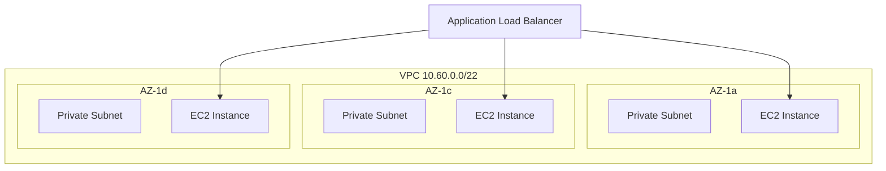
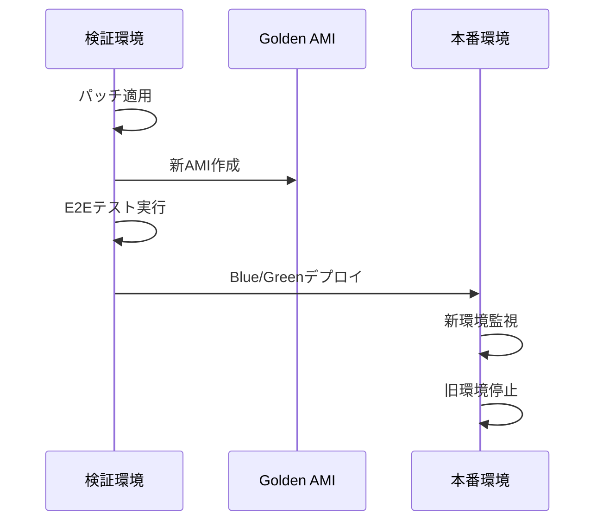
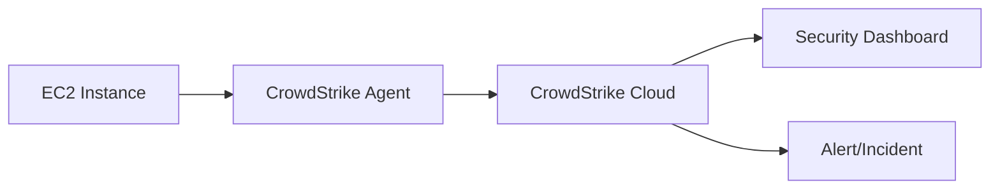
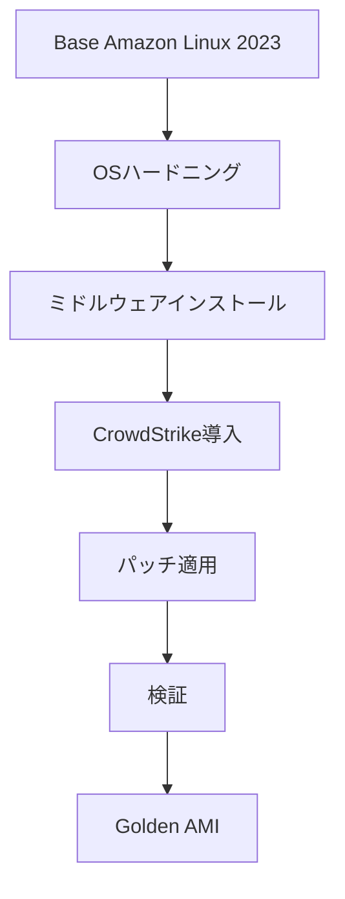
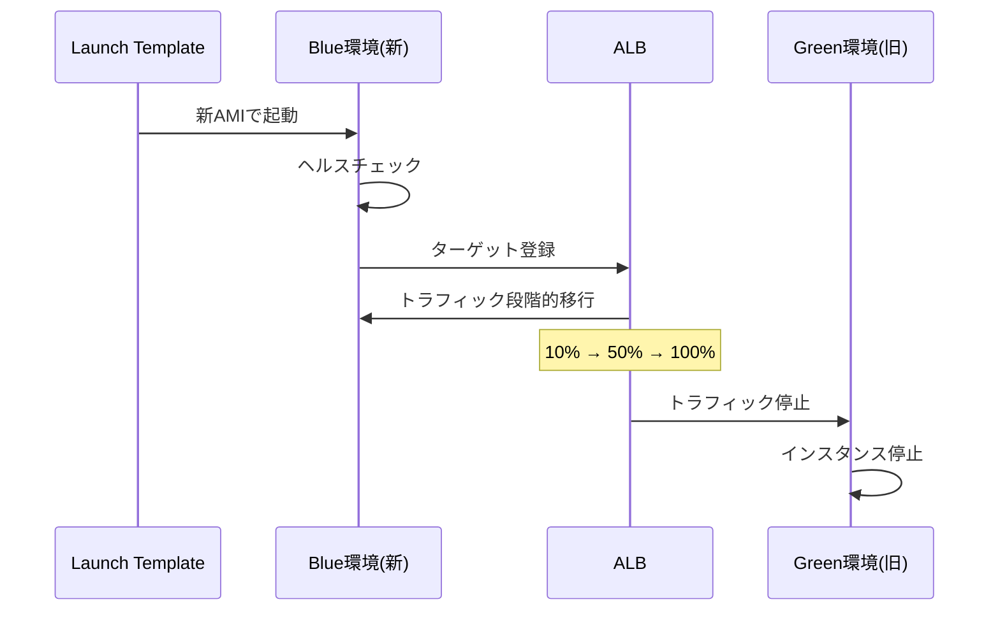
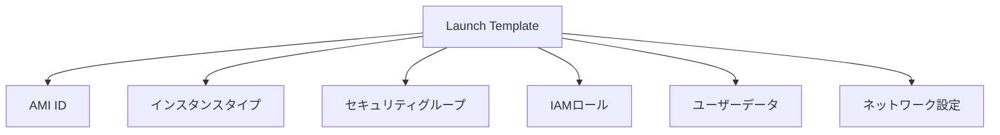
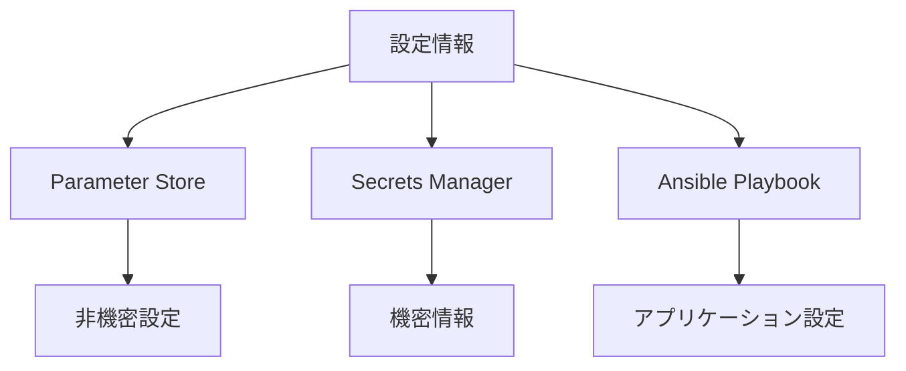
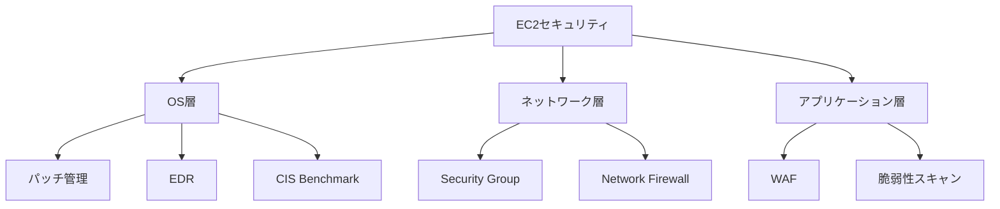

# 6. サーバ構成詳細要件

## 目次

- [6. サーバ構成詳細要件](#6-サーバ構成詳細要件)
  - [目次](#目次)
  - [6.1 EC2インスタンス要件](#61-ec2インスタンス要件)
    - [6.1.1 インスタンスタイプ](#611-インスタンスタイプ)
      - [採用インスタンス](#採用インスタンス)
      - [選定基準](#選定基準)
    - [6.1.2 ストレージ要件](#612-ストレージ要件)
    - [6.1.3 ネットワーク要件](#613-ネットワーク要件)
    - [6.1.4 購入オプション](#614-購入オプション)
      - [推奨: EC2 Instance Savings Plans](#推奨-ec2-instance-savings-plans)
      - [検討事項](#検討事項)
  - [6.2 OSセキュリティ要件](#62-osセキュリティ要件)
    - [6.2.1 パッチ管理](#621-パッチ管理)
      - [基本方針](#基本方針)
      - [パッチ適用フロー](#パッチ適用フロー)
      - [パッチベースライン](#パッチベースライン)
      - [ロールバック手順](#ロールバック手順)
    - [6.2.2 ハードニング](#622-ハードニング)
      - [CIS Benchmark準拠](#cis-benchmark準拠)
      - [実装方法](#実装方法)
    - [6.2.3 エンドポイント保護](#623-エンドポイント保護)
      - [CrowdStrike Falcon導入](#crowdstrike-falcon導入)
    - [6.2.4 脆弱性管理](#624-脆弱性管理)
      - [脆弱性検知ツール](#脆弱性検知ツール)
      - [管理フロー](#管理フロー)
  - [6.3 デプロイ・ライフサイクル管理](#63-デプロイライフサイクル管理)
    - [6.3.1 Golden AMI戦略](#631-golden-ami戦略)
      - [基本概念](#基本概念)
      - [AMI管理ポリシー](#ami管理ポリシー)
      - [AMI作成フロー](#ami作成フロー)
      - [EC2 Image Builder活用（オプション）](#ec2-image-builder活用オプション)
    - [6.3.2 Blue/Greenデプロイメント](#632-bluegreenデプロイメント)
      - [デプロイフロー](#デプロイフロー)
      - [実施手順](#実施手順)
      - [ロールバック手順](#ロールバック手順-1)
    - [6.3.3 Launch Template管理](#633-launch-template管理)
      - [Launch Templateの役割](#launch-templateの役割)
      - [バージョン管理](#バージョン管理)
      - [設定項目](#設定項目)
    - [6.3.4 設定管理](#634-設定管理)
      - [設定情報の分類](#設定情報の分類)
      - [Parameter Store利用](#parameter-store利用)
      - [Secrets Manager利用](#secrets-manager利用)
      - [Ansible Playbook構成管理](#ansible-playbook構成管理)
  - [6.4 運用上の検討事項](#64-運用上の検討事項)
    - [6.4.1 運用負荷](#641-運用負荷)
    - [6.4.2 セキュリティ対策](#642-セキュリティ対策)
    - [6.4.3 コスト最適化](#643-コスト最適化)
      - [推奨施策](#推奨施策)
      - [モニタリング](#モニタリング)
    - [6.4.4 ECS/Fargateとの比較](#644-ecsfargateとの比較)
  - [参考資料](#参考資料)
    - [AWS公式ドキュメント](#aws公式ドキュメント)
    - [内部ドキュメント](#内部ドキュメント)
    - [セキュリティ基準](#セキュリティ基準)
  - [改版履歴](#改版履歴)

---

本ドキュメントでは、EC2ベースのWebアプリケーション構成の詳細要件を定義します。

## 6.1 EC2インスタンス要件

### 6.1.1 インスタンスタイプ

#### 採用インスタンス

| 環境 | インスタンスタイプ | スペック | 用途 |
|------|------------------|---------|------|
| 開発環境 | t3.medium | 2vCPU, 4GB メモリ | 開発・検証 |
| 本番環境 | t3.2xlarge | 8vCPU, 32GB メモリ | 本番運用 |

#### 選定基準

- オンプレミス環境のスペックとワークロード特性を考慮
- 推奨ファミリー: 汎用インスタンス（T3/T4g、M5/M6i）
- 最小スペック: vCPU 2コア、メモリ 4GB（開発環境）

### 6.1.2 ストレージ要件

| 項目 | 要件 |
|------|------|
| **ルートボリューム** | EBS gp3、最小30GB、暗号化必須 |
| **データボリューム** | 用途に応じてgp3またはio2、暗号化必須 |
| **スナップショット** | AMI作成時に自動生成（過去10世代保持） |
| **ボリューム最適化** | 使用状況に応じた容量・IOPS調整 |

### 6.1.3 ネットワーク要件



- **配置**: プライベートサブネットへの配置必須
- **ENI**: 各インスタンスに専用のElastic Network Interface
- **セキュリティグループ**: 最小権限の原則に基づく通信制御
  - ALBからの通信のみ許可
  - アウトバウンドは必要最小限
- **Elastic IP**: NAT Gateway経由での外部通信

### 6.1.4 購入オプション

#### 推奨: EC2 Instance Savings Plans

- **割引率**: 最大72%
- **選定理由**:
  - Immutableインフラ（頻繁なAMI入れ替え）を考慮
  - Blue/Greenデプロイ時の一時的なインスタンス増加に対応
  - 特定インスタンスファミリーに対する割引
  - インスタンス数増加は基本的に予定されていないため、柔軟性よりも割引率重視

#### 検討事項

- コミット期間: 1年 or 3年
- 支払いオプション: 全額前払い、一部前払い、前払いなし
- 開発環境ではオンデマンドも検討

## 6.2 OSセキュリティ要件

### 6.2.1 パッチ管理

#### 基本方針

- **管理ツール**: AWS Systems Manager Patch Manager
- **適用タイミング**: 無停止、平日営業時間内
- **適用方式**: Blue/Greenデプロイメント

#### パッチ適用フロー



1. **検証環境でパッチ適用**
   - Golden AMIに対してパッチ適用
   - 新AMI作成
   
2. **動作確認**
   - E2Eテスト実行
   - 動作確認
   
3. **本番環境デプロイ**
   - Launch Templateを新AMIに更新
   - Blue環境（新AMI）のインスタンス起動
   - ヘルスチェック確認
   - ALBのターゲットグループを段階的に切り替え
   - Green環境（旧AMI）のインスタンス停止

#### パッチベースライン

| パッチ分類 | 適用方針 |
|-----------|---------|
| セキュリティパッチ | 月次で自動適用 |
| 重要パッチ | 検証後適用 |
| その他パッチ | 必要に応じて適用 |
| 緊急パッチ | 重大な脆弱性発見時は臨時実施 |

#### ロールバック手順

1. Launch Templateのバージョンを旧バージョンに変更
2. 新インスタンスを旧AMIで起動
3. ヘルスチェック確認後、ALBに追加
4. 問題のあるインスタンスを削除

### 6.2.2 ハードニング

#### CIS Benchmark準拠

- **基準**: Amazon Linux 2023向けCIS Benchmark
- **実施項目**:
  - 不要なサービスの無効化
  - ファイルパーミッションの適正化
  - 監査ログ設定
  - システムアカウント管理
  - ネットワークパラメータの強化

#### 実装方法

- Ansible Playbookによる自動化
- Golden AMI作成時に適用
- 定期的なコンプライアンスチェック

### 6.2.3 エンドポイント保護

#### CrowdStrike Falcon導入



- **導入方式**: Golden AMIにエージェント組み込み
- **監視対象**:
  - マルウェア検知
  - 不正プロセス検知
  - ファイル整合性監視
  - ネットワーク通信監視
- **アラート**: リアルタイム通知

### 6.2.4 脆弱性管理

#### 脆弱性検知ツール

| ツール | 用途 |
|-------|------|
| Amazon Inspector | AWSネイティブな脆弱性スキャン |
| Systems Manager | パッチコンプライアンス確認 |
| Future Vuls | 詳細な脆弱性管理 |

#### 管理フロー

1. **定期スキャン**: 週次で脆弱性スキャン実行
2. **結果評価**: CVSSスコアに基づく優先度付け
3. **対応計画**: 修正計画の策定
4. **パッチ適用**: 定期パッチサイクルで適用
5. **確認**: 修正確認スキャン

## 6.3 デプロイ・ライフサイクル管理

### 6.3.1 Golden AMI戦略

#### 基本概念

Golden AMIは、パッチ適用済み・検証済みのベースイメージです。



#### AMI管理ポリシー

| 項目 | 設定値 |
|------|--------|
| **作成タイミング** | パッチ適用時、アプリリリース時（不定期） |
| **世代管理** | 過去10世代を保持 |
| **命名規則** | `idhub-web-YYYYMMDD-HHmm-{patch\|app}-v{version}` |
| **削除ポリシー** | 11世代目以降を自動削除 |

#### AMI作成フロー

1. **検証環境で作成**
   - 既存インスタンスにパッチ適用 or アプリデプロイ
   - AMI作成（EBSスナップショット自動生成）
   
2. **検証**
   - E2Eテスト実行
   - 動作確認
   - セキュリティスキャン
   
3. **本番展開**
   - Launch Template更新
   - Blue/Greenデプロイ

#### EC2 Image Builder活用（オプション）

将来的な自動化として検討：

- パッチ適用の自動化
- 定期的なAMIビルド
- バージョン管理
- 自動テスト実行

### 6.3.2 Blue/Greenデプロイメント

#### デプロイフロー



#### 実施手順

1. **新環境起動**
   - Launch Templateから新AMIでインスタンス起動
   - 各AZに1台ずつ（計3台）
   
2. **ヘルスチェック**
   - ALBヘルスチェック確認
   - アプリケーション動作確認
   
3. **段階的切り替え**
   - ALBのターゲットグループに新インスタンス追加
   - トラフィックを段階的に移行（10% → 50% → 100%）
   - 監視ダッシュボードで異常がないか確認
   
4. **旧環境停止**
   - 旧インスタンスをALBから削除
   - 一定期間（24時間）待機後、インスタンス削除

#### ロールバック手順

問題発生時は即座にロールバック：

1. ALBのターゲットグループから新インスタンス削除
2. 旧インスタンスにトラフィックを戻す
3. 新インスタンスを停止・削除
4. 根本原因の調査・修正

### 6.3.3 Launch Template管理

#### Launch Templateの役割



#### バージョン管理

| バージョン | 内容 | 用途 |
|-----------|------|------|
| `$Latest` | 最新版 | 開発・検証 |
| `v1, v2, ...` | 固定版 | 本番環境 |
| `$Default` | デフォルト版 | フォールバック用 |

#### 設定項目

```yaml
# Launch Template主要設定
LaunchTemplate:
  ImageId: ami-xxxxx  # Golden AMI
  InstanceType: t3.2xlarge
  SecurityGroupIds:
    - sg-xxxxx  # Web tier SG
  IamInstanceProfile: idhub-web-role
  UserData: |
    #!/bin/bash
    # Minimal setup
    # Ansible pull for detailed configuration
  BlockDeviceMappings:
    - DeviceName: /dev/xvda
      Ebs:
        VolumeSize: 30
        VolumeType: gp3
        Encrypted: true
  MetadataOptions:
    HttpTokens: required  # IMDSv2強制
```

### 6.3.4 設定管理

#### 設定情報の分類



#### Parameter Store利用

```yaml
# 非機密な設定値
/idhub/prod/app/max-connections: "100"
/idhub/prod/app/timeout: "30"
/idhub/prod/aurora/endpoint: "xxx.rds.amazonaws.com"
```

#### Secrets Manager利用

```yaml
# 機密情報
/idhub/prod/db/credentials:
  username: admin
  password: <encrypted>
/idhub/prod/api/keys:
  external-api-key: <encrypted>
```

#### Ansible Playbook構成管理

- Launch Templateでは最小限のユーザーデータのみ
- Ansibleで詳細設定を自動化：
  - ミドルウェア設定
  - アプリケーション配置
  - ログ設定
  - 監視エージェント設定

## 6.4 運用上の検討事項

### 6.4.1 運用負荷

EC2採用により発生する運用業務：

| 運用業務 | 頻度 | 備考 |
|---------|------|------|
| OSパッチ管理 | 月次 | Patch Manager + Blue/Green |
| ミドルウェア更新 | 四半期 | セキュリティパッチは月次 |
| AMI管理 | 不定期 | パッチ・アプリリリース時 |
| キャパシティプランニング | 月次 | リソース使用状況レビュー |
| インスタンス更新 | 不定期 | 新AMIへの入れ替え |

**運用体制の確立が必要**: 上記業務を実施する体制・手順の整備

### 6.4.2 セキュリティ対策

EC2採用時に必要なセキュリティ対策：



- **OSレベル**: Patch Manager、Inspector、CrowdStrike
- **ログ監視**: CloudWatch Logs、Datadog
- **侵入検知**: VPCフローログ、不正アクセス監視
- **コンプライアンス**: CIS Benchmark準拠

### 6.4.3 コスト最適化

#### 推奨施策

| 施策 | 効果 | 実施時期 |
|------|------|---------|
| EC2 Instance Savings Plans | 最大72%削減 | 初期段階 |
| インスタンスタイプ最適化 | 10-30%削減 | 運用開始後 |
| EBS最適化（gp2→gp3） | 20%削減 | 初期段階 |
| 未使用リソース削除 | 変動 | 継続的 |
| 開発環境の夜間停止 | 50%削減 | 初期段階 |

#### モニタリング

- Cost Explorerでの定期レビュー
- タグベースのコスト配分
- 予算アラート設定

### 6.4.4 ECS/Fargateとの比較

将来的な移行検討のための比較表：

| 観点 | EC2 | ECS/Fargate |
|------|-----|-------------|
| **運用負荷** | OSパッチ管理が必要 | OSレス、パッチ管理不要 |
| **スケーラビリティ** | Auto Scaling（将来実装） | コンテナ単位の高速スケール |
| **セキュリティ** | OS層の管理が必要 | コンテナ層の管理のみ |
| **コスト** | 長期利用で割安（RI/SP） | 短期・変動負荷で効率的 |
| **学習コスト** | 従来型、ノウハウ豊富 | コンテナ技術の習得必要 |
| **デプロイ速度** | AMI起動に5分程度 | コンテナ起動が高速（1分以内） |
| **既存資産** | Ansible資産を活用可能 | CI/CD再構築が必要 |

**現状の判断**: 
- 暫定的なAWS移行を優先
- EC2で安定運用を確立
- 将来的なECS移行は運用状況を見て判断

---

## 参考資料

### AWS公式ドキュメント

- [Amazon EC2 ユーザーガイド](https://docs.aws.amazon.com/ja_jp/ec2/)
- [AWS Well-Architected Framework - EC2](https://docs.aws.amazon.com/wellarchitected/latest/framework/welcome.html)
- [AWS Systems Manager ユーザーガイド](https://docs.aws.amazon.com/ja_jp/systems-manager/)
- [EC2 Image Builder ユーザーガイド](https://docs.aws.amazon.com/ja_jp/imagebuilder/)

### 内部ドキュメント

- [システム設計ガイドライン](../../doc-bpr/guideline/system-design/1.system%20architecture/README.md)
- [セキュリティ設計ガイドライン](../../doc-bpr/guideline/system-design/12.security/README.md)
- [サーバ構成ガイドライン](../../doc-bpr/guideline/system-design/3.server%20architecture/README.md)

### セキュリティ基準

- システムセキュリティ対策チェックリスト
- CIS Amazon Linux 2023 Benchmark
- CrowdStrike導入ガイドライン

---

## 改版履歴

| 版数 | 日付 | 改版内容 | 作成者 |
|------|------|----------|--------|
| 1.0 | 2025-01-XX | 初版作成 | - |
