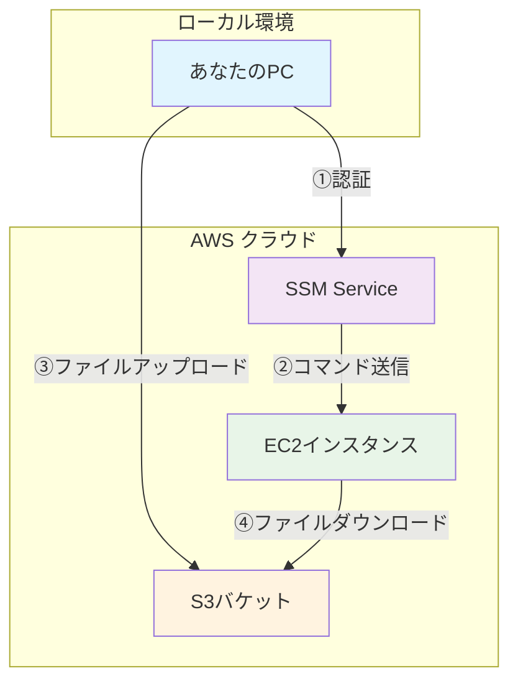
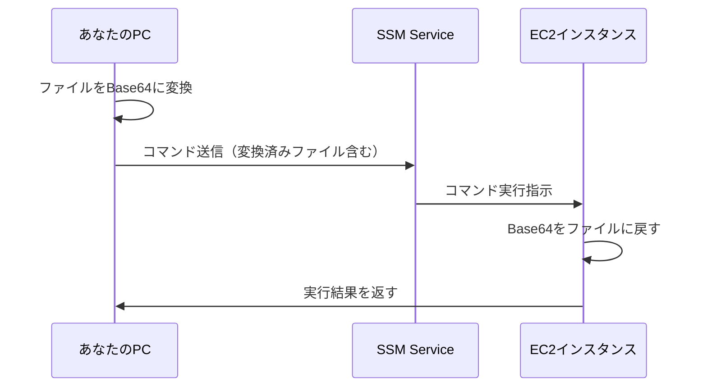
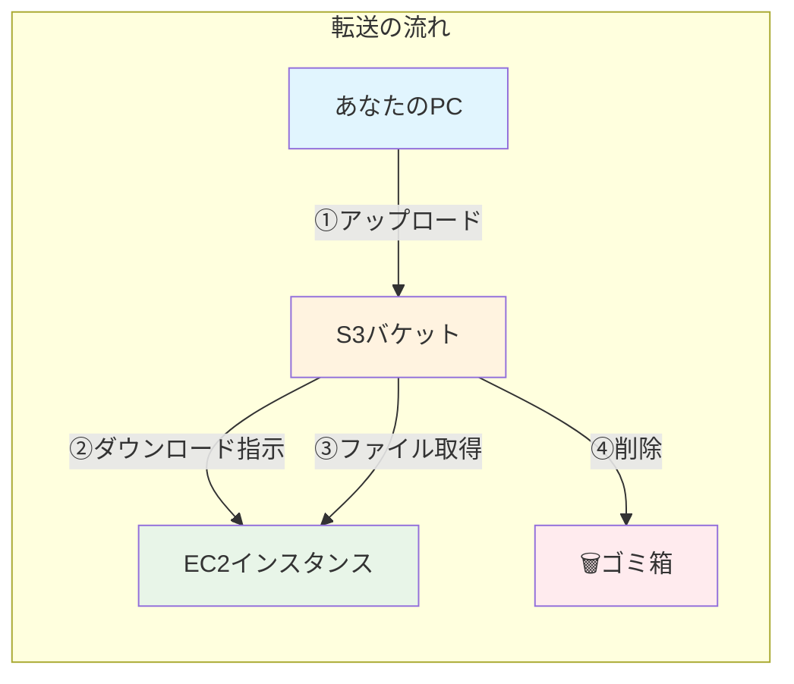
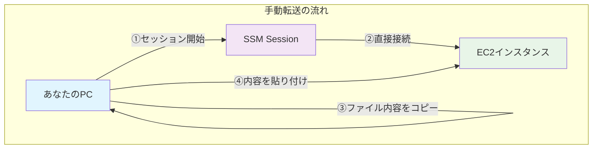
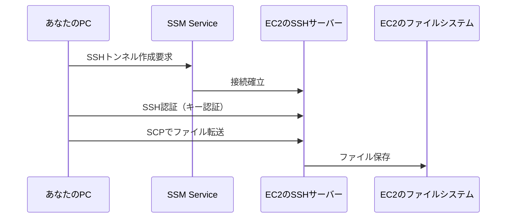
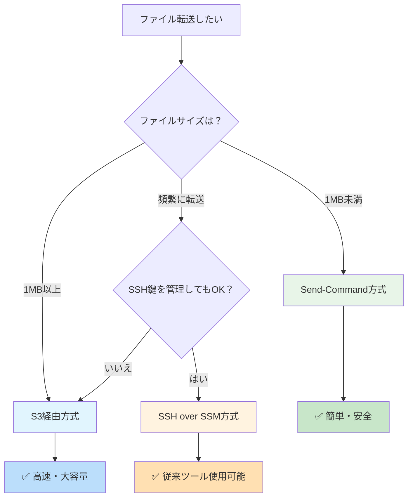

# SSMを用いたファイル転送方法

## 📑 目次

- [SSMを用いたファイル転送方法](#ssmを用いたファイル転送方法)
  - [📑 目次](#-目次)
  - [�📖 はじめに](#-はじめに)
    - [🤔 なぜSSMを使うの？](#-なぜssmを使うの)
  - [🎯 SSMファイル転送の全体像](#-ssmファイル転送の全体像)
  - [🛠️ 方法1: SSM Send-Command（小さなファイル向け）](#️-方法1-ssm-send-command小さなファイル向け)
    - [📝 概要](#-概要)
    - [🎯 仕組み](#-仕組み)
    - [💻 実際のコマンド例](#-実際のコマンド例)
      - [ステップ1: ファイルを準備](#ステップ1-ファイルを準備)
      - [ステップ2: ファイルを暗号化（Base64変換）](#ステップ2-ファイルを暗号化base64変換)
      - [ステップ3: EC2に送信](#ステップ3-ec2に送信)
    - [✅ メリット](#-メリット)
    - [❌ デメリット](#-デメリット)
  - [🛠️ 方法2: S3経由転送（大きなファイル向け）](#️-方法2-s3経由転送大きなファイル向け)
    - [📝 概要](#-概要-1)
    - [🎯 仕組み](#-仕組み-1)
    - [💻 実際のコマンド例](#-実際のコマンド例-1)
      - [ステップ1: S3にファイルをアップロード](#ステップ1-s3にファイルをアップロード)
      - [ステップ2: EC2にダウンロード指示を送信](#ステップ2-ec2にダウンロード指示を送信)
    - [✅ メリット](#-メリット-1)
    - [❌ デメリット](#-デメリット-1)
  - [🛠️ 方法3: Session Manager Plugin + 手動転送](#️-方法3-session-manager-plugin--手動転送)
    - [📝 概要](#-概要-2)
    - [🎯 仕組み](#-仕組み-2)
    - [💻 実際の手順](#-実際の手順)
      - [ステップ1: EC2にセッション接続](#ステップ1-ec2にセッション接続)
      - [ステップ2: ローカルでファイル内容をコピー](#ステップ2-ローカルでファイル内容をコピー)
      - [ステップ3: EC2側でファイル作成](#ステップ3-ec2側でファイル作成)
    - [✅ メリット](#-メリット-2)
    - [❌ デメリット](#-デメリット-2)
  - [🛠️ 方法4: SSH over SSM + scp（従来方式）](#️-方法4-ssh-over-ssm--scp従来方式)
    - [📝 概要](#-概要-3)
    - [🎯 仕組み](#-仕組み-3)
    - [⚙️ 事前設定](#️-事前設定)
      - [~/.ssh/configファイルに追加](#sshconfigファイルに追加)
    - [💻 実際のコマンド例](#-実際のコマンド例-2)
    - [✅ メリット](#-メリット-3)
    - [❌ デメリット](#-デメリット-3)
    - [🔓 鍵不要の設定（一時的な用途向け）](#-鍵不要の設定一時的な用途向け)
      - [EC2側の設定手順](#ec2側の設定手順)
      - [ローカル側の設定](#ローカル側の設定)
      - [ファイル転送コマンド](#ファイル転送コマンド)
      - [✅ この方法のメリット](#-この方法のメリット)
      - [⚠️ セキュリティ上の注意点](#️-セキュリティ上の注意点)
      - [🔄 マイグレーション完了後のクリーンアップ](#-マイグレーション完了後のクリーンアップ)
  - [🎨 便利なスクリプト例](#-便利なスクリプト例)
    - [📁 ファイル転送スクリプト](#-ファイル転送スクリプト)
  - [📊 方法比較表](#-方法比較表)
  - [🎯 どの方法を選ぶべき？](#-どの方法を選ぶべき)
  - [🔧 トラブルシューティング](#-トラブルシューティング)
    - [よくあるエラーと対処法](#よくあるエラーと対処法)
      - [1. 「AccessDenied」エラー](#1-accessdeniedエラー)
      - [2. 「InvalidInstanceId」エラー](#2-invalidinstanceidエラー)
      - [3. Base64デコードエラー](#3-base64デコードエラー)
  - [📚 まとめ](#-まとめ)
    - [🎊 覚えておくポイント](#-覚えておくポイント)
    - [🚀 次のステップ](#-次のステップ)

## �📖 はじめに

このドキュメントでは、AWS Systems Manager (SSM)を使ってファイルをEC2インスタンスに転送する様々な方法を、中学生でも理解できるように説明します。

### 🤔 なぜSSMを使うの？

従来のファイル転送方法（SCPやSSH）には以下の問題がありました：
- **SSHキーの管理が大変** 🔑
- **セキュリティグループでポートを開ける必要がある** 🔓
- **インターネット経由でアクセスする必要がある** 🌐

SSMを使うことで、これらの問題を解決できます！

## 🎯 SSMファイル転送の全体像



## 🛠️ 方法1: SSM Send-Command（小さなファイル向け）

### 📝 概要
小さなファイル（数KB〜数MB）を送るのに最適な方法です。ファイルをテキストに変換して送ります。

### 🎯 仕組み



### 💻 実際のコマンド例

#### ステップ1: ファイルを準備
```bash
# test.txtというファイルを作成
echo "こんにちは、世界！" > test.txt
```

#### ステップ2: ファイルを暗号化（Base64変換）
```bash
# ファイルをBase64という形式に変換
FILE_CONTENT=$(base64 -w 0 test.txt)
echo $FILE_CONTENT
# 結果: 44GT44GT44Gr44Gh44Gv44CB5LiW55WM77yBCg==
```

#### ステップ3: EC2に送信
```bash
aws ssm send-command \
    --instance-ids "i-1234567890abcdef0" \
    --document-name "AWS-RunShellScript" \
    --parameters "commands=[\"echo '$FILE_CONTENT' | base64 -d > /home/ec2-user/test.txt\"]"
```

### ✅ メリット
- 簡単で分かりやすい
- 追加の設定が不要
- SSHキー不要

### ❌ デメリット
- 大きなファイルは送れない（約1MB制限）
- バイナリファイルの扱いが複雑

## 🛠️ 方法2: S3経由転送（大きなファイル向け）

### 📝 概要
大きなファイルや複数ファイルを送るときに使います。S3を「一時的な荷物置き場」として使用します。

### 🎯 仕組み



### 💻 実際のコマンド例

#### ステップ1: S3にファイルをアップロード
```bash
# 一意なフォルダ名を作成（重複を避けるため）
UNIQUE_ID=$(uuidgen)
echo "転送ID: $UNIQUE_ID"

# S3にファイルをアップロード
aws s3 cp large-file.zip s3://your-temp-bucket/$UNIQUE_ID/large-file.zip
```

#### ステップ2: EC2にダウンロード指示を送信
```bash
aws ssm send-command \
    --instance-ids "i-1234567890abcdef0" \
    --document-name "AWS-RunShellScript" \
    --parameters "commands=[
        \"aws s3 cp s3://your-temp-bucket/$UNIQUE_ID/large-file.zip /home/ec2-user/\",
        \"aws s3 rm s3://your-temp-bucket/$UNIQUE_ID/large-file.zip\"
    ]"
```

### ✅ メリット
- 大きなファイルでもOK
- 複数ファイルを一度に転送可能
- 安全（一時的に保存するだけ）

### ❌ デメリット
- S3の設定が必要
- 手順が少し複雑

## 🛠️ 方法3: Session Manager Plugin + 手動転送

### 📝 概要
EC2に直接「リモート接続」して、手動でファイルの内容をコピー＆ペーストする方法です。

### 🎯 仕組み



### 💻 実際の手順

#### ステップ1: EC2にセッション接続
```bash
aws ssm start-session --target i-1234567890abcdef0
```

#### ステップ2: ローカルでファイル内容をコピー
```bash
# 別のターミナルで実行
cat config.txt
# 出力された内容をコピー（Ctrl+C）
```

#### ステップ3: EC2側でファイル作成
```bash
# EC2のセッション内で実行
cat > config.txt
# ここでCtrl+Vで貼り付け
# 最後にCtrl+Dで保存
```

### ✅ メリット
- 設定不要ですぐできる
- 小さなファイルなら簡単
- リアルタイムで確認できる

### ❌ デメリット
- 大きなファイルは現実的でない
- 手動なのでミスしやすい
- バイナリファイルは無理

## 🛠️ 方法4: SSH over SSM + scp（従来方式）

### 📝 概要
SSMを「トンネル」として使い、従来のSCPコマンドでファイル転送する方法です。

### 🎯 仕組み



### ⚙️ 事前設定

#### ~/.ssh/configファイルに追加
```bash
# SSH over SSMの設定
Host ec2-ssm-*
    ProxyCommand aws ssm start-session --target %h --document-name AWS-StartSSHSession --parameters 'portNumber=%p'
    User ec2-user
    IdentityFile ~/.ssh/your-key.pem
```

### 💻 実際のコマンド例

```bash
# ファイル転送
scp -i ~/.ssh/your-key.pem file.txt ec2-ssm-i-1234567890abcdef0:/home/ec2-user/

# フォルダ転送
scp -r -i ~/.ssh/your-key.pem ./folder/ ec2-ssm-i-1234567890abcdef0:/home/ec2-user/
```

### ✅ メリット
- 従来のSCPコマンドがそのまま使える
- 大きなファイルでも高速
- フォルダごと転送可能

### ❌ デメリット
- **SSHキーが必要**（SSMの利点が半減）
- EC2でSSHサーバーが動いている必要がある
- 設定が複雑

### 🔓 鍵不要の設定（一時的な用途向け）

⚠️ **注意**: この設定はセキュリティリスクがあるため、オンプレ環境からのマイグレーション時など、**一時的な用途のみ**に使用してください。

#### EC2側の設定手順

```bash
# EC2インスタンスにSSMセッションで接続
aws ssm start-session --target i-1234567890abcdef0

# 一時ユーザーを作成
sudo useradd -m tempuser

# SSH設定ファイルを編集
sudo vi /etc/ssh/sshd_config

# 以下を追加（特定ユーザーのみ鍵認証を無効化）
Match User tempuser
    PasswordAuthentication no
    PubkeyAuthentication no
    PermitEmptyPasswords yes

# SSHサービスを再起動
sudo systemctl restart sshd
```

#### ローカル側の設定

```bash
# ~/.ssh/configファイル
Host ec2-ssm-nokey-*
    ProxyCommand aws ssm start-session --target %h --document-name AWS-StartSSHSession --parameters 'portNumber=%p'
    User tempuser
    # IdentityFileの指定なし
    PreferredAuthentications none
    PubkeyAuthentication no
```

#### ファイル転送コマンド

```bash
# 鍵なしでファイル転送
scp -o PreferredAuthentications=none file.txt ec2-ssm-nokey-i-1234567890abcdef0:/home/tempuser/

# フォルダ転送
scp -r -o PreferredAuthentications=none ./folder/ ec2-ssm-nokey-i-1234567890abcdef0:/home/tempuser/
```

#### ✅ この方法のメリット
- SSHキーの管理が不要
- 一時的なマイグレーション作業に便利
- SSMのトンネリングで外部からの直接アクセスは防げる

#### ⚠️ セキュリティ上の注意点
1. **必ず一時的な用途に限定する**
2. **作業完了後は速やかにユーザーを削除する**
   ```bash
   sudo userdel -r tempuser
   ```
3. **SSM経由でのみアクセス可能にする**（セキュリティグループで22番ポートを開けない）
4. **CloudTrailでアクセスログを監視する**
5. **本番環境では使用しない**

#### 🔄 マイグレーション完了後のクリーンアップ

```bash
# 一時ユーザーの削除
sudo userdel -r tempuser

# SSH設定を元に戻す
sudo vi /etc/ssh/sshd_config
# Match User tempuser セクションを削除

# SSHサービスを再起動
sudo systemctl restart sshd
```

## 🎨 便利なスクリプト例

### 📁 ファイル転送スクリプト

```bash
#!/bin/bash
# ssm-file-transfer.sh - SSMファイル転送ヘルパー

INSTANCE_ID="$1"
LOCAL_FILE="$2"
REMOTE_PATH="$3"

if [ $# -ne 3 ]; then
    echo "📋 使い方: $0 <インスタンスID> <ローカルファイル> <リモートパス>"
    echo "📋 例: $0 i-1234567890abcdef0 config.txt /home/ec2-user/config.txt"
    exit 1
fi

echo "📤 ファイル転送を開始: $LOCAL_FILE → $INSTANCE_ID:$REMOTE_PATH"

# ファイルサイズチェック
FILE_SIZE=$(stat -c%s "$LOCAL_FILE")

if [ $FILE_SIZE -lt 1000000 ]; then
    # 1MB未満：Send-Command方式
    echo "🚀 小さなファイル: Send-Command方式を使用"
    FILE_CONTENT=$(base64 -w 0 "$LOCAL_FILE")
    
    COMMAND_ID=$(aws ssm send-command \
        --instance-ids "$INSTANCE_ID" \
        --document-name "AWS-RunShellScript" \
        --parameters "commands=[\"echo '$FILE_CONTENT' | base64 -d > '$REMOTE_PATH'\"]" \
        --query 'Command.CommandId' \
        --output text)
    
    echo "✅ コマンドID: $COMMAND_ID"
else
    # 1MB以上：S3経由方式
    echo "🚀 大きなファイル: S3経由方式を使用"
    UNIQUE_ID=$(uuidgen)
    S3_PATH="s3://your-temp-bucket/$UNIQUE_ID/$(basename $LOCAL_FILE)"
    
    aws s3 cp "$LOCAL_FILE" "$S3_PATH"
    
    COMMAND_ID=$(aws ssm send-command \
        --instance-ids "$INSTANCE_ID" \
        --document-name "AWS-RunShellScript" \
        --parameters "commands=[
            \"aws s3 cp '$S3_PATH' '$REMOTE_PATH'\",
            \"aws s3 rm '$S3_PATH'\"
        ]" \
        --query 'Command.CommandId' \
        --output text)
    
    echo "✅ コマンドID: $COMMAND_ID"
fi

echo "📊 実行状況確認: aws ssm get-command-invocation --command-id $COMMAND_ID --instance-id $INSTANCE_ID"
```

## 📊 方法比較表

| 方法 | ファイルサイズ | 設定の複雑さ | SSH鍵 | 速度 | おすすめ度 |
|------|---------------|-------------|-------|------|-----------|
| Send-Command | 〜1MB | ⭐ | 不要 | 普通 | ⭐⭐⭐⭐ |
| S3経由 | 制限なし | ⭐⭐ | 不要 | 速い | ⭐⭐⭐⭐⭐ |
| 手動転送 | 〜数KB | ⭐ | 不要 | 遅い | ⭐⭐ |
| SSH over SSM | 制限なし | ⭐⭐⭐ | 必要 | 速い | ⭐⭐⭐ |

## 🎯 どの方法を選ぶべき？



## 🔧 トラブルシューティング

### よくあるエラーと対処法

#### 1. 「AccessDenied」エラー
```
原因：IAM権限が不足
対処：SSM関連の権限をIAMロールに追加
```

#### 2. 「InvalidInstanceId」エラー
```
原因：インスタンスIDが間違っているか、SSMエージェントが動いていない
対処：インスタンスIDを確認し、SSMエージェントを再起動
```

#### 3. Base64デコードエラー
```
原因：ファイルに特殊文字が含まれている
対処：S3経由方式に変更
```

## 📚 まとめ

SSMを使ったファイル転送は、従来のSSH/SCPよりも安全で管理が簡単です！

### 🎊 覚えておくポイント
1. **小さなファイル** → Send-Command
2. **大きなファイル** → S3経由
3. **SSH鍵を使いたくない** → SSM専用方式
4. **従来ツールを使いたい** → SSH over SSM

### 🚀 次のステップ
1. 実際に試してみよう！
2. 自分の環境に合わせてスクリプトをカスタマイズ
3. チーム内で方法を標準化

Happy file transferring! 🎉
