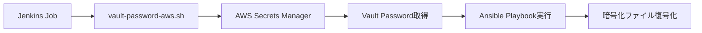

# Jenkins上でのAnsible Vault + AWS Secrets Manager連携ガイド

## 目次
1. [概要](#概要)
2. [全体の仕組み](#全体の仕組み)
3. [事前準備](#事前準備)
4. [AWS Secrets Managerの設定](#aws-secrets-managerの設定)
5. [Jenkinsでの環境変数設定](#jenkinsでの環境変数設定)
6. [Ansible Playbookでの使用方法](#ansible-playbookでの使用方法)
7. [トラブルシューティング](#トラブルシューティング)
8. [セキュリティのベストプラクティス](#セキュリティのベストプラクティス)

## 概要

### Ansible Vaultとは？
Ansible Vaultは、パスワードや秘密鍵などの機密情報を暗号化して保存する仕組みです。
まるで「金庫」のように、大切な情報を鍵をかけて保管します。

### AWS Secrets Managerとは？
AWSが提供する「クラウド上のデジタル金庫」で、パスワードやAPIキーなどを安全に保管・管理できるサービスです。

### なぜ連携するの？
- 🔐 **セキュリティ向上**: パスワードをコードに書かずに済む
- 🔄 **運用効率化**: パスワード変更時にコードを修正する必要がない
- 👥 **チーム管理**: チーム全体で安全にパスワードを共有できる

## 全体の仕組み



### 簡単に言うと...
1. **Jenkins**が「パスワードちょうだい」と言う
2. **スクリプト**が「AWSに聞いてくるね」と言う  
3. **AWS**が「はい、パスワードどうぞ」と返す
4. **Ansible**が「パスワードもらったから暗号化ファイル開けるよ」と言う

## 事前準備

### 必要なもの
- ✅ Jenkins（Dockerコンテナ）
- ✅ AWS CLI v2（Dockerイメージに含まれている）
- ✅ jqコマンド（Dockerイメージに含まれている）
- ✅ vault-password-aws.sh スクリプト（Dockerイメージに含まれている）

### 確認方法
Jenkinsコンテナ内で以下のコマンドを実行して確認：
```bash
# AWS CLIバージョン確認
aws --version

# jqコマンド確認  
jq --version

# スクリプト確認
ls -la /usr/local/bin/vault-password-aws.sh
```

## AWS Secrets Managerの設定

### Step 1: Vaultパスワードの保存

#### 方法A: AWS CLI使用（推奨）
```bash
# シンプルなパスワード保存
aws secretsmanager create-secret \
    --name "myproject-ansible-vault" \
    --description "Ansible Vault password for MyProject" \
    --secret-string "your-super-secret-vault-password" \
    --region ap-northeast-1

# JSON形式での保存（複数の値を保存したい場合）
aws secretsmanager create-secret \
    --name "myproject-ansible-vault" \
    --description "Ansible Vault password for MyProject" \
    --secret-string '{"password":"your-vault-password","created":"2025-11-06","project":"myproject"}' \
    --region ap-northeast-1
```

#### 方法B: AWS Management Console使用
1. AWS Consoleにログイン
2. **Secrets Manager**サービスを開く
3. **「新しいシークレットを保存」**をクリック
4. **「その他のシークレットタイプ」**を選択
5. キーと値を入力：
   - キー: `password` 
   - 値: `your-vault-password`
6. シークレット名: `myproject-ansible-vault`
7. **「次へ」**→**「次へ」**→**「保存」**

### Step 2: IAM権限の設定

Jenkinsが動作するEC2インスタンス（またはECS Task Role）に以下の権限を付与：

```json
{
    "Version": "2012-10-17",
    "Statement": [
        {
            "Effect": "Allow",
            "Action": [
                "secretsmanager:GetSecretValue"
            ],
            "Resource": "arn:aws:secretsmanager:ap-northeast-1:YOUR-ACCOUNT-ID:secret:myproject-ansible-vault*"
        }
    ]
}
```

## Jenkinsでの環境変数設定

### パターン1: グローバル環境変数（全てのジョブで使用）

#### 設定手順
1. Jenkinsにログイン
2. **「Manage Jenkins」**をクリック
3. **「Configure System」**をクリック
4. **「Global properties」**セクションを見つける
5. **「Environment variables」**にチェック
6. **「Add」**をクリックして以下を追加：

| Name | Value |
|------|-------|
| `AWS_VAULT_SECRET_NAME` | `myproject-ansible-vault` |
| `AWS_REGION` | `ap-northeast-1` |
| `AWS_VAULT_KEY` | `password` |

### パターン2: Jenkins Credentials Plugin使用（セキュア・推奨）

#### 設定手順
1. **「Manage Jenkins」**→**「Manage Credentials」**
2. **「Jenkins」**→**「Global credentials」**→**「Add Credentials」**
3. 以下の設定で追加：

**シークレット名用:**
- Kind: **Secret text**
- Secret: `myproject-ansible-vault`
- ID: `AWS_VAULT_SECRET_NAME`
- Description: `Ansible Vault Secret Name`

**リージョン用:**
- Kind: **Secret text**
- Secret: `ap-northeast-1`
- ID: `AWS_REGION`
- Description: `AWS Region`

### パターン3: Jenkinsfile内で設定

```groovy
pipeline {
    agent any
    environment {
        AWS_VAULT_SECRET_NAME = 'myproject-ansible-vault'
        AWS_REGION = 'ap-northeast-1'
        AWS_VAULT_KEY = 'password'
    }
    stages {
        stage('Run Ansible') {
            steps {
                sh '''
                    ansible-playbook \
                        --vault-password-file /usr/local/bin/vault-password-aws.sh \
                        site.yml
                '''
            }
        }
    }
}
```

### パターン4: Jenkins Credentialsを使ったJenkinsfile（最もセキュア）

```groovy
pipeline {
    agent any
    stages {
        stage('Run Ansible') {
            steps {
                withCredentials([
                    string(credentialsId: 'AWS_VAULT_SECRET_NAME', variable: 'AWS_VAULT_SECRET_NAME'),
                    string(credentialsId: 'AWS_REGION', variable: 'AWS_REGION')
                ]) {
                    sh '''
                        export AWS_VAULT_KEY=password
                        ansible-playbook \
                            --vault-password-file /usr/local/bin/vault-password-aws.sh \
                            site.yml
                    '''
                }
            }
        }
    }
}
```

## Ansible Playbookでの使用方法

### Step 1: Vault暗号化ファイルの作成

まず、機密情報をVaultで暗号化します：

```bash
# パスワードファイルを使って暗号化
ansible-vault create --vault-password-file vault-password.txt group_vars/all/vault.yml
```

vault.ymlの内容例：
```yaml
# 暗号化される内容
vault_database_password: "super-secret-db-password"
vault_api_key: "secret-api-key-12345"
vault_ssl_certificate: |
  -----BEGIN CERTIFICATE-----
  MIIDXTCCAkWgAwIBAgIJAKP...
  -----END CERTIFICATE-----
```

### Step 2: Playbookでの使用

```yaml
---
- name: Deploy Application
  hosts: all
  vars:
    # 暗号化された変数を参照
    database_password: "{{ vault_database_password }}"
    api_key: "{{ vault_api_key }}"
  
  tasks:
    - name: Configure database
      template:
        src: database.conf.j2
        dest: /etc/app/database.conf
      vars:
        db_password: "{{ database_password }}"
    
    - name: Set API configuration
      lineinfile:
        path: /etc/app/config.yml
        line: "api_key: {{ api_key }}"
```

### Step 3: Jenkins Jobでの実行

#### フリースタイルジョブの場合
**Build**セクションで**「Execute shell」**を追加：

```bash
#!/bin/bash
set -e

# Ansibleを実行（vault-password-aws.shが自動でパスワード取得）
ansible-playbook \
    --vault-password-file /usr/local/bin/vault-password-aws.sh \
    --inventory inventory/production \
    site.yml
```

#### Pipelineジョブの場合
```groovy
pipeline {
    agent any
    
    environment {
        AWS_VAULT_SECRET_NAME = 'myproject-ansible-vault'
        AWS_REGION = 'ap-northeast-1'
        AWS_VAULT_KEY = 'password'
    }
    
    stages {
        stage('Checkout') {
            steps {
                git 'https://github.com/yourcompany/ansible-playbooks.git'
            }
        }
        
        stage('Run Ansible') {
            steps {
                sh '''
                    # 動作確認
                    echo "AWS CLI Version: $(aws --version)"
                    echo "Secret Name: $AWS_VAULT_SECRET_NAME"
                    
                    # Ansible実行
                    ansible-playbook \
                        --vault-password-file /usr/local/bin/vault-password-aws.sh \
                        --inventory inventory/production \
                        --limit web_servers \
                        site.yml
                '''
            }
        }
    }
    
    post {
        always {
            echo 'Ansible実行完了'
        }
        failure {
            echo 'Ansible実行に失敗しました'
        }
    }
}
```

## トラブルシューティング

### よくあるエラーと解決方法

#### 1. 「AWS CLI authentication failed」エラー

**症状:**
```
Error: AWS CLI authentication failed
```

**原因と解決方法:**
- **原因**: AWS認証情報が設定されていない
- **解決方法**: 
  ```bash
  # EC2インスタンスの場合：IAM Roleを確認
  aws sts get-caller-identity
  
  # ECS Fargateの場合：Task Roleを確認
  curl 169.254.170.2/v2/credentials
  ```

#### 2. 「Failed to retrieve vault password」エラー

**症状:**
```
Error: Failed to retrieve vault password from AWS Secrets Manager
```

**解決手順:**
1. **Secret名の確認**
   ```bash
   aws secretsmanager list-secrets --region ap-northeast-1
   ```

2. **権限の確認**
   ```bash
   aws secretsmanager get-secret-value \
       --secret-id myproject-ansible-vault \
       --region ap-northeast-1
   ```

3. **JSONキーの確認**
   ```bash
   # Secretの内容を確認
   aws secretsmanager get-secret-value \
       --secret-id myproject-ansible-vault \
       --region ap-northeast-1 \
       --query SecretString \
       --output text | jq .
   ```

#### 3. 「vault-password-aws.sh: command not found」エラー

**症状:**
```
vault-password-aws.sh: command not found
```

**解決方法:**
```bash
# スクリプトの存在確認
ls -la /usr/local/bin/vault-password-aws.sh

# 実行権限の確認・付与
chmod +x /usr/local/bin/vault-password-aws.sh

# フルパスで実行
/usr/local/bin/vault-password-aws.sh
```

#### 4. Ansible Vault復号化エラー

**症状:**
```
ERROR! Decryption failed (no vault secrets found)
```

**解決方法:**
1. **スクリプトのテスト実行**
   ```bash
   /usr/local/bin/vault-password-aws.sh
   # 正しいパスワードが出力されるか確認
   ```

2. **手動でのVault復号化テスト**
   ```bash
   echo "取得したパスワード" | ansible-vault decrypt group_vars/all/vault.yml
   ```

### デバッグモード

問題の特定が困難な場合、デバッグモードを有効にしてください：

```bash
# スクリプトのデバッグ実行
bash -x /usr/local/bin/vault-password-aws.sh

# Ansibleのデバッグ実行  
ansible-playbook \
    --vault-password-file /usr/local/bin/vault-password-aws.sh \
    --verbose \
    site.yml
```

## セキュリティのベストプラクティス

### 1. 権限は最小限に

```json
{
    "Version": "2012-10-17",
    "Statement": [
        {
            "Effect": "Allow",
            "Action": [
                "secretsmanager:GetSecretValue"
            ],
            "Resource": "arn:aws:secretsmanager:region:account:secret:specific-secret-name*",
            "Condition": {
                "StringEquals": {
                    "aws:RequestedRegion": "ap-northeast-1"
                }
            }
        }
    ]
}
```

### 2. ログから機密情報を除外

Jenkinsファイルで機密情報をマスクする：
```groovy
pipeline {
    agent any
    stages {
        stage('Run Ansible') {
            steps {
                // パスワードをマスクして実行
                sh '''
                    set +x  # コマンドの詳細出力を無効化
                    ansible-playbook \
                        --vault-password-file /usr/local/bin/vault-password-aws.sh \
                        site.yml
                '''
            }
        }
    }
}
```

### 3. 定期的なパスワード更新

```bash
# 新しいパスワードでSecretを更新
aws secretsmanager update-secret \
    --secret-id myproject-ansible-vault \
    --secret-string "new-super-secret-password" \
    --region ap-northeast-1
```

### 4. アクセスログの監視

AWS CloudTrailでSecrets Managerへのアクセスログを監視：
```json
{
    "eventName": "GetSecretValue",
    "sourceIPAddress": "10.0.1.100",
    "userIdentity": {
        "type": "AssumedRole",
        "principalId": "AIDACKCEVSQ6C2EXAMPLE",
        "arn": "arn:aws:sts::123456789012:assumed-role/JenkinsRole/jenkins-task"
    }
}
```

## まとめ

### この仕組みのメリット
- 🔐 **高いセキュリティ**: パスワードがコードに露出しない
- 🔄 **簡単な運用**: パスワード変更時にコード修正不要
- 👥 **チーム協業**: 安全にパスワードを共有
- 📊 **監査対応**: アクセスログの完全な追跡

### 運用の流れ
1. **開発者**: Ansible VaultでPlaybookを暗号化
2. **運用者**: AWS Secrets ManagerにVaultパスワードを保存
3. **Jenkins**: 自動でパスワードを取得してPlaybook実行
4. **監査**: CloudTrailでアクセスログを確認

この仕組みにより、セキュアで効率的なAnsible運用が可能になります！
