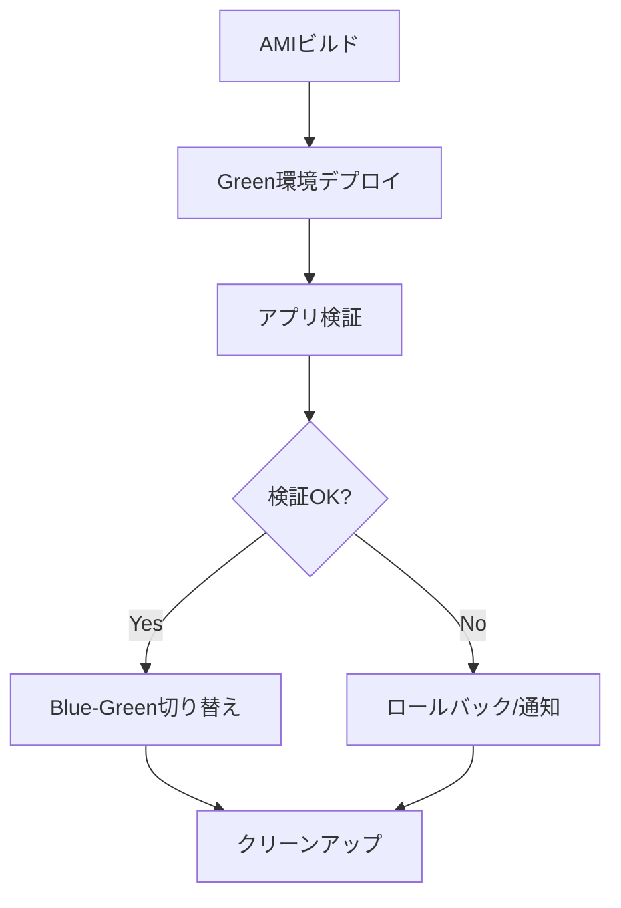

# Immutable方式 実装手順（Jenkins連携）

## 概要
このドキュメントは、Jenkinsを活用したImmutable方式（Blue-Greenデプロイ対応）の推奨実装手順をまとめたものです。

---

## 1. 構成概要
- Jenkinsコンテナ上でCI/CDパイプラインを構築
- Packer + AnsibleでゴールデンAMI自動生成
- CloudFormation/Sceptreでインフラ自動展開
- Blue-Green切り替えはASG/ALB/TargetGroupで制御

---

## 2. 推奨ジョブ設計

### 2.1 ジョブ一覧
1. **AMIビルドジョブ**
2. **インフラデプロイジョブ（Green環境）**
3. **アプリ検証ジョブ**
4. **Blue-Green切り替えジョブ**
5. **クリーンアップ/ロールバックジョブ**

---

### 2.2 ジョブ詳細

#### 1. AMIビルドジョブ
- Packerテンプレート + Ansible PlaybookでAMI作成
- ベースAMIは公式 or 社内標準
- 成果物AMIにタグ付与（世代/環境/バージョン）
- 成功時のみ次工程へ

#### 2. インフラデプロイジョブ（Green環境）
- CloudFormation/SceptreでASG, LaunchTemplate, TargetGroup, ALBをGreen用に新規作成
- 新AMI IDをLaunchTemplateに自動反映
- 必要なタグ・パラメータも自動付与

#### 3. アプリ検証ジョブ
- Green環境のインスタンス/サービスに対して自動テスト
- ヘルスチェック、API疎通、E2Eテストなど
- 検証OKなら次工程へ

#### 4. Blue-Green切り替えジョブ
- ALBのWeighted routingでトラフィックをGreenへ段階的に切り替え
- 切り替え進捗・メトリクス監視
- 問題なければ完全切り替え、旧環境Terminate
- 異常時は自動ロールバック

#### 5. クリーンアップ/ロールバックジョブ
- 不要なAMI/インスタンス/リソースの自動削除
- ロールバック時は旧環境再起動
- 成果物/ログ/レポートの保存

---

## 3. 推奨パイプラインフロー

---

## 4. 実装ポイント
- Jenkinsfileで各ジョブをステージ分割
- Packer/AnsibleはDockerコンテナで実行
- AWS認証情報はJenkinsのCredential管理
- テスト・検証は自動化（API, E2E, ヘルスチェック）
- 失敗時はSlack/Email通知
- 成果物AMI/CloudFormationテンプレートはバージョン管理

---

## 5. 参考テンプレート
- Packerテンプレート例
- Jenkinsfile例
- CloudFormation/Sceptreテンプレート例
- Ansible Playbook例

---

## 6. 今後の拡張
- Canary Release対応
- Multi-Region展開
- コスト最適化（AMI世代管理/自動削除）
- 運用レポート自動生成

---

**更新履歴**
- 2025/10/15: 初版作成
