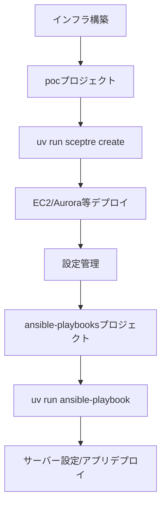

# Playbook実行用uvプロジェクト

## 📋 目次
- [概要](#概要)
- [アーキテクチャ比較](#アーキテクチャ比較)
- [独立uvプロジェクトのメリット](#独立uvプロジェクトのメリット)
- [ディレクトリ構成](#ディレクトリ構成)
- [pyproject.tomlの詳細解説](#pyprojecttomlの詳細解説)
- [初期セットアップ](#初期セットアップ)
- [Ansible実行方法](#ansible実行方法)
- [依存関係の管理](#依存関係の管理)
- [ベストプラクティス](#ベストプラクティス)
- [トラブルシューティング](#トラブルシューティング)

## 概要

Ansible Playbookプロジェクト（`ansible-playbooks`）を、インフラ管理プロジェクト（`poc`）から**完全に独立したuvプロジェクト**として管理するアプローチについて説明します。

### 設計思想

**責任の分離（Separation of Concerns）**
- **pocプロジェクト**: AWS CloudFormation（Sceptre）によるインフラ定義
- **ansible-playbooksプロジェクト**: サーバー設定管理とアプリケーションデプロイ

この分離により、各プロジェクトが独立して進化でき、再利用性と保守性が向上します。

## アーキテクチャ比較

### パターン1: 単一uvプロジェクト（非推奨）

```
/home/tomo/poc/
├── pyproject.toml              # すべての依存関係
├── .venv/                      # 共有仮想環境
├── sceptre/                    # インフラ定義
└── ansible-playbooks/          # Playbook（submodule）
    ├── ansible.cfg
    └── *.yml
```

**問題点:**
- ❌ ansible-playbooksがpocに依存
- ❌ 実行時に親プロジェクトを意識する必要
- ❌ 再利用が困難
- ❌ 依存関係が混在（sceptre + ansible）

### パターン2: 独立uvプロジェクト（推奨）✅

```
/home/tomo/poc/
├── pyproject.toml              # sceptre関連のみ
├── .venv/                      # sceptreの仮想環境
└── sceptre/                    # インフラ定義

/home/tomo/ansible-playbooks/
├── pyproject.toml              # ansible関連のみ
├── .venv/                      # ansibleの仮想環境
├── ansible.cfg
├── inventory/
├── group_vars/
└── *.yml                       # Playbooks
```

**利点:**
- ✅ 完全な独立性
- ✅ シンプルな実行
- ✅ 高い再利用性
- ✅ 明確な依存関係

## 独立uvプロジェクトのメリット

### 1. 完全な独立性（Self-Contained）

**ansible-playbooksが自己完結:**
```bash
cd /home/tomo/ansible-playbooks
uv run ansible --version          # 親プロジェクト不要
uv run ansible-playbook site.yml  # どこからでも実行可能
```

- 親プロジェクトのpyproject.tomlを気にしなくて良い
- シンボリックリンクやsubmoduleの複雑さがない
- 実行パスを気にする必要がない

### 2. 再利用性（Reusability）

**他のプロジェクトでも使用可能:**
```bash
# 別のプロジェクトでも同じPlaybookを使う
cd /home/tomo/another-project
git clone http://gitea/tomo/ansible-playbooks.git
cd ansible-playbooks
uv sync
uv run ansible-playbook setup.yml
```

- プロジェクト固有の設定に依存しない
- 複数のインフラプロジェクトで共有可能
- 汎用的なPlaybookライブラリとして機能

### 3. 依存関係の明確化（Clear Dependencies）

**必要なものだけを管理:**

| プロジェクト | 依存パッケージ | 目的 |
|------------|------------|------|
| **poc** | sceptre, cfn-lint, boto3 | インフラ定義・検証 |
| **ansible-playbooks** | ansible, boto3 | サーバー設定管理 |

- 各プロジェクトの責任範囲が明確
- 不要な依存関係がない
- バージョン管理が独立

### 4. バージョン管理の柔軟性（Version Flexibility）

**独立したバージョン管理:**
```toml
# poc/pyproject.toml
dependencies = [
    "sceptre>=4.5.3",
    "boto3>=1.40.21",  # CloudFormation用
]

# ansible-playbooks/pyproject.toml
dependencies = [
    "ansible>=12.1.0",
    "boto3>=1.40.21",  # 動的インベントリ用
]
```

- ansible/sceptreのバージョンを独立して更新可能
- 一方のアップデートが他方に影響しない
- 段階的なアップグレードが可能

### 5. チーム開発の容易さ（Team Collaboration）

**役割分担が明確:**
- **インフラチーム**: pocプロジェクトを管理
- **アプリチーム**: ansible-playbooksプロジェクトを管理

各チームが独立して作業できる

### 6. CI/CDの柔軟性（CI/CD Flexibility）

**独立したパイプライン:**
```yaml
# GitHub Actions / GitLab CI 例
jobs:
  test-infra:
    runs-on: ubuntu-latest
    steps:
      - uses: actions/checkout@v3
        with:
          repository: tomo/poc
      - run: uv run sceptre validate

  test-ansible:
    runs-on: ubuntu-latest
    steps:
      - uses: actions/checkout@v3
        with:
          repository: tomo/ansible-playbooks
      - run: uv run ansible-playbook --syntax-check site.yml
```

- 各プロジェクトで独立したテスト
- デプロイパイプラインを分離可能

## ディレクトリ構成

### pocプロジェクト（インフラ定義）

```
/home/tomo/poc/
├── .git/
├── .gitignore
├── pyproject.toml                # sceptre関連のみ
├── uv.lock
├── .venv/                        # sceptre仮想環境
│
├── sceptre/
│   ├── config/
│   │   └── poc/
│   │       ├── vpc.yaml
│   │       ├── ec2.yaml
│   │       ├── aurora.yaml
│   │       └── ...
│   └── templates/
│       ├── vpc.yaml
│       ├── ec2.yaml
│       └── ...
│
└── doc/
    ├── POCImmutable環境構築手順.md
    └── ...
```

**役割:**
- AWS CloudFormationによるインフラ定義
- Sceptreによるスタック管理
- インフラのコード化（IaC）

### ansible-playbooksプロジェクト（設定管理）

```
/home/tomo/ansible-playbooks/
├── .git/
├── .gitignore
├── pyproject.toml                # ansible関連のみ
├── uv.lock
├── .venv/                        # ansible仮想環境
│
├── ansible.cfg
│
├── inventory/
│   ├── aws_ec2.yml               # 動的インベントリ
│   └── hosts                     # 静的インベントリ（オプション）
│
├── group_vars/
│   ├── all.yml                   # 全ホスト共通変数
│   ├── poc_web.yml               # Webサーバー用変数
│   └── ...
│
├── host_vars/                    # ホスト固有変数（オプション）
│
├── roles/                        # Ansibleロール
│   ├── common/
│   ├── nginx/
│   ├── php/
│   └── ...
│
├── setup-laravel-environment.yml # Playbook
├── configure-proxysql.yml
├── deploy-application.yml
└── README.md
```

**役割:**
- サーバー設定管理
- アプリケーションデプロイ
- 構成管理の自動化

## pyproject.tomlの詳細解説

### pocプロジェクトのpyproject.toml

場所: `/home/tomo/poc/pyproject.toml`

```toml
[project]
name = "aws-infrastructure-poc"
version = "0.1.0"
description = "AWS infrastructure management using Sceptre"
readme = "README.md"
requires-python = ">=3.13"
dependencies = [
    # === インフラ管理ツール ===
    "sceptre>=4.5.3",              # CloudFormationスタック管理
    "cfn-lint>=1.39.1",            # CloudFormationテンプレート検証
    
    # === AWS SDK ===
    "boto3>=1.40.21",              # AWS Python SDK（Sceptre用）
    
    # === ユーティリティ ===
    "click>=8.2.1",                # CLI作成（カスタムスクリプト用）
    "pyyaml>=6.0.2",               # YAML処理
]

[tool.uv]
managed = true
env = [
    "PYTHONHTTPSVERIFY=0",
    "CURL_CA_BUNDLE=",
    "REQUESTS_CA_BUNDLE=",
    "PYTHONWARNINGS=ignore:Unverified HTTPS request",
]
```

#### 依存関係の説明

**sceptre (>=4.5.3)**
- 用途: CloudFormationスタックの管理
- 機能:
  - スタックの依存関係解決
  - パラメータ管理
  - テンプレート検証
  - ロールバック機能

**cfn-lint (>=1.39.1)**
- 用途: CloudFormationテンプレートの静的解析
- 機能:
  - 構文エラー検出
  - ベストプラクティスチェック
  - リソース定義の妥当性検証

**boto3 (>=1.40.21)**
- 用途: AWS APIとの通信
- 使用場所:
  - Sceptreの内部動作
  - カスタムスクリプトでのAWS操作

**その他のユーティリティ**
- click: カスタムCLIツール作成
- pyyaml: Sceptre設定ファイルの処理

#### 環境変数設定

```toml
[tool.uv]
env = [
    "PYTHONHTTPSVERIFY=0",
    "CURL_CA_BUNDLE=",
    "REQUESTS_CA_BUNDLE=",
    "PYTHONWARNINGS=ignore:Unverified HTTPS request",
]
```

- **目的**: 社内プロキシや自己署名証明書環境での動作
- **注意**: 本番環境では適切な証明書検証を推奨

### ansible-playbooksプロジェクトのpyproject.toml

場所: `/home/tomo/ansible-playbooks/pyproject.toml`

```toml
[project]
name = "ansible-playbooks"
version = "1.0.0"
description = "Ansible playbooks for infrastructure configuration management"
readme = "README.md"
requires-python = ">=3.11"
dependencies = [
    # === Ansible Core ===
    "ansible>=12.1.0",             # Ansible本体
    
    # === AWS統合 ===
    "boto3>=1.40.21",              # AWS SDK（動的インベントリ用）
    "botocore>=1.34.21",           # boto3の依存（明示的に指定）
    
    # === 追加モジュール（オプション） ===
    # "jmespath>=1.0.1",           # JSON/YAML処理
    # "netaddr>=0.9.0",            # ネットワーク計算
]

[project.optional-dependencies]
dev = [
    "ansible-lint>=6.22.0",        # Playbook静的解析
    "yamllint>=1.33.0",            # YAML構文チェック
    "molecule>=6.0.0",             # ロールテスト
]

[tool.uv]
managed = true
```

#### 依存関係の説明

**ansible (>=12.1.0)**
- 用途: 設定管理・自動化の中核
- 含まれるもの:
  - ansible-core: コアエンジン
  - コミュニティコレクション: 豊富なモジュール
- バージョン選定理由:
  - 安定性と最新機能のバランス
  - AWS SSM接続プラグインの完全サポート

**boto3 & botocore**
- 用途: AWS動的インベントリ（`aws_ec2.yml`）
- 機能:
  - EC2インスタンスの自動検出
  - タグベースのグループ化
  - AWSメタデータ取得
- 注意点:
  - **ローカル（Ansibleコントローラー）でのみ必要**
  - リモートホスト（EC2）では不要

**開発用依存関係（optional-dependencies.dev）**

```toml
[project.optional-dependencies]
dev = [
    "ansible-lint>=6.22.0",
    "yamllint>=1.33.0",
    "molecule>=6.0.0",
]
```

インストール方法:
```bash
# 開発用ツールを含めてインストール
uv sync --extra dev

# または本番用のみ
uv sync
```

#### バージョン指定戦略

**`>=`（以上）を使う理由:**
- パッチバージョンの自動更新を許可
- セキュリティアップデートを受け取る
- 後方互換性のある改善を取り込む

**固定バージョンが必要な場合:**
```toml
dependencies = [
    "ansible==12.1.0",      # 完全固定
    "boto3~=1.40.21",       # マイナーバージョンのみ更新
]
```

## 初期セットアップ

### pocプロジェクトの初期化

```bash
# 1. リポジトリクローン（または作成）
cd /home/tomo
git clone http://gitea/tomo/poc.git
cd poc

# 2. uv環境の初期化
uv sync

# 3. 動作確認
uv run sceptre --version

# 4. CloudFormationテンプレート検証
uv run cfn-lint sceptre/templates/*.yaml
```

### ansible-playbooksプロジェクトの初期化

```bash
# 1. リポジトリクローン（または作成）
cd /home/tomo
git clone http://gitea/tomo/ansible-playbooks.git
cd ansible-playbooks

# 2. uv環境の初期化
uv sync

# 3. ⚠️ 必須: Ansibleコレクションのインストール
uv run ansible-galaxy collection install amazon.aws community.aws

# 4. 動作確認
uv run ansible --version
uv run ansible-galaxy collection list | grep amazon

# 5. AWS認証情報確認
aws sts get-caller-identity

# 6. 動的インベントリテスト
uv run ansible-inventory -i inventory/aws_ec2.yml --list

# 7. 接続確認（EC2インスタンスが起動している場合）
uv run ansible -i inventory/aws_ec2.yml all -m ping
```

### Ansibleコレクションのインストール（⚠️ 必須）

**重要:** Ansibleコレクションは**Python依存関係ではない**ため、`pyproject.toml`には含められません。`ansible-galaxy`経由で別途インストールが必要です。

#### コレクションのインストール先（ユーザー共有）

**Ansibleコレクションの特性:**

| 項目 | Pythonパッケージ | Ansibleコレクション |
|------|----------------|-------------------|
| **管理ツール** | `uv`, `pip` | `ansible-galaxy` |
| **インストール先** | `.venv/` (プロジェクト固有) | `~/.ansible/collections/` (ユーザー共有) |
| **スコープ** | プロジェクトごとに独立 | 同一ユーザーの全プロジェクトで共有 |
| **設定ファイル** | `pyproject.toml` | `requirements.yml` (オプション) |

**インストール先の例:**
```bash
# Pythonパッケージ（プロジェクト固有）
/home/tomo/ansible-playbooks/.venv/lib/python3.13/site-packages/ansible/
/home/tomo/ansible-playbooks/.venv/lib/python3.13/site-packages/boto3/

# Ansibleコレクション（ユーザー共有）
/home/tomo/.ansible/collections/ansible_collections/amazon/aws/
/home/tomo/.ansible/collections/ansible_collections/community/aws/
```

**メリット:**
- ✅ ディスク容量の節約（重複インストール不要）
- ✅ 複数プロジェクトで同じコレクションを共有
- ✅ コレクションの一元管理

**デメリット:**
- ❌ プロジェクトごとに異なるバージョンを使いたい場合は工夫が必要

**検索パスの確認:**
```bash
cd /home/tomo/ansible-playbooks
uv run ansible-config dump | grep COLLECTIONS_PATHS

# 出力例:
# COLLECTIONS_PATHS(default) = ['/home/tomo/.ansible/collections', '/usr/share/ansible/collections']
```

#### 必須コレクション

```bash
cd /home/tomo/ansible-playbooks

# === 必須: AWS関連コレクション ===
uv run ansible-galaxy collection install amazon.aws community.aws

# インストール内容:
# - amazon.aws: AWS動的インベントリ (aws_ec2)、SSM接続プラグイン
# - community.aws: 追加のAWSモジュール
```

#### 推奨コレクション（オプション）

```bash
# その他の便利なコレクション
uv run ansible-galaxy collection install ansible.posix
uv run ansible-galaxy collection install community.general

# ansible.posix: POSIX互換システム用モジュール
# community.general: 汎用モジュール集
```

#### インストール確認

```bash
# インストール済みコレクション確認
uv run ansible-galaxy collection list | grep -E "amazon|community"

# 期待される出力:
# amazon.aws        10.1.2
# community.aws     10.0.0
```

#### コレクションのバージョン管理

コレクションのバージョンを固定したい場合は、`requirements.yml`を作成：

```yaml
# ansible-playbooks/requirements.yml
---
collections:
  - name: amazon.aws
    version: ">=10.1.0"
  - name: community.aws
    version: ">=10.0.0"
```

インストール:
```bash
uv run ansible-galaxy collection install -r requirements.yml
```

## Ansible実行方法

### 基本コマンド

```bash
cd /home/tomo/ansible-playbooks

# === Ad-hocコマンド ===
# Ping確認
uv run ansible -i inventory/aws_ec2.yml all -m ping

# 特定のグループに対して
uv run ansible -i inventory/aws_ec2.yml poc_web -m ping

# シェルコマンド実行
uv run ansible -i inventory/aws_ec2.yml all -m shell -a "hostname"

# === Playbook実行 ===
# 基本実行
uv run ansible-playbook -i inventory/aws_ec2.yml setup-laravel-environment.yml

# チェックモード（Dry Run）
uv run ansible-playbook -i inventory/aws_ec2.yml setup-laravel-environment.yml --check

# ステップ実行（確認しながら実行）
uv run ansible-playbook -i inventory/aws_ec2.yml setup-laravel-environment.yml --step

# 詳細出力
uv run ansible-playbook -i inventory/aws_ec2.yml setup-laravel-environment.yml -vvv

# 特定のタグのみ実行
uv run ansible-playbook -i inventory/aws_ec2.yml setup-laravel-environment.yml --tags "nginx,php"

# 特定のホストのみ
uv run ansible-playbook -i inventory/aws_ec2.yml setup-laravel-environment.yml --limit pochub-001

# === インベントリ確認 ===
# 全ホスト一覧
uv run ansible-inventory -i inventory/aws_ec2.yml --list

# グラフ表示
uv run ansible-inventory -i inventory/aws_ec2.yml --graph

# 特定ホストの変数確認
uv run ansible-inventory -i inventory/aws_ec2.yml --host pochub-001
```

## SSM接続に必要なAnsibleの設定

### SSM + Ansibleアーキテクチャ

#### 接続フロー

```
┌─────────────────────────────────────────────────────────────────┐
│              Ansibleコントローラー（ローカルマシン）               │
│                                                                 │
│  ┌────────────────────────────────────────────────────────┐    │
│  │ ansible-playbooks/                                     │    │
│  │  ├── ansible.cfg          [1] 接続設定                 │    │
│  │  ├── inventory/aws_ec2.yml [2] 動的インベントリ        │    │
│  │  ├── group_vars/all.yml   [3] SSM接続変数             │    │
│  │  └── playbook.yml         [4] タスク定義               │    │
│  └────────────────────────────────────────────────────────┘    │
│                             ↓                                  │
│  ┌────────────────────────────────────────────────────────┐    │
│  │ uv .venv/                                              │    │
│  │  ├── ansible               [5] Ansible実行エンジン     │    │
│  │  ├── boto3                 [6] AWS SDK                 │    │
│  │  └── amazon.aws collection [7] SSM接続プラグイン       │    │
│  └────────────────────────────────────────────────────────┘    │
└─────────────────────────────────────────────────────────────────┘
                             ↓
                      AWS Systems Manager
                             ↓
┌─────────────────────────────────────────────────────────────────┐
│                        AWS VPC                                  │
│                                                                 │
│  ┌──────────────┐  ┌──────────────┐  ┌──────────────┐         │
│  │ pochub-001   │  │ pochub-002   │  │ pochub-003   │         │
│  │ (Private)    │  │ (Private)    │  │ (Private)    │         │
│  │              │  │              │  │              │         │
│  │ SSM Agent    │  │ SSM Agent    │  │ SSM Agent    │         │
│  │   ↓          │  │   ↓          │  │   ↓          │         │
│  │ Python3      │  │ Python3      │  │ Python3      │         │
│  └──────────────┘  └──────────────┘  └──────────────┘         │
│                                                                 │
└─────────────────────────────────────────────────────────────────┘
```

#### SSM接続の利点

| 項目 | SSH接続 | SSM接続 |
|------|--------|---------|
| **セキュリティグループ** | 22番ポート開放必要 | 不要（443のみ） |
| **踏み台サーバー** | 必要（プライベートサブネット） | 不要 |
| **鍵管理** | SSH秘密鍵の管理必要 | 不要（IAMロールベース） |
| **接続元IP制限** | ソースIP制限設定必要 | IAMポリシーで制御 |
| **パブリックIP** | 必要（または踏み台経由） | 不要 |
| **監査ログ** | 手動設定 | CloudTrail自動記録 |
| **セッション記録** | 手動設定 | S3自動保存可能 |

### SSM接続の仕組み

#### 1. 接続確立プロセス

```
1. Ansibleが動的インベントリ（aws_ec2.yml）を実行
   └→ boto3でEC2インスタンス情報を取得
   └→ インスタンスID、タグ、メタデータを取得

2. Ansibleがgroup_vars/all.ymlの設定を読み込み
   └→ ansible_connection: aws_ssm を検出
   └→ amazon.aws.aws_ssmプラグインを使用

3. SSM接続プラグインがAWS Systems Managerと通信
   └→ session-manager-pluginがSSMセッションを確立
   └→ WebSocket経由で暗号化通信

4. Ansibleモジュールがリモートホストで実行
   └→ /usr/bin/python3でPythonモジュール実行
   └→ 結果を受け取り
```

#### 2. 必要なコンポーネント

**ローカルマシン（Ansibleコントローラー）:**
- ✅ AWS CLI（認証情報設定済み）
- ✅ Session Manager Plugin（aws-ssmコネクタ用）
- ✅ Python boto3/botocore（動的インベントリ用）
- ✅ Ansible amazon.awsコレクション（SSM接続プラグイン）

**リモートホスト（EC2インスタンス）:**
- ✅ SSM Agent（Amazon Linux 2023は標準インストール済み）
- ✅ IAMロール（SSM権限付与）
- ✅ Python 3（Ansibleモジュール実行用）
- ✅ S3バケット（ファイル転送用、オプション）

### 各ファイルの設定解説

#### 1. ansible.cfg

場所: `/home/tomo/ansible-playbooks/ansible.cfg`

```ini
[defaults]
# デフォルトインベントリ（動的インベントリを指定）
inventory = inventory/aws_ec2.yml

# SSHホストキーチェック無効化（SSM接続では不要だが設定しても無害）
host_key_checking = False

# 非推奨警告を抑制
deprecation_warnings = False

# リモートホストのPython自動検出
# （実際にはgroup_vars/all.ymlの設定が優先される）
interpreter_python = auto_silent

# 予約変数名の警告を抑制（tagsなど）
invalid_reserved_variable_names = []

[inventory]
# AWS EC2動的インベントリプラグインを有効化
enable_plugins = amazon.aws.aws_ec2

[ssh_connection]
# パイプライン有効化（高速化、SSM接続では効果限定的）
pipelining = True
```

**重要な設定:**

1. **`inventory = inventory/aws_ec2.yml`**
   - デフォルトインベントリとしてAWS動的インベントリを指定
   - これにより`-i`オプションを省略可能

2. **`enable_plugins = amazon.aws.aws_ec2`**
   - **必須**: AWS EC2動的インベントリプラグインを有効化
   - これがないと`inventory/aws_ec2.yml`が認識されない

3. **`host_key_checking = False`**
   - SSH接続時の設定だが、SSM接続でも設定しておくと安全

4. **`interpreter_python = auto_silent`**
   - リモートホストのPython自動検出
   - `group_vars/all.yml`で明示的に設定するため、実際にはそちらが優先

#### 2. inventory/aws_ec2.yml（動的インベントリ）

場所: `/home/tomo/ansible-playbooks/inventory/aws_ec2.yml`

```yaml
---
# プラグイン指定（必須）
plugin: amazon.aws.aws_ec2

# 対象AWSリージョン
regions:
  - ap-northeast-1

# EC2インスタンスフィルタ（対象を絞り込む）
filters:
  tag:Environment: poc              # Environmentタグがpocのみ
  instance-state-name: running      # 実行中のインスタンスのみ

# ホスト名の設定
hostnames:
  - tag:Name                        # Nameタグをホスト名として使用
                                    # 例: pochub-001, pochub-002

# グループ化設定
keyed_groups:
  # Nameタグでグループ化
  - key: tags.Name
    prefix: ""
    separator: ""
    # 結果: pochub_001, pochub_002, pochub_003

  # AvailabilityZoneタグでグループ化
  - key: tags.AvailabilityZone
    prefix: az
    separator: _
    # 結果: az_ap_northeast_1a, az_ap_northeast_1c, az_ap_northeast_1d

  # Environmentタグでグループ化
  - key: tags.Environment
    prefix: env
    separator: _
    # 結果: env_poc

  # Applicationタグでグループ化
  - key: tags.Application
    prefix: ''
    separator: ''
    # 結果: poc_web, poc_jenkins など

# ホスト変数の設定
compose:
  # ⚠️ 重要: SSM接続ではインスタンスIDをansible_hostに設定
  ansible_host: instance_id           # 例: i-0cb639645f102ca9f
  
  # 追加のメタデータ
  availability_zone: tags.AvailabilityZone
  instance_id: instance_id
  ec2_tag_name: tags.Name
  ec2_tag_environment: tags.Environment
  ec2_tag_application: tags.Application
  
  # 予約変数名の警告を抑制
  tags: {}                            # 空のdictで上書き
```

**重要なポイント:**

1. **`plugin: amazon.aws.aws_ec2`**
   - **必須**: 動的インベントリプラグインの指定
   - amazon.awsコレクションのインストールが必要

2. **`ansible_host: instance_id`**
   - **SSM接続の鍵**: インスタンスIDを`ansible_host`に設定
   - SSH接続の場合はIPアドレスだが、SSMではインスタンスID

3. **`filters`**
   - EC2インスタンスを絞り込む
   - タグやインスタンス状態でフィルタリング可能

4. **`keyed_groups`**
   - タグベースでグループを自動作成
   - Playbook実行時に柔軟なターゲット指定が可能

#### 3. group_vars/all.yml（SSM接続設定）

場所: `/home/tomo/ansible-playbooks/group_vars/all.yml`

```yaml
---
# === SSM Connection Settings ===
# Ansible接続方法をSSMに指定（最重要設定）
ansible_connection: aws_ssm

# SSM接続のS3バケット（ファイル転送用）
ansible_aws_ssm_bucket_name: "poc-logs-627642418836-ap-northeast-1"

# SSM接続のAWSリージョン
ansible_aws_ssm_region: "ap-northeast-1"

# === Python Interpreter Settings ===
# リモートホスト（EC2）のPythonインタプリタ
# ⚠️ 重要: ローカルとリモートのPythonを分離
ansible_python_interpreter: /usr/bin/python3

# === Application Settings ===
env_name: "poc"
project_code: "poc"
app_user: "apache"
app_group: "apache"
app_directory: "/var/www/html"

# === System Settings ===
timezone: "Asia/Tokyo"
locale: "en_US.UTF-8"

# === Security Settings ===
# SSH無効化（SSMのみ使用）
firewall_enabled: true
ssh_enabled: false

# === Monitoring Settings ===
cloudwatch_namespace: "POC/Custom"
cloudwatch_log_group: "/aws/ec2/poc"

# === Performance Tuning ===
max_parallel_tasks: 10
```

**重要な設定:**

1. **`ansible_connection: aws_ssm`** ⭐ 最重要
   - SSM Session Manager経由で接続することを指定
   - これがないとSSH接続を試みる

2. **`ansible_aws_ssm_bucket_name`**
   - ファイル転送用のS3バケット名
   - `copy`モジュールなどでファイルを転送する際に使用
   - ⚠️ 実際に存在するバケット名を指定

3. **`ansible_aws_ssm_region`**
   - SSM接続のAWSリージョン
   - `inventory/aws_ec2.yml`のregionsと一致させる

4. **`ansible_python_interpreter: /usr/bin/python3`**
   - リモートホストのPythonパス
   - **ローカル（uv .venv）とリモートを明示的に分離**

#### 設定の優先順位

Ansible変数の優先順位（高→低）:

```
1. コマンドライン引数 (-e "var=value")
2. Playbook内の変数
3. host_vars/hostname.yml
4. group_vars/グループ名.yml
5. group_vars/all.yml       ← SSM設定はここ
6. inventory/aws_ec2.yml（compose）
7. ansible.cfg
```

**SSM接続設定の推奨場所:**
- `group_vars/all.yml` に配置（全ホスト共通設定）
- 特定ホストだけSSH接続する場合は`host_vars/`で個別設定

#### 4. Playbook例（SSM接続使用）

場所: `/home/tomo/ansible-playbooks/setup-example.yml`

```yaml
---
- name: Setup EC2 instances via SSM
  hosts: poc_web  # 動的インベントリで作成されたグループ
  become: yes     # sudo実行
  gather_facts: yes
  
  # Playbook固有の変数（オプション）
  vars:
    nginx_version: "1.24"
    php_version: "8.2"
  
  tasks:
    # === 接続確認 ===
    - name: Test SSM connection
      ansible.builtin.ping:
      tags: [test]
    
    # === システム情報取得 ===
    - name: Gather instance information
      ansible.builtin.debug:
        msg: |
          Hostname: {{ ansible_hostname }}
          Instance ID: {{ instance_id }}
          AZ: {{ availability_zone }}
          Connection: {{ ansible_connection }}
      tags: [info]
    
    # === パッケージインストール ===
    - name: Install packages
      ansible.builtin.yum:
        name:
          - nginx
          - php
          - php-fpm
        state: present
      tags: [packages]
    
    # === ファイル配置（S3バケット経由） ===
    - name: Copy configuration file
      ansible.builtin.copy:
        src: files/nginx.conf
        dest: /etc/nginx/nginx.conf
        owner: root
        group: root
        mode: '0644'
      notify: Restart nginx
      tags: [config]
    
    # === コマンド実行 ===
    - name: Check Python version on remote host
      ansible.builtin.shell: python3 --version
      register: python_version
      changed_when: false
      tags: [check]
    
    - name: Display Python version
      ansible.builtin.debug:
        var: python_version.stdout
      tags: [check]
  
  # === ハンドラー ===
  handlers:
    - name: Restart nginx
      ansible.builtin.service:
        name: nginx
        state: restarted
```

**実行方法:**

```bash
# 全タスク実行
uv run ansible-playbook setup-example.yml

# 特定タグのみ実行
uv run ansible-playbook setup-example.yml --tags test

# チェックモード（Dry Run）
uv run ansible-playbook setup-example.yml --check

# 詳細出力
uv run ansible-playbook setup-example.yml -vvv
```

### SSM接続の動作確認

#### 基本接続テスト

```bash
cd /home/tomo/ansible-playbooks

# 1. 動的インベントリの確認
uv run ansible-inventory --list

# 期待される出力:
# {
#   "all": {...},
#   "poc_web": {
#     "hosts": ["pochub-001", "pochub-002", "pochub-003"]
#   },
#   "_meta": {
#     "hostvars": {
#       "pochub-001": {
#         "ansible_connection": "aws_ssm",
#         "ansible_host": "i-0cb639645f102ca9f",
#         ...
#       }
#     }
#   }
# }

# 2. 接続テスト
uv run ansible poc_web -m ping

# 期待される出力:
# pochub-001 | SUCCESS => {"changed": false, "ping": "pong"}
# pochub-002 | SUCCESS => {"changed": false, "ping": "pong"}
# pochub-003 | SUCCESS => {"changed": false, "ping": "pong"}

# 3. リモートコマンド実行
uv run ansible poc_web -m shell -a "hostname"

# 4. Python確認（リモートホストのPython）
uv run ansible poc_web -m shell -a "which python3"
uv run ansible poc_web -m shell -a "python3 --version"
```

#### デバッグ出力

```bash
# 詳細ログで接続プロセスを確認
uv run ansible poc_web -m ping -vvv

# 出力例:
# <pochub-001> ESTABLISH SSM CONNECTION FOR USER: ssm-user
# <pochub-001> SSM CONNECTION ID: ses-0abc123def456
# <pochub-001> EXEC /bin/sh -c 'echo ~ssm-user && sleep 0'
```

### SSM接続のトラブルシューティング

#### 1. boto3インポートエラー

**エラー:**
```
Failed to import the required Python library (botocore and boto3)
```

**原因:**
動的インベントリプラグインがシステムPythonを使用

**解決策:**
```bash
# uv runで実行（uv環境のboto3を使用）
uv run ansible-inventory --list
uv run ansible poc_web -m ping
```

#### 2. SSM接続プラグインが見つからない

**エラー:**
```
ansible.errors.AnsibleError: Connection plugin 'aws_ssm' not found
```

**原因:**
amazon.awsコレクションがインストールされていない

**解決策:**
```bash
# コレクションインストール
uv run ansible-galaxy collection install amazon.aws

# 確認
uv run ansible-galaxy collection list | grep amazon
```

#### 3. Session Manager Pluginエラー

**エラー:**
```
SessionManagerPlugin is not found
```

**原因:**
Session Manager Pluginがインストールされていない

**解決策:**
```bash
# インストール確認
which session-manager-plugin

# インストール（AlmaLinux/RHEL）
curl "https://s3.amazonaws.com/session-manager-downloads/plugin/latest/linux_64bit/session-manager-plugin.rpm" -o "session-manager-plugin.rpm"
sudo yum install -y session-manager-plugin.rpm

# 動作確認
session-manager-plugin --version
```

#### 4. SSM Agent未起動

**エラー:**
```
TargetNotConnected: i-xxxxx is not connected
```

**原因:**
EC2インスタンスのSSM Agentが起動していない

**解決策:**
```bash
# SSM Agent状態確認
aws ssm describe-instance-information \
  --filters "Key=InstanceIds,Values=i-xxxxx" \
  --region ap-northeast-1

# 期待される出力: "PingStatus": "Online"

# EC2内でSSM Agent状態確認（Session Manager経由）
aws ssm start-session --target i-xxxxx --region ap-northeast-1
# セッション内で:
systemctl status amazon-ssm-agent
```

#### 5. IAM権限不足

**エラー:**
```
An error occurred (AccessDeniedException) when calling the StartSession operation
```

**原因:**
EC2インスタンスのIAMロールにSSM権限がない

**解決策:**
```bash
# IAMロール確認
aws ec2 describe-instances \
  --instance-ids i-xxxxx \
  --query 'Reservations[].Instances[].IamInstanceProfile' \
  --region ap-northeast-1

# 必要なポリシー:
# - AmazonSSMManagedInstanceCore（標準）
# - S3アクセス権限（ファイル転送用、オプション）
```

#### 6. S3バケットアクセスエラー

**エラー:**
```
Failed to upload to S3 bucket: Access Denied
```

**原因:**
`ansible_aws_ssm_bucket_name`のバケットが存在しないか、権限不足

**解決策:**
```bash
# バケット確認
aws s3 ls s3://poc-logs-627642418836-ap-northeast-1/

# group_vars/all.ymlのバケット名を確認・修正
# または、バケットを作成
aws s3 mb s3://poc-logs-627642418836-ap-northeast-1 --region ap-northeast-1

# IAMロールにS3権限を追加
# - s3:PutObject
# - s3:GetObject
```

#### 7. Python実行エラー

**エラー:**
```
/usr/bin/python3: not found
```

**原因:**
リモートホストにPython 3がインストールされていない

**解決策:**
```bash
# EC2インスタンス内でPythonインストール
aws ssm start-session --target i-xxxxx --region ap-northeast-1

# セッション内で:
sudo yum install -y python3
python3 --version
```

### SSM接続のベストプラクティス

#### 1. セキュリティ

```yaml
# group_vars/all.yml

# SSHを無効化（SSMのみ使用）
ssh_enabled: false

# ファイアウォールで22番ポートを閉じる
firewall_enabled: true
firewall_allowed_ports:
  - 80
  - 443
  # 22は含めない
```

#### 2. セッションロギング

```yaml
# CloudWatchまたはS3にセッションログを保存
ansible_aws_ssm_session_logging:
  s3_bucket_name: "poc-ssm-session-logs"
  s3_key_prefix: "ansible-sessions/"
  cloudwatch_log_group_name: "/aws/ssm/sessions"
```

#### 3. パフォーマンス

```yaml
# 並列実行数を調整
max_parallel_tasks: 10  # デフォルト: 5

# ファクト収集の最適化
gather_facts: smart  # 必要な時のみ収集
fact_caching: jsonfile
fact_caching_timeout: 3600
```

#### 4. エラーハンドリング

```yaml
# Playbook内でエラーハンドリング
- name: Execute task with retry
  block:
    - name: Run command
      ansible.builtin.shell: some-command
  rescue:
    - name: Handle error
      ansible.builtin.debug:
        msg: "Task failed, handling error..."
  always:
    - name: Cleanup
      ansible.builtin.file:
        path: /tmp/tempfile
        state: absent
```

### ansible.cfgのデフォルトインベントリ活用

`ansible.cfg`で`inventory = inventory/aws_ec2.yml`を設定している場合:

```bash
cd /home/tomo/ansible-playbooks

# -i オプション省略可能
uv run ansible all -m ping
uv run ansible-playbook setup-laravel-environment.yml
uv run ansible-inventory --list
```

### エイリアス設定（オプション）

`~/.bashrc`に追加:

```bash
# Ansible専用エイリアス
alias ap='cd /home/tomo/ansible-playbooks && uv run ansible-playbook'
alias a='cd /home/tomo/ansible-playbooks && uv run ansible'
alias ai='cd /home/tomo/ansible-playbooks && uv run ansible-inventory'

# 使用例
# ap setup-laravel-environment.yml
# a poc_web -m ping
# ai --list
```

反映:
```bash
source ~/.bashrc
```

## 依存関係の管理

### パッケージの更新

```bash
cd /home/tomo/ansible-playbooks

# 依存関係の更新確認
uv lock --upgrade

# 特定のパッケージのみ更新
uv add ansible@latest

# セキュリティアップデート確認
uv run pip list --outdated
```

### バージョンロック

**uv.lockファイル:**
- 自動生成される依存関係のロックファイル
- すべての依存パッケージのバージョンを固定
- チーム全体で同じ環境を保証

```bash
# uv.lockをgitにコミット（推奨）
git add uv.lock
git commit -m "Lock dependency versions"
```

### 開発環境と本番環境

```bash
# 開発環境（リンター等含む）
uv sync --extra dev

# 本番環境（最小限の依存関係）
uv sync --no-dev
```

## ベストプラクティス

### 1. プロジェクト間の依存を避ける

**❌ 避けるべき:**
```bash
# pocプロジェクトのツールをansible-playbooksから使用
cd /home/tomo/ansible-playbooks
/home/tomo/poc/.venv/bin/ansible-playbook site.yml
```

**✅ 推奨:**
```bash
# 各プロジェクトで独立した実行
cd /home/tomo/ansible-playbooks
uv run ansible-playbook site.yml
```

### 2. 環境変数の管理

**プロジェクトルートに.envファイル（オプション）:**

```bash
# /home/tomo/ansible-playbooks/.env
AWS_REGION=ap-northeast-1
AWS_PROFILE=default
ANSIBLE_FORCE_COLOR=1
```

読み込み:
```bash
# .envrcと併用（direnv推奨）
cd /home/tomo/ansible-playbooks
# 自動的に.envrcが読み込まれる
```

### 3. CI/CDでの活用

**GitHub Actions例:**

```yaml
name: Ansible Lint and Test

on: [push, pull_request]

jobs:
  lint:
    runs-on: ubuntu-latest
    steps:
      - uses: actions/checkout@v3
      
      - name: Install uv
        run: curl -LsSf https://astral.sh/uv/install.sh | sh
      
      - name: Install dependencies
        run: uv sync --extra dev
      
      - name: Run ansible-lint
        run: uv run ansible-lint
      
      - name: Run syntax check
        run: uv run ansible-playbook --syntax-check *.yml
```

### 4. READMEの作成

各プロジェクトに適切なREADMEを配置:

**ansible-playbooks/README.md:**
```markdown
# Ansible Playbooks

## Prerequisites
- Python 3.11+
- uv package manager
- AWS CLI configured
- Session Manager Plugin

## Setup
\`\`\`bash
uv sync
\`\`\`

## Usage
\`\`\`bash
uv run ansible-playbook setup-laravel-environment.yml
\`\`\`
```

### 5. バージョン管理

**Semantic Versioning:**
```toml
[project]
version = "1.0.0"  # MAJOR.MINOR.PATCH
```

- **MAJOR**: 破壊的変更
- **MINOR**: 新機能追加（後方互換あり）
- **PATCH**: バグフィックス

### 6. ディレクトリ構造の一貫性

**推奨構造:**
```
ansible-playbooks/
├── inventory/          # インベントリ
├── group_vars/         # グループ変数
├── host_vars/          # ホスト変数
├── roles/              # 再利用可能なロール
├── playbooks/          # Playbook（オプション：サブディレクトリ化）
├── files/              # 配布ファイル
├── templates/          # Jinjaテンプレート
└── library/            # カスタムモジュール（オプション）
```

## トラブルシューティング

### 1. uv環境が見つからない

**エラー:**
```
command not found: uv
```

**解決策:**
```bash
# uvのインストール
curl -LsSf https://astral.sh/uv/install.sh | sh

# PATH確認
echo $PATH | grep .local/bin

# シェル再起動
exec $SHELL
```

### 2. boto3インポートエラー

**エラー:**
```
Failed to import the required Python library (botocore and boto3)
```

**原因:**
- 動的インベントリプラグインがシステムPythonを使用している

**解決策:**
```bash
cd /home/tomo/ansible-playbooks

# uv環境で実行（これで解決）
uv run ansible-inventory -i inventory/aws_ec2.yml --list

# group_vars/all.ymlでリモートホストのPythonを明示
# ansible_python_interpreter: /usr/bin/python3
```

### 3. パッケージバージョン競合

**エラー:**
```
error: Package `ansible` requires `jinja2>=3.0`, but `jinja2==2.11` is installed
```

**解決策:**
```bash
# 依存関係の再解決
uv lock --upgrade

# または特定パッケージを更新
uv add jinja2@latest

# クリーンインストール
rm -rf .venv uv.lock
uv sync
```

### 4. AWS認証エラー

**エラー:**
```
Unable to locate credentials. You can configure credentials by running "aws configure".
```

**解決策:**
```bash
# AWS CLI設定
aws configure

# または環境変数
export AWS_ACCESS_KEY_ID=xxx
export AWS_SECRET_ACCESS_KEY=xxx
export AWS_REGION=ap-northeast-1

# IAMロール確認（EC2内から実行の場合）
aws sts get-caller-identity
```

### 5. SSM接続エラー

**エラー:**
```
SessionManagerPlugin is not found.
```

**解決策:**
```bash
# Session Manager Pluginインストール確認
which session-manager-plugin

# インストール（AlmaLinux/RHEL）
curl "https://s3.amazonaws.com/session-manager-downloads/plugin/latest/linux_64bit/session-manager-plugin.rpm" -o "session-manager-plugin.rpm"
sudo yum install -y session-manager-plugin.rpm

# 動作確認
session-manager-plugin --version
```

### 6. Ansible Collectionsが見つからない

**エラー:**
```
The module amazon.aws.aws_ec2 was not found
```

**解決策:**
```bash
cd /home/tomo/ansible-playbooks

# コレクションインストール
uv run ansible-galaxy collection install amazon.aws community.aws

# インストール確認
uv run ansible-galaxy collection list

# 再実行
uv run ansible-playbook site.yml
```

## まとめ

### 独立uvプロジェクトのメリット（再掲）

1. ✅ **完全な独立性**: 各プロジェクトが自己完結
2. ✅ **シンプルな実行**: `cd && uv run ansible`で完結
3. ✅ **高い再利用性**: 他のプロジェクトでも使用可能
4. ✅ **明確な依存関係**: 責任範囲が明確
5. ✅ **バージョン管理の柔軟性**: 独立したアップデート
6. ✅ **チーム開発の容易さ**: 役割分担が明確
7. ✅ **CI/CDの柔軟性**: 独立したパイプライン

### 推奨する運用フロー



1. **pocプロジェクト**: Sceptreでインフラ構築
2. **ansible-playbooksプロジェクト**: Ansibleでサーバー設定
3. 各プロジェクトは独立して管理・実行

この分離により、保守性・再利用性・チーム開発効率が大幅に向上します。

---

## 参考資料

- [uv Documentation](https://docs.astral.sh/uv/)
- [Ansible Documentation](https://docs.ansible.com/)
- [AWS Dynamic Inventory Plugin](https://docs.ansible.com/ansible/latest/collections/amazon/aws/aws_ec2_inventory.html)
- [PEP 621 – Storing project metadata in pyproject.toml](https://peps.python.org/pep-0621/)

