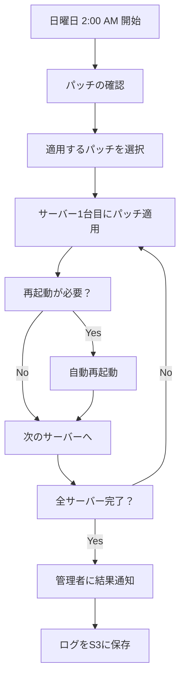

# Systems Manager パッチ管理 詳細ガイド

## 🤖 パッチ管理って何？

### **簡単に言うと**
パソコンやスマホで「アップデート通知」が来たことありますよね？それと同じことを、**サーバー（EC2）で自動的にやってくれる**のがパッチ管理です。

### **なぜ必要？**
- **セキュリティの穴を塞ぐ**: ハッカーが侵入する隙間をなくす
- **バグを修正**: プログラムの不具合を直す  
- **新機能追加**: より便利な機能を使えるようになる

---

## 🏥 病院の定期健診みたいなもの

### **従来の方法（手動パッチ）**
```
毎回、管理者がサーバーにログイン
　↓
「sudo yum update」などのコマンド実行
　↓  
再起動が必要かチェック
　↓
手動で再起動
```
**問題点**: 
- 😰 人が忘れる
- ⏰ 深夜作業が必要
- 🐛 ミスが起きやすい

### **Systems Manager の方法（自動パッチ）**
```
日曜日の深夜2時に自動実行
　↓
AWS が勝手にパッチをチェック
　↓
安全なパッチだけ自動適用
　↓
必要なら自動で再起動
　↓
結果を管理者にメール通知
```
**メリット**:
- 😊 人が寝てる間に完了
- 🎯 ミスが起きない
- 📊 記録が残る

---

## 🎯 パッチの種類と対応

### **AWS パッチの分類と適用ポリシー**

| 分類 | 内容 | デフォルト設定 | 設定変更 |
|------|------|---------------|----------|
| **Security** | セキュリティ修正 | ✅ 即座適用 | 変更不可 |
| **Critical** | システム重要修正 | ✅ 即座適用 | 日数調整可能 |
| **Bugfix** | バグ修正 | ✅ 1週間後適用 | 日数調整可能 |
| **Enhancement** | 新機能・機能改善 | ❌ 適用しない | ⚙️ **有効化可能** |
| **Recommended** | 推奨アップデート | ❌ 適用しない | ⚙️ **有効化可能** |

### **機能向上パッチの有効化方法**

```yaml
# 設定ファイル: config/poc/ssm-patch-management.yaml

# 機能向上パッチを有効にする場合
IncludeEnhancements: 'true'     # 新機能追加パッチ
IncludeRecommended: 'true'      # 推奨アップデート

# 適用タイミングの調整
EnhancementPatchApprovalDays: 30  # 1ヶ月後（慎重運用）
RecommendedPatchApprovalDays: 14  # 2週間後
```

### **機能向上パッチの例**

#### **Enhancement（機能向上）パッチ**
```
例1: Apache HTTP Server 2.4.54 → 2.4.55
- 新しいセキュリティヘッダー機能
- パフォーマンス向上機能
- 新しい設定オプション

例2: Python 3.9.16 → 3.9.17  
- 新しいライブラリ機能
- デバッグ機能の改善
- 互換性の向上
```

#### **Recommended（推奨）パッチ**
```
例1: systemd 249.11-0 → 249.12-0
- 起動時間の最適化
- ログ出力の改善
- 安定性の向上

例2: OpenSSL 1.1.1q → 1.1.1r
- 暗号化性能の向上
- 互換性の改善
- 軽微な修正
```

---

## 🧩 パッチ管理の仕組み

### **1. パッチベースライン（ルールブック）**
どのパッチを適用するかの**ルール集**です。

#### **セキュリティレベル別の対応**
| 重要度 | 適用タイミング | 例 |
|--------|----------------|-------|
| **Critical（超重要）** | 即座（0日後） | ハッカー対策パッチ |
| **Important（重要）** | 即座（0日後） | セキュリティ修正 |
| **Medium（中程度）** | 1週間後 | 一般的なバグ修正 |
| **Low（軽微）** | 1週間後 | 機能改善 |

### **2. メンテナンスウィンドウ（作業時間）**
**いつ作業するか**のスケジュール表です。

```
毎週日曜日 午前2:00 UTC
= 日本時間 午前11:00

作業時間: 最大4時間
（普通は30分〜1時間で完了）
```

**なぜこの時間？**
- 😴 利用者が少ない時間帯
- 🌅 平日前なので問題があっても対応できる
- 🔧 メンテナンス作業の定番時間

### **3. 対象サーバー（どのサーバーを更新するか）**
**タグ**という**ラベル**を使って識別します。

```yaml
対象EC2インスタンス:
  タグ: PatchGroup = "poc-ec2-instances"
  
現在の対象:
  - pochub-001 (ap-northeast-1a)
  - pochub-002 (ap-northeast-1c)  
  - pochub-003 (ap-northeast-1d)
```

---

## 🔄 自動パッチ適用の流れ

### **毎週日曜日の夜に起こること**



### **具体的な作業内容**

#### **ステップ1: パッチ検索**
```bash
# AWS が自動実行するコマンド（イメージ）
yum check-update --security
```

#### **ステップ2: パッチ適用** 
```bash  
# 安全なパッチのみ適用
yum update --security -y
```

#### **ステップ3: 再起動判定**
```bash
# カーネル更新があった場合のみ再起動
if [ -f /var/run/reboot-required ]; then
    reboot
fi
```

#### **ステップ4: 結果報告**
```
✅ pochub-001: パッチ適用完了（再起動なし）
✅ pochub-002: パッチ適用完了（再起動あり） 
✅ pochub-003: パッチ適用完了（再起動なし）

適用パッチ一覧:
- openssl-1.1.1k-7 (セキュリティ修正)
- kernel-5.14.0-284 (バグ修正)
```

---

## 📊 監視・通知システム

### **1. SNS通知（メール・SMS）**
パッチ適用の結果を**リアルタイム**で通知

```
件名: [POC] パッチ適用完了通知

本文:
2025/10/20 11:00 JST
パッチ適用が完了しました。

結果サマリー:
- 対象サーバー: 3台
- 成功: 3台  
- 失敗: 0台
- 再起動実行: 1台

詳細はCloudWatch ダッシュボードで確認できます。
```

### **2. CloudWatch ダッシュボード（グラフ表示）**
パッチ適用の**統計情報**を見やすく表示

#### **表示される情報**
- 📈 **成功/失敗の推移**: 月別のパッチ適用結果
- 🎯 **コンプライアンス状況**: 最新パッチが適用されているサーバー数  
- ⏱️ **実行時間**: パッチ適用にかかった時間
- 🔄 **再起動回数**: 月別の再起動実行回数

### **3. S3ログ保存（詳細記録）**
すべての作業ログを**90日間保存**

```
保存場所: s3://poc-ssm-patch-management-logs-627642418836/
保存期間: 90日間（自動削除）

ログの種類:
- コマンド実行ログ
- パッチ適用結果  
- エラーメッセージ
- 再起動ログ
```

---

## 🛡️ セキュリティ対策

### **1. 安全性の担保**
#### **段階的な適用**
```
Critical → すぐ適用（0日後）
  ↓
Important → すぐ適用（0日後）  
  ↓
Medium/Low → 1週間様子見（7日後）
```

#### **承認済みパッチのみ**
- ✅ **Amazon公式パッチ**のみ適用
- ✅ **テスト済み**パッチのみ選択
- ❌ **実験的**なパッチは除外

### **2. ロールバック対応**
#### **問題が発生した場合**
```bash
# スナップショット自動作成
aws ec2 create-snapshot --volume-id vol-xxxxx

# 問題発生時は手動でロールバック可能
aws ec2 restore-snapshot --snapshot-id snap-xxxxx
```

### **3. 影響範囲の最小化**
#### **段階的実行**
```
pochub-001 → パッチ適用・確認
     ↓（30分後）
pochub-002 → パッチ適用・確認  
     ↓（30分後）
pochub-003 → パッチ適用・確認
```

---

## 💰 コスト（月額）

### **Systems Manager自体**
- **基本機能**: 無料
- **パッチ管理**: 無料  

### **関連リソース**
| 項目 | 月額コスト | 説明 |
|------|-----------|------|
| SNS通知 | $0.01 | メール通知（月4回） |
| S3ログ保存 | $0.50 | ログファイル保存 |
| CloudWatch | $1.00 | ダッシュボード・メトリクス |
| **合計** | **$1.51** | **約210円/月** |

**安い理由**:
- AWSの基本サービスを活用
- 大量のデータ転送なし
- 効率的なリソース使用

---

## 📅 運用スケジュール

### **週次スケジュール**
```
日曜日 11:00 JST: 自動パッチ適用
月曜日 09:00 JST: 結果確認・問題対応
火〜土曜日: 通常運用
```

### **月次作業**
- **第1日曜日**: パッチベースライン見直し
- **第2日曜日**: CloudWatchダッシュボード確認
- **第3日曜日**: S3ログのアーカイブ確認
- **第4日曜日**: 来月の計画策定

### **緊急パッチ対応**
```
Critical セキュリティ脆弱性発見
     ↓
24時間以内に緊急パッチ適用
     ↓  
全サーバーの安全性確認
     ↓
インシデントレポート作成
```

---

## 🚀 このPOCでの設定内容

### **現在の構成（Stage 1）**
```yaml
対象サーバー: 3台のEC2インスタンス
  - pochub-001 (Amazon Linux 2023)
  - pochub-002 (Amazon Linux 2023)  
  - pochub-003 (Amazon Linux 2023)

パッチ適用スケジュール:
  - 毎週日曜日 11:00 JST
  - 最大実行時間: 4時間
  - カットオフ: 1時間前

適用パッチの種類:
  - セキュリティパッチ（即時）
  - 重要なバグ修正（即時）
  - 一般的な更新（1週間後）
```

### **将来の拡張（Stage 2対応）**
```yaml
追加予定サーバー:
  - Jenkins ECS（間接的な影響）
  - Gitea ECS（間接的な影響）
  - Aurora MySQL（別途メンテナンス）

連携予定サービス:
  - ECS サービス停止/開始
  - ALB ヘルスチェック連携
  - データベース メンテナンスウィンドウ
```

---

## 🔧 メンテナンス方法

### **パッチベースラインの更新**
```bash
# 現在の設定確認
aws ssm describe-patch-baselines \
  --filters "Key=NamePrefix,Values=poc"

# 新しいルール追加
aws ssm modify-patch-baseline \
  --baseline-id pb-xxxxxxxxx \
  --approval-rules file://new-rules.json
```

### **メンテナンスウィンドウの変更**
```bash
# 時間変更（日曜日 → 土曜日）
aws ssm modify-maintenance-window \
  --window-id mw-xxxxxxxxx \
  --schedule "cron(0 2 ? * SAT *)"
```

### **対象サーバーの追加/削除**
```bash
# 新しいEC2インスタンスにタグ追加
aws ec2 create-tags \
  --resources i-xxxxxxxxx \
  --tags Key=PatchGroup,Value=poc-ec2-instances
```

---

## 📚 トラブルシューティング

### **よくある問題と対処法**

#### **1. パッチ適用が失敗する**
```bash
# 原因確認
aws ssm describe-instance-patch-states \
  --instance-ids i-xxxxxxxxx

# 解決方法
1. ディスク容量不足 → ログ削除
2. ネットワークエラー → リトライ実行  
3. 依存関係エラー → 手動で依存パッケージ更新
```

#### **2. 再起動後にサービス起動しない**
```bash
# サービス状態確認（Session Manager経由）
systemctl status sshd
systemctl status amazon-ssm-agent

# 解決方法  
sudo systemctl start sshd
sudo systemctl enable sshd
```

#### **3. 通知が届かない**
```bash
# SNS設定確認
aws sns list-subscriptions \
  --query 'Subscriptions[?TopicArn==`arn:aws:sns:ap-northeast-1:627642418836:poc-ssm-patch-management-patch-notifications`]'

# 解決方法
メール アドレスの確認・再登録
```

---

## 🚨 メジャーバージョンアップの制御

### **メジャーバージョンアップの危険性**

メジャーバージョンアップは**破壊的変更**を含むため、自動適用は非常に危険です。

#### **危険な例**

```bash
# 例1: Python 3.11.x → 3.12.x
python-3.11.6 → python-3.12.0
リスク: 新機能追加、一部の破壊的変更

# 例2: Apache HTTP Server 2.4.x → 2.5.x
httpd-2.4.54 → httpd-2.5.0  
リスク: 設定ファイル形式変更、モジュール互換性

# 例3: MySQL 5.7.x → 8.0.x
mysql-5.7.40 → mysql-8.0.32
リスク: 認証方式変更、SQL構文変更

# 例4: PHP 7.4.x → 8.x.x  
php-7.4.33 → php-8.1.12
リスク: 関数廃止、型システム変更
```

### **自動制御メカニズム**

#### **RejectedPatches による除外**
```yaml
# デフォルトで以下をブロック（現実的な設定）
MajorVersionBlockList:
  - 'python3.1[2-9]*'    # Python 3.12以降（3.11まで許可）
  - 'python[4-9]*'       # Python 4.x 以降（将来対応）
  - 'httpd-2.5*'         # Apache 2.5.x 以降
  - 'nginx-1.2[5-9]*'    # Nginx 1.25.x 以降
  - 'mysql-9*'           # MySQL 9.x 系（8.0は許可）
  - 'postgresql-1[6-9]*' # PostgreSQL 16.x 以降
  - 'php-8.3*'           # PHP 8.3.x 以降
  - 'nodejs-2[0-9]*'     # Node.js 20.x 以降
```

#### **安全な適用例**
```bash
✅ 自動適用OK（マイナー・パッチバージョン）:
  python-2.7.17 → python-2.7.18  # パッチレベル
  httpd-2.4.54 → httpd-2.4.55     # マイナーバージョン
  mysql-5.7.39 → mysql-5.7.40     # パッチレベル

❌ 自動適用NG（メジャーバージョン）:
  python-3.11.6 → python-3.12.0   # マイナー変更（破壊的変更あり）
  httpd-2.4.55 → httpd-2.5.0      # メジャー変更  
  mysql-8.0.35 → mysql-9.0.0      # メジャー変更
```

### **推奨運用方針**

#### **🔒 本番環境（推奨設定）**
```yaml
BlockMajorVersionUpgrades: 'true'  # メジャーアップ完全ブロック
IncludeEnhancements: 'false'       # 新機能パッチ無効
IncludeRecommended: 'false'        # 推奨パッチ無効
```

#### **⚖️ 開発環境**
```yaml
BlockMajorVersionUpgrades: 'true'  # メジャーアップはブロック
IncludeEnhancements: 'true'        # 新機能は試験的に適用
EnhancementPatchApprovalDays: 7    # 1週間で適用
```

---

## ✅ チェックリスト

### **導入前確認**
- [ ] EC2インスタンスにSSM Agentインストール済み
- [ ] 適切なIAMロールが設定済み  
- [ ] パッチグループタグが設定済み
- [ ] SNS通知先メールアドレス準備済み

### **導入後確認**  
- [ ] パッチベースライン作成完了
- [ ] メンテナンスウィンドウ設定完了
- [ ] 初回パッチ適用テスト完了
- [ ] CloudWatchダッシュボード動作確認
- [ ] SNS通知テスト完了

### **運用開始後の定期確認**
- [ ] 週次: パッチ適用結果確認
- [ ] 月次: CloudWatchメトリクス確認  
- [ ] 四半期: パッチベースライン見直し
- [ ] 年次: セキュリティ監査対応

---

**作成日**: 2025年10月13日  
**最終更新**: Stage 1 基本インフラ対応  
**対象環境**: POC環境（ap-northeast-1）  
**前提システム**: EC2 (Amazon Linux 2023) × 3台

## 🔗 関連ドキュメント

- [POC環境構築手順](./POC環境構築手順.md)
- [テンプレート構成](./テンプレート構成.md)  
- [AWS Systems Manager 公式ドキュメント](https://docs.aws.amazon.com/systems-manager/)
