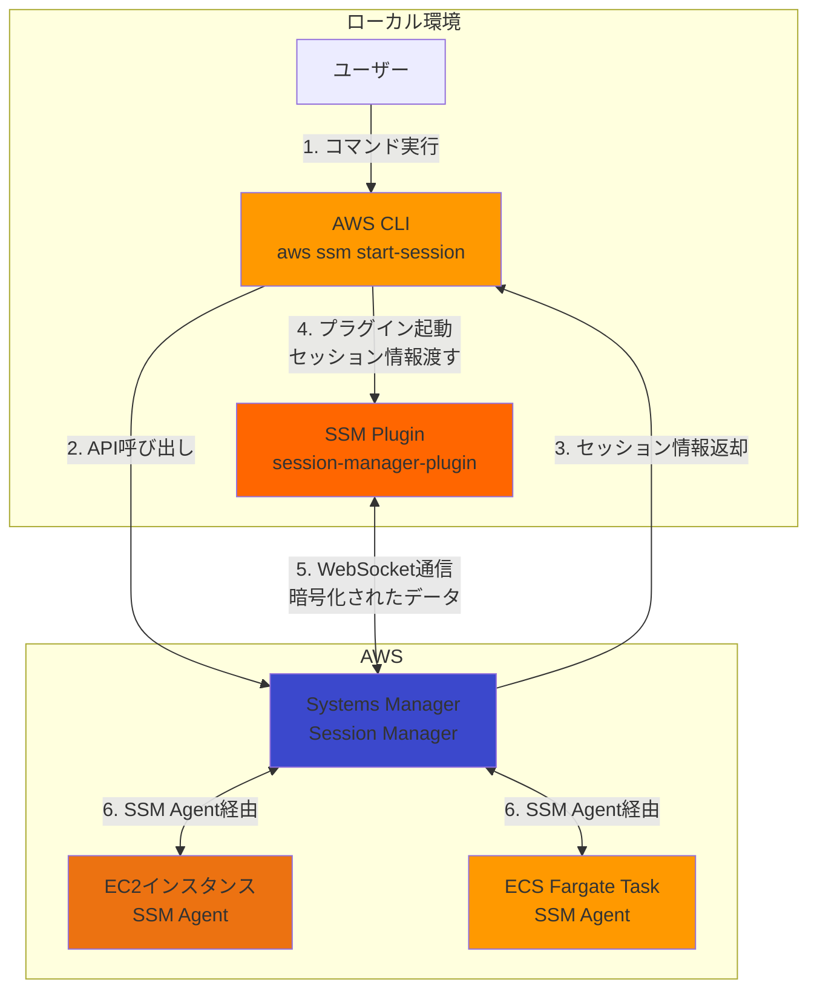
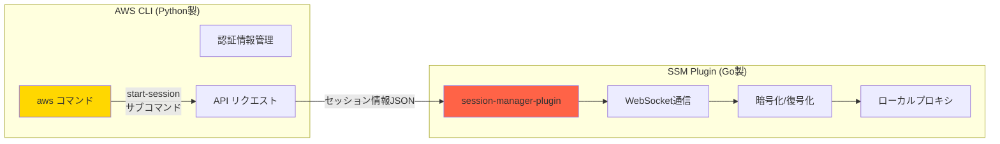
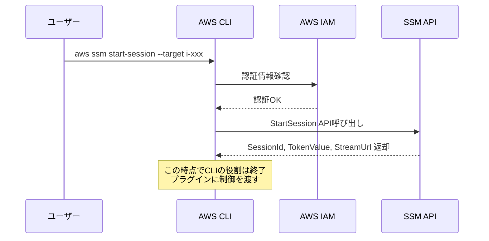
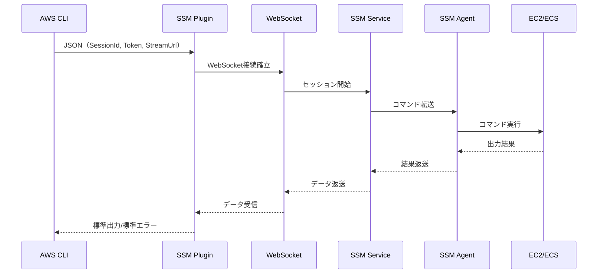
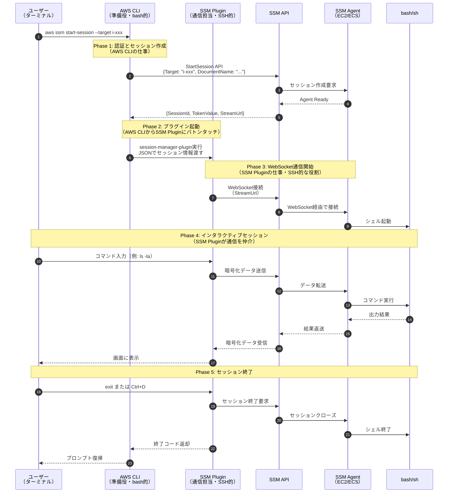
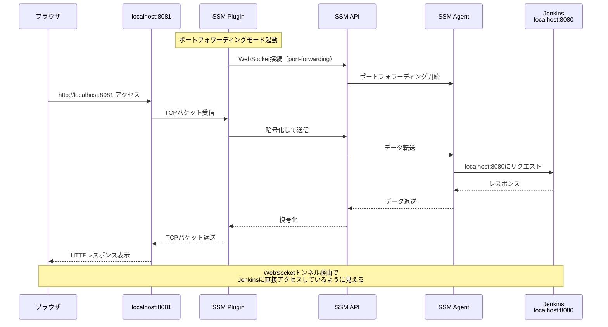
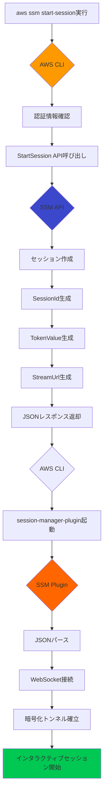
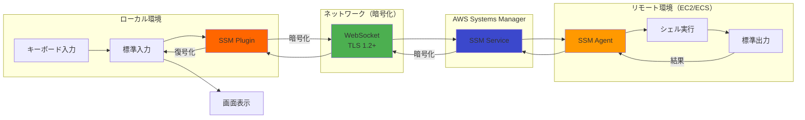
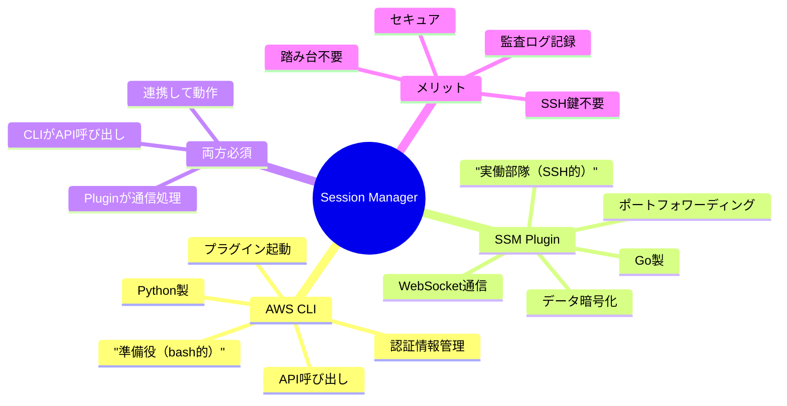

# AWS CLI と SSM Session Manager Plugin の関係

このドキュメントでは、AWS CLIとSSM Session Manager Pluginの関係性、動作原理、インストール方法について詳しく解説します。

## 📋 目次

1. [概要](#概要)
2. [アーキテクチャ図](#アーキテクチャ図)
3. [コンポーネントの役割](#コンポーネントの役割)
4. [通信フロー](#通信フロー)
5. [インストール方法](#インストール方法)
6. [動作確認](#動作確認)
7. [通信の詳細](#通信の詳細)
8. [トラブルシューティング](#トラブルシューティング)
9. [セキュリティのベストプラクティス](#セキュリティのベストプラクティス)
10. [まとめ](#まとめ)

---

## 概要

**AWS CLI** と **SSM Session Manager Plugin** は、AWS Systems Manager Session Managerを使用してEC2インスタンスやECSタスクに安全に接続するために必要な2つの独立したコンポーネントです。

### 🎯 わかりやすい例え（重要！）

**従来のSSH接続との比較**で理解すると分かりやすいです：

| 従来のSSH | Session Manager |
|----------|-----------------|
| `ssh` コマンド（クライアント） | **AWS CLI** = "呼び出し役" |
| SSH接続プロトコル | **SSM Plugin** = "実際の通信担当" |
| `~/.ssh/id_rsa` (秘密鍵) | AWS認証情報（IAM） |
| `sshd` (サーバー側) | SSM Agent（EC2/ECS側） |

#### より具体的な例え

```bash
# 従来のSSH
bash$ ssh -i ~/.ssh/id_rsa ec2-user@10.0.1.100
      ↑     ↑                ↑
    シェル  SSH実行バイナリ   接続先

# Session Manager
bash$ aws ssm start-session --target i-xxx
      ↑   ↑                  ↑
    シェル  AWS CLI           SSM Plugin（裏で動く）
           （準備役）         （実際の通信担当）
```

**乱暴に言えば**:
- **AWS CLI = bash的な役割**: 「準備してプラグインを呼び出す」コマンドランナー
- **SSM Plugin = SSH的な役割**: 「実際の暗号化通信を担当する」プロトコル実装

### 重要なポイント

- **AWS CLI**: AWSサービスとの通信を行うコマンドラインツール（準備役）
- **SSM Plugin**: Session Managerの実際のセッション通信を処理するプラグイン（実働部隊）
- **両方必須**: Session Managerを使うには両方のインストールが必要

---

## アーキテクチャ図

### 全体構成



### コンポーネント関係図



---

## コンポーネントの役割

### 1. AWS CLI の役割

AWS CLIは以下の処理を担当します：



#### AWS CLIの具体的な処理

1. **認証情報の管理**
   - `~/.aws/credentials` または環境変数から認証情報を読み込み
   - IAMロールやMFAトークンの処理

2. **API呼び出し**
   - `StartSession` API をAWS Systems Managerに送信
   - ターゲット（EC2インスタンスIDやECSタスクARN）を指定

3. **レスポンス処理**
   - セッションID、トークン、WebSocket URLを受け取る
   - JSON形式でSession Manager Pluginに渡す

4. **プラグイン起動**
   - `session-manager-plugin` を子プロセスとして起動
   - セッション情報をJSONで標準入力に渡す

#### AWS CLIのコード例

```bash
# AWS CLIが実行する処理（簡略化）
aws ssm start-session \
  --target i-0123456789abcdef0 \
  --region ap-northeast-1 \
  --profile default

# 内部的には以下のようなAPIコール
# POST https://ssm.ap-northeast-1.amazonaws.com/
# {
#   "Target": "i-0123456789abcdef0",
#   "DocumentName": "AWS-StartSSHSession"
# }
```

### 2. SSM Session Manager Plugin の役割

Pluginは実際のセッション通信を担当します：



#### SSM Pluginの具体的な処理

1. **WebSocket接続の確立**
   - AWS CLIから受け取ったStreamUrlに接続
   - TLS 1.2以上で暗号化された通信

2. **双方向通信**
   - ローカルの標準入力 → WebSocket → SSM Agent
   - SSM Agent → WebSocket → ローカルの標準出力

3. **データの暗号化/復号化**
   - AES-256で通信データを暗号化
   - TokenValueを使った認証

4. **ポートフォワーディング（オプション）**
   - ローカルポート（例: 8080）とリモートポート（例: 3000）をマッピング
   - TCPトラフィックのプロキシとして動作

#### Session Manager Pluginのインストール場所

```bash
# Linuxの場合
/usr/local/bin/session-manager-plugin

# macOSの場合（Homebrew）
/opt/homebrew/bin/session-manager-plugin

# Windowsの場合
C:\Program Files\Amazon\SessionManagerPlugin\bin\session-manager-plugin.exe
```

---

## 通信フロー

### 完全な通信フロー図



### ポートフォワーディングの場合



---

## インストール方法

### 1. AWS CLI のインストール

#### Linux (Amazon Linux 2023 / RHEL系)

```bash
# 方法1: パッケージマネージャー（推奨）
curl "https://awscli.amazonaws.com/awscli-exe-linux-x86_64.zip" -o "awscliv2.zip"
unzip awscliv2.zip
sudo ./aws/install

# 確認
aws --version
# aws-cli/2.15.0 Python/3.11.6 Linux/6.1.0 exe/x86_64.amzn.2023
```

#### macOS

```bash
# Homebrew（推奨）
brew install awscli

# 公式インストーラー
curl "https://awscli.amazonaws.com/AWSCLIV2.pkg" -o "AWSCLIV2.pkg"
sudo installer -pkg AWSCLIV2.pkg -target /

# 確認
aws --version
```

#### Windows

```powershell
# MSIインストーラーをダウンロードして実行
# https://awscli.amazonaws.com/AWSCLIV2.msi

# または Chocolatey
choco install awscli

# 確認
aws --version
```

### 2. SSM Session Manager Plugin のインストール

#### Linux (Amazon Linux 2023 / RHEL系)

```bash
# RPMパッケージダウンロード
curl "https://s3.amazonaws.com/session-manager-downloads/plugin/latest/linux_64bit/session-manager-plugin.rpm" -o "session-manager-plugin.rpm"

# インストール
sudo yum install -y session-manager-plugin.rpm

# 確認
session-manager-plugin --version
# 1.2.553.0
```

#### Ubuntu / Debian

```bash
# DEBパッケージダウンロード
curl "https://s3.amazonaws.com/session-manager-downloads/plugin/latest/ubuntu_64bit/session-manager-plugin.deb" -o "session-manager-plugin.deb"

# インストール
sudo dpkg -i session-manager-plugin.deb

# 確認
session-manager-plugin --version
```

#### macOS

```bash
# Homebrew（推奨）
brew install --cask session-manager-plugin

# または手動インストール
curl "https://s3.amazonaws.com/session-manager-downloads/plugin/latest/mac_arm64/sessionmanager-bundle.zip" -o "sessionmanager-bundle.zip"
unzip sessionmanager-bundle.zip
sudo ./sessionmanager-bundle/install -i /usr/local/sessionmanagerplugin -b /usr/local/bin/session-manager-plugin

# 確認
session-manager-plugin --version
```

#### Windows

```powershell
# インストーラーをダウンロードして実行
# https://s3.amazonaws.com/session-manager-downloads/plugin/latest/windows/SessionManagerPluginSetup.exe

# 確認
session-manager-plugin --version
```

### 3. インストール確認

```bash
# AWS CLIの確認
aws --version

# SSM Pluginの確認
session-manager-plugin

# 出力例:
# The Session Manager plugin was installed successfully. Use the AWS CLI to start a session.
```

---

## 動作確認

### 基本的なセッション接続

```bash
# EC2インスタンスに接続
aws ssm start-session \
  --target i-0123456789abcdef0 \
  --region ap-northeast-1

# 成功すると以下のような出力
# Starting session with SessionId: user-0abc123def456789
# sh-5.2$
```

### ポートフォワーディング

```bash
# Jenkinsへのポートフォワーディング（ローカル8081 → リモート8080）
aws ssm start-session \
  --target i-0123456789abcdef0 \
  --document-name AWS-StartPortForwardingSession \
  --parameters '{"portNumber":["8080"],"localPortNumber":["8081"]}' \
  --region ap-northeast-1

# 成功すると別ターミナルで:
# curl http://localhost:8081
# → Jenkinsの画面が返ってくる
```

### ECS Fargateタスクへの接続

```bash
# ECS Execを使用（SSM Plugin経由）
aws ecs execute-command \
  --cluster poc-poc-ecs-jenkins-cluster \
  --task abc123def456789 \
  --container jenkins \
  --interactive \
  --command "/bin/bash"
```

---

## 通信の詳細

### AWS CLIとPluginの連携プロセス



### データフロー（コマンド実行時）



---

## トラブルシューティング

### よくあるエラーと解決方法

#### 1. `SessionManagerPlugin is not found`

**エラー内容**:
```
SessionManagerPlugin is not found. Please refer to SessionManager Documentation here: 
http://docs.aws.amazon.com/console/systems-manager/session-manager-plugin-not-found
```

**原因**: SSM Session Manager Pluginがインストールされていない

**解決方法**:
```bash
# インストール確認
which session-manager-plugin

# 見つからない場合はインストール
# Linux
curl "https://s3.amazonaws.com/session-manager-downloads/plugin/latest/linux_64bit/session-manager-plugin.rpm" -o "session-manager-plugin.rpm"
sudo yum install -y session-manager-plugin.rpm

# macOS
brew install --cask session-manager-plugin
```

#### 2. `TargetNotConnected`

**エラー内容**:
```
An error occurred (TargetNotConnected) when calling the StartSession operation: 
i-0123456789abcdef0 is not connected.
```

**原因**: 
- EC2インスタンスにSSM Agentがインストールされていない
- SSM AgentがSystems Managerに登録されていない
- IAMロールが正しく設定されていない

**解決方法**:
```bash
# インスタンスの管理状態確認
aws ssm describe-instance-information \
  --filters "Key=InstanceIds,Values=i-0123456789abcdef0"

# SSM Agentのステータス確認（インスタンス内）
sudo systemctl status amazon-ssm-agent

# SSM Agentの再起動
sudo systemctl restart amazon-ssm-agent
```

#### 3. `AccessDeniedException`

**エラー内容**:
```
An error occurred (AccessDeniedException) when calling the StartSession operation: 
User: arn:aws:iam::123456789012:user/john is not authorized to perform: 
ssm:StartSession on resource: arn:aws:ec2:ap-northeast-1:123456789012:instance/i-xxx
```

**原因**: IAMユーザー/ロールにSSM権限がない

**解決方法**:

IAMポリシーに以下を追加：
```json
{
  "Version": "2012-10-17",
  "Statement": [
    {
      "Effect": "Allow",
      "Action": [
        "ssm:StartSession",
        "ssm:TerminateSession",
        "ssm:ResumeSession",
        "ssm:DescribeSessions",
        "ssm:GetConnectionStatus"
      ],
      "Resource": "*"
    },
    {
      "Effect": "Allow",
      "Action": [
        "ssm:DescribeInstanceInformation",
        "ec2:DescribeInstances"
      ],
      "Resource": "*"
    }
  ]
}
```

#### 4. WebSocket接続エラー

**エラー内容**:
```
An error occurred (InternalServerError) when calling the StartSession operation
```

**原因**: 
- プロキシ設定の問題
- ファイアウォールでWebSocket通信がブロックされている
- 古いバージョンのSSM Plugin

**解決方法**:
```bash
# プロキシ設定確認
echo $HTTP_PROXY
echo $HTTPS_PROXY

# プロキシなしで実行
unset HTTP_PROXY
unset HTTPS_PROXY

# SSM Pluginバージョン確認
session-manager-plugin --version

# 最新版に更新
# Linux
sudo yum update -y session-manager-plugin

# macOS
brew upgrade --cask session-manager-plugin
```

---

## セキュリティのベストプラクティス

### 1. 最小権限の原則

```json
{
  "Version": "2012-10-17",
  "Statement": [
    {
      "Effect": "Allow",
      "Action": "ssm:StartSession",
      "Resource": "arn:aws:ec2:ap-northeast-1:123456789012:instance/i-0123456789abcdef0",
      "Condition": {
        "StringLike": {
          "ssm:resourceTag/Environment": "poc"
        }
      }
    }
  ]
}
```

### 2. セッションログの有効化

```bash
# S3バケットまたはCloudWatch Logsへのログ記録
aws ssm update-document \
  --name "SSM-SessionManagerRunShell" \
  --content file://session-preferences.json
```

### 3. MFA必須化

```json
{
  "Version": "2012-10-17",
  "Statement": [
    {
      "Effect": "Allow",
      "Action": "ssm:StartSession",
      "Resource": "*",
      "Condition": {
        "Bool": {
          "aws:MultiFactorAuthPresent": "true"
        }
      }
    }
  ]
}
```

---

## まとめ

### AWS CLIとSSM Pluginの関係性



### 🎯 簡単なまとめ（例え話）

**従来のSSH接続**:
```
あなた → ssh コマンド → SSH通信 → sshd → サーバー
         （準備）      （実際の通信）
```

**Session Manager接続**:
```
あなた → AWS CLI → SSM Plugin → SSM Service → SSM Agent → EC2/ECS
         （準備役）  （実働部隊）   （中継）
         ↑          ↑
       bash的    SSH的な役割
```

**つまり**:
- **AWS CLI**: 「誰がどこに接続したいか」をAWSに伝える（bash的な準備役）
- **SSM Plugin**: 実際に暗号化通信を確立して、キーボード入力を送り、画面出力を受け取る（SSH的な実働部隊）

### チェックリスト

- [ ] AWS CLI v2 インストール済み
- [ ] SSM Session Manager Plugin インストール済み
- [ ] AWS認証情報設定済み（`aws configure`）
- [ ] EC2/ECSにSSM Agentインストール済み
- [ ] IAMロールでSSM権限付与済み
- [ ] ポートフォワーディングテスト成功

### 参考リンク

- [AWS CLI公式ドキュメント](https://docs.aws.amazon.com/cli/)
- [Session Manager公式ドキュメント](https://docs.aws.amazon.com/systems-manager/latest/userguide/session-manager.html)
- [SSM Plugin GitHubリポジトリ](https://github.com/aws/session-manager-plugin)
