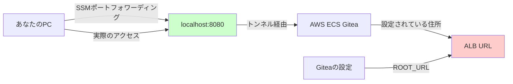

# SSM Giteaアクセスで出力される警告について

## 目次
1. [警告とは何か？](#警告とは何か)
2. [なぜこの警告が出るのか？](#なぜこの警告が出るのか)
3. [警告が与える影響](#警告が与える影響)
4. [解決方法](#解決方法)
5. [実際の対処手順](#実際の対処手順)
6. [トラブルシューティング](#トラブルシューティング)
7. [まとめ](#まとめ)

## 警告とは何か？

### 表示される警告メッセージ
```
Your ROOT_URL in app.ini is "http://internal-poc-poc-ecs-gitea-alb-1227977924.ap-northeast-1.elb.amazonaws.com/", 
it's unlikely matching the site you are visiting.
Mismatched ROOT_URL config causes wrong URL links for web UI/mail content/webhook notification/OAuth2 sign-in.
```

### 簡単に言うと
**「あなたが設定している住所と、実際に訪問している住所が違いますよ」**という警告です。

## なぜこの警告が出るのか？

### 住所の例で考えてみよう

🏠 **実際の状況**：
- **Giteaが思っている自分の住所**：「東京都千代田区丸の内1-1-1」
- **あなたがアクセスしている住所**：「localhost:8080」

これは、お店の看板に書いてある住所と、実際にあなたが来店したルートが違うような状況です。

### 技術的な仕組み



**問題**：
- **Giteaの設定（ROOT_URL）**：`http://internal-poc-poc-ecs-gitea-alb-1227977924.ap-northeast-1.elb.amazonaws.com/`
- **実際のアクセス先**：`http://localhost:8080/`

## 警告が与える影響

### 🟢 正常に動作する機能
- ✅ Git操作（clone、push、pull）
- ✅ リポジトリの作成・削除
- ✅ ファイルの閲覧・編集
- ✅ ユーザー管理
- ✅ 基本的なWeb UI操作

### 🟡 一部問題が出る可能性がある機能
- ⚠️ メール通知のリンク（クリックすると変なURLに飛ぶ）
- ⚠️ Webhook通知（正しいURLが送信されない）
- ⚠️ 一部のWeb UIリンク（ページ移動で問題が出る場合）
- ⚠️ OAuth2認証（外部サービス連携時）

### 実際の影響度
**結論：基本的なGit作業には影響なし！**

## 解決方法

### 方法1: 一時的回避（すぐできる・初心者向け）

**対応**：警告を無視して使用する

**手順**：
1. 警告メッセージが表示されても「×」で閉じる
2. 普通にGiteaを使用する
3. 問題が出た時だけ個別対応

**メリット**：
- すぐにできる
- 設定変更不要
- Git操作は正常動作

**デメリット**：
- 警告が毎回表示される
- 一部機能で問題の可能性

### 方法2: 接続スクリプトの改良（簡単・推奨）

**対応**：connect-gitea.shを改良してGiteaの内部ポートに直接接続

**手順**：

1. **connect-gitea.shを編集**：
```bash
#!/bin/bash
set -e

REGION="ap-northeast-1"
CLUSTER_NAME="poc-poc-ecs-gitea-cluster"
SERVICE_NAME="poc-poc-ecs-gitea-gitea"

# Giteaの内部ポート（3000）を使用
LOCAL_PORT="3000"
REMOTE_PORT="3000"

echo "🔍 ECS Giteaサービスのタスクを検索中..."

# 以下は既存の内容と同じ...

echo "🌐 Giteaにアクセス:"
echo "   Web UI: http://localhost:$LOCAL_PORT"
echo "   Git URL: http://localhost:$LOCAL_PORT/username/repository.git"
echo ""
echo "💡 この設定なら警告は表示されません"
```

2. **新しいポートでアクセス**：
- ブラウザで `http://localhost:3000` にアクセス
- 警告が表示されなくなる

### 方法3: ECS環境変数設定（推奨・中級者向け）

**対応**：GiteaのECSタスク定義で環境変数を設定

**手順**：

1. **CloudFormationテンプレートを編集**：
```yaml
# ECSタスク定義のContainer Environment部分
Environment:
  - Name: GITEA__server__ROOT_URL
    Value: "http://localhost:3000/"
  - Name: GITEA__server__DOMAIN
    Value: "localhost"
  - Name: GITEA__server__HTTP_PORT
    Value: "3000"
```

2. **スタックを更新**：
```bash
# Sceptreでのデプロイ
cd /home/t-tomonaga/AWS/AWS_POC/poc/sceptre/
sceptre launch poc/ecs-gitea.yaml
```

3. **サービスの再起動を待つ**：
```bash
# ECS サービスの状態確認
aws ecs describe-services \
  --cluster poc-poc-ecs-gitea-cluster \
  --services poc-poc-ecs-gitea-gitea \
  --region ap-northeast-1
```

**メリット**：
- 根本的な解決
- 警告が完全に消える
- 全ての機能が正常動作

### 方法4: Gitea設定ファイル直接編集（高度・上級者向け）

**対応**：Giteaコンテナ内のapp.iniファイルを直接編集

**手順**：

1. **ECSタスクに接続**：
```bash
# ECS Execでコンテナに接続
aws ecs execute-command \
  --cluster poc-poc-ecs-gitea-cluster \
  --task [TASK-ID] \
  --container gitea \
  --interactive \
  --command "/bin/bash"
```

2. **設定ファイルを編集**：
```bash
# Giteaコンテナ内で実行
vi /data/gitea/conf/app.ini

# [server]セクションを編集
[server]
ROOT_URL = http://localhost:3000/
DOMAIN = localhost
HTTP_PORT = 3000
```

3. **Giteaサービスを再起動**：
```bash
# ECS サービスの強制再起動
aws ecs update-service \
  --cluster poc-poc-ecs-gitea-cluster \
  --service poc-poc-ecs-gitea-gitea \
  --force-new-deployment
```

**注意**：
- EFS（永続化ストレージ）の設定により、再起動後も設定が保持される
- 高度な操作のため、慎重に実行する

## 実際の対処手順

### Step 1: 現在の状況確認

```bash
# connect-gitea.shを実行
cd /home/t-tomonaga/AWS/AWS_POC/poc/scripts/
./connect-gitea.sh

# ブラウザでアクセス
# http://localhost:8080 → 警告表示
```

### Step 2: 推奨対処（方法2）

```bash
# スクリプトファイルを編集
vi connect-gitea.sh

# LOCAL_PORTとREMOTE_PORTを変更
LOCAL_PORT="3000"
REMOTE_PORT="3000"

# 変更後のスクリプトを実行
./connect-gitea.sh

# 新しいURLでアクセス
# http://localhost:3000 → 警告なし
```

### Step 3: 動作確認

1. **Webアクセステスト**：
```bash
curl -I http://localhost:3000
# HTTP/200 OKが返ってくることを確認
```

2. **Git操作テスト**：
```bash
# テストリポジトリのクローン
git clone http://localhost:3000/username/test-repo.git
cd test-repo

# テストファイルの作成とプッシュ
echo "Hello World" > test.txt
git add test.txt
git commit -m "Test commit"
git push
```

3. **Webブラウザで確認**：
- ログイン動作
- リポジトリ一覧表示
- ファイル閲覧
- 設定画面アクセス

## トラブルシューティング

### Q1: スクリプト変更後もまだ警告が出る

**原因**：ブラウザのキャッシュまたは、まだ古いポートでアクセスしている

**解決方法**：
```bash
# 1. ブラウザのキャッシュをクリア（Ctrl+Shift+R）
# 2. 正しいURLでアクセスしているか確認
echo "正しいURL: http://localhost:3000"
echo "間違ったURL: http://localhost:8080"
```

### Q2: ポート3000でアクセスできない

**原因**：ポートフォワーディングが正しく設定されていない

**解決方法**：
```bash
# プロセス確認
ps aux | grep aws | grep ssm

# ポート使用状況確認
netstat -an | grep 3000

# スクリプト再実行
./connect-gitea.sh
```

### Q3: ECS設定変更後も警告が出る

**原因**：設定変更が反映されていない、またはブラウザ側の問題

**解決方法**：
```bash
# ECSサービスの状態確認
aws ecs describe-services \
  --cluster poc-poc-ecs-gitea-cluster \
  --services poc-poc-ecs-gitea-gitea

# 必要に応じて強制再起動
aws ecs update-service \
  --cluster poc-poc-ecs-gitea-cluster \
  --service poc-poc-ecs-gitea-gitea \
  --force-new-deployment

# ブラウザのキャッシュクリア + 再アクセス
```

### Q4: Git操作でエラーが出る

**症状**：
```
fatal: unable to access 'http://localhost:3000/user/repo.git/': 
Could not resolve host: localhost
```

**解決方法**：
```bash
# SSMポートフォワーディングが動作しているか確認
curl http://localhost:3000

# スクリプトが正常実行されているか確認
ps aux | grep "aws ssm start-session"

# 必要に応じてスクリプト再実行
./connect-gitea.sh
```

## まとめ

### 🎯 推奨対応

**すぐにやること**：
- **方法2（スクリプト改良）**を実施
- ポート3000でのアクセスに変更

**余裕があるときにやること**：
- **方法3（ECS設定変更）**を実施
- 根本的な解決で警告を完全除去

### ✅ 重要なポイント

1. **基本機能は正常動作**：警告が出ても慌てなくてOK
2. **Git操作に影響なし**：開発作業は継続可能
3. **簡単な対処で解決**：スクリプト変更で警告回避可能
4. **完全解決も可能**：ECS設定変更で根本解決

### 📞 サポート

この手順で解決しない場合は、以下を確認してサポートに連絡：

1. **エラーメッセージ**の正確なコピー
2. **実行したコマンド**の履歴
3. **ECS サービスの状態**
4. **ブラウザとOS**の情報

**結論：警告は出ても基本的な作業に問題なし。時間があるときに対処すればOK！**
