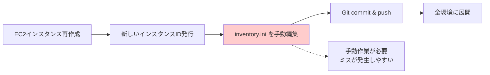
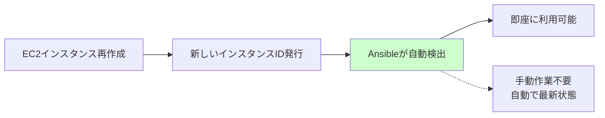
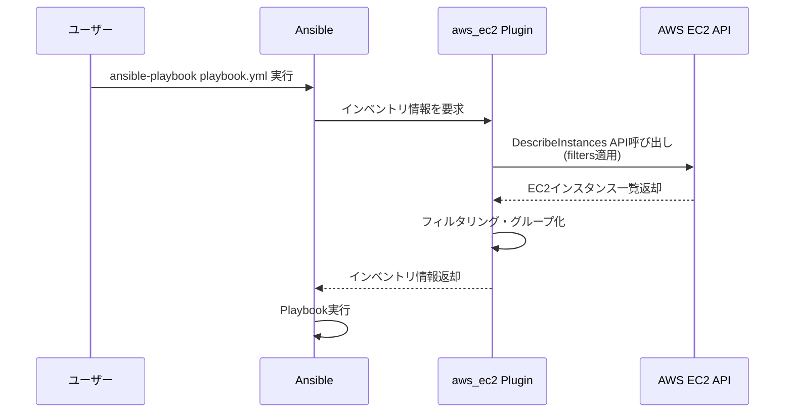

# Ansibleインベントリ方式の変更ガイド

このドキュメントでは、従来の静的インベントリ（Static Inventory）からAWS動的インベントリ（Dynamic Inventory）への移行について説明します。

## 📋 目次

1. [変更の背景と目的](#変更の背景と目的)
2. [静的インベントリと動的インベントリの比較](#静的インベントリと動的インベントリの比較)
3. [AWS動的インベントリの仕組み](#aws動的インベントリの仕組み)
4. [aws_ec2プラグインの設定詳細](#aws_ec2プラグインの設定詳細)
5. [ansible.cfgの必要な設定変更](#ansiblecfgの必要な設定変更)
6. [動作確認方法](#動作確認方法)
7. [まとめ](#まとめ)

---

## 変更の背景と目的

### なぜ変更が必要か？

従来の静的インベントリ方式では、以下の課題がありました：

- ❌ **メンテナンス負荷**: サーバー作り直しのたびにインスタンスIDを手動更新
- ❌ **ヒューマンエラー**: 手動更新による設定ミスのリスク
- ❌ **スケーラビリティ**: Auto Scalingなど動的な環境変化に対応困難

### 動的インベントリのメリット

- ✅ **自動同期**: EC2インスタンスの変更が自動的に反映
- ✅ **タグベース管理**: AWSタグを活用した柔軟なグループ化
- ✅ **メンテナンスフリー**: インスタンスID更新などの作業が不要
- ✅ **スケール対応**: インスタンスの増減に自動追従

---

## 静的インベントリと動的インベントリの比較

### 静的インベントリ（従来方式）

**設定例**: `inventory.ini`

```ini
[idhub_web]
idhub-30-dev-web-101 instance_id=i-0123456789abcdef0
idhub-30-dev-web-102 instance_id=i-0abcdef123456789a

[idhub_app]
idhub-30-dev-app-101 instance_id=i-0fedcba987654321b
```

**問題点**:



### 動的インベントリ（新方式）

**設定例**: `inventories/poc/aws_ec2.yml`

```yaml
plugin: aws_ec2
regions:
  - ap-northeast-1
filters:
  tag:Environment: poc
  instance-state-name: running
hostnames:
  - tag:Name
```

**メリット**:



---

## AWS動的インベントリの仕組み

### 基本的な動作フロー



### 動的インベントリの種類

| 方式 | 説明 | 実装方法 |
|------|------|----------|
| **スクリプト方式** | 実行可能なスクリプト（Python等）が<br/>JSON形式でインベントリを返す | `ansible-playbook -i script.py` |
| **プラグイン方式**<br/>（推奨） | Ansible公式プラグインを使用<br/>設定ファイル（YAML）で制御 | `plugin: aws_ec2` |

**aws_ec2プラグイン**を使用することで、**スクリプト作成不要**で動的インベントリを実現できます。

---

## aws_ec2プラグインの設定詳細

### 設定ファイル: `inventories/poc/aws_ec2.yml`

```yaml
---
# AWS EC2 動的インベントリプラグイン設定
plugin: aws_ec2

# リージョン指定
regions:
  - ap-northeast-1

# フィルタ条件: 以下を満たすインスタンスのみ取得
filters:
  # Environmentタグがpocのもの
  tag:Environment: poc
  # 稼働中のインスタンスのみ
  instance-state-name: running
  # Nameタグで個別指定（オプション）
  "tag:Name":
    - pochub-001
    - pochub-002
    - pochub-003

# ホスト名の決定方法
hostnames:
  - tag:Name  # EC2のNameタグをホスト名として使用

# 変数の構成
compose:
  # SSM接続用の設定
  ansible_host: instance_id
  ansible_connection: aws_ssm
  ansible_aws_ssm_region: ap-northeast-1
```

### 各セクションの詳細説明

#### 1. プラグイン指定

```yaml
plugin: aws_ec2
```

**説明**:
- `aws_ec2`（短縮形）または`amazon.aws.aws_ec2`（FQCN推奨）を指定
- Amazon公式の動的インベントリプラグインを使用

**FQCN推奨版**:
```yaml
plugin: amazon.aws.aws_ec2
```

#### 2. リージョン指定

```yaml
regions:
  - ap-northeast-1
```

**説明**:
- EC2インスタンスを取得するAWSリージョンを指定
- 複数リージョン指定も可能（例: `- us-east-1`, `- eu-west-1`）

#### 3. フィルタ条件

```yaml
filters:
  tag:Environment: poc
  instance-state-name: running
```

**説明**:
- `tag:Environment: poc`: Environmentタグがpocのインスタンスのみ
- `instance-state-name: running`: 稼働中（running）のインスタンスのみ
- この2条件を**AND条件**で適用

**利用可能なフィルタ例**:

| フィルタ | 説明 | 例 |
|---------|------|-----|
| `tag:Name` | Nameタグで絞り込み | `pochub-001` |
| `tag:Environment` | 環境タグで絞り込み | `poc`, `dev`, `prod` |
| `instance-state-name` | インスタンス状態 | `running`, `stopped` |
| `instance-type` | インスタンスタイプ | `t3.micro`, `t3.small` |
| `availability-zone` | アベイラビリティゾーン | `ap-northeast-1a` |

#### 4. ホスト名の決定

```yaml
hostnames:
  - tag:Name
```

**説明**:
- EC2の**Nameタグ**をAnsibleのホスト名として使用
- 例: Nameタグが`pochub-001`なら、Ansibleでは`pochub-001`としてアクセス

**重要**: EC2インスタンスには適切なNameタグを設定する必要があります。

#### 5. 接続設定（compose）

```yaml
compose:
  ansible_host: instance_id
  ansible_connection: aws_ssm
  ansible_aws_ssm_region: ap-northeast-1
```

**説明**:
- `ansible_host`: インスタンスIDを使用（SSM接続で必要）
- `ansible_connection`: AWS SSM Session Managerで接続
- `ansible_aws_ssm_region`: SSM接続のリージョン

**従来のSSH接続との違い**:

| 接続方式 | ansible_connection | ansible_host | 必要なもの |
|---------|-------------------|--------------|----------|
| **SSH** | `ssh` | Private IP | SSH鍵、セキュリティグループ22番開放 |
| **SSM**<br/>（新方式） | `aws_ssm` | Instance ID | SSM Agent、IAMロール |

---

## ansible.cfgの必要な設定変更

### 必須設定項目

#### 1. インベントリプラグインの有効化

```ini
[inventory]
enable_plugins = aws_ec2, yaml, ini
```

**説明**:
- デフォルトは `yaml`, `ini` のみ
- `aws_ec2` プラグインを追加で有効化
- これにより `aws_ec2.yml` が動的インベントリとして認識される

#### 2. Vaultパスワードの保管場所変更

```ini
[defaults]
vault_password_file = /usr/local/bin/vault-password-aws.sh
```

**変更前（従来）**:
```ini
# ローカルファイルに平文保存（セキュリティリスク）
vault_password_file = ./ansible-vault-pass
```

**変更後（新方式）**:
```ini
# AWS Secrets Managerから動的取得（セキュア）
vault_password_file = /usr/local/bin/vault-password-aws.sh
```

**vault-password-aws.sh の内容例**:

```bash
#!/bin/bash
# AWS Secrets ManagerからAnsible Vaultパスワードを取得
aws secretsmanager get-secret-value \
  --secret-id ansible/vault-password \
  --query SecretString \
  --output text \
  --region ap-northeast-1
```

**メリット**:
- ✅ パスワードをGitリポジトリに含めない
- ✅ AWS IAMで厳密なアクセス制御
- ✅ パスワードローテーション対応
- ✅ 監査ログ（CloudTrail）で追跡可能

#### 3. その他の推奨設定

```ini
[defaults]
# インベントリファイルのパス
inventory = inventories/poc/aws_ec2.yml

# SSM接続では不要だが、SSH併用時のため設定
host_key_checking = False

# ログ出力
log_path = ./ansible.log

[ssh_connection]
# SSM経由のSSH接続設定（将来的な利用に備えて）
ssh_args = -o ControlMaster=auto -o ControlPersist=60s
pipelining = True
```

---

## 動作確認方法

### 1. インベントリの表示（グラフ形式）

```bash
ansible-inventory --graph
```

**出力例**:
```
@all:
  |--@ungrouped:
  |--@aws_ec2:
  |  |--pochub-001
  |  |--pochub-002
  |  |--pochub-003
```

### 2. インベントリの詳細表示（JSON）

```bash
ansible-inventory --list
```

**出力例**:
```json
{
  "_meta": {
    "hostvars": {
      "pochub-001": {
        "ansible_host": "i-0123456789abcdef0",
        "ansible_connection": "aws_ssm",
        "ansible_aws_ssm_region": "ap-northeast-1",
        "tags": {
          "Name": "pochub-001",
          "Environment": "poc"
        }
      }
    }
  },
  "all": {
    "children": ["ungrouped", "aws_ec2"]
  },
  "aws_ec2": {
    "hosts": ["pochub-001", "pochub-002", "pochub-003"]
  }
}
```

### 3. 特定ホストの変数確認

```bash
ansible-inventory --host pochub-001
```

**出力例**:
```json
{
  "ansible_host": "i-0123456789abcdef0",
  "ansible_connection": "aws_ssm",
  "ansible_aws_ssm_region": "ap-northeast-1",
  "instance_type": "t3.micro",
  "placement": {
    "availability_zone": "ap-northeast-1a"
  },
  "tags": {
    "Name": "pochub-001",
    "Environment": "poc"
  }
}
```

### 4. 接続テスト

```bash
# 全ホストにpingモジュール実行
ansible all -m ping

# 特定ホストに接続
ansible pochub-001 -m shell -a "hostname"
```

### 5. Playbook実行テスト

```bash
ansible-playbook playbooks/test1.yml --check --diff
```

---

## まとめ

### 移行のポイント

| 項目 | 従来（静的） | 新方式（動的） |
|------|------------|--------------|
| **インベントリファイル** | `inventory.ini`（手動管理） | `aws_ec2.yml`（自動取得） |
| **メンテナンス** | インスタンスIDを手動更新 | 不要（自動同期） |
| **接続方式** | SSH（セキュリティグループ設定必要） | SSM（エージェントのみ） |
| **認証情報** | SSH秘密鍵 | IAMロール |
| **Vaultパスワード** | ローカルファイル | AWS Secrets Manager |
| **スケーラビリティ** | 手動対応 | 自動追従 |

### チェックリスト

- [ ] `aws_ec2.yml` を作成・設定
- [ ] `ansible.cfg` に `enable_plugins = aws_ec2` を追加
- [ ] Vault パスワードを AWS Secrets Manager に移行
- [ ] `vault-password-aws.sh` スクリプトを作成
- [ ] EC2インスタンスに適切なタグを設定
- [ ] EC2にSSM Agentがインストール済み
- [ ] IAMロールでSSM権限を付与
- [ ] `ansible-inventory --graph` で確認
- [ ] `ansible all -m ping` で接続確認

### 参考ドキュメント

- [Ansible aws_ec2 プラグイン公式ドキュメント](https://docs.ansible.com/ansible/latest/collections/amazon/aws/aws_ec2_inventory.html)
- [AWS Systems Manager Session Manager](https://docs.aws.amazon.com/systems-manager/latest/userguide/session-manager.html)
- [Ansible Dynamic Inventory](https://docs.ansible.com/ansible/latest/user_guide/intro_dynamic_inventory.html)
