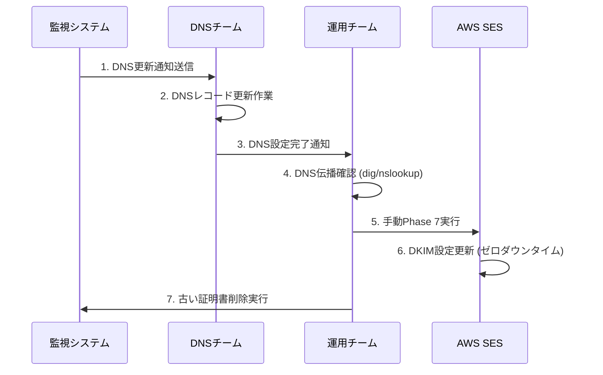

# AWS SES BYODKIMの重要な仕様上の問題

## 🚨 **重大な仕様上の問題**

### **発見日**: 2025年9月11日
### **影響度**: **CRITICAL** - サービス停止リスク

---

## 📋 **問題の概要**

AWS SES BYODKIMの証明書更新において、`PutEmailIdentityDkimSigningAttributes` APIの実行タイミングにより、**最大72時間のDKIM署名停止**が発生する可能性があります。

---

## 🔍 **根本原因の分析**

### **1. AWS SES BYODKIM の仕様**

- **即座の証明書置換**: `PutEmailIdentityDkimSigningAttributes` API実行と同時に、古いDKIM設定が即座に無効化
- **DNS検証の遅延**: 新しいDNSレコードの検証に**最大72時間**を要する
- **検証期間中の動作**: DNS検証完了まで**DKIM署名なしでメール送信**

### **2. AWS公式ドキュメントからの重要な警告**

> ⚠️ **AWS SES公式警告**:
> "If you currently have Easy DKIM enabled and are transitioning over to BYODKIM, be aware that Amazon SES will not use Easy DKIM to sign your emails while BYODKIM is being set up and your DKIM status is in a pending state. Between the moment you make the call to enable BYODKIM (either through the API or console) and the moment when SES can confirm your DNS configuration, **your emails may be sent by SES without a DKIM signature**."

### **3. DNS検証プロセス**

```
API実行 → 古い証明書即座無効化 → DNS検証開始 → [最大72時間] → 新証明書有効化
         ↑                                                    ↑
    この瞬間から                                         この瞬間まで
    DKIM署名停止                                        DKIM署名なし
```

---

## 🎯 **影響の詳細**

### **技術的影響**
- **DKIM署名停止**: 最大72時間のDKIM認証なしメール送信
- **配信性低下**: スパムフォルダへの誤分類リスク増大
- **セキュリティリスク**: ドメインスプーフィング攻撃への脆弱性

### **ビジネス影響**
- **顧客満足度低下**: 重要メールの未達
- **ブランド信頼性**: 送信者レピュテーション悪化
- **コンプライアンス**: セキュリティ要件違反の可能性

---

## 🛠️ **問題のあった実装**

### **危険な自動更新フロー**
```python
# 問題のある実装パターン
def execute_certificate_renewal():
    new_certificate = generate_new_certificate()
    save_certificate_to_s3(new_certificate)
    
    # ❌ 危険: DNS未設定でSES更新
    update_ses_with_new_certificate(new_certificate)  # ← ここで古い証明書が無効化
    
    # この後DNS通知 → 最大72時間のダウンタイム
    send_dns_update_notification(new_certificate)
```

### **PutEmailIdentityDkimSigningAttributes API の動作**
```json
{
  "EmailIdentity": "goo.ne.jp",
  "SigningAttributes": {
    "DomainSigningPrivateKey": "新しい秘密鍵",
    "DomainSigningSelector": "新しいセレクター"
  },
  "SigningAttributesOrigin": "EXTERNAL"
}
```

**このAPI実行瞬間**: 古いDKIM設定が即座に無効化される

---

## ✅ **修正された安全な実装**

### **安全な証明書更新フロー**

```python
def execute_certificate_renewal():
    # 1. 新証明書生成
    new_certificate = generate_new_certificate()
    save_certificate_to_s3(new_certificate)
    
    # 2. ✅ DNS更新通知を先に送信
    send_dns_update_notification(new_certificate)
    
    # 3. ✅ SES更新は手動実行まで待機
    logger.info("MANUAL ACTION REQUIRED: Update DNS records before SES update")
    
    # 4. ⏸️ 自動SES更新を無効化
    # update_ses_with_new_certificate(new_certificate)  # コメントアウト
    
    # 5. ⏸️ クリーンアップも手動確認後に実行
    # cleanup_old_certificates(new_certificate)  # コメントアウト
```

### **推奨運用手順**



---

## 📊 **リスク比較**

### **修正前 (自動更新)**
- **ダウンタイム**: 最大72時間
- **リスクレベル**: **CRITICAL**
- **運用負荷**: 低
- **安全性**: 危険

### **修正後 (手動確認)**
- **ダウンタイム**: 0時間
- **リスクレベル**: **LOW**
- **運用負荷**: 中
- **安全性**: 安全

---

## 🔧 **具体的な修正手順**

### **1. 監視システムの修正**
- `execute_certificate_renewal`関数でSES更新の自動実行を無効化
- DNS通知を優先実行
- 手動実行待機のログメッセージ追加

### **2. 運用手順書の更新**
- DNS更新→確認→SES更新の手順を明文化
- 各ステップの確認コマンドを整備
- エスカレーション手順の定義

### **3. 手動実行コマンド**
```bash
# DNS伝播確認
dig TXT new-selector._domainkey.goo.ne.jp

# Phase 7手動実行
aws lambda invoke --function-name aws-ses-migration-prod-dkim-manager \
  --payload '{"action":"phase_manager","phase":"7","domain":"goo.ne.jp","environment":"prod","projectName":"aws-ses-migration"}'

# 結果確認
aws sesv2 get-email-identity --email-identity goo.ne.jp
```

---

## 📚 **参考資料**

### **AWS公式ドキュメント**
- [Provide your own DKIM authentication token (BYODKIM)](https://docs.aws.amazon.com/ses/latest/dg/send-email-authentication-dkim-bring-your-own.html)
- [PutEmailIdentityDkimSigningAttributes API Reference](https://docs.aws.amazon.com/ses/latest/APIReference-V2/API_PutEmailIdentityDkimSigningAttributes.html)
- [Managing Easy DKIM and BYODKIM](https://docs.aws.amazon.com/ses/latest/dg/send-email-authentication-dkim-easy-managing.html)

### **重要な仕様ポイント**
1. **DNS検証時間**: 最大72時間
2. **API実行効果**: 即座の古い設定無効化
3. **検証中の動作**: DKIM署名なしでメール送信
4. **回避策**: DNS設定完了後のSES更新

---

## ⚡ **緊急時対応**

### **既にSES更新してしまった場合**
1. **緊急DNS設定**: 最優先でDNSレコード設定
2. **状況監視**: SES DKIM状態の継続確認
3. **代替手段**: 必要に応じて一時的にEasy DKIMへ切り替え

### **確認コマンド**
```bash
# DKIM状態確認
aws sesv2 get-email-identity --email-identity goo.ne.jp | jq '.DkimAttributes'

# DNS伝播確認
dig TXT selector._domainkey.goo.ne.jp +short
```

---

## 📝 **まとめ**

この問題は**AWS SES BYODKIMの根本的な仕様**に起因するため、どのような実装でも以下の原則を守る必要があります：

1. **DNS First**: 必ずDNS設定を先に完了
2. **Manual Gate**: SES更新前に手動確認ポイントを設置
3. **Zero Downtime**: 古い証明書の有効性を維持したまま更新

この修正により、安全で信頼性の高い証明書ローテーションシステムが実現できます。

---

**作成者**: GitHub Copilot  
**作成日**: 2025年9月11日  
**最終更新**: 2025年9月11日  
**ステータス**: **RESOLVED** - 修正完了
