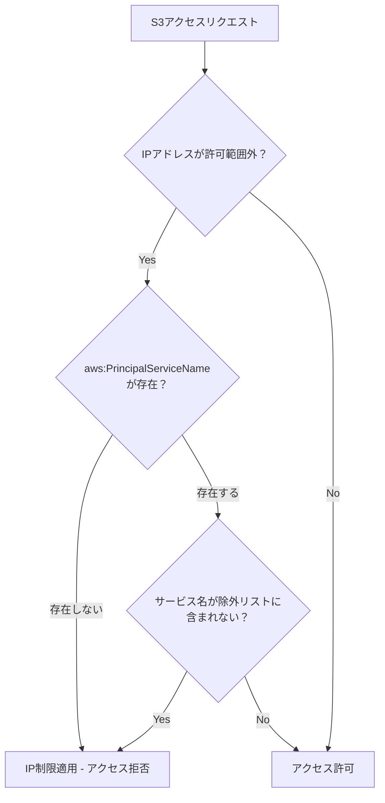
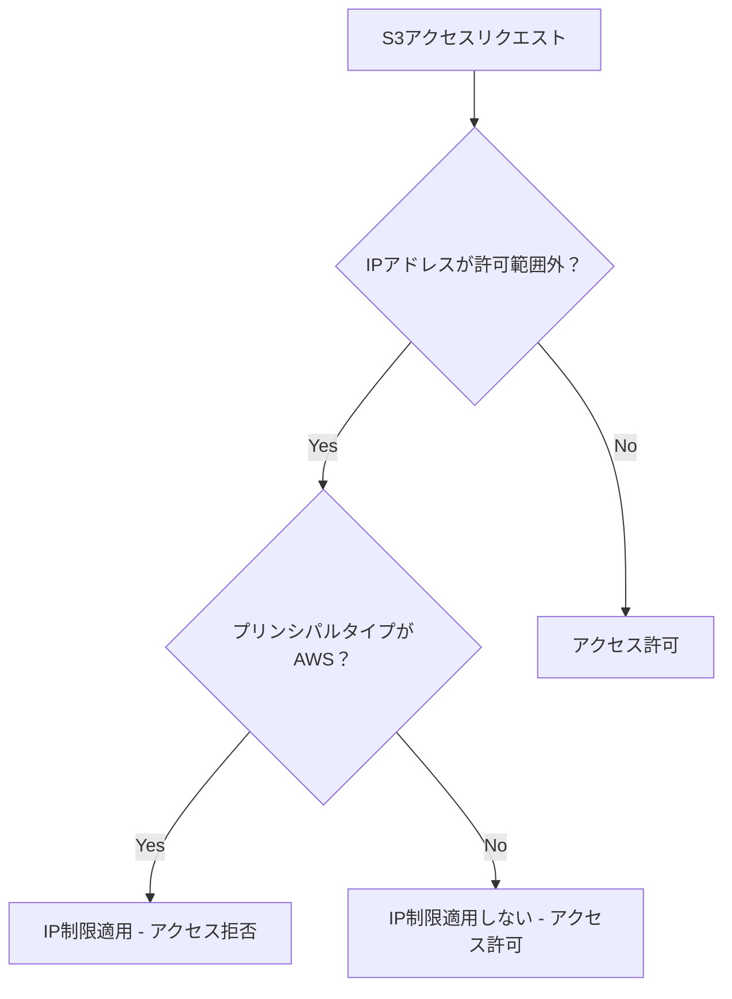

# S3バケットポリシー修正解説書

## 概要

このドキュメントでは、S3バケットポリシーでコンソールアクセスにはIP制限を適用し、FirehoseやLambdaからのアクセスにはIP制限を適用しない設定について、元のポリシー（`S3_raw_fix.yaml`）の問題点と修正版（`S3_raw_fix_2.yaml`）の改善点を初心者にもわかりやすく説明します。

## 要件

- **コンソールログインしたユーザー**: 指定されたIPアドレスからのみアクセス可能
- **FirehoseやLambda**: IP制限なしでアクセス可能
- **SSL通信**: 強制（HTTPアクセスを拒否）

## 元のポリシー（S3_raw_fix.yaml）の問題点

### 問題のあった条件設定

```json
"Condition": {
    "NotIpAddress": {
        "aws:SourceIp": [
            "10.99.0.0/16",
            "10.88.80.0/20",
            // ... 他のIPアドレス
        ]
    },
    "StringNotEquals": {
        "aws:PrincipalServiceName": [
            "firehose.amazonaws.com",
            "lambda.amazonaws.com",
            "s3.amazonaws.com",
            "cloudformation.amazonaws.com"
        ]
    }
}
```

### なぜ動作しなかったのか？

#### 1. `aws:PrincipalServiceName`の制限

`aws:PrincipalServiceName`は、AWSサービスからのリクエストで**常に存在するとは限らない**条件キーです。

- **FirehoseやLambdaからのリクエスト**では、この条件キーが存在しない場合がある
- 条件キーが存在しない場合、`StringNotEquals`の条件は**評価されない**
- 結果として、IP制限がFirehoseやLambdaにも適用されてしまう

#### 2. 条件の論理構造



この構造では、`aws:PrincipalServiceName`が存在しない場合にIP制限が適用されてしまいます。

## 修正版ポリシー（S3_raw_fix_2.yaml）の改善点

### 修正された条件設定

```json
"Condition": {
    "NotIpAddress": {
        "aws:SourceIp": [
            "10.99.0.0/16",
            "10.88.80.0/20",
            // ... 他のIPアドレス
        ]
    },
    "StringEquals": {
        "aws:PrincipalType": "AWS"
    }
}
```

### 改善のポイント

#### 1. `aws:PrincipalType`の使用

`aws:PrincipalType`は、アクセス元のプリンシパルの種類を表す**確実に存在する**条件キーです。

- **"AWS"**: IAMユーザーやIAMロールからのアクセス
- **"Service"**: AWSサービスからのアクセス
- **"FederatedUser"**: フェデレーティッドユーザーからのアクセス

#### 2. 条件の論理構造（修正後）



この構造では、AWSサービスからのアクセスにはIP制限が適用されません。

## 具体的な動作比較

### シナリオ1: コンソールからのアクセス（許可されたIP）

| 項目 | 元のポリシー | 修正版ポリシー |
|------|-------------|---------------|
| プリンシパルタイプ | AWS | AWS |
| IPアドレス | 許可範囲内 | 許可範囲内 |
| 結果 | ✅ アクセス許可 | ✅ アクセス許可 |

### シナリオ2: コンソールからのアクセス（許可されていないIP）

| 項目 | 元のポリシー | 修正版ポリシー |
|------|-------------|---------------|
| プリンシパルタイプ | AWS | AWS |
| IPアドレス | 許可範囲外 | 許可範囲外 |
| 結果 | ❌ アクセス拒否 | ❌ アクセス拒否 |

### シナリオ3: Firehoseからのアクセス

| 項目 | 元のポリシー | 修正版ポリシー |
|------|-------------|---------------|
| プリンシパルタイプ | Service | Service |
| IPアドレス | 任意 | 任意 |
| aws:PrincipalServiceName | 存在しない場合あり | 評価しない |
| 結果 | ❌ アクセス拒否（問題） | ✅ アクセス許可 |

### シナリオ4: Lambdaからのアクセス

| 項目 | 元のポリシー | 修正版ポリシー |
|------|-------------|---------------|
| プリンシパルタイプ | Service | Service |
| IPアドレス | 任意 | 任意 |
| aws:PrincipalServiceName | 存在しない場合あり | 評価しない |
| 結果 | ❌ アクセス拒否（問題） | ✅ アクセス許可 |

## 技術的な詳細

### 条件キーの違い

| 条件キー | 説明 | 信頼性 | 用途 |
|----------|------|--------|------|
| `aws:PrincipalServiceName` | サービス名を表す | 低い（存在しない場合あり） | 特定サービスの識別 |
| `aws:PrincipalType` | プリンシパルタイプを表す | 高い（常に存在） | アクセス元の種類識別 |

### 条件演算子の違い

| 演算子 | 説明 | 条件キーが存在しない場合 |
|--------|------|------------------------|
| `StringNotEquals` | 値が等しくない場合に真 | 条件が評価されない |
| `StringEquals` | 値が等しい場合に真 | 条件が評価されない |

## セキュリティ上の考慮事項

### 修正版ポリシーのセキュリティレベル

1. **コンソールアクセス**: IP制限により適切に制御
2. **AWSサービスアクセス**: アカウントIDとARNによる制限
3. **SSL通信**: 強制により暗号化通信を保証

### 追加のセキュリティ対策

必要に応じて、以下の条件を追加することで、より厳格な制御が可能です：

```json
"Condition": {
    "StringEquals": {
        "aws:PrincipalType": "AWS"
    },
    "DateGreaterThan": {
        "aws:CurrentTime": "2024-01-01T00:00:00Z"
    }
}
```

## まとめ

### 修正の要点

1. **`aws:PrincipalServiceName` → `aws:PrincipalType`**: より確実な条件キーを使用
2. **`StringNotEquals` → `StringEquals`**: シンプルで確実な条件判定
3. **条件の簡素化**: 複雑な条件を単純化して信頼性を向上

### 期待される結果

- ✅ コンソールアクセス: 指定IPからのみ許可
- ✅ Firehoseアクセス: IP制限なしで許可
- ✅ Lambdaアクセス: IP制限なしで許可
- ✅ SSL通信: 強制継続

この修正により、要件通りの動作を実現できます。
