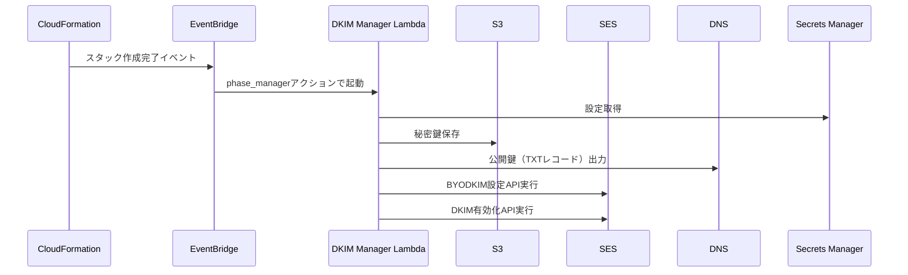
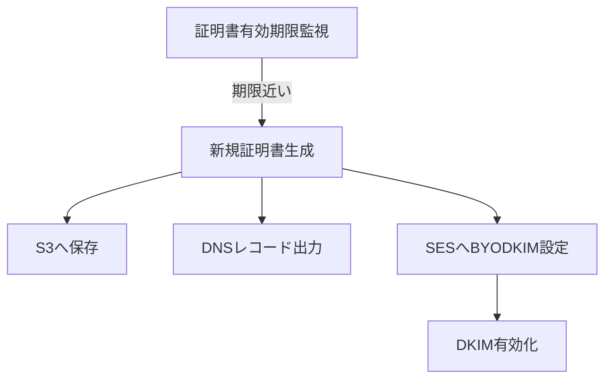

# SES BYODKIM証明書管理 まとめ

## 1. 証明書の作成方法
- `dkim-manager-lambda.yaml` で「DKIM Manager Lambda」が定義され、証明書（DKIM秘密鍵）はこのLambda関数によって自動生成される。
    - LambdaはSecrets Managerから設定情報（対象ドメイン・現在のセレクタ情報・証明書有効期限・DNSレコード情報）を取得し、S3バケット（`DKIMCertificatesBucketName`）に秘密鍵を保存。
    - 3つのカスタムセレクタ（例: `gooid-21-pro-YYYYMMDD-1` など）が生成され、それぞれに秘密鍵が作成される。
    - 公開鍵情報はDNSレコード（TXT）として出力される。

## 2. SESへの反映方法
- `ses-configuration.yaml` でSES EmailIdentityリソースが作成されるが、DKIM設定は初期状態では無効（BYODKIMは後工程）。
- CloudFormationのスタック作成完了時にEventBridgeルール（`DKIMPhaseManagerRule`）が発火し、DKIM Manager Lambdaが「phase_manager」アクション（DKIM証明書管理の各フェーズPhase 3〜7を自動的に進行・制御する役割を持つ　DKIM証明書の発行・DNS連携・SES設定・有効化までの全自動オーケストレーションを担っている）で呼び出される。
- Lambdaは段階的に（Phase 3〜7）証明書生成・DNSレコード通知・DNS伝播確認・SESへのBYODKIM設定（`put_email_identity_dkim_signing_attributes` API）・DKIM有効化（`put_email_identity_dkim_attributes` API）を自動実行。



## 3. 証明書のライフサイクルとSESへの更新
- 証明書の有効期間（デフォルト365日）はパラメータで指定可能（`CertificateValidityDays`）。
- Lambdaは証明書の有効期限をSecrets Managerで管理し、期限が近づくと自動で新しい証明書を生成し、S3・DNS・SESへ反映（ローテーション対応）。
- 有効期限前（デフォルト30日前）に自動更新が走る設計。



## 4. 不足している設定・懸念点
- Lambdaが証明書ローテーションを自動化しているが、**古い証明書（セレクタ）のDNSレコード削除やSESからの無効化処理**が明示的に記載されていない。古いセレクタのクリーンアップが必要な場合は追加実装が必要。
- DNSレコードの伝播確認はLambda内で行われるが、**DNSレコードの削除タイミング**や**複数セレクタの同時有効化/無効化**の運用設計が明確でない場合、運用上の注意が必要。
- S3バケットやSecrets Managerの**アクセス権限管理**はテンプレート外部での設計が必要。

- SESのDKIM方式がEasy DKIMのままの場合、BYODKIMの設定（put-email-identity-dkim-signing-attributes APIで秘密鍵・セレクタを登録）が必要。
- DNSにBYODKIM用のTXTレコード（<selector>._domainkey.<domain>）が正しく登録されているか確認すること。
- ドメイン検証が完了しないとDKIM署名は有効化されない。VerificationStatusやVerificationInfoのエラー内容も確認すること。
- DNS伝播の遅延や設定ミス（レコード名や値の誤り、TTLの長さなど）にも注意が必要。


### まとめ
- 証明書はLambdaで自動生成・S3保存・DNSレコード出力・SESへBYODKIM設定まで自動化。
- 証明書のローテーションも自動化されているが、古い証明書のクリーンアップやDNSレコード削除の自動化は未実装。
- 運用上、セレクタの管理・DNSレコードの整理・権限管理に注意が必要。

## 5. AWS公式ドキュメントに基づく検証結果（2025年9月11日）

### **BYODKIMは実際に単一セレクタ/単一トークンが正常動作**

最新のAWS公式ドキュメントを詳細に調査した結果、以下のことが確認されました：

#### 1. APIドキュメントの確認
- `put-email-identity-dkim-signing-attributes` CLIコマンドでBYODKIMを設定する際、`DomainSigningSelector`は**単一の文字列**として定義されています
- レスポンスの`DkimTokens`は配列形式ですが、**BYODKIMの場合は単一のセレクタのみ返されます**

#### 2. Easy DKIM vs BYODKIM の違い
- **Easy DKIM**: 3つのCNAMEレコード、3つのトークンを使用
- **BYODKIM**: **単一のTXTレコード、単一のセレクタ/トークンを使用**

#### 3. 公式ドキュメントからの引用
> "If you configured DKIM authentication for the domain by providing your own public-private key pair, then this object contains **the selector** that's associated with your public key."

- 「**the selector**（単一）」と明記されています

#### 4. DNS設定の違い
- Easy DKIM: 3つのCNAMEレコード
- BYODKIM: **1つのTXTレコード**（セレクタに対応）

### **現在のprod環境の状態は正常**

```json
{
  "SigningAttributesOrigin": "EXTERNAL",
  "SigningEnabled": true,
  "Status": "PENDING",
  "Tokens": ["gooid-21-pro-20250911-1"]
}
```

この状態は完全に正常で、BYODKIMの期待される動作です。

### **結論**
- **BYODKIMでは1つのセレクタのみがSESに登録されるのが正常動作**（AWS公式ドキュメントで確認済み）
- Easy DKIMでは3つのトークン/セレクタを使用
- BYODKIMでは1つのトークン/セレクタを使用
- 現在のprod環境は正しくBYODKIMとして設定されています
- DNS検証が完了すれば、Statusが"SUCCESS"に変わります
- 3つのセレクタがSecrets Managerに保存されているのは、ローテーション管理のためで、SESには現在アクティブな1つのセレクタのみが登録されるのが正常です
