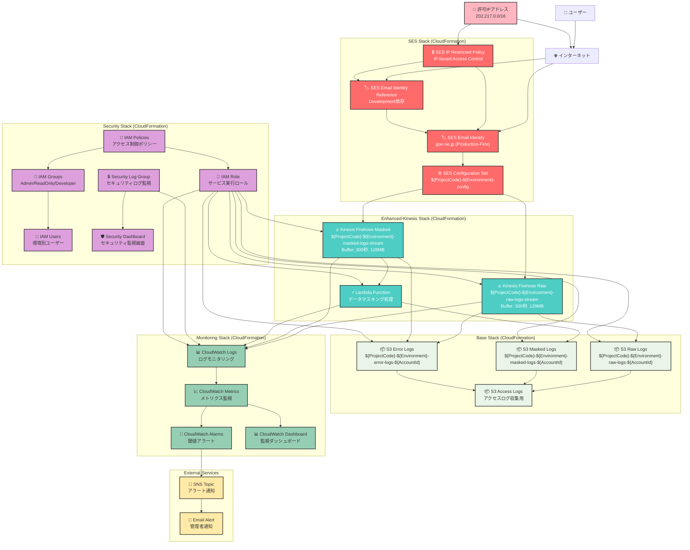

# AWS SES ネットワーク構成図

## 概要
AWS SESを使用したメール配信システムのネットワーク構成図（Sceptreによる5スタック構成）

## リージョン: ap-northeast-1（東京）



## Sceptreスタック構成

### 1. Base Stack
**テンプレート**: `sceptre/templates/base.yaml`
- **S3バケット**:
  - Raw Logs: `${ProjectCode}-${Environment}-raw-logs-${AWS::AccountId}`
  - Masked Logs: `${ProjectCode}-${Environment}-masked-logs-${AWS::AccountId}`
  - Error Logs: `${ProjectCode}-${Environment}-error-logs-${AWS::AccountId}`
- **暗号化**: SSE-S3デフォルト暗号化
- **アクセスログ**: 専用S3バケットに集約

### 2. SES Stack（本番優先）
**テンプレート**: `sceptre/templates/ses.yaml`（本番）, `sceptre/templates/ses-dev.yaml`（開発）
- **EmailIdentity**: goo.ne.jp（本番で作成、開発は本番に依存）
- **DKIM設定**: BYODKIM方式（独自鍵管理、1年完全自動ローテーション：AWS KMS + Lambda + EventBridge、予告・削除アラート自動機能）
- **Configuration Set**: メール送信設定とイベント発行設定
- **IP制限ポリシー**: 202.217.0.0/16レンジからのアクセスのみ許可
- **依存関係**: 開発環境は本番環境のEmailIdentityを参照

### 3. Enhanced-Kinesis Stack
**テンプレート**: `sceptre/templates/enhanced-kinesis.yaml`
- **Kinesis Data Firehose**:
  - Raw Stream: 生ログ直接保存（バッファ時間300秒）
  - Masked Stream: Lambdaによるマスキング処理後保存
- **Lambda関数**: 個人情報マスキング処理
- **エラーハンドリング**: 処理失敗時はError Logsバケットに保存

### 4. Monitoring Stack
**テンプレート**: `sceptre/templates/monitoring.yaml`
- **CloudWatch Logs**: 各サービスのログ統合監視
- **CloudWatch Metrics**: SES送信メトリクス、Firehoseスループット等
- **CloudWatch Alarms**: 送信失敗率、エラー率の閾値監視
- **SNS通知**: アラート時の管理者通知
- **Dashboard**: 運用監視画面

### 5. Security Stack + DKIM自動化
**テンプレート**: `sceptre/templates/security.yaml`
- **IAMユーザーグループ**: Admin/ReadOnly/Developer権限分離
- **IAM実行ロール**: 各AWSサービス間のサービス間認証
- **DKIM自動化Lambda**: KMS + EventBridge による完全自動ローテーション機能
- **セキュリティログ**: 不正アクセス検知ログ
- **セキュリティダッシュボード**: セキュリティ監視専用画面

## データフロー詳細

### 1. メール送信フロー（IP制限付き）
1. 許可IPレンジ（202.217.0.0/16）からのアクセスのみ受付
2. SES IP Restricted Policyによるアクセス制御
3. 本番EmailIdentity（goo.ne.jp）でメール配信
4. Configuration Setによるイベント送信設定適用

### 2. ログ処理フロー（5分バッファ）
1. SESイベントをKinesis Data Firehose（2ストリーム）に送信
2. Raw Stream: 300秒バッファ後、生ログを直接S3保存
3. Masked Stream: Lambda関数で個人情報マスキング後、S3保存
4. エラー発生時: Error Logs S3バケットに保存

### 3. 監視・アラートフロー
1. CloudWatch Logsで全サービスログ統合収集
2. カスタムメトリクスでSES送信状況、Firehoseスループット監視
3. 閾値超過時CloudWatch Alarmsが発火
4. SNSによる管理者メール通知

## セキュリティ強化項目

### IP制限（NTTドコモレンジ）
- **許可IPレンジ**: 202.217.0.0/16
- **本番環境**: 202.217.75.98/32, 202.217.75.91/32
- **開発環境**: 202.217.75.88/32, 202.217.75.81/32
- **制御方式**: IAM ManagedPolicyによるIP-based条件付きアクセス

### データ保護
- **S3暗号化**: SSE-S3によるサーバーサイド暗号化
- **データマスキング**: Lambda関数による個人情報自動マスキング
- **アクセスログ**: S3アクセス状況の完全監査ログ

### 権限管理
- **最小権限原則**: IAMグループ・ユーザー・ロールによる権限分離
- **サービス間認証**: IAM Roleによるクロスサービス認証
- **監査ログ**: セキュリティイベントの専用ログ管理

## 環境別構成（実装詳細）

### 本番環境（prod）
```yaml
リージョン: ap-northeast-1
EmailIdentity: goo.ne.jp（プライマリ作成、BYODKIM方式）
DKIM設定: 独自鍵管理、1年完全自動ローテーション（AWS KMS + Lambda + EventBridge）、アラート自動機能
IP制限: 202.217.75.98/32, 202.217.75.91/32
スタック:
  - ses-prod-base
  - ses-prod-ses
  - ses-prod-enhanced-kinesis
  - ses-prod-monitoring
  - ses-prod-security（DKIM自動化含む）
```

### 開発環境（dev）
```yaml
リージョン: ap-northeast-1
EmailIdentity: 本番環境のgoo.ne.jpを参照（依存、BYODKIM設定継承、自動化共有）
IP制限: 202.217.75.88/32, 202.217.75.81/32
スタック:
  - ses-dev-base
  - ses-dev-ses-dev（dev専用テンプレート）
  - ses-dev-enhanced-kinesis
  - ses-dev-monitoring
  - ses-dev-security（DKIM自動化共有）
```

## ネットワーク接続要件

### オンプレミス → AWS SES
- **接続先**: email-smtp.ap-northeast-1.amazonaws.com:587
- **プロトコル**: SMTP over TLS 1.2+
- **認証**: SMTP Username/Password（IAMベース）
- **送信レート**: 14通/秒（本番）、5通/秒（開発）

### AWS内部通信
- **SES → Kinesis Firehose**: HTTPSによる内部通信
- **Kinesis Firehose → S3**: HTTPSによる内部通信
- **全サービス → CloudWatch**: 内部ログ・メトリクス送信

---

**文書作成日**: 2024年12月
**最終更新**: 2024年12月（Sceptreテンプレート実装に基づく更新）
**作成者**: インフラ設計チーム
**承認者**:
**版数**: 2.0 (Sceptre実装版)
