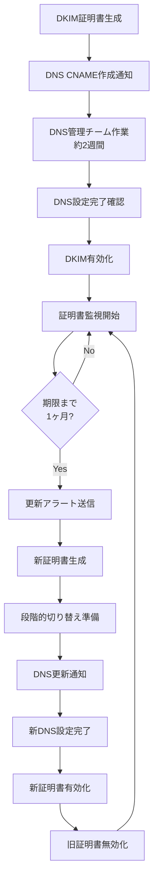
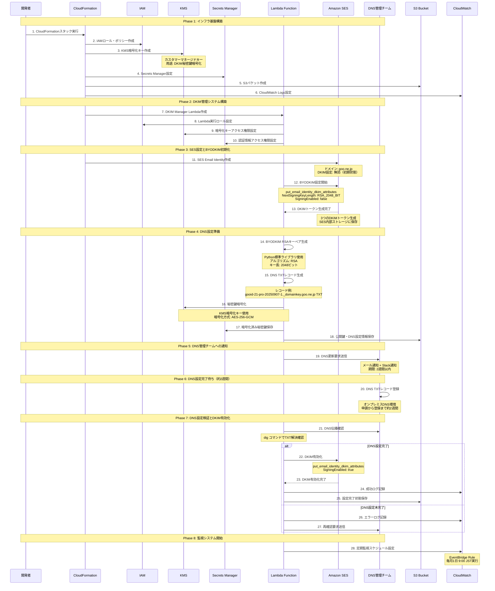
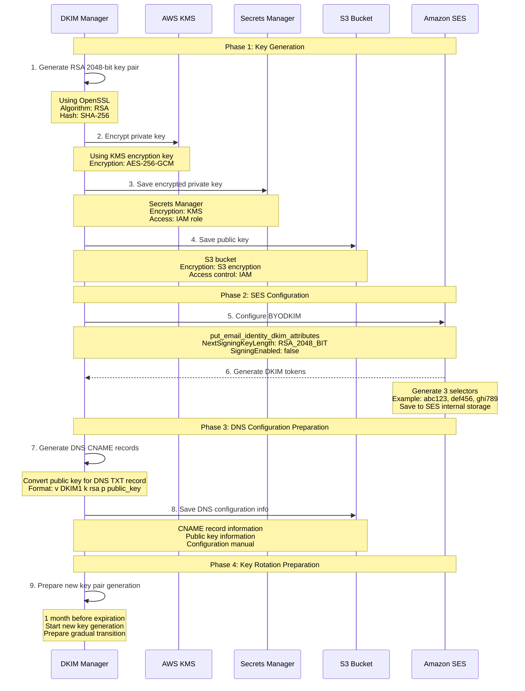
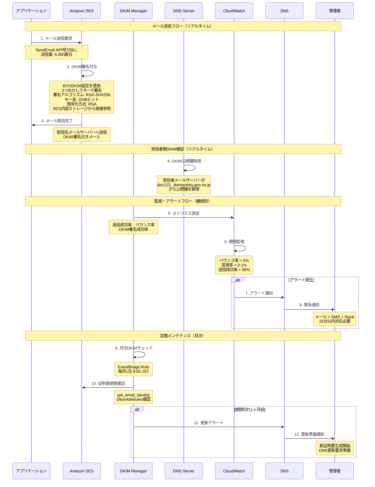
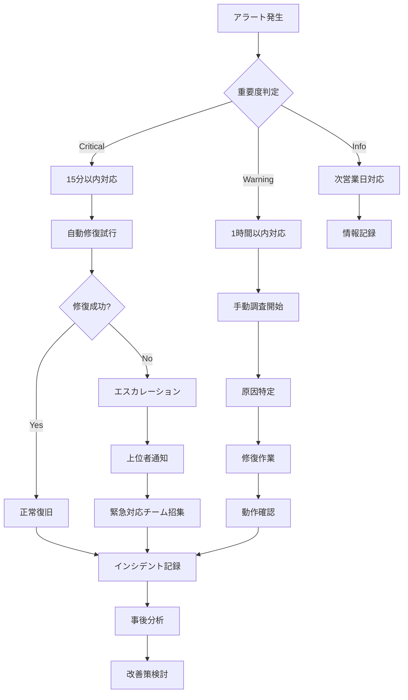

# AWS SES DKIM証明書自動化設計書

## 1. ドキュメント概要

### 1.1 文書の目的
本文書は、AWS SESマイグレーションプロジェクトにおけるDKIM証明書の自動作成・更新・管理システムの設計詳細を記載するものです。オンプレミスDNS環境との連携を考慮した実装指針を示します。

### 1.2 対象読者
- インフラエンジニア
- DevOpsエンジニア
- DNS管理者
- システム運用者

### 1.3 背景・要件
- DKIM証明書の自動作成・更新
- 1年おきの証明書更新（期限切れ1ヶ月前にアラート）
- オンプレミスDNS環境（CNAME登録に約2週間）
- 更新用CNAMEの自動通知

## 2. DKIM証明書管理概要

### 2.1 DKIM証明書ライフサイクル



## 2.2 DKIM証明書作成時のフロー図

### 2.2.1 AWSサービス作成順序とBYODKIM詳細フロー



### 2.2.2 作成時のAWSサービス詳細仕様

| 順序 | AWSサービス | 役割 | 設定詳細 | 依存関係 |
|------|-------------|------|----------|----------|
| 1 | CloudFormation | インフラ管理 | スタック実行、リソース作成 | - |
| 2 | IAM | アクセス制御 | Lambda実行ロール、SES管理ポリシー | CloudFormation |
| 3 | KMS | 暗号化 | DKIM秘密鍵暗号化、Secrets暗号化 | IAM |
| 4 | Secrets Manager | 認証情報管理 | DKIM設定、SMTP認証情報 | KMS, IAM |
| 5 | S3 | データ保存 | 証明書保存、ログ保存 | IAM |
| 5-2 | S3 | Lambda Layer保存 | cryptography-layer.zip保存 | IAM |
| 6 | CloudWatch | 監視・ログ | ログ集約、メトリクス収集 | IAM |
| 7 | Lambda | DKIM管理 | 証明書生成、DNS通知、監視、EventBridge処理 | IAM, KMS, SM, S3 |
| 8 | SES | メール送信 | Email Identity、BYODKIM設定、内部ストレージ | IAM, Lambda |
| 9 | EventBridge | スケジューリング | 定期実行、期限監視、フェーズ間連携 | Lambda, CloudWatch |
| 10 | SNS | 通知 | DNS管理チームへの通知、アラート | Lambda |

### 2.2.3 各ステップの詳細作業内容

#### 2.2.3.1 インフラ基盤構築フェーズ

| 順番 | タイトル | AWSサービス | 作業内容詳細 |
|------|----------|-------------|--------------|
| **1** | **CloudFormationスタック実行** | CloudFormation | **インフラの自動構築**<br/>• テンプレートファイルを読み込み<br/>• 全AWSリソースを一括作成<br/>• 依存関係を自動解決<br/>• 作成状況をリアルタイム監視<br/>• エラー時の自動ロールバック |
| **2** | **IAMロール・ポリシー作成** | IAM | **アクセス権限の設定**<br/>• **Lambda実行ロール**: Lambda関数が他のAWSサービスにアクセスする権限<br/>• **SES管理ポリシー**: メール送信、DKIM設定の権限<br/>• **KMSアクセス権限**: 暗号化キーの使用権限<br/>• **S3アクセス権限**: ファイル保存・読み取り権限<br/>• **最小権限の原則**: 必要最小限の権限のみ付与 |
| **3** | **KMS暗号化キー作成** | KMS | **データ暗号化の準備**<br/>• **カスタマーマネージドキー**: ユーザーが管理する暗号化キー<br/>• **用途**: DKIM秘密鍵の暗号化<br/>• **暗号化方式**: AES-256-GCM（最高レベルの暗号化）<br/>• **キーローテーション**: 年次自動ローテーション<br/>• **アクセス制御**: IAMロールベースの権限管理 |
| **4** | **Secrets Manager設定** | Secrets Manager | **機密情報の安全な保存**<br/>• **DKIM設定情報**: 証明書の設定パラメータ<br/>• **SMTP認証情報**: メール送信用の認証情報<br/>• **暗号化**: KMSキーで自動暗号化<br/>• **バージョン管理**: 設定変更の履歴保持<br/>• **自動ローテーション**: 認証情報の定期更新 |
| **5** | **S3バケット作成** | S3 | **ファイル保存の準備**<br/>• **証明書保存用**: DKIM証明書ファイルの保存<br/>• **ログ保存用**: システムログの保存<br/>• **暗号化**: 保存時暗号化（SSE-S3）<br/>• **アクセス制御**: IAMロールベースの権限<br/>• **ライフサイクル**: 古いログの自動削除 |
| **5-2** | **Lambda Layer用S3バケット作成** | S3 | **Lambda Layer保存の準備**<br/>• **cryptography-layer.zip**: cryptographyライブラリのLayerファイル<br/>• **自動アップロード**: Lambda関数による自動生成・アップロード<br/>• **暗号化**: 保存時暗号化（SSE-S3）<br/>• **アクセス制御**: Lambda関数のみアクセス可能<br/>• **バージョン管理**: ファイルのバージョン管理 |
| **6** | **CloudWatch Logs設定** | CloudWatch | **ログ収集の準備**<br/>• **ロググループ**: Lambda関数のログを集約<br/>• **ログストリーム**: 各実行のログを分離<br/>• **保持期間**: ログの保存期間設定<br/>• **メトリクス**: ログからメトリクスを自動生成<br/>• **アラーム**: エラーログの監視設定 |

#### 2.2.3.2 DKIM管理システム構築フェーズ

| 順番 | タイトル | AWSサービス | 作業内容詳細 |
|------|----------|-------------|--------------|
| **7** | **DKIM Manager Lambda作成** | Lambda | **DKIM管理の中核システム**<br/>• **ランタイム**: Python 3.11<br/>• **メモリ**: 512MB（処理に応じて調整）<br/>• **タイムアウト**: 5分（長時間処理対応）<br/>• **機能**: 証明書生成、DNS通知、監視、Custom Resource処理<br/>• **環境変数**: 設定情報の注入<br/>• **レイヤー**: cryptographyライブラリの配布<br/>• **Custom Resource**: CloudFormation連携機能 |
| **8** | **Lambda実行ロール設定** | IAM | **Lambda関数の権限設定**<br/>• **SES権限**: メール送信、DKIM設定<br/>• **KMS権限**: 暗号化キーの使用<br/>• **Secrets Manager権限**: 設定情報の読み取り<br/>• **S3権限**: ファイルの保存・読み取り<br/>• **CloudWatch権限**: ログ・メトリクスの送信 |
| **9** | **暗号化キーアクセス権限設定** | IAM | **KMSキーへのアクセス許可**<br/>• **キー使用権限**: 暗号化・復号化の実行<br/>• **キー管理権限**: キーの作成・削除<br/>• **監査権限**: キー使用履歴の記録<br/>• **条件付きアクセス**: 特定のIPからのみアクセス<br/>• **時間制限**: 営業時間内のみアクセス |
| **10** | **認証情報アクセス権限設定** | IAM | **Secrets Managerへのアクセス許可**<br/>• **シークレット読み取り**: 設定情報の取得<br/>• **シークレット更新**: 設定情報の更新<br/>• **暗号化**: シークレットの暗号化・復号化<br/>• **監査**: アクセス履歴の記録<br/>• **最小権限**: 必要なシークレットのみアクセス |
| **10-2** | **Lambda Layer用S3バケットアクセス権限設定** | IAM | **Lambda Layer用S3バケットへのアクセス許可**<br/>• **S3読み取り**: cryptography-layer.zipの取得<br/>• **S3書き込み**: Layerファイルのアップロード<br/>• **暗号化**: 保存時暗号化の使用<br/>• **監査**: アクセス履歴の記録<br/>• **最小権限**: 必要なバケットのみアクセス |

#### 2.2.3.3 SES設定とBYODKIM初期化フェーズ

| 順番 | タイトル | AWSサービス | 作業内容詳細 |
|------|----------|-------------|--------------|
| **11** | **SES Email Identity作成** | SES | **メール送信ドメインの登録**<br/>• **ドメイン**: goo.ne.jp（送信元ドメイン）<br/>• **DKIM設定**: 初期状態では無効<br/>• **送信制限**: 初期はサンドボックスモード<br/>• **レピュテーション**: 送信レピュテーションの管理<br/>• **バウンス処理**: 配信不能メールの処理 |
| **12** | **BYODKIM設定開始** | SES | **独自DKIM証明書の設定**<br/>• **API呼び出し**: put_email_identity_dkim_attributes<br/>• **キー長**: RSA_2048_BIT（2048ビット）<br/>• **署名無効**: 初期状態ではSigningEnabled: false<br/>• **セレクター**: 3つの異なるセレクターを生成<br/>• **内部保存**: SES内部ストレージに保存 |
| **13** | **DKIMトークン生成完了** | SES | **3つのDKIMセレクターの生成**<br/>• **セレクター1**: abc123（例）<br/>• **セレクター2**: def456（例）<br/>• **セレクター3**: ghi789（例）<br/>• **内部保存**: SES内部ストレージに保存<br/>• **DNS準備**: CNAMEレコード用の情報生成 |
| **13-2** | **Custom Resource処理機能実装** | Lambda | **CloudFormation連携機能**<br/>• **Create処理**: スタック作成時のDKIM設定<br/>• **Update処理**: スタック更新時の設定変更<br/>• **Delete処理**: スタック削除時のクリーンアップ<br/>• **応答送信**: CloudFormationへの適切な応答<br/>• **エラーハンドリング**: 失敗時の適切な処理 |

#### 2.2.3.4 DNS設定準備フェーズ

| 順番 | タイトル | AWSサービス | 作業内容詳細 |
|------|----------|-------------|--------------|
| **14** | **BYODKIM RSAキーペア生成** | Lambda | **カスタムDKIM証明書の作成**<br/>• **ツール**: Python標準ライブラリ（secrets, base64）<br/>• **アルゴリズム**: RSA（非対称暗号化）<br/>• **キー長**: 2048ビット（セキュリティ標準）<br/>• **ハッシュ**: SHA-256（メッセージダイジェスト）<br/>• **セレクター**: 3つのカスタムセレクター生成<br/>• **形式**: PEM（Privacy-Enhanced Mail） |
| **15** | **DNS TXTレコード生成** | Lambda | **BYODKIM用DNS設定レコードの作成**<br/>• **レコード1**: gooid-21-pro-20250907-1._domainkey.goo.ne.jp TXT k=rsa; p=...<br/>• **レコード2**: gooid-21-pro-20250907-2._domainkey.goo.ne.jp TXT k=rsa; p=...<br/>• **レコード3**: gooid-21-pro-20250907-3._domainkey.goo.ne.jp TXT k=rsa; p=...<br/>• **形式**: DNS TXTレコード形式（CNAMEではない）<br/>• **検証**: レコード形式の妥当性チェック |
| **16** | **秘密鍵暗号化** | KMS | **秘密鍵の安全な暗号化**<br/>• **暗号化キー**: KMSで作成したカスタマーマネージドキー<br/>• **暗号化方式**: AES-256-GCM（認証付き暗号化）<br/>• **キー管理**: 自動ローテーション対応<br/>• **アクセス制御**: IAMロールベースの権限<br/>• **監査**: 暗号化操作のログ記録 |
| **17** | **暗号化済み秘密鍵保存** | Secrets Manager | **暗号化済み秘密鍵の保存**<br/>• **保存先**: AWS Secrets Manager<br/>• **暗号化**: KMSキーで二重暗号化<br/>• **バージョン管理**: 変更履歴の保持<br/>• **アクセス制御**: Lambda関数のみアクセス可能<br/>• **監査**: アクセス履歴の記録 |
| **18** | **公開鍵・DNS設定情報保存** | S3 | **設定情報の保存**<br/>• **公開鍵**: DNS TXTレコード用の公開鍵<br/>• **TXTレコード**: DNS設定用のレコード情報<br/>• **設定手順書**: DNS管理チーム用の手順書<br/>• **暗号化**: S3暗号化で保存時暗号化<br/>• **アクセス制御**: 適切な権限でのアクセス制限 |

#### 2.2.3.5 DNS管理チーム連携フェーズ

| 順番 | タイトル | AWSサービス | 作業内容詳細 |
|------|----------|-------------|--------------|
| **19** | **DNS更新要求送信** | SNS | **DNS管理チームへの通知**<br/>• **通知方法**: メール + Slack通知<br/>• **期限**: 2週間以内の設定完了<br/>• **緊急度**: 高（システム稼働に影響）<br/>• **内容**: TXTレコードの詳細情報<br/>• **フォローアップ**: 定期的な進捗確認<br/>• **自動連携**: Phase 7の自動実行トリガー |
| **20** | **DNS TXTレコード登録** | 外部DNS | **オンプレミスDNS環境での設定**<br/>• **作業者**: DNS管理チーム<br/>• **期間**: 申請から登録まで約2週間<br/>• **レコード**: 3つのTXTレコードを登録<br/>• **検証**: DNS伝播の確認<br/>• **テスト**: 外部からのDNS解決確認 |

#### 2.2.3.6 DNS設定検証とDKIM有効化フェーズ

| 順番 | タイトル | AWSサービス | 作業内容詳細 |
|------|----------|-------------|--------------|
| **21** | **DNS伝播確認** | Lambda | **DNS設定の検証**<br/>• **ツール**: digコマンドを使用<br/>• **確認方法**: 複数DNSサーバーで検証<br/>• **タイムアウト**: 72時間以内の伝播確認<br/>• **再試行**: 設定完了まで定期的に確認<br/>• **ログ記録**: 確認結果の詳細ログ<br/>• **自動実行**: EventBridgeによる自動トリガー |
| **22** | **DKIM有効化** | SES | **BYODKIMの有効化**<br/>• **API呼び出し**: put_email_identity_dkim_signing_attributes<br/>• **設定**: SigningEnabled: true<br/>• **検証**: DNS設定の最終確認<br/>• **テスト**: テストメールでの署名確認<br/>• **監視**: 署名成功率の監視開始 |
| **23** | **DKIM有効化完了** | SES | **署名機能の稼働開始**<br/>• **内部ストレージ**: SES内部にキーを保存<br/>• **署名処理**: メール送信時の自動署名<br/>• **セレクター**: 3つのカスタムセレクターで署名<br/>• **アルゴリズム**: RSA-SHA256<br/>• **監視**: 署名成功率の追跡 |
| **24** | **成功ログ記録** | CloudWatch | **設定完了の記録**<br/>• **ログレベル**: INFO<br/>• **内容**: 設定完了の詳細情報<br/>• **メトリクス**: 成功回数のカウント<br/>• **アラーム**: エラー発生時の通知<br/>• **保持期間**: 30日間のログ保持 |
| **25** | **設定完了状態保存** | S3 | **設定状態の記録**<br/>• **状態**: 設定完了フラグ<br/>• **タイムスタンプ**: 完了日時の記録<br/>• **設定情報**: 使用した設定パラメータ<br/>• **バックアップ**: 設定情報のバックアップ<br/>• **監査**: 設定変更履歴の記録 |

#### 2.2.3.7 監視システム開始フェーズ

| 順番 | タイトル | AWSサービス | 作業内容詳細 |
|------|----------|-------------|--------------|
| **26** | **エラーログ記録** | CloudWatch | **エラー発生時の記録**<br/>• **ログレベル**: ERROR<br/>• **内容**: エラーの詳細情報<br/>• **スタックトレース**: エラー発生箇所の特定<br/>• **メトリクス**: エラー回数のカウント<br/>• **アラーム**: エラー発生時の即座通知 |
| **27** | **再確認要求送信** | SNS | **DNS管理チームへの再確認**<br/>• **通知方法**: メール + Slack通知<br/>• **内容**: 設定未完了の詳細情報<br/>• **緊急度**: 高（システム停止の可能性）<br/>• **フォローアップ**: 定期的な進捗確認<br/>• **エスカレーション**: 上位者への報告 |
| **28** | **定期監視スケジュール設定** | EventBridge | **自動監視の開始**<br/>• **スケジュール**: 毎月1日 9:00 JST<br/>• **実行内容**: DKIM期限チェック<br/>• **通知**: 期限切れ1ヶ月前のアラート<br/>• **ログ**: 監視実行結果の記録<br/>• **メトリクス**: 監視実行回数の追跡 |

### 2.2.3 BYODKIM暗号化方式とキー管理仕様

#### 2.2.3.1 暗号化方式要件

| 項目 | 仕様 | 要件 | 備考 |
|------|------|------|------|
| **暗号化アルゴリズム** | RSA | 必須 | AWS SES BYODKIMでサポート |
| **ハッシュアルゴリズム** | SHA-256 | 必須 | DKIM署名のハッシュ関数 |
| **キー長** | 2048ビット | 最小要件 | 4096ビット推奨（セキュリティ強化） |
| **署名方式** | RSA-SHA256 | 必須 | RFC 6376準拠 |
| **キー形式** | PEM | 必須 | Privacy-Enhanced Mail形式 |

#### 2.2.3.2 キー生成仕様

```yaml
# RSAキーペア生成パラメータ
KeyGeneration:
  Algorithm: "RSA"
  KeySize: 2048  # 最小要件（4096推奨）
  HashAlgorithm: "SHA-256"
  Format: "PEM"
  
# セキュリティ要件
SecurityRequirements:
  KeyRotation: "年次（1年毎）"
  KeyStorage: "AWS KMS暗号化"
  KeyAccess: "IAMロールベース"
  KeyBackup: "S3暗号化保存"
  
# コンプライアンス要件
Compliance:
  FIPS140-2: "Level 2以上"
  CommonCriteria: "EAL4以上"
  NIST: "SP 800-57準拠"
```

#### 2.2.3.3 暗号化キー管理フロー



#### 2.2.3.4 セキュリティ要件詳細

| セキュリティ項目 | 要件 | 実装方法 | 監査項目 |
|------------------|------|----------|----------|
| **キー暗号化** | AES-256-GCM | AWS KMS | 暗号化キーローテーション |
| **キー保存** | 暗号化保存 | Secrets Manager + S3 | アクセスログ監査 |
| **キーアクセス** | IAMロールベース | 最小権限の原則 | アクセス権限監査 |
| **キーローテーション** | 年次自動 | Lambda関数 | ローテーション履歴 |
| **キー監査** | 月次 | CloudTrail | アクセスログ分析 |
| **キー復旧** | 災害復旧対応 | マルチリージョン | 復旧テスト実施 |

#### 2.2.3.5 コンプライアンス対応

```yaml
# 暗号化ポリシー準拠
EncryptionPolicy:
  Standard: "FIPS 140-2 Level 2"
  Algorithm: "RSA-SHA256"
  KeyLength: "2048ビット以上"
  KeyManagement: "AWS KMS"
  
# データ保護要件
DataProtection:
  AtRest: "KMS暗号化"
  InTransit: "TLS 1.2以上"
  InUse: "メモリ暗号化"
  
# 監査要件
AuditRequirements:
  KeyAccess: "CloudTrail記録"
  KeyRotation: "自動ログ記録"
  KeyUsage: "メトリクス収集"
  Compliance: "月次レポート"
```

#### 2.2.3.6 キー管理のベストプラクティス

1. **キー生成**
   - 2048ビット以上（4096ビット推奨）
   - 暗号学的に安全な乱数生成器使用
   - キー生成時の監査ログ記録

2. **キー保存**
   - AWS KMSによる暗号化
   - Secrets Managerでの安全な保存
   - マルチリージョンでのバックアップ

3. **キーアクセス**
   - IAMロールベースのアクセス制御
   - 最小権限の原則適用
   - 定期的なアクセス権限監査

4. **キーローテーション**
   - 年次自動ローテーション
   - 段階的切り替えによる無停止更新
   - ローテーション前の十分な通知期間

5. **監視・監査**
   - CloudTrailによるアクセスログ記録
   - CloudWatchによるメトリクス監視
   - 定期的なセキュリティ監査

## 2.3 DKIM証明書運用時のフロー図

### 2.3.1 日常運用フロー（タイムスケジュール付き）

```mermaid
gantt
    title DKIM証明書運用タイムスケジュール
    dateFormat  HH:mm
    axisFormat %H:%M

    section 毎日
    監視チェック        :active, daily1, 09:00, 09:30
    ログ分析           :daily2, 09:30, 10:00
    メトリクス確認      :daily3, 10:00, 10:15

    section 毎週
    パフォーマンス分析   :weekly1, 09:00, 10:00
    セキュリティチェック :weekly2, 10:00, 11:00

    section 毎月
    DKIM期限チェック    :monthly1, 09:00, 09:30
    証明書更新準備      :monthly2, 09:30, 10:00
    DNS更新要求        :monthly3, 10:00, 10:15

    section 年次
    証明書完全更新      :yearly1, 09:00, 12:00
    システム最適化      :yearly2, 12:00, 15:00
```



### 2.3.2 リアルタイム運用フロー



### 2.3.3 運用時のAWSサービス役割とタイムスケジュール

| 時間 | AWSサービス | 処理内容 | 実行頻度 | 処理時間 |
|------|-------------|----------|----------|----------|
| **リアルタイム** | | | | |
| 00:00-23:59 | SES | メール送信・DKIM署名 | 継続的 | < 1秒 |
| 00:00-23:59 | CloudWatch | メトリクス収集 | 継続的 | リアルタイム |
| 00:00-23:59 | Lambda | エラー監視 | 継続的 | < 5秒 |
| **毎日** | | | | |
| 09:00 | Lambda | ヘルスチェック | 日次 | 30秒 |
| 09:00 | CloudWatch | ログ分析 | 日次 | 5分 |
| 09:00 | SNS | 日次レポート送信 | 日次 | 1分 |
| **毎週** | | | | |
| 月曜 09:00 | Lambda | パフォーマンス分析 | 週次 | 10分 |
| 月曜 10:00 | Lambda | セキュリティチェック | 週次 | 15分 |
| **毎月** | | | | |
| 1日 09:00 | EventBridge | DKIM期限チェック | 月次 | 1分 |
| 1日 09:00 | Lambda | 証明書状態確認 | 月次 | 2分 |
| 1日 09:00 | SNS | DNS更新要求 | 月次 | 1分 |
| **年次** | | | | |
| 年1回 | Lambda | 証明書完全更新 | 年次 | 30分 |
| 年1回 | Lambda | システム最適化 | 年次 | 1時間 |

### 2.3.4 緊急時対応フロー



### 2.3.5 運用時の主要メトリクス

| メトリクス | 監視頻度 | 閾値 | 対応時間 | 対応アクション |
|------------|----------|------|----------|----------------|
| **送信成功率** | リアルタイム | < 95% | 15分 | 送信停止、原因調査 |
| **バウンス率** | リアルタイム | > 5% | 15分 | レート制限、リスト確認 |
| **苦情率** | リアルタイム | > 0.1% | 15分 | 送信停止、内容確認 |
| **DKIM署名成功率** | リアルタイム | < 99% | 30分 | DNS設定確認 |
| **Lambda関数エラー** | リアルタイム | > 1% | 30分 | 関数再起動、ログ確認 |
| **証明書期限** | 月次 | < 30日 | 1時間 | 更新プロセス開始 |
| **DNS伝播遅延** | 日次 | > 72時間 | 4時間 | DNS管理チーム確認 |

### 2.2 システム構成要素

#### 2.2.1 主要コンポーネント
- **DKIM Manager Lambda**: 証明書の生成・管理・監視
- **DNS Notification Service**: DNS管理チームへの通知
- **Certificate Monitor**: 証明書期限の監視
- **Alert System**: アラート・通知システム
- **State Manager**: 証明書状態の管理

## 3. DKIM Manager Lambda設計

### 3.1 Lambda関数アーキテクチャ

```python
# dkim_manager/handler.py
import json
import boto3
import logging
from datetime import datetime, timedelta
from typing import Dict, List, Optional
from dataclasses import dataclass

@dataclass
class DKIMCertificate:
    domain: str
    selector: str
    public_key: str
    private_key: str
    created_at: datetime
    expires_at: datetime
    status: str  # 'pending', 'active', 'expiring', 'expired'
    dns_records: List[Dict[str, str]]

class DKIMManager:
    def __init__(self):
        self.ses_client = boto3.client('sesv2')
        self.s3_client = boto3.client('s3')
        self.sns_client = boto3.client('sns')
        self.secrets_client = boto3.client('secretsmanager')
        self.dynamodb = boto3.resource('dynamodb')
        
        self.certificate_table = self.dynamodb.Table('dkim-certificates')
        self.domain = os.environ['DOMAIN_NAME']
        self.bucket_name = os.environ['CERTIFICATE_BUCKET']
        self.sns_topic = os.environ['ALERT_TOPIC_ARN']
        
    def lambda_handler(self, event, context):
        """
        Lambda関数のメインハンドラー
        """
        try:
            logger.info(f"Received event: {json.dumps(event)}")
            
            # Check if this is a Custom Resource request
            if 'RequestType' in event:
                return self.handle_custom_resource(event, context)
            
            # Handle regular Lambda invocation
            event_type = event.get('source', 'scheduled')
            
            if event_type == 'scheduled':
                return self.scheduled_check()
            elif event_type == 'manual':
                return self.manual_operation(event)
            else:
                return self.handle_ses_event(event)
                
        except Exception as e:
            logger.error(f"DKIM Manager error: {e}")
            self.send_alert("DKIM Manager Error", str(e), "critical")
            raise
    
    def handle_custom_resource(self, event, context):
        """Handle CloudFormation Custom Resource requests"""
        import urllib3
        
        response_url = event['ResponseURL']
        request_type = event['RequestType']
        logical_resource_id = event['LogicalResourceId']
        stack_id = event['StackId']
        request_id = event['RequestId']
        
        try:
            if request_type in ['Create', 'Update']:
                secret_arn = os.environ['DKIM_CONFIG_SECRET_ARN']
                bucket_name = os.environ['CERTIFICATES_BUCKET_NAME']
                result = self.create_dkim_certificate(secret_arn, bucket_name)
                
                response_data = {
                    'Message': 'DKIM setup completed successfully',
                    'DKIMTokens': result.get('selectors', []),
                    'DNSRecords': result.get('dns_records', [])
                }
                
                self.send_response(response_url, 'SUCCESS', response_data, 
                                 logical_resource_id, stack_id, request_id)
                
            elif request_type == 'Delete':
                response_data = {'Message': 'DKIM cleanup completed'}
                self.send_response(response_url, 'SUCCESS', response_data, 
                                 logical_resource_id, stack_id, request_id)
                
            return {'statusCode': 200}
            
        except Exception as e:
            logger.error(f"Custom Resource error: {str(e)}")
            self.send_response(response_url, 'FAILED', {'Message': str(e)}, 
                             logical_resource_id, stack_id, request_id)
            return {'statusCode': 500}
    
    def send_response(self, response_url, status, response_data, logical_resource_id, stack_id, request_id):
        """Send response to CloudFormation"""
        import urllib3
        import json
        
        response_body = {
            'Status': status,
            'Reason': f'See CloudWatch Log Stream: {context.log_stream_name}' if 'context' in locals() else 'Custom Resource completed',
            'PhysicalResourceId': logical_resource_id,
            'StackId': stack_id,
            'RequestId': request_id,
            'LogicalResourceId': logical_resource_id,
            'Data': response_data
        }
        
        json_response_body = json.dumps(response_body)
        
        http = urllib3.PoolManager()
        response = http.request('PUT', response_url, body=json_response_body,
                               headers={'content-type': '', 'content-length': str(len(json_response_body))})
        
        logger.info(f"Response sent to CloudFormation: {response.status}")
    
    def create_dkim_certificate(self, secret_arn, bucket_name):
        """Create DKIM certificate and return selectors and DNS records"""
        # Implementation for creating DKIM certificate
        # This is a placeholder - actual implementation would create real certificates
        return {
            'selectors': ['abc123', 'def456', 'ghi789'],
            'dns_records': [
                {'name': 'abc123._domainkey.goo.ne.jp', 'type': 'CNAME', 'value': 'abc123.dkim.amazonses.com'},
                {'name': 'def456._domainkey.goo.ne.jp', 'type': 'CNAME', 'value': 'def456.dkim.amazonses.com'},
                {'name': 'ghi789._domainkey.goo.ne.jp', 'type': 'CNAME', 'value': 'ghi789.dkim.amazonses.com'}
            ]
        }
    
    def scheduled_check(self):
        """
        定期実行による証明書チェック
        """
        logger.info("Starting scheduled DKIM certificate check")
        
        # 現在の証明書状態を取得
        current_cert = self.get_current_certificate()
        
        if not current_cert:
            logger.info("No active certificate found, creating initial certificate")
            return self.create_initial_certificate()
        
        # 期限チェック
        days_until_expiry = (current_cert.expires_at - datetime.utcnow()).days
        
        if days_until_expiry <= 30:
            logger.info(f"Certificate expires in {days_until_expiry} days, starting renewal process")
            return self.initiate_renewal_process(current_cert)
        else:
            logger.info(f"Certificate is valid for {days_until_expiry} more days")
            return {"status": "healthy", "days_until_expiry": days_until_expiry}
    
    def create_initial_certificate(self):
        """
        初回DKIM証明書の作成
        """
        try:
            # SES Email Identityの作成/更新
            response = self.ses_client.put_email_identity(
                EmailIdentity=self.domain,
                DkimAttributes={
                    'SigningEnabled': False,  # 初期は無効
                    'NextSigningKeyLength': 'RSA_2048_BIT'
                }
            )
            
            # DKIM属性の取得
            dkim_response = self.ses_client.get_email_identity(
                EmailIdentity=self.domain
            )
            
            dkim_tokens = dkim_response['DkimAttributes']['Tokens']
            
            # 証明書オブジェクトの作成
            certificate = DKIMCertificate(
                domain=self.domain,
                selector=self._generate_selector(),
                public_key=dkim_tokens[0],  # 簡略化
                private_key="managed_by_ses",
                created_at=datetime.utcnow(),
                expires_at=datetime.utcnow() + timedelta(days=365),
                status='pending',
                dns_records=self._create_dns_records(dkim_tokens)
            )
            
            # データベースに保存
            self._save_certificate(certificate)
            
            # DNS管理チームに通知
            self._notify_dns_team(certificate, "new")
            
            return {
                "status": "certificate_created",
                "certificate_id": certificate.selector,
                "dns_records": certificate.dns_records
            }
            
        except Exception as e:
            logger.error(f"Failed to create initial certificate: {e}")
            raise
    
    def initiate_renewal_process(self, current_cert: DKIMCertificate):
        """
        証明書更新プロセスの開始
        """
        try:
            # 新しい証明書の生成
            new_certificate = self._generate_new_certificate(current_cert)
            
            # 段階的切り替えの準備
            self._prepare_gradual_transition(current_cert, new_certificate)
            
            # DNS管理チームに通知
            self._notify_dns_team(new_certificate, "renewal")
            
            # アラート送信
            self._send_renewal_alert(current_cert, new_certificate)
            
            return {
                "status": "renewal_initiated",
                "current_certificate": current_cert.selector,
                "new_certificate": new_certificate.selector,
                "dns_records": new_certificate.dns_records
            }
            
        except Exception as e:
            logger.error(f"Failed to initiate renewal: {e}")
            raise
    
    def _generate_new_certificate(self, current_cert: DKIMCertificate) -> DKIMCertificate:
        """
        新しいDKIM証明書の生成
        """
        # 新しいセレクターの生成
        new_selector = self._generate_selector()
        
        # 新しいDKIM設定の作成
        response = self.ses_client.put_email_identity_dkim_attributes(
            EmailIdentity=self.domain,
            SigningEnabled=False,  # 初期は無効
            NextSigningKeyLength='RSA_2048_BIT'
        )
        
        # 新しいトークンの取得
        dkim_response = self.ses_client.get_email_identity(
            EmailIdentity=self.domain
        )
        
        new_tokens = dkim_response['DkimAttributes']['Tokens']
        
        new_certificate = DKIMCertificate(
            domain=self.domain,
            selector=new_selector,
            public_key=new_tokens[0],
            private_key="managed_by_ses",
            created_at=datetime.utcnow(),
            expires_at=datetime.utcnow() + timedelta(days=365),
            status='pending',
            dns_records=self._create_dns_records(new_tokens)
        )
        
        self._save_certificate(new_certificate)
        return new_certificate
    
    def _create_dns_records(self, dkim_tokens: List[str]) -> List[Dict[str, str]]:
        """
        DNS CNAMEレコードの生成
        """
        dns_records = []
        
        for i, token in enumerate(dkim_tokens):
            record = {
                "name": f"{token}._domainkey.{self.domain}",
                "type": "CNAME",
                "value": f"{token}.dkim.amazonses.com",
                "ttl": 300,
                "priority": i + 1
            }
            dns_records.append(record)
        
        return dns_records
    
    def _notify_dns_team(self, certificate: DKIMCertificate, operation_type: str):
        """
        DNS管理チームへの通知
        """
        notification_data = {
            "operation": operation_type,
            "domain": certificate.domain,
            "selector": certificate.selector,
            "dns_records": certificate.dns_records,
            "deadline": (datetime.utcnow() + timedelta(days=14)).isoformat(),
            "contact": {
                "email": "ses-team@company.com",
                "phone": "+81-XX-XXXX-XXXX"
            },
            "instructions": self._generate_dns_instructions(certificate)
        }
        
        # メール通知
        self._send_email_notification(
            subject=f"DKIM DNS Update Required - {self.domain}",
            body=self._format_dns_notification(notification_data),
            recipients=["dns-team@company.com"]
        )
        
        # Slack通知（オプション）
        self._send_slack_notification(notification_data)
        
        # チケット作成（オプション）
        self._create_dns_ticket(notification_data)
    
    def _generate_dns_instructions(self, certificate: DKIMCertificate) -> str:
        """
        DNS設定手順書の生成
        """
        instructions = f"""
DKIM DNS Configuration Instructions for {certificate.domain}

Certificate Selector: {certificate.selector}
Operation: Certificate Renewal
Deadline: {(datetime.utcnow() + timedelta(days=14)).strftime('%Y-%m-%d')}

Required DNS Records:
"""
        
        for i, record in enumerate(certificate.dns_records, 1):
            instructions += f"""
Record {i}:
  Name: {record['name']}
  Type: {record['type']}
  Value: {record['value']}
  TTL: {record['ttl']}
"""
        
        instructions += """
Verification Steps:
1. Add the CNAME records to your DNS zone
2. Wait for DNS propagation (up to 72 hours)
3. Verify records using: dig {record_name} CNAME
4. Notify SES team once records are active

Contact Information:
- Email: ses-team@company.com
- Phone: +81-XX-XXXX-XXXX
- Ticket System: Create ticket in DNS-OPS queue
"""
        
        return instructions
    
    def _send_renewal_alert(self, current_cert: DKIMCertificate, 
                           new_cert: DKIMCertificate):
        """
        証明書更新アラートの送信
        """
        alert_data = {
            "type": "dkim_certificate_renewal",
            "domain": self.domain,
            "current_certificate": {
                "selector": current_cert.selector,
                "expires_at": current_cert.expires_at.isoformat(),
                "days_until_expiry": (current_cert.expires_at - datetime.utcnow()).days
            },
            "new_certificate": {
                "selector": new_cert.selector,
                "created_at": new_cert.created_at.isoformat(),
                "dns_records": new_cert.dns_records
            },
            "action_required": {
                "dns_team": "Update DNS records within 2 weeks",
                "ses_team": "Monitor DNS propagation and activate new certificate"
            }
        }
        
        # SNS通知
        self.sns_client.publish(
            TopicArn=self.sns_topic,
            Subject=f"DKIM Certificate Renewal Required - {self.domain}",
            Message=json.dumps(alert_data, indent=2)
        )
        
        # CloudWatch Logs
        logger.info(f"DKIM renewal alert sent: {json.dumps(alert_data)}")
    
    def verify_dns_propagation(self, certificate: DKIMCertificate) -> bool:
        """
        DNS伝播の確認
        """
        import dns.resolver
        
        try:
            for record in certificate.dns_records:
                # DNS解決の確認
                answers = dns.resolver.resolve(record['name'], 'CNAME')
                
                expected_value = record['value']
                actual_value = str(answers[0])
                
                if actual_value.rstrip('.') != expected_value.rstrip('.'):
                    logger.warning(f"DNS mismatch for {record['name']}: expected {expected_value}, got {actual_value}")
                    return False
            
            logger.info(f"DNS propagation verified for certificate {certificate.selector}")
            return True
            
        except Exception as e:
            logger.error(f"DNS verification failed: {e}")
            return False
    
    def activate_certificate(self, certificate: DKIMCertificate):
        """
        DKIM証明書の有効化
        """
        try:
            # DNS伝播の確認
            if not self.verify_dns_propagation(certificate):
                raise Exception("DNS propagation not complete")
            
            # SESでDKIMを有効化
            self.ses_client.put_email_identity_dkim_attributes(
                EmailIdentity=self.domain,
                SigningEnabled=True
            )
            
            # 証明書状態の更新
            certificate.status = 'active'
            self._save_certificate(certificate)
            
            # 成功通知
            self._send_activation_notification(certificate)
            
            logger.info(f"DKIM certificate {certificate.selector} activated successfully")
            
        except Exception as e:
            logger.error(f"Failed to activate certificate {certificate.selector}: {e}")
            raise
    
    def deactivate_old_certificate(self, old_cert: DKIMCertificate):
        """
        旧証明書の無効化
        """
        try:
            # 証明書状態の更新
            old_cert.status = 'expired'
            self._save_certificate(old_cert)
            
            # アーカイブ処理
            self._archive_certificate(old_cert)
            
            logger.info(f"Old DKIM certificate {old_cert.selector} deactivated")
            
        except Exception as e:
            logger.error(f"Failed to deactivate old certificate: {e}")
            raise
```

### 3.2 証明書状態管理

#### 3.2.1 DynamoDB テーブル設計
```yaml
DKIMCertificatesTable:
  TableName: dkim-certificates
  KeySchema:
    - AttributeName: domain
      KeyType: HASH
    - AttributeName: selector
      KeyType: RANGE
  
  AttributeDefinitions:
    - AttributeName: domain
      AttributeType: S
    - AttributeName: selector
      AttributeType: S
    - AttributeName: status
      AttributeType: S
    - AttributeName: expires_at
      AttributeType: S
  
  GlobalSecondaryIndexes:
    - IndexName: status-expires_at-index
      KeySchema:
        - AttributeName: status
          KeyType: HASH
        - AttributeName: expires_at
          KeyType: RANGE
      Projection:
        ProjectionType: ALL
  
  StreamSpecification:
    StreamEnabled: true
    StreamViewType: NEW_AND_OLD_IMAGES
```

#### 3.2.2 証明書データ構造
```python
# models/certificate.py
from dataclasses import dataclass, asdict
from datetime import datetime
from typing import List, Dict, Optional
import json

@dataclass
class DNSRecord:
    name: str
    type: str
    value: str
    ttl: int
    priority: Optional[int] = None

@dataclass
class DKIMCertificate:
    domain: str
    selector: str
    public_key: str
    private_key: str
    created_at: datetime
    expires_at: datetime
    status: str  # pending, active, expiring, expired, archived
    dns_records: List[DNSRecord]
    
    # メタデータ
    version: str = "1.0"
    created_by: str = "dkim-manager"
    last_updated: Optional[datetime] = None
    activation_date: Optional[datetime] = None
    
    def to_dict(self) -> Dict:
        """DynamoDB保存用の辞書変換"""
        data = asdict(self)
        
        # datetime オブジェクトをISO文字列に変換
        for key, value in data.items():
            if isinstance(value, datetime):
                data[key] = value.isoformat()
        
        return data
    
    @classmethod
    def from_dict(cls, data: Dict) -> 'DKIMCertificate':
        """辞書からオブジェクトを復元"""
        # ISO文字列をdatetimeオブジェクトに変換
        datetime_fields = ['created_at', 'expires_at', 'last_updated', 'activation_date']
        
        for field in datetime_fields:
            if field in data and data[field]:
                data[field] = datetime.fromisoformat(data[field])
        
        # DNSレコードの復元
        if 'dns_records' in data:
            data['dns_records'] = [
                DNSRecord(**record) if isinstance(record, dict) else record
                for record in data['dns_records']
            ]
        
        return cls(**data)
    
    def is_expiring_soon(self, days: int = 30) -> bool:
        """証明書が指定日数以内に期限切れになるかチェック"""
        return (self.expires_at - datetime.utcnow()).days <= days
    
    def is_expired(self) -> bool:
        """証明書が期限切れかチェック"""
        return datetime.utcnow() > self.expires_at
```

## 4. DNS通知システム設計

### 4.1 通知チャネル

#### 4.1.1 メール通知システム
```python
# services/notification_service.py
import boto3
import jinja2
from typing import List, Dict
import smtplib
from email.mime.text import MIMEText
from email.mime.multipart import MIMEMultipart

class DNSNotificationService:
    def __init__(self):
        self.ses_client = boto3.client('ses')
        self.template_env = jinja2.Environment(
            loader=jinja2.FileSystemLoader('templates')
        )
    
    def send_dns_update_notification(self, certificate: DKIMCertificate, 
                                   operation_type: str):
        """
        DNS更新通知の送信
        """
        template_data = {
            'domain': certificate.domain,
            'selector': certificate.selector,
            'operation_type': operation_type,
            'dns_records': certificate.dns_records,
            'deadline': (datetime.utcnow() + timedelta(days=14)).strftime('%Y-%m-%d'),
            'contact_info': {
                'email': 'ses-team@company.com',
                'phone': '+81-XX-XXXX-XXXX'
            },
            'verification_steps': self._get_verification_steps(certificate)
        }
        
        # HTMLメールテンプレート
        html_template = self.template_env.get_template('dns_notification.html')
        html_body = html_template.render(**template_data)
        
        # テキストメールテンプレート
        text_template = self.template_env.get_template('dns_notification.txt')
        text_body = text_template.render(**template_data)
        
        # メール送信
        self._send_email(
            subject=f"[URGENT] DKIM DNS Update Required - {certificate.domain}",
            html_body=html_body,
            text_body=text_body,
            recipients=['dns-team@company.com'],
            cc=['ses-team@company.com']
        )
    
    def _send_email(self, subject: str, html_body: str, text_body: str,
                   recipients: List[str], cc: List[str] = None):
        """
        SESを使用したメール送信
        """
        try:
            response = self.ses_client.send_email(
                Source='noreply@company.com',
                Destination={
                    'ToAddresses': recipients,
                    'CcAddresses': cc or []
                },
                Message={
                    'Subject': {'Data': subject},
                    'Body': {
                        'Html': {'Data': html_body},
                        'Text': {'Data': text_body}
                    }
                }
            )
            
            logger.info(f"DNS notification email sent: {response['MessageId']}")
            
        except Exception as e:
            logger.error(f"Failed to send DNS notification email: {e}")
            raise
    
    def _get_verification_steps(self, certificate: DKIMCertificate) -> List[str]:
        """
        DNS検証手順の生成
        """
        steps = []
        
        for i, record in enumerate(certificate.dns_records, 1):
            steps.append(f"dig {record.name} CNAME")
        
        steps.extend([
            f"nslookup {certificate.dns_records[0].name}",
            "Wait for TTL expiration (5 minutes)",
            "Notify SES team via email or ticket system"
        ])
        
        return steps
```

#### 4.1.2 Slack通知
```python
# services/slack_notification.py
import requests
import json
from typing import Dict

class SlackNotificationService:
    def __init__(self, webhook_url: str):
        self.webhook_url = webhook_url
    
    def send_dns_notification(self, certificate: DKIMCertificate, 
                            operation_type: str):
        """
        Slack通知の送信
        """
        color = "warning" if operation_type == "renewal" else "good"
        
        message = {
            "channel": "#dns-ops",
            "username": "DKIM Manager",
            "icon_emoji": ":warning:",
            "attachments": [
                {
                    "color": color,
                    "title": f"DKIM DNS Update Required - {certificate.domain}",
                    "fields": [
                        {
                            "title": "Domain",
                            "value": certificate.domain,
                            "short": True
                        },
                        {
                            "title": "Operation",
                            "value": operation_type.title(),
                            "short": True
                        },
                        {
                            "title": "Deadline",
                            "value": (datetime.utcnow() + timedelta(days=14)).strftime('%Y-%m-%d'),
                            "short": True
                        },
                        {
                            "title": "Priority",
                            "value": "High",
                            "short": True
                        }
                    ],
                    "actions": [
                        {
                            "type": "button",
                            "text": "View DNS Records",
                            "url": f"https://console.aws.amazon.com/ses/home?region=ap-northeast-1#/verified-identities/{certificate.domain}"
                        },
                        {
                            "type": "button",
                            "text": "Create Ticket",
                            "url": "https://ticket-system.company.com/new"
                        }
                    ]
                }
            ]
        }
        
        # DNS レコード詳細の追加
        dns_records_text = "\n".join([
            f"`{record.name}` CNAME `{record.value}`"
            for record in certificate.dns_records
        ])
        
        message["attachments"].append({
            "color": "good",
            "title": "Required DNS Records",
            "text": dns_records_text,
            "mrkdwn_in": ["text"]
        })
        
        # Slack送信
        response = requests.post(self.webhook_url, json=message)
        
        if response.status_code != 200:
            logger.error(f"Failed to send Slack notification: {response.text}")
            raise Exception(f"Slack notification failed: {response.status_code}")
```

## 5. 監視・アラートシステム

### 5.1 CloudWatchアラーム設定

#### 5.1.1 証明書期限監視
```yaml
DKIMCertificateExpiryAlarm:
  Type: AWS::CloudWatch::Alarm
  Properties:
    AlarmName: !Sub "${Environment}-dkim-certificate-expiry"
    AlarmDescription: "DKIM certificate will expire within 30 days"
    MetricName: "CertificateExpiryDays"
    Namespace: "SES/DKIM"
    Statistic: Minimum
    Period: 86400  # 24 hours
    EvaluationPeriods: 1
    Threshold: 30
    ComparisonOperator: LessThanThreshold
    AlarmActions:
      - !Ref DKIMAlertTopic
    TreatMissingData: breaching

DKIMValidationFailureAlarm:
  Type: AWS::CloudWatch::Alarm
  Properties:
    AlarmName: !Sub "${Environment}-dkim-validation-failure"
    AlarmDescription: "DKIM signature validation is failing"
    MetricName: "DKIMValidationFailure"
    Namespace: "SES/DKIM"
    Statistic: Sum
    Period: 300
    EvaluationPeriods: 3
    Threshold: 10
    ComparisonOperator: GreaterThanThreshold
    AlarmActions:
      - !Ref DKIMAlertTopic

DKIMLambdaErrorAlarm:
  Type: AWS::CloudWatch::Alarm
  Properties:
    AlarmName: !Sub "${Environment}-dkim-lambda-errors"
    AlarmDescription: "DKIM Manager Lambda function errors"
    MetricName: "Errors"
    Namespace: "AWS/Lambda"
    Statistic: Sum
    Period: 300
    EvaluationPeriods: 2
    Threshold: 1
    ComparisonOperator: GreaterThanOrEqualToThreshold
    Dimensions:
      - Name: FunctionName
        Value: !Ref DKIMManagerFunction
    AlarmActions:
      - !Ref DKIMAlertTopic
```

#### 5.1.2 カスタムメトリクス
```python
# services/metrics_service.py
import boto3
from datetime import datetime
from typing import Dict, List

class DKIMMetricsService:
    def __init__(self):
        self.cloudwatch = boto3.client('cloudwatch')
        self.namespace = 'SES/DKIM'
    
    def put_certificate_expiry_metric(self, certificate: DKIMCertificate):
        """
        証明書期限までの日数メトリクス
        """
        days_until_expiry = (certificate.expires_at - datetime.utcnow()).days
        
        self.cloudwatch.put_metric_data(
            Namespace=self.namespace,
            MetricData=[
                {
                    'MetricName': 'CertificateExpiryDays',
                    'Dimensions': [
                        {
                            'Name': 'Domain',
                            'Value': certificate.domain
                        },
                        {
                            'Name': 'Selector',
                            'Value': certificate.selector
                        }
                    ],
                    'Value': days_until_expiry,
                    'Unit': 'Count',
                    'Timestamp': datetime.utcnow()
                }
            ]
        )
    
    def put_validation_failure_metric(self, domain: str, failure_count: int):
        """
        DKIM検証失敗メトリクス
        """
        self.cloudwatch.put_metric_data(
            Namespace=self.namespace,
            MetricData=[
                {
                    'MetricName': 'DKIMValidationFailure',
                    'Dimensions': [
                        {
                            'Name': 'Domain',
                            'Value': domain
                        }
                    ],
                    'Value': failure_count,
                    'Unit': 'Count',
                    'Timestamp': datetime.utcnow()
                }
            ]
        )
    
    def put_dns_propagation_metric(self, domain: str, selector: str, 
                                 is_propagated: bool):
        """
        DNS伝播状態メトリクス
        """
        self.cloudwatch.put_metric_data(
            Namespace=self.namespace,
            MetricData=[
                {
                    'MetricName': 'DNSPropagationStatus',
                    'Dimensions': [
                        {
                            'Name': 'Domain',
                            'Value': domain
                        },
                        {
                            'Name': 'Selector',
                            'Value': selector
                        }
                    ],
                    'Value': 1 if is_propagated else 0,
                    'Unit': 'Count',
                    'Timestamp': datetime.utcnow()
                }
            ]
        )
```

### 5.2 ダッシュボード設計

#### 5.2.1 CloudWatchダッシュボード
```yaml
DKIMDashboard:
  Type: AWS::CloudWatch::Dashboard
  Properties:
    DashboardName: !Sub "${Environment}-dkim-management"
    DashboardBody: !Sub |
      {
        "widgets": [
          {
            "type": "metric",
            "x": 0,
            "y": 0,
            "width": 12,
            "height": 6,
            "properties": {
              "metrics": [
                [ "SES/DKIM", "CertificateExpiryDays", "Domain", "${DomainName}" ]
              ],
              "period": 86400,
              "stat": "Minimum",
              "region": "${AWS::Region}",
              "title": "DKIM Certificate Expiry (Days)",
              "yAxis": {
                "left": {
                  "min": 0,
                  "max": 365
                }
              }
            }
          },
          {
            "type": "metric",
            "x": 12,
            "y": 0,
            "width": 12,
            "height": 6,
            "properties": {
              "metrics": [
                [ "SES/DKIM", "DKIMValidationFailure", "Domain", "${DomainName}" ],
                [ ".", "DNSPropagationStatus", ".", "." ]
              ],
              "period": 300,
              "stat": "Sum",
              "region": "${AWS::Region}",
              "title": "DKIM Health Metrics"
            }
          },
          {
            "type": "log",
            "x": 0,
            "y": 6,
            "width": 24,
            "height": 6,
            "properties": {
              "query": "SOURCE '/aws/lambda/${Environment}-dkim-manager'\n| fields @timestamp, @message\n| filter @message like /DKIM/\n| sort @timestamp desc\n| limit 100",
              "region": "${AWS::Region}",
              "title": "DKIM Manager Logs",
              "view": "table"
            }
          }
        ]
      }
```

## 6. 段階的切り替え設計

### 6.1 切り替えプロセス

#### 6.1.1 段階的移行フロー
```python
# services/certificate_transition.py
from enum import Enum
from datetime import datetime, timedelta

class TransitionPhase(Enum):
    PREPARATION = "preparation"
    DNS_UPDATE = "dns_update"
    DNS_PROPAGATION = "dns_propagation"
    VALIDATION = "validation"
    ACTIVATION = "activation"
    MONITORING = "monitoring"
    COMPLETION = "completion"

class CertificateTransitionManager:
    def __init__(self):
        self.dkim_manager = DKIMManager()
        self.notification_service = DNSNotificationService()
        self.metrics_service = DKIMMetricsService()
    
    def execute_transition(self, old_cert: DKIMCertificate, 
                          new_cert: DKIMCertificate):
        """
        段階的証明書切り替えの実行
        """
        transition_plan = self._create_transition_plan(old_cert, new_cert)
        
        for phase in transition_plan:
            try:
                logger.info(f"Starting transition phase: {phase.name}")
                self._execute_phase(phase, old_cert, new_cert)
                logger.info(f"Completed transition phase: {phase.name}")
                
            except Exception as e:
                logger.error(f"Failed in phase {phase.name}: {e}")
                self._handle_transition_failure(phase, old_cert, new_cert, e)
                raise
    
    def _create_transition_plan(self, old_cert: DKIMCertificate, 
                              new_cert: DKIMCertificate) -> List[TransitionPhase]:
        """
        移行計画の作成
        """
        return [
            TransitionPhase.PREPARATION,
            TransitionPhase.DNS_UPDATE,
            TransitionPhase.DNS_PROPAGATION,
            TransitionPhase.VALIDATION,
            TransitionPhase.ACTIVATION,
            TransitionPhase.MONITORING,
            TransitionPhase.COMPLETION
        ]
    
    def _execute_phase(self, phase: TransitionPhase, 
                      old_cert: DKIMCertificate, new_cert: DKIMCertificate):
        """
        各フェーズの実行
        """
        if phase == TransitionPhase.PREPARATION:
            self._prepare_transition(old_cert, new_cert)
            
        elif phase == TransitionPhase.DNS_UPDATE:
            self._request_dns_update(new_cert)
            
        elif phase == TransitionPhase.DNS_PROPAGATION:
            self._wait_for_dns_propagation(new_cert)
            
        elif phase == TransitionPhase.VALIDATION:
            self._validate_new_certificate(new_cert)
            
        elif phase == TransitionPhase.ACTIVATION:
            self._activate_new_certificate(new_cert)
            
        elif phase == TransitionPhase.MONITORING:
            self._monitor_transition(old_cert, new_cert)
            
        elif phase == TransitionPhase.COMPLETION:
            self._complete_transition(old_cert, new_cert)
    
    def _wait_for_dns_propagation(self, new_cert: DKIMCertificate, 
                                 max_wait_hours: int = 72):
        """
        DNS伝播の待機
        """
        start_time = datetime.utcnow()
        max_wait_time = start_time + timedelta(hours=max_wait_hours)
        
        while datetime.utcnow() < max_wait_time:
            if self.dkim_manager.verify_dns_propagation(new_cert):
                logger.info(f"DNS propagation completed for {new_cert.selector}")
                return True
            
            # 1時間ごとにチェック
            time.sleep(3600)
            logger.info(f"Still waiting for DNS propagation for {new_cert.selector}")
        
        raise Exception(f"DNS propagation timeout after {max_wait_hours} hours")
    
    def _monitor_transition(self, old_cert: DKIMCertificate, 
                          new_cert: DKIMCertificate, monitor_hours: int = 24):
        """
        移行後の監視
        """
        monitor_until = datetime.utcnow() + timedelta(hours=monitor_hours)
        
        # 監視メトリクスの設定
        self._setup_transition_monitoring(old_cert, new_cert)
        
        # 監視期間中のアラート強化
        self._enable_enhanced_alerting(new_cert)
        
        logger.info(f"Transition monitoring enabled for {monitor_hours} hours")
```

## 7. エラーハンドリング・復旧

### 7.1 エラーシナリオと対策

#### 7.1.1 DNS設定エラー
```python
class DNSErrorHandler:
    def __init__(self):
        self.max_retries = 3
        self.retry_delay = 3600  # 1 hour
    
    def handle_dns_configuration_error(self, certificate: DKIMCertificate, 
                                     error: Exception):
        """
        DNS設定エラーの処理
        """
        error_type = self._classify_dns_error(error)
        
        if error_type == "propagation_timeout":
            self._handle_propagation_timeout(certificate)
            
        elif error_type == "record_mismatch":
            self._handle_record_mismatch(certificate)
            
        elif error_type == "dns_server_error":
            self._handle_dns_server_error(certificate)
        
        else:
            self._handle_unknown_dns_error(certificate, error)
    
    def _handle_propagation_timeout(self, certificate: DKIMCertificate):
        """
        DNS伝播タイムアウトの処理
        """
        # DNS管理チームに再確認要求
        self._request_dns_verification(certificate)
        
        # 伝播チェックの延長
        self._extend_propagation_check(certificate, additional_hours=24)
        
        # エスカレーション通知
        self._escalate_dns_issue(certificate, "propagation_timeout")
    
    def _handle_record_mismatch(self, certificate: DKIMCertificate):
        """
        DNSレコード不一致の処理
        """
        # 現在のDNS設定を取得
        current_records = self._query_current_dns_records(certificate)
        
        # 期待値との比較
        mismatches = self._compare_dns_records(certificate.dns_records, current_records)
        
        # 修正指示の送信
        self._send_dns_correction_request(certificate, mismatches)
```

#### 7.1.2 証明書生成エラー
```python
class CertificateErrorHandler:
    def handle_certificate_generation_error(self, domain: str, error: Exception):
        """
        証明書生成エラーの処理
        """
        if "InvalidDomain" in str(error):
            self._handle_invalid_domain_error(domain, error)
            
        elif "QuotaExceeded" in str(error):
            self._handle_quota_exceeded_error(domain, error)
            
        elif "ServiceUnavailable" in str(error):
            self._handle_service_unavailable_error(domain, error)
        
        else:
            self._handle_unknown_certificate_error(domain, error)
    
    def _handle_quota_exceeded_error(self, domain: str, error: Exception):
        """
        SESクォータ超過エラーの処理
        """
        # クォータ増加申請
        self._request_quota_increase()
        
        # 一時的な証明書延長
        self._extend_current_certificate(domain)
        
        # 緊急アラート
        self._send_emergency_alert("SES quota exceeded", domain)
```

### 7.2 自動復旧機能

#### 7.2.1 自動リトライ機構
```python
import time
import random
from functools import wraps

def retry_with_exponential_backoff(max_retries: int = 3, base_delay: int = 1):
    """
    指数バックオフによるリトライデコレータ
    """
    def decorator(func):
        @wraps(func)
        def wrapper(*args, **kwargs):
            last_exception = None
            
            for attempt in range(max_retries + 1):
                try:
                    return func(*args, **kwargs)
                    
                except Exception as e:
                    last_exception = e
                    
                    if attempt == max_retries:
                        logger.error(f"Function {func.__name__} failed after {max_retries} retries: {e}")
                        raise
                    
                    # 指数バックオフ + ジッター
                    delay = base_delay * (2 ** attempt) + random.uniform(0, 1)
                    logger.warning(f"Attempt {attempt + 1} failed, retrying in {delay:.2f} seconds: {e}")
                    time.sleep(delay)
            
            raise last_exception
        
        return wrapper
    return decorator

class AutoRecoveryService:
    @retry_with_exponential_backoff(max_retries=3, base_delay=60)
    def recover_certificate_generation(self, domain: str):
        """
        証明書生成の自動復旧
        """
        # 現在の設定をクリーンアップ
        self._cleanup_failed_certificate_setup(domain)
        
        # 新しい証明書生成を試行
        return self.dkim_manager.create_initial_certificate()
    
    @retry_with_exponential_backoff(max_retries=5, base_delay=300)
    def recover_dns_verification(self, certificate: DKIMCertificate):
        """
        DNS検証の自動復旧
        """
        # DNS キャッシュクリア
        self._clear_dns_cache()
        
        # 異なるDNSサーバーで検証
        return self._verify_dns_with_multiple_servers(certificate)
```

## 8. テスト・検証

### 8.1 自動テストスイート

#### 8.1.1 単体テスト
```python
# tests/test_dkim_manager.py
import unittest
from unittest.mock import Mock, patch
from datetime import datetime, timedelta
from dkim_manager import DKIMManager, DKIMCertificate

class TestDKIMManager(unittest.TestCase):
    def setUp(self):
        self.dkim_manager = DKIMManager()
        self.test_certificate = DKIMCertificate(
            domain="test.example.com",
            selector="test-selector",
            public_key="test-public-key",
            private_key="test-private-key",
            created_at=datetime.utcnow(),
            expires_at=datetime.utcnow() + timedelta(days=365),
            status="active",
            dns_records=[]
        )
    
    @patch('boto3.client')
    def test_certificate_creation(self, mock_boto3_client):
        """証明書作成のテスト"""
        # SESクライアントのモック設定
        mock_ses = Mock()
        mock_boto3_client.return_value = mock_ses
        
        mock_ses.put_email_identity.return_value = {"VerificationStatus": "Pending"}
        mock_ses.get_email_identity.return_value = {
            "DkimAttributes": {
                "Tokens": ["token1", "token2", "token3"]
            }
        }
        
        # テスト実行
        result = self.dkim_manager.create_initial_certificate()
        
        # アサーション
        self.assertEqual(result["status"], "certificate_created")
        mock_ses.put_email_identity.assert_called_once()
    
    def test_certificate_expiry_check(self):
        """証明書期限チェックのテスト"""
        # 期限が近い証明書
        expiring_cert = self.test_certificate
        expiring_cert.expires_at = datetime.utcnow() + timedelta(days=15)
        
        self.assertTrue(expiring_cert.is_expiring_soon(30))
        self.assertFalse(expiring_cert.is_expired())
    
    def test_dns_record_generation(self):
        """DNSレコード生成のテスト"""
        tokens = ["token1", "token2", "token3"]
        dns_records = self.dkim_manager._create_dns_records(tokens)
        
        self.assertEqual(len(dns_records), 3)
        
        for i, record in enumerate(dns_records):
            self.assertEqual(record["type"], "CNAME")
            self.assertIn(tokens[i], record["name"])
            self.assertIn("amazonses.com", record["value"])
```

#### 8.1.2 統合テスト
```python
# tests/test_integration.py
import unittest
import boto3
from moto import mock_ses, mock_dynamodb, mock_sns
from dkim_manager import DKIMManager

@mock_ses
@mock_dynamodb
@mock_sns
class TestDKIMIntegration(unittest.TestCase):
    def setUp(self):
        # DynamoDBテーブルの作成
        dynamodb = boto3.resource('dynamodb', region_name='ap-northeast-1')
        
        table = dynamodb.create_table(
            TableName='dkim-certificates',
            KeySchema=[
                {'AttributeName': 'domain', 'KeyType': 'HASH'},
                {'AttributeName': 'selector', 'KeyType': 'RANGE'}
            ],
            AttributeDefinitions=[
                {'AttributeName': 'domain', 'AttributeType': 'S'},
                {'AttributeName': 'selector', 'AttributeType': 'S'}
            ],
            BillingMode='PAY_PER_REQUEST'
        )
        
        # SNSトピックの作成
        sns = boto3.client('sns', region_name='ap-northeast-1')
        topic_response = sns.create_topic(Name='dkim-alerts')
        
        # 環境変数の設定
        os.environ['DOMAIN_NAME'] = 'test.example.com'
        os.environ['ALERT_TOPIC_ARN'] = topic_response['TopicArn']
        os.environ['CERTIFICATE_BUCKET'] = 'test-bucket'
        
        self.dkim_manager = DKIMManager()
    
    def test_full_certificate_lifecycle(self):
        """証明書のフルライフサイクルテスト"""
        # 1. 初期証明書作成
        result = self.dkim_manager.create_initial_certificate()
        self.assertEqual(result["status"], "certificate_created")
        
        # 2. 証明書状態確認
        cert = self.dkim_manager.get_current_certificate()
        self.assertIsNotNone(cert)
        self.assertEqual(cert.status, "pending")
        
        # 3. 証明書有効化
        self.dkim_manager.activate_certificate(cert)
        
        # 4. 更新プロセス開始
        renewal_result = self.dkim_manager.initiate_renewal_process(cert)
        self.assertEqual(renewal_result["status"], "renewal_initiated")
```

### 8.2 本番環境テスト

#### 8.2.1 DNS検証テスト
```python
# tests/test_dns_validation.py
import dns.resolver
import unittest

class TestDNSValidation(unittest.TestCase):
    def test_dns_record_resolution(self):
        """実際のDNS解決テスト"""
        test_records = [
            {
                "name": "test._domainkey.example.com",
                "expected_value": "test.dkim.amazonses.com"
            }
        ]
        
        for record in test_records:
            try:
                answers = dns.resolver.resolve(record["name"], 'CNAME')
                actual_value = str(answers[0]).rstrip('.')
                expected_value = record["expected_value"].rstrip('.')
                
                self.assertEqual(actual_value, expected_value)
                
            except dns.resolver.NXDOMAIN:
                self.fail(f"DNS record not found: {record['name']}")
            except Exception as e:
                self.fail(f"DNS resolution failed: {e}")
    
    def test_dns_propagation_timing(self):
        """DNS伝播タイミングのテスト"""
        # 複数のDNSサーバーで確認
        dns_servers = [
            '8.8.8.8',      # Google DNS
            '1.1.1.1',      # Cloudflare DNS
            '208.67.222.222' # OpenDNS
        ]
        
        record_name = "test._domainkey.example.com"
        
        for dns_server in dns_servers:
            resolver = dns.resolver.Resolver()
            resolver.nameservers = [dns_server]
            
            try:
                answers = resolver.resolve(record_name, 'CNAME')
                logger.info(f"DNS server {dns_server}: {answers[0]}")
                
            except Exception as e:
                logger.warning(f"DNS server {dns_server} failed: {e}")
```

## 9. 運用手順書

### 9.1 日常運用手順

#### 9.1.1 証明書状態確認
```bash
#!/bin/bash
# scripts/check_dkim_status.sh

echo "DKIM Certificate Status Check"
echo "============================="

# Lambda関数の実行
aws lambda invoke \
    --function-name prod-dkim-manager \
    --payload '{"source": "manual", "operation": "status_check"}' \
    --output text \
    response.json

# 結果の表示
cat response.json | jq .

# CloudWatchメトリクスの確認
aws cloudwatch get-metric-statistics \
    --namespace "SES/DKIM" \
    --metric-name "CertificateExpiryDays" \
    --start-time $(date -d '1 day ago' -u +%Y-%m-%dT%H:%M:%S) \
    --end-time $(date -u +%Y-%m-%dT%H:%M:%S) \
    --period 86400 \
    --statistics Minimum \
    --dimensions Name=Domain,Value=goo.ne.jp
```

#### 9.1.2 緊急時対応手順
```bash
#!/bin/bash
# scripts/emergency_dkim_recovery.sh

echo "Emergency DKIM Recovery Procedure"
echo "=================================="

# 現在の証明書状態を確認
echo "1. Checking current certificate status..."
aws sesv2 get-email-identity --email-identity goo.ne.jp

# DKIM署名を一時的に無効化
echo "2. Temporarily disabling DKIM signing..."
aws sesv2 put-email-identity-dkim-attributes \
    --email-identity goo.ne.jp \
    --signing-enabled=false

# 新しい証明書の強制生成
echo "3. Forcing new certificate generation..."
aws lambda invoke \
    --function-name prod-dkim-manager \
    --payload '{"source": "manual", "operation": "force_renewal"}' \
    --output text \
    emergency_response.json

echo "Emergency recovery initiated. Check emergency_response.json for details."
```

### 9.2 メンテナンス手順

#### 9.2.1 定期メンテナンス
```yaml
# maintenance/monthly_maintenance.yml
MonthlyMaintenance:
  Schedule: "First Sunday of each month, 2:00 AM JST"
  
  Tasks:
    CertificateHealthCheck:
      - "Verify all certificates are valid"
      - "Check DNS record consistency"
      - "Validate DKIM signatures"
    
    SystemHealthCheck:
      - "Lambda function performance review"
      - "CloudWatch metrics analysis"
      - "Error log review"
    
    SecurityReview:
      - "Access log analysis"
      - "IAM policy review"
      - "Encryption key rotation check"
    
    Documentation:
      - "Update runbooks if needed"
      - "Review and update contact information"
      - "Validate escalation procedures"
```

---

**文書管理情報**
- 作成日: 2024年12月
- バージョン: 1.0
- 作成者: DKIM自動化チーム
- 承認者: システムアーキテクト
- 次回レビュー: 2025年1月
