## Podman 上でコンテナを作成するにあたっての注意点

### Jenkins コンテナにはコンテナ操作コマンドのみ配置

Jenkinsコンテナにはコンテナ関連はpodman-remote と podman-docker しかいれていません。  
そのためコンテナ単体ではPodmanは動きません。  
ホスト側のPodmanソケットを共有し、コンテナからは、ホスト側のPodmanを操作しています。   
その為使用したコンテナ・イメージはコンテナ内には一切なく、ホストOS側に保管されます。  

Gitea はarchitecture-beta には対応していないので下記は表示できない

```mermaid
architecture-beta
    group public_registry(cloud)[Container registry]
    group host_os(logos:aws-ec2)[Host OS]
    group host_container(logos:aws-ecs)[podman] in host_os
    group container1(logos:aws-ecs)[Jenkins] in host_container
    group container2(logos:aws-ecs)[Redmine] in host_container

    service socket(logos:aws-ecs)[podmanSocket] in host_container
    service pod(logos:aws-ecs)[podmanRemote] in container1
    service docker(logos:aws-ecs)[DockerHUB] in public_registry
    service ecr(logos:aws-ecs)[ECR] in public_registry
    service rhe(logos:aws-ecs)[RedHat] in public_registry

    socket:L --> R:docker
    pod:B -- B:socket
    
```



### Podman volume を使ったホスト-コンテナ間のパス変換について

Dockerを使用していた際はコンテナとホストOSのファイル共有にはbind mount を使用していました。これはファイルの管理をホスト側OSが行っていました。  
今回はPodman Volume を使用しています。これはファイルの管理をOSと切り離し、Podmanが行うものです。  
rootless で動かす上でファイルの管理をPodmanが行う方が良いと判断しました。  

### Proxy 設定について

proxy設定はcontainer.conf のenvで登録しないと有効になりません。  
シェル実行時等色々試しましたが無駄でした。  
ホスト側・コンテナ側それぞれのcontainer.confに登録しています。  

### Jenkinsへのアクセス


https://container.wbo110.goo.ne.jp/ci でアクセスできます。


検証時のユーザーとパスワードは以下の通り

* ログインユーザー: admin
* パスワード: adminpwd


### リバースプロキシの設定

Jenkins サービスへのWebアクセスはリバースプロキシ経由で行います。
リバースプロキシには以下のような設定が必要です。

前提：  
公開ホスト名： container.wbo110.goo.ne.jp  
コンテナホスト名： gooid-21-dev-container-101 (内部名)

* Apache 2.4 httpd

/etc/httpd/conf.d/container.wbo110.goo.ne.jp.conf 抜粋

```
    <Location /ci>
      RequestHeader unset Authorization
      ProxyPass http://gooid-21-dev-container-101:8080/ci nocanon
      ProxyPassReverse http://gooid-21-dev-container-101:8080/ci
    </Location>
```

# 以上
