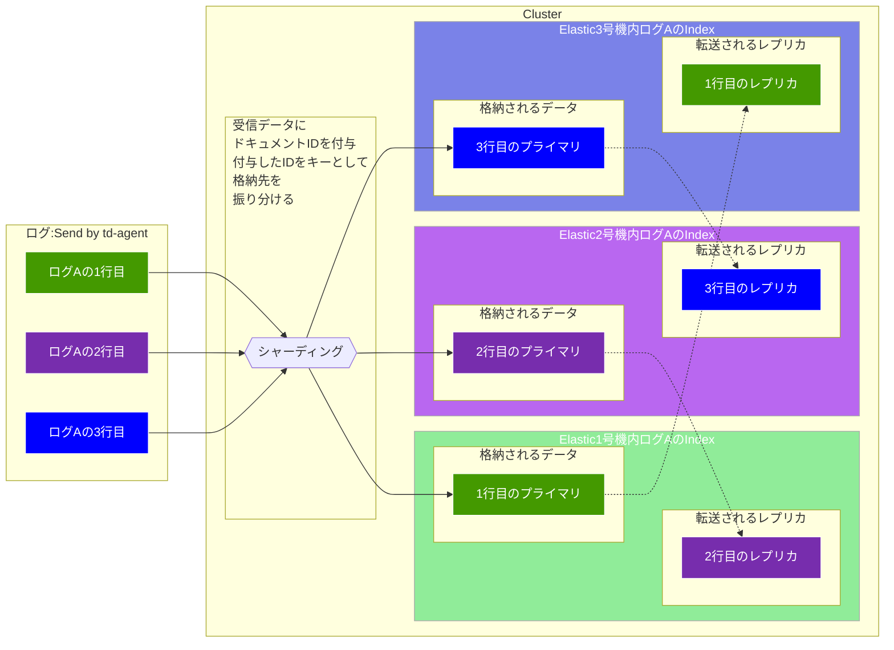

# Elasticsearch環境構築

## Overview

td-agentで収集したログをElasticsearchに格納し、kibanaを用いて可視化する  
Elasticsearchは複数台でクラスターを構成する  
Indexは3シャード・1レプリで分散処理と冗長性の担保する  
Elasticsearchへのアクセスはtd-agent・kibana共にLB経由で行う  

 
Elasticsearch環境概略図
 

クラスタは3台構成がグッドプラクティス  
https://www.elastic.co/guide/en/elasticsearch/reference/current/high-availability-cluster-small-clusters.html#high-availability-cluster-design-three-plus-nodes

 
初期構築にあたっては3ノードで構築し、全てのノードが  
Master Node（クラスタを管理・制御するためのノード　Master-eligibleノードから投票で1台を選出する）、  
Data Node(IndexingされたShardを保持しCRUDを担当するノード)、  
Ingest Node(Indexingを行う前にDocumentの加工整形を行う処理を担当するノード　今のところ加工処理はtd-agentで行っている)、  
Coordinating node(SearchやIndexingのリクエストを受け付ける全てのノードがこの機能を持つ) を兼ねる  
将来的にスケールさせる場合はMaster-eligible ノード（Master Node候補）は基本的に増やさないでdata ノードを増やす  
３台構成に合わせてシャーディングも3、レプリは１。どの1台で障害が発生してもデータの欠損は発生せずに稼働し続けられる構成  

 

3台クラスタ・3シャード・1レプリ構成図

 

 

## 送信側の課題

送信側の課題として、クライアント(td-agent)は、リクエストを複数のノードに送信するように構成(standby)されているか、リクエストを適切なノードセットに分散させるロードバランサーを使用するように構成されている必要がある  
Elastic Cloudサービスは、このようなロードバランサーを提供している様なのでtd-agentのプラグインで対応できない場合はクラスターの前段にLBを配置する  
td-agent + elasticsearchプラグインだとLBへ向けて転送するのが良さそう  
LBの振り分け設定はどんな感じで定義可能か？   
ラウンドロビン・事前に重みを設定・レスポンスが早かったもの・・・  

## 参考：大規模環境やDR対応などに対応する場合に考慮すること
 
2ゾーンのクラスタは避け3ゾーンのクラスタにする  
それぞれのクラスタにマスター適格ノードを1台ずつ配置することで投票をどのゾーンが全滅してもうまく行えるようにする  
また、シャードアロケーションアウェアネスを使用して、各ゾーンの各シャードのコピー数を制限し、一つのゾーンにしかコピーが無い状態を発生しないようにする  
アロケーション・アウェアネスは、シャードのレプリカがプライマリとは異なるゾーンにあることを保証している。  
その為。1つのゾーンに障害が発生した場合でも、すべてのシャードのコピーが利用可能であることを担保する。  
 

# セキュリティ関連

### 接続に関する設定

ElasticsearchへのアクセスはTLSでのみ行う。  
認証にはユーザ名・パスワード・サーバの鍵が必要  
config ファイルに直接パスワードを書く形になりそう  
サーバ側の鍵は自動生成らしいが有効期限が不明
HTTPは設定可能だが推奨されない為使用しない。  
 

### ユーザ・権限に関する設定

ユーザや権限を作成することが無料で可能になった。  
権限に関してはBuilt-inロールが用意されているがそれ以外にも作成可能  
小さな権限をいくつか作ってユーザに複数の作成した権限を割り当てていく感じにしたい  
どんなロールが必要かは開発環境でkibanaが動いた時点で相談して決めたい。  
 

### 監査に関する設定

PacketBeat はElasticsearchをサポートしていない　tcpのポート指定で情報は取得できるが今回から接続はtlsなのでPacketBeat単体ではハンドシェイクまでしか情報はとれず不可
ユーザ権限等が決まった時点で30日間のトライアルライセンスを適用して調査する  

 

# サイジング 主にメモリチューニングに関して

https://www.elastic.co/jp/blog/managing-and-troubleshooting-elasticsearch-memory  

割り当てるメモリ量は32GBを上限(※1)として、物理RAMの半分以下(デフォルトで物理RAMの半分に設定される)  
検索はシャードごとにシングルスレッドで実行される 今回構築するサーバはmaster node になりうるので4CPUにする予定であるが、
今後増設するサーバはmaster にはならないので2CPUで良い同様にヒープも5Gで良い。  

メモリ使用量に関する推奨指針(※2)
75％以下： 心配なし。
75%～85%：問題なし： パフォーマンスが十分で、負荷が安定する見込みがあれば許容範囲。
85％以上： 今こそ対策が必要です。メモリ消費量を減らすか、メモリを追加してください。

JVMのメモリ・プレッシャーが高く（使用量75%以上）なるケースは主に２つ  
１．ノード当たりのシャード数が多すぎる  
    75%を超えるJVMメモリー・プレッシャーが頻繁に発生する場合、利用可能なメモリー量に対してノードあたりのシャードの数が多すぎることが原因であることが多い  
２．高コストなクエリ実行  
    75%を超えるJVMメモリー・プレッシャーの発生頻度が低い場合、高コストなクエリ実行が行われている可能性が高い  
    クエリが高コストになる要因は、リクエストサイズが大きい、大量グループ（Bucket）数の集計（Metrics）  

推奨シャード数の求め方  
マスターノードが管理できるインデックスの数は、そのヒープサイズに比例する  
30種類　× 365 = 10,950

※1 メモリ量は32GBを超えてはならない  
https://www.elastic.co/guide/en/elasticsearch/guide/current/heap-sizing.html#compressed_oops  
※2 推奨指針  
https://www.elastic.co/jp/blog/found-understanding-memory-pressure-indicator#conclusion  

# その他

ログ転送・削除ツールの件  
ansible-playbook定期実行の件  

 

