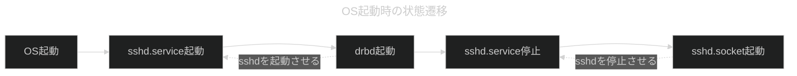

# Gold Zone 対策

TCP Wrapper を使用してGold Zone 以外からのSSH接続を拒否する

[BackLogTicket](https://bklg.docomo-common.com/backlog/view/GOOID-860)

/etc/hosts.deny でSSH接続をすべて拒否
/etc/hosts.allow で許可するIP（Gold Zone及び商用環境のローカルネットワーク）を指定
sshd から sshd.socket へ切替が前提

### 再起動時にTCP Wrapper を有効にするための暫定対応

TCP Wrapper を使用するためにはsshd.socket が起動している必要があります。  
sshd.serviceの常駐をやめ（disable）、sshd.socketに置き換える(enable)予定でしたが、    
fgwサーバではdrbdが使用されており、drbdはsshd.service を起動させます。  
sshd.service が起動（常駐）していると22番ポートを占有してしまうため、sshd.socketは起動できません。  
sshd.socketが起動していない状態でTCP Wrapper の認証を使用することは出来ないためユーザはsshログインできない状態になってしまいます。  
これらを回避するためにsshd.socket 起動はdrbd起動の後とし、systemctl stop sshd.service でsshd.service を停止させた後で起動するようにしています。

　　
# fgw/tasks/db0.yml：ディレクトリ「/db0/shopify-backup-202504」とは

- gooストアサービス終了後も7年間、当該期間の取引・顧客データを保持しておく必要があり、そのデータ保持のためのディレクトリである。
- 担当者連絡先：白濱將人,masahito.shirahama.bt@nttdocomo.com ※2025年5月現在
- gooストアとは：2019～2025-03-31 までSaaS型のECプラットフォームである"Shopify"にて展開されたECサイト。
