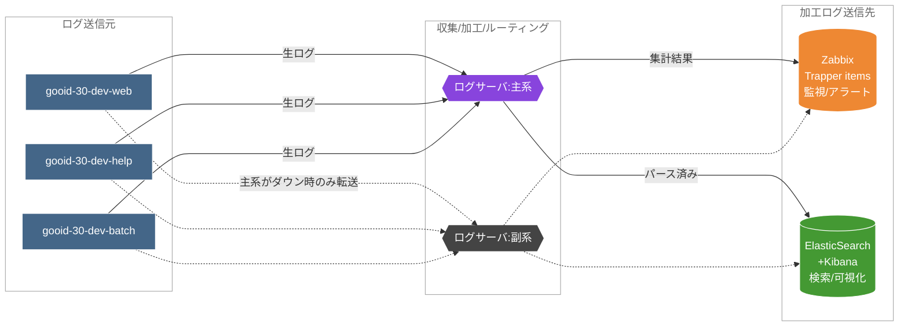
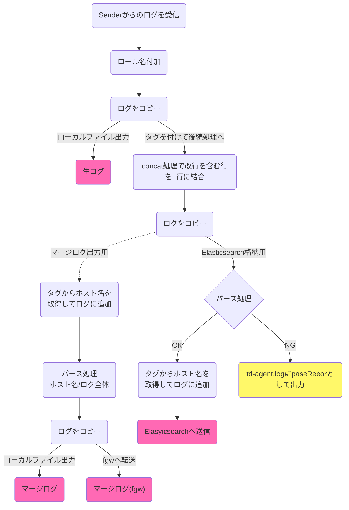
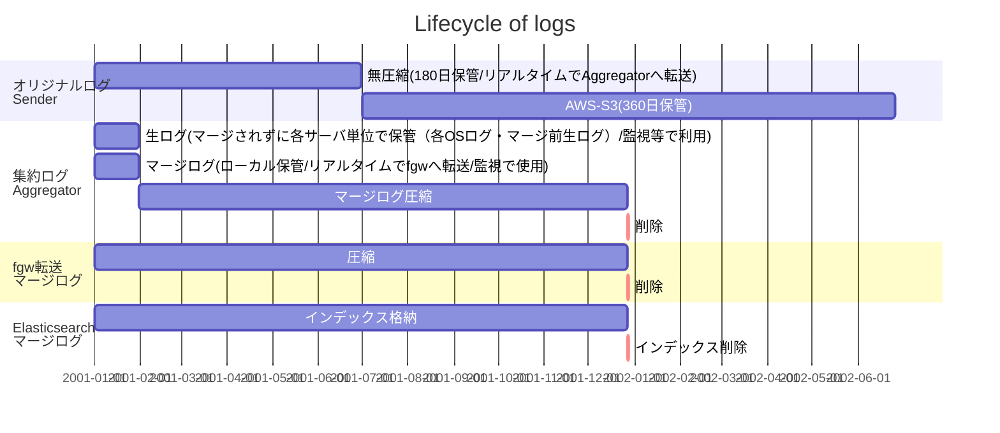
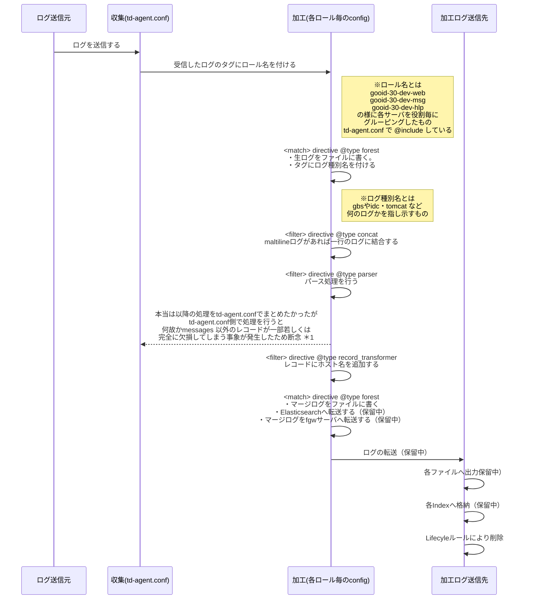
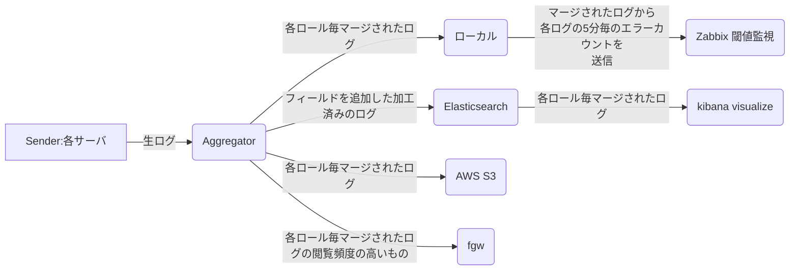
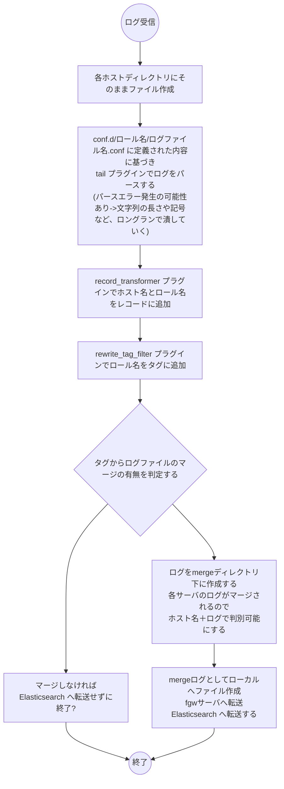
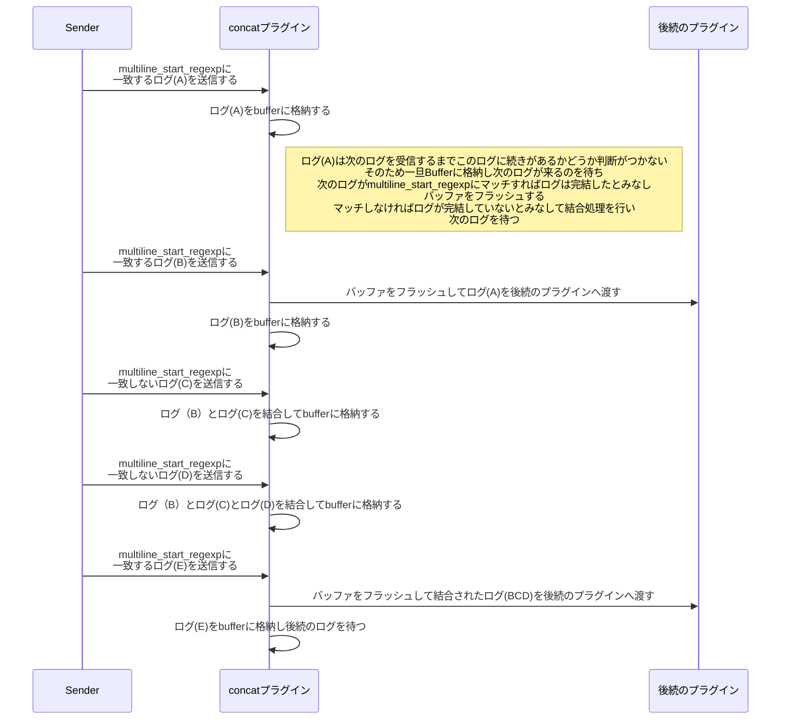
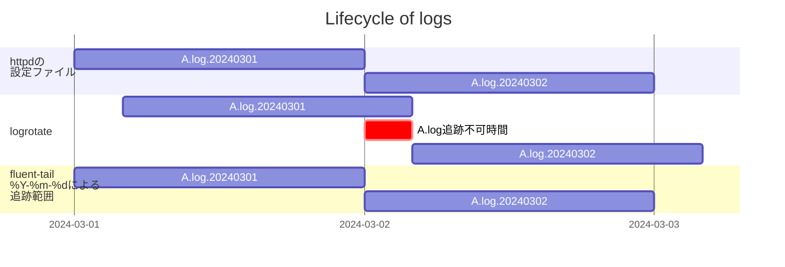

# ログの可視化環境構築
===================================

## Overview

td-agent elasticsearch kibana を用いたログ可視化環境を構築する

<br>
ログストリーミング化構想概略図
<br>


<br>
ディレクトリ構造
<br>

```bash
各ログサーバに格納される生ログとマージログは以下の様にディレクトリに格納される。
/db0/logs/  
     ├ 各サーバ名/  
     │　└ var.log.httpd/     (各ログのある階層までを.繋ぎで1階層に集約)  
     │　　└ログ名.yyyy-mm-dd.log  
     │　
     └ merged/  
        └ ロール名(ex. gooid-21-pro-web)/
            └ var.log.httpd/ 
                └ログ名.yyyy-mm-dd.log  (各サーバの同一名称のログをマージする際ログの先頭にホスト名が追加している)

```
<BR>

```bash
fgw-001サーバに格納されるマージログは以下の様にディレクトリに格納される。
/tdlogs/  
     ├ td-log/
     │　└ td-agent.log     (td-agent自体のログ パースエラー等の確認用)  
     └ merged/
        └ ロール名(ex. gooid-21-pro-web)/
            └ var.log.httpd/ 
                └ログ名.yyyy-mm-dd.log  (各サーバの同一名称のログをマージする際ログの先頭にホスト名が追加している)

```
<BR><BR>

## td-agent 管理対象ログ一覧

td-agentを用いて各サーバから収集しているログは以下の通り  

<style>
.small_table > table, .small_table > th, .small_table > td {
   font-size: 20%;
}
</style>

<div class="small_table"> 

| #  | サーバーグループ    | パス                         | ファイル名                                      | マージ有無 | Elasticsearch格納有無 | 監視有無 | Zabbix アイテム名                                             | 監視対象フィールド         | 監視文字列                                                        |
|----|-------------|----------------------------|--------------------------------------------|-------|-------------------|------|----------------------------------------------------------|-------------------|--------------------------------------------------------------|
| 1  | 全グループ共通     | /var/log                   | messages                                   | 有     | 有                 | 無    |                                                          | --                | --                                                           |
| 2  | ~           | /var/log                   | secure                                     | 有     | 有                 | 無    |                                                          | --                | --                                                           |
| 3  | ~           | /var/log                   | yum.log                                    | 有     | 有                 | 無    |                                                          | --                | --                                                           |
| 4  | gooid-web   | /var/log/app/gbss/         | event-spring-blue.log                      | 有     | 有                 | 有    | gooid-web_gbss_event_spring                              | priority          | ERROR または FATAL                                              |
| 5  | gooid-web   | /var/log/app/gbss/         | error-spring-blue.log                      | 有     | 有                 | 有    | gooid-web_gbss_error_spring                              | priority          | ERROR または FATAL                                              |
| 6  | gooid-web   | /var/log/app/gbss/         | debug-spring-blue.log                      | 有     | 有                 | 有    | gooid-web_gbss_debug_spring                              | priority          | ERROR または FATAL                                              |
| 7  | gooid-web   | /var/log/app/gbss/         | event-spring-green.log                     | 有     | 有                 | 有    | gooid-web_gbss_event_spring                              | priority          | ERROR または FATAL                                              |
| 8  | gooid-web   | /var/log/app/gbss/         | error-spring-green.log                     | 有     | 有                 | 有    | gooid-web_gbss_error_spring                              | priority          | ERROR または FATAL                                              |
| 9  | gooid-web   | /var/log/app/gbss/         | debug-spring-green.log                     | 有     | 有                 | 有    | gooid-web_gbss_debug_spring                              | priority          | ERROR または FATAL                                              |
| 10 | gooid-web   | /var/log/app/idc/          | openid.log                                 | 有     | 有                 | 有    | gooid-web_idc_openid                                     | msg               | [E]                                                          |
| 11 | gooid-web   | /var/log/app/idc/          | root.log                                   | 有     | 無                 | 無    |                                                          | --                | --                                                           |
| 12 | gooid-web   | /var/log/app/idc/          | user.log                                   | 有     | 有                 | 有    | gooid-web_user                                           | msg               | [E]                                                          |
| 13 | gooid-web   | /var/log/httpd/            | access_log                                 | 有     | 有                 | 有    | gooid-web_access_5xx<br/>gooid-web_access_2xx            | status<br/>status | 5xx<br/>2XX                                                  |
| 14 | gooid-web   | /var/log/httpd/            | error_log                                  | 有     | 有                 | 無    |                                                          | --                | --                                                           |
| 15 | gooid-web   | /var/log/httpd/            | modsec_audit.log                           | 有     | 有                 | 無    |                                                          | --                | --                                                           |
| 16 | gooid-web   | /var/log/httpd/            | modsec_performance.log                     | 有     | 有                 | 無    |                                                          | --                | --                                                           |
| 17 | gooid-web   | /var/log/httpd_gbs/        | access_log                                 | 有     | 有                 | 無    |                                                          | --                | --                                                           |
| 18 | gooid-web   | /var/log/httpd_gbs/        | error_log                                  | 有     | 有                 | 無    |                                                          | --                | --                                                           |
| 19 | gooid-web   | /var/log/tomcat/idc/       | catalina                                   | 無     | 無                 | 無    |                                                          | --                | --                                                           |
| 20 | gooid-web   | /var/log/tomcat/idc/       | localhost                                  | 無     | 無                 | 無    |                                                          | --                | --                                                           |
| 21 | gooid-web   | /var/lib/proxysql/         | proxysql.log                               | 有     | 有                 | 無    |                                                          | --                | --                                                           |
| 22 | idhub-web   | /var/log/app/idhub-oidc/   | oidc_audit.log                             | 有     | 有                 | 有    | idhub-web_idhub_oidc_oidc_audit                          | level             | ERROR                                                        |
| 23 | idhub-web   | /var/log/app/idhub-oidc/   | oidc_request.log                           | 有     | 有                 | 有    | idhub-web_idhub_oidc.oidc_request                        | level             | ERROR                                                        |
| 24 | idhub-web   | /var/log/app/idhub/        | user.log                                   | 有     | 有                 | 有    | idhub-web_idhub_user_dconnect<br/>idhub-web_idhub_user   | msg               | [E] と IDCAUE0000[2-5] を含む<br/>[E] を含むが IDCAUE0000[2-5] は含まない |
| 25 | idhub-web   | /var/log/httpd/            | access_log.yyyymmdd                        | 有     | 有                 | 有    | idhub-web_access_5xx                                     | status            | 5XX                                                          |
| 26 | idhub-web   | /var/log/httpd/            | error_log.yyyymmdd                         | 有     | 有                 | 無    |                                                          | --                | --                                                           |
| 27 | idhub-web   | /var/lib/proxysql/         | proxysql.log                               | 有     | 有                 | 無    |                                                          | --                | --                                                           |
| 28 | gooid-hlp   | /var/log/app/idc/          | helptoolwebapp.log                         | 有     | 有                 | 有    | gooid-hlp_idc_helptoolwebapp                             | msg               | [E]                                                          |
| 29 | gooid-hlp   | /var/log/app/idc/          | show_report.log                            | 有     | 有                 | 有    | gooid-hlp_idc_show_report                                | msglevel          | [E]                                                          |
| 30 | gooid-hlp   | /var/log/app/idc/          | ProfileToolOpe.log                         | 有     | 有                 | 無    |                                                          | --                | --                                                           |
| 31 | gooid-hlp   | /var/log/app/idc/          | ProfileToolAuth.log                        | 有     | 有                 | 無    |                                                          | --                | --                                                           |
| 32 | gooid-hlp   | /var/log/app/gbs/gbs/      | gbs_webapps.log                            | 有     | 有                 | 有    | gooid-hlp_gbs_gbs_webapps                                | level             | ERROR または FATAL                                              |
| 33 | gooid-hlp   | /var/log/app/gbs/gbs_mule/ | gbs_mule.log                               | 有     | 無                 | 有    | gooid-hlp_gbs_gbs_mule                                   | level             | ERROR または FATAL                                              |
| 34 | gooid-hlp   | /var/log/httpd/            | access_log.yyyymmdd                        | 有     | 有                 | 無    |                                                          | --                | --                                                           |
| 35 | gooid-hlp   | /var/log/httpd/            | ssl_access_log.yyyymmdd                    | 有     | 有                 | 無    |                                                          | --                | --                                                           |
| 36 | idhub-hlp   | /var/log/app/idhub/        | helptoolwebapp.log                         | 有     | 有                 | 有    | idhub-hlp_idhub_helptoolwebapp                           | message           | [E]                                                          |
| 37 | idhub-hlp   | /var/log/app/idhub/        | ProfileToolOpe.log                         | 有     | 有                 | 無    |                                                          | --                | --                                                           |
| 38 | idhub-hlp   | /var/log/app/idhub/        | ProfileToolAuth.log                        | 有     | 有                 | 無    |                                                          | --                | --                                                           |
| 39 | idhub-hlp   | /var/log/httpd/            | access_log.yyyymmdd                        | 有     | 有                 | 無    |                                                          | --                | --                                                           |
| 40 | idhub-hlp   | /var/log/httpd/            | ssl_access_log.yyyymmdd                    | 有     | 有                 | 無    |                                                          | --                | --                                                           |
| 41 | gooid-batch | /var/log/app/idc/          | make_common_reject_list.log                | 有     | 無                 | 有    | gooid-batch_idc_make_common_reject_list                  | message           | [E]                                                          |
| 42 | gooid-batch | /var/log/app/idc/          | oshiete_member.log                         | 有     | 無                 | 有    | gooid-batch_idc_oshiete_member                           | message           | [E]                                                          |
| 43 | gooid-batch | /var/log/app/idc/          | update_ip2country.log                      | 有     | 無                 | 有    | gooid-batch_idc_update_ip2country                        | message           | [E]                                                          |
| 44 | gooid-batch | /var/log/app/idc/          | DeleteAuthenticationSession.log            | 有     | 無                 | 有    | gooid-batch_idc_DeleteAuthenticationSession              | message           | [E]                                                          |
| 45 | gooid-batch | /var/log/app/idc/          | make_active_gooid_list.log                 | 有     | 無                 | 有    | gooid-batch_idc_make_active_gooid_list                   | message           | [E]                                                          |
| 46 | gooid-batch | /var/log/app/idc/          | make_denied_privacy_list.log               | 有     | 無                 | 有    | gooid-batch_idc_make_denied_privacy_list                 | message           | [E]                                                          |
| 47 | gooid-batch | /var/log/app/idc/          | make_hospitality_list.log                  | 有     | 無                 | 有    | gooid-batch_idc_make_hospitality_list                    | message           | [E]                                                          |
| 48 | gooid-batch | /var/log/app/idc/          | DeleteRegisterSession.log                  | 有     | 無                 | 有    | gooid-batch_idc_DeleteRegisterSession                    | message           | [E]                                                          |
| 49 | gooid-batch | /var/log/app/idc/          | DeleteReSettingPasswordInfo.log            | 有     | 無                 | 有    | gooid-batch_idc_DeleteReSettingPasswordInfo              | message           | [E]                                                          |
| 50 | gooid-batch | /var/log/app/idc/          | DeleteAuthTelephoneHistory.log             | 有     | 無                 | 有    | gooid-batch_idc_DeleteAuthTelephoneHistory               | message           | [E]                                                          |
| 51 | gooid-batch | /var/log/app/idc/          | ExportLoginHistory.log                     | 有     | 無                 | 有    | gooid-batch_idc_ExportLoginHistory                       | message           | [E]                                                          |
| 52 | gooid-batch | /var/log/app/idc/          | DeleteAccessRiskHistory.log                | 有     | 無                 | 有    | gooid-batch_idc_DeleteAccessRiskHistory                  | message           | [E]                                                          |
| 53 | gooid-batch | /var/log/app/idc/          | ServiceReport.log                          | 有     | 無                 | 有    | gooid-batch_idc_ServiceReport                            | message           | [E]                                                          |
| 54 | gooid-batch | /var/log/app/idc/          | CheckShopifyCustomerRegistrationStatus.log | 有     | 無                 | 有    | gooid-batch_idc_CheckShopifyCustomerRegistrationStatus   | message           | [E]                                                          |
| 55 | gooid-batch | /var/log/app/gbs/gbs_scp/  | gbs_batch.log                              | 有     | 無                 | 有    | gooid-batch_gbs_gbs_scp_gbs_batch                        | level             | ERROR または FATAL                                              |
| 56 | gooid-batch | /var/log/cluster/          | corosync.log                               | 無     | 無                 | 有    | gooid-batch_cluster_cluster_corosync                     | parsed_log        | LogActions で始まり、Move または Promote または Demote または Stop が含まれる   |
| 57 | idhub-batch | /var/log/app/idhub/        | make_reject_account_list.log               | 有     | 無                 | 有    | idhub-batch_idhub_make_reject_account_list               | message           | [E]                                                          |
| 58 | idhub-batch | /var/log/app/idhub/        | delete_temporary_register_account.log      | 有     | 無                 | 有    | idhub-batch_idhub_delete_temporary_register_account      | message           | [E]                                                          |
| 59 | idhub-batch | /var/log/app/idhub/        | delete_authn_session.log                   | 有     | 無                 | 有    | idhub-batch_idhub_delete_authn_session                   | message           | [E]                                                          |
| 60 | idhub-batch | /var/log/app/idhub/        | delete_expired_history.log                 | 有     | 無                 | 有    | idhub-batch_idhub_delete_expired_history                 | message           | [E]                                                          |
| 61 | idhub-batch | /var/log/app/idhub/        | make_active_account_list.log               | 有     | 無                 | 有    | idhub-batch_idhub_make_active_account_list               | message           | [E]                                                          |
| 62 | idhub-batch | /var/log/app/idhub/        | make_goo_active_account_list.log           | 有     | 無                 | 有    | idhub-batch_idhub_make_goo_active_account_list           | message           | [E]                                                          |
| 63 | idhub-batch | /var/log/app/idhub/        | make_register_error_account_list.log       | 有     | 無                 | 有    | idhub-batch_idhub_make_register_error_account_list       | message           | [E]                                                          |
| 64 | idhub-batch | /var/log/app/idhub/        | make_add_uid_error_account_list.log        | 有     | 無                 | 有    | idhub-batch_idhub_make_add_uid_error_account_list        | message           | [E]                                                          |
| 65 | idhub-batch | /var/log/app/idhub/        | make_ocn_disconnect_error_account_list.log | 有     | 無                 | 有    | idhub-batch_idhub_make_ocn_disconnect_error_account_list | message           | [E]                                                          |
| 66 | idhub-batch | /var/log/app/idhub/        | make_ocn_dpointcard_error_account_list.log | 有     | 無                 | 有    | idhub-batch_idhub_make_ocn_dpointcard_error_account_list | message           | [E]                                                          |
| 67 | idhub-batch | /var/log/app/idhub/        | make_goo_register_error_account_list.log   | 有     | 無                 | 有    | idhub-batch_idhub_make_goo_register_error_account_list   | message           | [E]                                                          |
| 68 | idhub-batch | /var/log/app/idhub/        | make_goo_disconnect_error_account_list.log | 有     | 無                 | 有    | idhub-batch_idhub_make_goo_disconnect_error_account_list | message           | [E]                                                          |
| 69 | idhub-batch | /var/log/app/idhub/        | make_goo_dpointcard_error_account_list.log | 有     | 無                 | 有    | idhub-batch_idhub_make_goo_dpointcard_error_account_list | message           | [E]                                                          |
| 70 | idhub-batch | /var/log/app/idhub/        | make_goo_active_account_monthly_list.log   | 有     | 無                 | 有    | idhub-batch_idhub_make_goo_active_account_monthly_list   | message           | [E]                                                          |
| 71 | idhub-batch | /var/log/app/idhub/        | make_docomo_link_info_list.log             | 有     | 無                 | 有    | idhub-batch_idhub_make_docomo_link_info_list             | message           | [E]                                                          |
| 72 | idhub-batch | /var/log/app/idhub/        | delete_personal_data.log                   | 有     | 無                 | 有    | idhub-batch_idhub_delete_personal_data                   | message           | [E]                                                          |
| 73 | gooid-oidc  | /var/log/app/              | oidc_audit.log                             | 有     | 有                 | 有    | gooid-oidc_app_oidc_audit                                | level             | ERROR                                                        |
| 74 | gooid-oidc  | /var/log/app/              | oidc_request.log                           | 有     | 有                 | 有    | gooid-oidc_app_oidc_request                              | level             | ERROR                                                        |
| 75 | gooid-oidc  | /var/log/httpd/            | error_log                                  | 有     | 有                 | 無    |                                                          | --                | --                                                           |
| 76 | gooid-oidc  | /var/log/httpd/            | access_log                                 | 有     | 有                 | 無    |                                                          | --                | --                                                           |


</div>

<BR><BR>

## td-agent カーネル設定値一覧

推奨値は以下URL参照  
https://docs.fluentd.org/installation/before-install

LOGサーバは新規構築だったため上記推奨値に基づいて構築  
それ以外のサーバは既にtd-agentインストール済みだったため放置していたが確認したところ未設定だった  

| 名前 | 説明 | Fluentd推奨値 | 現在の設定値（gooid-21-pro-web-001） | RHELデフォルト値 | 見解 |
| ---- | ---- | ---- | ---- | ---- | ---- |
| File Descriptors | プロセス毎のファイル記述子の最大数 | 65,535 | 4,096 | XXXX | システム全体ではfs.file-max = 2,309,976 できれば増やしたいがマルチワーカー化したことでリスクは低くなっているので見送り |
| net.core.somaxconn | TCPソケットが受け付けた接続要求を格納するキューの最大長 | 1,024 | 128 | 128 | Sender側なので敢えて変更の必要なし（変更した場合HTTPDにインパクトあり） |
| net.core.netdev_max_backlog | ネットワークデバイス別にカーネルが処理できるように貯めておくqueueのサイズ | 5,000 | 1,000 | 1,000 | 値が小さいと受信パケットが捨てられてしまうが、Sender側なので敢えて変更の必要なし |
| net.core.rmem_max | 最大読取りソケット・バッファ・サイズ | 16,777,216 | 1,048,576 | 212,992 | 値が小さいと受信パケットが捨てられてしまうが、Sender側なので敢えて変更の必要なし |
| net.core.wmem_max | 最大書込みソケット・バッファ・サイズ | 16,777,216 | 1,048,576 | 212,992 | 送信用パケット処理に必要なのでできれば増やしたいがtd-agentのファイルバッファがそこまで増大していないので今回は見送り |
| net.ipv4.tcp_wmem | TCPソケットに使用される、最小、デフォルトおよび最大送信バッファ・サイズ | 4096 12,582,912 16,777,216 | 4,096 16,384 4,194,304 | 4,096	16,384	4,194,304 | 送信用パケット処理に必要なのでできれば増やしたいが現状問題となっていないので見送り |
| net.ipv4.tcp_rmem | TCPソケットに使用される、最小、デフォルトおよび最大受信バッファ・サイズ | 4096 12,582,912 16,777,216 | 4,096 87,380 6,291,456 | 4,096	87,380	6,291,456 | 値が小さいと受信パケットが捨てられてしまうが、Sender側なので敢えて変更の必要なし |
| net.ipv4.tcp_max_syn_backlog | 許可される未処理のSYNリクエスト数を指定 | 8,096 | 1,024 | 1,024 | Sender側の設定なので今回は見送り |
| net.ipv4.tcp_slow_start_after_idle | idle発生時に拡張したWindowサイズをどう扱うか<br>１は再度slow startを使用して拡張しなおす<br>0は拡張されたwindow sizeを維持する | 0 | 1 | 1 | 転送効率が低くなる原因なので変更したいが転送対象はログなのであまり影響はないかもしれないので今回は見送り |
| net.ipv4.tcp_tw_reuse | TCPコネクション確立時に使用していたローカルポートをTIME-WAIT状態のソケットで使用できるかどうかを指定する<br>1はTIME-WAIT状態のソケットを利用可能<br>0はTIME-WAIT状態のソケットは利用不可 | 1 | 0 | 0 | 0の場合60秒間は再利用できないので利用効率が低い。  |
| net.ipv4.ip_local_port_range | エフェメラルポートとして利用可能なポートの範囲 | 10,240 65,535 | 32,768    60,999 | 32,768	60,999 | できれば増やしたいが他との兼ね合いもあるので今回は見送り |
| net.ipv4.ip_local_reserved_ports | 予約ポート | 24224 | Null | Null | パフォーマンスへの影響はないので今回は見送り |


## 処理フロー

td-agentを用いて各サーバからLogサーバへログの転送を行っている。  
以下はLogサーバがLogを受信してからの処理フローとなる  



<BR><BR>

## ログファイルのライフサイクル 

ログファイルは各サーバで生成されてから削除されるまで様々な過程を経ていきます


<BR><BR>
<BR><BR>
## Implementation

td-agent のコンフィグファイルで以下を定義する  
・どのログファイルを対象とし読み込んでいくか  
・読み込んだログをどのように加工するか  
・ログをどこへ転送するか  
<BR><BR>
### シーケンス図

<BR>

*1 レコードの一部若しくは全ての欠損発生について  
各ロール毎のコンフィグでstdoutした場合  
```json
{
 "parsed_log":"2022/12/20 09:10:01.862\tpriority:INFO \tsourceip:127.0.0.1\tsessionid:\tuserid:\tmessage:jp.ne.goo.gbs.common.tools.SmartPhoneUtil#isSmartPhone:42,[IGBS1006]Requested from the PC2.",
 "log-time":"2022/12/20 09:10:01.862",
 "priority":"INFO ",
 "sourceip":"127.0.0.1",
 "sessionid":"",
 "userid":"",
 "message":"jp.ne.goo.gbs.common.tools.SmartPhoneUtil#isSmartPhone:42,[IGBS1006]Requested from the PC2.","hostname":"gooid-30-dev-web-501"
}
```
td-agent.confでstdoutした場合  
```json
{
 "parsed_log":jp.ne.goo.gbs.common.tools.SmartPhoneUtil#isSmartPhone:42,[IGBS1006]Requested from the PC2.",
 "message":"jp.ne.goo.gbs.common.tools.SmartPhoneUtil#isSmartPhone:42,[IGBS1006]Requested from the PC2.",
 "hostname":"gooid-30-dev-web-501"
}
```
の様にtd-agent.confで処理を実行した場合"parsed_log"レコードは、内部の時刻やソースIPなどが欠損し、且つ"log-time"や"sourceip"レコードも失われている  


### 概略図

<BR>
## ワークフロー（Aggregator側）

ログの受信は次のログが来る（concatプラグインによるログ完結判定が終了する）ことで完了する



<BR><BR>


# 課題　対応済みは取り消し線を入れる

１． ~~マージ用のsource に symlink_path を指定した。~~  
    symlink_path だとflushしたタイミングでデータが空になるが欠損していないか確認する必要がある  
    -> 欠損しないことを確認済み  
２． ~~symlink_pathを参照しているのでタグに日付が付いていないelasticsearchへ転送する際にはタグに日付を付けたい~~ 
    kibana で Lifecycle を管理する際にあった方が良いかなくても困らないか確認し困らないようであれば日付をつけないままとしたい  
    -> index_name fluentd.${tag[1]}.${tag[3]}.${tag[-2]}.%Y-%m-%d   # このようにタグに日付を付けるためには  
        <buffer tag, time>  # バッファの設定で  
          timekey 1h  # チャンクのタイムスライスの為の timekey を設定する必要がある  
３．~~bufferをファイルにしたことで障害時の欠損対応が出来ているか確認する~~  
    ~~Senderからスクリプトを実行中に（件数は1000倍にしてsleepは削除する）Aggregator側のサーバで再起動を行う~~  
    ~~件数を確認し、欠損が発生していないことを確認する~~   
４．~~pathの書き方を~~
    ~~path /db0/logs/gooid-30-dev-web-601/var.log.httpd/error_log.log,/db0/logs/gooid-30-dev-web-501/var.log.httpd/error_log.log~~  
    ~~のような書き方から~~  
    ~~path /db0/logs/{gooid-30-dev-web-601,gooid-30-dev-web-501}/var.log.httpd/error_log.log~~  
    ~~へ変更する~~     
    -> path ではこの方法を使用できない使用できるのはmatch のみ  
５．~~configはサーバグループごとにまとめる~~ 
    ex)   gooid-30-dev-web  
	      idhub-30-dev-web  


<BR><BR>

# Reference

マニュアル
https://docs.fluentd.org/

正規表現チェッカー
https://fluentular.herokuapp.com/

<BR><BR>
# knowledge

<BR>

## tailプラグインの仕様について

<BR>

| 状態 | 既定の動作 | 備考 |
| :---: | :--- | :--- |
| 新作成されたファイル | 終端から読み込まれる<BR> echo "XXX" >logfile の様にして<BR>ファイルを作成した場合"XXX"は対象とならない | read_from_head true を設定する<BR> 若しくはv1.14.2以降にバージョンアップする|
| ログローテーション | ローテーション後の新規ファイルは先頭から読み込まれる<BR>ローテーション後のそれまでのファイルは<BR>td-agentにより5秒間だけ追跡される<BR>5秒間で読み切れないログの場合は切り捨てられ欠損する | rotate_wait　をデフォルトの5秒から長く設定することで<BR>欠損を防ぐことができる |
| 再起動時 | 前回読み終わった位置から読み始める | posファイルにファイルのオフセット情報が記載されている |
| 複数ファイルを<BR>sourceディレクティブに指定した場合 | 2個目以降のログを最初に開いた時に欠損が発生する | read_from_head true を設定する<BR> 若しくはv1.14.2以降にバージョンアップする |


## worker のマルチプロセス対応  
td-agent はマルチプロセスに対応しているのでCPU数に応じて worker を増やすことで処理能力を向上させることが可能  
現行サーバの確認  

```sh
# バージョン確認 1.0 以上であること
[t-tomonaga@gooid-30-dev-fgw-602 var.lib.proxysql]$ td-agent --version
td-agent 1.11.5
# 物理CPU数
[t-tomonaga@gooid-30-dev-fgw-602 var.lib.proxysql]$ grep physical.id /proc/cpuinfo | sort -u | wc -l
2
# CPU毎のコア数
[t-tomonaga@gooid-30-dev-fgw-602 var.lib.proxysql]$ grep cpu.cores /proc/cpuinfo | sort -u
cpu cores       : 1
# 論理プロセッサー数
[t-tomonaga@gooid-30-dev-fgw-602 var.lib.proxysql]$ grep processor /proc/cpuinfo | wc -l
2
```

開発環境は論理プロセッサー数が2なのでworker数は2とする  
商用環境は論理プロセッサー数が4なのでworker数は4とする  
in_tail や concat プラグインなどマルチプロセスに対応していないものを使用するので<worker 1>の様に稼働するワーカー名を明示的に指定するそうすることでconcatプラグインなどを使用しているconfig とworkerは紐づけられ必ずそのworkerで処理されるようになる  
商用環境におけるワーカーは以下の様に割り当てる 基本的には /etc/td-agent/config.d/ 下のディレクトリ毎に割り振っている  
Sender 側からの受信用の in_forward プラグインは各 worker 毎に異なる受信用ポートを使用する為それぞれ専用のsourceディレクティブを作成している  
各ワーカー専用の source ディレクティブを作成するのは、受信したログを確実にそのログを処理する config のある worker へ渡す為である  
in_forward プラグインは通常全てのワーカーからアクセス可能な source ディレクティブであるため、acceptは早い者勝ちとなるのがtd-agentの使用である    
今回の様に各workerとログを処理する為のconfigが紐づいている場合、共用だと accept した workerがそのログを処理する config を持っていない可能性があり、no patterns matched tag でログが処理されず欠損してしまう。  


| ワーカー名 | ディレクトリ名 | 受信ポート番号 |
| ---- | ---- | ---- |
| worker 0 | gooid-web | 24224 |
| worker 1 | idhub-batch, idhub-web | 24225 |
| worker 2 | gooid-batch, gooid-hlp, gooid-oidc, idhub-hlp, common | 24226 |
| worker 3 | zabbix-sender | 24227 |


## concatプラグインを使用した際のログ状態遷移

<BR><BR>

<BR>

## td-agent 冗長化について

Aggregator側を2台構成にする  
Sender側でsecondaryを指定し1台目と疎通が取れなくなった際には2台目に転送するようにする  
Elasticsearchやkibanaに関してはクラスタを組むことで対応する  

## ログのローテーションについて(/etc/logrotate.d/httpd の使用を止めたい)

web系のログローテーションの設定に関しては以下のパターンが存在する  
１）logrotate /etc/logrotate.d/httpd に記載するパターン(ローテーションは週一回４：００頃実施)  
２）/etc/httpd/ 以下の設定ファイルでCustomLog、ErrorLog、TransferLogいずれかのディレクティブでrotatelogs を使用するパターン（ローテーションは２３：５９毎日実施）  
何れのログファイルも/var/log/httpd 下に作成されるので　１）の方はローテーション対象ファイルを*log　２）で作成されるファイル名を.log.%Y%m%d とすることで重複実行を避けている  
恐らく主要なログは２）でローテションさせて、それ以外は１）という考えなのだと思われる  

### gooaes ログについて

gooaes.log も/var/log/httpd/ 以下に作成されるログであるが、ログ生成は/etc/httpd/ 以下の設定ファイルではなく、  
/etc/rsyslog.conf で設定を行っているrsyslog 由来のログである。  
/var/log/httpd/ 以下に作成されている為、/etc/logrotate.d/httpd に記載されたローテーションにマッチしてローテーションが行われているが、  この時にrsyslogのプロセスを事前にkillすることなくログをスイッチしている為、  
logrotateに従って新規ファイルgooaes.log(※1) は作成されたが、rsyslogのプロセスがこれまでのgooaes.log(※2)をつかんでいる為リネームされず引き続き書き込みも行われている  
その為以下の様な現象が起きている  

```sh
[t-tomonaga@gooid-30-dev-web-601 ~]$ sudo ls -lib /var/log/httpd/|grep gooaes
44047828 -rw------- 1 root root       0  6月 13  2023 gooaes.log    ※1
44042602 -rw------- 1 root root 5271646  2月 28 15:41 gooaes.log​    ※2
44046061 -rw------- 1 root root  961203  5月  9  2023 gooaes.log-20230509
44046063 -rw------- 1 root root   23254  5月 23  2023 gooaes.log-20230524
44046397 -rw------- 1 root root  449190  6月  1  2023 gooaes.log-20230602
44046378 -rw------- 1 root root  736270  6月 13  2023 gooaes.log-20230613
```

※1 と ※2 は異なるinode で同一のファイル名である。  
その為ファイルを読み込むと以下の様な事象が発生する

```sh
[root@gooid-30-dev-web-601 httpd]# more gooaes.log
[root@gooid-30-dev-web-601 httpd]# 
```

```sh
[root@gooid-30-dev-web-601 httpd]# more gooaes.log
[root@gooid-30-dev-web-601 httpd]# more gooaes.log​
Jun 28 16:00:43 gooid-30-dev-web-601 gooid[17933]:      priority:info   file:GooIDTicket.c      line:348 func:GooIDTicket_decrypt()   gidcode:GIDTII001       message:NGPID2 is expired. The decoded value is userid=7f88bf71adce20211021183823150g01&issuedate=1687843075877&A=100101&B=101032&C=102013.
Jun 28 16:00:43 gooid-30-dev-web-601 gooid[17933]:      priority:info   file:GooIDTicket.c      line:357 func:GooIDTicket_decrypt()   gidcode:GIDTII002       message:NGPID2 is not readable. The decoded value is userid=7f88bf71adce20211021183823150g01&issuedate=1687843075877&A=100101&B=101032&C=102013.
以下略
```

一度目のmore では※1を読み込んで中身は空、二度目のmore は※2を読み込んでいる

### ログスイッチのタイミングとfluentd-tail プラグインによる追跡範囲

ログの出力先制御のみ（rotatelogs記述無）httpdの設定ファイルで行い (A.%Y%m%d)  
ローテーションをlogrotateで行うように設定している場合(daily)  
のログをfluent-tail で追跡した場合 (A.%Y%m%d)
日付変更後約4時間（logrotateによるログスイッチ発生まで）のログが欠損します。  


<BR><BR>


